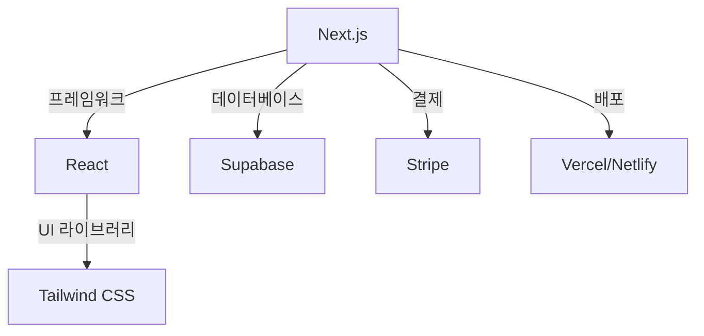

# 30분만에 SaaS 런칭하기 - 부스터 템플릿 활용 가이드 🚀

> **💡 핵심 메시지**: "템플릿 없이 개발하는 것은 집을 지을 때 포크레인부터 가져오는 것과 같다. 이미 검증된 템플릿을 활용하여 핵심 비즈니스 로직에 집중하자!"

## 📋 목차
1. [[#영상 개요]]
2. [[#왜 템플릿이 필요한가]]
3. [[#부스터 템플릿 소개]]
4. [[#30분 실습 과정]]
5. [[#초보자를 위한 핵심 개념]]
6. [[#실전 활용 팁]]
7. [[#자주 묻는 질문]]

## 영상 개요

### 📺 기본 정보
- **제목**: 30분만에 SaaS 런칭하기 (with 부스터 템플릿)
- **채널**: 커서맛피아 (Cursor맛피아)
- **진행자**: 캡틴강
- **주요 주제**: AI 코딩 도구(Claude Code, Cursor)를 활용한 빠른 SaaS 개발

### 🎯 대상 독자
- **프로그래밍 초보자**: 코딩 경험이 적지만 웹 서비스를 만들고 싶은 분
- **인디 개발자**: 혼자서 빠르게 MVP(최소 기능 제품)를 만들고자 하는 분
- **스타트업 창업가**: 아이디어를 빠르게 검증하고 싶은 분
- **AI 코딩 도구 학습자**: Claude Code나 Cursor를 활용하고 싶은 분

## 왜 템플릿이 필요한가

### 🏗️ 집 짓기 비유로 이해하기

**❌ 템플릿 없이 개발하기 = 맨땅에서 집 짓기**
```
포크레인 가져오기 → 터 파기 → 기초 공사 → 골조 → 마감
(시간: 6개월~1년, 비용: 막대함, 전문 지식 필요)
```

**✅ 템플릿 활용하여 개발하기 = 아파트 입주 후 인테리어**
```
이미 지어진 아파트 선택 → 가구 배치 → 나만의 공간 꾸미기
(시간: 30분~1일, 비용: 최소화, 즉시 시작 가능)
```

### 📊 템플릿 사용의 장점

1. **⏰ 시간 절약**
   - 기초 설정에 드는 시간 90% 단축
   - 인증, 결제, DB 설정 등 기본 기능 즉시 사용 가능

2. **💰 비용 절감**
   - 개발 시간 단축으로 인건비 절약
   - 검증된 코드로 버그 수정 비용 감소

3. **🛡️ 안정성 확보**
   - 이미 테스트된 코드 사용
   - 보안 취약점 최소화

4. **🎯 핵심 집중**
   - 비즈니스 로직에만 집중 가능
   - 차별화된 기능 개발에 시간 투자

## 부스터 템플릿 소개

### 🔧 부스터 템플릿이란?

**부스터 템플릿**은 SaaS(Software as a Service) 개발에 필요한 모든 기본 기능이 미리 구현된 스타터 키트입니다.

### 📦 포함된 기본 기능

#### 1. **사용자 관리 시스템** 👤
- 회원가입/로그인
- 비밀번호 재설정
- 프로필 관리
- 소셜 로그인 (Google, GitHub 등)

#### 2. **결제 시스템** 💳
- Stripe 연동
- 구독 플랜 관리
- 결제 내역 조회
- 환불 처리

#### 3. **데이터베이스 구조** 🗄️
- Supabase 연동
- 기본 테이블 구조
- 실시간 데이터 동기화

#### 4. **이메일 시스템** 📧
- 회원가입 환영 이메일
- 비밀번호 재설정 이메일
- 마케팅 이메일 템플릿

#### 5. **관리자 대시보드** 📊
- 사용자 통계
- 매출 현황
- 사용자 관리

## 30분 실습 과정

### ⚡ 빠른 시작 가이드 (초보자용)

#### 🔹 Step 1: 환경 준비 (5분)
```bash
# 1. Node.js 설치 확인
node --version  # v18 이상 권장

# 2. Git 설치 확인
git --version

# 3. AI 코딩 도구 준비
# Claude Code 또는 Cursor 설치
```

#### 🔹 Step 2: 템플릿 다운로드 (2분)
```bash
# 부스터 템플릿 클론
git clone https://github.com/booster-template/saas-starter
cd saas-starter

# 필요한 패키지 설치
npm install
```

#### 🔹 Step 3: 환경 변수 설정 (5분)
```env
# .env.local 파일 생성
NEXT_PUBLIC_SUPABASE_URL=your_supabase_url
NEXT_PUBLIC_SUPABASE_ANON_KEY=your_supabase_key
STRIPE_SECRET_KEY=your_stripe_key
```

#### 🔹 Step 4: 로컬 실행 (3분)
```bash
# 개발 서버 시작
npm run dev

# 브라우저에서 확인
# http://localhost:3000
```

#### 🔹 Step 5: AI로 커스터마이징 (10분)

**Claude Code 프롬프트 예시:**
```
"홈페이지의 히어로 섹션을 수정해주세요.
제목: '우리 서비스명'
부제: '서비스 설명'
버튼: '무료 체험 시작하기'"
```

#### 🔹 Step 6: 배포 (5분)
```bash
# Vercel로 배포
npx vercel

# 또는 Netlify로 배포
netlify deploy
```

## 초보자를 위한 핵심 개념

### 📚 꼭 알아야 할 용어 설명

#### **SaaS (Software as a Service)**
- **뜻**: 구독 방식의 웹 서비스
- **예시**: Netflix, Spotify, Notion
- **특징**: 월간/연간 구독료를 받는 비즈니스 모델

#### **MVP (Minimum Viable Product)**
- **뜻**: 최소 기능 제품
- **목적**: 아이디어를 빠르게 검증
- **예시**: 핵심 기능 1-2개만 있는 초기 버전

#### **API (Application Programming Interface)**
- **뜻**: 서비스 간 통신 규약
- **비유**: 레스토랑의 웨이터 (주문 전달)
- **예시**: 결제 API, 이메일 API

#### **프론트엔드 vs 백엔드**
- **프론트엔드**: 사용자가 보는 화면 (HTML, CSS, JavaScript)
- **백엔드**: 서버와 데이터베이스 (Node.js, Python)
- **풀스택**: 프론트엔드 + 백엔드 모두 다루기

### 🎨 기술 스택 이해하기



## 실전 활용 팁

### 💡 성공적인 SaaS 런칭을 위한 조언

#### 1. **Build in Public 전략** 🌍
- 개발 과정을 공개적으로 공유
- Twitter, LinkedIn에서 진행 상황 업데이트
- 초기 사용자 피드백 확보

#### 2. **니즈 검증 우선** 🎯
```
아이디어 → 랜딩 페이지 → 사전 신청 → MVP 개발 → 출시
         (1일)        (1주)      (2주)    (지속)
```

#### 3. **반복적 개선** 🔄
- 완벽한 제품보다 빠른 출시
- 사용자 피드백 기반 개선
- 매주 업데이트 배포

#### 4. **AI 도구 활용법** 🤖

**Claude Code 활용 시나리오:**
```
1. "이 컴포넌트에 다크모드 추가해줘"
2. "사용자 대시보드 페이지 만들어줘"
3. "이 버그 수정해줘: [에러 메시지]"
4. "이 코드 리팩토링해줘"
```

### 📈 성장 전략

#### **0→1 단계** (첫 고객 확보)
- 주변 지인에게 먼저 사용 요청
- 관련 커뮤니티에 공유
- 무료 체험 기간 제공

#### **1→10 단계** (초기 성장)
- 사용자 피드백 적극 반영
- 추천 프로그램 도입
- 콘텐츠 마케팅 시작

#### **10→100 단계** (확장)
- 자동화 시스템 구축
- 팀 구성 고려
- 투자 유치 검토

## 자주 묻는 질문

### ❓ Q&A

**Q1: 프로그래밍을 전혀 모르는데 가능한가요?**
> A: AI 코딩 도구를 활용하면 기초적인 수정은 가능합니다. 하지만 기본적인 HTML/CSS 지식은 도움이 됩니다. 온라인 무료 강의로 1-2주 학습을 추천합니다.

**Q2: 템플릿 비용은 얼마인가요?**
> A: 오픈소스 템플릿은 무료입니다. 프리미엄 템플릿은 $50-$500 수준입니다. 시간 절약을 고려하면 충분한 가치가 있습니다.

**Q3: 어떤 아이디어가 좋은가요?**
> A: 본인이 겪는 불편함을 해결하는 것부터 시작하세요. 복잡한 것보다 단순하지만 명확한 문제 해결이 중요합니다.

**Q4: Vercel vs Netlify 뭐가 좋나요?**
> A: 둘 다 훌륭합니다. Next.js 사용 시 Vercel, 정적 사이트는 Netlify를 추천합니다. 무료 플랜으로 시작 가능합니다.

**Q5: 혼자서도 운영 가능한가요?**
> A: 초기에는 충분히 가능합니다. 자동화 도구를 잘 활용하고, 성장하면 팀을 구성하세요.

## 🎯 실행 체크리스트

### 오늘 당장 시작하기
- [ ] Node.js, Git 설치
- [ ] Claude Code 또는 Cursor 설치
- [ ] 부스터 템플릿 다운로드
- [ ] 로컬에서 실행 확인
- [ ] 간단한 수정 시도 (로고, 텍스트)
- [ ] Vercel에 배포
- [ ] 주변에 공유하고 피드백 받기

### 이번 주 목표
- [ ] 핵심 기능 1개 정의
- [ ] AI 도구로 기능 구현
- [ ] 5명에게 테스트 요청
- [ ] 피드백 정리 및 개선
- [ ] 랜딩 페이지 완성

### 이번 달 목표
- [ ] MVP 완성
- [ ] 10명의 베타 테스터 확보
- [ ] 피드백 기반 v2.0 계획
- [ ] 마케팅 채널 1개 운영 시작
- [ ] 첫 유료 고객 확보

## 📚 추가 학습 자료

### 추천 리소스
1. **무료 강의**
   - [[생활코딩 HTML/CSS 기초]]
   - [[노마드코더 Next.js 입문]]
   - [[드림코딩 JavaScript 기초]]

2. **참고 템플릿**
   - [Shipfast](https://shipfa.st/)
   - [Divjoy](https://divjoy.com/)
   - [Makerkit](https://makerkit.dev/)

3. **커뮤니티**
   - 디스콘 (한국 개발자 커뮤니티)
   - 인디해커스 (Indie Hackers)
   - Product Hunt (제품 런칭)

4. **도구**
   - Figma (디자인)
   - Notion (프로젝트 관리)
   - Plausible (분석)

## 💬 핵심 인사이트

> "완벽한 제품을 만들려다 출시조차 못하는 것보다, 60% 완성도로 빠르게 출시하고 개선하는 것이 낫다."

> "템플릿은 시작점일 뿐, 당신만의 독특한 가치를 더하는 것이 진짜 경쟁력이다."

> "AI 코딩 도구는 마법이 아니다. 하지만 학습 곡선을 크게 낮춰주는 강력한 도우미다."

## 🔗 연결된 노트
- [[AI 코딩 도구 완벽 가이드]]
- [[SaaS 비즈니스 모델 이해하기]]
- [[MVP 개발 전략]]
- [[Claude Code 실전 활용법]]
- [[Cursor 마스터 클래스]]
- [[인디 해커의 성공 공식]]

---

**📌 Note**: 이 가이드는 초보자의 관점에서 작성되었습니다. 기술적인 부분이 어렵게 느껴진다면, 하나씩 천천히 따라해보세요. 모든 전문가도 처음에는 초보자였습니다! 🌱

## 🧠 Connected Insights

> 📅 Last analyzed: 2025. 12. 20. 오후 11:40:28
> 💰 Analysis cost: $0.0217

### 🔗 Related Notes

- ✅ [[R - Resources/AI 및 개발/개발 도구 가이드/AI 코딩 에이전트-초보자-완벽-마스터-가이드.md]]
  - supports: AI 코딩 에이전트(Claude Code 등) 초보자 가이드로, 분석 노트의 AI 도구 활용(Claude Code, Cursor)과 실습 과정을 지지하며 초보자 대상 학습 경로를 보완.
  - Confidence: ████░ (85%)

- 🔼 [[R - Resources/AI 및 개발/AI 기술 자료/Claude Code 활용/Claude Code로 90분만에 MVP 앱 구축하기 - 실전 가이드.md]]
  - extends: Claude Code를 활용한 90분 MVP 구축 가이드가 분석 노트의 30분 SaaS 런칭 실습(Claude Code 프롬프트 예시 포함)을 확장하며, MVP 개념과 AI 커스터마이징을 구체화.
  - Confidence: █████ (90%)

- ✅ [[R - Resources/AI 및 개발/개발 도구 가이드/초보_개발자를_위한_AI_시대_코딩_학습_완벽_가이드.md]]
  - supports: 초보자 AI 코딩 학습 로드맵이 분석 노트의 초보자 대상 핵심 개념(SaaS, MVP, 기술 스택)과 환경 준비 단계를 지지하며, 학습 기반을 강화.
  - Confidence: ████░ (82%)

- 🔗 [[R - Resources/개인 연구 자료/허민님_연구자료/AI_부트캠프_완전_링크_분석_2025-06-24.md]]
  - related: AI 부트캠프 링크 분석에 Claude Code 개발 환경 구축 가이드 등 포함되어 분석 노트의 AI 코딩 도구와 템플릿 활용 주제와 연관되지만, 직접적 확장은 아님.
  - Confidence: ████░ (78%)

- 🔗 [[R - Resources/개인 연구 자료/허민님_연구자료/인터뷰 질문지 - 임근석 대표님 (AI 시대의 개발자와 도메인 전문가).md]]
  - related: AI 시대 개발자 역할 변화 논의가 분석 노트의 초보자 풀스택 개발과 AI 도구 활용(바이브 코딩 유사)을 연결하지만, SaaS 특화되지 않음.
  - Confidence: ████░ (75%)

### 📚 Knowledge Gaps

- 🔴 **부스터 템플릿의 고급 커스터마이징과 코드 리뷰**
  - 기본 실습은 제공되지만, 템플릿 내부 코드 구조 분석이나 복잡한 비즈니스 로직 추가(예: AI 기능 통합)가 부족해 초보자가 장기 유지보수 시 어려움
  - Suggested resources: 부스터 템플릿 GitHub 리포지토리 공식 문서, Next.js Supabase Stripe 통합 튜토리얼 (Vercel Docs)

- 🟡 **SaaS 배포 후 운영 및 스케일링**
  - 런칭까지는 상세하나, 사용자 성장 시 모니터링, A/B 테스트, 비용 최적화(Supabase/Stripe)가 미뤄져 지속 가능성 검증 부족
  - Suggested resources: Vercel Analytics 가이드, Stripe Billing 베스트 프랙티스 문서

- 🔴 **SaaS 보안 및 컴플라이언스**
  - 기본 보안 언급되지만, GDPR, 데이터 보호, API 보안 취약점 대응이 깊이 다루지 않아 실제 비즈니스 적용 시 리스크
  - Suggested resources: Supabase Security Checklist, OWASP Top 10 for SaaS

### 💡 AI Insights

이 노트는 초보자를 위한 실용적 SaaS 런칭 템플릿 가이드로, AI 도구(Claude Code)와 검증된 스택(Next.js, Supabase, Stripe)을 강조하며 빠른 MVP 검증을 촉진. 관련 노트들과 결합 시 AI 기반 개발 워크플로우를 완성형 지식 네트워크로 구성 가능하나, 운영/보안 갭 보완 필요.
