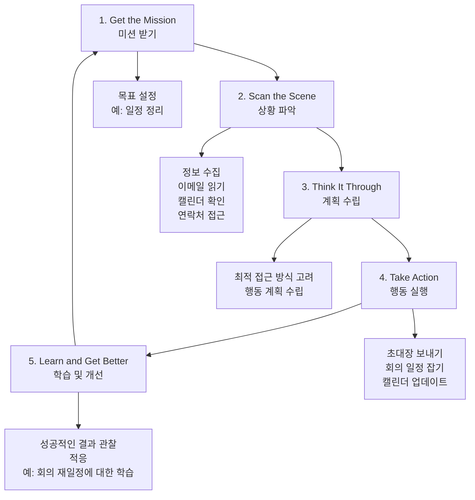
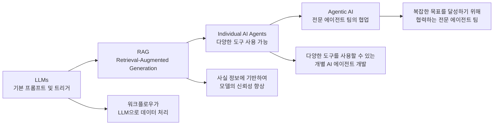
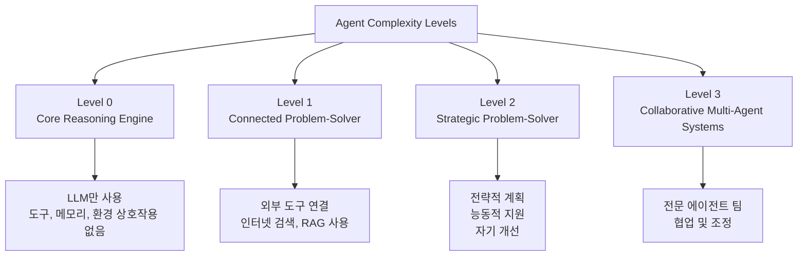
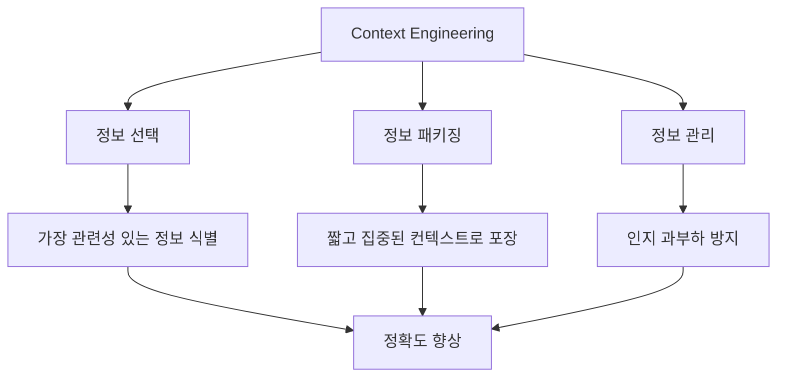
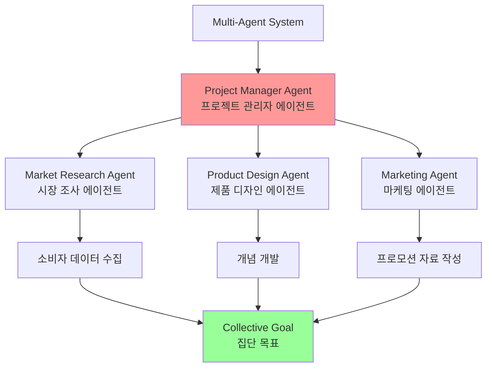
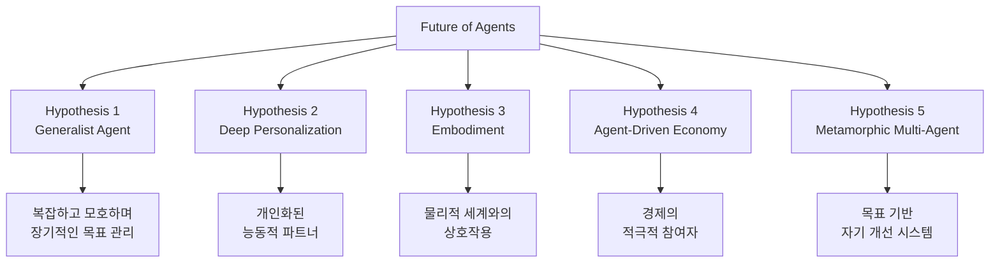
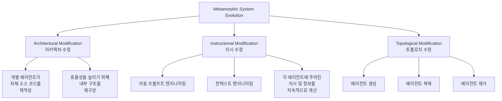

# What makes an AI system an Agent?

## 개요

In simple terms, an AI agent is a system designed to perceive its environment and take actions to achieve a specific goal. It's an evolution from a standard Large Language Model (LLM), enhanced with the abilities to plan, use tools, and interact with its surroundings. Think of an Agentic AI as a smart assistant that learns on the job.

간단히 말해서, AI 에이전트는 환경을 인지하고 특정 목표를 달성하기 위해 행동을 취하도록 설계된 시스템입니다. 이것은 표준 대형 언어 모델(LLM)의 진화로, 계획, 도구 사용, 주변 환경과의 상호작용 능력이 향상된 형태입니다. 에이전트 AI를 직장에서 배우는 스마트 어시스턴트로 생각하세요.

## 에이전트의 5단계 루프

AI 에이전트는 직업을 배우는 스마트 어시스턴트로 생각할 수 있습니다. 작업을 완료하기 위해 간단한 5단계 루프를 따릅니다:

### 단계별 상세 설명

#### 1. 미션 받기 (Get the Mission)
- 사용자가 목표를 제공합니다
- 예: "내 일정을 정리해줘"

#### 2. 상황 파악 (Scan the Scene)
- 필요한 모든 정보를 수집합니다
- 이메일 읽기, 캘린더 확인, 연락처 접근 등
- 현재 상황을 이해하기 위한 정보 수집

#### 3. 계획 수립 (Think It Through)
- 목표를 달성하기 위한 최적의 접근 방식을 고려합니다
- 행동 계획을 수립합니다

#### 4. 행동 실행 (Take Action)
- 계획을 실행합니다
- 초대장 보내기, 회의 일정 잡기, 캘린더 업데이트 등
- 예: 회의가 재일정되면 시스템은 이 이벤트로부터 학습하여 향후 성능을 향상시킵니다

#### 5. 학습 및 개선 (Learn and Get Better)
- 성공적인 결과를 관찰하고 그에 따라 적응합니다
- 예: 회의가 재일정되면 시스템은 이 이벤트로부터 학습하여 향후 성능을 향상시킵니다

## 에이전트의 현재 상황과 미래 전망

### 시장 현황

에이전트는 놀라운 속도로 인기를 얻고 있습니다:

- **기업 사용**: 대형 IT 회사의 대다수가 이러한 에이전트를 적극적으로 사용하고 있으며, 그 중 5분의 1은 지난 1년 이내에 시작했습니다
- **금융 시장**: 2024년 말까지 AI 에이전트 스타트업이 20억 달러 이상을 모금했으며, 시장 가치는 52억 달러로 평가되었습니다
- **미래 예측**: 2034년까지 거의 2,000억 달러의 가치로 폭발할 것으로 예상됩니다

### AI 패러다임의 진화

단 2년 만에 AI 패러다임이 극적으로 변화했습니다. 단순한 자동화에서 정교한 자율 시스템으로 이동했습니다:

#### 진화 단계

1. **초기 단계**: 워크플로우가 LLM으로 데이터를 처리하기 위한 기본 프롬프트와 트리거에 의존
2. **RAG 단계**: 사실 정보에 기반하여 모델의 신뢰성을 향상시키는 Retrieval-Augmented Generation(RAG) 개발
3. **개별 에이전트**: 다양한 도구를 사용할 수 있는 개별 AI 에이전트 개발
4. **에이전트 AI**: 복잡한 목표를 달성하기 위해 협력하는 전문 에이전트 팀의 시대

Fig 2.: Transitioning from LLMs to RAG, then to Agentic RAG, and finally to Agentic AI.

그림 2: LLM에서 RAG로, 그 다음 Agentic RAG로, 마지막으로 Agentic AI로의 전환.

The intent of this book is to discuss the design patterns of how specialized agents can work in concert and collaborate to achieve complex goals, and you will see one paradigm of collaboration and interaction in each chapter.

이 책의 의도는 전문 에이전트가 협력하여 복잡한 목표를 달성할 수 있는 방법의 디자인 패턴을 논의하는 것이며, 각 챕터에서 하나의 협업 및 상호작용 패러다임을 볼 수 있습니다.

Before doing that, let's examine examples that span the range of agent complexity (see Fig. 3).

그 전에, 에이전트 복잡성의 범위에 걸친 예제를 살펴보겠습니다(그림 3 참조).

## 에이전트 복잡성의 스펙트럼

에이전트는 복잡성의 범위에 걸쳐 다양한 수준으로 존재합니다:

### Level 0: 핵심 추론 엔진 (The Core Reasoning Engine)

Level 0: The Core Reasoning Engine

While an LLM is not an agent in itself, it can serve as the reasoning core of a basic agentic system. In a 'Level 0' configuration, the LLM operates without tools, memory, or environment interaction, responding solely based on its pretrained knowledge. Its strength lies in leveraging its extensive training data to explain established concepts. The trade-off for this powerful internal reasoning is a complete lack of current-event awareness.

LLM 자체는 에이전트가 아니지만, 기본 에이전트 시스템의 추론 핵심 역할을 할 수 있습니다. 'Level 0' 구성에서 LLM은 도구, 메모리 또는 환경 상호작용 없이 작동하며, 사전 훈련된 지식에만 기반하여 응답합니다. 그 강점은 확립된 개념을 설명하기 위해 광범위한 훈련 데이터를 활용하는 데 있습니다. 이 강력한 내부 추론에 대한 트레이드오프는 현재 이벤트 인식이 완전히 부족하다는 것입니다.

#### 특징
- 도구, 메모리, 환경 상호작용 없이 작동
- 사전 훈련된 지식에만 기반하여 응답
- 확립된 개념을 설명하는 데 강점

#### 제한사항
- 현재 이벤트 인식이 완전히 부족
- 예: 2025년 "최고 영화상" 오스카 수상자를 이름 지을 수 없음 (사전 훈련된 지식 밖의 정보인 경우)

### Level 1: 연결된 문제 해결자 (The Connected Problem-Solver)

Level 1: The Connected Problem-Solver

At this level, the LLM becomes a functional agent by connecting to and utilizing external tools. Its problem-solving is no longer limited to its pre-trained knowledge. Instead, it can execute a sequence of actions to gather and process information from sources like the internet (via search) or databases (via Retrieval Augmented Generation, or RAG).

이 수준에서 LLM은 외부 도구에 연결하고 활용함으로써 기능적 에이전트가 됩니다. 문제 해결이 더 이상 사전 훈련된 지식에 국한되지 않습니다. 대신, 인터넷(검색을 통해) 또는 데이터베이스(Retrieval Augmented Generation 또는 RAG를 통해)와 같은 소스에서 정보를 수집하고 처리하기 위한 일련의 행동을 실행할 수 있습니다.

#### 특징
- 문제 해결이 사전 훈련된 지식에 국한되지 않음
- 정보를 수집하고 처리하기 위한 일련의 행동을 실행할 수 있음
- 인터넷(검색을 통해) 또는 데이터베이스(RAG를 통해)와 같은 소스에서 정보를 수집하고 처리

#### 예시: 새로운 TV 쇼 찾기
For instance, to find new TV shows, the agent recognizes the need for current information, uses a search tool to find it, and then synthesizes the results.

예를 들어, 새로운 TV 쇼를 찾기 위해 에이전트는 현재 정보가 필요하다는 것을 인식하고, 검색 도구를 사용하여 정보를 찾은 다음 결과를 종합합니다.

#### 특수 도구 사용
Crucially, it can also use specialized tools for higher accuracy, such as calling a financial API to get the live stock price for AAPL.

정확도를 높이기 위해 특수 도구를 사용할 수 있습니다. 예를 들어, AAPL의 실시간 주가를 얻기 위해 금융 API를 호출할 수 있습니다.

#### 핵심 능력
This ability to interact with the outside world across multiple steps is the core capability of a Level 1 agent.

여러 단계에 걸쳐 외부 세계와 상호작용하는 능력이 Level 1 에이전트의 핵심 능력입니다.

For detailed information, refer to Chapter 14.

자세한 정보는 챕터 14를 참조하세요.

### Level 2: 전략적 문제 해결자 (The Strategic Problem-Solver)

이 수준에서 에이전트의 능력은 전략적 계획, 능동적 지원, 자기 개선을 포함하여 크게 확장됩니다.

#### 핵심 기능

##### 1. 전략적 문제 해결
- 단일 도구 사용을 넘어 복잡한 다중 부분 문제를 다룸
- 일련의 행동을 실행하면서 능동적으로 **컨텍스트 엔지니어링** 수행

##### 2. 컨텍스트 엔지니어링 (Context Engineering)

At this level, an agent's capabilities expand significantly, encompassing strategic planning, proactive assistance, and self-improvement, with prompt engineering and context engineering as core enabling skills.

이 수준에서 에이전트의 능력은 전략적 계획, 능동적 지원, 자기 개선을 포함하여 크게 확장되며, 프롬프트 엔지니어링과 컨텍스트 엔지니어링이 핵심 활성화 기술입니다.

First, the agent moves beyond single-tool use to tackle complex, multi-part problems through strategic problem-solving. As it executes a sequence of actions, it actively performs context engineering: the strategic process of selecting, packaging, and managing the most relevant information for each step.

먼저, 에이전트는 단일 도구 사용을 넘어 전략적 문제 해결을 통해 복잡한 다중 부분 문제를 다룹니다. 일련의 행동을 실행하면서 능동적으로 컨텍스트 엔지니어링을 수행합니다: 각 단계에 가장 관련성 있는 정보를 선택, 패키징, 관리하는 전략적 프로세스입니다.

**예시: 두 위치 사이의 커피숍 찾기**
1. 매핑 도구 사용
2. 출력을 엔지니어링하여 짧고 집중된 컨텍스트(예: 거리 이름 목록)로 큐레이션
3. 이를 로컬 검색 도구에 제공하여 인지 과부하를 방지하고 두 번째 단계를 효율적이고 정확하게 만듦

**핵심 원칙**: AI로부터 최대 정확도를 얻으려면 짧고 집중되고 강력한 컨텍스트를 제공해야 합니다.

To achieve maximum accuracy from an AI, it must be given a short, focused, and powerful context. Context engineering is the discipline that accomplishes this by strategically selecting, packaging, and managing the most critical information from all available sources. It effectively curates the model's limited attention to prevent overload and ensure high-quality, efficient performance on any given task. For detailed information, refer to the Appendix A.

AI로부터 최대 정확도를 얻으려면 짧고 집중되고 강력한 컨텍스트를 제공해야 합니다. 컨텍스트 엔지니어링은 사용 가능한 모든 소스에서 가장 중요한 정보를 전략적으로 선택, 패키징, 관리함으로써 이를 달성하는 학문입니다. 이는 모델의 제한된 주의를 효과적으로 큐레이션하여 과부하를 방지하고 주어진 작업에서 고품질, 효율적인 성능을 보장합니다. 자세한 정보는 부록 A를 참조하세요.

##### 3. 능동적이고 지속적인 운영

This level leads to proactive and continuous operation. A travel assistant linked to your email demonstrates this by engineering the context from a verbose flight confirmation email; it selects only the key details (flight numbers, dates, locations) to package for subsequent tool calls to your calendar and a weather API.

이 수준은 능동적이고 지속적인 운영으로 이어집니다. 이메일에 연결된 여행 어시스턴트는 장황한 항공 확인 이메일에서 컨텍스트를 엔지니어링하여 이를 보여줍니다. 주요 세부 정보(항공편 번호, 날짜, 위치)만 선택하여 캘린더 및 날씨 API에 대한 후속 도구 호출에 패키징합니다.

**예시: 여행 어시스턴트**
- 이메일에 연결된 여행 어시스턴트
- 장황한 항공 확인 이메일에서 컨텍스트를 엔지니어링
- 주요 세부 정보(항공편 번호, 날짜, 위치)만 선택하여 패키징
- 캘린더 및 날씨 API에 대한 후속 도구 호출에 사용

##### 4. 전문 분야에서의 워크플로우 관리

In specialized fields like software engineering, the agent manages an entire workflow by applying this discipline. When assigned a bug report, it reads the report and accesses the codebase, then strategically engineers these large sources of information into a potent, focused context that allows it to efficiently write, test, and submit the correct code patch.

소프트웨어 엔지니어링과 같은 전문 분야에서 에이전트는 이 학문을 적용하여 전체 워크플로우를 관리합니다. 버그 보고서가 할당되면, 보고서를 읽고 코드베이스에 접근한 다음, 이러한 대규모 정보 소스를 효율적으로 올바른 코드 패치를 작성, 테스트, 제출할 수 있도록 하는 강력하고 집중된 컨텍스트로 전략적으로 엔지니어링합니다.

**예시: 소프트웨어 엔지니어링**
- 버그 보고서가 할당되면:
  1. 보고서를 읽고 코드베이스에 접근
  2. 이러한 대규모 정보 소스를 강력하고 집중된 컨텍스트로 전략적으로 엔지니어링
  3. 이를 통해 효율적으로 올바른 코드 패치를 작성, 테스트, 제출

##### 5. 자기 개선

Finally, the agent achieves self-improvement by refining its own context engineering processes. When it asks for feedback on how a prompt could have been improved, it is learning how to better curate its initial inputs. This allows it to automatically improve how it packages information for future tasks, creating a powerful, automated feedback loop that increases its accuracy and efficiency over time. For detailed information, refer to Chapter 17.

마지막으로, 에이전트는 자체 컨텍스트 엔지니어링 프로세스를 개선하여 자기 개선을 달성합니다. 프롬프트가 어떻게 개선될 수 있는지에 대한 피드백을 요청할 때, 초기 입력을 더 잘 큐레이션하는 방법을 학습합니다. 이를 통해 향후 작업을 위해 정보를 패키징하는 방법을 자동으로 개선하여 시간이 지남에 따라 정확도와 효율성을 증가시키는 강력한 자동 피드백 루프를 생성합니다. 자세한 정보는 챕터 17을 참조하세요.

### Level 3: 협업 다중 에이전트 시스템의 부상 (The Rise of Collaborative Multi-Agent Systems)

Level 3: The Rise of Collaborative Multi-Agent Systems

At Level 3, we see a significant paradigm shift in AI development, moving away from the pursuit of a single, all-powerful super-agent and towards the rise of sophisticated, collaborative multi-agent systems. In essence, this approach recognizes that complex challenges are often best solved not by a single generalist, but by a team of specialists working in concert. This model directly mirrors the structure of a human organization, where different departments are assigned specific roles and collaborate to tackle multi-faceted objectives. The collective strength of such a system lies in this division of labor and the synergy created through coordinated effort.

Level 3에서는 AI 개발의 중요한 패러다임 전환이 일어납니다. 단일의 전능한 슈퍼 에이전트를 추구하는 것에서 벗어나 정교한 협업 다중 에이전트 시스템으로 이동합니다. 본질적으로, 이 접근 방식은 복잡한 도전이 종종 단일 일반주의가 아니라 협력하여 작동하는 전문가 팀에 의해 가장 잘 해결된다는 것을 인식합니다. 이 모델은 서로 다른 부서가 특정 역할을 할당받고 다면적 목표를 해결하기 위해 협력하는 인간 조직의 구조를 직접 반영합니다. 이러한 시스템의 집단적 강점은 이러한 노동 분업과 조정된 노력을 통해 생성된 시너지에 있습니다.

#### 핵심 개념

이 접근 방식은 복잡한 도전이 종종 단일 일반주의가 아니라 협력하여 작동하는 전문가 팀에 의해 가장 잘 해결된다는 것을 인식합니다.

#### 예시: 신제품 출시 워크플로우

To bring this concept to life, consider the intricate workflow of launching a new product. Rather than one agent attempting to handle every aspect, a "Project Manager" agent could serve as the central coordinator. This manager would orchestrate the entire process by delegating tasks to other specialized agents: a "Market Research" agent to gather consumer data, a "Product Design" agent to develop concepts, and a "Marketing" agent to craft promotional materials.

이 개념을 생생하게 만들기 위해 신제품 출시의 복잡한 워크플로우를 고려해보세요. 하나의 에이전트가 모든 측면을 처리하려고 시도하는 것보다, "프로젝트 관리자" 에이전트가 중앙 조정자 역할을 할 수 있습니다. 이 관리자는 다른 전문 에이전트에 작업을 위임하여 전체 프로세스를 조정합니다: 소비자 데이터를 수집하는 "시장 조사" 에이전트, 개념을 개발하는 "제품 디자인" 에이전트, 프로모션 자료를 작성하는 "마케팅" 에이전트.

**단일 에이전트 접근**:
- 하나의 에이전트가 모든 측면을 처리하려고 시도

**다중 에이전트 접근**:
- **프로젝트 관리자 에이전트**: 중앙 조정자 역할
- **시장 조사 에이전트**: 소비자 데이터 수집
- **제품 디자인 에이전트**: 개념 개발
- **마케팅 에이전트**: 프로모션 자료 작성

**성공의 핵심**: 원활한 통신과 정보 공유를 통해 모든 개별 노력이 집단 목표를 달성하기 위해 정렬되도록 보장

The key to their success would be the seamless communication and information sharing between them, ensuring all individual efforts align to achieve the collective goal.

성공의 핵심은 원활한 통신과 정보 공유를 통해 모든 개별 노력이 집단 목표를 달성하기 위해 정렬되도록 보장하는 것입니다.

#### 현재의 한계

While this vision of autonomous, team-based automation is already being developed, it's important to acknowledge the current hurdles. The effectiveness of such multi-agent systems is presently constrained by the reasoning limitations of LLMs they are using. Furthermore, their ability to genuinely learn from one another and improve as a cohesive unit is still in its early stages. Overcoming these technological bottlenecks is the critical next step, and doing so will unlock the profound promise of this level: the ability to automate entire business workflows from start to finish.

이 자율적 팀 기반 자동화의 비전은 이미 개발되고 있지만, 현재의 장애물을 인정하는 것이 중요합니다. 이러한 다중 에이전트 시스템의 효과는 현재 사용 중인 LLM의 추론 제한에 의해 제약됩니다. 또한, 서로로부터 진정으로 학습하고 응집력 있는 단위로 개선하는 능력은 여전히 초기 단계입니다. 이러한 기술적 병목을 극복하는 것이 중요한 다음 단계이며, 이를 통해 이 수준의 깊은 약속을 잠금 해제할 수 있습니다: 처음부터 끝까지 전체 비즈니스 워크플로우를 자동화하는 능력입니다.

For detailed information, refer to Chapter 7.

자세한 정보는 챕터 7을 참조하세요.

## The Future of Agents: Top 5 Hypotheses

## 에이전트의 미래: 상위 5가지 가설

AI agent development is progressing at an unprecedented pace across domains such as software automation, scientific research, and customer service among others. While current systems are impressive, they are just the beginning. The next wave of innovation will likely focus on making agents more reliable, collaborative, and deeply integrated into our lives. Here are five leading hypotheses for what's next (see Fig. 4).

AI 에이전트 개발은 소프트웨어 자동화, 과학 연구, 고객 서비스 등 다양한 영역에서 전례 없는 속도로 진행되고 있습니다. 현재 시스템은 인상적이지만, 이는 시작에 불과합니다. 혁신의 다음 물결은 아마도 에이전트를 더 신뢰할 수 있고, 협력적이며, 우리의 삶에 깊이 통합되도록 만드는 데 집중할 것입니다. 다음은 다음에 올 것에 대한 다섯 가지 주요 가설입니다(그림 4 참조).

### 가설 1: 일반주의 에이전트의 출현 (The Emergence of the Generalist Agent)

Hypothesis 1: The Emergence of the Generalist Agent

The first hypothesis is that AI agents will evolve from narrow specialists into true generalists capable of managing complex, ambiguous, and long-term goals with high reliability.

첫 번째 가설은 AI 에이전트가 좁은 전문가에서 진정한 일반주의로 진화하여 복잡하고 모호하며 장기적인 목표를 높은 신뢰성으로 관리할 수 있다는 것입니다.

#### 예시: 회사 오프사이트 리트리트 계획

For instance, you could give an agent a simple prompt like, "Plan my company's offsite retreat for 30 people in Lisbon next quarter." The agent would then manage the entire project for weeks, handling everything from budget approvals and flight negotiations to venue selection and creating a detailed itinerary from employee feedback, all while providing regular updates.

예를 들어, "다음 분기에 리스본에서 30명을 위한 회사 오프사이트 리트리트를 계획해줘"와 같은 간단한 프롬프트를 에이전트에게 줄 수 있습니다. 그러면 에이전트는 몇 주 동안 전체 프로젝트를 관리하며, 예산 승인 및 항공편 협상부터 장소 선택 및 직원 피드백에서 상세한 일정 생성까지 모든 것을 처리하면서 정기적인 업데이트를 제공합니다.

**요청**: "다음 분기에 리스본에서 30명을 위한 회사 오프사이트 리트리트를 계획해줘"

**에이전트의 역할**:
- 몇 주 동안 전체 프로젝트 관리
- 예산 승인 처리
- 항공편 협상
- 장소 선택
- 직원 피드백에서 상세한 일정 생성
- 정기적인 업데이트 제공

#### 요구사항

Achieving this level of autonomy will require fundamental breakthroughs in AI reasoning, memory, and near-perfect reliability.

이 수준의 자율성을 달성하려면 AI 추론, 메모리, 거의 완벽한 신뢰성에서 근본적인 돌파구가 필요합니다.

#### 대안적 접근: 소형 언어 모델 (SLMs)

An alternative, yet not mutually exclusive, approach is the rise of Small Language Models (SLMs). This "Lego-like" concept involves composing systems from small, specialized expert agents rather than scaling up a single monolithic model. This method promises systems that are cheaper, faster to debug, and easier to deploy. Ultimately, the development of large generalist models and the composition of smaller specialized ones are both plausible paths forward, and they could even complement each other.

상호 배타적이지 않은 대안적 접근 방식은 소형 언어 모델(SLMs)의 부상입니다. 이 "레고 같은" 개념은 단일 거대 모델을 확장하는 대신 작고 전문적인 전문가 에이전트로 시스템을 구성하는 것을 포함합니다. 이 방법은 더 저렴하고, 디버깅이 빠르며, 배포가 쉬운 시스템을 약속합니다. 궁극적으로, 대형 일반주의 모델의 개발과 작은 전문가의 구성은 모두 가능한 전진 경로이며, 서로 보완할 수도 있습니다.

**레고 같은 개념**:
- 단일 거대 모델을 확장하는 대신 작고 전문적인 전문가 에이전트로 시스템을 구성
- 더 저렴하고, 디버깅이 빠르며, 배포가 쉬운 시스템 약속

**결론**: 대형 일반주의 모델의 개발과 작은 전문가의 구성은 모두 가능한 전진 경로이며, 서로 보완할 수도 있습니다.

### 가설 2: 깊은 개인화 및 능동적 목표 발견 (Deep Personalization and Proactive Goal Discovery)

Hypothesis 2: Deep Personalization and Proactive Goal Discovery

The second hypothesis posits that agents will become deeply personalised and proactive partners. We are witnessing the emergence of a new class of agent: the proactive partner. By learning from your unique patterns and goals, these systems are beginning to shift from just following orders to anticipating your needs.

두 번째 가설은 에이전트가 깊이 개인화되고 능동적인 파트너가 될 것이라는 것입니다. 우리는 새로운 종류의 에이전트인 능동적 파트너의 출현을 목격하고 있습니다. 고유한 패턴과 목표로부터 학습함으로써, 이러한 시스템은 단순히 명령을 따르는 것에서 필요를 예측하는 것으로 전환하기 시작하고 있습니다.

#### 능동적 파트너의 출현

우리는 새로운 종류의 에이전트인 능동적 파트너의 출현을 목격하고 있습니다:

- 고유한 패턴과 목표로부터 학습
- 단순히 명령을 따르는 것에서 필요를 예측하는 것으로 전환

#### AI 시스템이 에이전트로 작동하는 경우

AI systems operate as agents when they move beyond simply responding to chats or instructions. They initiate and execute tasks on behalf of the user, actively collaborating in the process. This moves beyond simple task execution into the realm of proactive goal discovery.

AI 시스템은 단순히 채팅이나 지시에 응답하는 것을 넘어서면 에이전트로 작동합니다. 사용자를 대신하여 작업을 시작하고 실행하며, 프로세스에서 능동적으로 협력합니다. 이것은 단순한 작업 실행을 넘어 능동적 목표 발견의 영역으로 이동합니다.

- 사용자를 대신하여 작업을 시작하고 실행
- 프로세스에서 능동적으로 협력
- 단순한 작업 실행을 넘어 능동적 목표 발견의 영역으로 이동

#### 예시: 지속 가능한 에너지 탐색

For instance, if you're exploring sustainable energy, the agent might identify your latent goal and proactively support it by suggesting courses or summarizing research.

예를 들어, 지속 가능한 에너지를 탐색하고 있다면, 에이전트는 잠재적 목표를 식별하고 코스 제안 또는 연구 요약을 통해 능동적으로 지원할 수 있습니다.

- 에이전트가 잠재적 목표를 식별
- 능동적으로 지원: 코스 제안 또는 연구 요약
- 아직 완전히 표현하지 못한 야망을 발견하고 달성하는 데 도움

#### 미래 전망

While these systems are still developing, their trajectory is clear. They will become increasingly proactive, learning to take initiative on your behalf when highly confident that the action will be helpful. Ultimately, the agent becomes an indispensable ally, helping you discover and achieve ambitions you have yet to fully articulate.

이러한 시스템은 여전히 개발 중이지만, 그 궤적은 명확합니다. 점점 더 능동적이 되어 행동이 도움이 될 것이라고 매우 확신할 때 당신을 대신하여 주도권을 잡는 방법을 학습할 것입니다. 궁극적으로 에이전트는 필수적인 동맹이 되어 아직 완전히 표현하지 못한 야망을 발견하고 달성하는 데 도움을 줍니다.

- 점점 더 능동적이 될 것
- 매우 확신할 때 당신을 대신하여 주도권을 잡는 방법을 학습
- 궁극적으로 에이전트는 필수적인 동맹이 되어 아직 완전히 표현하지 못한 야망을 발견하고 달성하는 데 도움

### 가설 3: 구현체화 및 물리적 세계 상호작용 (Embodiment and Physical World Interaction)

Hypothesis 3: Embodiment and Physical World Interaction

This hypothesis foresees agents breaking free from their purely digital confines to operate in the physical world. By integrating agentic AI with robotics, we will see the rise of "embodied agents."

세 번째 가설은 에이전트가 순수한 디지털 경계에서 벗어나 물리적 세계에서 작동할 것이라는 것입니다. 에이전트 AI와 로봇 공학을 통합함으로써 "구현체화된 에이전트"의 부상을 볼 수 있습니다.

#### 구현체화된 에이전트 (Embodied Agents)

에이전트 AI와 로봇 공학을 통합함으로써 "구현체화된 에이전트"의 부상을 볼 수 있습니다.

#### 예시: 집 에이전트가 수도꼭지 수리

Instead of just booking a handyman, you might ask your home agent to fix a leaky tap. The agent would use its vision sensors to perceive the problem, access a library of plumbing knowledge to formulate a plan, and then control its robotic manipulators with precision to perform the repair.

수리공을 예약하는 대신, 집 에이전트에게 누수하는 수도꼭지를 고쳐달라고 요청할 수 있습니다. 에이전트는 비전 센서를 사용하여 문제를 인지하고, 배관 지식 라이브러리에 접근하여 계획을 수립한 다음, 로봇 조작기를 정밀하게 제어하여 수리를 수행합니다.

**요청**: "집 에이전트에게 누수하는 수도꼭지를 고쳐달라고 요청"

**에이전트의 프로세스**:
1. **인지**: 비전 센서를 사용하여 문제를 인지
2. **계획 수립**: 배관 지식 라이브러리에 접근하여 계획 수립
3. **실행**: 로봇 조작기를 정밀하게 제어하여 수리 수행

#### 의미

This would represent a monumental step, bridging the gap between digital intelligence and physical action, and transforming everything from manufacturing and logistics to elder care and home maintenance.

이것은 디지털 지능과 물리적 행동 사이의 격차를 메우는 기념비적인 단계를 나타내며, 제조 및 물류부터 노인 돌봄 및 홈 유지보수까지 모든 것을 변환할 것입니다.

- 제조 및 물류부터 노인 돌봄 및 홈 유지보수까지 모든 것을 변환
- 디지털 지능과 물리적 행동의 통합

### 가설 4: 에이전트 주도 경제 (The Agent-Driven Economy)

Hypothesis 4: The Agent-Driven Economy

The fourth hypothesis is that highly autonomous agents will become active participants in the economy, creating new markets and business models. We could see agents acting as independent economic entities, tasked with maximising a specific outcome, such as profit.

네 번째 가설은 고도로 자율적인 에이전트가 경제의 적극적인 참여자가 되어 새로운 시장과 비즈니스 모델을 창출할 것이라는 것입니다. 에이전트가 이익과 같은 특정 결과를 극대화하는 임무를 받은 독립적 경제 엔티티로 작동하는 것을 볼 수 있습니다.

#### 독립적 경제 엔티티로서의 에이전트

에이전트는 이익과 같은 특정 결과를 극대화하는 임무를 받은 독립적 경제 엔티티로 작동할 수 있습니다.

#### 예시: 전자상거래 비즈니스 운영

An entrepreneur could launch an agent to run an entire e-commerce business. The agent would identify trending products by analysing social media, generate marketing copy and visuals, manage supply chain logistics by interacting with other automated systems, and dynamically adjust pricing based on real-time demand.

기업가는 전체 전자상거래 비즈니스를 운영하는 에이전트를 시작할 수 있습니다. 에이전트는 소셜 미디어를 분석하여 트렌딩 제품을 식별하고, 마케팅 복사 및 시각 자료를 생성하며, 다른 자동화된 시스템과 상호작용하여 공급망 물류를 관리하고, 실시간 수요를 기반으로 동적으로 가격을 조정합니다.

**기업가의 행동**: 전체 전자상거래 비즈니스를 운영하는 에이전트를 시작

**에이전트의 역할**:
1. **트렌드 식별**: 소셜 미디어를 분석하여 트렌딩 제품 식별
2. **콘텐츠 생성**: 마케팅 복사 및 시각 자료 생성
3. **공급망 관리**: 다른 자동화된 시스템과 상호작용하여 공급망 물류 관리
4. **가격 조정**: 실시간 수요를 기반으로 동적으로 가격 조정

#### 에이전트 경제

This shift would create a new, hyper-efficient "agent economy" operating at a speed and scale impossible for humans to manage directly.

이 전환은 인간이 직접 관리할 수 없는 속도와 규모로 운영되는 새로운 초효율적인 "에이전트 경제"를 창출할 것입니다.

### 가설 5: 목표 기반, 변형 다중 에이전트 시스템 (The Goal-Driven, Metamorphic Multi-Agent System)

Hypothesis 5: The Goal-Driven, Metamorphic Multi-Agent System

This hypothesis posits the emergence of intelligent systems that operate not from explicit programming, but from a declared goal. The user simply states the desired outcome, and the system autonomously figures out how to achieve it. This marks a fundamental shift towards metamorphic multi-agent systems capable of true self-improvement at both the individual and collective levels.

다섯 번째 가설은 명시적 프로그래밍이 아닌 선언된 목표에서 작동하는 지능형 시스템의 출현을 예측합니다. 사용자는 단순히 원하는 결과를 선언하고, 시스템은 자율적으로 이를 달성하는 방법을 알아냅니다. 이것은 개별 및 집단 수준 모두에서 진정한 자기 개선이 가능한 변형 다중 에이전트 시스템으로의 근본적인 전환을 표시합니다.

#### 핵심 개념

사용자는 단순히 원하는 결과를 선언하고, 시스템은 자율적으로 이를 달성하는 방법을 알아냅니다.

#### 변형 다중 에이전트 시스템

이것은 개별 및 집단 수준 모두에서 진정한 자기 개선이 가능한 변형 다중 에이전트 시스템으로의 근본적인 전환을 표시합니다.

#### 시스템의 특성

This system would be a dynamic entity, not a single agent. It would have the ability to analyze its own performance and modify the topology of its multi-agent workforce, creating, duplicating, or removing agents as needed to form the most effective team for the task at hand.

이 시스템은 단일 에이전트가 아닌 동적 엔티티입니다. 자체 성능을 분석하고 다중 에이전트 인력의 토폴로지를 수정하는 능력을 가지며, 작업에 가장 효과적인 팀을 형성하기 위해 필요에 따라 에이전트를 생성, 복제 또는 제거합니다.

- 자체 성능을 분석하고 다중 에이전트 인력의 토폴로지를 수정하는 능력
- 작업에 가장 효과적인 팀을 형성하기 위해 필요에 따라 에이전트를 생성, 복제 또는 제거

#### 다중 수준의 진화

이 진화는 여러 수준에서 발생합니다:

##### 1. 아키텍처 수정 (Architectural Modification)
- 가장 깊은 수준에서 개별 에이전트가 자체 소스 코드를 재작성하고 효율성을 높이기 위해 내부 구조를 재구성할 수 있음

##### 2. 지시 수정 (Instructional Modification)
- 더 높은 수준에서 시스템은 지속적으로 자동 프롬프트 엔지니어링 및 컨텍스트 엔지니어링을 수행
- 각 에이전트에 주어진 지시 및 정보를 개선하여 인간의 개입 없이 최적의 지도로 작동하도록 보장

##### 3. 토폴로지 수정 (Topological Modification)
- 시스템이 필요에 따라 에이전트를 생성, 복제 또는 제거하여 작업에 가장 효과적인 팀을 형성

#### 예시: 전자상거래 비즈니스 시작

For instance, an entrepreneur would simply declare the intent: "Launch a successful e-commerce business selling artisanal coffee." The system, without further programming, would spring into action. It might initially spawn a "Market Research" agent and a "Branding" agent. Based on the initial findings, it could decide to remove the branding agent and spawn three new specialized agents: a "Logo Design" agent, a "Webstore Platform" agent, and a "Supply Chain" agent. It would constantly tune their internal prompts for better performance. If the webstore agent becomes a bottleneck, the system might duplicate it into three parallel agents to work on different parts of the site, effectively re-architecting its own structure on the fly to best achieve the declared goal.

예를 들어, 기업가는 단순히 의도를 선언할 것입니다: "수공예 커피를 판매하는 성공적인 전자상거래 비즈니스를 시작하세요." 시스템은 추가 프로그래밍 없이 즉시 작동할 것입니다. 초기에 "시장 조사" 에이전트와 "브랜딩" 에이전트를 생성할 수 있습니다. 초기 결과를 기반으로 브랜딩 에이전트를 제거하고 세 개의 새로운 전문 에이전트를 생성할 수 있습니다: "로고 디자인" 에이전트, "웹스토어 플랫폼" 에이전트, "공급망" 에이전트. 성능 향상을 위해 내부 프롬프트를 지속적으로 조정할 것입니다. 웹스토어 에이전트가 병목이 되면, 시스템은 이를 세 개의 병렬 에이전트로 복제하여 사이트의 다른 부분에서 작업하도록 하여, 선언된 목표를 최상으로 달성하기 위해 자체 구조를 즉석에서 효과적으로 재구성할 수 있습니다.

**기업가의 선언**: "수공예 커피를 판매하는 성공적인 전자상거래 비즈니스를 시작하세요"

**시스템의 자율적 행동**:
1. **초기 생성**: "시장 조사" 에이전트와 "브랜딩" 에이전트 생성
2. **적응적 수정**: 초기 결과를 기반으로:
   - 브랜딩 에이전트 제거
   - 세 개의 새로운 전문 에이전트 생성:
     - "로고 디자인" 에이전트
     - "웹스토어 플랫폼" 에이전트
     - "공급망" 에이전트
3. **지속적 개선**: 성능 향상을 위해 내부 프롬프트를 지속적으로 조정
4. **병목 해결**: 웹스토어 에이전트가 병목이 되면 세 개의 병렬 에이전트로 복제하여 사이트의 다른 부분에서 작업
5. **동적 재구성**: 선언된 목표를 최상으로 달성하기 위해 자체 구조를 즉석에서 효과적으로 재구성

## Conclusion

## 결론

In essence, an AI agent represents a significant leap from traditional models, functioning as an autonomous system that perceives, plans, and acts to achieve specific goals. The evolution of this technology is advancing from single, tool-using agents to complex, collaborative multi-agent systems that tackle multifaceted objectives. Future hypotheses predict the emergence of generalist, personalized, and even physically embodied agents that will become active participants in the economy. This ongoing development signals a major paradigm shift towards self-improving, goal-driven systems poised to automate entire workflows and fundamentally redefine our relationship with technology.

본질적으로 AI 에이전트는 전통적인 모델에서 중요한 도약을 나타냅니다. 환경을 인지하고, 계획하고, 특정 목표를 달성하기 위해 행동하는 자율 시스템으로 작동합니다. 이 기술의 진화는 단일 도구 사용 에이전트에서 복잡한 협업 다중 에이전트 시스템으로 발전하여 다면적 목표를 다루고 있습니다. 미래 가설은 일반주의, 개인화, 심지어 물리적으로 구현된 에이전트의 출현을 예측하며, 이는 경제의 적극적인 참여자가 될 것입니다. 이 지속적인 개발은 전체 워크플로우를 자동화하고 기술과의 관계를 근본적으로 재정의할 준비가 된 자기 개선, 목표 기반 시스템으로의 주요 패러다임 전환을 나타냅니다.

## 핵심 요약

1. **에이전트의 5단계 루프**: 미션 받기 → 상황 파악 → 계획 수립 → 행동 실행 → 학습 및 개선

2. **AI 패러다임의 진화**: LLMs → RAG → Individual AI Agents → Agentic AI (협업 다중 에이전트 시스템)

3. **에이전트 복잡성 수준**:
   - Level 0: 핵심 추론 엔진 (도구, 메모리 없음)
   - Level 1: 연결된 문제 해결자 (외부 도구 사용)
   - Level 2: 전략적 문제 해결자 (컨텍스트 엔지니어링, 자기 개선)
   - Level 3: 협업 다중 에이전트 시스템 (전문가 팀의 협력)

4. **미래 가설**:
   - 일반주의 에이전트의 출현
   - 깊은 개인화 및 능동적 목표 발견
   - 구현체화 및 물리적 세계 상호작용
   - 에이전트 주도 경제
   - 목표 기반, 변형 다중 에이전트 시스템

5. **시장 전망**: 2034년까지 거의 2,000억 달러 규모로 성장할 것으로 예상

## 참고 자료

1. Cloudera, Inc. (April 2025), 96% of enterprises are increasing their use of AI agents.
   https://www.cloudera.com/about/news-and-blogs/press-releases/2025-04-16-96-percent-of-enterprises-are-expanding-use-of-ai-agents-according-to-latest-data-from-cloudera.html

2. Autonomous generative AI agents:
   https://www.deloitte.com/us/en/insights/industry/technology/technology-media-and-telecom-predictions/2025/autonomous-generative-ai-agents-still-under-development.html

3. Market.us. Global Agentic AI Market Size, Trends and Forecast 2025–2034.
   https://market.us/report/agentic-ai-market/

---

**이전 챕터**: [Introduction](chapter_00_Introduction.md)  
**다음 챕터**: [Chapter 1: Prompt Chaining](chapter_01_Prompt_Chaining.md)

