# Chapter 1: Prompt Chaining

## 개요

Prompt chaining, sometimes referred to as Pipeline pattern, represents a powerful paradigm for handling intricate tasks when leveraging large language models (LLMs). Rather than expecting an LLM to solve a complex problem in a single, monolithic step, prompt chaining advocates for a divide-and-conquer strategy.

Prompt Chaining(프롬프트 체이닝)은 때로는 Pipeline 패턴이라고도 불리며, 대형 언어 모델(LLMs)을 활용할 때 복잡한 작업을 처리하기 위한 강력한 패러다임을 나타냅니다. 단일의 거대한 단계에서 LLM이 복잡한 문제를 해결할 것을 기대하는 대신, prompt chaining은 분할 정복(divide-and-conquer) 전략을 옹호합니다.

## 패턴 개요 (Pattern Overview)

### 핵심 개념

The core idea is to break down the original, daunting problem into a sequence of smaller, more manageable sub-problems. Each sub-problem is addressed individually through a specifically designed prompt, and the output generated from one prompt is strategically fed as input into the subsequent prompt in the chain.

핵심 아이디어는 원래의 어려운 문제를 더 작고 관리 가능한 하위 문제의 시퀀스로 분해하는 것입니다. 각 하위 문제는 특별히 설계된 프롬프트를 통해 개별적으로 처리되며, 한 프롬프트에서 생성된 출력은 전략적으로 체인의 후속 프롬프트에 입력으로 공급됩니다.

This sequential processing technique inherently introduces modularity and clarity into the interaction with LLMs. By decomposing a complex task, it becomes easier to understand and debug each individual step, making the overall process more robust and interpretable. Each step in the chain can be meticulously crafted and optimized to focus on a specific aspect of the larger problem, leading to more accurate and focused outputs.

이 순차적 처리 기술은 LLM과의 상호작용에 본질적으로 모듈성과 명확성을 도입합니다. 복잡한 작업을 분해함으로써 각 개별 단계를 이해하고 디버그하기가 더 쉬워지며, 전체 프로세스를 더 견고하고 해석 가능하게 만듭니다. 체인의 각 단계는 더 큰 문제의 특정 측면에 집중하도록 세심하게 제작되고 최적화될 수 있으며, 더 정확하고 집중된 출력을 이끌어냅니다.

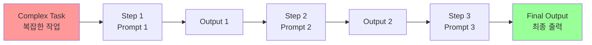

### Prompt Chaining의 이점

#### 1. 모듈성과 명확성 (Modularity and Clarity)

This sequential processing technique inherently introduces modularity and clarity into the interaction with LLMs.

이 순차적 처리 기술은 LLM과의 상호작용에 본질적으로 모듈성과 명확성을 도입합니다:

- 복잡한 작업을 분해함으로써 각 개별 단계를 이해하고 디버그하기가 더 쉬워짐
- 전체 프로세스를 더 견고하고 해석 가능하게 만듦
- 체인의 각 단계는 더 큰 문제의 특정 측면에 집중하도록 세심하게 제작되고 최적화될 수 있음
- 더 정확하고 집중된 출력을 이끌어냄

#### 2. 의존성 체인 (Dependency Chain)

The output of one step acting as the input for the next is crucial. This passing of information establishes a dependency chain, hence the name, where the context and results of previous operations guide the subsequent processing. This allows the LLM to build on its previous work, refine its understanding, and progressively move closer to the desired solution.

한 단계의 출력이 다음 단계의 입력으로 작동하는 것은 중요합니다. 정보의 전달은 의존성 체인을 설정하며, 이는 이름의 유래입니다. 이전 작업의 컨텍스트와 결과가 후속 처리를 안내하며, LLM이 이전 작업을 기반으로 구축하고, 이해를 정제하며, 원하는 솔루션에 점진적으로 접근할 수 있게 합니다.

- 정보의 전달은 의존성 체인을 설정하며, 이는 이름의 유래입니다
- 이전 작업의 컨텍스트와 결과가 후속 처리를 안내합니다
- LLM이 이전 작업을 기반으로 구축하고, 이해를 정제하며, 원하는 솔루션에 점진적으로 접근할 수 있게 합니다

#### 3. 외부 지식 및 도구 통합

Furthermore, prompt chaining is not just about breaking down problems; it also enables the integration of external knowledge and tools. At each step, the LLM can be instructed to interact with external systems, APIs, or databases, enriching its knowledge and abilities beyond its internal training data. This capability dramatically expands the potential of LLMs, allowing them to function not just as isolated models but as integral components of broader, more intelligent systems.

또한, prompt chaining은 단순히 문제를 분해하는 것뿐만 아니라 외부 지식과 도구의 통합을 가능하게 합니다. 각 단계에서 LLM은 외부 시스템, API 또는 데이터베이스와 상호작용하도록 지시받을 수 있으며, 내부 훈련 데이터를 넘어서 지식과 능력을 풍부하게 합니다. 이 기능은 LLM의 잠재력을 극적으로 확장하여 고립된 모델이 아닌 더 넓고 지능적인 시스템의 필수 구성 요소로 기능하게 합니다.

Prompt chaining은 단순히 문제를 분해하는 것뿐만 아니라 외부 지식과 도구의 통합을 가능하게 합니다:

- 각 단계에서 LLM은 외부 시스템, API 또는 데이터베이스와 상호작용하도록 지시받을 수 있음
- 내부 훈련 데이터를 넘어서 지식과 능력을 풍부하게 함
- LLM의 잠재력을 극적으로 확장하여 고립된 모델이 아닌 더 넓고 지능적인 시스템의 필수 구성 요소로 기능하게 함

#### 4. 정교한 AI 에이전트 구축의 기초

The significance of prompt chaining extends beyond simple problem-solving. It serves as a foundational technique for building sophisticated AI agents. These agents can utilize prompt chains to autonomously plan, reason, and act in dynamic environments. By strategically structuring the sequence of prompts, an agent can engage in tasks requiring multi-step reasoning, planning, and decision-making. Such agent workflows can mimic human thought processes more closely, allowing for more natural and effective interactions with complex domains and systems.

Prompt chaining의 중요성은 단순한 문제 해결을 넘어섭니다. 이것은 정교한 AI 에이전트를 구축하기 위한 기초 기술로 작용합니다. 이러한 에이전트는 프롬프트 체인을 활용하여 동적 환경에서 자율적으로 계획, 추론 및 행동할 수 있습니다. 프롬프트 시퀀스를 전략적으로 구조화함으로써 에이전트는 다단계 추론, 계획 및 의사결정이 필요한 작업에 참여할 수 있습니다. 이러한 에이전트 워크플로우는 인간의 사고 과정을 더 밀접하게 모방할 수 있어 복잡한 도메인 및 시스템과의 더 자연스럽고 효과적인 상호작용을 허용합니다.

Prompt chaining의 중요성은 단순한 문제 해결을 넘어섭니다:

- 정교한 AI 에이전트를 구축하기 위한 기초 기술로 작용
- 에이전트가 프롬프트 체인을 활용하여 동적 환경에서 자율적으로 계획, 추론 및 행동할 수 있음
- 프롬프트 시퀀스를 전략적으로 구조화함으로써 에이전트는 다단계 추론, 계획 및 의사결정이 필요한 작업에 참여할 수 있음
- 이러한 에이전트 워크플로우는 인간의 사고 과정을 더 밀접하게 모방할 수 있어 복잡한 도메인 및 시스템과의 더 자연스럽고 효과적인 상호작용을 허용

### 단일 프롬프트의 한계 (Limitations of Single Prompts)

For multifaceted tasks, using a single, complex prompt for an LLM can be inefficient, causing the model to struggle with constraints and instructions, potentially leading to instruction neglect where parts of the prompt are overlooked, contextual drift where the model loses track of the initial context, error propagation where early errors amplify, prompts which require a longer context window where the model gets insufficient information to respond back and hallucination where the cognitive load increases the chance of incorrect information.

다면적 작업의 경우, LLM에 대한 단일의 복잡한 프롬프트 사용은 비효율적일 수 있으며, 모델이 제약 조건과 지시사항으로 어려움을 겪을 수 있습니다. 이는 프롬프트의 일부가 간과되는 지시사항 무시(instruction neglect), 모델이 초기 컨텍스트를 잃는 컨텍스트 드리프트(contextual drift), 초기 오류가 증폭되는 오류 전파(error propagation), 모델이 응답하기에 충분한 정보를 얻지 못하는 긴 컨텍스트 창이 필요한 프롬프트, 인지 부하가 증가하여 잘못된 정보가 생성될 가능성이 증가하는 환각(hallucination)으로 이어질 수 있습니다.

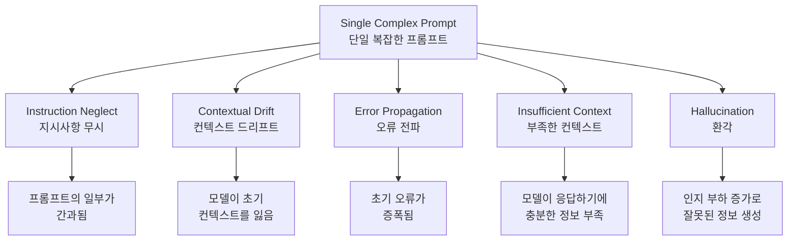

#### 주요 문제점

1. **지시사항 무시 (Instruction Neglect)**: 프롬프트의 일부가 간과됨
2. **컨텍스트 드리프트 (Contextual Drift)**: 모델이 초기 컨텍스트를 잃어버림
3. **오류 전파 (Error Propagation)**: 초기 오류가 증폭됨
4. **부족한 컨텍스트 (Insufficient Context)**: 긴 컨텍스트 창이 필요한 프롬프트에서 모델이 응답하기에 충분한 정보를 얻지 못함
5. **환각 (Hallucination)**: 인지 부하가 증가하여 잘못된 정보가 생성될 가능성 증가

#### 예시: 시장 조사 보고서 분석

For example, a query asking to analyze a market research report, summarize findings, identify trends with data points, and draft an email risks failure as the model might summarize well but fail to extract data or draft an email properly.

다음과 같은 쿼리는 실패할 위험이 있습니다:
- 시장 조사 보고서 분석
- 결과 요약
- 데이터 포인트와 함께 트렌드 식별
- 이메일 초안 작성

모델은 요약은 잘 할 수 있지만 데이터 추출이나 이메일 작성에 실패할 수 있습니다.

### 순차적 분해를 통한 신뢰성 향상 (Enhanced Reliability Through Sequential Decomposition)

Prompt chaining addresses these challenges by breaking the complex task into a focused, sequential workflow, which significantly improves reliability and control. Given the example above, a pipeline or chained approach can be described as follows:

Prompt chaining은 복잡한 작업을 집중된 순차적 워크플로우로 분해하여 이러한 도전을 해결하며, 신뢰성과 제어를 크게 향상시킵니다.

#### 예시: 시장 조사 보고서 처리 파이프라인

위의 예시에 대해 파이프라인 또는 체인 접근 방식은 다음과 같이 설명할 수 있습니다:

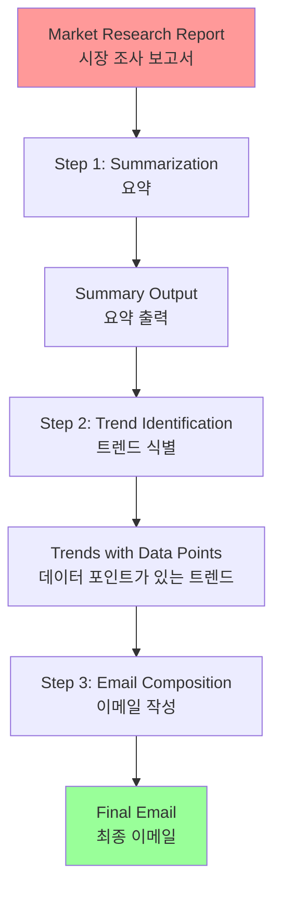

##### 단계별 설명

**1. Initial Prompt (Summarization)**: "Summarize the key findings of the following market research report: [text]." The model's sole focus is summarization, increasing the accuracy of this initial step.

**1. 초기 프롬프트 (요약)**
```
"다음 시장 조사 보고서의 주요 결과를 요약하세요: [텍스트]"
```
- 모델의 유일한 초점은 요약이며, 이 초기 단계의 정확도를 높입니다

**2. Second Prompt (Trend Identification)**: "Using the summary, identify the top three emerging trends and extract the specific data points that support each trend: [output from step 1]." This prompt is now more constrained and builds directly upon a validated output.

**2. 두 번째 프롬프트 (트렌드 식별)**
```
"요약을 사용하여 상위 3개의 신흥 트렌드를 식별하고 각 트렌드를 지원하는 특정 데이터 포인트를 추출하세요: [1단계 출력]"
```
- 이 프롬프트는 이제 더 제한적이며 검증된 출력을 직접 기반으로 구축됩니다

**3. Third Prompt (Email Composition)**: "Draft a concise email to the marketing team that outlines the following trends and their supporting data: [output from step 2]."

**3. 세 번째 프롬프트 (이메일 작성)**
```
"다음 트렌드와 지원 데이터를 설명하는 마케팅 팀에 대한 간결한 이메일을 작성하세요: [2단계 출력]"
```

#### 분해의 이점

This decomposition allows for more granular control over the process. Each step is simpler and less ambiguous, which reduces the cognitive load on the model and leads to a more accurate and reliable final output. This modularity is analogous to a computational pipeline where each function performs a specific operation before passing its result to the next.

이 분해는 프로세스에 대한 더 세밀한 제어를 허용합니다:

- 각 단계가 더 간단하고 모호하지 않음
- 모델의 인지 부하를 줄임
- 더 정확하고 신뢰할 수 있는 최종 출력을 이끌어냄
- 계산 파이프라인과 유사한 모듈성: 각 함수가 다음에 결과를 전달하기 전에 특정 작업을 수행

#### 역할 할당

To ensure an accurate response for each specific task, the model can be assigned a distinct role at every stage. For example, in the given scenario, the initial prompt could be designated as "Market Analyst," the subsequent prompt as "Trade Analyst," and the third prompt as "Expert Documentation Writer," and so forth.

각 특정 작업에 대한 정확한 응답을 보장하기 위해 모델은 모든 단계에서 고유한 역할을 할당받을 수 있습니다:

- 초기 프롬프트: "시장 분석가"
- 후속 프롬프트: "무역 분석가"
- 세 번째 프롬프트: "전문 문서 작성자"

### 구조화된 출력의 역할 (The Role of Structured Output)

The reliability of a prompt chain is highly dependent on the integrity of the data passed between steps. If the output of one prompt is ambiguous or poorly formatted, the subsequent prompt may fail due to faulty input. To mitigate this, specifying a structured output format, such as JSON or XML, is crucial.

프롬프트 체인의 신뢰성은 단계 간에 전달되는 데이터의 무결성에 크게 의존합니다. 한 프롬프트의 출력이 모호하거나 형식이 잘못된 경우, 후속 프롬프트는 잘못된 입력으로 인해 실패할 수 있습니다.

#### 구조화된 출력 형식 지정

이를 완화하기 위해 JSON 또는 XML과 같은 구조화된 출력 형식을 지정하는 것이 중요합니다.

#### 예시: 트렌드 식별 단계의 JSON 출력

```json
{
  "trends": [
    {
      "trend_name": "AI-Powered Personalization",
      "supporting_data": "73% of consumers prefer to do business with brands that use personal information to make their shopping experiences more relevant."
    },
    {
      "trend_name": "Sustainable and Ethical Brands",
      "supporting_data": "Sales of products with ESG-related claims grew 28% over the last five years, compared to 20% for products without."
    }
  ]
}
```

#### 구조화된 형식의 이점

This structured format ensures that the data is machine-readable and can be precisely parsed and inserted into the next prompt without ambiguity. This practice minimizes errors that can arise from interpreting natural language and is a key component in building robust, multi-step LLM-based systems.

- 데이터가 기계 판독 가능함
- 모호함 없이 정확하게 파싱되고 다음 프롬프트에 삽입될 수 있음
- 자연어를 해석하는 데서 발생할 수 있는 오류를 최소화
- 견고한 다단계 LLM 기반 시스템을 구축하는 핵심 구성 요소

## 실용적 응용 및 사용 사례 (Practical Applications & Use Cases)

Prompt chaining은 에이전트 시스템을 구축할 때 광범위한 시나리오에 적용할 수 있는 다재다능한 패턴입니다. 핵심 유틸리티는 복잡한 문제를 순차적이고 관리 가능한 단계로 분해하는 데 있습니다.

### 1. 정보 처리 워크플로우 (Information Processing Workflows)

많은 작업은 여러 변환을 통해 원시 정보를 처리하는 것을 포함합니다.

#### 예시: 문서 분석 및 보고서 생성

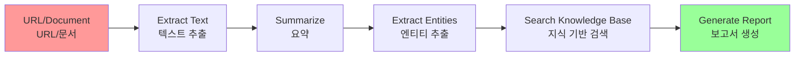

**프롬프트 체인**:
- **프롬프트 1**: 주어진 URL 또는 문서에서 텍스트 콘텐츠 추출
- **프롬프트 2**: 정리된 텍스트 요약
- **프롬프트 3**: 요약 또는 원본 텍스트에서 특정 엔티티(예: 이름, 날짜, 위치) 추출
- **프롬프트 4**: 엔티티를 사용하여 내부 지식 기반 검색
- **프롬프트 5**: 요약, 엔티티 및 검색 결과를 통합한 최종 보고서 생성

**적용 분야**:
- 자동화된 콘텐츠 분석
- AI 기반 연구 어시스턴트 개발
- 복잡한 보고서 생성

### 2. 복잡한 쿼리 답변 (Complex Query Answering)

여러 단계의 추론이나 정보 검색이 필요한 복잡한 질문에 답하는 것은 주요 사용 사례입니다.

#### 예시: 1929년 주식 시장 붕괴 분석

**질문**: "1929년 주식 시장 붕괴의 주요 원인은 무엇이었고, 정부 정책은 어떻게 대응했나요?"

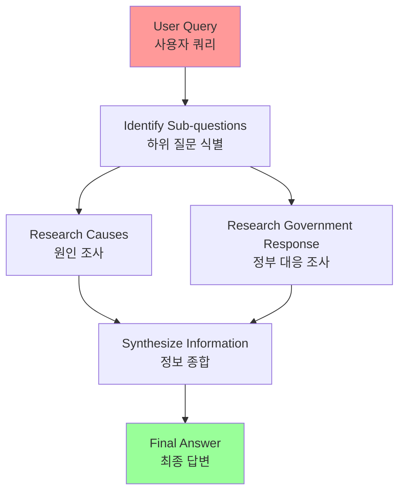

**프롬프트 체인**:
- **프롬프트 1**: 사용자 쿼리의 핵심 하위 질문 식별 (붕괴 원인, 정부 대응)
- **프롬프트 2**: 1929년 붕괴의 원인에 대해 특별히 조사하거나 정보 검색
- **프롬프트 3**: 1929년 주식 시장 붕괴에 대한 정부의 정책 대응에 대해 특별히 조사하거나 정보 검색
- **프롬프트 4**: 2단계와 3단계의 정보를 원래 쿼리에 대한 일관된 답변으로 종합

#### 병렬 처리와의 결합

This sequential processing methodology is integral to developing AI systems capable of multi-step inference and information synthesis. Such systems are required when a query cannot be answered from a single data point but instead necessitates a series of logical steps or the integration of information from diverse sources.

For example, an automated research agent designed to generate a comprehensive report on a specific topic executes a hybrid computational workflow. Initially, the system retrieves numerous relevant articles. The subsequent task of extracting key information from each article can be performed concurrently for each source. This stage is well-suited for parallel processing, where independent sub-tasks are run simultaneously to maximize efficiency.

However, once the individual extractions are complete, the process becomes inherently sequential. The system must first collate the extracted data, then synthesize it into a coherent draft, and finally review and refine this draft to produce a final report. Each of these later stages is logically dependent on the successful completion of the preceding one. This is where prompt chaining is applied: the collated data serves as the input for the synthesis prompt, and the resulting synthesized text becomes the input for the final review prompt. Therefore, complex operations frequently combine parallel processing for independent data gathering with prompt chaining for the dependent steps of synthesis and refinement.

자동화된 연구 에이전트는 하이브리드 계산 워크플로우를 실행할 수 있습니다:

1. **병렬 단계**: 여러 관련 기사를 검색하고 각 소스에서 주요 정보를 추출하는 작업은 동시에 실행될 수 있음
2. **순차 단계**: 개별 추출이 완료되면 프로세스가 본질적으로 순차적이 됨:
   - 추출된 데이터를 먼저 수집
   - 일관된 초안으로 종합
   - 최종 보고서를 생성하기 위해 검토 및 정제

**결론**: 복잡한 작업은 종종 독립적인 데이터 수집을 위한 병렬 처리와 종합 및 정제의 종속 단계를 위한 프롬프트 체이닝을 결합합니다.

### 3. 데이터 추출 및 변환 (Data Extraction and Transformation)

비구조화된 텍스트를 구조화된 형식으로 변환하는 것은 일반적으로 출력의 정확도와 완전성을 개선하기 위해 순차적 수정이 필요한 반복 프로세스를 통해 달성됩니다.

#### 예시: 송장 문서 처리

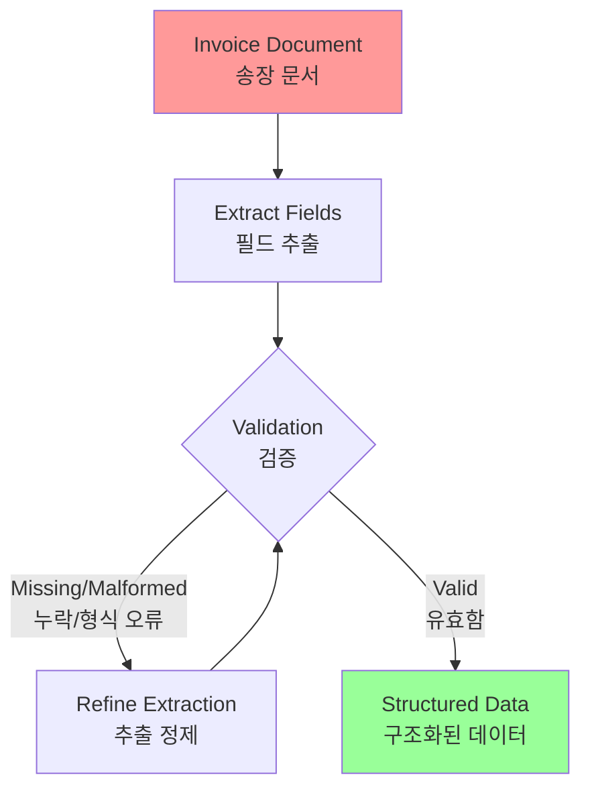

**프롬프트 체인**:
- **프롬프트 1**: 송장 문서에서 특정 필드(예: 이름, 주소, 금액) 추출 시도
- **처리**: 모든 필수 필드가 추출되었는지, 형식 요구사항을 충족하는지 확인
- **프롬프트 2 (조건부)**: 필드가 누락되었거나 형식이 잘못된 경우, 실패한 시도를 컨텍스트로 제공하면서 누락/형식 오류 정보를 특별히 찾도록 요청하는 새 프롬프트 작성
- **처리**: 결과를 다시 검증하고 필요시 반복
- **출력**: 추출되고 검증된 구조화된 데이터 제공

#### OCR 문제 해결

This sequential processing methodology is particularly applicable to data extraction and analysis from unstructured sources like forms, invoices, or emails. For example, solving complex Optical Character Recognition (OCR) problems, such as processing a PDF form, is more effectively handled through a decomposed, multi-step approach.

Initially, a large language model is employed to perform the primary text extraction from the document image. Following this, the model processes the raw output to normalize the data, a step where it might convert numeric text, such as "one thousand and fifty," into its numerical equivalent, 1050. A significant challenge for LLMs is performing precise mathematical calculations. Therefore, in a subsequent step, the system can delegate any required arithmetic operations to an external calculator tool. The LLM identifies the necessary calculation, feeds the normalized numbers to the tool, and then incorporates the precise result. This chained sequence of text extraction, data normalization, and external tool use achieves a final, accurate result that is often difficult to obtain reliably from a single LLM query.

복잡한 OCR 문제(예: PDF 양식 처리)는 분해된 다단계 접근 방식으로 더 효과적으로 처리됩니다:

1. **텍스트 추출**: 대형 언어 모델이 문서 이미지에서 주요 텍스트 추출 수행
2. **데이터 정규화**: 원시 출력을 처리하여 데이터를 정규화 (예: "one thousand and fifty"를 1050으로 변환)
3. **외부 도구 사용**: LLM은 정확한 수학 계산을 수행하는 데 어려움이 있으므로, 필요한 산술 연산을 외부 계산기 도구에 위임
   - LLM이 필요한 계산을 식별
   - 정규화된 숫자를 도구에 공급
   - 정확한 결과를 통합

이 체인된 텍스트 추출, 데이터 정규화, 외부 도구 사용의 시퀀스는 단일 LLM 쿼리에서 신뢰할 수 있게 얻기 어려운 최종 정확한 결과를 달성합니다.

### 4. 콘텐츠 생성 워크플로우 (Content Generation Workflows)

The composition of complex content is a procedural task that is typically decomposed into distinct phases, including initial ideation, structural outlining, drafting, and subsequent revision.

복잡한 콘텐츠의 구성은 일반적으로 초기 아이디어 생성, 구조적 개요 작성, 초안 작성, 후속 수정을 포함하는 별개의 단계로 분해되는 절차적 작업입니다.

#### 예시: 문서 작성 프로세스

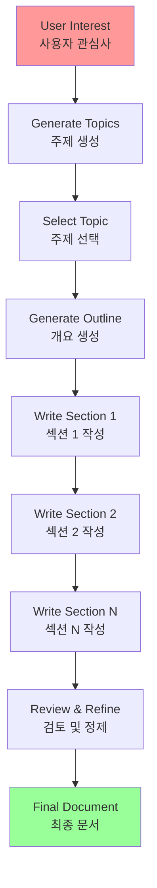

**프롬프트 체인**:
- **Prompt 1**: Generate 5 topic ideas based on a user's general interest.
- **Processing**: Allow the user to select one idea or automatically choose the best one.
- **Prompt 2**: Based on the selected topic, generate a detailed outline.
- **Prompt 3**: Write a draft section based on the first point in the outline.
- **Prompt 4**: Write a draft section based on the second point in the outline, providing the previous section for context. Continue this for all outline points.
- **Prompt 5**: Review and refine the complete draft for coherence, tone, and grammar.

- **프롬프트 1**: 사용자의 일반적인 관심사를 기반으로 5개의 주제 아이디어 생성
- **처리**: 사용자가 하나의 아이디어를 선택하거나 자동으로 최선의 것을 선택
- **프롬프트 2**: 선택된 주제를 기반으로 상세한 개요 생성
- **프롬프트 3**: 개요의 첫 번째 포인트를 기반으로 초안 섹션 작성
- **프롬프트 4**: 이전 섹션을 컨텍스트로 제공하면서 개요의 두 번째 포인트를 기반으로 초안 섹션 작성 (모든 개요 포인트에 대해 계속)
- **프롬프트 5**: 일관성, 톤, 문법에 대해 완전한 초안 검토 및 정제

This methodology is employed for a range of natural language generation tasks, including the automated composition of creative narratives, technical documentation, and other forms of structured textual content.

**적용 분야**:
- 창의적 내러티브의 자동화된 구성
- 기술 문서
- 구조화된 텍스트 콘텐츠의 다른 형태

### 5. 상태를 가진 대화형 에이전트 (Conversational Agents with State)

Although comprehensive state management architectures employ methods more complex than sequential linking, prompt chaining provides a foundational mechanism for preserving conversational continuity. This technique maintains context by constructing each conversational turn as a new prompt that systematically incorporates information or extracted entities from preceding interactions in the dialogue sequence.

포괄적인 상태 관리 아키텍처는 순차적 연결보다 더 복잡한 방법을 사용하지만, 프롬프트 체이닝은 대화 연속성을 보존하기 위한 기초 메커니즘을 제공합니다.

#### 대화 연속성 유지

이 기술은 대화 시퀀스에서 이전 상호작용의 정보나 추출된 엔티티를 체계적으로 통합하는 새 프롬프트로 각 대화 턴을 구성하여 컨텍스트를 유지합니다.

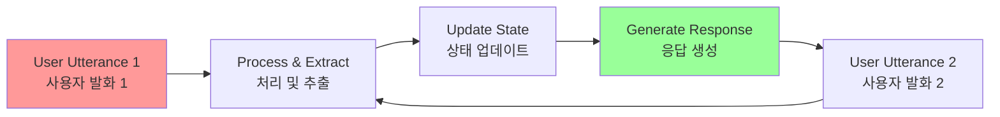

**프롬프트 체인**:
- **Prompt 1**: Process User Utterance 1, identify intent and key entities.
- **Processing**: Update conversation state with intent and entities.
- **Prompt 2**: Based on current state, generate a response and/or identify the next required piece of information.
- **Repeat**: for subsequent turns, with each new user utterance initiating a chain that leverages the accumulating conversation history (state).

- **프롬프트 1**: 사용자 발화 1 처리, 의도 및 주요 엔티티 식별
- **처리**: 의도 및 엔티티로 대화 상태 업데이트
- **프롬프트 2**: 현재 상태를 기반으로 응답 생성 및/또는 다음에 필요한 정보 식별
- **반복**: 각 새로운 사용자 발화가 누적되는 대화 기록(상태)을 활용하는 체인을 시작하도록 후속 턴에 대해 반복

#### 원칙

This principle is fundamental to the development of conversational agents, enabling them to maintain context and coherence across extended, multi-turn dialogues. By preserving the conversational history, the system can understand and appropriately respond to user inputs that depend on previously exchanged information.

이 원칙은 대화형 에이전트 개발에 기본적이며, 확장된 다중 턴 대화에 걸쳐 컨텍스트와 일관성을 유지할 수 있게 합니다. 대화 기록을 보존함으로써 시스템은 이전에 교환된 정보에 의존하는 사용자 입력을 이해하고 적절하게 응답할 수 있습니다.

### 6. 코드 생성 및 정제 (Code Generation and Refinement)

The generation of functional code is typically a multi-stage process, requiring a problem to be decomposed into a sequence of discrete logical operations that are executed progressively.

기능적 코드의 생성은 일반적으로 문제를 점진적으로 실행되는 별개의 논리적 작업의 시퀀스로 분해하는 다단계 프로세스가 필요합니다.

#### 예시: 코드 생성 워크플로우

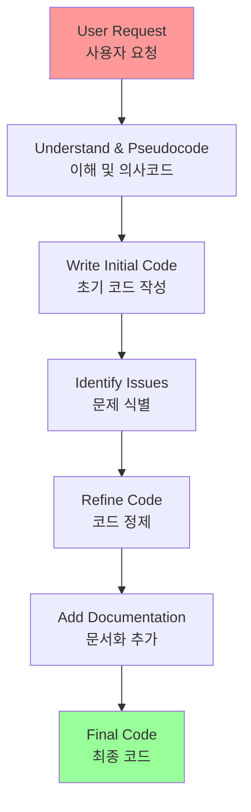

**프롬프트 체인**:
- **Prompt 1**: Understand the user's request for a code function. Generate pseudocode or an outline.
- **Prompt 2**: Write the initial code draft based on the outline.
- **Prompt 3**: Identify potential errors or areas for improvement in the code (perhaps using a static analysis tool or another LLM call).
- **Prompt 4**: Rewrite or refine the code based on the identified issues.
- **Prompt 5**: Add documentation or test cases.

- **프롬프트 1**: 사용자의 코드 함수 요청 이해. 의사코드 또는 개요 생성
- **프롬프트 2**: 개요를 기반으로 초기 코드 초안 작성
- **프롬프트 3**: 코드에서 잠재적 오류나 개선 영역 식별 (정적 분석 도구나 다른 LLM 호출 사용 가능)
- **프롬프트 4**: 식별된 문제를 기반으로 코드 재작성 또는 정제
- **프롬프트 5**: 문서화 또는 테스트 케이스 추가

#### 유틸리티

In applications such as AI-assisted software development, the utility of prompt chaining stems from its capacity to decompose complex coding tasks into a series of manageable sub-problems. This modular structure reduces the operational complexity for the large language model at each step. Critically, this approach also allows for the insertion of deterministic logic between model calls, enabling intermediate data processing, output validation, and conditional branching within the workflow. By this method, a single, multifaceted request that could otherwise lead to unreliable or incomplete results is converted into a structured sequence of operations managed by an underlying execution framework.

AI 지원 소프트웨어 개발과 같은 애플리케이션에서 프롬프트 체이닝의 유틸리티는 복잡한 코딩 작업을 일련의 관리 가능한 하위 문제로 분해하는 능력에서 비롯됩니다:

- **모듈 구조**: 각 단계에서 대형 언어 모델의 운영 복잡성을 줄임
- **결정론적 로직 삽입**: 모델 호출 사이에 중간 데이터 처리, 출력 검증, 워크플로우 내 조건부 분기를 가능하게 함
- **신뢰성 향상**: 그렇지 않으면 신뢰할 수 없거나 불완전한 결과로 이어질 수 있는 단일의 다면적 요청을 기본 실행 프레임워크에 의해 관리되는 구조화된 작업 시퀀스로 변환

### 7. 멀티모달 및 다단계 추론 (Multimodal and Multi-step Reasoning)

Analyzing datasets with diverse modalities necessitates breaking down the problem into smaller, prompt-based tasks. For example, interpreting an image that contains a picture with embedded text, labels highlighting specific text segments, and tabular data explaining each label, requires such an approach.

다양한 모달리티를 가진 데이터셋을 분석하는 것은 문제를 더 작은 프롬프트 기반 작업으로 분해하는 것을 필요로 합니다.

#### 예시: 이미지 분석

예를 들어, 임베디드 텍스트가 있는 그림, 특정 텍스트 세그먼트를 강조하는 레이블, 각 레이블을 설명하는 표 형식 데이터를 포함하는 이미지를 해석하는 것은 이러한 접근이 필요합니다.

**프롬프트 체인**:
- **Prompt 1**: Extract and comprehend the text from the user's image request.
- **Prompt 2**: Link the extracted image text with its corresponding labels.
- **Prompt 3**: Interpret the gathered information using a table to determine the required output.

- **프롬프트 1**: 사용자의 이미지 요청에서 텍스트 추출 및 이해
- **프롬프트 2**: 추출된 이미지 텍스트를 해당 레이블과 연결
- **프롬프트 3**: 수집된 정보를 테이블을 사용하여 해석하여 필요한 출력 결정

## 실습 코드 예제 (Hands-On Code Example)

Implementing prompt chaining ranges from direct, sequential function calls within a script to the utilization of specialized frameworks designed to manage control flow, state, and component integration. Frameworks such as LangChain, LangGraph, Crew AI, and the Google Agent Development Kit (ADK) offer structured environments for constructing and executing these multi-step processes, which is particularly advantageous for complex architectures.

프롬프트 체이닝 구현은 스크립트 내에서 직접적인 순차적 함수 호출부터 제어 흐름, 상태 및 구성 요소 통합을 관리하도록 설계된 특수 프레임워크 활용까지 다양합니다.

### 프레임워크 선택

For the purpose of demonstration, LangChain and LangGraph are suitable choices as their core APIs are explicitly designed for composing chains and graphs of operations. LangChain provides foundational abstractions for linear sequences, while LangGraph extends these capabilities to support stateful and cyclical computations, which are necessary for implementing more sophisticated agentic behaviors. This example will focus on a fundamental linear sequence.

LangChain, LangGraph, Crew AI, Google Agent Development Kit (ADK)와 같은 프레임워크는 이러한 다단계 프로세스를 구성하고 실행하기 위한 구조화된 환경을 제공하며, 특히 복잡한 아키텍처에 유리합니다.

이 예제에서는 LangChain과 LangGraph를 사용합니다:
- **LangChain**: 선형 시퀀스를 위한 기초 추상화 제공
- **LangGraph**: 상태 저장 및 순환 계산을 지원하도록 이러한 기능을 확장하여 더 정교한 에이전트 동작 구현에 필요

이 예제는 기본적인 선형 시퀀스에 집중합니다.

### 코드 예제: 데이터 처리 파이프라인

The following code implements a two-step prompt chain that functions as a data processing pipeline. The initial stage is designed to parse unstructured text and extract specific information. The subsequent stage then receives this extracted output and transforms it into a structured data format.

다음 코드는 데이터 처리 파이프라인으로 기능하는 2단계 프롬프트 체인을 구현합니다. 초기 단계는 비구조화된 텍스트를 파싱하고 특정 정보를 추출하도록 설계되었으며, 후속 단계는 이 추출된 출력을 받아 구조화된 데이터 형식으로 변환합니다.

#### 설치 및 설정

필요한 라이브러리를 설치합니다:

```bash
pip install langchain langchain-community langchain-openai langgraph
```

**참고**: `langchain-openai`는 다른 모델 제공자를 위한 적절한 패키지로 대체할 수 있습니다. 그런 다음 OpenAI, Google Gemini 또는 Anthropic과 같은 선택한 언어 모델 제공자에 대한 필요한 API 자격 증명으로 실행 환경을 구성해야 합니다.

#### 전체 코드

```python
import os
from langchain_openai import ChatOpenAI
from langchain_core.prompts import ChatPromptTemplate
from langchain_core.output_parsers import StrOutputParser

# 보안을 위해 .env 파일에서 환경 변수 로드
# from dotenv import load_dotenv
# load_dotenv()
# .env 파일에 OPENAI_API_KEY가 설정되어 있는지 확인

# 언어 모델 초기화 (ChatOpenAI 사용 권장)
llm = ChatOpenAI(temperature=0)

# --- 프롬프트 1: 정보 추출 ---
prompt_extract = ChatPromptTemplate.from_template(
    "Extract the technical specifications from the following text:\n\n{text_input}"
)

# --- 프롬프트 2: JSON으로 변환 ---
prompt_transform = ChatPromptTemplate.from_template(
    "Transform the following specifications into a JSON object with 'cpu', 'memory', and 'storage' as keys:\n\n{specifications}"
)

# --- LCEL을 사용하여 체인 구축 ---
# StrOutputParser()는 LLM의 메시지 출력을 간단한 문자열로 변환합니다.
extraction_chain = prompt_extract | llm | StrOutputParser()

# 전체 체인은 추출 체인의 출력을 변환 프롬프트의 'specifications' 변수로 전달합니다.
full_chain = (
    {"specifications": extraction_chain}
    | prompt_transform
    | llm
    | StrOutputParser()
)

# --- 체인 실행 ---
input_text = "The new laptop model features a 3.5 GHz octa-core processor, 16GB of RAM, and a 1TB NVMe SSD."

# 입력 텍스트 딕셔너리로 체인을 실행합니다.
final_result = full_chain.invoke({"text_input": input_text})

print("\n--- Final JSON Output ---")
print(final_result)
```

#### 코드 설명

This Python code demonstrates how to use the LangChain library to process text. It utilizes two separate prompts: one to extract technical specifications from an input string and another to format these specifications into a JSON object. The ChatOpenAI model is employed for language model interactions, and the StrOutputParser ensures the output is in a usable string format. The LangChain Expression Language (LCEL) is used to elegantly chain these prompts and the language model together. The first chain, extraction_chain, extracts the specifications. The full_chain then takes the output of the extraction and uses it as input for the transformation prompt. A sample input text describing a laptop is provided. The full_chain is invoked with this text, processing it through both steps. The final result, a JSON string containing the extracted and formatted specifications, is then printed.

이 Python 코드는 LangChain 라이브러리를 사용하여 텍스트를 처리하는 방법을 보여줍니다:

1. **두 개의 별도 프롬프트 사용**:
   - 입력 문자열에서 기술 사양을 추출하는 하나
   - 이러한 사양을 JSON 객체로 포맷하는 다른 하나

2. **구성 요소**:
   - **ChatOpenAI**: 언어 모델 상호작용에 사용
   - **StrOutputParser**: 출력이 사용 가능한 문자열 형식인지 확인

3. **LangChain Expression Language (LCEL)**:
   - 이러한 프롬프트와 언어 모델을 우아하게 체인으로 연결하는 데 사용
   - `extraction_chain`: 사양을 추출
   - `full_chain`: 추출의 출력을 가져와 변환 프롬프트의 입력으로 사용

4. **실행**:
   - 노트북을 설명하는 샘플 입력 텍스트 제공
   - `full_chain`이 이 텍스트로 호출되어 두 단계를 통해 처리
   - 최종 결과: 추출되고 포맷된 사양을 포함하는 JSON 문자열이 인쇄됨

#### 실행 흐름

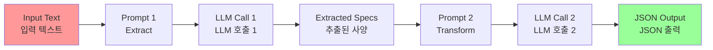

## 컨텍스트 엔지니어링 및 프롬프트 엔지니어링 (Context Engineering and Prompt Engineering)

### 컨텍스트 엔지니어링 (Context Engineering)

Context Engineering (see Fig.1) is the systematic discipline of designing, constructing, and delivering a complete informational environment to an AI model prior to token generation. This methodology asserts that the quality of a model's output is less dependent on the model's architecture itself and more on the richness of the context provided.

**Fig.1**: Context Engineering is the discipline of building a rich, comprehensive informational environment for an AI, as the quality of this context is a primary factor in enabling advanced Agentic performance.

컨텍스트 엔지니어링(그림 1 참조)은 토큰 생성 전에 AI 모델에 완전한 정보 환경을 설계, 구성 및 제공하는 체계적인 학문입니다. 이 방법론은 모델 출력의 품질이 모델의 아키텍처 자체보다 제공된 컨텍스트의 풍부함에 더 의존한다고 주장합니다.

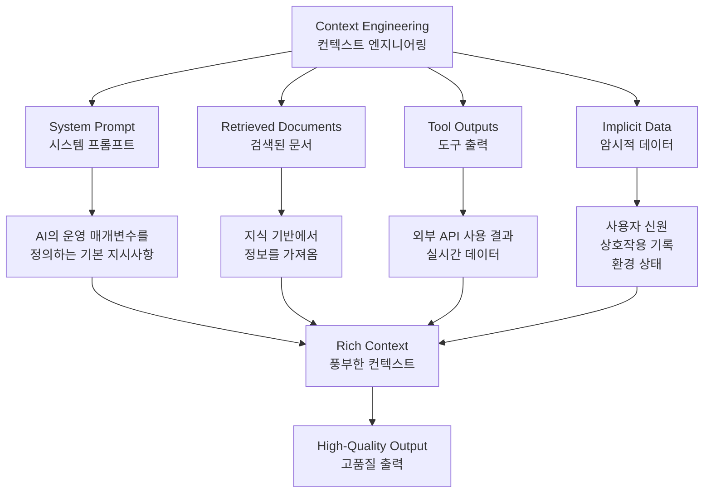

#### 전통적 프롬프트 엔지니어링과의 차이

It represents a significant evolution from traditional prompt engineering, which focuses primarily on optimizing the phrasing of a user's immediate query. Context Engineering expands this scope to include several layers of information, such as the system prompt, which is a foundational set of instructions defining the AI's operational parameters—for instance, "You are a technical writer; your tone must be formal and precise."

컨텍스트 엔지니어링은 전통적인 프롬프트 엔지니어링의 중요한 진화를 나타냅니다. 전통적인 프롬프트 엔지니어링이 주로 사용자의 즉각적인 쿼리의 문구를 최적화하는 데 집중하는 반면, 컨텍스트 엔지니어링은 여러 정보 계층을 포함하도록 범위를 확장합니다.

전통적인 프롬프트 엔지니어링이 주로 사용자의 즉각적인 쿼리의 문구를 최적화하는 데 집중하는 반면, 컨텍스트 엔지니어링은 여러 정보 계층을 포함하도록 범위를 확장합니다:

1. **시스템 프롬프트 (System Prompt)**: AI의 운영 매개변수를 정의하는 기본 지시사항 집합
   - 예: "당신은 기술 작가입니다. 톤은 공식적이고 정확해야 합니다."

2. **외부 데이터 (External Data)**: The context is further enriched with external data. This includes retrieved documents, where the AI actively fetches information from a knowledge base to inform its response, such as pulling technical specifications for a project. It also incorporates tool outputs, which are the results from the AI using an external API to obtain real-time data, like querying a calendar to determine a user's availability.

   - **검색된 문서 (Retrieved Documents)**: AI가 지식 기반에서 정보를 적극적으로 가져와 응답을 알림 (예: 프로젝트의 기술 사양 가져오기)
   - **도구 출력 (Tool Outputs)**: AI가 외부 API를 사용하여 실시간 데이터를 얻는 결과 (예: 사용자의 가용성을 결정하기 위해 캘린더 쿼리)

3. **암시적 데이터 (Implicit Data)**: This explicit data is combined with critical implicit data, such as user identity, interaction history, and environmental state.

   사용자 신원, 상호작용 기록, 환경 상태와 같은 중요한 암시적 데이터

#### 핵심 원칙

The core principle is that even advanced models underperform when provided with a limited or poorly constructed view of the operational environment. This practice, therefore, reframes the task from merely answering a question to building a comprehensive operational picture for the agent. For example, a context-engineered agent would not just respond to a query but would first integrate the user's calendar availability (a tool output), the professional relationship with an email's recipient (implicit data), and notes from previous meetings (retrieved documents). This allows the model to generate outputs that are highly relevant, personalized, and pragmatically useful.

핵심 원칙은 고급 모델조차도 운영 환경의 제한적이거나 잘못 구성된 보기가 제공될 때 성능이 저하된다는 것입니다. 따라서 이 실천은 단순히 질문에 답하는 것에서 에이전트를 위한 포괄적인 운영 그림을 구축하는 것으로 작업을 재구성합니다.

컨텍스트 엔지니어링된 에이전트는 단순히 쿼리에 응답하는 것이 아니라:
- 사용자의 캘린더 가용성 (도구 출력)
- 이메일 수신자와의 전문적 관계 (암시적 데이터)
- 이전 회의의 메모 (검색된 문서)

이를 먼저 통합하여 고도로 관련성 있고 개인화되며 실용적으로 유용한 출력을 생성할 수 있습니다.

#### 구현

The "engineering" component involves creating robust pipelines to fetch and transform this data at runtime and establishing feedback loops to continually improve context quality.

"엔지니어링" 구성 요소는 런타임에 이 데이터를 가져오고 변환하는 견고한 파이프라인을 생성하고 컨텍스트 품질을 지속적으로 개선하기 위한 피드백 루프를 설정하는 것을 포함합니다.

**자동화된 개선**: To implement this, specialized tuning systems can be used to automate the improvement process at scale. For example, tools like Google's Vertex AI prompt optimizer can enhance model performance by systematically evaluating responses against a set of sample inputs and predefined evaluation metrics. This approach is effective for adapting prompts and system instructions across different models without requiring extensive manual rewriting. By providing such an optimizer with sample prompts, system instructions, and a template, it can programmatically refine the contextual inputs, offering a structured method for implementing the feedback loops required for sophisticated Context Engineering.

Google의 Vertex AI 프롬프트 최적화기와 같은 특수 튜닝 시스템을 사용하여 규모에 맞게 개선 프로세스를 자동화할 수 있습니다:
- 샘플 입력 세트와 사전 정의된 평가 메트릭에 대해 응답을 체계적으로 평가하여 모델 성능 향상
- 광범위한 수동 재작성 없이 다른 모델에 걸쳐 프롬프트와 시스템 지시사항을 적응시키는 데 효과적
- 샘플 프롬프트, 시스템 지시사항 및 템플릿을 제공하면 프로그래밍 방식으로 컨텍스트 입력을 정제하여 정교한 컨텍스트 엔지니어링에 필요한 피드백 루프를 구현하는 구조화된 방법 제공

#### 차별화 요소

This structured approach is what differentiates a rudimentary AI tool from a more sophisticated and contextually-aware system. It treats the context itself as a primary component, placing critical importance on what the agent knows, when it knows it, and how it uses that information. The practice ensures the model has a well-rounded understanding of the user's intent, history, and current environment. Ultimately, Context Engineering is a crucial methodology for advancing stateless chatbots into highly capable, situationally-aware systems.

이 구조화된 접근 방식이 기본적인 AI 도구를 더 정교하고 컨텍스트 인식 시스템과 구별합니다:
- 컨텍스트 자체를 주요 구성 요소로 취급
- 에이전트가 무엇을 알고, 언제 알고, 그 정보를 어떻게 사용하는지에 중요한 중요성을 부여
- 모델이 사용자의 의도, 기록 및 현재 환경에 대한 잘 둥근 이해를 갖도록 보장
- 궁극적으로 컨텍스트 엔지니어링은 상태 없는 챗봇을 고도로 능력 있고 상황 인식 시스템으로 발전시키는 데 중요한 방법론

## 한눈에 보기 (At a Glance)

### 무엇 (What)

복잡한 작업은 단일 프롬프트 내에서 처리될 때 LLM을 압도하여 상당한 성능 문제를 일으킵니다:
- 모델의 인지 부하가 증가
- 지시사항 간과, 컨텍스트 손실, 잘못된 정보 생성과 같은 오류 가능성 증가
- 단일 프롬프트가 여러 제약 조건과 순차적 추론 단계를 효과적으로 관리하기 어려움
- 신뢰할 수 없고 부정확한 출력 결과

### 왜 (Why)

프롬프트 체이닝은 복잡한 문제를 상호 연결된 하위 작업의 시퀀스로 분해하여 표준화된 솔루션을 제공합니다:
- 체인의 각 단계는 특정 작업을 수행하기 위해 집중된 프롬프트를 사용하여 신뢰성과 제어를 크게 향상
- 한 프롬프트의 출력이 다음의 입력으로 전달되어 최종 솔루션을 향해 점진적으로 구축되는 논리적 워크플로우 생성
- 이 모듈식 분할 정복 전략은 프로세스를 더 관리하기 쉽고, 디버깅하기 쉽게 만들며, 단계 사이에 외부 도구나 구조화된 데이터 형식의 통합을 허용
- 다단계 추론을 수행하고 복잡한 워크플로우를 실행할 수 있는 정교한 다단계 에이전트 시스템을 개발하기 위한 기초 패턴

### 경험 법칙 (Rule of Thumb)

다음과 같은 경우 이 패턴을 사용하세요:
- 작업이 단일 프롬프트에 너무 복잡한 경우
- 여러 개의 별개의 처리 단계를 포함하는 경우
- 단계 사이에 외부 도구와의 상호작용이 필요한 경우
- 다단계 추론을 수행하고 상태를 유지해야 하는 에이전트 시스템을 구축하는 경우

### 시각적 요약 (Visual Summary)

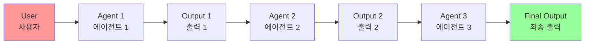

**프롬프트 체이닝 패턴**: 에이전트는 사용자로부터 일련의 프롬프트를 받으며, 각 에이전트의 출력이 체인에서 다음의 입력으로 작동합니다.

## 핵심 요약 (Key Takeaways)

다음은 주요 요약 사항입니다:

1. **프롬프트 체이닝은 복잡한 작업을 더 작고 집중된 단계의 시퀀스로 분해합니다**
   - 때로는 Pipeline 패턴이라고도 알려져 있습니다

2. **체인의 각 단계는 이전 단계의 출력을 입력으로 사용하는 LLM 호출이나 처리 로직을 포함합니다**

3. **이 패턴은 언어 모델과의 복잡한 상호작용의 신뢰성과 관리 가능성을 향상시킵니다**

4. **LangChain/LangGraph 및 Google ADK와 같은 프레임워크는 이러한 다단계 시퀀스를 정의, 관리 및 실행하기 위한 견고한 도구를 제공합니다**

## 결론

복잡한 문제를 더 간단하고 관리 가능한 하위 작업의 시퀀스로 분해함으로써, 프롬프트 체이닝은 대형 언어 모델을 안내하기 위한 견고한 프레임워크를 제공합니다.

이 "분할 정복" 전략은 모델을 한 번에 하나의 특정 작업에 집중시킴으로써 출력의 신뢰성과 제어를 크게 향상시킵니다.

기초 패턴으로서, 다단계 추론, 도구 통합 및 상태 관리를 수행할 수 있는 정교한 AI 에이전트 개발을 가능하게 합니다.

궁극적으로, 프롬프트 체이닝을 마스터하는 것은 단일 프롬프트의 능력을 훨씬 넘어서는 복잡한 워크플로우를 실행할 수 있는 견고하고 컨텍스트 인식 시스템을 구축하는 데 중요합니다.

## 이론적 배경 및 학술적 근거 (Theoretical Background and Academic Foundation)

### 인지 과학적 관점

프롬프트 체이닝은 인간의 인지 처리 과정과 밀접한 관련이 있습니다. 인지 과학 연구에 따르면, 인간은 복잡한 문제를 해결할 때 작업 기억(Working Memory)의 제한으로 인해 단계적으로 처리합니다. George A. Miller의 고전적인 연구(1956)는 인간의 작업 기억 용량이 약 7±2개의 청크(chunk)로 제한된다는 것을 보여주었습니다.

**LLM과의 유사성**:
- LLM의 컨텍스트 창은 인간의 작업 기억과 유사한 역할을 합니다
- 복잡한 작업을 여러 단계로 분해하면 각 단계에서 필요한 정보만 처리하므로 인지 부하를 줄입니다
- 이는 Baddeley의 작업 기억 모델(1986)에서 제시한 중앙 집행기(Central Executive)의 역할과 유사합니다

### 계산 이론적 관점

프롬프트 체이닝은 계산 이론에서의 **분할 정복(Divide-and-Conquer)** 알고리즘 패러다임과 직접적으로 연결됩니다:

1. **문제 분해**: 복잡한 문제를 더 작은 하위 문제로 분해
2. **재귀적 해결**: 각 하위 문제를 독립적으로 해결
3. **결과 통합**: 하위 문제의 해결책을 결합하여 최종 해결책 구성

이 접근 방식은 시간 복잡도와 공간 복잡도를 최적화하는 데 도움이 됩니다.

### 정보 이론적 관점

Claude Shannon의 정보 이론(1948)에 따르면, 정보의 전달은 엔트로피와 밀접한 관련이 있습니다. 프롬프트 체이닝은:

- **정보 엔트로피 감소**: 각 단계에서 불확실성을 점진적으로 줄여 최종 출력의 엔트로피를 최소화
- **정보 전달 최적화**: 구조화된 출력 형식(JSON, XML)을 사용하여 단계 간 정보 손실을 최소화
- **상호 정보량(Mutual Information) 증가**: 이전 단계의 출력과 다음 단계의 입력 간의 상호 정보량을 최대화하여 컨텍스트 보존

### 심리학적 근거: 청킹 이론

인지 심리학의 청킹(Chunking) 이론은 프롬프트 체이닝의 효과를 설명하는 데 유용합니다:

- **청크 형성**: 복잡한 정보를 의미 있는 단위로 그룹화
- **인지 부하 감소**: 각 단계에서 처리해야 하는 정보의 양을 제한
- **패턴 인식 향상**: 작은 단위로 분해된 작업에서 모델이 패턴을 더 잘 인식

### 기계 학습 이론: 전이 학습과 파인튜닝

프롬프트 체이닝은 전이 학습(Transfer Learning)의 원칙을 활용합니다:

- **도메인 적응**: 각 단계에서 모델이 특정 도메인에 집중하도록 유도
- **점진적 학습**: 이전 단계의 지식을 다음 단계로 전달
- **특화된 역할**: 각 프롬프트가 모델을 특정 역할(예: 분석가, 작가)로 특화시킴

## 성능 최적화 기법 (Performance Optimization Techniques)

### 1. 캐싱 전략

중간 결과를 캐싱하여 동일한 입력에 대한 재계산을 방지:

```python
from functools import lru_cache
from langchain.cache import InMemoryCache
from langchain.globals import set_llm_cache

# LLM 응답 캐싱 활성화
set_llm_cache(InMemoryCache())

# 중간 결과 캐싱
@lru_cache(maxsize=128)
def cached_extraction(text: str) -> str:
    # 추출 로직
    pass
```

### 2. 병렬 처리와 순차 처리의 균형

독립적인 단계는 병렬로 실행하고, 의존적인 단계는 순차적으로 실행:

```python
from langchain_core.runnables import RunnableParallel, RunnablePassthrough

# 병렬 처리 가능한 단계
parallel_steps = RunnableParallel({
    "summary": summarize_chain,
    "entities": extract_entities_chain,
    "sentiment": analyze_sentiment_chain
})

# 순차 처리 필요한 단계
sequential_chain = parallel_steps | synthesis_chain
```

### 3. 조기 종료(Early Stopping)

조건이 충족되면 체인을 조기에 종료하여 불필요한 계산을 방지:

```python
def should_continue(state):
    if state.get("confidence") > 0.95:
        return "end"
    return "continue"
```

### 4. 동적 프롬프트 선택

작업의 복잡도에 따라 다른 프롬프트를 선택:

```python
def select_prompt(complexity: str):
    if complexity == "simple":
        return simple_prompt
    elif complexity == "medium":
        return medium_prompt
    else:
        return complex_prompt
```

## 트레이드오프 및 한계점 (Trade-offs and Limitations)

### 장점

1. **신뢰성 향상**: 각 단계가 집중되어 오류 가능성 감소
2. **디버깅 용이성**: 문제가 발생한 단계를 쉽게 식별
3. **모듈성**: 각 단계를 독립적으로 수정 및 최적화 가능
4. **확장성**: 새로운 단계를 쉽게 추가 가능

### 단점 및 한계

1. **지연 시간 증가**: 여러 단계를 순차적으로 실행하므로 전체 처리 시간이 증가할 수 있음
2. **비용 증가**: 각 단계마다 LLM 호출이 필요하므로 API 비용이 증가
3. **상태 관리 복잡성**: 단계 간 상태 전달이 복잡해질 수 있음
4. **오류 전파**: 한 단계의 오류가 후속 단계에 영향을 줄 수 있음 (구조화된 출력으로 완화 가능)

### 완화 전략

1. **구조화된 출력**: JSON/XML 형식으로 데이터 무결성 보장
2. **검증 단계**: 각 단계 후 출력 검증을 통해 오류 조기 발견
3. **재시도 메커니즘**: 실패한 단계에 대한 재시도 로직 구현
4. **폴백 전략**: 복잡한 체인 실패 시 단순화된 대안 제공

## 관련 패턴과의 비교 (Comparison with Related Patterns)

### Prompt Chaining vs. Single Prompt

| 특성 | Single Prompt | Prompt Chaining |
|------|--------------|-----------------|
| 복잡도 | 낮음 | 높음 |
| 신뢰성 | 낮음 (복잡한 작업) | 높음 |
| 지연 시간 | 낮음 | 높음 |
| 비용 | 낮음 | 높음 |
| 디버깅 | 어려움 | 쉬움 |
| 확장성 | 제한적 | 우수 |

### Prompt Chaining vs. Parallel Processing

프롬프트 체이닝은 순차적 의존성이 있는 작업에 적합하고, 병렬 처리는 독립적인 작업에 적합합니다. 실제 시스템에서는 두 패턴을 결합하여 사용합니다:

- **병렬 단계**: 독립적인 데이터 수집
- **순차 단계**: 종속적인 종합 및 정제

## 실무 적용 사례 확장 (Extended Practical Applications)

### 1. 금융 분석 자동화

복잡한 금융 보고서 분석을 위한 다단계 파이프라인:

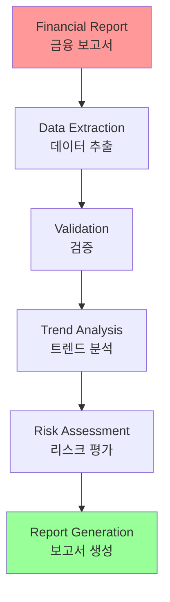

### 2. 법률 문서 검토

법률 문서의 자동 검토 및 요약:

1. **문서 구조 분석**: 섹션 및 조항 식별
2. **핵심 조항 추출**: 중요한 법적 조항 추출
3. **리스크 평가**: 잠재적 리스크 식별
4. **요약 생성**: 이해하기 쉬운 요약 생성

### 3. 의료 진단 지원

의료 데이터 분석을 위한 체인:

1. **증상 추출**: 환자 기록에서 증상 추출
2. **병력 분석**: 과거 병력 분석
3. **가능성 평가**: 가능한 진단 평가
4. **권장사항 생성**: 치료 권장사항 생성

## 참고 자료 (References)

### 학술 논문

1. Miller, G. A. (1956). "The magical number seven, plus or minus two: Some limits on our capacity for processing information." *Psychological Review*, 63(2), 81-97.

2. Baddeley, A. D., & Hitch, G. (1974). "Working memory." *Psychology of Learning and Motivation*, 8, 47-89.

3. Shannon, C. E. (1948). "A mathematical theory of communication." *Bell System Technical Journal*, 27(3), 379-423.

4. Wei, J., et al. (2022). "Chain-of-Thought Prompting Elicits Reasoning in Large Language Models." *Advances in Neural Information Processing Systems*, 35.

5. Kojima, T., et al. (2022). "Large Language Models are Zero-Shot Reasoners." *Advances in Neural Information Processing Systems*, 35.

### 프레임워크 및 도구 문서

1. LangChain Documentation on LCEL:
   https://python.langchain.com/v0.2/docs/core_modules/expression_language/

2. LangGraph Documentation: 
   https://langchain-ai.github.io/langgraph/

3. Prompt Engineering Guide - Chaining Prompts:
   https://www.promptingguide.ai/techniques/chaining

4. OpenAI API Documentation (General Prompting Concepts):
   https://platform.openai.com/docs/guides/gpt/prompting

5. Crew AI Documentation (Tasks and Processes): 
   https://docs.crewai.com/

6. Google AI for Developers (Prompting Guides):
   https://cloud.google.com/discover/what-is-prompt-engineering?hl=en

7. Vertex Prompt Optimizer:
   https://cloud.google.com/vertex-ai/generative-ai/docs/learn/prompts/prompt-optimizer

### 추가 학습 자료

8. "Prompt Engineering for Large Language Models" by James Phoenix and Raza Habib (2023)

9. "The Art of Prompt Engineering" - Comprehensive guide on prompt chaining techniques

10. "Chain-of-Thought Reasoning" - Research on sequential reasoning in LLMs

---

**이전 챕터**: [What makes an AI system an agent?](chapter_00_What_makes_an_AI_system_an_agent.md)  
**다음 챕터**: [Chapter 2: Routing](chapter_02_Routing.md)

