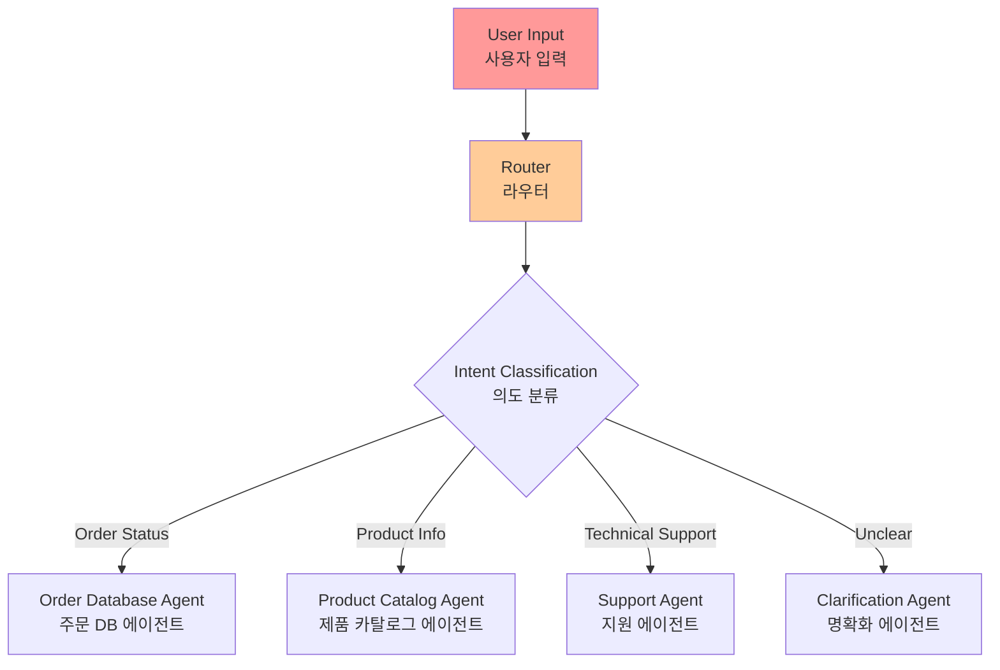
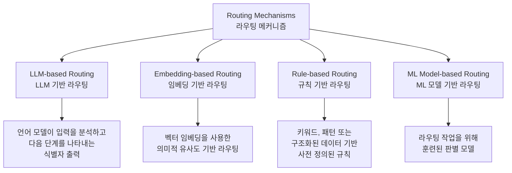
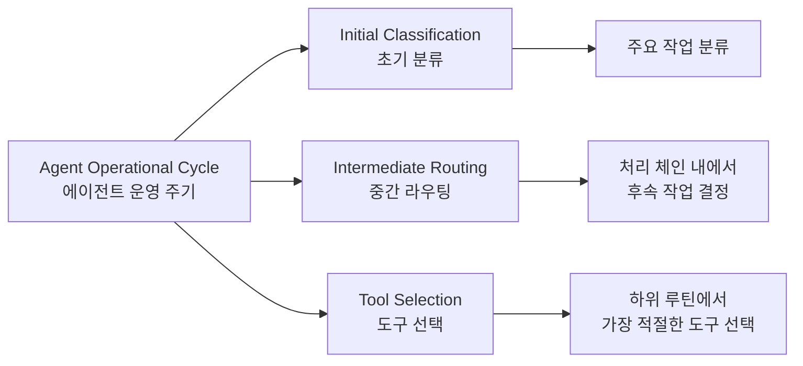
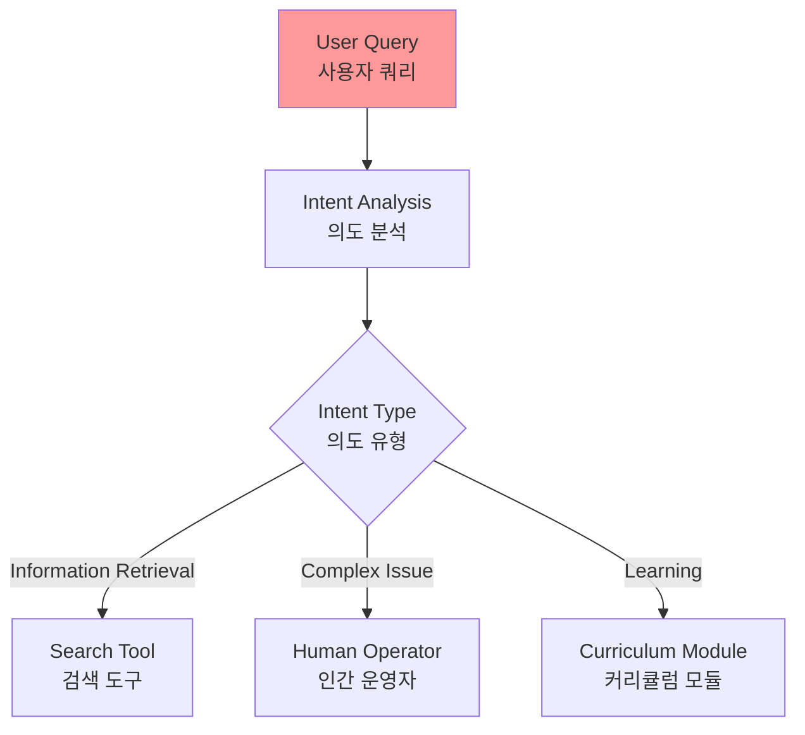
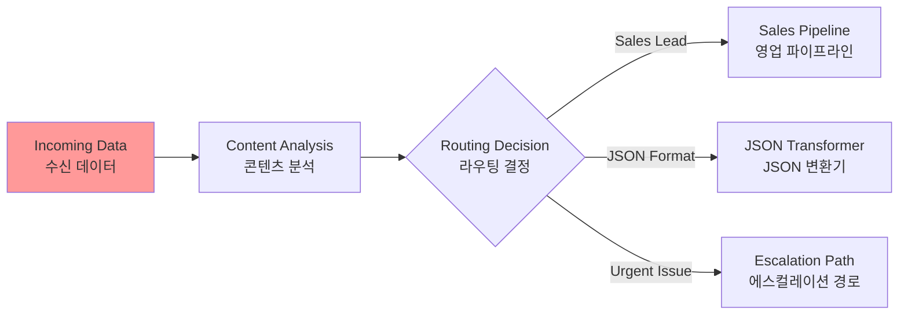
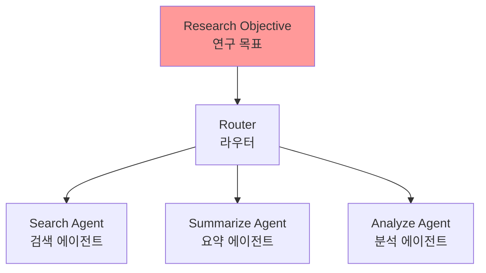
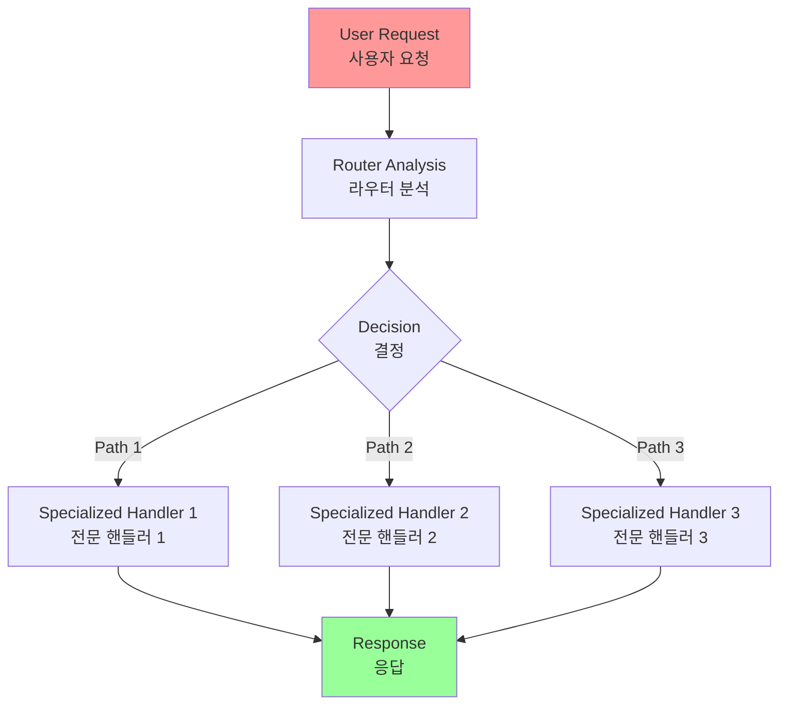
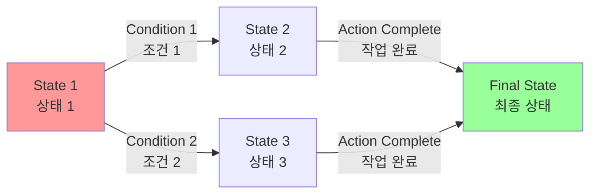
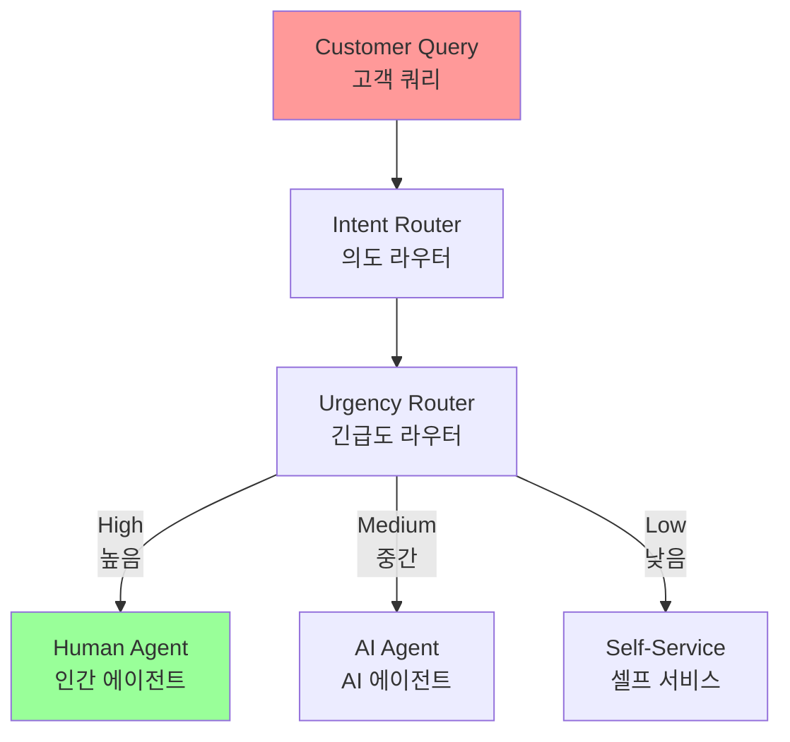

# Chapter 2: Routing

## 개요

While sequential processing via prompt chaining is a foundational technique for executing deterministic, linear workflows with language models, its applicability is limited in scenarios requiring adaptive responses. Real-world agentic systems must often arbitrate between multiple potential actions based on contingent factors, such as the state of the environment, user input, or the outcome of a preceding operation. This capacity for dynamic decision-making, which governs the flow of control to different specialized functions, tools, or sub-processes, is achieved through a mechanism known as routing.

프롬프트 체이닝을 통한 순차적 처리는 언어 모델과 함께 결정론적이고 선형적인 워크플로우를 실행하기 위한 기초 기술이지만, 적응형 응답이 필요한 시나리오에서는 적용 범위가 제한적입니다. 실제 에이전트 시스템은 종종 환경 상태, 사용자 입력 또는 이전 작업의 결과와 같은 조건부 요소를 기반으로 여러 잠재적 행동 사이에서 중재해야 합니다.

## 패턴 개요 (Pattern Overview)

### 핵심 개념

Routing introduces conditional logic into an agent's operational framework, enabling a shift from a fixed execution path to a model where the agent dynamically evaluates specific criteria to select from a set of possible subsequent actions. This allows for more flexible and context-aware system behavior.

라우팅은 에이전트의 운영 프레임워크에 조건부 로직을 도입하여 고정된 실행 경로에서 에이전트가 특정 기준을 동적으로 평가하여 가능한 후속 행동 집합에서 선택하는 모델로 전환할 수 있게 합니다. 이것은 더 유연하고 컨텍스트 인식 시스템 행동을 허용합니다.

**Routing(라우팅)**은 제어 흐름을 다른 전문 함수, 도구 또는 하위 프로세스로 안내하는 동적 의사결정 능력입니다.



### 예시: 고객 문의 에이전트

For instance, an agent designed for customer inquiries, when equipped with a routing function, can first classify an incoming query to determine the user's intent. Based on this classification, it can then direct the query to a specialized agent for direct question-answering, a database retrieval tool for account information, or an escalation procedure for complex issues, rather than defaulting to a single, predetermined response pathway.

예를 들어, 고객 문의를 위해 설계된 에이전트는 라우팅 기능을 갖추면 먼저 들어오는 쿼리를 분류하여 사용자의 의도를 결정할 수 있습니다. 이 분류를 기반으로, 단일의 사전 결정된 응답 경로로 기본 설정하는 대신, 직접 질문 답변을 위한 전문 에이전트, 계정 정보를 위한 데이터베이스 검색 도구, 또는 복잡한 문제를 위한 에스컬레이션 절차로 쿼리를 안내할 수 있습니다.

Therefore, a more sophisticated agent using routing could:

따라서 라우팅을 사용하는 더 정교한 에이전트는 다음과 같이 할 수 있습니다:

1. **Analyze the user's query.**
2. **Route the query based on its intent:**
   - **If the intent is "check order status"**, route to a sub-agent or tool chain that interacts with the order database.
   - **If the intent is "product information"**, route to a sub-agent or chain that searches the product catalog.
   - **If the intent is "technical support"**, route to a different chain that accesses troubleshooting guides or escalates to a human.
   - **If the intent is unclear**, route to a clarification sub-agent or prompt chain.

1. **사용자 쿼리 분석**
2. **의도에 따른 쿼리 라우팅**:
   - 의도가 "주문 상태 확인"인 경우 → 주문 데이터베이스와 상호작용하는 하위 에이전트 또는 도구 체인으로 라우팅
   - 의도가 "제품 정보"인 경우 → 제품 카탈로그를 검색하는 하위 에이전트 또는 체인으로 라우팅
   - 의도가 "기술 지원"인 경우 → 문제 해결 가이드에 접근하거나 인간에게 에스컬레이션하는 다른 체인으로 라우팅
   - 의도가 불명확한 경우 → 명확화 하위 에이전트 또는 프롬프트 체인으로 라우팅

### 라우팅 메커니즘의 유형

The core component of the Routing pattern is a mechanism that performs the evaluation and directs the flow. This mechanism can be implemented in several ways:

라우팅 패턴의 핵심 구성 요소는 평가를 수행하고 흐름을 안내하는 메커니즘입니다. 이 메커니즘은 여러 방법으로 구현할 수 있습니다.



#### 1. LLM 기반 라우팅 (LLM-based Routing)

**LLM-based Routing**: The language model itself can be prompted to analyze the input and output a specific identifier or instruction that indicates the next step or destination. For example, a prompt might ask the LLM to "Analyze the following user query and output only the category: 'Order Status', 'Product Info', 'Technical Support', or 'Other'." The agentic system then reads this output and directs the workflow accordingly.

언어 모델 자체가 입력을 분석하고 다음 단계나 목적지를 나타내는 특정 식별자나 지시사항을 출력하도록 프롬프트할 수 있습니다.

**예시**:
```
"다음 사용자 쿼리를 분석하고 카테고리만 출력하세요: 'Order Status', 'Product Info', 'Technical Support', 또는 'Other'."
```

에이전트 시스템은 이 출력을 읽고 그에 따라 워크플로우를 안내합니다.

#### 2. 임베딩 기반 라우팅 (Embedding-based Routing)

**Embedding-based Routing**: The input query can be converted into a vector embedding (see RAG, Chapter 14). This embedding is then compared to embeddings representing different routes or capabilities. The query is routed to the route whose embedding is most similar. This is useful for semantic routing, where the decision is based on the meaning of the input rather than just keywords.

입력 쿼리를 벡터 임베딩으로 변환한 다음(Chapter 14 RAG 참조), 다른 경로나 기능을 나타내는 임베딩과 비교합니다. 쿼리는 가장 유사한 임베딩을 가진 경로로 라우팅됩니다.

**특징**:
- 입력의 의미에 기반한 결정이므로 의미적 라우팅에 유용
- 키워드뿐만 아니라 의미를 기반으로 한 라우팅 가능

#### 3. 규칙 기반 라우팅 (Rule-based Routing)

**Rule-based Routing**: This involves using predefined rules or logic (e.g., if-else statements, switch cases) based on keywords, patterns, or structured data extracted from the input. This can be faster and more deterministic than LLM-based routing, but is less flexible for handling nuanced or novel inputs.

입력에서 추출된 키워드, 패턴 또는 구조화된 데이터를 기반으로 사전 정의된 규칙이나 로직(예: if-else 문, switch case)을 사용합니다.

**특징**:
- LLM 기반 라우팅보다 빠르고 더 결정론적일 수 있음
- 뉘앙스가 있거나 새로운 입력을 처리하는 데 덜 유연함

#### 4. 머신러닝 모델 기반 라우팅 (Machine Learning Model-Based Routing)

**Machine Learning Model-Based Routing**: It employs a discriminative model, such as a classifier, that has been specifically trained on a small corpus of labeled data to perform a routing task. While it shares conceptual similarities with embedding-based methods, its key characteristic is the supervised fine-tuning process, which adjusts the model's parameters to create a specialized routing function. This technique is distinct from LLM-based routing because the decision-making component is not a generative model executing a prompt at inference time. Instead, the routing logic is encoded within the fine-tuned model's learned weights. While LLMs may be used in a pre-processing step to generate synthetic data for augmenting the training set, they are not involved in the real-time routing decision itself.

라우팅 작업을 수행하기 위해 소규모 레이블 데이터 코퍼스에서 특별히 훈련된 판별 모델(예: 분류기)을 사용합니다.

**특징**:
- 임베딩 기반 방법과 개념적 유사성을 공유하지만, 감독된 파인튜닝 프로세스가 핵심 특성
- 모델의 매개변수를 조정하여 특수 라우팅 함수 생성
- LLM 기반 라우팅과의 차이점:
  - 의사결정 구성 요소가 추론 시 프롬프트를 실행하는 생성 모델이 아님
  - 라우팅 로직이 파인튜닝된 모델의 학습된 가중치 내에 인코딩됨
  - LLM은 훈련 세트를 보강하기 위한 합성 데이터 생성의 전처리 단계에서 사용될 수 있지만, 실시간 라우팅 결정 자체에는 관여하지 않음

### 라우팅 메커니즘의 적용 지점

Routing mechanisms can be implemented at multiple junctures within an agent's operational cycle. They can be applied at the outset to classify a primary task, at intermediate points within a processing chain to determine a subsequent action, or during a subroutine to select the most appropriate tool from a given set.

라우팅 메커니즘은 에이전트의 운영 주기 내 여러 지점에서 구현할 수 있습니다:



1. **초기 분류**: 주요 작업을 분류하기 위해 시작 시 적용
2. **중간 라우팅**: 처리 체인 내 중간 지점에서 후속 작업을 결정하기 위해 적용
3. **도구 선택**: 하위 루틴에서 주어진 집합에서 가장 적절한 도구를 선택하기 위해 적용

### 프레임워크 지원

Computational frameworks such as LangChain, LangGraph, and Google's Agent Developer Kit (ADK) provide explicit constructs for defining and managing such conditional logic. With its state-based graph architecture, LangGraph is particularly well-suited for complex routing scenarios where decisions are contingent upon the accumulated state of the entire system. Similarly, Google's ADK provides foundational components for structuring an agent's capabilities and interaction models, which serve as the basis for implementing routing logic. Within the execution environments provided by these frameworks, developers define the possible operational paths and the functions or model-based evaluations that dictate the transitions between nodes in the computational graph.

LangChain, LangGraph, Google의 Agent Developer Kit (ADK)와 같은 계산 프레임워크는 이러한 조건부 로직을 정의하고 관리하기 위한 명시적 구성을 제공합니다:

- **LangGraph**: 상태 기반 그래프 아키텍처로, 결정이 전체 시스템의 누적 상태에 따라 달라지는 복잡한 라우팅 시나리오에 특히 적합
- **Google ADK**: 에이전트의 기능과 상호작용 모델을 구조화하기 위한 기초 구성 요소를 제공하여 라우팅 로직 구현의 기반 역할

이러한 프레임워크의 실행 환경 내에서 개발자는 가능한 운영 경로와 계산 그래프의 노드 간 전환을 지시하는 함수 또는 모델 기반 평가를 정의합니다.

### 라우팅의 이점

The implementation of routing enables a system to move beyond deterministic sequential processing. It facilitates the development of more adaptive execution flows that can respond dynamically and appropriately to a wider range of inputs and state changes.

라우팅 구현은 시스템이 결정론적 순차 처리를 넘어서도록 합니다:

- 더 적응적인 실행 흐름 개발을 용이하게 함
- 더 넓은 범위의 입력과 상태 변화에 동적으로 적절하게 응답할 수 있음
- 정적이고 사전 결정된 실행 경로에서 동적이고 컨텍스트 인식 워크플로우로 전환

## 실용적 응용 및 사용 사례 (Practical Applications & Use Cases)

The Routing pattern significantly enhances an agent's adaptability and efficiency across various real-world scenarios:

라우팅 패턴은 다양한 실제 시나리오에서 에이전트의 적응성과 효율성을 크게 향상시킵니다:

The routing pattern is a critical control mechanism in the design of adaptive agentic systems, enabling them to dynamically alter their execution path in response to variable inputs and internal states. Its utility spans multiple domains by providing a necessary layer of conditional logic.

라우팅 패턴은 적응형 에이전트 시스템 설계에서 중요한 제어 메커니즘으로, 다양한 입력과 내부 상태에 응답하여 실행 경로를 동적으로 변경할 수 있게 합니다.

### 1. 인간-컴퓨터 상호작용 (Human-Computer Interaction)

In human-computer interaction, such as with virtual assistants or AI-driven tutors, routing is employed to interpret user intent. An initial analysis of a natural language query determines the most appropriate subsequent action, whether it is invoking a specific information retrieval tool, escalating to a human operator, or selecting the next module in a curriculum based on user performance. This allows the system to move beyond linear dialogue flows and respond contextually.

가상 어시스턴트나 AI 기반 튜터와 같은 인간-컴퓨터 상호작용에서 라우팅은 사용자 의도를 해석하는 데 사용됩니다.



**특징**:
- 자연어 쿼리의 초기 분석이 가장 적절한 후속 작업을 결정
- 특정 정보 검색 도구 호출, 인간 운영자에게 에스컬레이션, 사용자 성능에 기반한 커리큘럼의 다음 모듈 선택 등
- 선형 대화 흐름을 넘어 컨텍스트적으로 응답할 수 있게 함

### 2. 자동화된 데이터 및 문서 처리 파이프라인

Within automated data and document processing pipelines, routing serves as a classification and distribution function. Incoming data, such as emails, support tickets, or API payloads, is analyzed based on content, metadata, or format. The system then directs each item to a corresponding workflow, such as a sales lead ingestion process, a specific data transformation function for JSON or CSV formats, or an urgent issue escalation path.

자동화된 데이터 및 문서 처리 파이프라인에서 라우팅은 분류 및 배포 기능으로 작동합니다.

**예시: 이메일/티켓 처리**



**프로세스**:
- 이메일, 지원 티켓 또는 API 페이로드와 같은 수신 데이터가 콘텐츠, 메타데이터 또는 형식을 기반으로 분석됨
- 각 항목이 해당 워크플로우로 전달됨:
  - 영업 리드 수집 프로세스 (sales lead ingestion process)
  - JSON 또는 CSV 형식에 대한 특정 데이터 변환 함수 (specific data transformation function for JSON or CSV formats)
  - 긴급 문제 에스컬레이션 경로 (urgent issue escalation path)

### 3. 다중 전문 도구 또는 에이전트를 포함하는 복잡한 시스템

In complex systems involving multiple specialized tools or agents, routing acts as a high-level dispatcher. A research system composed of distinct agents for searching, summarizing, and analyzing information would use a router to assign tasks to the most suitable agent based on the current objective. Similarly, an AI coding assistant uses routing to identify the programming language and user's intent—to debug, explain, or translate—before passing a code snippet to the correct specialized tool.

복잡한 시스템에서 라우팅은 고수준 디스패처 역할을 합니다.

**예시: 연구 시스템**



- 검색, 요약 및 정보 분석을 위한 별개의 에이전트로 구성된 연구 시스템
- 라우터가 현재 목표를 기반으로 가장 적절한 에이전트에 작업을 할당

**예시: AI 코딩 어시스턴트**

Similarly, an AI coding assistant uses routing to identify the programming language and user's intent—to debug, explain, or translate—before passing a code snippet to the correct specialized tool.

- 프로그래밍 언어와 사용자 의도(디버그, 설명 또는 번역)를 식별하기 위해 라우팅 사용
- 코드 스니펫을 올바른 전문 도구로 전달하기 전에 라우팅 수행

### 라우팅의 핵심 가치

Ultimately, routing provides the capacity for logical arbitration that is essential for creating functionally diverse and context-aware systems. It transforms an agent from a static executor of pre-defined sequences into a dynamic system that can make decisions about the most effective method for accomplishing a task under changing conditions.

라우팅은 논리적 중재 능력을 제공하며, 이는 기능적으로 다양하고 컨텍스트 인식 시스템을 만드는 데 필수적입니다:

- 에이전트를 사전 정의된 시퀀스의 정적 실행자에서 변화하는 조건 하에서 작업을 수행하는 가장 효과적인 방법에 대해 결정을 내릴 수 있는 동적 시스템으로 변환

## 실습 코드 예제 (Hands-On Code Example)

Implementing routing in code involves defining the possible paths and the logic that decides which path to take. Frameworks like LangChain and LangGraph provide specific components and structures for this. LangGraph's state-based graph structure is particularly intuitive for visualizing and implementing routing logic.

This code demonstrates a simple agent-like system using LangChain and Google's Generative AI. It sets up a "coordinator" that routes user requests to different simulated "sub-agent" handlers based on the request's intent (booking, information, or unclear). The system uses a language model to classify the request and then delegates it to the appropriate handler function, simulating a basic delegation pattern often seen in multi-agent architectures.

코드에서 라우팅을 구현하는 것은 가능한 경로와 어떤 경로를 취할지 결정하는 로직을 정의하는 것을 포함합니다. LangChain과 LangGraph와 같은 프레임워크는 이를 위한 특정 구성 요소와 구조를 제공합니다. LangGraph의 상태 기반 그래프 구조는 라우팅 로직을 시각화하고 구현하는 데 특히 직관적입니다.

이 코드는 LangChain과 Google의 Generative AI를 사용하는 간단한 에이전트 유사 시스템을 보여줍니다. 요청의 의도(예약, 정보 또는 불명확)에 따라 사용자 요청을 다른 시뮬레이션된 "하위 에이전트" 핸들러로 라우팅하는 "코디네이터"를 설정합니다. 시스템은 언어 모델을 사용하여 요청을 분류한 다음 적절한 핸들러 함수에 위임하여 다중 에이전트 아키텍처에서 자주 볼 수 있는 기본 위임 패턴을 시뮬레이션합니다.

### LangChain 예제

이 코드는 LangChain과 Google의 Generative AI를 사용하여 간단한 에이전트 유사 시스템을 설정합니다. 사용자 요청의 의도(예약, 정보 또는 불명확)에 따라 사용자 요청을 다른 시뮬레이션된 "하위 에이전트" 핸들러로 라우팅하는 "코디네이터"를 설정합니다.

#### 설치

필요한 라이브러리를 설치합니다:

```bash
pip install langchain langgraph google-cloud-aiplatform langchain-google-genai google-adk deprecated pydantic
```

API 키를 환경 변수로 설정해야 합니다 (예: OpenAI, Google Gemini, Anthropic).

#### 전체 코드

```python
# Copyright (c) 2025 Marco Fago
# https://www.linkedin.com/in/marco-fago/
#
# This code is licensed under the MIT License.
# See the LICENSE file in the repository for the full license text.

from langchain_google_genai import ChatGoogleGenerativeAI
from langchain_core.prompts import ChatPromptTemplate
from langchain_core.output_parsers import StrOutputParser
from langchain_core.runnables import RunnablePassthrough, RunnableBranch

# --- Configuration ---
# API 키 환경 변수가 설정되어 있는지 확인 (예: GOOGLE_API_KEY)
try:
    llm = ChatGoogleGenerativeAI(model="gemini-2.5-flash", temperature=0)
    print(f"Language model initialized: {llm.model}")
except Exception as e:
    print(f"Error initializing language model: {e}")
    llm = None

# --- 시뮬레이션된 하위 에이전트 핸들러 정의 (ADK 하위 에이전트와 동일) ---
def booking_handler(request: str) -> str:
    """예약 에이전트가 요청을 처리하는 것을 시뮬레이션합니다."""
    print("\n--- DELEGATING TO BOOKING HANDLER ---")
    return f"Booking Handler processed request: '{request}'. Result: Simulated booking action."

def info_handler(request: str) -> str:
    """정보 에이전트가 요청을 처리하는 것을 시뮬레이션합니다."""
    print("\n--- DELEGATING TO INFO HANDLER ---")
    return f"Info Handler processed request: '{request}'. Result: Simulated information retrieval."

def unclear_handler(request: str) -> str:
    """위임할 수 없는 요청을 처리합니다."""
    print("\n--- HANDLING UNCLEAR REQUEST ---")
    return f"Coordinator could not delegate request: '{request}'. Please clarify."

# --- 코디네이터 라우터 체인 정의 (ADK 코디네이터의 지시사항과 동일) ---
# 이 체인은 어떤 핸들러에 위임할지 결정합니다.
coordinator_router_prompt = ChatPromptTemplate.from_messages([
    ("system", """Analyze the user's request and determine which specialist handler should process it.
- If the request is related to booking flights or hotels, output 'booker'.
- For all other general information questions, output 'info'.
- If the request is unclear or doesn't fit either category, output 'unclear'.
ONLY output one word: 'booker', 'info', or 'unclear'."""),
    ("user", "{request}")
])

if llm:
    coordinator_router_chain = coordinator_router_prompt | llm | StrOutputParser()

# --- 위임 로직 정의 (ADK의 Auto-Flow 기반 하위 에이전트와 동일) ---
# RunnableBranch를 사용하여 라우터 체인의 출력을 기반으로 라우팅합니다.
# RunnableBranch의 분기 정의
branches = {
    "booker": RunnablePassthrough.assign(output=lambda x: booking_handler(x['request']['request'])),
    "info": RunnablePassthrough.assign(output=lambda x: info_handler(x['request']['request'])),
    "unclear": RunnablePassthrough.assign(output=lambda x: unclear_handler(x['request']['request'])),
}

# RunnableBranch 생성. 라우터 체인의 출력을 가져와서
# 원래 입력('request')을 해당 핸들러로 라우팅합니다.
delegation_branch = RunnableBranch(
    (lambda x: x['decision'].strip() == 'booker', branches["booker"]),
    (lambda x: x['decision'].strip() == 'info', branches["info"]),
    branches["unclear"]  # 'unclear' 또는 기타 출력에 대한 기본 분기
)

# 라우터 체인과 위임 분기를 단일 실행 가능한 것으로 결합
# 라우터 체인의 출력('decision')은 원래 입력('request')과 함께
# delegation_branch로 전달됩니다.
coordinator_agent = {
    "decision": coordinator_router_chain,
    "request": RunnablePassthrough()
} | delegation_branch | (lambda x: x['output'])  # 최종 출력 추출

# --- 사용 예시 ---
def main():
    if not llm:
        print("\nSkipping execution due to LLM initialization failure.")
        return
    
    print("--- Running with a booking request ---")
    request_a = "Book me a flight to London."
    result_a = coordinator_agent.invoke({"request": request_a})
    print(f"Final Result A: {result_a}")
    
    print("\n--- Running with an info request ---")
    request_b = "What is the capital of Italy?"
    result_b = coordinator_agent.invoke({"request": request_b})
    print(f"Final Result B: {result_b}")
    
    print("\n--- Running with an unclear request ---")
    request_c = "Tell me about quantum physics."
    result_c = coordinator_agent.invoke({"request": request_c})
    print(f"Final Result C: {result_c}")

if __name__ == "__main__":
    main()
```

#### 코드 설명

이 Python 코드는 LangChain 라이브러리와 Google의 Generative AI 모델(특히 gemini-2.5-flash)을 사용하여 간단한 에이전트 유사 시스템을 구성합니다:

1. **세 개의 시뮬레이션된 하위 에이전트 핸들러 정의**:
   - `booking_handler`: 예약 관련 요청 처리
   - `info_handler`: 정보 관련 요청 처리
   - `unclear_handler`: 불명확한 요청 처리

2. **코디네이터 라우터 체인**:
   - `ChatPromptTemplate`을 사용하여 언어 모델에 지시
   - 들어오는 사용자 요청을 세 가지 카테고리 중 하나로 분류: 'booker', 'info', 또는 'unclear'

3. **RunnableBranch를 사용한 위임**:
   - 언어 모델의 결정을 확인하고 요청 데이터를 해당 핸들러 함수로 전달

4. **코디네이터 에이전트**:
   - 이러한 구성 요소를 결합하여 먼저 요청을 라우팅한 다음 선택된 핸들러로 전달

### Google ADK 예제

Agent Development Kit (ADK)는 에이전트 시스템을 엔지니어링하기 위한 프레임워크로, 에이전트의 기능과 동작을 정의하기 위한 구조화된 환경을 제공합니다.

#### 코드 구조

```python
# Copyright (c) 2025 Marco Fago
#
# This code is licensed under the MIT License.
# See the LICENSE file in the repository for the full license text.

import uuid
from typing import Dict, Any, Optional
from google.adk.agents import Agent
from google.adk.runners import InMemoryRunner
from google.adk.tools import FunctionTool
from google.genai import types
from google.adk.events import Event

# --- 도구 함수 정의 ---
# 이러한 함수는 전문 에이전트의 동작을 시뮬레이션합니다.
def booking_handler(request: str) -> str:
    """항공편 및 호텔 예약 요청을 처리합니다."""
    return f"Booking processed: {request}"

def info_handler(request: str) -> str:
    """일반 정보 요청을 처리합니다."""
    return f"Information retrieved: {request}"

# --- 도구 정의 ---
booking_tool = FunctionTool.from_function(booking_handler)
info_tool = FunctionTool.from_function(info_handler)

# --- 하위 에이전트 정의 ---
booking_agent = Agent(
    name="Booker",
    model="gemini-2.0-flash",
    description="A specialized agent that handles all flight and hotel booking requests by calling the booking tool.",
    tools=[booking_tool]
)

info_agent = Agent(
    name="Info",
    model="gemini-2.0-flash",
    description="A specialized agent that provides general information and answers user questions by calling the info tool.",
    tools=[info_tool]
)

# --- 명시적 위임 지시사항을 가진 부모 에이전트 정의 ---
coordinator = Agent(
    name="Coordinator",
    model="gemini-2.0-flash",
    instruction=(
        "You are the main coordinator. Your only task is to analyze incoming user requests "
        "and delegate them to the appropriate specialist agent. Do not try to answer the user directly.\n"
        "- For any requests related to booking flights or hotels, delegate to the 'Booker' agent.\n"
        "- For all other general information questions, delegate to the 'Info' agent."
    ),
    description="A coordinator that routes user requests to the correct specialist agent.",
    # sub_agents의 존재는 기본적으로 LLM 기반 위임(Auto-Flow)을 활성화합니다.
    sub_agents=[booking_agent, info_agent]
)

# --- 실행 로직 ---
async def run_coordinator(runner: InMemoryRunner, request: str):
    """주어진 요청으로 코디네이터 에이전트를 실행하고 위임합니다."""
    print(f"\n--- Running Coordinator with request: '{request}' ---")
    final_result = ""
    try:
        user_id = "user_123"
        session_id = str(uuid.uuid4())
        await runner.session_service.create_session(
            app_name=runner.app_name, user_id=user_id, session_id=session_id
        )
        for event in runner.run(
            user_id=user_id,
            session_id=session_id,
            new_message=types.Content(
                role='user',
                parts=[types.Part(text=request)]
            ),
        ):
            if event.is_final_response() and event.content:
                if hasattr(event.content, 'text') and event.content.text:
                    final_result = event.content.text
                elif event.content.parts:
                    text_parts = [part.text for part in event.content.parts if part.text]
                    final_result = "".join(text_parts)
                break
        print(f"Coordinator Final Response: {final_result}")
        return final_result
    except Exception as e:
        print(f"An error occurred while processing your request: {e}")
        return f"An error occurred while processing your request: {e}"

async def main():
    """ADK 예제를 실행하는 메인 함수."""
    print("--- Google ADK Routing Example (ADK Auto-Flow Style) ---")
    print("Note: This requires Google ADK installed and authenticated.")
    runner = InMemoryRunner(coordinator)
    
    # 사용 예시
    result_a = await run_coordinator(runner, "Book me a hotel in Paris.")
    print(f"Final Output A: {result_a}")
    
    result_b = await run_coordinator(runner, "What is the highest mountain in the world?")
    print(f"Final Output B: {result_b}")
    
    result_c = await run_coordinator(runner, "Tell me a random fact.")
    print(f"Final Output C: {result_c}")
    
    result_d = await run_coordinator(runner, "Find flights to Tokyo next month.")
    print(f"Final Output D: {result_d}")

if __name__ == "__main__":
    import nest_asyncio
    nest_asyncio.apply()
    await main()
```

#### ADK 코드 설명

이 스크립트는 메인 Coordinator 에이전트와 두 개의 전문 하위 에이전트(Booker 및 Info)로 구성됩니다:

1. **전문 에이전트**: 각 전문 에이전트는 동작을 시뮬레이션하는 Python 함수를 래핑하는 FunctionTool로 장착됩니다
2. **Coordinator 에이전트**: 지시사항에 정의된 대로 주요 역할은 들어오는 사용자 메시지를 분석하고 Booker 또는 Info 에이전트에 위임하는 것입니다
3. **Auto-Flow 메커니즘**: Coordinator에 sub_agents가 정의되어 있기 때문에 ADK의 Auto-Flow 메커니즘에 의해 위임이 자동으로 처리됩니다
4. **실행**: `run_coordinator` 함수는 InMemoryRunner를 설정하고, 사용자 및 세션 ID를 생성한 다음, 코디네이터 에이전트를 통해 사용자의 요청을 처리하는 데 러너를 사용합니다

## 한눈에 보기 (At a Glance)

### 무엇 (What)

에이전트 시스템은 종종 단일의 선형 프로세스로 처리할 수 없는 다양한 입력과 상황에 응답해야 합니다:

- 단순한 순차적 워크플로우는 컨텍스트를 기반으로 결정을 내릴 수 있는 능력이 부족
- 특정 작업에 대한 올바른 도구나 하위 프로세스를 선택하는 메커니즘 없이는 시스템이 경직되고 적응하지 못함
- 실제 세계 사용자 요청의 복잡성과 가변성을 관리할 수 있는 정교한 애플리케이션을 구축하기 어려움

### 왜 (Why)

라우팅 패턴은 에이전트의 운영 프레임워크에 조건부 로직을 도입하여 표준화된 솔루션을 제공합니다:

- 시스템이 먼저 들어오는 쿼리를 분석하여 의도나 성격을 결정할 수 있게 함
- 이 분석을 기반으로 에이전트가 가장 적절한 전문 도구, 함수 또는 하위 에이전트로 제어 흐름을 동적으로 안내
- 이 결정은 LLM 프롬프트, 사전 정의된 규칙 적용, 또는 임베딩 기반 의미적 유사도 사용을 포함한 다양한 방법으로 구동될 수 있음
- 궁극적으로 라우팅은 정적이고 사전 결정된 실행 경로를 가능한 최선의 행동을 선택할 수 있는 유연하고 컨텍스트 인식 워크플로우로 변환

### 경험 법칙 (Rule of Thumb)

다음과 같은 경우 라우팅 패턴을 사용하세요:

- 에이전트가 사용자의 입력이나 현재 상태를 기반으로 여러 개의 별개의 워크플로우, 도구 또는 하위 에이전트 사이에서 결정해야 하는 경우
- 들어오는 요청을 분류하거나 분류하여 다양한 유형의 작업을 처리해야 하는 애플리케이션에 필수
- 예: 판매 문의, 기술 지원, 계정 관리 질문을 구분하는 고객 지원 봇

### 시각적 요약 (Visual Summary)



## 핵심 요약 (Key Takeaways)

1. **라우팅은 에이전트의 운영 프레임워크에 조건부 로직을 도입합니다**
   - 고정된 실행 경로에서 동적 의사결정 모델로 전환

2. **여러 라우팅 메커니즘이 있습니다**:
   - LLM 기반 라우팅
   - 임베딩 기반 라우팅
   - 규칙 기반 라우팅
   - 머신러닝 모델 기반 라우팅

3. **라우팅은 에이전트 운영 주기의 여러 지점에서 적용할 수 있습니다**:
   - 초기 작업 분류
   - 처리 체인 내 중간 라우팅
   - 도구 선택

4. **LangGraph와 Google ADK와 같은 프레임워크는 라우팅 로직을 구현하기 위한 강력한 도구를 제공합니다**

5. **라우팅은 정적 실행자에서 변화하는 조건에 적응할 수 있는 동적 시스템으로 에이전트를 변환합니다**

## 이론적 배경 및 학술적 근거 (Theoretical Background and Academic Foundation)

### 의사결정 이론 (Decision Theory)

라우팅 패턴은 의사결정 이론의 핵심 원칙을 구현합니다. Von Neumann과 Morgenstern의 기대 효용 이론(Expected Utility Theory, 1944)에 따르면, 최적의 의사결정은 가능한 결과의 확률과 효용을 고려하여 이루어집니다.

**라우팅에서의 적용**:
- **확률적 라우팅**: 각 경로의 성공 확률을 추정하여 최적 경로 선택
- **효용 함수**: 각 라우팅 옵션의 예상 효용(정확도, 속도, 비용)을 평가
- **베이지안 의사결정**: 사전 지식과 관찰된 데이터를 결합하여 라우팅 결정

### 패턴 인식 및 분류 이론

라우팅은 본질적으로 패턴 인식 문제입니다. 입력을 분석하여 적절한 카테고리로 분류하는 과정은 기계 학습의 분류 문제와 동일합니다.

**분류 알고리즘과의 관계**:
- **LLM 기반 라우팅**: 생성적 분류기(Generative Classifier)로 작동
- **임베딩 기반 라우팅**: 거리 기반 분류(Distance-based Classification)
- **ML 모델 기반 라우팅**: 판별적 분류기(Discriminative Classifier)

### 정보 이론: 엔트로피와 의사결정

Shannon의 정보 이론 관점에서 라우팅은 불확실성을 줄이는 과정입니다:

- **조건부 엔트로피**: 입력이 주어졌을 때 의도의 불확실성
- **상호 정보량**: 입력과 의도 간의 상관관계
- **정보 이득**: 라우팅 결정으로 얻는 정보량

### 제어 이론: 상태 머신과 전이

라우팅은 유한 상태 머신(Finite State Machine, FSM)의 개념과 밀접한 관련이 있습니다:



**상태 전이 규칙**:
- 각 상태는 특정 라우팅 결정을 나타냄
- 전이 조건은 입력 특성에 따라 결정
- 최종 상태는 작업 완료를 의미

## 성능 최적화 기법 (Performance Optimization Techniques)

### 1. 라우팅 캐싱

자주 사용되는 라우팅 결정을 캐싱하여 지연 시간 감소:

```python
from functools import lru_cache
from typing import Dict, Any

@lru_cache(maxsize=1000)
def cached_route_classification(query: str, query_hash: int) -> str:
    """캐시된 라우팅 분류"""
    # 라우팅 로직
    return route_decision
```

### 2. 조기 종료 (Early Exit)

명확한 의도가 감지되면 추가 분석 없이 즉시 라우팅:

```python
def route_with_early_exit(query: str) -> str:
    # 키워드 기반 빠른 분류
    if "order" in query.lower() and "status" in query.lower():
        return "order_status"  # 조기 종료
    
    # 더 복잡한 분석 필요 시
    return llm_based_routing(query)
```

### 3. 배치 처리

여러 쿼리를 배치로 처리하여 처리량 향상:

```python
def batch_route(queries: List[str]) -> List[str]:
    # 배치 임베딩 생성
    embeddings = embed_batch(queries)
    # 배치 분류
    routes = classify_batch(embeddings)
    return routes
```

### 4. 하이브리드 라우팅

여러 메커니즘을 결합하여 정확도와 속도 균형:

```python
def hybrid_route(query: str) -> str:
    # 빠른 규칙 기반 라우팅 시도
    rule_result = rule_based_route(query)
    if rule_result.confidence > 0.9:
        return rule_result.route
    
    # 불확실한 경우 LLM 기반 라우팅
    return llm_based_route(query)
```

## 트레이드오프 및 한계점 (Trade-offs and Limitations)

### 라우팅 메커니즘 비교

| 메커니즘 | 정확도 | 속도 | 비용 | 유연성 | 설명 가능성 |
|---------|--------|------|------|--------|------------|
| LLM 기반 | 높음 | 낮음 | 높음 | 매우 높음 | 중간 |
| 임베딩 기반 | 중간 | 높음 | 중간 | 높음 | 낮음 |
| 규칙 기반 | 낮음 | 매우 높음 | 낮음 | 낮음 | 매우 높음 |
| ML 모델 기반 | 높음 | 높음 | 중간 | 중간 | 중간 |

### 주요 한계점

1. **오분류 위험**: 잘못된 라우팅 결정은 전체 워크플로우 실패로 이어질 수 있음
2. **컨텍스트 손실**: 라우팅 과정에서 중요한 컨텍스트 정보가 손실될 수 있음
3. **확장성 문제**: 라우팅 옵션이 많아질수록 결정 복잡도 증가
4. **비용 증가**: LLM 기반 라우팅은 추가 API 호출 비용 발생

### 완화 전략

1. **폴백 메커니즘**: 라우팅 실패 시 기본 경로로 전환
2. **컨텍스트 보존**: 라우팅 결정과 함께 원본 컨텍스트 전달
3. **계층적 라우팅**: 다단계 라우팅으로 복잡도 관리
4. **비용 최적화**: 저비용 메커니즘을 먼저 시도하고 필요시 고비용 메커니즘 사용

## 관련 패턴과의 비교 (Comparison with Related Patterns)

### Routing vs. Prompt Chaining

| 특성 | Prompt Chaining | Routing |
|------|----------------|---------|
| 실행 모델 | 순차적 | 조건부 분기 |
| 의존성 | 강한 의존성 | 독립적 경로 |
| 복잡도 관리 | 단계별 분해 | 경로별 분기 |
| 적합한 시나리오 | 순차적 처리 | 조건부 선택 |

### Routing vs. Parallelization

라우팅은 병렬화와 결합하여 사용될 수 있습니다:

- **라우팅 후 병렬 처리**: 여러 경로로 분기한 후 각 경로를 병렬로 처리
- **병렬 처리 후 라우팅**: 병렬로 수집한 결과를 기반으로 최종 경로 선택

## 실무 적용 사례 확장 (Extended Practical Applications)

### 1. 지능형 고객 서비스 시스템

다층 라우팅을 사용한 고객 서비스:



### 2. 의료 진단 지원 시스템

증상 기반 라우팅:

1. **증상 분류**: 환자 증상을 카테고리별로 분류
2. **전문과 라우팅**: 적절한 전문과로 라우팅
3. **심각도 평가**: 응급 여부에 따라 처리 경로 결정

### 3. 금융 거래 시스템

거래 유형별 라우팅:

- **주문 유형 분류**: 시장가, 지정가, 스톱로스 등
- **거래소 라우팅**: 거래소별 최적 경로 선택
- **리스크 평가**: 리스크 수준에 따른 처리 경로

## 참고 자료 (References)

### 학술 논문

1. Von Neumann, J., & Morgenstern, O. (1944). *Theory of Games and Economic Behavior*. Princeton University Press.

2. Shannon, C. E. (1948). "A mathematical theory of communication." *Bell System Technical Journal*, 27(3), 379-423.

3. Cover, T. M., & Thomas, J. A. (2006). *Elements of Information Theory*. John Wiley & Sons.

4. Duda, R. O., Hart, P. E., & Stork, D. G. (2012). *Pattern Classification*. John Wiley & Sons.

5. Russell, S., & Norvig, P. (2020). *Artificial Intelligence: A Modern Approach*. Pearson.

### 프레임워크 및 도구 문서

1. LangGraph Documentation - Routing:
   https://langchain-ai.github.io/langgraph/how-tos/routing/

2. Google ADK Documentation - Agent Delegation:
   https://google.github.io/adk-docs/agents/multi-agents/

3. LangChain Routing Guide:
   https://python.langchain.com/docs/use_cases/question_answering/how_to/routing/

### 추가 학습 자료

4. "Decision Making Under Uncertainty" - MIT OpenCourseWare

5. "Pattern Recognition and Machine Learning" by Christopher Bishop

6. "Reinforcement Learning: An Introduction" by Sutton & Barto

## 결론

라우팅 패턴은 에이전트 시스템이 다양한 입력과 상황에 적응적으로 응답할 수 있도록 하는 중요한 제어 메커니즘입니다. 조건부 로직을 도입함으로써, 시스템은 컨텍스트를 기반으로 가장 적절한 행동을 선택할 수 있게 됩니다.

이 패턴은 단일의 선형 프로세스로는 처리할 수 없는 복잡한 실제 세계 시나리오를 다루는 정교한 에이전트 시스템을 구축하는 데 필수적입니다. 다양한 라우팅 메커니즘을 이해하고 적절히 선택하는 것은 효과적인 에이전트 시스템 개발의 핵심입니다.

---

**이전 챕터**: [Chapter 1: Prompt Chaining](chapter_01_Prompt_Chaining.md)  
**다음 챕터**: [Chapter 3: Parallelization](chapter_03_Parallelization.md)

