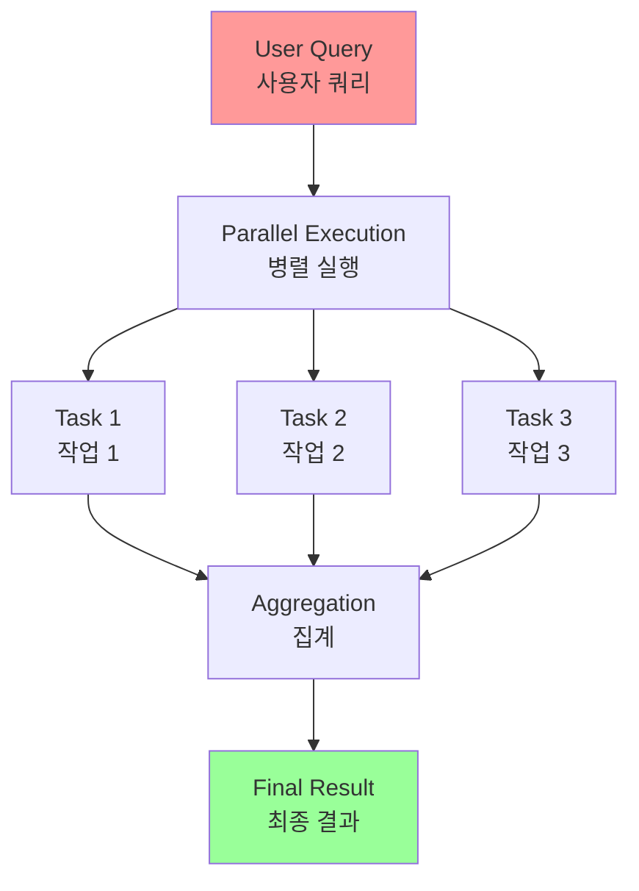
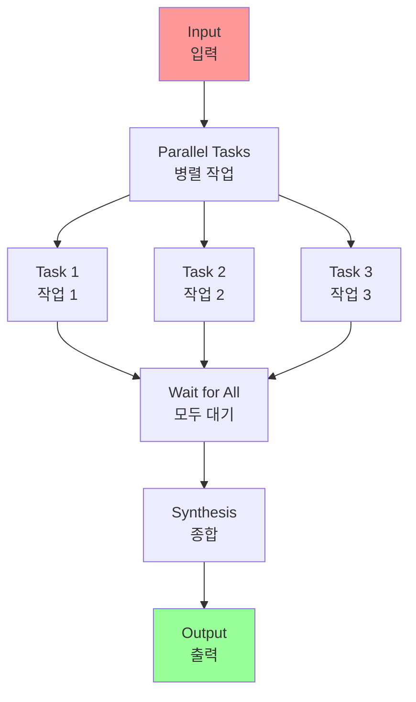
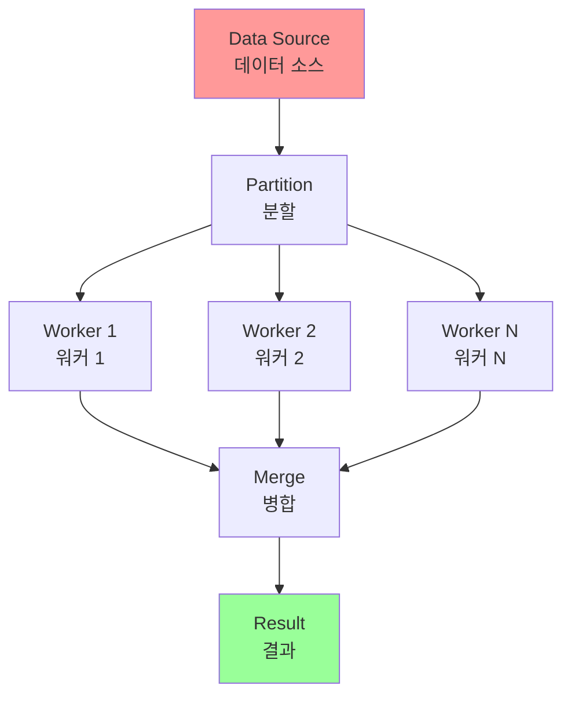

# Chapter 3: Parallelization

## 개요

In the previous chapters, we've explored Prompt Chaining for sequential workflows and Routing for dynamic decision-making and transitions between different paths. While these patterns are essential, many complex agentic tasks involve multiple sub-tasks that can be executed simultaneously rather than one after another. This is where the Parallelization pattern becomes crucial.

이전 챕터에서 순차적 워크플로우를 위한 Prompt Chaining과 다른 경로 간의 동적 의사결정 및 전환을 위한 Routing을 탐구했습니다. 이러한 패턴은 필수적이지만, 많은 복잡한 에이전트 작업은 하나씩 순차적으로 실행되는 대신 동시에 실행될 수 있는 여러 하위 작업을 포함합니다. 이것이 Parallelization 패턴이 중요한 이유입니다.

## 패턴 개요 (Pattern Overview)

### 핵심 개념

Parallelization involves executing multiple components, such as LLM calls, tool usages, or even entire sub-agents, concurrently (see Fig.1). Instead of waiting for one step to complete before starting the next, parallel execution allows independent tasks to run at the same time, significantly reducing the overall execution time for tasks that can be broken down into independent parts.

병렬화는 LLM 호출, 도구 사용 또는 전체 하위 에이전트와 같은 여러 구성 요소를 동시에 실행하는 것을 포함합니다(그림 1 참조). 한 단계가 완료될 때까지 기다린 다음 다음 단계를 시작하는 대신, 병렬 실행은 독립적인 작업이 동시에 실행될 수 있게 하여 독립적인 부분으로 분해될 수 있는 작업의 전체 실행 시간을 크게 줄입니다.

**Parallelization(병렬화)**은 LLM 호출, 도구 사용 또는 전체 하위 에이전트와 같은 여러 구성 요소를 동시에 실행하는 것을 포함합니다(그림 1 참조).



### 순차적 접근 vs 병렬 접근

Consider an agent designed to research a topic and summarize its findings. A sequential approach might:

주제를 연구하고 결과를 요약하도록 설계된 에이전트를 고려해보세요. 순차적 접근은 다음과 같을 수 있습니다:

**순차적 접근**:
1. Search for Source A.
2. Summarize Source A.
3. Search for Source B.
4. Summarize Source B.
5. Synthesize a final answer from summaries A and B.

1. Source A 검색
2. Source A 요약
3. Source B 검색
4. Source B 요약
5. 요약 A와 B에서 최종 답변 종합

A parallel approach could instead:

병렬 접근은 대신 다음과 같을 수 있습니다:

**병렬 접근**:
1. Search for Source A and Search for Source B simultaneously.
2. Once both searches are complete, Summarize Source A and Summarize Source B simultaneously.
3. Synthesize a final answer from summaries A and B (this step is typically sequential, waiting for the parallel steps to finish).

1. Source A와 Source B를 동시에 검색
2. 두 검색이 완료되면 Source A와 Source B를 동시에 요약
3. 요약 A와 B에서 최종 답변 종합 (이 단계는 일반적으로 순차적이며 병렬 단계가 완료될 때까지 대기)

### 핵심 아이디어

The core idea is to identify parts of the workflow that do not depend on the output of other parts and execute them in parallel. This is particularly effective when dealing with external services (like APIs or databases) that have latency, as you can issue multiple requests concurrently.

핵심 아이디어는 워크플로우의 다른 부분의 출력에 의존하지 않는 부분을 식별하고 병렬로 실행하는 것입니다. 이는 지연 시간이 있는 외부 서비스(API 또는 데이터베이스)를 다룰 때 특히 효과적입니다. 여러 요청을 동시에 발행할 수 있습니다.

### 프레임워크 지원

Implementing parallelization often requires frameworks that support asynchronous execution or multi-threading/multi-processing. Modern agentic frameworks are designed with asynchronous operations in mind, allowing you to easily define steps that can run in parallel.

병렬화 구현은 종종 비동기 실행 또는 다중 스레딩/다중 처리를 지원하는 프레임워크가 필요합니다. 현대적인 에이전트 프레임워크는 비동기 작업을 염두에 두고 설계되어 병렬로 실행될 수 있는 단계를 쉽게 정의할 수 있습니다.

Frameworks like LangChain, LangGraph, and Google ADK provide mechanisms for parallel execution. In LangChain Expression Language (LCEL), you can achieve parallel execution by combining runnable objects using operators like | (for sequential) and by structuring your chains or graphs to have branches that execute concurrently. LangGraph, with its graph structure, allows you to define multiple nodes that can be executed from a single state transition, effectively enabling parallel branches in the workflow. Google ADK provides robust, native mechanisms to facilitate and manage the parallel execution of agents, significantly enhancing the efficiency and scalability of complex, multi-agent systems. This inherent capability within the ADK framework allows developers to design and implement solutions where multiple agents can operate concurrently, rather than sequentially.

LangChain, LangGraph, Google ADK와 같은 프레임워크는 병렬 실행을 위한 메커니즘을 제공합니다. LangChain Expression Language (LCEL)에서는 `|` 연산자(순차적용)를 사용하여 runnable 객체를 결합하고 체인 또는 그래프를 동시에 실행되는 분기를 가진 구조로 만들어 병렬 실행을 달성할 수 있습니다. LangGraph는 그래프 구조를 통해 단일 상태 전환에서 실행될 수 있는 여러 노드를 정의할 수 있어 워크플로우에서 병렬 분기를 효과적으로 활성화합니다. Google ADK는 에이전트의 병렬 실행을 촉진하고 관리하기 위한 견고한 네이티브 메커니즘을 제공하여 복잡한 다중 에이전트 시스템의 효율성과 확장성을 크게 향상시킵니다. 이 ADK 프레임워크 내의 고유한 기능을 통해 개발자는 여러 에이전트가 순차적으로가 아닌 동시에 작동할 수 있는 솔루션을 설계하고 구현할 수 있습니다.

LangChain, LangGraph, Google ADK와 같은 프레임워크는 병렬 실행을 위한 메커니즘을 제공합니다:

- **LangChain Expression Language (LCEL)**: `|` 연산자(순차적용)를 사용하고 체인 또는 그래프를 동시에 실행되는 분기를 가진 구조로 만들어 병렬 실행을 달성할 수 있습니다
- **LangGraph**: 그래프 구조를 통해 단일 상태 전환에서 실행될 수 있는 여러 노드를 정의할 수 있어 워크플로우에서 병렬 분기를 효과적으로 활성화합니다
- **Google ADK**: 에이전트의 병렬 실행을 촉진하고 관리하기 위한 견고한 네이티브 메커니즘을 제공하여 복잡한 다중 에이전트 시스템의 효율성과 확장성을 크게 향상시킵니다. 이 ADK 프레임워크 내의 고유한 기능을 통해 개발자는 여러 에이전트가 순차적으로가 아닌 동시에 작동할 수 있는 솔루션을 설계하고 구현할 수 있습니다.

## 실용적 응용 및 사용 사례 (Practical Applications & Use Cases)

Parallelization is a powerful pattern for optimizing agent performance across various applications:

병렬화는 다양한 애플리케이션에서 에이전트 성능을 최적화하는 강력한 패턴입니다:

### 1. 정보 수집 및 연구 (Information Gathering and Research)

여러 소스에서 동시에 정보를 수집하는 것은 전형적인 사용 사례입니다.

**예시: 회사 연구 에이전트**
- **병렬 작업**: 뉴스 기사 검색, 주식 데이터 가져오기, 소셜 미디어 언급 확인, 회사 데이터베이스 쿼리를 동시에 수행
- **이점**: 순차적 조회보다 훨씬 빠르게 포괄적인 관점을 수집

### 2. 데이터 처리 및 분석 (Data Processing and Analysis)

다른 분석 기술을 적용하거나 다른 데이터 세그먼트를 동시에 처리합니다.

**예시: 고객 피드백 분석 에이전트**
- **병렬 작업**: 감정 분석 실행, 키워드 추출, 피드백 분류, 긴급 문제 식별을 피드백 항목 배치에 걸쳐 동시에 수행
- **이점**: 빠르게 다면적 분석 제공

### 3. 다중 API 또는 도구 상호작용 (Multi-API or Tool Interaction)

다른 유형의 정보를 수집하거나 다른 작업을 수행하기 위해 여러 독립적인 API 또는 도구를 호출합니다.

**예시: 여행 계획 에이전트**
- **병렬 작업**: 항공편 가격 확인, 호텔 가용성 검색, 지역 이벤트 조회, 레스토랑 추천 찾기를 동시에 수행
- **이점**: 더 빠르게 완전한 여행 계획 제시

### 4. 다중 구성 요소를 가진 콘텐츠 생성 (Content Generation with Multiple Components)

복잡한 콘텐츠의 다른 부분을 병렬로 생성합니다.

**예시: 마케팅 이메일 생성 에이전트**
- **병렬 작업**: 제목 줄 생성, 이메일 본문 초안 작성, 관련 이미지 찾기, 행동 유도 버튼 텍스트 생성을 동시에 수행
- **이점**: 최종 이메일을 더 효율적으로 조립

### 5. 검증 및 확인 (Validation and Verification)

여러 독립적인 확인 또는 검증을 동시에 수행합니다.

**예시: 사용자 입력 검증 에이전트**
- **병렬 작업**: 이메일 형식 확인, 전화번호 검증, 데이터베이스에 대한 주소 확인, 욕설 확인을 동시에 수행
- **이점**: 입력 유효성에 대한 더 빠른 피드백 제공

### 6. 멀티모달 처리 (Multi-Modal Processing)

동일한 입력의 다른 모달리티(텍스트, 이미지, 오디오)를 동시에 처리합니다.

**예시: 소셜 미디어 게시 분석 에이전트**
- **병렬 작업**: 텍스트에 대한 감정 및 키워드 분석과 이미지에 대한 객체 및 장면 설명 분석을 동시에 수행
- **이점**: 다른 모달리티에서 통찰을 더 빠르게 통합

### 7. A/B 테스트 또는 다중 옵션 생성 (A/B Testing or Multiple Options Generation)

최선의 것을 선택하기 위해 응답 또는 출력의 여러 변형을 병렬로 생성합니다.

**예시: 창의적 텍스트 옵션 생성 에이전트**
- **병렬 작업**: 약간 다른 프롬프트나 모델을 사용하여 기사에 대한 세 가지 다른 헤드라인을 동시에 생성
- **이점**: 빠른 비교 및 최선의 옵션 선택 허용

## 실습 코드 예제 (Hands-On Code Example)

### LangChain 예제

LangChain 프레임워크 내에서 병렬 실행은 LangChain Expression Language (LCEL)에 의해 촉진됩니다. 주요 방법은 딕셔너리 또는 리스트 구성 내에 여러 실행 가능한 구성 요소를 구조화하는 것을 포함합니다.

#### 전체 코드

```python
import os
import asyncio
from typing import Optional
from langchain_openai import ChatOpenAI
from langchain_core.prompts import ChatPromptTemplate
from langchain_core.output_parsers import StrOutputParser
from langchain_core.runnables import Runnable, RunnableParallel, RunnablePassthrough

# --- Configuration ---
try:
    llm: Optional[ChatOpenAI] = ChatOpenAI(model="gpt-4o-mini", temperature=0.7)
except Exception as e:
    print(f"Error initializing language model: {e}")
    llm = None

# --- 독립적인 체인 정의 ---
# 이 세 가지 체인은 병렬로 실행될 수 있는 별개의 작업을 나타냅니다.
summarize_chain: Runnable = (
    ChatPromptTemplate.from_messages([
        ("system", "Summarize the following topic concisely:"),
        ("user", "{topic}")
    ])
    | llm
    | StrOutputParser()
)

questions_chain: Runnable = (
    ChatPromptTemplate.from_messages([
        ("system", "Generate three interesting questions about the following topic:"),
        ("user", "{topic}")
    ])
    | llm
    | StrOutputParser()
)

terms_chain: Runnable = (
    ChatPromptTemplate.from_messages([
        ("system", "Identify 5-10 key terms from the following topic, separated by commas:"),
        ("user", "{topic}")
    ])
    | llm
    | StrOutputParser()
)

# --- 병렬 + 종합 체인 구축 ---
# 1. 병렬로 실행할 작업 블록 정의
map_chain = RunnableParallel({
    "summary": summarize_chain,
    "questions": questions_chain,
    "key_terms": terms_chain,
    "topic": RunnablePassthrough(),  # 원래 주제를 통과
})

# 2. 병렬 결과를 결합할 최종 종합 프롬프트 정의
synthesis_prompt = ChatPromptTemplate.from_messages([
    ("system", """Based on the following information:
Summary: {summary}
Related Questions: {questions}
Key Terms: {key_terms}
Synthesize a comprehensive answer."""),
    ("user", "Original topic: {topic}")
])

# 3. 병렬 결과를 종합 프롬프트로 직접 파이핑하여 전체 체인 구성
full_parallel_chain = map_chain | synthesis_prompt | llm | StrOutputParser()

# --- 체인 실행 ---
async def run_parallel_example(topic: str) -> None:
    """특정 주제로 병렬 처리 체인을 비동기적으로 호출하고 종합 결과를 인쇄합니다."""
    if not llm:
        print("LLM not initialized. Cannot run example.")
        return
    
    print(f"\n--- Running Parallel LangChain Example for Topic: '{topic}' ---")
    try:
        response = await full_parallel_chain.ainvoke(topic)
        print("\n--- Final Response ---")
        print(response)
    except Exception as e:
        print(f"\nAn error occurred during chain execution: {e}")

if __name__ == "__main__":
    test_topic = "The history of space exploration"
    asyncio.run(run_parallel_example(test_topic))
```

#### 코드 설명

이 코드는 주어진 주제를 효율적으로 처리하기 위해 병렬 실행을 활용하도록 설계된 LangChain 애플리케이션을 구현합니다:

1. **세 개의 독립적인 체인**: 요약, 질문 생성, 핵심 용어 식별
2. **RunnableParallel**: 세 체인을 동시에 실행
3. **종합 단계**: 병렬 결과를 결합하여 포괄적인 답변 생성

**참고**: asyncio는 동시성을 제공하지만 병렬성을 제공하지는 않습니다. 단일 스레드에서 이벤트 루프를 사용하여 작업이 유휴 상태일 때(예: 네트워크 요청 대기) 작업 간에 지능적으로 전환합니다.

### Google ADK 예제

Google ADK 프레임워크 내에서 이러한 개념을 구체적으로 보여주는 예제입니다.

#### 코드 구조

```python
from google.adk.agents import LlmAgent, ParallelAgent, SequentialAgent
from google.adk.tools import google_search

GEMINI_MODEL = "gemini-2.0-flash"

# --- 1. 연구자 하위 에이전트 정의 (병렬로 실행) ---
# 연구자 1: 재생 가능 에너지
researcher_agent_1 = LlmAgent(
    name="RenewableEnergyResearcher",
    model=GEMINI_MODEL,
    instruction="""You are an AI Research Assistant specializing in energy.
    Research the latest advancements in 'renewable energy sources'.
    Use the Google Search tool provided.
    Summarize your key findings concisely (1-2 sentences).
    Output *only* the summary.
    """,
    description="Researches renewable energy sources.",
    tools=[google_search],
    output_key="renewable_energy_result"
)

# 연구자 2: 전기 자동차
researcher_agent_2 = LlmAgent(
    name="EVResearcher",
    model=GEMINI_MODEL,
    instruction="""You are an AI Research Assistant specializing in transportation.
    Research the latest developments in 'electric vehicle technology'.
    Use the Google Search tool provided.
    Summarize your key findings concisely (1-2 sentences).
    Output *only* the summary.
    """,
    description="Researches electric vehicle technology.",
    tools=[google_search],
    output_key="ev_technology_result"
)

# 연구자 3: 탄소 포집
researcher_agent_3 = LlmAgent(
    name="CarbonCaptureResearcher",
    model=GEMINI_MODEL,
    instruction="""You are an AI Research Assistant specializing in climate solutions.
    Research the current state of 'carbon capture methods'.
    Use the Google Search tool provided.
    Summarize your key findings concisely (1-2 sentences).
    Output *only* the summary.
    """,
    description="Researches carbon capture methods.",
    tools=[google_search],
    output_key="carbon_capture_result"
)

# --- 2. ParallelAgent 생성 (연구자를 동시에 실행) ---
parallel_research_agent = ParallelAgent(
    name="ParallelWebResearchAgent",
    sub_agents=[researcher_agent_1, researcher_agent_2, researcher_agent_3],
    description="Runs multiple research agents in parallel to gather information."
)

# --- 3. 병합 에이전트 정의 (병렬 에이전트 이후 실행) ---
merger_agent = LlmAgent(
    name="SynthesisAgent",
    model=GEMINI_MODEL,
    instruction="""You are an AI Assistant responsible for combining research findings into a structured report.
    Your primary task is to synthesize the following research summaries,
    clearly attributing findings to their source areas. Structure your
    response using headings for each topic.
    
    **Input Summaries:**
    * **Renewable Energy:** {renewable_energy_result}
    * **Electric Vehicles:** {ev_technology_result}
    * **Carbon Capture:** {carbon_capture_result}
    
    Output *only* the structured report following this format.
    """,
    description="Combines research findings from parallel agents into a structured, cited report."
)

# --- 4. SequentialAgent 생성 (전체 흐름 조정) ---
sequential_pipeline_agent = SequentialAgent(
    name="ResearchAndSynthesisPipeline",
    sub_agents=[parallel_research_agent, merger_agent],
    description="Coordinates parallel research and synthesizes the results."
)

root_agent = sequential_pipeline_agent
```

#### 코드 설명

이 코드는 지속 가능한 기술 발전에 대한 정보를 연구하고 종합하는 데 사용되는 다중 에이전트 시스템을 정의합니다:

1. **세 개의 전문 연구자 에이전트**: 각각 다른 주제에 집중
2. **ParallelAgent**: 세 연구자 에이전트를 동시에 실행
3. **병합 에이전트**: 병렬 연구 결과를 구조화된 보고서로 종합
4. **SequentialAgent**: 전체 워크플로우를 조정하여 먼저 병렬 연구를 수행한 다음 결과를 종합

## 한눈에 보기 (At a Glance)

### 무엇 (What)

많은 에이전트 워크플로우는 최종 목표를 달성하기 위해 완료되어야 하는 여러 하위 작업을 포함합니다. 각 작업이 이전 작업이 완료될 때까지 기다리는 순수한 순차적 실행은 종종 비효율적이고 느립니다.

### 왜 (Why)

병렬화 패턴은 독립적인 작업의 동시 실행을 가능하게 하여 표준화된 솔루션을 제공합니다. 에이전트 프레임워크는 이러한 동시 작업을 정의하고 관리하기 위한 내장 구성을 제공합니다.

### 경험 법칙 (Rule of Thumb)

여러 API에서 데이터를 가져오거나, 다른 데이터 청크를 처리하거나, 나중에 종합하기 위해 여러 콘텐츠 조각을 생성하는 것과 같이 워크플로우에 동시에 실행될 수 있는 여러 독립적인 작업이 포함된 경우 이 패턴을 사용하세요.

### 시각적 요약



## 핵심 요약 (Key Takeaways)

1. **병렬화는 효율성을 향상시키기 위해 독립적인 작업을 동시에 실행하는 패턴입니다**

2. **외부 리소스 대기와 관련된 작업에 특히 유용합니다** (예: API 호출)

3. **동시 또는 병렬 아키텍처 채택은 설계, 디버깅, 시스템 로깅과 같은 주요 개발 단계에 상당한 복잡성과 비용을 도입합니다**

4. **LangChain과 Google ADK와 같은 프레임워크는 병렬 실행을 정의하고 관리하기 위한 내장 지원을 제공합니다**

5. **LangChain Expression Language (LCEL)에서 RunnableParallel은 여러 실행 가능한 것을 나란히 실행하기 위한 핵심 구성입니다**

6. **Google ADK는 코디네이터 에이전트의 LLM이 독립적인 하위 작업을 식별하고 전문 하위 에이전트에 의한 동시 처리를 트리거하는 LLM 기반 위임을 통해 병렬 실행을 촉진할 수 있습니다**

7. **병렬화는 전체 지연 시간을 줄이고 복잡한 작업에 대해 에이전트 시스템을 더 반응적으로 만드는 데 도움이 됩니다**

## 결론

병렬화 패턴은 독립적인 하위 작업을 동시에 실행하여 계산 워크플로우를 최적화하는 방법입니다. 이 접근 방식은 여러 모델 추론이나 외부 서비스 호출을 포함하는 복잡한 작업에서 전체 지연 시간을 줄입니다.

프레임워크는 이 패턴을 구현하기 위한 고유한 메커니즘을 제공합니다. LangChain에서는 RunnableParallel과 같은 구성을 사용하여 여러 처리 체인을 명시적으로 정의하고 동시에 실행합니다. 반면 Google Agent Developer Kit (ADK)와 같은 프레임워크는 주요 코디네이터 모델이 다른 하위 작업을 전문 에이전트에 할당하여 동시에 작동할 수 있는 다중 에이전트 위임을 통해 병렬화를 달성할 수 있습니다.

병렬 처리를 순차적(체이닝) 및 조건부(라우팅) 제어 흐름과 통합함으로써, 다양한 복잡한 작업을 효율적으로 관리할 수 있는 정교하고 고성능 계산 시스템을 구축할 수 있습니다.

## 이론적 배경 및 학술적 근거 (Theoretical Background and Academic Foundation)

### 병렬 컴퓨팅 이론

병렬화 패턴은 병렬 컴퓨팅의 기본 원칙에 기반합니다. Amdahl의 법칙(1967)은 병렬화의 이론적 한계를 설명합니다:

**Amdahl's Law**:
```
Speedup = 1 / (S + (1-S)/N)
```
여기서 S는 순차적 부분의 비율, N은 프로세서 수입니다.

**병렬화에서의 함의**:
- 독립적인 작업만 병렬화 가능
- 순차적 의존성이 있는 작업은 병렬화 불가
- 최대 속도 향상은 순차적 부분에 의해 제한됨

### 동시성 이론 (Concurrency Theory)

동시성 이론은 여러 작업이 동시에 실행될 때의 동작을 연구합니다:

1. **경쟁 조건 (Race Condition)**: 공유 자원에 대한 동시 접근 문제
2. **데드락 (Deadlock)**: 상호 대기 상태
3. **동기화 (Synchronization)**: 작업 간 조정 메커니즘

**에이전트 시스템에서의 적용**:
- 독립적인 에이전트는 안전하게 병렬 실행 가능
- 공유 상태가 있는 경우 동기화 필요
- 작업 완료 후 결과 통합 시 동기화 포인트 필요

### 작업 스케줄링 이론

작업 스케줄링은 병렬 실행의 효율성을 결정합니다:

**스케줄링 알고리즘**:
- **FIFO (First In First Out)**: 단순하지만 최적이 아닐 수 있음
- **우선순위 기반**: 중요도에 따른 실행 순서
- **부하 균형 (Load Balancing)**: 작업을 균등하게 분산

### 비동기 프로그래밍 모델

비동기 프로그래밍은 I/O 바운드 작업의 병렬화를 가능하게 합니다:

**이벤트 루프 모델**:
- 단일 스레드에서 여러 작업 관리
- I/O 대기 시간 동안 다른 작업 실행
- 콜백, Promise, async/await 패턴

## 성능 최적화 기법 (Performance Optimization Techniques)

### 1. 작업 분할 전략

작업을 효율적으로 분할하는 방법:

```python
def divide_tasks(tasks: List[Task], num_workers: int) -> List[List[Task]]:
    """작업을 워커 수에 맞게 분할"""
    chunk_size = len(tasks) // num_workers
    return [tasks[i:i+chunk_size] for i in range(0, len(tasks), chunk_size)]
```

### 2. 동적 부하 균형

실행 중 작업 부하를 모니터링하고 재분배:

```python
async def dynamic_load_balancer(tasks: List[Task]):
    """동적 부하 균형 조정"""
    workers = [Worker() for _ in range(num_workers)]
    task_queue = asyncio.Queue()
    
    for task in tasks:
        await task_queue.put(task)
    
    # 가장 바쁘지 않은 워커에 작업 할당
    while not task_queue.empty():
        task = await task_queue.get()
        worker = min(workers, key=lambda w: w.queue_size())
        await worker.process(task)
```

### 3. 배치 처리 최적화

작은 작업을 배치로 묶어 오버헤드 감소:

```python
async def batch_processor(items: List[Item], batch_size: int = 10):
    """배치 처리로 효율성 향상"""
    batches = [items[i:i+batch_size] for i in range(0, len(items), batch_size)]
    results = await asyncio.gather(*[process_batch(batch) for batch in batches])
    return [item for batch_result in results for item in batch_result]
```

### 4. 리소스 풀링

제한된 리소스를 효율적으로 관리:

```python
from asyncio import Semaphore

async def resource_pool_processor(tasks: List[Task], max_concurrent: int = 5):
    """세마포어를 사용한 리소스 풀 관리"""
    semaphore = Semaphore(max_concurrent)
    
    async def process_with_limit(task):
        async with semaphore:
            return await process_task(task)
    
    return await asyncio.gather(*[process_with_limit(task) for task in tasks])
```

## 트레이드오프 및 한계점 (Trade-offs and Limitations)

### 병렬화의 이점

1. **지연 시간 감소**: 독립적인 작업을 동시에 실행하여 전체 시간 단축
2. **처리량 증가**: 단위 시간당 더 많은 작업 처리
3. **리소스 활용도 향상**: 유휴 시간 최소화

### 병렬화의 한계

1. **Amdahl의 법칙 제약**: 순차적 부분이 병렬화 이점을 제한
2. **오버헤드**: 작업 분할, 통신, 동기화 비용
3. **복잡도 증가**: 디버깅 및 유지보수 어려움
4. **리소스 경쟁**: 공유 자원에 대한 경쟁으로 인한 성능 저하

### 완화 전략

1. **의존성 분석**: 작업 간 의존성을 정확히 파악
2. **그래니율러리티 최적화**: 작업 크기를 적절히 조정
3. **비동기 I/O 활용**: I/O 대기 시간 활용
4. **캐싱**: 중복 계산 방지

## 관련 패턴과의 비교 (Comparison with Related Patterns)

### Parallelization vs. Sequential Processing

| 특성 | Sequential | Parallel |
|------|-----------|----------|
| 실행 시간 | 긴 시간 | 짧은 시간 |
| 복잡도 | 낮음 | 높음 |
| 리소스 사용 | 낮음 | 높음 |
| 디버깅 | 쉬움 | 어려움 |
| 적합한 시나리오 | 의존적 작업 | 독립적 작업 |

### Parallelization vs. Concurrency

병렬화와 동시성은 유사하지만 다른 개념입니다:

- **병렬화 (Parallelism)**: 실제로 동시에 실행 (멀티 코어)
- **동시성 (Concurrency)**: 동시에 실행되는 것처럼 보임 (단일 코어, 시분할)

## 실무 적용 사례 확장 (Extended Practical Applications)

### 1. 대규모 데이터 처리 파이프라인

분산 병렬 처리 시스템:



### 2. 실시간 모니터링 시스템

여러 소스에서 동시에 데이터 수집:

- **병렬 데이터 수집**: 여러 API에서 동시에 데이터 수집
- **실시간 분석**: 수집된 데이터를 병렬로 분석
- **집계 및 알림**: 결과를 통합하여 실시간 알림

### 3. 분산 웹 크롤링

여러 웹사이트를 동시에 크롤링:

```python
async def parallel_crawler(urls: List[str], max_concurrent: int = 10):
    """병렬 웹 크롤링"""
    semaphore = asyncio.Semaphore(max_concurrent)
    
    async def crawl_with_limit(url):
        async with semaphore:
            return await fetch_and_parse(url)
    
    results = await asyncio.gather(*[crawl_with_limit(url) for url in urls])
    return results
```

## 참고 자료 (References)

### 학술 논문

1. Amdahl, G. M. (1967). "Validity of the single processor approach to achieving large scale computing capabilities." *AFIPS Conference Proceedings*, 30, 483-485.

2. Gustafson, J. L. (1988). "Reevaluating Amdahl's law." *Communications of the ACM*, 31(5), 532-533.

3. Hoare, C. A. R. (1978). "Communicating sequential processes." *Communications of the ACM*, 21(8), 666-677.

4. Lamport, L. (1978). "Time, clocks, and the ordering of events in a distributed system." *Communications of the ACM*, 21(7), 558-565.

5. Herlihy, M., & Shavit, N. (2012). *The Art of Multiprocessor Programming*. Morgan Kaufmann.

### 프레임워크 및 도구 문서

1. LangChain Expression Language (LCEL) Documentation (Parallelism):
   https://python.langchain.com/docs/concepts/lcel/

2. Google Agent Developer Kit (ADK) Documentation (Multi-Agent Systems):
   https://google.github.io/adk-docs/agents/multi-agents/

3. Python asyncio Documentation: 
   https://docs.python.org/3/library/asyncio.html

4. Ray Documentation - Distributed Computing:
   https://docs.ray.io/

### 추가 학습 자료

5. "Introduction to Parallel Computing" by Ananth Grama et al.

6. "Concurrent Programming in Java" by Doug Lea

7. "High Performance Python" by Micha Gorelick & Ian Ozsvald

---

**이전 챕터**: [Chapter 2: Routing](chapter_02_Routing.md)  
**다음 챕터**: [Chapter 4: Reflection](chapter_04_Reflection.md)

