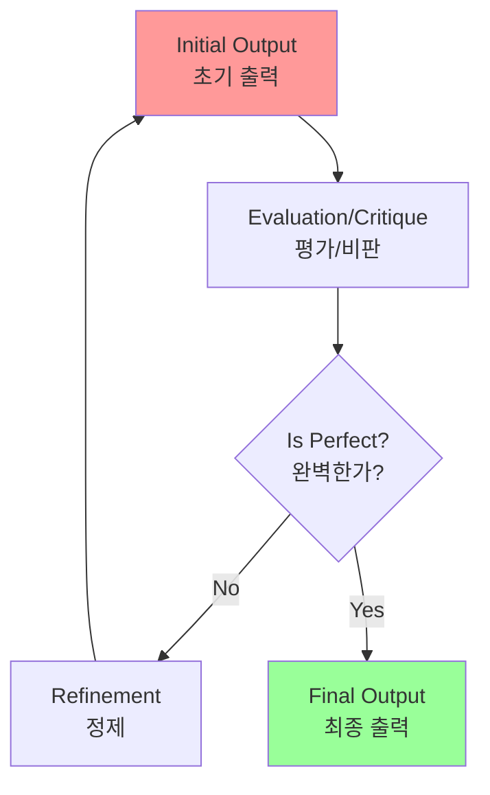
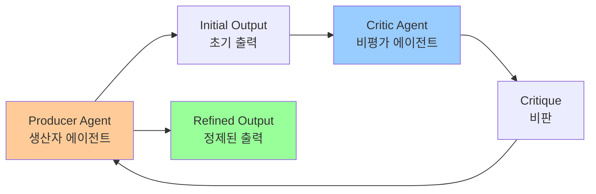
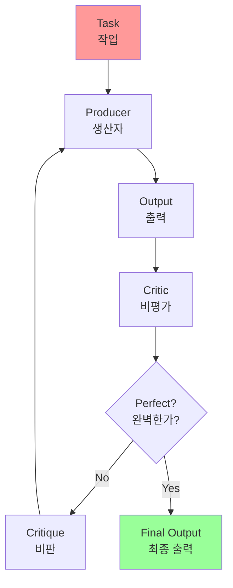
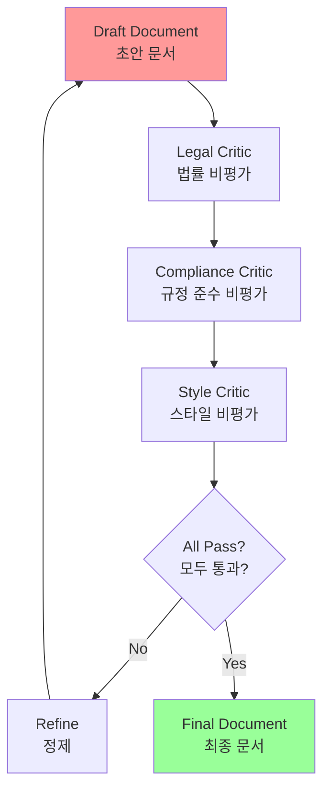

# Chapter 4: Reflection

## 개요

In the previous chapters, we've explored Chaining for sequential execution, Routing for dynamic path selection, and Parallelization for concurrent task execution. While these patterns enable agents to perform complex tasks more efficiently and flexibly, even with sophisticated workflows, an agent's initial output or plan may not be optimal, accurate, or complete. This is where the Reflection pattern comes into play.

이전 챕터에서 순차적 실행을 위한 Chaining, 동적 경로 선택을 위한 Routing, 동시 작업 실행을 위한 Parallelization을 탐구했습니다. 이러한 패턴은 에이전트가 복잡한 작업을 더 효율적이고 유연하게 수행할 수 있게 합니다. 그러나 정교한 워크플로우를 가진 경우에도 에이전트의 초기 출력이나 계획이 최적이거나 정확하거나 완전하지 않을 수 있습니다. 이것이 Reflection 패턴이 작용하는 곳입니다.

## 패턴 개요 (Pattern Overview)

### 핵심 개념

The Reflection pattern involves an agent evaluating its own work, output, or internal state and using that evaluation to improve its performance or refine its response. It's a form of self-correction or self-improvement, allowing the agent to iteratively refine its output or adjust its approach based on feedback, internal critique, or comparison against desired criteria. Reflection can occasionally be facilitated by a separate agent whose specific role is to analyze the output of an initial agent.

Reflection 패턴은 에이전트가 자신의 작업, 출력 또는 내부 상태를 평가하고 그 평가를 사용하여 성능을 향상시키거나 응답을 정제하는 것을 포함합니다. 이것은 자기 수정 또는 자기 개선의 한 형태로, 에이전트가 피드백, 내부 비판 또는 원하는 기준과의 비교를 기반으로 출력을 반복적으로 정제하거나 접근 방식을 조정할 수 있게 합니다. Reflection은 때때로 초기 에이전트의 출력을 분석하는 특정 역할을 가진 별도의 에이전트에 의해 촉진될 수 있습니다.

**Reflection(반성) 패턴**은 에이전트가 자신의 작업, 출력 또는 내부 상태를 평가하고 그 평가를 사용하여 성능을 향상시키거나 응답을 정제하는 것을 포함합니다.



### 프로세스

Unlike a simple sequential chain where output is passed directly to the next step, or routing which chooses a path, reflection introduces a feedback loop. The agent doesn't just produce an output; it then examines that output (or the process that generated it), identifies potential issues or areas for improvement, and uses those insights to generate a better version or modify its future actions.

단순한 순차적 체인(출력이 다음 단계로 직접 전달됨)이나 경로를 선택하는 라우팅과 달리, reflection은 피드백 루프를 도입합니다. 에이전트는 단순히 출력을 생성하는 것이 아니라, 그 출력(또는 그것을 생성한 프로세스)을 검사하고, 잠재적인 문제나 개선 영역을 식별하며, 이러한 통찰을 사용하여 더 나은 버전을 생성하거나 미래의 행동을 수정합니다.

The process typically involves:

프로세스는 일반적으로 다음을 포함합니다:

1. **Execution**: The agent performs a task or generates an initial output.
1. **실행 (Execution)**: 에이전트가 작업을 수행하거나 초기 출력을 생성합니다

2. **Evaluation/Critique**: The agent (often using another LLM call or a set of rules) analyzes the result from the previous step. This evaluation might check for factual accuracy, coherence, style, completeness, adherence to instructions, or other relevant criteria.
2. **평가/비판 (Evaluation/Critique)**: 에이전트(종종 다른 LLM 호출이나 규칙 집합 사용)가 이전 단계의 결과를 분석합니다

3. **Reflection/Refinement**: Based on the critique, the agent determines how to improve. This might involve generating a refined output, adjusting parameters for a subsequent step, or even modifying the overall plan.
3. **반성/정제 (Reflection/Refinement)**: 비판을 기반으로 에이전트가 개선 방법을 결정합니다

4. **Iteration (Optional but common)**: The refined output or adjusted approach can then be executed, and the reflection process can repeat until a satisfactory result is achieved or a stopping condition is met.
4. **반복 (Iteration)**: 정제된 출력이나 조정된 접근 방식이 실행되고, 반성 프로세스가 만족스러운 결과가 달성되거나 중지 조건이 충족될 때까지 반복될 수 있습니다

### Producer-Critic 모델

A key and highly effective implementation of the Reflection pattern separates the process into two distinct logical roles: a Producer and a Critic. This is often called the "Generator-Critic" or "Producer-Reviewer" model. While a single agent can perform self-reflection, using two specialized agents (or two separate LLM calls with distinct system prompts) often yields more robust and unbiased results.

Reflection 패턴의 핵심적이고 매우 효과적인 구현은 프로세스를 두 개의 별개의 논리적 역할로 분리하는 것입니다: **Producer(생산자)**와 **Critic(비평가)**. 이것은 종종 "Generator-Critic" 또는 "Producer-Reviewer" 모델이라고 불립니다. 단일 에이전트가 자기 반성을 수행할 수 있지만, 두 개의 전문 에이전트(또는 별개의 시스템 프롬프트를 가진 두 개의 별도 LLM 호출)를 사용하는 것이 종종 더 견고하고 편향되지 않은 결과를 산출합니다.



#### 1. Producer Agent (생산자 에이전트)

**1. The Producer Agent**: This agent's primary responsibility is to perform the initial execution of the task. It focuses entirely on generating the content, whether it's writing code, drafting a blog post, or creating a plan. It takes the initial prompt and produces the first version of the output.

이 에이전트의 주요 책임은 작업의 초기 실행을 수행하는 것입니다:
- 콘텐츠 생성에 전적으로 집중 (코드 작성, 블로그 게시물 초안 작성, 계획 생성 등)
- 초기 프롬프트를 받아 출력의 첫 번째 버전을 생성

#### 2. Critic Agent (비평가 에이전트)

**2. The Critic Agent**: This agent's sole purpose is to evaluate the output generated by the Producer. It is given a different set of instructions, often a distinct persona (e.g., "You are a senior software engineer," "You are a meticulous fact-checker"). The Critic's instructions guide it to analyze the Producer's work against specific criteria, such as factual accuracy, code quality, stylistic requirements, or completeness. It is designed to find flaws, suggest improvements, and provide structured feedback.

이 에이전트의 유일한 목적은 Producer가 생성한 출력을 평가하는 것입니다:
- 다른 지시사항 집합이 제공되며, 종종 별개의 페르소나 (예: "당신은 시니어 소프트웨어 엔지니어입니다", "당신은 꼼꼼한 사실 확인자입니다")
- 특정 기준에 대해 Producer의 작업을 분석하도록 지시받음 (사실 정확성, 코드 품질, 스타일 요구사항, 완전성 등)
- 결함을 찾고, 개선 사항을 제안하며, 구조화된 피드백을 제공하도록 설계됨

#### 분리의 힘

This separation of concerns is powerful because it prevents the "cognitive bias" of an agent reviewing its own work. The Critic agent approaches the output with a fresh perspective, dedicated entirely to finding errors and areas for improvement. The feedback from the Critic is then passed back to the Producer agent, which uses it as a guide to generate a new, refined version of the output. The provided LangChain and ADK code examples both implement this two-agent model: the LangChain example uses a specific "reflector_prompt" to create a critic persona, while the ADK example explicitly defines a producer and a reviewer agent.

이 관심사 분리는 강력합니다:
- 에이전트가 자신의 작업을 검토하는 "인지 편향"을 방지
- Critic 에이전트가 새로운 관점으로 출력에 접근하며, 오류와 개선 영역을 찾는 데 전적으로 전념
- Critic의 피드백이 Producer 에이전트로 다시 전달되어 새로운 정제된 버전의 출력을 생성하는 가이드로 사용됨

### 목표 설정 및 모니터링과의 교차점

The intersection of reflection with goal setting and monitoring (see Chapter 11) is worth noticing. A goal provides the ultimate benchmark for the agent's self-evaluation, while monitoring tracks its progress. In a number of practical cases, Reflection then might act as the corrective engine, using monitored feedback to analyze deviations and adjust its strategy. This synergy transforms the agent from a passive executor into a purposeful system that adaptively works to achieve its objectives.

Reflection과 목표 설정 및 모니터링(Chapter 11 참조)의 교차점은 주목할 가치가 있습니다:
- 목표는 에이전트의 자기 평가를 위한 궁극적인 벤치마크를 제공
- 모니터링은 진행 상황을 추적
- Reflection은 모니터링된 피드백을 사용하여 편차를 분석하고 전략을 조정하는 수정 엔진 역할을 할 수 있음

### 메모리와의 통합

Furthermore, the effectiveness of the Reflection pattern is significantly enhanced when the LLM keeps a memory of the conversation (see Chapter 8). This conversational history provides crucial context for the evaluation phase, allowing the agent to assess its output not just in isolation, but against the backdrop of previous interactions, user feedback, and evolving goals. It enables the agent to learn from past critiques and avoid repeating errors. Without memory, each reflection is a self-contained event; with memory, reflection becomes a cumulative process where each cycle builds upon the last, leading to more intelligent and context-aware refinement.

Reflection 패턴의 효과는 LLM이 대화의 메모리를 유지할 때(Chapter 8 참조) 크게 향상됩니다:
- 대화 기록은 평가 단계에 중요한 컨텍스트를 제공
- 에이전트가 출력을 고립적으로 평가하는 것이 아니라 이전 상호작용, 사용자 피드백, 진화하는 목표의 배경에 대해 평가할 수 있게 함
- 에이전트가 과거 비판으로부터 학습하고 오류를 반복하지 않도록 함

## 실용적 응용 및 사용 사례 (Practical Applications & Use Cases)

The Reflection pattern is applicable across various scenarios where agents need to improve output quality, reduce errors, and generate more accurate and reliable results:

Reflection 패턴은 에이전트가 출력의 품질을 향상시키고 오류를 줄이며 더 정확하고 신뢰할 수 있는 결과를 생성할 수 있게 하는 다양한 시나리오에 적용됩니다:

The Reflection pattern is valuable in scenarios where output quality, accuracy, or adherence to complex constraints is critical:

Reflection 패턴은 출력 품질, 정확성 또는 복잡한 제약 조건 준수가 중요한 시나리오에서 가치가 있습니다:

### 1. 창의적 글쓰기 및 콘텐츠 생성

**1. Creative Writing and Content Generation**: Refining generated text, stories, poems, or marketing copy.

- **Use Case**: An agent writing a blog post.
  - **Reflection**: Generate a draft, critique it for flow, tone, and clarity, then rewrite based on the critique. Repeat until the post meets quality standards.
  - **Benefit**: Produces more polished and effective content.

생성된 텍스트, 이야기, 시 또는 마케팅 복사를 정제합니다.

**예시: 블로그 게시물 작성 에이전트**
- **반성**: 초안 생성, 흐름, 톤, 명확성에 대해 비판, 비판을 기반으로 재작성, 게시물이 품질 기준을 충족할 때까지 반복
- **이점**: 더 세련되고 효과적인 콘텐츠 생성

### 2. 코드 생성 및 디버깅

**2. Code Generation and Debugging**: Writing code, identifying errors, and fixing them.

- **Use Case**: An agent writing a Python function.
  - **Reflection**: Write initial code, run tests or static analysis, identify errors or inefficiencies, then modify the code based on the findings.
  - **Benefit**: Generates more robust and functional code.

코드 작성, 오류 식별 및 수정.

**예시: Python 함수 작성 에이전트**
- **반성**: 초기 코드 작성, 테스트 실행 또는 정적 분석, 오류나 비효율성 식별, 발견 사항을 기반으로 코드 수정
- **이점**: 더 견고하고 기능적인 코드 생성

### 3. 복잡한 문제 해결

**3. Complex Problem Solving**: Evaluating intermediate steps or proposed solutions in multi-step reasoning tasks.

- **Use Case**: An agent solving a logic puzzle.
  - **Reflection**: Propose a step, evaluate if it leads closer to the solution or introduces contradictions, backtrack or choose a different step if needed.
  - **Benefit**: Improves the agent's ability to navigate complex problem spaces.

다단계 추론 작업에서 중간 단계나 제안된 솔루션을 평가합니다.

**예시: 논리 퍼즐 해결 에이전트**
- **반성**: 단계 제안, 솔루션에 더 가까워지거나 모순을 도입하는지 평가, 필요시 역추적하거나 다른 단계 선택
- **이점**: 복잡한 문제 공간을 탐색하는 에이전트의 능력 향상

### 4. 요약 및 정보 종합

**4. Summarization and Information Synthesis**: Refining summaries for accuracy, completeness, and conciseness.

정확성, 완전성 및 간결성을 위해 요약을 정제합니다.

**예시: 긴 문서 요약 에이전트**
- **반성**: 초기 요약 생성, 원본 문서의 핵심 포인트와 비교, 누락된 정보를 포함하거나 정확성을 개선하기 위해 요약 정제
- **이점**: 더 정확하고 포괄적인 요약 생성

### 5. 계획 및 전략

**5. Planning and Strategy**: Evaluating a proposed plan and identifying potential flaws or improvements.

- **Use Case**: An agent planning a series of actions to achieve a goal.
  - **Reflection**: Generate a plan, simulate its execution or evaluate its feasibility against constraints, revise the plan based on the evaluation.
  - **Benefit**: Develops more effective and realistic plans.

제안된 계획을 평가하고 잠재적 결함이나 개선 사항을 식별합니다.

**예시: 목표 달성을 위한 일련의 행동 계획 에이전트**
- **반성**: 계획 생성, 실행 시뮬레이션 또는 제약 조건에 대한 실행 가능성 평가, 평가를 기반으로 계획 수정
- **이점**: 더 효과적이고 현실적인 계획 개발

### 6. 대화형 에이전트

**6. Conversational Agents**: Reviewing previous turns in a conversation to maintain context, correct misunderstandings, or improve response quality.

- **Use Case**: A customer support chatbot.
  - **Reflection**: After a user response, review the conversation history and the last generated message to ensure coherence and address the user's latest input accurately.
  - **Benefit**: Leads to more natural and effective conversations.

대화의 이전 턴을 검토하여 컨텍스트를 유지하고 오해를 수정하거나 응답 품질을 향상시킵니다.

**예시: 고객 지원 챗봇**
- **반성**: 사용자 응답 후 대화 기록 및 마지막 생성 메시지 검토, 일관성 보장 및 사용자의 최신 입력에 정확하게 대응
- **이점**: 더 자연스럽고 효과적인 대화로 이어짐

## 실습 코드 예제 (Hands-On Code Example)

Reflection adds a layer of meta-cognition to agentic systems, enabling them to learn from their own outputs and processes, leading to more intelligent, reliable, and high-quality results.

Reflection은 에이전트 시스템에 메타 인지 계층을 추가하여 자신의 출력과 프로세스로부터 학습할 수 있게 하여 더 지능적이고 신뢰할 수 있으며 고품질의 결과를 이끌어냅니다.

### LangChain 예제

The implementation of a complete, iterative reflection process necessitates mechanisms for state management and cyclical execution. While these are handled natively in graph-based frameworks like LangGraph or through custom procedural code, the fundamental principle of a single reflection cycle can be demonstrated effectively using the compositional syntax of LCEL (LangChain Expression Language).

완전한 반복적 반성 프로세스의 구현은 상태 관리 및 순환 실행을 위한 메커니즘이 필요합니다. LangGraph와 같은 그래프 기반 프레임워크나 사용자 정의 절차적 코드에서 이를 기본적으로 처리하지만, 단일 반성 사이클의 기본 원칙은 LCEL(LangChain Expression Language)의 구성 구문을 사용하여 효과적으로 시연할 수 있습니다.

이 예제는 Langchain 라이브러리와 OpenAI의 GPT-4o 모델을 사용하여 반복적으로 팩토리얼을 계산하는 Python 함수를 생성하고 정제하는 반성 루프를 구현합니다.

#### 전체 코드

```python
import os
from dotenv import load_dotenv
from langchain_openai import ChatOpenAI
from langchain_core.prompts import ChatPromptTemplate
from langchain_core.messages import SystemMessage, HumanMessage

# --- Configuration ---
load_dotenv()

if not os.getenv("OPENAI_API_KEY"):
    raise ValueError("OPENAI_API_KEY not found in .env file. Please add it.")

# 더 나은 추론을 위해 gpt-4o 사용
# 더 결정론적인 출력을 위해 낮은 온도 사용
llm = ChatOpenAI(model="gpt-4o", temperature=0.1)

def run_reflection_loop():
    """Python 함수를 점진적으로 개선하기 위한 다단계 AI 반성 루프를 보여줍니다."""
    
    # --- 핵심 작업 ---
    task_prompt = """
    Your task is to create a Python function named `calculate_factorial`.
    This function should do the following:
    1. Accept a single integer `n` as input.
    2. Calculate its factorial (n!).
    3. Include a clear docstring explaining what the function does.
    4. Handle edge cases: The factorial of 0 is 1.
    5. Handle invalid input: Raise a ValueError if the input is a negative number.
    """
    
    # --- 반성 루프 ---
    max_iterations = 3
    current_code = ""
    message_history = [HumanMessage(content=task_prompt)]
    
    for i in range(max_iterations):
        print("\n" + "="*25 + f" REFLECTION LOOP: ITERATION {i + 1} " + "="*25)
        
        # --- 1. 생성 / 정제 단계 ---
        if i == 0:
            print("\n>>> STAGE 1: GENERATING initial code...")
            response = llm.invoke(message_history)
            current_code = response.content
        else:
            print("\n>>> STAGE 1: REFINING code based on previous critique...")
            message_history.append(HumanMessage(content="Please refine the code using the critiques provided."))
            response = llm.invoke(message_history)
            current_code = response.content
        
        print("\n--- Generated Code (v" + str(i + 1) + ") ---\n" + current_code)
        message_history.append(response)
        
        # --- 2. 반성 단계 ---
        print("\n>>> STAGE 2: REFLECTING on the generated code...")
        reflector_prompt = [
            SystemMessage(content="""
            You are a senior software engineer and an expert in Python.
            Your role is to perform a meticulous code review.
            Critically evaluate the provided Python code based on the original task requirements.
            Look for bugs, style issues, missing edge cases, and areas for improvement.
            If the code is perfect and meets all requirements, respond with the single phrase 'CODE_IS_PERFECT'.
            Otherwise, provide a bulleted list of your critiques.
            """),
            HumanMessage(content=f"Original Task:\n{task_prompt}\n\nCode to Review:\n{current_code}")
        ]
        critique_response = llm.invoke(reflector_prompt)
        critique = critique_response.content
        
        # --- 3. 중지 조건 ---
        if "CODE_IS_PERFECT" in critique:
            print("\n--- Critique ---\nNo further critiques found. The code is satisfactory.")
            break
        
        print("\n--- Critique ---\n" + critique)
        message_history.append(HumanMessage(content=f"Critique of the previous code:\n{critique}"))
    
    print("\n" + "="*30 + " FINAL RESULT " + "="*30)
    print("\nFinal refined code after the reflection process:\n")
    print(current_code)

if __name__ == "__main__":
    run_reflection_loop()
```

#### 코드 설명

이 코드는 반복적 정제 프로세스를 조정합니다:
1. **초기 생성**: 첫 번째 반복에서 언어 모델이 작업 프롬프트를 기반으로 초기 코드를 생성
2. **후속 반복**: 이전 단계의 비판을 기반으로 코드를 정제
3. **비평가 역할**: 언어 모델이 다른 시스템 프롬프트로 시니어 소프트웨어 엔지니어 역할을 하여 생성된 코드를 비판
4. **중지 조건**: 비판이 코드가 완벽하다고 표시하거나 최대 반복 횟수에 도달할 때까지 루프 계속

### Google ADK 예제

Google ADK를 사용한 개념적 코드 예제입니다. Generator-Critic 구조를 사용합니다.

#### 코드 구조

```python
from google.adk.agents import SequentialAgent, LlmAgent

# 첫 번째 에이전트는 초기 초안을 생성합니다.
generator = LlmAgent(
    name="DraftWriter",
    description="Generates initial draft content on a given subject.",
    instruction="Write a short, informative paragraph about the user's subject.",
    output_key="draft_text"  # 출력이 이 상태 키에 저장됩니다.
)

# 두 번째 에이전트는 첫 번째 에이전트의 초안을 비판합니다.
reviewer = LlmAgent(
    name="FactChecker",
    description="Reviews a given text for factual accuracy and provides a structured critique.",
    instruction="""
    You are a meticulous fact-checker.
    1. Read the text provided in the state key 'draft_text'.
    2. Carefully verify the factual accuracy of all claims.
    3. Your final output must be a dictionary containing two keys:
    - "status": A string, either "ACCURATE" or "INACCURATE".
    - "reasoning": A string providing a clear explanation for your status, citing specific issues if any are found.
    """,
    output_key="review_output"  # 구조화된 딕셔너리가 여기에 저장됩니다.
)

# SequentialAgent는 생성자가 검토자보다 먼저 실행되도록 보장합니다.
review_pipeline = SequentialAgent(
    name="WriteAndReview_Pipeline",
    sub_agents=[generator, reviewer]
)

# 실행 흐름:
# 1. generator 실행 -> 단락을 state['draft_text']에 저장
# 2. reviewer 실행 -> state['draft_text']를 읽고 딕셔너리 출력을 state['review_output']에 저장
```

#### 코드 설명

이 코드는 Google ADK에서 순차적 에이전트 파이프라인을 사용하여 텍스트를 생성하고 검토하는 방법을 보여줍니다:
1. **Generator 에이전트**: 주어진 주제에 대한 초기 초안 단락 생성
2. **Reviewer 에이전트**: Generator가 생성한 텍스트의 사실 확인 수행
3. **SequentialAgent**: 두 에이전트의 실행 순서 관리

## 한눈에 보기 (At a Glance)

### 무엇 (What)

에이전트의 초기 출력은 종종 부정확성, 불완전성 또는 복잡한 요구사항을 충족하지 못하는 문제로 인해 차선책입니다. 기본 에이전트 워크플로우는 에이전트가 자신의 오류를 인식하고 수정하기 위한 내장 프로세스가 없습니다.

### 왜 (Why)

Reflection 패턴은 자기 수정 및 정제를 위한 메커니즘을 도입하여 솔루션을 제공합니다. "생산자" 에이전트가 출력을 생성한 다음 "비평가" 에이전트(또는 생산자 자체)가 사전 정의된 기준에 대해 평가하는 피드백 루프를 설정합니다.

### 경험 법칙 (Rule of Thumb)

최종 출력의 품질, 정확성 및 세부 사항이 속도와 비용보다 더 중요한 경우 Reflection 패턴을 사용하세요. 세련된 장문 콘텐츠 생성, 코드 작성 및 디버깅, 상세한 계획 작성과 같은 작업에 특히 효과적입니다.

### 시각적 요약



## 핵심 요약 (Key Takeaways)

1. **Reflection 패턴의 주요 이점은 반복적으로 자기 수정하고 출력을 정제하는 능력으로, 품질, 정확성 및 복잡한 지시사항 준수를 크게 향상시킵니다**

2. **실행, 평가/비판 및 정제의 피드백 루프를 포함합니다**

3. **강력한 구현은 Producer-Critic 모델로, 별도의 에이전트(또는 프롬프트된 역할)가 초기 출력을 평가합니다**

4. **이러한 이점은 지연 시간 및 계산 비용 증가와 함께 모델의 컨텍스트 창을 초과하거나 API 서비스에 의해 제한될 위험이 높아지는 비용으로 제공됩니다**

5. **전체 반복 반성은 종종 상태 저장 워크플로우(예: LangGraph)가 필요하지만, 단일 반성 단계는 LCEL을 사용하여 LangChain에서 출력을 비판하고 후속 정제를 위해 전달하여 구현할 수 있습니다**

6. **Google ADK는 한 에이전트의 출력이 다른 에이전트에 의해 비판되는 순차적 워크플로우를 통해 반성을 촉진할 수 있으며, 후속 정제 단계를 허용합니다**

7. **이 패턴은 에이전트가 자기 수정을 수행하고 시간이 지남에 따라 성능을 향상시킬 수 있게 합니다**

## 결론

반성 패턴은 에이전트의 워크플로우 내에서 자기 수정을 위한 중요한 메커니즘을 제공하여 단일 패스 실행을 넘어 반복적 개선을 가능하게 합니다. 이것은 시스템이 출력을 생성하고, 특정 기준에 대해 평가한 다음, 그 평가를 사용하여 정제된 결과를 생성하는 루프를 만들어 달성됩니다.

이 평가는 에이전트 자체(자기 반성)에 의해 수행되거나, 종종 더 효과적으로 별개의 비평가 에이전트에 의해 수행될 수 있으며, 이는 패턴 내에서 중요한 아키텍처 선택을 나타냅니다.

완전히 자율적인 다단계 반성 프로세스는 상태 관리를 위한 견고한 아키텍처가 필요하지만, 그 핵심 원칙은 단일 생성-비판-정제 주기에서 효과적으로 입증됩니다. 제어 구조로서 반성은 더 견고하고 기능적으로 복잡한 에이전트 시스템을 구축하기 위해 다른 기초 패턴과 통합될 수 있습니다.

## 이론적 배경 및 학술적 근거 (Theoretical Background and Academic Foundation)

### 메타인지 이론 (Metacognition Theory)

반성 패턴은 인간의 메타인지 능력을 모방합니다. Flavell(1979)은 메타인지를 "인지에 대한 인지"로 정의하며, 이는 자신의 사고 과정을 모니터링하고 조절하는 능력을 의미합니다.

**메타인지 구성 요소**:
1. **메타인지 지식**: 자신의 인지 능력에 대한 지식
2. **메타인지 경험**: 인지 과정에 대한 주관적 경험
3. **메타인지 조절**: 인지 과정을 모니터링하고 제어

**에이전트 시스템에서의 적용**:
- **생성 단계**: 초기 출력 생성 (인지)
- **평가 단계**: 출력 품질 평가 (메타인지)
- **조절 단계**: 평가를 바탕으로 출력 개선 (메타인지 조절)

### 이중 처리 이론 (Dual-Process Theory)

Kahneman(2011)의 이중 처리 이론은 두 가지 사고 시스템을 제안합니다:

- **시스템 1**: 빠르고 직관적인 사고 (Producer Agent)
- **시스템 2**: 느리고 분석적인 사고 (Critic Agent)

**Producer-Critic 모델과의 유사성**:
- Producer는 빠르게 초안을 생성 (시스템 1)
- Critic은 신중하게 평가하고 분석 (시스템 2)
- 두 시스템의 협력으로 더 나은 결과 도출

### 강화 학습 이론

반성 패턴은 강화 학습의 피드백 루프와 유사합니다:

**강화 학습 요소**:
- **상태 (State)**: 현재 출력
- **행동 (Action)**: 출력 수정
- **보상 (Reward)**: 평가 점수
- **정책 (Policy)**: 수정 전략

**자기 수정 학습**:
에이전트는 반성 과정을 통해 자신의 정책을 개선할 수 있습니다.

### 품질 보증 이론

소프트웨어 공학의 품질 보증(Quality Assurance) 원칙을 적용:

**검토 프로세스**:
1. **코드 리뷰**: 동료 검토자에 의한 평가
2. **자동화된 테스트**: 객관적 평가 기준
3. **반복적 개선**: 피드백을 통한 지속적 개선

**Critic Agent의 역할**:
- 코드 리뷰어와 유사한 역할
- 객관적이고 구조화된 평가 제공
- 개선 제안 제시

## 성능 최적화 기법 (Performance Optimization Techniques)

### 1. 적응형 반성 깊이

작업 복잡도에 따라 반성 깊이 조절:

```python
def adaptive_reflection_depth(task_complexity: float) -> int:
    """작업 복잡도에 따른 반성 깊이 결정"""
    if task_complexity < 0.3:
        return 1  # 단순 작업: 1회 반성
    elif task_complexity < 0.7:
        return 2  # 중간 작업: 2회 반성
    else:
        return 3  # 복잡 작업: 3회 반성
```

### 2. 조기 종료 전략

만족스러운 결과가 나오면 반성 루프 조기 종료:

```python
def reflection_loop_with_early_stop(task, max_iterations=3):
    """조기 종료가 있는 반성 루프"""
    for i in range(max_iterations):
        output = producer.generate(task)
        critique = critic.evaluate(output)
        
        if critique.score >= 0.95:  # 만족스러운 점수
            return output  # 조기 종료
        
        task = refine_task(task, critique)
    return output
```

### 3. 병렬 평가

여러 Critic Agent가 동시에 평가하여 다양한 관점 수집:

```python
async def parallel_critique(output):
    """병렬로 여러 관점에서 평가"""
    critiques = await asyncio.gather(
        technical_critic.evaluate(output),
        style_critic.evaluate(output),
        accuracy_critic.evaluate(output)
    )
    return aggregate_critiques(critiques)
```

### 4. 캐싱된 평가

유사한 출력에 대한 평가 결과 캐싱:

```python
from functools import lru_cache

@lru_cache(maxsize=1000)
def cached_evaluation(output_hash: str, criteria: str) -> float:
    """캐시된 평가 결과 반환"""
    # 평가 로직
    return score
```

## 트레이드오프 및 한계점 (Trade-offs and Limitations)

### 반성 패턴의 장점

1. **품질 향상**: 반복적 개선을 통한 출력 품질 향상
2. **오류 감소**: 비평가에 의한 오류 조기 발견
3. **적응성**: 다양한 기준에 맞춰 출력 조정 가능
4. **신뢰성**: 단일 패스보다 더 신뢰할 수 있는 결과

### 반성 패턴의 단점

1. **지연 시간 증가**: 여러 반복으로 인한 처리 시간 증가
2. **비용 증가**: 추가 LLM 호출로 인한 비용 증가
3. **수렴 보장 없음**: 반복해도 개선되지 않을 수 있음
4. **평가 기준 의존성**: 평가 기준의 품질이 최종 결과에 큰 영향

### 완화 전략

1. **최대 반복 제한**: 무한 루프 방지
2. **점진적 개선 임계값**: 개선이 미미하면 종료
3. **비용 예산 관리**: 반성 비용을 예산 내로 제한
4. **다양한 평가 기준**: 여러 관점에서 평가하여 편향 방지

## 관련 패턴과의 비교 (Comparison with Related Patterns)

### Reflection vs. Single-Pass Generation

| 특성 | Single-Pass | Reflection |
|------|-------------|------------|
| 품질 | 변동적 | 일관적으로 높음 |
| 속도 | 빠름 | 느림 |
| 비용 | 낮음 | 높음 |
| 복잡한 작업 | 부적합 | 적합 |

### Reflection vs. Fine-tuning

반성은 런타임 개선이고, 파인튜닝은 사전 학습 개선:

- **Reflection**: 런타임에 출력 개선 (동적)
- **Fine-tuning**: 학습 시 모델 개선 (정적)
- **결합**: 파인튜닝된 모델에 반성 적용으로 더 나은 결과

## 실무 적용 사례 확장 (Extended Practical Applications)

### 1. 법률 문서 검토 시스템

다층 반성 프로세스:



### 2. 의료 진단 지원 시스템

다단계 검증 프로세스:

1. **초기 진단 생성**: 증상 기반 초기 진단
2. **의학적 검증**: 의학 지식 기반 검증
3. **확률적 검증**: 통계적 가능성 평가
4. **안전성 검증**: 잠재적 위험 평가

### 3. 코드 생성 및 리뷰 시스템

자동화된 코드 리뷰:

```python
def code_generation_with_review(requirement: str):
    """코드 생성 및 자동 리뷰"""
    # 1. 초기 코드 생성
    code = generator.generate(requirement)
    
    # 2. 다중 관점 평가
    syntax_check = syntax_critic.review(code)
    logic_check = logic_critic.review(code)
    security_check = security_critic.review(code)
    
    # 3. 통합 피드백
    feedback = aggregate_feedback([syntax_check, logic_check, security_check])
    
    # 4. 개선된 코드 생성
    improved_code = generator.refine(code, feedback)
    
    return improved_code
```

## 참고 자료 (References)

### 학술 논문

1. Flavell, J. H. (1979). "Metacognition and cognitive monitoring: A new area of cognitive-developmental inquiry." *American Psychologist*, 34(10), 906-911.

2. Kahneman, D. (2011). *Thinking, Fast and Slow*. Farrar, Straus and Giroux.

3. Madaan, A., et al. (2024). "Self-Refine: Iterative Refinement with Self-Feedback." *Advances in Neural Information Processing Systems*.

4. Shinn, N., et al. (2023). "Reflexion: Language Agents with Verbal Reinforcement Learning." *Advances in Neural Information Processing Systems*.

5. Lightman, H., et al. (2023). "Let's Verify Step by Step." *arXiv preprint arXiv:2305.20050*.

6. Training Language Models to Self-Correct via Reinforcement Learning:
   https://arxiv.org/abs/2409.12917

### 프레임워크 및 도구 문서

1. LangChain Expression Language (LCEL) Documentation:
   https://python.langchain.com/docs/introduction/

2. LangGraph Documentation:
   https://www.langchain.com/langgraph

3. Google Agent Developer Kit (ADK) Documentation (Multi-Agent Systems):
   https://google.github.io/adk-docs/agents/multi-agents/

### 추가 학습 자료

4. "Metacognition: Knowing about Knowing" by Metcalfe & Shimamura

5. "The Reflective Practitioner" by Donald Schön

6. "Code Complete" by Steve McConnell - Code Review Best Practices

---

**이전 챕터**: [Chapter 3: Parallelization](chapter_03_Parallelization.md)  
**다음 챕터**: [Chapter 5: Tool Use](chapter_05_Tool_Use.md)

