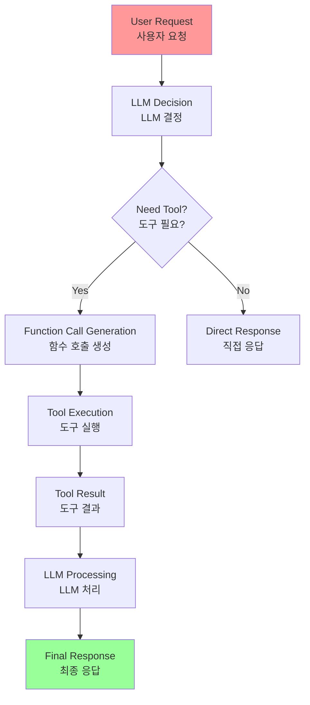
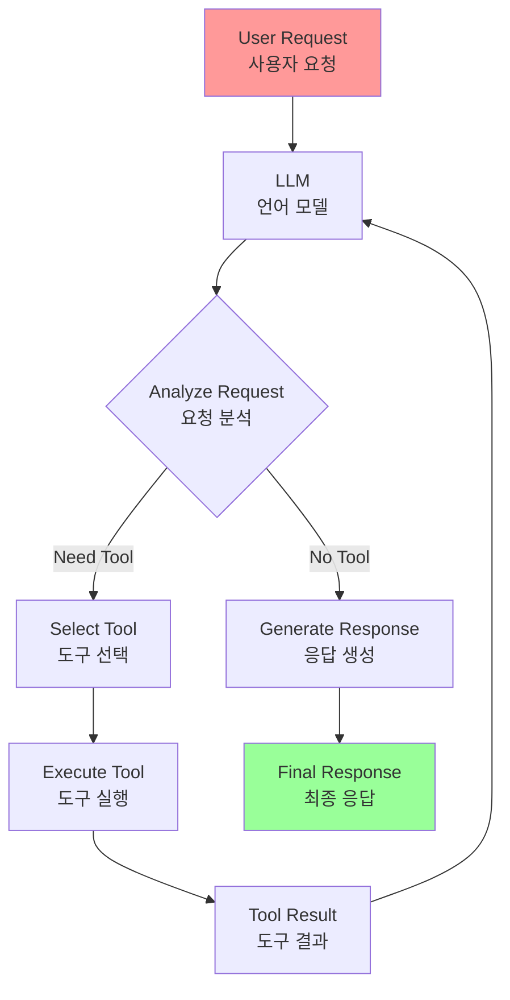
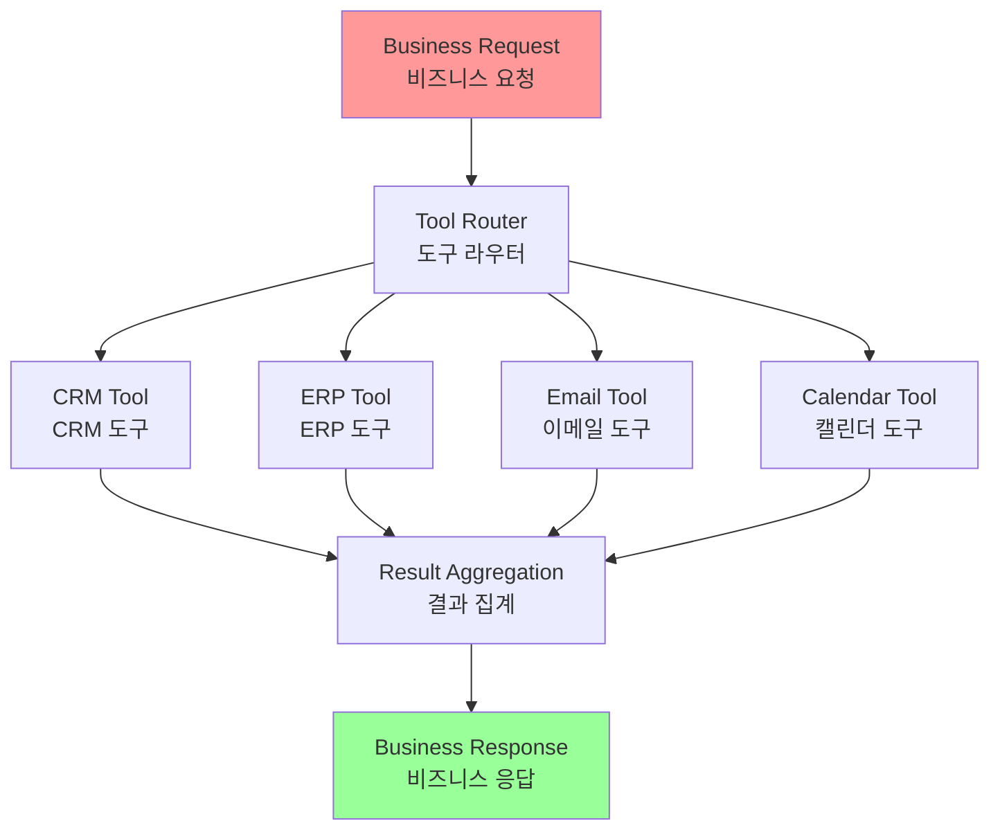

# Chapter 5: Tool Use (Function Calling)

## 개요

So far, we've primarily discussed agentic patterns that orchestrate interactions between language models and manage information flow within an agent's internal workflow (Chaining, Routing, Parallelization, Reflection). However, for an agent to be truly useful and interact with the real world or external systems, it needs the ability to use tools.

지금까지 주로 언어 모델 간의 상호작용을 조정하고 에이전트의 내부 워크플로우 내에서 정보 흐름을 관리하는 에이전트 패턴(Chaining, Routing, Parallelization, Reflection)을 논의했습니다. 그러나 에이전트가 정말로 유용하고 실제 세계나 외부 시스템과 상호작용하려면 도구를 사용할 수 있는 능력이 필요합니다.

## 패턴 개요 (Pattern Overview)

### 핵심 개념

The Tool Use pattern, often implemented through a mechanism called Function Calling, enables an agent to interact with external APIs, databases, services, or even execute code. It allows the LLM at the core of the agent to decide when and how to use a specific external function based on the user's request or the current state of the task.

Tool Use 패턴은 종종 Function Calling이라는 메커니즘을 통해 구현되며, 에이전트가 외부 API, 데이터베이스, 서비스와 상호작용하거나 심지어 코드를 실행할 수 있게 합니다. 이것은 에이전트의 핵심에 있는 LLM이 사용자의 요청이나 작업의 현재 상태를 기반으로 특정 외부 함수를 언제 어떻게 사용할지 결정할 수 있게 합니다.

**Tool Use 패턴**은 종종 Function Calling이라는 메커니즘을 통해 구현되며, 에이전트가 외부 API, 데이터베이스, 서비스와 상호작용하거나 심지어 코드를 실행할 수 있게 합니다.



### 프로세스

The process typically involves:

프로세스는 일반적으로 다음을 포함합니다:

1. **Tool Definition**: External functions or capabilities are defined and described to the LLM. This description includes the function's purpose, its name, and the parameters it accepts, along with their types and descriptions.
1. **도구 정의 (Tool Definition)**: 외부 함수나 기능이 LLM에 정의되고 설명됩니다

2. **LLM Decision**: The LLM receives the user's request and the available tool definitions. Based on its understanding of the request and the tools, the LLM decides if calling one or more tools is necessary to fulfill the request.
2. **LLM 결정 (LLM Decision)**: LLM이 사용자의 요청과 사용 가능한 도구 정의를 받습니다

3. **Function Call Generation**: If the LLM decides to use a tool, it generates a structured output (often a JSON object) that specifies the name of the tool to call and the arguments (parameters) to pass to it, extracted from the user's request.
3. **함수 호출 생성 (Function Call Generation)**: LLM이 도구를 사용하기로 결정하면 구조화된 출력(종종 JSON 객체)을 생성합니다

4. **Tool Execution**: The agentic framework or orchestration layer intercepts this structured output. It identifies the requested tool and executes the actual external function with the provided arguments.
4. **도구 실행 (Tool Execution)**: 에이전트 프레임워크나 조정 계층이 이 구조화된 출력을 가로채고 요청된 도구를 식별하여 제공된 인수로 실제 외부 함수를 실행합니다

5. **Observation/Result**: The output or result from the tool execution is returned to the agent.
5. **관찰/결과 (Observation/Result)**: 도구 실행의 출력이나 결과가 에이전트로 반환됩니다

6. **LLM Processing (Optional but common)**: The LLM receives the tool's output as context and uses it to formulate a final response to the user or decide on the next step in the workflow (which might involve calling another tool, reflecting, or providing a final answer).
6. **LLM 처리 (LLM Processing)**: LLM이 도구의 출력을 컨텍스트로 받아 사용자에 대한 최종 응답을 공식화하거나 워크플로우의 다음 단계를 결정합니다(다른 도구 호출, 반성 또는 최종 답변 제공을 포함할 수 있음)

This pattern is fundamental because it breaks the limitations of the LLM's training data and allows it to access up-to-date information, perform calculations it can't do internally, interact with user-specific data, or trigger real-world actions. Function calling is the technical mechanism that bridges the gap between the LLM's reasoning capabilities and the vast array of external functionalities available.

이 패턴은 LLM의 훈련 데이터의 한계를 깨고 최신 정보에 접근하고, 내부적으로 수행할 수 없는 계산을 수행하고, 사용자별 데이터와 상호작용하거나 실제 세계의 행동을 트리거할 수 있게 하기 때문에 근본적입니다. 함수 호출은 LLM의 추론 능력과 사용 가능한 광범위한 외부 기능 사이의 격차를 연결하는 기술적 메커니즘입니다.

### Function Calling vs Tool Calling

While "function calling" aptly describes invoking specific, predefined code functions, it's useful to consider the more expansive concept of "tool calling." This broader term acknowledges that an agent's capabilities can extend far beyond simple function execution. A "tool" can be a traditional function, but it can also be a complex API endpoint, a request to a database, or even an instruction directed at another specialized agent. This perspective allows us to envision more sophisticated systems where, for instance, a primary agent might delegate a complex data analysis task to a dedicated "analyst agent" or query an external knowledge base through its API. Thinking in terms of "tool calling" better captures the full potential of agents to act as orchestrators across a diverse ecosystem of digital resources and other intelligent entities.

"function calling"은 특정 사전 정의된 코드 함수를 호출하는 것을 적절하게 설명하지만, "tool calling"이라는 더 넓은 개념을 고려하는 것이 유용합니다. 이 더 넓은 용어는 에이전트의 기능이 단순한 함수 실행을 훨씬 넘어서 확장될 수 있음을 인정합니다. "도구"는 전통적인 함수일 수 있지만, 복잡한 API 엔드포인트, 데이터베이스에 대한 요청, 또는 다른 전문 에이전트에 대한 지시일 수도 있습니다. 이 관점은 주 에이전트가 복잡한 데이터 분석 작업을 전용 "분석가 에이전트"에 위임하거나 외부 지식 기반을 API를 통해 쿼리하는 것과 같은 더 정교한 시스템을 상상할 수 있게 합니다. "tool calling" 측면에서 생각하는 것은 다양한 디지털 리소스 및 기타 지능형 엔티티 생태계 전반에 걸쳐 오케스트레이터로 작동하는 에이전트의 전체 잠재력을 더 잘 포착합니다.

"function calling"은 특정 사전 정의된 코드 함수를 호출하는 것을 적절하게 설명하지만, "tool calling"이라는 더 넓은 개념을 고려하는 것이 유용합니다:

- **도구**는 전통적인 함수일 수 있지만, 복잡한 API 엔드포인트, 데이터베이스에 대한 요청, 또는 다른 전문 에이전트에 대한 지시일 수도 있습니다
- 이 관점은 주 에이전트가 복잡한 데이터 분석 작업을 전용 "분석가 에이전트"에 위임하거나 외부 지식 기반을 API를 통해 쿼리하는 것과 같은 더 정교한 시스템을 상상할 수 있게 합니다

### 프레임워크 지원

Frameworks like LangChain, LangGraph, and Google Agent Developer Kit (ADK) provide robust support for defining tools and integrating them into agent workflows, often leveraging the native function calling capabilities of modern LLMs like those in the Gemini or OpenAI series. On the "canvas" of these frameworks, you define the tools and then configure agents (typically LLM Agents) to be aware of and capable of using these tools.

LangChain, LangGraph, Google Agent Developer Kit (ADK)와 같은 프레임워크는 도구를 정의하고 에이전트 워크플로우에 통합하기 위한 견고한 지원을 제공하며, 종종 Gemini 또는 OpenAI 시리즈와 같은 현대 LLM의 네이티브 함수 호출 기능을 활용합니다. 이러한 프레임워크의 "캔버스"에서 도구를 정의한 다음 에이전트(일반적으로 LLM 에이전트)를 구성하여 이러한 도구를 인식하고 사용할 수 있게 합니다.

Tool Use is a cornerstone pattern for building powerful, interactive, and externally aware agents.

Tool Use는 강력하고 대화형이며 외부 인식 에이전트를 구축하기 위한 기초 패턴입니다.

LangChain, LangGraph, Google Agent Developer Kit (ADK)와 같은 프레임워크는 도구를 정의하고 에이전트 워크플로우에 통합하기 위한 견고한 지원을 제공하며, 종종 Gemini 또는 OpenAI 시리즈와 같은 현대 LLM의 네이티브 함수 호출 기능을 활용합니다.

## 실용적 응용 및 사용 사례 (Practical Applications & Use Cases)

The Tool Use pattern is applicable in virtually any scenario where an agent needs to go beyond generating text to perform an action or retrieve specific, dynamic information:

Tool Use 패턴은 에이전트가 텍스트 생성 이상으로 작업을 수행하거나 특정 동적 정보를 검색해야 하는 거의 모든 시나리오에 적용 가능합니다:

### 1. 외부 소스에서 정보 검색

**1. Information Retrieval from External Sources**: Accessing real-time data or information that is not present in the LLM's training data.

- **Use Case**: A weather agent.
  - **Tool**: A weather API that takes a location and returns the current weather conditions.
  - **Agent Flow**: User asks, "What's the weather in London?", LLM identifies the need for the weather tool, calls the tool with "London", tool returns data, LLM formats the data into a user-friendly response.

LLM의 훈련 데이터에 없는 실시간 데이터나 정보에 접근합니다.

**예시: 날씨 에이전트**
- **도구**: 위치를 받아 현재 날씨 조건을 반환하는 날씨 API
- **에이전트 흐름**: 사용자가 "런던의 날씨는 어떠니?"라고 묻고, LLM이 날씨 도구의 필요성을 식별하고 "런던"으로 도구를 호출하며, 도구가 데이터를 반환하고, LLM이 데이터를 사용자 친화적인 응답으로 포맷합니다

### 2. 데이터베이스 및 API와 상호작용

**2. Interacting with Databases and APIs**: Performing queries, updates, or other operations on structured data.

- **Use Case**: An e-commerce agent.
  - **Tools**: API calls to check product inventory, get order status, or process payments.
  - **Agent Flow**: User asks "Is product X in stock?", LLM calls the inventory API, tool returns stock count, LLM tells the user the stock status.

구조화된 데이터에 대한 쿼리, 업데이트 또는 기타 작업을 수행합니다.

**예시: 전자상거래 에이전트**
- **도구**: 제품 재고 확인, 주문 상태 가져오기, 결제 처리에 대한 API 호출
- **에이전트 흐름**: 사용자가 "제품 X가 재고에 있나요?"라고 묻고, LLM이 재고 API를 호출하며, 도구가 재고 수를 반환하고, LLM이 사용자에게 재고 상태를 알려줍니다

### 3. 계산 및 데이터 분석 수행

외부 계산기, 데이터 분석 라이브러리 또는 통계 도구를 사용합니다.

**예시: 금융 에이전트**
- **도구**: 계산기 함수, 주식 시장 데이터 API, 스프레드시트 도구
- **에이전트 흐름**: 사용자가 "AAPL의 현재 가격은 얼마이고 $150에 100주를 샀다면 잠재적 이익은 얼마인가요?"라고 묻고, LLM이 주식 API를 호출하고 현재 가격을 얻은 다음 계산기 도구를 호출하고 결과를 얻어 응답을 포맷합니다

### 4. 통신 전송

이메일, 메시지 전송 또는 외부 통신 서비스에 대한 API 호출을 만듭니다.

**예시: 개인 어시스턴트 에이전트**
- **도구**: 이메일 전송 API
- **에이전트 흐름**: 사용자가 "존에게 내일 회의에 대해 이메일을 보내줘"라고 말하고, LLM이 요청에서 수신자, 제목, 본문을 추출하여 이메일 도구를 호출합니다

### 5. 코드 실행

특정 작업을 수행하기 위해 안전한 환경에서 코드 스니펫을 실행합니다.

**예시: 코딩 어시스턴트 에이전트**
- **도구**: 코드 인터프리터
- **에이전트 흐름**: 사용자가 Python 스니펫을 제공하고 "이 코드가 무엇을 하나요?"라고 묻고, LLM이 인터프리터 도구를 사용하여 코드를 실행하고 출력을 분석합니다

### 6. 다른 시스템이나 장치 제어

**6. Controlling Other Systems or Devices**: Interacting with smart home devices, IoT platforms, or other connected systems.

- **Use Case**: A smart home agent.
  - **Tool**: An API to control smart lights.
  - **Agent Flow**: User says, "Turn off the living room lights." LLM calls the smart home tool with the command and target device.

스마트 홈 장치, IoT 플랫폼 또는 기타 연결된 시스템과 상호작용합니다.

**예시: 스마트 홈 에이전트**
- **도구**: 스마트 조명을 제어하는 API
- **에이전트 흐름**: 사용자가 "거실 조명을 끄세요"라고 말하고, LLM이 명령과 대상 장치로 스마트 홈 도구를 호출합니다

## 실습 코드 예제 (Hands-On Code Example)

### LangChain 예제

LangChain 프레임워크 내에서 도구 사용 구현은 2단계 프로세스입니다. 처음에 하나 이상의 도구가 정의되며, 일반적으로 기존 Python 함수나 기타 실행 가능한 구성 요소를 캡슐화합니다. 그런 다음 이러한 도구가 언어 모델에 바인딩되어 모델이 사용자의 쿼리를 충족하기 위해 외부 함수 호출이 필요하다고 판단할 때 구조화된 도구 사용 요청을 생성할 수 있는 기능을 부여합니다.

#### 전체 코드

```python
import os, getpass
import asyncio
import nest_asyncio
from typing import List
from dotenv import load_dotenv
import logging
from langchain_google_genai import ChatGoogleGenerativeAI
from langchain_core.prompts import ChatPromptTemplate
from langchain_core.tools import tool as langchain_tool
from langchain.agents import create_tool_calling_agent, AgentExecutor

# API 키 설정
os.environ["GOOGLE_API_KEY"] = getpass.getpass("Enter your Google API key: ")
os.environ["OPENAI_API_KEY"] = getpass.getpass("Enter your OpenAI API key: ")

try:
    # 함수/도구 호출 기능이 있는 모델이 필요합니다.
    llm = ChatGoogleGenerativeAI(model="gemini-2.0-flash", temperature=0)
    print(f" Language model initialized: {llm.model}")
except Exception as e:
    print(f" Error initializing language model: {e}")
    llm = None

# --- 도구 정의 ---
@langchain_tool
def search_information(query: str) -> str:
    """
    Provides factual information on a given topic. Use this tool to
    find answers to phrases like 'capital of France' or 'weather in London?'.
    """
    print(f"\n--- Tool Called: search_information with query: '{query}' ---")
    # 사전 정의된 결과로 검색 도구 시뮬레이션
    simulated_results = {
        "weather in london": "The weather in London is currently cloudy with a temperature of 15°C.",
        "capital of france": "The capital of France is Paris.",
        "population of earth": "The estimated population of Earth is around 8 billion people.",
        "tallest mountain": "Mount Everest is the tallest mountain above sea level.",
        "default": f"Simulated search result for '{query}': No specific information found, but the topic seems interesting."
    }
    result = simulated_results.get(query.lower(), simulated_results["default"])
    print(f"--- TOOL RESULT: {result} ---")
    return result

tools = [search_information]

# --- 도구 호출 에이전트 생성 ---
if llm:
    # 이 프롬프트 템플릿은 에이전트의 내부 단계를 위한 `agent_scratchpad` 플레이스홀더가 필요합니다.
    agent_prompt = ChatPromptTemplate.from_messages([
        ("system", "You are a helpful assistant."),
        ("human", "{input}"),
        ("placeholder", "{agent_scratchpad}"),
    ])
    
    # LLM, 도구 및 프롬프트를 함께 바인딩하여 에이전트를 생성합니다.
    agent = create_tool_calling_agent(llm, tools, agent_prompt)
    
    # AgentExecutor는 에이전트를 호출하고 선택된 도구를 실행하는 런타임입니다.
    agent_executor = AgentExecutor(agent=agent, verbose=True, tools=tools)

async def run_agent_with_tool(query: str):
    """쿼리로 에이전트 실행기를 호출하고 최종 응답을 인쇄합니다."""
    print(f"\n--- Running Agent with Query: '{query}' ---")
    try:
        response = await agent_executor.ainvoke({"input": query})
        print("\n--- Final Agent Response ---")
        print(response["output"])
    except Exception as e:
        print(f"\n An error occurred during agent execution: {e}")

async def main():
    """모든 에이전트 쿼리를 동시에 실행합니다."""
    tasks = [
        run_agent_with_tool("What is the capital of France?"),
        run_agent_with_tool("What's the weather like in London?"),
        run_agent_with_tool("Tell me something about dogs.")  # 기본 도구 응답을 트리거해야 함
    ]
    await asyncio.gather(*tasks)

nest_asyncio.apply()
asyncio.run(main())
```

#### 코드 설명

이 코드는 LangChain 라이브러리와 Google Gemini 모델을 사용하여 도구 호출 에이전트를 설정합니다:
1. **도구 정의**: 특정 쿼리에 대한 사실적 답변을 제공하는 `search_information` 도구를 시뮬레이션
2. **에이전트 생성**: `create_tool_calling_agent` 함수를 사용하여 언어 모델, 도구 및 프롬프트를 에이전트로 결합
3. **AgentExecutor**: 에이전트의 실행 및 도구 호출을 관리하는 런타임
4. **비동기 실행**: 여러 쿼리를 동시에 실행하여 에이전트의 동작을 테스트

### CrewAI 예제

CrewAI 프레임워크 내에서 함수 호출(도구)을 구현하는 방법에 대한 실용적인 예제입니다.

#### 코드 구조

```python
# pip install crewai langchain-openai
import os
from crewai import Agent, Task, Crew
from crewai.tools import tool
import logging

# 로깅 설정
logging.basicConfig(level=logging.INFO, format='%(asctime)s - %(levelname)s - %(message)s')

# --- 1. 리팩토링된 도구: 깨끗한 데이터 반환 ---
@tool("Stock Price Lookup Tool")
def get_stock_price(ticker: str) -> float:
    """
    Fetches the latest simulated stock price for a given stock ticker symbol.
    Returns the price as a float. Raises a ValueError if the ticker is not found.
    """
    logging.info(f"Tool Call: get_stock_price for ticker '{ticker}'")
    simulated_prices = {
        "AAPL": 178.15,
        "GOOGL": 1750.30,
        "MSFT": 425.50,
    }
    price = simulated_prices.get(ticker.upper())
    if price is not None:
        return price
    else:
        raise ValueError(f"Simulated price for ticker '{ticker.upper()}' not found.")

# --- 2. 에이전트 정의 ---
financial_analyst_agent = Agent(
    role='Senior Financial Analyst',
    goal='Analyze stock data using provided tools and report key prices.',
    backstory="You are an experienced financial analyst adept at using data sources to find stock information. You provide clear, direct answers.",
    verbose=True,
    tools=[get_stock_price],
    allow_delegation=False,
)

# --- 3. 정제된 작업: 더 명확한 지시사항 및 오류 처리 ---
analyze_aapl_task = Task(
    description=(
        "What is the current simulated stock price for Apple (ticker: AAPL)? "
        "Use the 'Stock Price Lookup Tool' to find it. "
        "If the ticker is not found, you must report that you were unable to retrieve the price."
    ),
    expected_output=(
        "A single, clear sentence stating the simulated stock price for AAPL. "
        "For example: 'The simulated stock price for AAPL is $178.15.' "
        "If the price cannot be found, state that clearly."
    ),
    agent=financial_analyst_agent,
)

# --- 4. 크루 구성 ---
financial_crew = Crew(
    agents=[financial_analyst_agent],
    tasks=[analyze_aapl_task],
    verbose=True
)

# --- 5. 메인 실행 블록 내에서 크루 실행 ---
def main():
    """크루를 실행하는 메인 함수."""
    if not os.environ.get("OPENAI_API_KEY"):
        print("ERROR: The OPENAI_API_KEY environment variable is not set.")
        print("Please set it before running the script.")
        return
    
    print("\n## Starting the Financial Crew...")
    print("---------------------------------")
    result = financial_crew.kickoff()
    print("\n---------------------------------")
    print("## Crew execution finished.")
    print("\nFinal Result:\n", result)

if __name__ == "__main__":
    main()
```

#### 코드 설명

이 코드는 Crew.ai 라이브러리를 사용하여 금융 분석 작업을 시뮬레이션하는 간단한 애플리케이션을 보여줍니다:
1. **커스텀 도구**: 사전 정의된 티커에 대한 주식 가격을 조회하는 `get_stock_price` 도구 정의
2. **에이전트**: Senior Financial Analyst 역할의 Crew.ai 에이전트 생성
3. **작업**: 에이전트가 도구를 사용하여 AAPL의 시뮬레이션된 주식 가격을 찾도록 지시하는 작업 정의
4. **크루**: 에이전트와 작업으로 구성된 크루를 조립하고 실행

### Google ADK 예제

Google Agent Developer Kit (ADK)는 에이전트의 기능에 직접 통합할 수 있는 네이티브 통합 도구 라이브러리를 포함합니다.

#### 주요 도구: Google Search

Google Search 도구는 Google 검색 엔진에 대한 직접 인터페이스 역할을 하며, 에이전트에 웹 검색을 수행하고 외부 정보를 검색하는 기능을 제공합니다.

```python
from google.adk.agents import Agent
from google.adk.runners import Runner
from google.adk.sessions import InMemorySessionService
from google.adk.tools import google_search

# Google Search 도구를 사용하는 에이전트 정의
agent = Agent(
    name="ResearchAgent",
    model="gemini-2.0-flash",
    instruction="You are a research assistant. Use the Google Search tool to find information.",
    tools=[google_search]
)

# Runner 설정 및 실행
runner = Runner(agent, session_service=InMemorySessionService())
# ... 실행 로직
```

Tool Use is what transforms a language model from a text generator into an agent capable of sensing, reasoning, and acting in the digital or physical world.

Tool Use는 언어 모델을 텍스트 생성기에서 디지털 또는 물리적 세계에서 감지, 추론 및 행동할 수 있는 에이전트로 변환하는 것입니다.

## 한눈에 보기 (At a Glance)

### 무엇 (What)

에이전트가 실제 세계나 외부 시스템과 상호작용하려면 텍스트 생성 이상의 기능이 필요합니다. LLM의 훈련 데이터에만 의존하는 것은 실시간 정보, 계산, 데이터베이스 쿼리 또는 실제 행동을 수행하는 데 충분하지 않습니다.

### 왜 (Why)

Tool Use 패턴은 LLM의 추론 능력과 사용 가능한 광범위한 외부 기능 사이의 격차를 메우는 기술적 메커니즘인 함수 호출을 통해 솔루션을 제공합니다. 이는 에이전트가 최신 정보에 접근하고, 내부적으로 수행할 수 없는 계산을 수행하고, 사용자별 데이터와 상호작용하거나 실제 세계 행동을 트리거할 수 있게 합니다.

### 경험 법칙 (Rule of Thumb)

에이전트가 텍스트 생성 이상으로 행동을 수행하거나 특정 동적 정보를 검색해야 하는 경우 Tool Use 패턴을 사용하세요. 이는 실시간 데이터 검색, 데이터베이스 상호작용, 계산 수행, 통신 전송, 코드 실행 또는 다른 시스템 제어가 필요한 모든 시나리오에 필수적입니다.

### 시각적 요약



## 핵심 요약 (Key Takeaways)

1. **Tool Use 패턴은 에이전트가 외부 API, 데이터베이스, 서비스와 상호작용하거나 코드를 실행할 수 있게 합니다**

2. **프로세스는 도구 정의, LLM 결정, 함수 호출 생성, 도구 실행, 결과 관찰, LLM 처리를 포함합니다**

3. **"Function Calling"은 특정 코드 함수를 호출하는 것을 설명하지만, "Tool Calling"은 더 넓은 개념으로 API, 데이터베이스, 다른 에이전트를 포함할 수 있습니다**

4. **LangChain, LangGraph, Google ADK와 같은 프레임워크는 도구를 정의하고 에이전트 워크플로우에 통합하기 위한 견고한 지원을 제공합니다**

5. **Tool Use는 언어 모델을 텍스트 생성기에서 디지털 또는 물리적 세계에서 감지, 추론 및 행동할 수 있는 에이전트로 변환합니다**

6. **이 패턴은 실시간 정보 검색, 데이터베이스 상호작용, 계산 수행, 통신 전송, 코드 실행 또는 다른 시스템 제어가 필요한 모든 시나리오에 필수적입니다**

## 결론

Tool Use 패턴은 에이전트가 실제 세계와 상호작용하고 외부 시스템과 통신할 수 있게 하는 기본 패턴입니다. Function Calling 메커니즘을 통해 에이전트는 LLM의 추론 능력을 외부 기능의 광범위한 배열과 연결할 수 있습니다.

이 패턴은 에이전트를 단순한 텍스트 생성기에서 동적이고 상호작용적인 시스템으로 변환하여 실시간 정보에 접근하고, 계산을 수행하고, 데이터베이스와 상호작용하고, 실제 행동을 트리거할 수 있게 합니다.

LangChain, CrewAI, Google ADK와 같은 프레임워크는 도구를 정의하고 에이전트 워크플로우에 통합하기 위한 강력한 메커니즘을 제공하여 개발자가 강력하고 다재다능한 에이전트 시스템을 구축할 수 있게 합니다.

## 이론적 배경 및 학술적 근거 (Theoretical Background and Academic Foundation)

### 행동주의 심리학 (Behaviorism)

Tool Use 패턴은 행동주의 심리학의 "도구 사용" 개념과 연결됩니다. Köhler(1925)의 침팬지 실험은 도구 사용이 문제 해결의 핵심임을 보여줍니다.

**도구 사용의 인지적 측면**:
- **도구 인식**: 적절한 도구 선택
- **도구 조작**: 도구를 효과적으로 사용
- **도구 조합**: 여러 도구를 결합하여 복잡한 작업 수행

**에이전트 시스템에서의 적용**:
- LLM이 사용 가능한 도구를 인식하고 선택
- 도구를 올바른 매개변수로 호출
- 여러 도구를 순차적으로 또는 병렬로 사용

### 확장된 마음 가설 (Extended Mind Hypothesis)

Clark & Chalmers(1998)의 확장된 마음 가설은 인지가 두뇌를 넘어 환경과 도구로 확장된다고 주장합니다.

**핵심 아이디어**:
- 도구는 인지 시스템의 일부
- 외부 리소스는 내부 지식과 동등하게 중요
- 인지 능력은 도구 사용을 통해 확장됨

**LLM 에이전트에서의 의미**:
- LLM의 지식은 훈련 데이터로 제한되지만, 도구를 통해 확장 가능
- 도구는 LLM의 "외부 기억" 역할
- 실시간 정보 접근을 통해 정적 지식을 보완

### 액터 모델 (Actor Model)

Hewitt(1973)의 액터 모델은 분산 시스템에서 메시지 전달을 통한 상호작용을 설명합니다.

**액터 모델 원칙**:
- 액터는 메시지를 받아 처리
- 액터는 다른 액터에게 메시지 전송
- 액터는 새로운 액터 생성 가능

**Tool Use와의 유사성**:
- LLM은 액터로 작동
- 도구는 다른 액터로 작동
- 함수 호출은 메시지 전달과 유사

### API 설계 원칙

RESTful API 설계 원칙은 Tool Use 패턴에 직접 적용됩니다:

**REST 원칙**:
- **자원 (Resource)**: 도구가 제공하는 기능
- **표현 (Representation)**: 입력/출력 형식
- **상태 전이 (State Transfer)**: 도구 호출을 통한 상태 변경

**도구 설계 가이드라인**:
- 명확한 인터페이스
- 일관된 명명 규칙
- 적절한 오류 처리
- 문서화된 매개변수

## 성능 최적화 기법 (Performance Optimization Techniques)

### 1. 도구 선택 최적화

사용 가능한 도구가 많을 때 효율적인 선택:

```python
def optimize_tool_selection(query: str, available_tools: List[Tool]) -> Tool:
    """쿼리와 도구 설명의 유사도 기반 선택"""
    query_embedding = embed(query)
    tool_scores = []
    
    for tool in available_tools:
        tool_embedding = embed(tool.description)
        similarity = cosine_similarity(query_embedding, tool_embedding)
        tool_scores.append((tool, similarity))
    
    return max(tool_scores, key=lambda x: x[1])[0]
```

### 2. 도구 호출 캐싱

동일한 입력에 대한 도구 호출 결과 캐싱:

```python
from functools import lru_cache
import hashlib

def cache_key(tool_name: str, args: dict) -> str:
    """도구 호출을 위한 캐시 키 생성"""
    args_str = json.dumps(args, sort_keys=True)
    return f"{tool_name}:{hashlib.md5(args_str.encode()).hexdigest()}"

@lru_cache(maxsize=1000)
def cached_tool_call(cache_key: str):
    """캐시된 도구 호출"""
    # 실제 도구 호출 로직
    pass
```

### 3. 배치 도구 호출

여러 도구 호출을 배치로 처리:

```python
async def batch_tool_calls(tool_calls: List[ToolCall]):
    """여러 도구 호출을 배치로 처리"""
    # 독립적인 호출은 병렬 처리
    independent_calls = [c for c in tool_calls if c.is_independent]
    results = await asyncio.gather(*[call.execute() for call in independent_calls])
    
    # 의존적인 호출은 순차 처리
    dependent_calls = [c for c in tool_calls if not c.is_independent]
    for call in dependent_calls:
        result = await call.execute()
        # 결과를 다음 호출에 전달
        update_context(call, result)
    
    return results
```

### 4. 도구 호출 재시도

일시적 오류에 대한 재시도 메커니즘:

```python
from tenacity import retry, stop_after_attempt, wait_exponential

@retry(
    stop=stop_after_attempt(3),
    wait=wait_exponential(multiplier=1, min=4, max=10)
)
def robust_tool_call(tool: Tool, args: dict):
    """재시도가 있는 견고한 도구 호출"""
    try:
        return tool.execute(args)
    except TransientError as e:
        logger.warning(f"Transient error: {e}, retrying...")
        raise
```

## 트레이드오프 및 한계점 (Trade-offs and Limitations)

### Tool Use의 장점

1. **능력 확장**: LLM의 제한된 지식을 외부 리소스로 보완
2. **실시간 정보**: 최신 정보에 접근 가능
3. **정확한 계산**: 수학적 계산을 정확하게 수행
4. **시스템 통합**: 기존 시스템과 통합 가능

### Tool Use의 한계

1. **보안 위험**: 잘못된 도구 호출로 인한 보안 문제
2. **비용 증가**: 외부 API 호출 비용
3. **지연 시간**: 네트워크 지연으로 인한 응답 시간 증가
4. **오류 전파**: 도구 오류가 전체 시스템에 영향

### 완화 전략

1. **권한 관리**: 최소 권한 원칙 적용
2. **입력 검증**: 도구 호출 전 매개변수 검증
3. **타임아웃 설정**: 무한 대기 방지
4. **오류 처리**: 견고한 오류 처리 및 폴백 메커니즘

## 관련 패턴과의 비교 (Comparison with Related Patterns)

### Tool Use vs. Knowledge Retrieval (RAG)

| 특성 | Tool Use | RAG |
|------|----------|-----|
| 정보 소스 | 동적 (API, DB) | 정적 (벡터 DB) |
| 정보 최신성 | 실시간 | 스냅샷 시점 |
| 계산 능력 | 있음 | 없음 |
| 행동 능력 | 있음 (액션) | 없음 (읽기 전용) |

### Tool Use vs. Code Execution

도구 사용과 코드 실행은 유사하지만 다른 목적:

- **Tool Use**: 구조화된 인터페이스를 통한 기능 호출
- **Code Execution**: 임의의 코드 실행 (더 유연하지만 위험)

## 실무 적용 사례 확장 (Extended Practical Applications)

### 1. 지능형 비즈니스 자동화

다양한 비즈니스 도구 통합:



### 2. IoT 제어 시스템

스마트 홈 디바이스 제어:

```python
class SmartHomeAgent:
    def __init__(self):
        self.tools = [
            LightControlTool(),
            ThermostatControlTool(),
            SecuritySystemTool(),
            EnergyMonitorTool()
        ]
    
    def process_command(self, command: str):
        """사용자 명령 처리"""
        # 도구 선택 및 호출
        selected_tool = self.select_tool(command)
        result = selected_tool.execute(command)
        return result
```

### 3. 금융 거래 시스템

다양한 금융 도구 통합:

- **시장 데이터 도구**: 실시간 주가 조회
- **거래 실행 도구**: 주문 실행
- **리스크 분석 도구**: 포트폴리오 리스크 평가
- **보고서 생성 도구**: 거래 보고서 생성

## 참고 자료 (References)

### 학술 논문

1. Köhler, W. (1925). *The Mentality of Apes*. Harcourt, Brace & Company.

2. Clark, A., & Chalmers, D. (1998). "The Extended Mind." *Analysis*, 58(1), 7-19.

3. Hewitt, C., Bishop, P., & Steiger, R. (1973). "A Universal Modular ACTOR Formalism for Artificial Intelligence." *IJCAI*, 235-245.

4. Patil, S. G., et al. (2023). "Gorilla: Large Language Model Connected with Massive APIs." *arXiv preprint arXiv:2305.15334*.

5. Schick, T., et al. (2023). "Toolformer: Language Models Can Teach Themselves to Use Tools." *Advances in Neural Information Processing Systems*.

6. Qin, Y., et al. (2023). "Tool Learning with Foundation Models." *arXiv preprint arXiv:2304.08354*.

### 프레임워크 및 도구 문서

1. LangChain Tools Documentation:
   https://python.langchain.com/docs/modules/tools/

2. CrewAI Tools Documentation:
   https://docs.crewai.com/concepts/tools

3. Google Agent Developer Kit (ADK) Documentation:
   https://google.github.io/adk-docs/

4. OpenAI Function Calling:
   https://platform.openai.com/docs/guides/function-calling

5. Google Gemini Function Calling:
   https://ai.google.dev/docs/function_calling

### 추가 학습 자료

6. "The Extended Mind" by Andy Clark

7. "RESTful Web Services" by Leonard Richardson & Sam Ruby

8. "Designing Web APIs" by Brenda Jin et al.

---

**이전 챕터**: [Chapter 4: Reflection](chapter_04_Reflection.md)  
**다음 챕터**: [Chapter 6: Planning](chapter_06_Planning.md)

