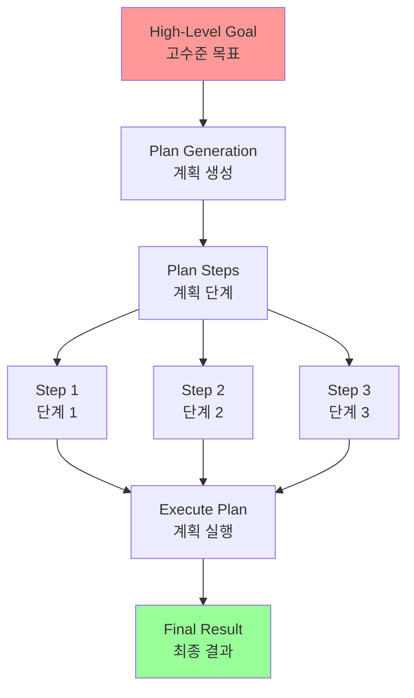
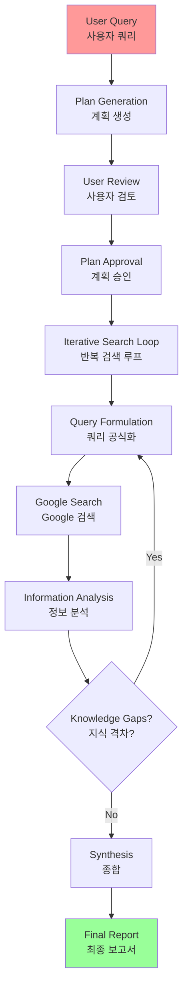
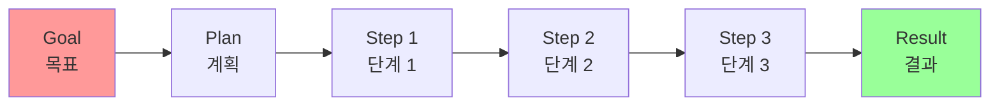
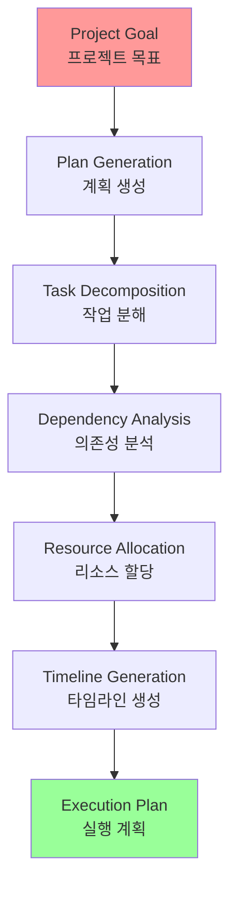

# Chapter 6: Planning

## 개요

Complex problems often cannot be solved with a single action and require foresight to achieve desired outcomes. Without a structured approach, agentic systems struggle to handle multifaceted requests that involve multiple steps and dependencies. This is where the Planning pattern becomes crucial.

복잡한 문제는 종종 단일 행동으로 해결할 수 없으며 원하는 결과를 달성하기 위해 예견이 필요합니다. 구조화된 접근 방식 없이는 에이전트 시스템이 여러 단계와 종속성을 포함하는 다면적 요청을 처리하기 어렵습니다. 이것이 Planning 패턴이 중요한 이유입니다.

## 패턴 개요 (Pattern Overview)

### 핵심 개념

The Planning pattern provides a standardized solution by enabling agentic systems to first generate a coherent plan to solve a goal. This pattern involves breaking down a high-level goal into a sequence of smaller, actionable steps or sub-goals.

계획 패턴은 에이전트 시스템이 먼저 목표를 해결하기 위한 일관된 계획을 생성하도록 하는 표준화된 솔루션을 제공합니다. 이 패턴은 고수준 목표를 더 작고 실행 가능한 단계 또는 하위 목표의 시퀀스로 분해하는 것을 포함합니다.

**Planning(계획) 패턴**은 에이전트 시스템이 먼저 목표를 해결하기 위한 일관된 계획을 생성하도록 하는 표준화된 솔루션을 제공합니다.



### 프로세스

In the context of AI, it's helpful to think of a planning agent as a specialist to whom you delegate a complex goal. When you ask it to "organize a team offsite," you are defining the what—the objective and its constraints—but not the how. The agent's core task is to autonomously chart a course to that goal. It must first understand the initial state (e.g., budget, number of participants, desired dates) and the goal state (a successfully booked offsite), and then discover the optimal sequence of actions to connect them. The plan is not known in advance; it is created in response to the request.

AI의 맥락에서, 계획 에이전트를 복잡한 목표를 위임받는 전문가로 생각하는 것이 도움이 됩니다. "팀 오프사이트를 조직하라"고 요청할 때, 당신은 무엇(what)을 정의하는 것입니다—목표와 제약 조건—하지만 어떻게(how)는 아닙니다. 에이전트의 핵심 작업은 그 목표에 이르는 과정을 자율적으로 계획하는 것입니다. 먼저 초기 상태(예: 예산, 참가자 수, 원하는 날짜)와 목표 상태(성공적으로 예약된 오프사이트)를 이해한 다음, 그것들을 연결하는 최적의 행동 시퀀스를 발견해야 합니다. 계획은 미리 알려져 있지 않습니다; 요청에 대한 응답으로 생성됩니다.

A hallmark of this process is adaptability. An initial plan is merely a starting point, not a rigid script. The agent's real power is its ability to incorporate new information and steer the project around obstacles. For instance, if the preferred venue becomes unavailable or a chosen caterer is fully booked, a capable agent doesn't simply fail. It adapts. It registers the new constraint, re-evaluates its options, and formulates a new plan, perhaps by suggesting alternative venues or dates.

이 프로세스의 특징은 적응성입니다. 초기 계획은 단지 시작점일 뿐이며, 엄격한 스크립트가 아닙니다. 에이전트의 진정한 힘은 새로운 정보를 통합하고 장애물 주변으로 프로젝트를 조정하는 능력입니다. 예를 들어, 선호하는 장소를 사용할 수 없게 되거나 선택한 케이터러가 예약이 꽉 찬 경우, 능력 있는 에이전트는 단순히 실패하지 않습니다. 적응합니다. 새로운 제약을 등록하고, 옵션을 재평가하며, 대체 장소나 날짜를 제안하는 등 새로운 계획을 수립합니다.

However, it is crucial to recognize the trade-off between flexibility and predictability. Dynamic planning is a specific tool, not a universal solution. When a problem's solution is already well-understood and repeatable, constraining the agent to a predetermined, fixed workflow is more effective. This approach limits the agent's autonomy to reduce uncertainty and the risk of unpredictable behavior, guaranteeing a reliable and consistent outcome. Therefore, the decision to use a planning agent versus a simple task-execution agent hinges on a single question: does the "how" need to be discovered, or is it already known?

그러나 유연성과 예측 가능성 사이의 트레이드오프를 인식하는 것이 중요합니다. 동적 계획은 특정 도구이며, 보편적인 솔루션이 아닙니다. 문제의 해결책이 이미 잘 이해되고 반복 가능한 경우, 에이전트를 사전 정의된 고정 워크플로우로 제한하는 것이 더 효과적입니다. 이 접근 방식은 에이전트의 자율성을 제한하여 불확실성과 예측할 수 없는 행동의 위험을 줄이고, 신뢰할 수 있고 일관된 결과를 보장합니다. 따라서 계획 에이전트를 사용할지 단순 작업 실행 에이전트를 사용할지의 결정은 단일 질문에 달려 있습니다: "어떻게"를 발견해야 하는가, 아니면 이미 알려져 있는가?

계획 패턴은 고수준 목표를 더 작고 실행 가능한 단계 또는 하위 목표의 시퀀스로 분해하는 것을 포함합니다.

**프로세스 단계**:
1. **목표 분석**: 고수준 목표를 이해하고 분석
2. **계획 생성**: 목표를 달성하기 위한 단계별 계획 수립
3. **계획 실행**: 계획의 각 단계를 순차적으로 실행
4. **모니터링 및 조정**: 필요에 따라 계획을 모니터링하고 조정

### LLM의 적합성

In the context of AI agents, planning typically involves an agent taking a high-level objective and autonomously, or semi-autonomously, generating a series of intermediate steps or sub-goals. These steps can then be executed sequentially or in a more complex flow, potentially involving other patterns like tool use, routing, or multi-agent collaboration. The planning mechanism might involve sophisticated search algorithms, logical reasoning, or increasingly, leveraging the capabilities of large language models (LLMs) to generate plausible and effective plans based on their training data and understanding of tasks.

AI 에이전트의 맥락에서, 계획은 일반적으로 에이전트가 고수준 목표를 취하고 자율적으로 또는 반자율적으로 일련의 중간 단계 또는 하위 목표를 생성하는 것을 포함합니다. 이러한 단계는 순차적으로 또는 더 복잡한 흐름으로 실행될 수 있으며, 도구 사용, 라우팅 또는 다중 에이전트 협업과 같은 다른 패턴을 포함할 수 있습니다. 계획 메커니즘은 정교한 검색 알고리즘, 논리적 추론, 또는 점점 더 대규모 언어 모델(LLM)의 기능을 활용하여 훈련 데이터와 작업에 대한 이해를 기반으로 그럴듯하고 효과적인 계획을 생성하는 것을 포함할 수 있습니다.

A good planning capability allows agents to tackle problems that aren't simple, single-step queries. It enables them to handle multi-faceted requests, adapt to changing circumstances by replanning, and orchestrate complex workflows. It's a foundational pattern that underpins many advanced agentic behaviors, turning a simple reactive system into one that can proactively work towards a defined objective.

좋은 계획 능력은 에이전트가 단순하고 단일 단계 쿼리가 아닌 문제를 해결할 수 있게 합니다. 다면적 요청을 처리하고, 재계획을 통해 변화하는 상황에 적응하며, 복잡한 워크플로우를 조정할 수 있게 합니다. 이것은 많은 고급 에이전트 행동을 뒷받침하는 기본 패턴으로, 단순한 반응형 시스템을 정의된 목표를 향해 능동적으로 작동할 수 있는 시스템으로 전환합니다.

LLMs는 특히 계획 생성에 적합합니다:
- 방대한 훈련 데이터를 기반으로 그럴듯하고 효과적인 계획을 생성할 수 있음
- 이 구조화된 접근 방식은 단순한 반응형 에이전트를 복잡한 목표를 향해 능동적으로 작업할 수 있는 전략적 실행자로 변환
- 필요시 계획을 조정할 수 있는 능력 제공

## 실용적 응용 및 사용 사례 (Practical Applications & Use Cases)

계획 패턴은 복잡하고 다단계 작업이 필요한 다양한 시나리오에 적용할 수 있습니다:

### 1. 복잡한 연구 작업

다양한 소스에서 정보를 수집하고 종합하는 다단계 연구 프로세스.

**예시: Google DeepResearch**
- 사용자 프롬프트를 다중 포인트 연구 계획으로 분해
- 계획을 사용자에게 검토 및 수정을 위해 제시
- 승인 후 반복적 검색 및 분석 루프 시작
- 동적으로 쿼리를 공식화하고 정제하며 지식 격차를 식별하고 데이터 포인트를 확인하고 불일치를 해결

### 2. 콘텐츠 생성

복잡한 문서나 보고서를 생성하기 위한 구조화된 계획 수립.

**예시: 기사 작성 에이전트**
- 주제에 대한 요약을 위한 불릿 포인트 계획 생성
- 계획을 기반으로 요약 작성
- 계획과 요약을 포함한 최종 보고서 생성

### 3. 프로젝트 관리

복잡한 프로젝트를 관리 가능한 작업으로 분해하고 실행 순서를 결정.

**예시: 소프트웨어 개발 프로젝트**
- 프로젝트 목표를 분석
- 개발 단계별 계획 수립 (설계, 구현, 테스트, 배포)
- 각 단계를 순차적으로 실행

### 4. 문제 해결

복잡한 문제를 더 작은 하위 문제로 분해하고 해결 전략을 수립.

**예시: 논리 퍼즐 해결**
- 문제를 분석하고 해결 전략 수립
- 각 단계를 순차적으로 실행
- 필요시 계획 조정

## 실습 코드 예제 (Hands-On Code Example)

### CrewAI 예제

CrewAI 프레임워크를 사용한 Planner 패턴 구현 예제입니다.

#### 전체 코드

```python
import os
from dotenv import load_dotenv
from crewai import Agent, Task, Crew, Process
from langchain_openai import ChatOpenAI

# 보안을 위해 .env 파일에서 환경 변수 로드
load_dotenv()

# 1. 명확성을 위해 언어 모델을 명시적으로 정의
llm = ChatOpenAI(model="gpt-4-turbo")

# 2. 명확하고 집중된 에이전트 정의
planner_writer_agent = Agent(
    role='Article Planner and Writer',
    goal='Plan and then write a concise, engaging summary on a specified topic.',
    backstory=(
        'You are an expert technical writer and content strategist. '
        'Your strength lies in creating a clear, actionable plan before writing, '
        'ensuring the final summary is both informative and easy to digest.'
    ),
    verbose=True,
    allow_delegation=False,
    llm=llm  # 특정 LLM을 에이전트에 할당
)

# 3. 더 구조화되고 구체적인 예상 출력을 가진 작업 정의
topic = "The importance of Reinforcement Learning in AI"
high_level_task = Task(
    description=(
        f"1. Create a bullet-point plan for a summary on the topic: '{topic}'.\n"
        f"2. Write the summary based on your plan, keeping it around 200 words."
    ),
    expected_output=(
        "A final report containing two distinct sections:\n\n"
        "### Plan\n"
        "- A bulleted list outlining the main points of the summary.\n\n"
        "### Summary\n"
        "- A concise and well-structured summary of the topic."
    ),
    agent=planner_writer_agent,
)

# 명확한 프로세스로 크루 생성
crew = Crew(
    agents=[planner_writer_agent],
    tasks=[high_level_task],
    process=Process.sequential,
)

# 작업 실행
print("## Running the planning and writing task ##")
result = crew.kickoff()
print("\n\n---\n## Task Result ##\n---")
print(result)
```

#### 코드 설명

이 코드는 CrewAI 라이브러리를 사용하여 주어진 주제에 대한 계획을 세우고 요약을 작성하는 AI 에이전트를 생성합니다:

1. **에이전트 정의**: Article Planner and Writer 역할의 에이전트 생성
2. **작업 정의**: 먼저 계획을 생성한 다음 요약을 작성하는 작업 정의
3. **크루 구성**: 에이전트와 작업으로 크루를 조립하고 순차적으로 처리
4. **실행**: 크루를 실행하여 결과 출력

### Google DeepResearch

Google Gemini DeepResearch는 자율 정보 검색 및 종합을 위해 설계된 에이전트 기반 시스템입니다.

#### 주요 특징



#### 프로세스

1. **계획 생성**: 사용자 프롬프트를 다중 포인트 연구 계획으로 분해
2. **사용자 검토**: 계획을 사용자에게 검토 및 수정을 위해 제시
3. **반복 검색**: 동적으로 쿼리를 공식화하고 정제하며 지식 격차를 식별
4. **종합**: 수집된 정보를 구조화된 다중 페이지 요약으로 통합
5. **인용**: 원본 소스에 대한 인용 포함

### OpenAI Deep Research API

OpenAI Deep Research API는 복잡한 연구 작업을 자동화하도록 설계된 전문 도구입니다.

#### 코드 예제

```python
from openai import OpenAI

# API 키로 클라이언트 초기화
client = OpenAI(api_key="YOUR_OPENAI_API_KEY")

# 에이전트의 역할과 사용자의 연구 질문 정의
system_message = """You are a professional researcher preparing a structured, data-driven report.
Focus on data-rich insights, use reliable sources, and include inline citations."""

user_query = "Research the economic impact of semaglutide on global healthcare systems."

# Deep Research API 호출 생성
response = client.responses.create(
    model="o3-deep-research-2025-06-26",
    input=[
        {
            "role": "developer",
            "content": [{"type": "input_text", "text": system_message}]
        },
        {
            "role": "user",
            "content": [{"type": "input_text", "text": user_query}]
        }
    ],
    reasoning={"summary": "auto"},
    tools=[{"type": "web_search_preview"}]
)

# 응답에서 최종 보고서 접근 및 인쇄
final_report = response.output[-1].content[0].text
print(final_report)

# 인라인 인용 및 메타데이터 접근
print("--- CITATIONS ---")
annotations = response.output[-1].content[0].annotations
if annotations:
    for i, citation in enumerate(annotations):
        cited_text = final_report[citation.start_index:citation.end_index]
        print(f"Citation {i+1}:")
        print(f"  Cited Text: {cited_text}")
        print(f"  Title: {citation.title}")
        print(f"  URL: {citation.url}")

# 중간 단계 검사
print("--- INTERMEDIATE STEPS ---")
# 추론 단계, 웹 검색 호출, 코드 실행 단계 등
```

#### 주요 이점

1. **구조화된 인용 출력**: 인라인 인용과 소스 메타데이터가 연결된 잘 구성된 보고서 생성
2. **투명성**: 모든 중간 단계 노출 (에이전트의 추론, 실행된 웹 검색 쿼리, 실행된 코드)
3. **확장성**: Model Context Protocol (MCP) 지원으로 개인 지식 기반 및 내부 데이터 소스 연결 가능

## 한눈에 보기 (At a Glance)

### 무엇 (What)

복잡한 문제는 종종 단일 행동으로 해결할 수 없으며 원하는 결과를 달성하기 위해 예견이 필요합니다. 구조화된 접근 방식 없이는 에이전트 시스템이 여러 단계와 종속성을 포함하는 다면적 요청을 처리하기 어렵습니다.

### 왜 (Why)

계획 패턴은 에이전트 시스템이 먼저 목표를 해결하기 위한 일관된 계획을 생성하도록 하는 표준화된 솔루션을 제공합니다. 고수준 목표를 더 작고 실행 가능한 단계 또는 하위 목표의 시퀀스로 분해하는 것을 포함합니다.

### 경험 법칙 (Rule of Thumb)

복잡하고 다단계 작업이 필요한 경우 계획 패턴을 사용하세요. 이는 복잡한 연구 작업, 콘텐츠 생성, 프로젝트 관리, 문제 해결과 같은 시나리오에 특히 유용합니다.

### 시각적 요약



## 핵심 요약 (Key Takeaways)

1. **계획 패턴은 고수준 목표를 더 작고 실행 가능한 단계로 분해하는 것을 포함합니다**

2. **LLMs는 방대한 훈련 데이터를 기반으로 그럴듯하고 효과적인 계획을 생성할 수 있어 계획 생성에 특히 적합합니다**

3. **이 구조화된 접근 방식은 단순한 반응형 에이전트를 복잡한 목표를 향해 능동적으로 작업할 수 있는 전략적 실행자로 변환합니다**

4. **계획 패턴은 복잡한 연구 작업, 콘텐츠 생성, 프로젝트 관리, 문제 해결과 같은 다양한 시나리오에 적용할 수 있습니다**

5. **Google DeepResearch와 OpenAI Deep Research API는 계획 패턴을 구현하는 강력한 예제를 제공합니다**

6. **계획은 필요에 따라 모니터링되고 조정될 수 있어 적응형 문제 해결을 가능하게 합니다**

## 결론

계획 패턴은 복잡한 문제를 해결하기 위한 구조화된 접근 방식을 제공합니다. 고수준 목표를 더 작고 실행 가능한 단계로 분해함으로써, 에이전트 시스템은 복잡한 워크플로우를 관리하고 다양한 도구를 조정하며 논리적 순서로 종속성을 처리할 수 있습니다.

LLMs는 방대한 훈련 데이터를 기반으로 그럴듯하고 효과적인 계획을 생성할 수 있어 계획 생성에 특히 적합합니다. 이 구조화된 접근 방식은 단순한 반응형 에이전트를 복잡한 목표를 향해 능동적으로 작업할 수 있는 전략적 실행자로 변환하며, 필요시 계획을 조정할 수 있는 능력을 제공합니다.

Google DeepResearch와 OpenAI Deep Research API와 같은 시스템은 계획 패턴의 강력한 구현을 보여주며, 복잡한 연구 작업을 자동화하고 구조화된 보고서를 생성하는 데 그 가치를 입증합니다.

## 이론적 배경 및 학술적 근거 (Theoretical Background and Academic Foundation)

### 고전적 AI 계획 이론 (Classical AI Planning)

계획 패턴은 고전적 AI 계획 이론에 기반합니다. STRIPS (Stanford Research Institute Problem Solver, 1971)는 계획 문제를 형식화한 초기 시스템입니다.

**STRIPS 표현**:
- **상태 (State)**: 세계의 현재 상태를 나타내는 논리식 집합
- **작업 (Action)**: 전제 조건, 추가 목록, 삭제 목록으로 정의
- **목표 (Goal)**: 달성하려는 상태

**LLM 기반 계획과의 관계**:
- LLM은 자연어로 계획을 생성하지만, 구조적으로는 STRIPS와 유사
- 전제 조건, 효과, 목표 상태를 자연어로 표현
- 계획 검증 및 실행 가능성 검사

### PDDL (Planning Domain Definition Language)

PDDL은 계획 문제를 표준화된 형식으로 표현하는 언어입니다.

**PDDL 구성 요소**:
- **도메인 정의**: 가능한 작업과 술어
- **문제 정의**: 초기 상태와 목표 상태

**에이전트 시스템에서의 적용**:
- 도메인 지식을 구조화된 형식으로 표현
- 계획 생성 알고리즘 적용
- 계획 실행 및 모니터링

### 계획 알고리즘

**계획 알고리즘 유형**:
1. **전진 체이닝 (Forward Chaining)**: 초기 상태에서 목표로 진행
2. **후진 체이닝 (Backward Chaining)**: 목표에서 초기 상태로 역추적
3. **부분 순서 계획 (Partial Order Planning)**: 작업 간 부분적 순서만 지정
4. **계획 공간 계획 (Plan Space Planning)**: 계획 공간에서 검색

**LLM의 역할**:
- LLM은 휴리스틱 검색으로 작동
- 방대한 지식 기반을 활용한 계획 생성
- 자연어로 계획을 생성하고 검증

### 목표 지향 행동 (Goal-Directed Behavior)

계획은 목표 지향 행동의 핵심입니다. Miller, Galanter, & Pribram(1960)의 TOTE (Test-Operate-Test-Exit) 모델:

**TOTE 사이클**:
1. **Test**: 현재 상태가 목표와 일치하는지 테스트
2. **Operate**: 목표 달성을 위한 작업 수행
3. **Test**: 다시 테스트
4. **Exit**: 목표 달성 시 종료

**에이전트 계획에서의 적용**:
- 계획 생성: 목표 달성을 위한 작업 시퀀스
- 계획 실행: 각 작업을 순차적으로 실행
- 계획 모니터링: 진행 상황 추적 및 조정

## 성능 최적화 기법 (Performance Optimization Techniques)

### 1. 계획 캐싱

유사한 목표에 대한 계획 재사용:

```python
from functools import lru_cache

@lru_cache(maxsize=100)
def cached_plan(goal_hash: str, initial_state_hash: str) -> Plan:
    """캐시된 계획 반환"""
    # 계획 생성 로직
    return generate_plan(goal, initial_state)
```

### 2. 계획 단순화

복잡한 계획을 더 간단한 하위 계획으로 분해:

```python
def simplify_plan(plan: Plan) -> Plan:
    """계획 단순화"""
    # 불필요한 단계 제거
    simplified = remove_redundant_steps(plan)
    # 병렬 실행 가능한 단계 식별
    parallel_groups = identify_parallel_steps(simplified)
    return optimize_parallel_execution(parallel_groups)
```

### 3. 계획 검증

계획 실행 전 검증으로 실패 방지:

```python
def validate_plan(plan: Plan, initial_state: State) -> ValidationResult:
    """계획 검증"""
    # 전제 조건 검증
    for step in plan.steps:
        if not check_preconditions(step, initial_state):
            return ValidationResult(valid=False, error="Precondition failed")
        initial_state = apply_effects(step, initial_state)
    
    # 목표 달성 검증
    if not check_goal_achievement(plan.goal, initial_state):
        return ValidationResult(valid=False, error="Goal not achievable")
    
    return ValidationResult(valid=True)
```

### 4. 적응형 계획 재계획

실행 중 계획 조정:

```python
def adaptive_replanning(current_plan: Plan, execution_state: State) -> Plan:
    """실행 중 계획 재조정"""
    # 계획과 실제 상태 비교
    deviation = compare_plan_to_state(current_plan, execution_state)
    
    if deviation > threshold:
        # 계획 재생성
        new_plan = generate_plan(current_plan.goal, execution_state)
        return new_plan
    
    return current_plan
```

## 트레이드오프 및 한계점 (Trade-offs and Limitations)

### 계획 패턴의 장점

1. **체계적 접근**: 구조화된 문제 해결
2. **예측 가능성**: 계획을 통해 결과 예측 가능
3. **효율성**: 최적 경로 탐색
4. **적응성**: 계획 수정 및 재계획 가능

### 계획 패턴의 한계

1. **계획 복잡도**: 복잡한 문제는 계획 생성이 어려움
2. **불확실성**: 예측 불가능한 환경 변화
3. **계산 비용**: 계획 생성에 시간과 리소스 소요
4. **계획 오류**: 잘못된 계획은 실행 실패로 이어짐

### 완화 전략

1. **계획 단순화**: 복잡한 계획을 작은 단위로 분해
2. **불확실성 처리**: 확률적 계획 또는 계획 B 준비
3. **점진적 계획**: 단기 계획부터 시작하여 확장
4. **계획 검증**: 실행 전 계획 검증 및 테스트

## 관련 패턴과의 비교 (Comparison with Related Patterns)

### Planning vs. Prompt Chaining

| 특성 | Prompt Chaining | Planning |
|------|----------------|----------|
| 목적 | 순차적 처리 | 목표 달성 |
| 유연성 | 낮음 (고정 순서) | 높음 (동적 조정) |
| 목표 지향 | 없음 | 있음 |
| 재계획 | 어려움 | 가능 |

### Planning vs. Routing

계획과 라우팅은 서로 보완적:

- **Planning**: 장기적 목표 달성을 위한 전략 수립
- **Routing**: 단기적 의사결정 및 경로 선택
- **결합**: 계획 내에서 라우팅을 사용하여 세부 경로 결정

## 실무 적용 사례 확장 (Extended Practical Applications)

### 1. 프로젝트 관리 자동화

복잡한 프로젝트 계획 생성:



### 2. 로봇 경로 계획

물리적 환경에서의 경로 계획:

1. **환경 모델링**: 장애물 및 제약 조건 파악
2. **경로 생성**: 최적 경로 계산
3. **경로 검증**: 충돌 및 제약 조건 검증
4. **실행 모니터링**: 실제 이동 중 경로 조정

### 3. 비즈니스 프로세스 자동화

복잡한 비즈니스 워크플로우 계획:

```python
class BusinessProcessPlanner:
    def plan_workflow(self, business_goal: str) -> Workflow:
        """비즈니스 워크플로우 계획"""
        # 1. 목표 분석
        sub_goals = self.analyze_goal(business_goal)
        
        # 2. 프로세스 단계 생성
        steps = []
        for sub_goal in sub_goals:
            step = self.generate_step(sub_goal)
            steps.append(step)
        
        # 3. 의존성 분석
        dependencies = self.analyze_dependencies(steps)
        
        # 4. 최적 순서 결정
        ordered_steps = self.optimize_order(steps, dependencies)
        
        return Workflow(ordered_steps)
```

## 참고 자료 (References)

### 학술 논문

1. Fikes, R. E., & Nilsson, N. J. (1971). "STRIPS: A new approach to the application of theorem proving to problem solving." *Artificial Intelligence*, 2(3-4), 189-208.

2. McDermott, D., et al. (1998). "PDDL - The Planning Domain Definition Language." *Technical Report CVC TR-98-003*.

3. Miller, G. A., Galanter, E., & Pribram, K. H. (1960). *Plans and the Structure of Behavior*. Holt, Rinehart and Winston.

4. Russell, S., & Norvig, P. (2020). *Artificial Intelligence: A Modern Approach* (4th ed.). Pearson. (Chapter 11: Planning)

5. Ghallab, M., Nau, D., & Traverso, P. (2016). *Automated Planning: Theory and Practice*. Morgan Kaufmann.

6. Silver, T., et al. (2022). "Learning to Act by Predicting the Future." *arXiv preprint arXiv:2211.12579*.

### 프레임워크 및 도구 문서

1. Google DeepResearch Documentation:
   https://deepmind.google/technologies/gemini/deep-research/

2. OpenAI Deep Research API:
   https://platform.openai.com/docs/guides/deep-research

3. CrewAI Documentation:
   https://docs.crewai.com/

4. LangChain Planning:
   https://python.langchain.com/docs/use_cases/planning/

### 추가 학습 자료

5. "Automated Planning" by Malik Ghallab et al.

6. "Planning Algorithms" by Steven M. LaValle

7. "PDDL: The Planning Domain Definition Language" - Official Documentation

---

**이전 챕터**: [Chapter 5: Tool Use](chapter_05_Tool_Use.md)  
**다음 챕터**: [Chapter 7: Multi-Agent](chapter_07_Multi-Agent.md)

