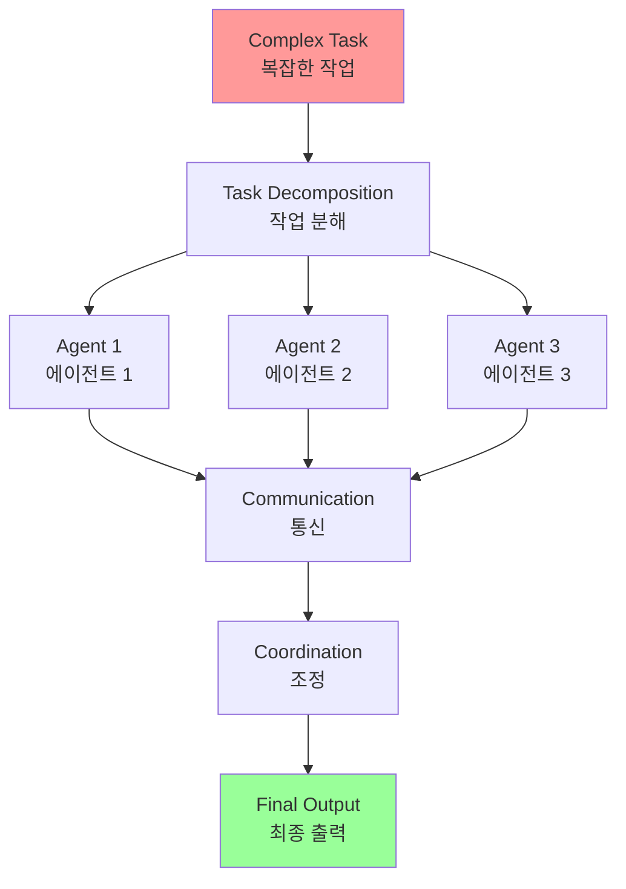
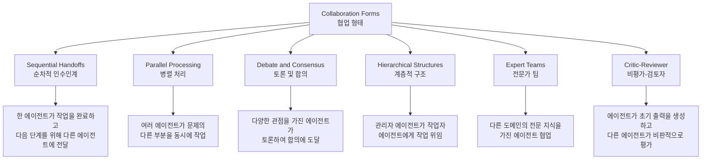
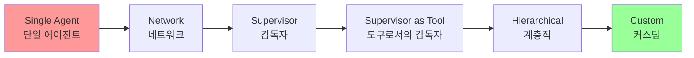
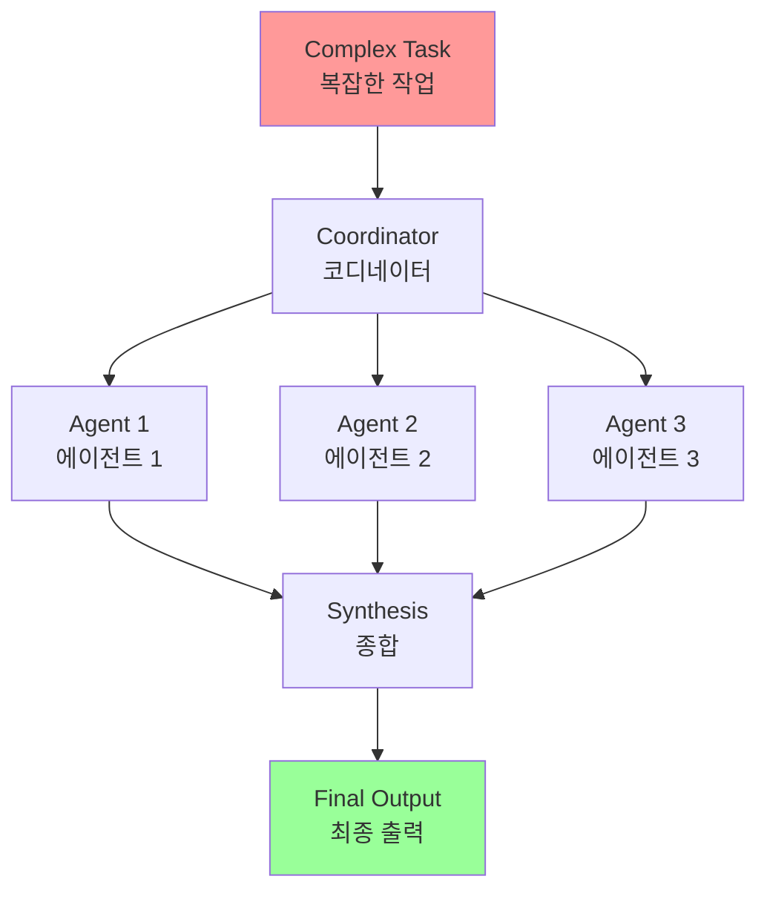
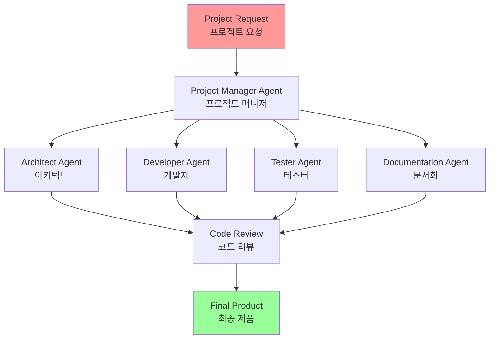

# Chapter 7: Multi-Agent Collaboration

## 개요

While single-agent architectures can be effective for well-defined problems, their capabilities are often limited when facing complex, multi-domain tasks. The Multi-Agent Collaboration pattern addresses these limitations by structuring systems as collaborative ensembles of distinct, specialized agents.

단일 에이전트 아키텍처는 잘 정의된 문제에 효과적일 수 있지만, 복잡하고 다중 도메인 작업에 직면할 때 그 능력은 종종 제한됩니다. Multi-Agent Collaboration 패턴은 이러한 제한을 해결하기 위해 시스템을 별개의 전문 에이전트들의 협력 앙상블로 구조화합니다.

## 패턴 개요 (Pattern Overview)

### 핵심 개념

The Multi-Agent Collaboration pattern involves designing systems where multiple independent or semi-independent agents work together to achieve a common goal. This approach is based on the principle of task decomposition: a high-level goal is broken down into distinct sub-problems, and each sub-problem is assigned to an agent that is best suited for that particular task, whether due to specific tools, data access, or reasoning capabilities.

다중 에이전트 협업 패턴은 여러 독립적이거나 반독립적인 에이전트가 공통 목표를 달성하기 위해 함께 작동하는 시스템을 설계하는 것을 포함합니다. 이 접근 방식은 작업 분해 원칙에 기반합니다: 고수준 목표가 별개의 하위 문제로 분해되고, 각 하위 문제는 특정 도구, 데이터 접근 또는 추론 능력으로 인해 해당 작업에 가장 적합한 에이전트에 할당됩니다.

**Multi-Agent Collaboration(다중 에이전트 협업) 패턴**은 여러 독립적이거나 반독립적인 에이전트가 공통 목표를 달성하기 위해 함께 작동하는 시스템을 설계하는 것을 포함합니다.



### 작업 분해 원칙

This approach is predicated on the principle of task decomposition, where a high-level objective is broken down into discrete sub-problems. Each sub-problem is then assigned to an agent possessing the specific tools, data access, or reasoning capabilities best suited for that task.

이 접근 방식은 작업 분해 원칙에 기반합니다. 고수준 목표가 별개의 하위 문제로 분해되며, 각 하위 문제는 해당 작업에 가장 적합한 특정 도구, 데이터 접근 또는 추론 능력을 가진 에이전트에 할당됩니다.

For example, a complex research query might be decomposed and assigned to a Research Agent for information retrieval, a Data Analysis Agent for statistical processing, and a Synthesis Agent for generating the final report. The efficacy of such a system is not merely due to the division of labor but is critically dependent on the mechanisms for inter-agent communication. This requires a standardized communication protocol and a shared ontology, allowing agents to exchange data, delegate sub-tasks, and coordinate their actions to ensure the final output is coherent.

예를 들어, 복잡한 연구 쿼리는 정보 검색을 위한 Research Agent, 통계 처리를 위한 Data Analysis Agent, 최종 보고서 생성을 위한 Synthesis Agent에 분해되고 할당될 수 있습니다. 이러한 시스템의 효능은 단순히 노동 분할 때문이 아니라 에이전트 간 통신 메커니즘에 크게 의존합니다. 이를 위해서는 표준화된 통신 프로토콜과 공유 온톨로지가 필요하며, 에이전트가 데이터를 교환하고, 하위 작업을 위임하며, 최종 출력이 일관되도록 행동을 조정할 수 있게 합니다.

### 예시: 복잡한 연구 쿼리

For example, a complex research query might be decomposed and assigned to a Research Agent for information retrieval, a Data Analysis Agent for statistical processing, and a Synthesis Agent for generating the final report. The efficacy of such a system is not merely due to the division of labor but is critically dependent on the mechanisms for inter-agent communication. This requires a standardized communication protocol and a shared ontology, allowing agents to exchange data, delegate sub-tasks, and coordinate their actions to ensure the final output is coherent.

예를 들어, 복잡한 연구 쿼리는 정보 검색을 위한 Research Agent, 통계 처리를 위한 Data Analysis Agent, 최종 보고서 생성을 위한 Synthesis Agent에 분해되고 할당될 수 있습니다. 이러한 시스템의 효능은 단순히 노동 분할 때문이 아니라 에이전트 간 통신 메커니즘에 크게 의존합니다. 이를 위해서는 표준화된 통신 프로토콜과 공유 온톨로지가 필요하며, 에이전트가 데이터를 교환하고, 하위 작업을 위임하며, 최종 출력이 일관되도록 행동을 조정할 수 있게 합니다.

복잡한 연구 쿼리는 다음과 같이 분해되고 할당될 수 있습니다:
- **Research Agent**: 정보 검색
- **Data Analysis Agent**: 통계 처리
- **Synthesis Agent**: 최종 보고서 생성

This distributed architecture offers several advantages, including enhanced modularity, scalability, and robustness, as the failure of a single agent does not necessarily cause a total system failure. The collaboration allows for a synergistic outcome where the collective performance of the multi-agent system surpasses the potential capabilities of any single agent within the ensemble.

이 분산 아키텍처는 향상된 모듈성, 확장성 및 견고성을 포함하여 여러 이점을 제공하며, 단일 에이전트의 실패가 반드시 전체 시스템 실패를 초래하지는 않습니다. 협업은 다중 에이전트 시스템의 집단 성능이 앙상블 내의 단일 에이전트의 잠재적 능력을 초과하는 시너지 효과를 가능하게 합니다.

### 협업의 형태

Each agent typically has a defined role, specific goals aligned with the overall objective, and potentially access to different tools or knowledge bases. The power of this pattern lies in the interaction and synergy between these agents.

각 에이전트는 일반적으로 정의된 역할, 전체 목표와 일치하는 특정 목표, 그리고 잠재적으로 다른 도구나 지식 기반에 대한 접근 권한을 가집니다. 이 패턴의 힘은 이러한 에이전트 간의 상호작용과 시너지에 있습니다.

Collaboration can take various forms:

협업은 다양한 형태를 취할 수 있습니다.



#### 1. 순차적 인수인계 (Sequential Handoffs)

**Sequential Handoffs**: One agent completes a task and passes its output to another agent for the next step in a pipeline (similar to the Planning pattern, but explicitly involving different agents).

- 한 에이전트가 작업을 완료하고 파이프라인의 다음 단계를 위해 출력을 다른 에이전트에 전달

#### 2. 병렬 처리 (Parallel Processing)

**Parallel Processing**: Multiple agents work on different parts of a problem simultaneously, and their results are later combined.

- 여러 에이전트가 문제의 다른 부분을 동시에 작업하고 결과를 나중에 결합

#### 3. 토론 및 합의 (Debate and Consensus)

**Debate and Consensus**: Multi-Agent Collaboration where Agents with varied perspectives and information sources engage in discussions to evaluate options, ultimately reaching a consensus or a more informed decision.

- 다양한 관점과 정보 소스를 가진 에이전트가 옵션을 평가하기 위해 토론에 참여하고, 궁극적으로 합의 또는 더 정보에 입각한 결정에 도달

#### 4. 계층적 구조 (Hierarchical Structures)

**Hierarchical Structures**: A manager agent might delegate tasks to worker agents dynamically based on their tool access or plugin capabilities and synthesize their results. Each agent can also handle relevant groups of tools, rather than a single agent handling all the tools.

- 관리자 에이전트가 도구 접근 또는 플러그인 기능에 따라 작업자 에이전트에게 작업을 동적으로 위임하고 결과를 종합

#### 5. 전문가 팀 (Expert Teams)

**Expert Teams**: Agents with specialized knowledge in different domains (e.g., a researcher, a writer, an editor) collaborate to produce a complex output.

- 다른 도메인에서 전문 지식을 가진 에이전트(예: 연구원, 작가, 편집자)가 복잡한 출력을 생성하기 위해 협업

#### 6. 비평가-검토자 (Critic-Reviewer)

**Critic-Reviewer**: Agents create initial outputs such as plans, drafts, or answers. A second group of agents then critically assesses this output for adherence to policies, security, compliance, correctness, quality, and alignment with organizational objectives. The original creator or a final agent revises the output based on this feedback. This pattern is particularly effective for code generation, research writing, logic checking, and ensuring ethical alignment. The advantages of this approach include increased robustness, improved quality, and a reduced likelihood of hallucinations or errors.

- 에이전트가 계획, 초안 또는 답변과 같은 초기 출력을 생성하고, 두 번째 에이전트 그룹이 정책 준수, 보안, 규정 준수, 정확성, 품질 및 조직 목표와의 정렬에 대해 이 출력을 비판적으로 평가

### 에이전트 간 통신

다중 에이전트 시스템의 효율성은 단순히 작업 분할 때문이 아니라 에이전트 간 통신 메커니즘에 크게 의존합니다:

- **표준화된 통신 프로토콜**: 에이전트가 데이터를 교환하고 하위 작업을 위임하며 행동을 조정할 수 있게 함
- **공유 온톨로지**: 최종 출력이 일관되도록 보장

### 분산 아키텍처의 이점

This distributed architecture offers several advantages, including enhanced modularity, scalability, and robustness, as the failure of a single agent does not necessarily cause a total system failure. The collaboration allows for a synergistic outcome where the collective performance of the multi-agent system surpasses the potential capabilities of any single agent within the ensemble.

이 분산 아키텍처는 향상된 모듈성, 확장성 및 견고성을 포함하여 여러 이점을 제공하며, 단일 에이전트의 실패가 반드시 전체 시스템 실패를 초래하지는 않습니다. 협업은 다중 에이전트 시스템의 집단 성능이 앙상블 내의 단일 에이전트의 잠재적 능력을 초과하는 시너지 효과를 가능하게 합니다.

이 분산 아키텍처는 여러 이점을 제공합니다:
- **향상된 모듈성**: 각 에이전트가 독립적으로 작동할 수 있음
- **확장성**: 새로운 에이전트를 쉽게 추가할 수 있음
- **견고성**: 단일 에이전트의 실패가 반드시 전체 시스템 실패를 초래하지 않음
- **시너지 효과**: 다중 에이전트 시스템의 집단 성능이 앙상블 내의 단일 에이전트의 잠재적 능력을 초과할 수 있음

## 에이전트 간 상호관계 및 통신 구조 탐구

에이전트가 상호작용하고 통신하는 복잡한 방식을 이해하는 것은 효과적인 다중 에이전트 시스템을 설계하는 데 기본적입니다.

### 통신 모델 스펙트럼



#### 1. 단일 에이전트 (Single Agent)
- 가장 기본적인 수준에서 "단일 에이전트"는 다른 엔티티와 직접 상호작용하거나 통신하지 않고 자율적으로 작동
- 구현하고 관리하기 간단하지만, 개별 에이전트의 범위와 리소스에 의해 본질적으로 제한됨
- 독립적인 하위 문제로 분해 가능한 작업에 적합

#### 2. 네트워크 (Network)
- "네트워크" 모델은 여러 에이전트가 분산 방식으로 서로 직접 상호작용하는 협업을 나타냄
- 통신은 일반적으로 피어 투 피어로 발생하여 정보, 리소스 및 작업 공유 허용
- 한 에이전트의 실패가 반드시 전체 시스템을 마비시키지 않아 복원력 향상
- 대규모 비구조화된 네트워크에서 통신 오버헤드 관리 및 일관된 의사결정 보장이 어려울 수 있음

#### 3. 감독자 (Supervisor)
- "감독자" 모델에서 전용 에이전트인 "감독자"가 하위 에이전트 그룹의 활동을 감독하고 조정
- 감독자는 통신, 작업 할당 및 충돌 해결을 위한 중앙 허브 역할
- 이 계층적 구조는 명확한 권한 라인을 제공하고 관리 및 제어를 단순화할 수 있음
- 단일 실패 지점(감독자)을 도입하고, 감독자가 많은 수의 하위 또는 복잡한 작업에 압도되면 병목이 될 수 있음

#### 4. 도구로서의 감독자 (Supervisor as a Tool)
- 이 모델은 "감독자" 개념의 미묘한 확장으로, 감독자의 역할이 직접적인 명령 및 제어보다는 다른 에이전트에게 리소스, 지도 또는 분석 지원을 제공하는 것
- 감독자는 다른 에이전트가 작업을 더 효과적으로 수행할 수 있도록 도구, 데이터 또는 계산 서비스를 제공할 수 있음

#### 5. 계층적 (Hierarchical)
- "계층적" 모델은 감독자 개념을 확장하여 다층 조직 구조를 생성
- 더 높은 수준의 감독자가 더 낮은 수준의 감독자를 감독하고, 궁극적으로 최하위 계층에 운영 에이전트 컬렉션
- 특정 계층에 의해 관리되는 하위 문제로 분해 가능한 복잡한 문제에 적합
- 확장성 및 복잡성 관리에 대한 구조화된 접근 방식 제공

#### 6. 커스텀 (Custom)
- "커스텀" 모델은 다중 에이전트 시스템 설계에서 궁극적인 유연성을 나타냄
- 주어진 문제나 애플리케이션의 특정 요구사항에 정확히 맞춘 고유한 상호관계 및 통신 구조 생성 허용
- 이전에 언급된 모델의 요소를 결합하는 하이브리드 접근 방식 또는 환경의 고유한 제약과 기회에서 나오는 완전히 새로운 설계를 포함할 수 있음

## 실용적 응용 및 사용 사례 (Practical Applications & Use Cases)

The Multi-Agent Collaboration pattern is essential for handling complex and multifaceted tasks, providing powerful solutions across various domains:

다중 에이전트 협업 패턴은 복잡하고 다면적인 작업을 처리하는 데 필수적이며, 다양한 도메인에서 강력한 솔루션을 제공합니다:

### 1. 복잡한 연구 및 분석

에이전트 팀이 연구 프로젝트에서 협업할 수 있습니다:
- **Academic Database Agent**: 학술 데이터베이스 검색 전문
- **Summarization Agent**: 발견 사항 요약
- **Trend Identification Agent**: 트렌드 식별
- **Synthesis Agent**: 정보를 보고서로 종합

### 2. 소프트웨어 개발

소프트웨어 구축에서 에이전트가 협업할 수 있습니다:
- **Requirements Analyst Agent**: 요구사항 분석
- **Code Generator Agent**: 코드 생성
- **Tester Agent**: 테스트
- **Documentation Writer Agent**: 문서 작성

### 3. 창의적 콘텐츠 생성

마케팅 캠페인 생성에 여러 에이전트가 관여할 수 있습니다:
- **Market Research Agent**: 시장 조사
- **Copywriter Agent**: 카피 작성
- **Graphic Design Agent**: 그래픽 디자인 (이미지 생성 도구 사용)
- **Social Media Scheduling Agent**: 소셜 미디어 스케줄링

### 4. 금융 분석

다중 에이전트 시스템이 금융 시장을 분석할 수 있습니다:
- **Stock Data Agent**: 주식 데이터 가져오기
- **News Sentiment Agent**: 뉴스 감정 분석
- **Technical Analysis Agent**: 기술적 분석 수행
- **Investment Recommendation Agent**: 투자 추천 생성

### 5. 고객 지원 에스컬레이션

프론트라인 지원 에이전트가 초기 쿼리를 처리하고, 복잡한 문제를 필요에 따라 전문 에이전트(예: 기술 전문가 또는 청구 전문가)에게 에스컬레이션할 수 있습니다.

### 6. 공급망 최적화

에이전트가 공급망의 다른 노드(공급업체, 제조업체, 유통업체)를 나타내고, 변화하는 수요나 중단에 대응하여 재고 수준, 물류 및 스케줄링을 최적화하기 위해 협업할 수 있습니다.

### 7. 네트워크 분석 및 수정

자율 운영은 특히 장애 지점 지정에서 에이전트 아키텍처로부터 크게 이익을 얻습니다. 여러 에이전트가 문제를 분류하고 수정하며 최적의 조치를 제안하기 위해 협업할 수 있습니다.

## 실습 코드 예제 (Hands-On Code Example)

### CrewAI 예제

CrewAI 프레임워크를 사용한 다중 에이전트 협업 예제입니다.

#### 전체 코드

```python
import os
from dotenv import load_dotenv
from crewai import Agent, Task, Crew, Process
from langchain_google_genai import ChatGoogleGenerativeAI

def setup_environment():
    """환경 변수를 로드하고 필요한 API 키를 확인합니다."""
    load_dotenv()
    if not os.getenv("GOOGLE_API_KEY"):
        raise ValueError("GOOGLE_API_KEY not found. Please set it in your .env file.")

def main():
    """최신 Gemini 모델을 사용하여 콘텐츠 생성을 위한 AI 크루를 초기화하고 실행합니다."""
    setup_environment()
    
    # 사용할 언어 모델 정의
    llm = ChatGoogleGenerativeAI(model="gemini-2.0-flash")
    
    # 특정 역할과 목표를 가진 에이전트 정의
    researcher = Agent(
        role='Senior Research Analyst',
        goal='Find and summarize the latest trends in AI.',
        backstory="You are an experienced research analyst with a knack for identifying key trends and synthesizing information.",
        verbose=True,
        allow_delegation=False,
    )
    
    writer = Agent(
        role='Technical Content Writer',
        goal='Write a clear and engaging blog post based on research findings.',
        backstory="You are a skilled writer who can translate complex technical topics into accessible content.",
        verbose=True,
        allow_delegation=False,
    )
    
    # 에이전트를 위한 작업 정의
    research_task = Task(
        description="Research the top 3 emerging trends in Artificial Intelligence in 2024-2025. Focus on practical applications and potential impact.",
        expected_output="A detailed summary of the top 3 AI trends, including key points and sources.",
        agent=researcher,
    )
    
    writing_task = Task(
        description="Write a 500-word blog post based on the research findings. The post should be engaging and easy for a general audience to understand.",
        expected_output="A complete 500-word blog post about the latest AI trends.",
        agent=writer,
        context=[research_task],  # 연구 작업의 출력을 컨텍스트로 사용
    )
    
    # 크루 생성
    blog_creation_crew = Crew(
        agents=[researcher, writer],
        tasks=[research_task, writing_task],
        process=Process.sequential,
        llm=llm,
        verbose=2  # 상세한 크루 실행 로그를 위한 상세도 설정
    )
    
    # 크루 실행
    print("## Running the blog creation crew with Gemini 2.0 Flash... ##")
    try:
        result = blog_creation_crew.kickoff()
        print("\n------------------\n")
        print("## Crew Final Output ##")
        print(result)
    except Exception as e:
        print(f"\nAn unexpected error occurred: {e}")

if __name__ == "__main__":
    main()
```

#### 코드 설명

이 코드는 CrewAI 라이브러리를 사용하여 AI 트렌드에 대한 블로그 게시물을 생성하는 AI 기반 크루를 정의합니다:

1. **두 개의 에이전트 정의**: 연구원과 작가
2. **두 개의 작업 정의**: 연구 작업과 작성 작업
3. **순차적 프로세스**: 작업이 순서대로 실행되며 작성 작업이 연구 작업의 출력을 컨텍스트로 사용
4. **크루 실행**: 에이전트 간의 협업을 조정하여 원하는 출력 생성

### Google ADK 예제

Google ADK 프레임워크 내에서 계층적 에이전트 구조를 설정하는 예제입니다.

#### 계층적 구조 예제

```python
from google.adk.agents import LlmAgent, BaseAgent
from google.adk.agents.invocation_context import InvocationContext
from google.adk.events import Event
from typing import AsyncGenerator

# BaseAgent를 확장하여 커스텀 에이전트 올바르게 구현
class TaskExecutor(BaseAgent):
    """커스텀, 비-LLM 동작을 가진 전문 에이전트."""
    name: str = "TaskExecutor"
    description: str = "Executes a predefined task."
    
    async def _run_async_impl(self, context: InvocationContext) -> AsyncGenerator[Event, None]:
        """작업을 위한 커스텀 구현 로직."""
        yield Event(author=self.name, content="Task finished successfully.")

# 적절한 초기화로 개별 에이전트 정의
greeter = LlmAgent(
    name="Greeter",
    model="gemini-2.0-flash-exp",
    instruction="You are a friendly greeter."
)

task_doer = TaskExecutor()  # 구체적인 커스텀 에이전트 인스턴스화

# 부모 에이전트 생성 및 하위 에이전트 할당
coordinator = LlmAgent(
    name="Coordinator",
    model="gemini-2.0-flash-exp",
    description="A coordinator that can greet users and execute tasks.",
    instruction="When asked to greet, delegate to the Greeter. When asked to perform a task, delegate to the TaskExecutor.",
    sub_agents=[
        greeter,
        task_doer
    ]
)

# ADK 프레임워크가 자동으로 부모-자식 관계를 설정합니다.
assert greeter.parent_agent == coordinator
assert task_doer.parent_agent == coordinator
print("Agent hierarchy created successfully.")
```

#### 코드 설명

이 코드는 Google ADK를 사용하여 계층적 에이전트 구조를 설정합니다:

1. **커스텀 에이전트**: TaskExecutor는 BaseAgent를 확장하여 비-LLM 동작을 구현
2. **LLM 에이전트**: Greeter는 LlmAgent로 정의
3. **코디네이터**: 부모 에이전트로 하위 에이전트를 관리하고 작업을 위임
4. **계층 구조**: ADK 프레임워크가 자동으로 부모-자식 관계를 설정

## 한눈에 보기 (At a Glance)

### 무엇 (What)

단일 에이전트 아키텍처는 잘 정의된 문제에 효과적일 수 있지만, 복잡하고 다중 도메인 작업에 직면할 때 그 능력은 종종 제한됩니다. 구조화된 접근 방식 없이는 에이전트 시스템이 여러 전문 영역을 포함하는 다면적 요청을 처리하기 어렵습니다.

### 왜 (Why)

다중 에이전트 협업 패턴은 시스템을 별개의 전문 에이전트들의 협력 앙상블로 구조화하여 이러한 제한을 해결합니다. 작업 분해 원칙에 기반하여 고수준 목표를 별개의 하위 문제로 분해하고, 각 하위 문제를 해당 작업에 가장 적합한 에이전트에 할당합니다.

### 경험 법칙 (Rule of Thumb)

단일 에이전트로 처리하기 어려운 복잡하고 다면적 작업이 있는 경우 다중 에이전트 협업 패턴을 사용하세요. 이는 복잡한 연구 작업, 소프트웨어 개발, 창의적 콘텐츠 생성, 금융 분석 등에 특히 유용합니다.

### 시각적 요약



## 핵심 요약 (Key Takeaways)

1. **다중 에이전트 협업 패턴은 여러 독립적이거나 반독립적인 에이전트가 공통 목표를 달성하기 위해 함께 작동하는 시스템을 설계하는 것을 포함합니다**

2. **협업은 순차적 인수인계, 병렬 처리, 토론 및 합의, 계층적 구조, 전문가 팀, 비평가-검토자 등 다양한 형태를 취할 수 있습니다**

3. **에이전트 간 통신은 표준화된 통신 프로토콜과 공유 온톨로지를 통해 이루어집니다**

4. **분산 아키텍처는 향상된 모듈성, 확장성, 견고성을 제공하며 시너지 효과를 창출할 수 있습니다**

5. **CrewAI와 Google ADK와 같은 프레임워크는 에이전트, 작업 및 상호작용 절차를 지정하기 위한 구조를 제공하여 이 패러다임을 촉진합니다**

6. **통신 모델 스펙트럼은 단일 에이전트에서 네트워크, 감독자, 계층적, 커스텀 모델까지 다양합니다**

## 결론

다중 에이전트 협업 패턴은 복잡하고 다중 도메인 작업을 처리하기 위한 강력한 접근 방식입니다. 작업 분해 원칙에 기반하여 고수준 목표를 별개의 하위 문제로 분해하고, 각 하위 문제를 해당 작업에 가장 적합한 전문 에이전트에 할당함으로써, 시스템은 단일 에이전트로는 달성하기 어려운 복잡한 작업을 처리할 수 있습니다.

에이전트 간 통신은 표준화된 통신 프로토콜과 공유 온톨로지를 통해 이루어지며, 이는 최종 출력이 일관되도록 보장합니다. 분산 아키텍처는 향상된 모듈성, 확장성, 견고성을 제공하며, 다중 에이전트 시스템의 집단 성능이 앙상블 내의 단일 에이전트의 잠재적 능력을 초과할 수 있는 시너지 효과를 창출할 수 있습니다.

CrewAI와 Google ADK와 같은 프레임워크는 에이전트, 작업 및 상호작용 절차를 지정하기 위한 구조를 제공하여 이 패러다임을 촉진하며, 개발자가 향상된 모듈성, 확장성 및 복잡성을 처리할 수 있는 시스템을 구축할 수 있게 합니다.

## 이론적 배경 및 학술적 근거 (Theoretical Background and Academic Foundation)

### 분산 인공지능 (Distributed Artificial Intelligence)

다중 에이전트 시스템은 분산 인공지능의 핵심입니다. Bond & Gasser(1988)는 분산 AI를 "여러 지능적 에이전트가 협력하여 문제를 해결하는 시스템"으로 정의합니다.

**분산 AI 원칙**:
- **분산 제어**: 중앙 집중식 제어 없이 에이전트 간 협력
- **지식 분산**: 각 에이전트가 전문 지식을 보유
- **통신 및 협상**: 에이전트 간 정보 교환 및 협상

### 게임 이론 (Game Theory)

게임 이론은 다중 에이전트 상호작용을 분석하는 도구를 제공합니다.

**게임 이론 개념**:
- **내시 균형 (Nash Equilibrium)**: 모든 에이전트가 최적 전략을 선택한 상태
- **협력 게임**: 에이전트가 협력하여 공동 이익 극대화
- **비협력 게임**: 개별 이익을 추구하는 경쟁 상황

**에이전트 협업에서의 적용**:
- 에이전트 간 협상 메커니즘
- 리소스 할당 최적화
- 갈등 해결 전략

### 조직 이론 (Organization Theory)

다중 에이전트 시스템은 조직 이론의 원칙을 적용합니다.

**조직 구조 유형**:
1. **계층적 구조**: 상위-하위 관계
2. **평면 구조**: 동등한 에이전트 간 협력
3. **네트워크 구조**: 복잡한 상호 연결

**에이전트 시스템 설계**:
- 조직 구조 선택이 시스템 성능에 영향
- 통신 오버헤드와 의사결정 효율성 균형
- 적응적 조직 구조 재구성

### 집단 지성 (Collective Intelligence)

Surowiecki(2004)의 집단 지성 이론은 집단이 개인보다 더 나은 결정을 내릴 수 있다고 주장합니다.

**집단 지성 조건**:
- **다양성**: 다양한 관점과 전문성
- **독립성**: 개별 의견의 독립성
- **분산**: 지식의 분산
- **집계**: 효과적인 의견 집계 메커니즘

**다중 에이전트 시스템에서의 구현**:
- 전문 에이전트의 다양성
- 독립적 의사결정
- 효과적인 결과 통합

## 성능 최적화 기법 (Performance Optimization Techniques)

### 1. 에이전트 작업 할당 최적화

작업을 가장 적합한 에이전트에 할당:

```python
def optimize_agent_assignment(tasks: List[Task], agents: List[Agent]) -> Dict:
    """에이전트 작업 할당 최적화"""
    assignments = {}
    
    for task in tasks:
        # 각 에이전트의 적합도 계산
        fitness_scores = [
            (agent, calculate_fitness(agent, task))
            for agent in agents
        ]
        # 가장 적합한 에이전트 선택
        best_agent = max(fitness_scores, key=lambda x: x[1])[0]
        assignments[task] = best_agent
    
    return assignments
```

### 2. 통신 오버헤드 최소화

불필요한 통신을 줄여 효율성 향상:

```python
def minimize_communication(agents: List[Agent], tasks: List[Task]):
    """통신 오버헤드 최소화"""
    # 작업 그룹화로 통신 감소
    task_groups = group_related_tasks(tasks)
    
    # 각 그룹을 단일 에이전트에 할당
    for group in task_groups:
        agent = select_agent_for_group(group)
        agent.process_group(group)  # 일괄 처리로 통신 감소
```

### 3. 동적 에이전트 생성

작업 부하에 따라 에이전트 수 조정:

```python
class DynamicAgentPool:
    def __init__(self):
        self.agents = []
        self.workload_threshold = 0.8
    
    def adjust_pool_size(self, current_workload: float):
        """작업 부하에 따라 에이전트 풀 크기 조정"""
        if current_workload > self.workload_threshold:
            # 작업 부하가 높으면 에이전트 추가
            new_agent = self.create_agent()
            self.agents.append(new_agent)
        elif current_workload < 0.3 and len(self.agents) > 1:
            # 작업 부하가 낮으면 에이전트 제거
            self.agents.pop()
```

### 4. 결과 통합 최적화

여러 에이전트의 결과를 효율적으로 통합:

```python
def optimize_result_aggregation(results: List[Result]) -> FinalResult:
    """결과 통합 최적화"""
    # 가중 평균 기반 통합
    weighted_results = []
    for result in results:
        weight = calculate_agent_credibility(result.agent)
        weighted_results.append((result, weight))
    
    # 신뢰도 기반 통합
    aggregated = weighted_average(weighted_results)
    return aggregated
```

## 트레이드오프 및 한계점 (Trade-offs and Limitations)

### 다중 에이전트 시스템의 장점

1. **전문성**: 각 에이전트가 특정 도메인에 전문
2. **확장성**: 새로운 에이전트 추가 용이
3. **견고성**: 한 에이전트 실패가 전체 시스템에 영향 제한
4. **병렬 처리**: 여러 에이전트 동시 작업 가능

### 다중 에이전트 시스템의 한계

1. **통신 오버헤드**: 에이전트 간 통신 비용
2. **조정 복잡도**: 여러 에이전트 조정의 어려움
3. **일관성 유지**: 분산 환경에서 일관성 보장 어려움
4. **디버깅 어려움**: 분산 시스템 디버깅의 복잡성

### 완화 전략

1. **효율적 통신 프로토콜**: 최소한의 통신으로 최대 효과
2. **명확한 역할 정의**: 각 에이전트의 책임 명확화
3. **중앙 조정자**: 필요시 중앙 조정 메커니즘 사용
4. **로깅 및 모니터링**: 포괄적인 로깅으로 디버깅 지원

## 관련 패턴과의 비교 (Comparison with Related Patterns)

### Multi-Agent vs. Single Agent

| 특성 | Single Agent | Multi-Agent |
|------|-------------|-------------|
| 복잡도 처리 | 제한적 | 우수 |
| 전문성 | 일반적 | 전문적 |
| 확장성 | 낮음 | 높음 |
| 통신 비용 | 없음 | 있음 |

### Multi-Agent vs. Microservices

다중 에이전트 시스템은 마이크로서비스 아키텍처와 유사:

- **에이전트**: 마이크로서비스와 유사한 역할
- **통신**: 메시지 기반 통신
- **독립성**: 각 에이전트의 독립적 배포 및 확장

## 실무 적용 사례 확장 (Extended Practical Applications)

### 1. 지능형 소프트웨어 개발 팀

다중 에이전트가 협력하여 소프트웨어 개발:



### 2. 지능형 금융 분석 시스템

여러 전문 에이전트가 협력하여 금융 분석:

- **시장 분석 에이전트**: 시장 동향 분석
- **리스크 평가 에이전트**: 리스크 평가
- **포트폴리오 최적화 에이전트**: 포트폴리오 최적화
- **보고서 생성 에이전트**: 분석 결과 통합 및 보고서 생성

### 3. 스마트 시티 관리 시스템

다양한 도시 서비스를 관리하는 에이전트 네트워크:

```python
class SmartCityAgentSystem:
    def __init__(self):
        self.agents = {
            'traffic': TrafficManagementAgent(),
            'energy': EnergyManagementAgent(),
            'waste': WasteManagementAgent(),
            'security': SecurityAgent(),
            'coordinator': CityCoordinatorAgent()
        }
    
    def handle_city_event(self, event: CityEvent):
        """도시 이벤트 처리"""
        # 이벤트를 관련 에이전트에 라우팅
        relevant_agents = self.identify_relevant_agents(event)
        
        # 에이전트 간 협력으로 이벤트 처리
        results = []
        for agent in relevant_agents:
            result = agent.process(event)
            results.append(result)
        
        # 결과 통합
        return self.coordinator.aggregate(results)
```

## 참고 자료 (References)

### 학술 논문

1. Bond, A. H., & Gasser, L. (1988). *Readings in Distributed Artificial Intelligence*. Morgan Kaufmann.

2. Wooldridge, M. (2009). *An Introduction to MultiAgent Systems* (2nd ed.). John Wiley & Sons.

3. Stone, P., & Veloso, M. (2000). "Multiagent Systems: A Survey from a Machine Learning Perspective." *Autonomous Robots*, 8(3), 345-383.

4. Surowiecki, J. (2004). *The Wisdom of Crowds*. Anchor Books.

5. Nash, J. F. (1950). "Equilibrium Points in N-Person Games." *Proceedings of the National Academy of Sciences*, 36(1), 48-49.

6. Panait, L., & Luke, S. (2005). "Cooperative Multi-Agent Learning: The State of the Art." *Autonomous Agents and Multi-Agent Systems*, 11(3), 387-434.

### 프레임워크 및 도구 문서

1. CrewAI Documentation:
   https://docs.crewai.com/

2. Google Agent Developer Kit (ADK) Documentation:
   https://google.github.io/adk-docs/

3. Multi-Agent Systems Research:
   https://www.researchgate.net/topic/Multi-Agent-Systems

4. LangChain Multi-Agent:
   https://python.langchain.com/docs/use_cases/multi_agent/

### 추가 학습 자료

5. "Multi-Agent Systems" by Yoav Shoham & Kevin Leyton-Brown

6. "Game Theory" by Roger B. Myerson

7. "Distributed Algorithms" by Nancy A. Lynch

---

**이전 챕터**: [Chapter 6: Planning](chapter_06_Planning.md)  
**다음 챕터**: [Chapter 8: Memory Management](chapter_08_Memory_Management.md)

