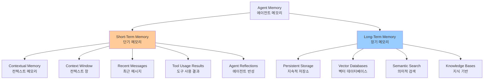
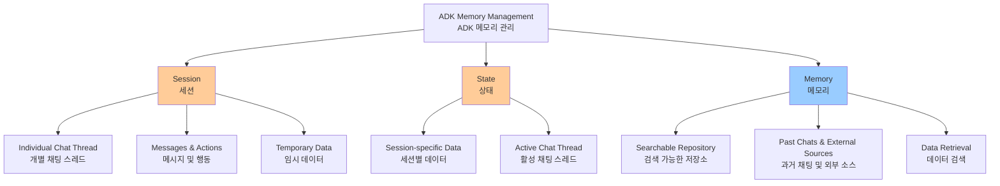
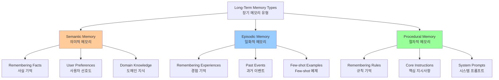
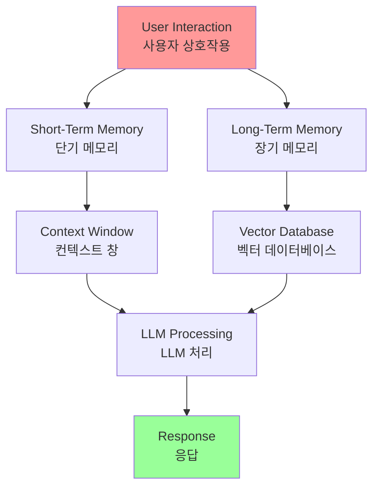
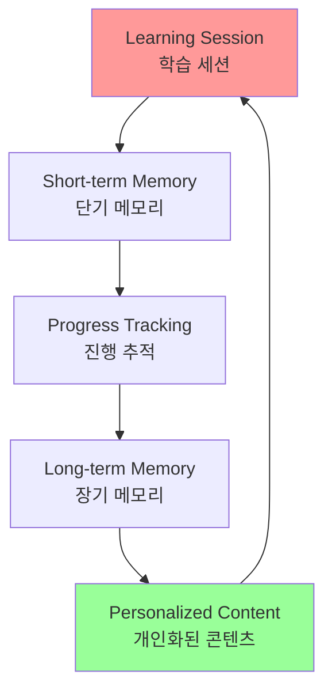

# Chapter 8: Memory Management

## 개요

Effective memory management is crucial for intelligent agents to maintain information. Like humans, agents require different types of memory to function efficiently. This chapter addresses memory management, specifically covering an agent's immediate (short-term) and persistent (long-term) memory requirements.

효과적인 메모리 관리는 지능형 에이전트가 정보를 유지하는 데 중요합니다. 에이전트는 인간과 마찬가지로 효율적으로 작동하기 위해 다양한 유형의 메모리가 필요합니다. 이 챕터는 메모리 관리에 대해 다루며, 특히 에이전트의 즉각적(단기) 및 지속적(장기) 메모리 요구사항을 다룹니다.

## 패턴 개요 (Pattern Overview)

### 메모리의 정의

In agent systems, memory refers to an agent's ability to retain and utilize information from past interactions, observations, and learning experiences. This capability allows agents to make informed decisions, maintain conversational context, and improve over time.

에이전트 시스템에서 메모리는 에이전트가 과거 상호작용, 관찰 및 학습 경험에서 정보를 유지하고 활용하는 능력을 의미합니다. 이 능력은 에이전트가 정보에 입각한 결정을 내리고, 대화 컨텍스트를 유지하며, 시간이 지남에 따라 개선할 수 있게 합니다.

Agent memory is generally categorized into two main types:

에이전트 메모리는 일반적으로 두 가지 주요 유형으로 분류됩니다.

### 메모리 유형



#### 1. 단기 메모리 (Short-Term Memory / Contextual Memory)

**Short-Term Memory (Contextual Memory)**: Similar to working memory, this holds information currently being processed or recently accessed. For agents using large language models (LLMs), short-term memory primarily exists within the context window. This window contains recent messages, agent replies, tool usage results, and agent reflections from the current interaction, all of which inform the LLM's subsequent responses and actions. The context window has a limited capacity, restricting the amount of recent information an agent can directly access.

**단기 메모리 (컨텍스트 메모리)**: 작업 메모리와 유사하게, 현재 처리 중이거나 최근에 접근한 정보를 보유합니다. 대형 언어 모델(LLMs)을 사용하는 에이전트의 경우, 단기 메모리는 주로 컨텍스트 창 내에 존재합니다. 이 창에는 최근 메시지, 에이전트 응답, 도구 사용 결과, 현재 상호작용의 에이전트 반성이 포함되어 LLM의 후속 응답과 행동을 알립니다. 컨텍스트 창은 제한된 용량을 가지며, 에이전트가 직접 접근할 수 있는 최근 정보의 양을 제한합니다.

Efficient short-term memory management involves keeping the most relevant information within this limited space, possibly through techniques like summarizing older conversation segments or emphasizing key details. The advent of models with 'long context' windows simply expands the size of this short-term memory, allowing more information to be held within a single interaction. However, this context is still ephemeral and is lost once the session concludes, and it can be costly and inefficient to process every time. Consequently, agents require separate memory types to achieve true persistence, recall information from past interactions, and build a lasting knowledge base.

효율적인 단기 메모리 관리에는 제한된 공간 내에서 가장 관련성 있는 정보를 유지하는 것이 포함되며, 오래된 대화 세그먼트를 요약하거나 주요 세부 사항을 강조하는 기술을 통해 달성할 수 있습니다. '긴 컨텍스트' 창을 가진 모델의 출현은 단순히 이 단기 메모리의 크기를 확장하여 단일 상호작용 내에서 더 많은 정보를 보유할 수 있게 합니다. 그러나 이 컨텍스트는 여전히 일시적이며 세션이 종료되면 손실되고, 매번 처리하는 것은 비용이 많이 들고 비효율적일 수 있습니다. 결과적으로, 에이전트는 진정한 지속성을 달성하고, 과거 상호작용에서 정보를 회상하며, 지속적인 지식 기반을 구축하기 위해 별도의 메모리 유형이 필요합니다.

**특징**:
- 대형 언어 모델(LLMs)을 사용하는 에이전트의 경우, 단기 메모리는 주로 컨텍스트 창 내에 존재
- 이 창에는 최근 메시지, 에이전트 응답, 도구 사용 결과, 현재 상호작용의 에이전트 반성이 포함되어 LLM의 후속 응답과 행동을 알림
- 컨텍스트 창은 제한된 용량을 가지며, 에이전트가 직접 접근할 수 있는 최근 정보의 양을 제한

**효율적인 단기 메모리 관리**:
- 제한된 공간 내에서 가장 관련성 있는 정보를 유지
- 오래된 대화 세그먼트를 요약하거나 주요 세부 사항을 강조하는 기술을 통해 달성 가능

**장문 컨텍스트 모델**:
- '장문 컨텍스트' 창을 가진 모델의 출현은 단기 메모리의 크기를 단순히 확장
- 단일 상호작용 내에서 더 많은 정보를 보유할 수 있게 하지만, 이 컨텍스트는 여전히 일시적이며 세션이 종료되면 손실됨
- 매번 처리하는 것은 비용이 많이 들고 비효율적일 수 있음

#### 2. 장기 메모리 (Long-Term Memory / Persistent Memory)

**Long-Term Memory (Persistent Memory)**: This acts as a repository for information agents need to retain across various interactions, tasks, or extended periods, akin to long-term knowledge bases. Data is typically stored outside the agent's immediate processing environment, often in databases, knowledge graphs, or vector databases. In vector databases, information is converted into numerical vectors and stored, enabling agents to retrieve data based on semantic similarity rather than exact keyword matches, a process known as semantic search. When an agent needs information from long-term memory, it queries the external storage, retrieves relevant data, and integrates it into the short-term context for immediate use, thus combining prior knowledge with the current interaction.

**장기 메모리 (지속적 메모리)**: 이것은 다양한 상호작용, 작업 또는 장기간에 걸쳐 에이전트가 유지해야 하는 정보를 위한 저장소 역할을 하며, 장기 지식 기반과 유사합니다. 데이터는 일반적으로 에이전트의 즉각적인 처리 환경 외부에 저장되며, 종종 데이터베이스, 지식 그래프 또는 벡터 데이터베이스에 저장됩니다. 벡터 데이터베이스에서 정보는 수치 벡터로 변환되어 저장되며, 에이전트가 정확한 키워드 일치가 아닌 의미적 유사성을 기반으로 데이터를 검색할 수 있게 하며, 이는 의미적 검색으로 알려진 프로세스입니다. 에이전트가 장기 메모리에서 정보가 필요할 때, 외부 저장소를 쿼리하고 관련 데이터를 검색하여 즉시 사용을 위해 단기 컨텍스트에 통합함으로써 이전 지식을 현재 상호작용과 결합합니다.

에이전트가 다양한 상호작용, 작업 또는 장기간에 걸쳐 유지해야 하는 정보를 위한 저장소 역할을 합니다.

**특징**:
- 장기 지식 기반과 유사
- 데이터는 일반적으로 에이전트의 즉각적인 처리 환경 외부에 저장되며, 종종 데이터베이스, 지식 그래프 또는 벡터 데이터베이스에 저장됨

**벡터 데이터베이스**:
- 벡터 데이터베이스에서 정보는 수치 벡터로 변환되어 저장됨
- 에이전트가 정확한 키워드 일치가 아닌 의미적 유사성을 기반으로 데이터를 검색할 수 있게 함
- 이 프로세스는 의미적 검색(semantic search)으로 알려져 있음

**검색 프로세스**:
- 에이전트가 장기 메모리에서 정보가 필요할 때, 외부 저장소를 쿼리하고 관련 데이터를 검색한 다음 즉시 사용을 위해 단기 컨텍스트에 통합
- 이를 통해 이전 지식과 현재 상호작용을 결합

## 실용적 응용 및 사용 사례 (Practical Applications & Use Cases)

Memory management is vital for agents to track information and perform intelligently over time. This is essential for agents to surpass basic question-answering capabilities.

메모리 관리는 에이전트가 정보를 추적하고 시간이 지남에 따라 지능적으로 수행하는 데 필수적입니다. 이는 기본 질문 답변 능력을 넘어서는 에이전트에게 필수적입니다.

Applications include:

응용 분야는 다음과 같습니다.

### 1. 챗봇 및 대화형 AI

**Chatbots and Conversational AI**: Maintaining conversation flow relies on short-term memory. Chatbots require remembering prior user inputs to provide coherent responses. Long-term memory enables chatbots to recall user preferences, past issues, or prior discussions, offering personalized and continuous interactions.

**챗봇 및 대화형 AI**: 대화 흐름 유지는 단기 메모리에 의존합니다. 챗봇은 일관된 응답을 제공하기 위해 이전 사용자 입력을 기억해야 합니다. 장기 메모리는 챗봇이 사용자 선호도, 과거 문제 또는 이전 토론을 회상하여 개인화되고 지속적인 상호작용을 제공할 수 있게 합니다.

대화 흐름 유지는 단기 메모리에 의존합니다.

**단기 메모리**:
- 챗봇은 일관된 응답을 제공하기 위해 이전 사용자 입력을 기억해야 함

**장기 메모리**:
- 사용자 선호도, 과거 문제 또는 이전 토론을 기억할 수 있게 함
- 개인화되고 지속적인 상호작용 제공

### 2. 작업 지향 에이전트

**Task-Oriented Agents**: Agents managing multi-step tasks need short-term memory to track previous steps, current progress, and overall goals. This information might reside in the task's context or temporary storage. Long-term memory is crucial for accessing specific user-related data not in the immediate context.

**작업 지향 에이전트**: 다단계 작업을 관리하는 에이전트는 이전 단계, 현재 진행 상황 및 전체 목표를 추적하기 위해 단기 메모리가 필요합니다. 이 정보는 작업의 컨텍스트나 임시 저장소에 있을 수 있습니다. 장기 메모리는 즉각적인 컨텍스트에 없는 특정 사용자 관련 데이터에 접근하는 데 중요합니다.

다단계 작업을 관리하는 에이전트는 단기 메모리가 필요합니다.

**단기 메모리**:
- 이전 단계, 현재 진행 상황 및 전체 목표를 추적
- 이 정보는 작업의 컨텍스트나 임시 저장소에 있을 수 있음

**장기 메모리**:
- 즉각적인 컨텍스트에 없는 특정 사용자 관련 데이터에 접근하는 데 중요

### 3. 개인화된 경험

**Personalized Experiences**: Agents offering tailored interactions utilize long-term memory to store and retrieve user preferences, past behaviors, and personal information. This allows agents to adapt their responses and suggestions.

**개인화된 경험**: 맞춤형 상호작용을 제공하는 에이전트는 장기 메모리를 활용하여 사용자 선호도, 과거 행동 및 개인 정보를 저장하고 검색합니다. 이를 통해 에이전트가 응답과 제안을 조정할 수 있습니다.

맞춤형 상호작용을 제공하는 에이전트는 장기 메모리를 활용합니다.

**장기 메모리**:
- 사용자 선호도, 과거 행동 및 개인 정보를 저장하고 검색
- 에이전트가 응답과 제안을 적응시킬 수 있게 함

### 4. 학습 및 개선

**Learning and Improvement**: Agents can refine their performance by learning from past interactions. Successful strategies, mistakes, and new information are stored in long-term memory, facilitating future adaptations. Reinforcement learning agents store learned strategies or knowledge in this way.

**학습 및 개선**: 에이전트는 과거 상호작용으로부터 학습하여 성능을 개선할 수 있습니다. 성공적인 전략, 실수 및 새로운 정보는 장기 메모리에 저장되어 향후 적응을 용이하게 합니다. 강화 학습 에이전트는 이 방식으로 학습된 전략이나 지식을 저장합니다.

에이전트는 과거 상호작용으로부터 학습하여 성능을 개선할 수 있습니다.

**장기 메모리**:
- 성공적인 전략, 실수 및 새로운 정보를 저장
- 향후 적응을 용이하게 함
- 강화 학습 에이전트는 이러한 방식으로 학습된 전략이나 지식을 저장

### 5. 정보 검색 (RAG)

**Information Retrieval (RAG)**: Agents designed for answering questions access a knowledge base, their long-term memory, often implemented within Retrieval Augmented Generation (RAG). The agent retrieves relevant documents or data to inform its responses.

**정보 검색 (RAG)**: 질문에 답하도록 설계된 에이전트는 지식 기반인 장기 메모리에 접근하며, 이는 종종 Retrieval Augmented Generation (RAG) 내에서 구현됩니다. 에이전트는 관련 문서나 데이터를 검색하여 응답에 정보를 제공합니다.

질문에 답하도록 설계된 에이전트는 지식 기반에 접근합니다.

**장기 메모리**:
- 장기 메모리로 구현되며, 종종 Retrieval Augmented Generation (RAG) 내에서 구현됨
- 에이전트가 관련 문서나 데이터를 검색하여 응답을 알림

### 6. 자율 시스템

로봇이나 자율 주행 차량은 메모리가 필요합니다.

**메모리 요구사항**:
- 지도, 경로, 객체 위치 및 학습된 행동을 위한 메모리
- 즉각적인 주변 환경을 위한 단기 메모리와 일반적인 환경 지식을 위한 장기 메모리 포함

## 실습 코드 예제 (Hands-On Code Example)

### Google Agent Developer Kit (ADK)

Google Agent Developer Kit (ADK)는 컨텍스트와 메모리를 관리하기 위한 구조화된 방법을 제공하며, 실용적인 애플리케이션을 위한 구성 요소를 포함합니다.

#### 핵심 개념

ADK는 세 가지 핵심 개념과 관련 서비스를 통해 컨텍스트 관리를 단순화합니다:



#### 1. Session (세션)

개별 채팅 스레드를 추적하고 관리하는 Session 객체입니다.

**특징**:
- `google.adk.sessions.Session`으로 표현
- 특정 대화 스레드와 관련된 모든 데이터를 캡슐화
- 고유 식별자(id, app_name, user_id), Event 객체의 시간순 기록, 세션별 임시 데이터인 state, 마지막 업데이트 타임스탬프 포함

**SessionService**:
- 세션의 생명주기를 관리하는 책임
- 새 세션 시작, 이전 세션 재개, 세션 활동 기록(상태 업데이트 포함), 활성 세션 식별, 세션 데이터 제거 관리

**구현 예제**:
```python
from google.adk.sessions import InMemorySessionService

# 로컬 개발 및 테스트에 적합
# 애플리케이션 재시작 시 데이터 지속성이 필요하지 않은 경우
session_service = InMemorySessionService()
```

#### 2. State (상태)

세션 내에 저장된 데이터로, 해당 대화 스레드와 관련된 정보만 포함합니다.

**특징**:
- `session.state`로 접근
- 현재 활성 채팅 스레드에만 관련된 정보 포함
- 세션별 임시 데이터 저장

#### 3. Memory (메모리)

다양한 과거 채팅이나 외부 소스에서 나온 정보의 검색 가능한 저장소입니다.

**특징**:
- 즉각적인 대화를 넘어서는 데이터 검색을 위한 리소스
- MemoryService를 통해 관리
- 장기 지식 저장 및 검색

### LangChain 및 LangGraph

LangChain과 LangGraph에서 메모리는 지능적이고 자연스러운 대화형 애플리케이션을 만드는 데 중요한 구성 요소입니다.

#### 단기 메모리

스레드 범위로, 단일 세션이나 스레드 내에서 진행 중인 대화를 추적합니다.

**특징**:
- 즉각적인 컨텍스트를 제공하지만, 전체 기록은 LLM의 컨텍스트 창에 도전할 수 있음
- 오류나 성능 저하로 이어질 수 있음
- LangGraph는 에이전트 상태의 일부로 단기 메모리를 관리하며, 체크포인터를 통해 지속되어 스레드를 언제든지 재개할 수 있음

#### 장기 메모리

세션 간에 사용자별 또는 애플리케이션 수준 데이터를 저장합니다.

**특징**:
- 대화형 스레드 간에 공유됨
- 커스텀 "네임스페이스"에 저장되며 언제든지 모든 스레드에서 회상 가능
- LangGraph는 저장소를 제공하여 장기 메모리를 저장하고 회상할 수 있게 하여 에이전트가 무기한으로 지식을 유지할 수 있게 함

#### 메모리 관리 도구

LangChain은 수동 제어부터 체인 내 자동 통합까지 다양한 대화 기록 관리 도구를 제공합니다.

##### ChatMessageHistory: 수동 메모리 관리

공식 체인 외부에서 대화 기록을 직접 제어하려는 경우 ChatMessageHistory 클래스가 이상적입니다.

```python
from langchain.memory import ChatMessageHistory

# 기록 객체 초기화
history = ChatMessageHistory()

# 사용자 및 AI 메시지 추가
history.add_user_message("I'm heading to New York next week.")
history.add_ai_message("Great! It's a fantastic city.")

# 메시지 목록 접근
print(history.messages)
```

##### ConversationBufferMemory: 체인용 자동 메모리

체인에 메모리를 직접 통합하려는 경우 ConversationBufferMemory가 일반적인 선택입니다.

**주요 매개변수**:
- `memory_key`: 프롬프트에서 채팅 기록을 보유할 변수 이름을 지정하는 문자열 (기본값: "history")
- `return_messages`: 기록 형식을 결정하는 부울
  - `False` (기본값): 단일 포맷된 문자열 반환 (표준 LLM에 이상적)
  - `True`: 메시지 객체 목록 반환 (채팅 모델에 권장)

**예제**:
```python
from langchain.memory import ConversationBufferMemory

# 메모리 초기화
memory = ConversationBufferMemory()

# 대화 턴 저장
memory.save_context({"input": "What's the weather like?"}, {"output": "It's sunny today."})

# 메모리를 문자열로 로드
print(memory.load_memory_variables({}))
```

**LLMChain에 통합**:
```python
from langchain_openai import OpenAI
from langchain.chains import LLMChain
from langchain.prompts import PromptTemplate
from langchain.memory import ConversationBufferMemory

# 1. LLM 및 프롬프트 정의
llm = OpenAI(temperature=0)
template = """You are a helpful travel agent.
Previous conversation:
{history}
New question: {question}
Response:"""
prompt = PromptTemplate.from_template(template)

# 2. 메모리 구성
# memory_key "history"는 프롬프트의 변수와 일치
memory = ConversationBufferMemory(memory_key="history")

# 3. 체인 구축
conversation = LLMChain(llm=llm, prompt=prompt, memory=memory)

# 4. 대화 실행
response = conversation.predict(question="I want to book a flight.")
print(response)
response = conversation.predict(question="My name is Sam, by the way.")
print(response)
response = conversation.predict(question="What was my name again?")
print(response)
```

**채팅 모델용 구조화된 메시지**:
```python
from langchain_openai import ChatOpenAI
from langchain.chains import LLMChain
from langchain.memory import ConversationBufferMemory
from langchain_core.prompts import (
    ChatPromptTemplate,
    MessagesPlaceholder,
    SystemMessagePromptTemplate,
    HumanMessagePromptTemplate,
)

# 1. 채팅 모델 및 프롬프트 정의
llm = ChatOpenAI()
prompt = ChatPromptTemplate(
    messages=[
        SystemMessagePromptTemplate.from_template("You are a friendly assistant."),
        MessagesPlaceholder(variable_name="chat_history"),
        HumanMessagePromptTemplate.from_template("{question}")
    ]
)

# 2. 메모리 구성
# return_messages=True는 채팅 모델에 필수
memory = ConversationBufferMemory(memory_key="chat_history", return_messages=True)

# 3. 체인 구축
conversation = LLMChain(llm=llm, prompt=prompt, memory=memory)

# 4. 대화 실행
response = conversation.predict(question="Hi, I'm Jane.")
print(response)
response = conversation.predict(question="Do you remember my name?")
print(response)
```

#### 장기 메모리 유형

장기 메모리는 다른 대화 간에 정보를 유지하여 더 깊은 수준의 컨텍스트와 개인화를 제공합니다. 인간의 메모리와 유사하게 세 가지 유형으로 나눌 수 있습니다:



##### 1. 의미적 메모리 (Semantic Memory): 사실 기억

특정 사실과 개념을 유지하는 것을 포함합니다.

**특징**:
- 사용자 선호도나 도메인 지식과 같은 정보
- 에이전트의 응답을 기반으로 하여 더 개인화되고 관련성 있는 상호작용으로 이어짐
- 지속적으로 업데이트되는 사용자 "프로필" (JSON 문서) 또는 개별 사실 문서의 "컬렉션"으로 관리될 수 있음

##### 2. 일화적 메모리 (Episodic Memory): 경험 기억

과거 이벤트나 행동을 회상하는 것을 포함합니다.

**특징**:
- AI 에이전트의 경우, 일화적 메모리는 종종 작업을 수행하는 방법을 기억하는 데 사용됨
- 실제로는 few-shot 예제 프롬프팅을 통해 자주 구현되며, 에이전트가 과거 성공적인 상호작용 시퀀스로부터 학습하여 작업을 올바르게 수행

##### 3. 절차적 메모리 (Procedural Memory): 규칙 기억

작업을 수행하는 방법에 대한 메모리입니다.

**특징**:
- 에이전트의 핵심 지시사항과 행동으로, 종종 시스템 프롬프트에 포함됨
- 에이전트가 자신의 프롬프트를 수정하여 적응하고 개선하는 것이 일반적
- 효과적인 기술은 "Reflection"으로, 에이전트가 현재 지시사항과 최근 상호작용으로 프롬프트되고 자신의 지시사항을 정제하도록 요청받음

**반성을 통한 절차적 메모리 업데이트 예제**:
```python
# 에이전트의 지시사항을 업데이트하는 노드
def update_instructions(state: State, store: BaseStore):
    namespace = ("instructions",)
    # 저장소에서 현재 지시사항 가져오기
    current_instructions = store.search(namespace)[0]
    
    # LLM에게 대화를 반성하고 새로운 개선된 지시사항을 생성하도록 요청하는 프롬프트 생성
    prompt = prompt_template.format(
        instructions=current_instructions.value["instructions"],
        conversation=state["messages"]
    )
    
    # LLM에서 새로운 지시사항 가져오기
    output = llm.invoke(prompt)
    new_instructions = output['new_instructions']
    
    # 업데이트된 지시사항을 저장소에 다시 저장
    store.put(("agent_instructions",), "agent_a", {"instructions": new_instructions})

# 지시사항을 사용하여 응답을 생성하는 노드
def call_model(state: State, store: BaseStore):
    namespace = ("agent_instructions",)
    # 저장소에서 최신 지시사항 검색
    instructions = store.get(namespace, key="agent_a")[0]
    
    # 검색된 지시사항을 사용하여 프롬프트 포맷
    prompt = prompt_template.format(instructions=instructions.value["instructions"])
    # ... 애플리케이션 로직 계속
```

#### LangGraph Store 사용

LangGraph는 저장소에 장기 메모리를 JSON 문서로 저장합니다. 각 메모리는 커스텀 네임스페이스(폴더와 같음)와 고유 키(파일명과 같음) 아래에 구성됩니다.

**예제**:
```python
from langgraph.store.memory import InMemoryStore

# 실제 임베딩 함수를 위한 플레이스홀더
def embed(texts: list[str]) -> list[list[float]]:
    # 실제 애플리케이션에서는 적절한 임베딩 모델 사용
    return [[1.0, 2.0] for _ in texts]

# 인메모리 저장소 초기화. 프로덕션에서는 데이터베이스 기반 저장소 사용
store = InMemoryStore(index={"embed": embed, "dims": 2})

# 특정 사용자 및 애플리케이션 컨텍스트를 위한 네임스페이스 정의
user_id = "my-user"
application_context = "chitchat"
namespace = (user_id, application_context)

# 1. 저장소에 메모리 넣기
store.put(
    namespace,
    "a-memory",  # 이 메모리의 키
    {
        "rules": [
            "User likes short, direct language",
            "User only speaks English & python",
        ],
        "my-key": "my-value",
    },
)

# 2. 네임스페이스와 키로 메모리 가져오기
item = store.get(namespace, "a-memory")
print("Retrieved Item:", item)

# 3. 네임스페이스 내에서 메모리 검색, 콘텐츠로 필터링하고
# 쿼리에 대한 벡터 유사도로 정렬
items = store.search(
    namespace,
    filter={"my-key": "my-value"},
    query="language preferences"
)
print("Search Results:", items)
```

### Vertex Memory Bank

Memory Bank는 Vertex AI Agent Engine의 관리형 서비스로, 에이전트에 지속적인 장기 메모리를 제공합니다.

#### 주요 특징

**자동 분석**:
- Gemini 모델을 사용하여 대화 기록을 비동기적으로 분석하여 주요 사실과 사용자 선호도를 추출

**지속적 저장**:
- 사용자 ID와 같은 정의된 범위로 정보를 지속적으로 저장
- 새 데이터를 통합하고 모순을 해결하도록 지능적으로 업데이트

**검색**:
- 새 세션을 시작할 때 에이전트는 전체 데이터 회상 또는 임베딩을 사용한 유사도 검색을 통해 관련 메모리를 검색
- 이 프로세스를 통해 에이전트가 세션 간 연속성을 유지하고 회상된 정보를 기반으로 응답을 개인화할 수 있음

#### 사용 예제

```python
from google.adk.memory import VertexAiMemoryBankService

agent_engine_id = agent_engine.api_resource.name.split("/")[-1]
memory_service = VertexAiMemoryBankService(
    project="PROJECT_ID",
    location="LOCATION",
    agent_engine_id=agent_engine_id
)

session = await session_service.get_session(
    app_name=app_name,
    user_id="USER_ID",
    session_id=session.id
)
await memory_service.add_session_to_memory(session)
```

#### 통합

Memory Bank는 Google ADK와 원활하게 통합되어 즉시 사용 가능한 경험을 제공합니다. LangGraph 및 CrewAI와 같은 다른 에이전트 프레임워크의 사용자를 위해 Memory Bank는 직접 API 호출을 통한 지원도 제공합니다.

## 한눈에 보기 (At a Glance)

### 무엇 (What)

에이전트 시스템은 복잡한 작업을 수행하고 일관된 경험을 제공하기 위해 과거 상호작용의 정보를 기억해야 합니다. 메모리 메커니즘이 없으면 에이전트는 상태가 없으며, 대화 컨텍스트를 유지하거나 경험으로부터 학습하거나 사용자를 위해 응답을 개인화할 수 없습니다.

### 왜 (Why)

표준화된 솔루션은 단기 및 장기 저장소를 구분하는 이중 구성 요소 메모리 시스템을 구현하는 것입니다. 단기, 컨텍스트 메모리는 대화 흐름을 유지하기 위해 LLM의 컨텍스트 창 내에 최근 상호작용 데이터를 보유합니다. 지속되어야 하는 정보의 경우, 장기 메모리 솔루션은 효율적인 의미적 검색을 위해 외부 데이터베이스, 종종 벡터 저장소를 사용합니다.

### 경험 법칙 (Rule of Thumb)

에이전트가 단일 질문에 답하는 것 이상을 수행해야 하는 경우 이 패턴을 사용하세요. 대화 전반에 걸쳐 컨텍스트를 유지하거나, 다단계 작업에서 진행 상황을 추적하거나, 사용자 선호도와 기록을 회상하여 상호작용을 개인화해야 하는 에이전트에게 필수적입니다.

### 시각적 요약



## 핵심 요약 (Key Takeaways)

1. **메모리는 에이전트가 사물을 추적하고, 학습하며, 상호작용을 개인화하는 데 매우 중요합니다**

2. **대화형 AI는 단일 채팅 내의 즉각적인 컨텍스트를 위한 단기 메모리와 여러 세션에 걸친 지속적인 지식을 위한 장기 메모리에 의존합니다**

3. **단기 메모리(즉각적인 것)는 일시적이며, 종종 LLM의 컨텍스트 창이나 프레임워크가 컨텍스트를 전달하는 방식에 의해 제한됩니다**

4. **장기 메모리(지속되는 것)는 벡터 데이터베이스와 같은 외부 저장소를 사용하여 다른 채팅 간에 정보를 저장하며 검색을 통해 접근됩니다**

5. **ADK와 같은 프레임워크는 Session(채팅 스레드), State(임시 채팅 데이터), MemoryService(검색 가능한 장기 지식)와 같은 특정 부분을 가져 메모리를 관리합니다**

6. **ADK의 SessionService는 기록(이벤트)과 임시 데이터(상태)를 포함하여 채팅 세션의 전체 생명주기를 처리합니다**

7. **장기 메모리는 의미적 메모리(사실), 일화적 메모리(경험), 절차적 메모리(규칙)로 분류할 수 있습니다**

## 결론

메모리 관리는 지능형 에이전트 시스템의 핵심 구성 요소입니다. 단기 및 장기 메모리를 구분하고 효과적으로 관리함으로써, 에이전트는 대화 컨텍스트를 유지하고, 경험으로부터 학습하며, 사용자 선호도를 기억하고, 시간이 지남에 따라 개선할 수 있습니다.

Google ADK와 LangChain/LangGraph와 같은 프레임워크는 메모리 관리를 위한 강력한 도구와 추상화를 제공하여 개발자가 복잡하고 상태 저장이며 컨텍스트 인식 에이전트를 구축할 수 있게 합니다.

Vertex Memory Bank와 같은 관리형 서비스는 자동 분석 및 지속적 저장을 통해 장기 메모리 관리를 더욱 단순화하여, 에이전트가 세션 간 연속성을 유지하고 개인화된 경험을 제공할 수 있게 합니다.

## 이론적 배경 및 학술적 근거 (Theoretical Background and Academic Foundation)

### 인지 심리학: 작업 기억 모델

Baddeley & Hitch(1974)의 작업 기억 모델은 단기 메모리의 구조를 설명합니다.

**작업 기억 구성 요소**:
- **음성 루프 (Phonological Loop)**: 언어 정보 처리
- **시공간 스케치패드 (Visuospatial Sketchpad)**: 시각-공간 정보 처리
- **중앙 집행기 (Central Executive)**: 주의력 조절 및 조정
- **에피소드 버퍼 (Episodic Buffer)**: 다양한 정보 소스 통합

**에이전트 시스템에서의 적용**:
- 컨텍스트 창은 작업 기억과 유사
- 여러 정보 소스(텍스트, 도구 출력, 검색 결과) 통합
- 중앙 집행기는 LLM의 추론 능력과 유사

### 장기 기억 이론

Tulving(1972)는 장기 기억을 세 가지 유형으로 분류합니다:

1. **에피소드 기억 (Episodic Memory)**: 특정 시간과 장소의 경험
2. **의미 기억 (Semantic Memory)**: 사실과 개념에 대한 지식
3. **절차 기억 (Procedural Memory)**: 기술과 절차에 대한 지식

**에이전트 메모리 시스템에서의 구현**:
- **에피소드 메모리**: 세션별 상호작용 기록
- **의미 메모리**: 벡터 데이터베이스의 지식 기반
- **절차 메모리**: 도구 사용 패턴 및 워크플로우

### 망각 이론 (Forgetting Theory)

Ebbinghaus(1885)의 망각 곡선은 시간에 따른 정보 손실을 설명합니다.

**망각 곡선 특성**:
- 초기에는 빠른 정보 손실
- 시간이 지나면서 손실 속도 감소
- 반복 학습으로 망각 속도 감소

**에이전트 시스템에서의 적용**:
- 오래된 정보의 우선순위 감소
- 중요 정보의 주기적 강화
- 관련성 기반 정보 보존

### 정보 검색 이론

벡터 검색은 정보 검색 이론에 기반합니다.

**TF-IDF (Term Frequency-Inverse Document Frequency)**:
- 문서 내 단어 빈도와 전체 문서 집합에서의 역빈도
- 중요 단어 식별

**의미적 검색**:
- 단어 의미를 벡터로 표현
- 코사인 유사도로 관련성 측정
- 키워드 매칭을 넘어 의미적 유사성 파악

## 성능 최적화 기법 (Performance Optimization Techniques)

### 1. 메모리 압축 및 요약

컨텍스트 창을 효율적으로 사용하기 위한 전략:

```python
def compress_memory(conversation_history: List[Message], max_tokens: int) -> List[Message]:
    """대화 기록 압축"""
    current_tokens = count_tokens(conversation_history)
    
    if current_tokens <= max_tokens:
        return conversation_history
    
    # 오래된 메시지 요약
    old_messages = conversation_history[:-10]  # 최근 10개 제외
    summary = summarize_messages(old_messages)
    
    # 요약과 최근 메시지 결합
    compressed = [summary] + conversation_history[-10:]
    return compressed
```

### 2. 적응형 메모리 검색

쿼리와 관련성에 따라 검색 범위 조정:

```python
def adaptive_memory_search(query: str, memory_service: MemoryService) -> List[Memory]:
    """적응형 메모리 검색"""
    query_embedding = embed(query)
    
    # 초기 검색 (넓은 범위)
    candidates = memory_service.search(query_embedding, top_k=50)
    
    # 관련성 재계산
    scored = [(m, cosine_similarity(query_embedding, m.embedding)) 
              for m in candidates]
    
    # 상위 관련 메모리만 반환
    top_memories = sorted(scored, key=lambda x: x[1], reverse=True)[:10]
    return [m for m, _ in top_memories]
```

### 3. 메모리 우선순위 관리

중요한 메모리를 우선적으로 보존:

```python
class PriorityMemoryManager:
    def __init__(self):
        self.memory_priorities = {}
    
    def update_priority(self, memory_id: str, importance: float):
        """메모리 우선순위 업데이트"""
        self.memory_priorities[memory_id] = importance
    
    def evict_low_priority(self, max_size: int):
        """낮은 우선순위 메모리 제거"""
        sorted_memories = sorted(
            self.memory_priorities.items(),
            key=lambda x: x[1]
        )
        
        # 낮은 우선순위 메모리 제거
        to_evict = sorted_memories[:-max_size]
        for memory_id, _ in to_evict:
            self.delete_memory(memory_id)
```

### 4. 메모리 인덱싱 최적화

빠른 검색을 위한 인덱스 구조:

```python
class OptimizedMemoryIndex:
    def __init__(self):
        self.vector_index = AnnoyIndex(embedding_dim, 'angular')
        self.metadata_index = {}  # 메타데이터 인덱스
    
    def build_index(self, memories: List[Memory]):
        """메모리 인덱스 구축"""
        for i, memory in enumerate(memories):
            self.vector_index.add_item(i, memory.embedding)
            self.metadata_index[i] = {
                'timestamp': memory.timestamp,
                'importance': memory.importance,
                'tags': memory.tags
            }
        
        self.vector_index.build(10)  # 10개의 트리
    
    def search(self, query_embedding, top_k=10):
        """빠른 검색"""
        indices = self.vector_index.get_nns_by_vector(
            query_embedding, top_k
        )
        return [self.metadata_index[i] for i in indices]
```

## 트레이드오프 및 한계점 (Trade-offs and Limitations)

### 메모리 관리의 장점

1. **컨텍스트 유지**: 대화 연속성 보장
2. **개인화**: 사용자 선호도 기억
3. **학습**: 경험으로부터 개선
4. **효율성**: 관련 정보만 검색

### 메모리 관리의 한계

1. **저장 비용**: 장기 메모리 저장 비용
2. **검색 지연**: 대규모 메모리에서 검색 시간
3. **프라이버시**: 개인 정보 보호 문제
4. **일관성**: 메모리 간 일관성 유지 어려움

### 완화 전략

1. **계층적 저장**: 중요도에 따른 저장 전략
2. **비동기 검색**: 백그라운드에서 검색 수행
3. **암호화**: 민감한 정보 암호화
4. **버전 관리**: 메모리 버전 추적 및 관리

## 관련 패턴과의 비교 (Comparison with Related Patterns)

### Memory Management vs. Stateless Systems

| 특성 | Stateless | Memory Management |
|------|----------|-------------------|
| 컨텍스트 | 없음 | 있음 |
| 개인화 | 불가능 | 가능 |
| 복잡도 | 낮음 | 높음 |
| 확장성 | 높음 | 중간 |

### Short-term vs. Long-term Memory

단기와 장기 메모리는 서로 보완적:

- **Short-term**: 빠른 접근, 제한된 용량
- **Long-term**: 느린 접근, 큰 용량
- **통합**: 단기 메모리에서 장기로 전환

## 실무 적용 사례 확장 (Extended Practical Applications)

### 1. 개인화된 학습 시스템

학습자의 진행 상황과 선호도를 기억:



### 2. 지능형 고객 관계 관리

고객 상호작용 기록 및 선호도 관리:

- **에피소드 메모리**: 과거 상호작용 기록
- **의미 메모리**: 고객 프로필 및 선호도
- **절차 메모리**: 효과적인 상호작용 패턴

### 3. 지속적 대화 시스템

장기간 대화 컨텍스트 유지:

```python
class PersistentConversationAgent:
    def __init__(self, memory_service: MemoryService):
        self.memory_service = memory_service
        self.session_memory = {}  # 단기 메모리
    
    async def process_message(self, user_id: str, message: str):
        """메시지 처리 및 메모리 관리"""
        # 장기 메모리에서 관련 정보 검색
        relevant_memories = await self.memory_service.search(
            user_id=user_id,
            query=message,
            top_k=5
        )
        
        # 단기 메모리에 추가
        self.session_memory[user_id].append({
            'role': 'user',
            'content': message
        })
        
        # 컨텍스트 구성
        context = self.build_context(
            relevant_memories,
            self.session_memory[user_id]
        )
        
        # 응답 생성
        response = await self.generate_response(context)
        
        # 장기 메모리에 저장
        await self.memory_service.add(
            user_id=user_id,
            memory={
                'user_message': message,
                'agent_response': response,
                'timestamp': datetime.now()
            }
        )
        
        return response
```

## 참고 자료 (References)

### 학술 논문

1. Baddeley, A. D., & Hitch, G. (1974). "Working memory." *Psychology of Learning and Motivation*, 8, 47-89.

2. Tulving, E. (1972). "Episodic and semantic memory." *Organization of Memory*, 381-403.

3. Ebbinghaus, H. (1885). *Über das Gedächtnis: Untersuchungen zur experimentellen Psychologie*. Duncker & Humblot.

4. Atkinson, R. C., & Shiffrin, R. M. (1968). "Human memory: A proposed system and its control processes." *Psychology of Learning and Motivation*, 2, 89-195.

5. Salton, G., & McGill, M. J. (1986). *Introduction to Modern Information Retrieval*. McGraw-Hill.

6. Mikolov, T., et al. (2013). "Efficient estimation of word representations in vector space." *arXiv preprint arXiv:1301.3781*.

### 프레임워크 및 도구 문서

1. Google ADK Memory Documentation:
   https://google.github.io/adk-docs/memory/

2. LangChain Memory Documentation:
   https://python.langchain.com/docs/modules/memory/

3. LangGraph Store Documentation:
   https://langchain-ai.github.io/langgraph/how-tos/memory/

4. Vertex Memory Bank:
   https://cloud.google.com/vertex-ai/docs/agent-builder/memory-bank

### 추가 학습 자료

5. "Memory: From Mind to Molecules" by Larry R. Squire & Eric R. Kandel

6. "Information Retrieval: Algorithms and Heuristics" by David A. Grossman & Ophir Frieder

7. "Vector Space Models of Semantics" - Stanford NLP Course

---

**이전 챕터**: [Chapter 7: Multi-Agent](chapter_07_Multi-Agent.md)  
**다음 챕터**: [Chapter 9: Learning and Adaptation](chapter_09_Learning_and_Adaptation.md)

