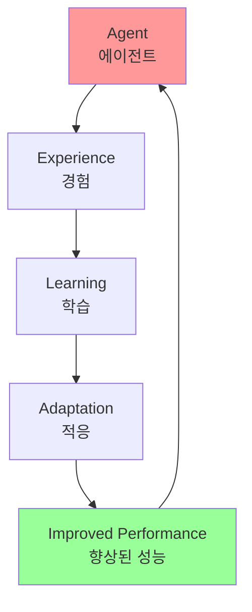
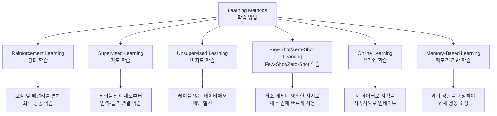
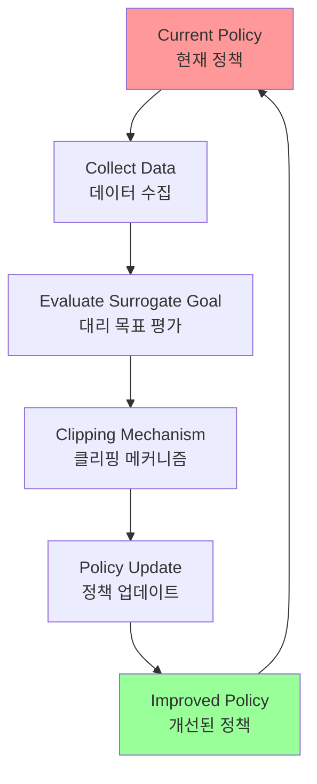
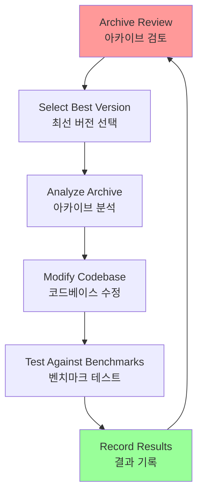
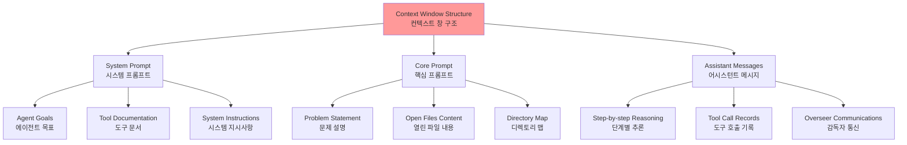
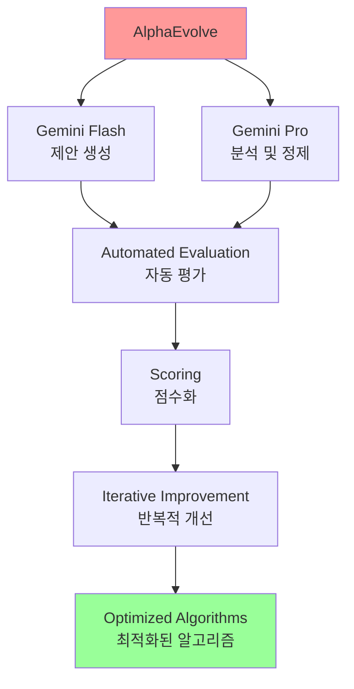
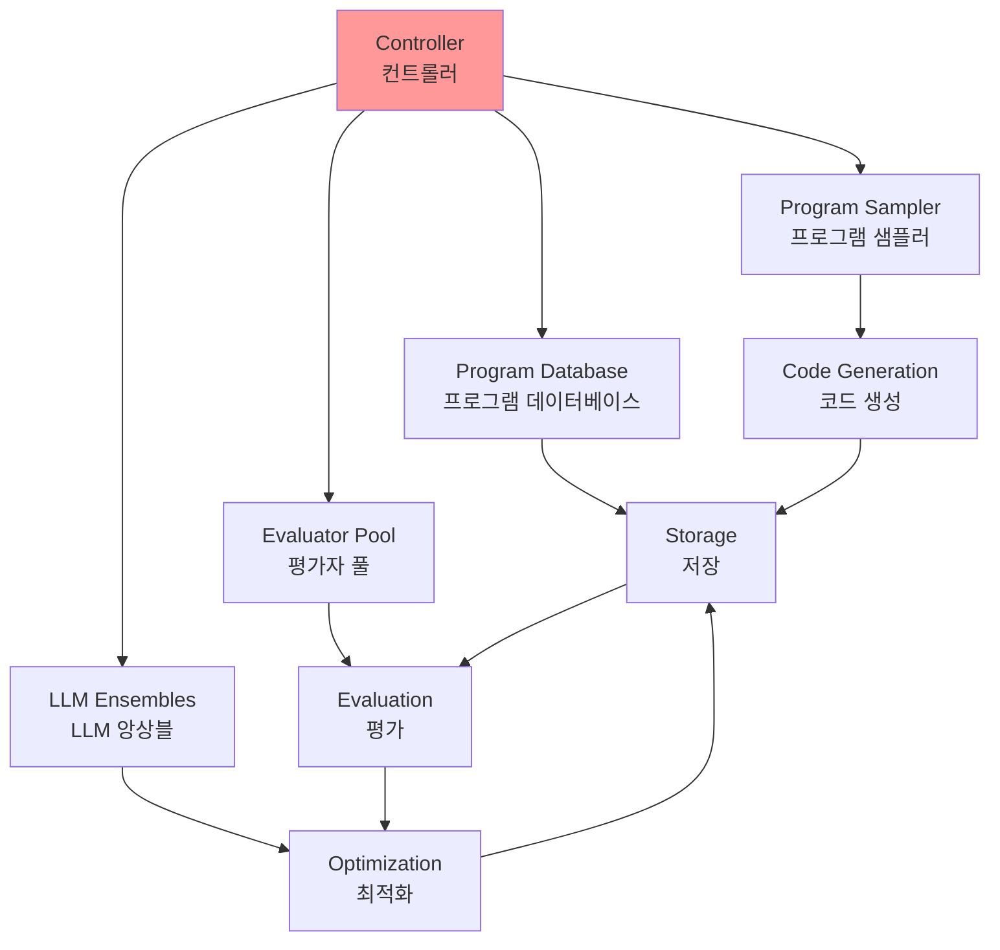
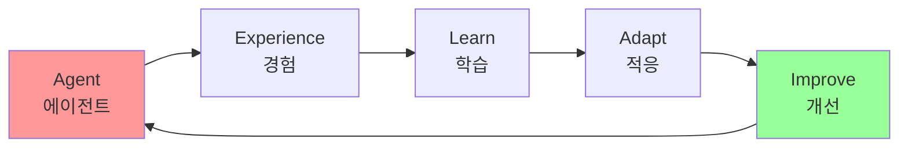
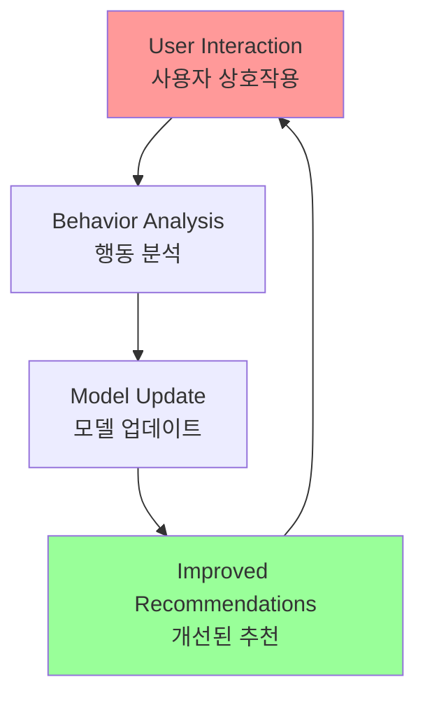

# Chapter 9: Learning and Adaptation

## 개요

Learning and adaptation play crucial roles in enhancing the capabilities of AI agents. These processes enable agents to evolve beyond their predefined parameters and improve autonomously through experience and environmental interactions. By learning and adapting, agents can effectively handle new situations and optimize their performance without constant manual intervention.

학습과 적응은 인공지능 에이전트의 능력을 향상시키는 데 중요한 역할을 합니다. 이러한 프로세스는 에이전트가 사전 정의된 매개변수를 넘어서 진화할 수 있게 하며, 경험과 환경 상호작용을 통해 자율적으로 개선할 수 있게 합니다. 학습하고 적응함으로써, 에이전트는 새로운 상황을 효과적으로 관리하고 지속적인 수동 개입 없이 성능을 최적화할 수 있습니다.

## 패턴 개요 (Pattern Overview)

### 핵심 개념

Agents learn and adapt by changing their thinking, behavior, or knowledge based on new experiences and data. This allows agents to evolve from simply following instructions to becoming smarter over time.

에이전트는 새로운 경험과 데이터를 기반으로 사고, 행동 또는 지식을 변경함으로써 학습하고 적응합니다. 이를 통해 에이전트는 단순히 지시를 따르는 것에서 시간이 지남에 따라 더 똑똑해지는 것으로 진화할 수 있습니다.



### 학습 방법

Agents can learn through various methods:

에이전트는 다양한 방법으로 학습할 수 있습니다:



#### 1. 강화 학습 (Reinforcement Learning)

**Reinforcement Learning**: Agents try actions and receive rewards for positive outcomes and penalties for negative ones, learning optimal behavior in changing situations.

**강화 학습**: 에이전트가 행동을 시도하고 긍정적인 결과에 대해 보상을 받고 부정적인 결과에 대해 패널티를 받아 변화하는 상황에서 최적의 행동을 학습합니다.

**적용 분야**: 로봇을 제어하거나 게임을 플레이하는 에이전트에 유용

#### 2. 지도 학습 (Supervised Learning)

**Supervised Learning**: Agents learn from labeled examples to connect inputs to desired outputs.

**지도 학습**: 에이전트가 레이블된 예제로부터 학습하여 입력을 원하는 출력에 연결합니다.

**적용 분야**: 의사결정 및 패턴 인식을 가능하게 하며, 이메일을 분류하거나 트렌드를 예측하는 에이전트에 이상적

#### 3. 비지도 학습 (Unsupervised Learning)

**Unsupervised Learning**: Agents discover hidden connections and patterns in unlabeled data.

**비지도 학습**: 에이전트가 레이블 없는 데이터에서 숨겨진 연결과 패턴을 발견합니다.

**적용 분야**: 통찰력, 조직화 및 환경의 정신적 지도 생성에 도움이 되며, 특정 지도 없이 데이터를 탐색하는 에이전트에 유용

#### 4. Few-Shot/Zero-Shot Learning (LLM 기반 에이전트)

**Few-Shot/Zero-Shot Learning (LLM-based Agents)**: Agents leveraging LLMs can quickly adapt to new tasks with minimal examples or clear instructions.

**Few-Shot/Zero-Shot 학습 (LLM 기반 에이전트)**: LLM을 활용하는 에이전트는 최소한의 예제나 명확한 지시로 새 작업에 빠르게 적응할 수 있습니다.

**적용 분야**: 새 명령이나 상황에 빠르게 응답할 수 있게 함

#### 5. 온라인 학습 (Online Learning)

**Online Learning**: Agents continuously update their knowledge with new data.

**온라인 학습**: 에이전트가 새 데이터로 지식을 지속적으로 업데이트합니다.

**적용 분야**: 동적 환경에서 실시간 반응 및 지속적인 적응에 필수적이며, 연속적인 데이터 스트림을 처리하는 에이전트에 중요

#### 6. 메모리 기반 학습 (Memory-Based Learning)

**Memory-Based Learning**: Agents recall past experiences to adjust current behavior in similar situations.

**메모리 기반 학습**: 에이전트가 과거 경험을 회상하여 유사한 상황에서 현재 행동을 조정합니다.

**적용 분야**: 컨텍스트 인식 및 의사결정 향상에 효과적이며, 메모리 회상 기능을 가진 에이전트에 유용

### 적응 (Adaptation)

에이전트는 학습을 기반으로 전략, 이해 또는 목표를 변경함으로써 적응합니다. 이는 예측할 수 없고, 변화하거나 새로운 환경의 에이전트에게 필수적입니다.

### Proximal Policy Optimization (PPO)

PPO는 로봇의 관절이나 게임의 캐릭터를 제어하는 것과 같이 연속적인 행동 범위를 가진 환경에서 에이전트를 훈련시키는 데 사용되는 강화 학습 알고리즘입니다.

#### 핵심 아이디어

PPO의 핵심 아이디어는 에이전트의 정책(의사결정 전략)에 작고 신중한 업데이트를 만드는 것입니다. 성능이 붕괴될 수 있는 급격한 변경을 피합니다.

#### 작동 방식



**단계**:
1. **데이터 수집**: 에이전트가 현재 정책을 사용하여 환경과 상호작용하고 경험 배치(상태, 행동, 보상)를 수집
2. **대리 목표 평가**: PPO는 잠재적 정책 업데이트가 예상 보상을 어떻게 변경할지 계산하지만, 단순히 이 보상을 최대화하는 대신 특별한 "클리핑된" 목적 함수를 사용
3. **클리핑 메커니즘**: 이것이 PPO의 안정성의 핵심입니다. 현재 정책 주변에 "신뢰 영역" 또는 안전 지대를 생성합니다. 알고리즘은 현재 전략과 너무 다른 업데이트를 만드는 것이 방지됩니다

**결과**: PPO는 성능 개선과 알려진 작동 전략에 가까이 유지하는 것 사이의 균형을 맞춥니다. 이는 훈련 중 재앙적 실패를 방지하고 더 안정적인 학습으로 이어집니다.

### Direct Preference Optimization (DPO)

DPO는 대형 언어 모델(LLMs)을 인간 선호도와 정렬하도록 특별히 설계된 더 최근의 방법입니다.

#### PPO 접근 방식 (2단계 프로세스)

1. **보상 모델 훈련**: 사람들이 다른 LLM 응답을 평가하거나 비교하는 인간 피드백 데이터를 수집하여 별도의 AI 모델인 보상 모델을 훈련
2. **PPO로 파인튜닝**: LLM이 보상 모델로부터 가능한 최고 점수를 받는 응답을 생성하도록 PPO를 사용하여 LLM을 파인튜닝

**문제점**: 이 2단계 프로세스는 복잡하고 불안정할 수 있습니다. LLM이 나쁜 응답에 대해 높은 점수를 받기 위해 보상 모델을 "해킹"하는 방법을 찾을 수 있습니다.

#### DPO 접근 방식 (직접 프로세스)

DPO는 보상 모델을 완전히 건너뜁니다. 인간 선호도를 보상 점수로 변환한 다음 그 점수를 최적화하는 대신, DPO는 선호도 데이터를 직접 사용하여 LLM의 정책을 업데이트합니다.

**작동 원리**:
- 선호도 데이터를 최적 정책에 직접 연결하는 수학적 관계를 사용
- 본질적으로 모델에게 "선호되는 것과 같은 응답을 생성할 확률을 높이고, 비선호되는 것과 같은 응답을 생성할 확률을 낮추라"고 가르침

**결과**: DPO는 인간 선호도 데이터에서 언어 모델을 직접 최적화함으로써 정렬을 단순화합니다. 이는 별도의 보상 모델을 훈련하고 사용하는 복잡성과 잠재적 불안정성을 피하여 정렬 프로세스를 더 효율적이고 견고하게 만듭니다.

## 실용적 응용 및 사용 사례 (Practical Applications & Use Cases)

적응형 에이전트는 경험적 데이터에 의해 구동되는 반복적 업데이트를 통해 가변 환경에서 향상된 성능을 보여줍니다.

### 1. 개인화된 어시스턴트 에이전트

개별 사용자 행동의 종단 분석을 통해 상호작용 프로토콜을 정제하여 고도로 최적화된 응답 생성을 보장합니다.

### 2. 트레이딩 봇 에이전트

고해상도 실시간 시장 데이터를 기반으로 모델 매개변수를 동적으로 조정하여 의사결정 알고리즘을 최적화하여 재정적 수익을 극대화하고 위험 요소를 완화합니다.

### 3. 애플리케이션 에이전트

관찰된 사용자 행동을 기반으로 동적 수정을 통해 사용자 인터페이스와 기능을 최적화하여 사용자 참여도와 시스템 직관성을 증가시킵니다.

### 4. 로봇 및 자율 주행 차량 에이전트

센서 데이터와 과거 행동 분석을 통합하여 다양한 환경 조건에서 안전하고 효율적인 작동을 가능하게 하는 내비게이션 및 응답 능력을 향상시킵니다.

### 5. 사기 탐지 에이전트

새로 식별된 사기 패턴으로 예측 모델을 정제하여 이상 탐지를 개선하여 시스템 보안을 향상시키고 재정적 손실을 최소화합니다.

### 6. 추천 에이전트

사용자 선호도 학습 알고리즘을 사용하여 콘텐츠 선택 정밀도를 개선하여 고도로 개인화되고 컨텍스트적으로 관련성 있는 추천을 제공합니다.

### 7. 게임 AI 에이전트

전략 알고리즘을 동적으로 적응시켜 게임 복잡성과 도전을 증가시켜 플레이어 참여도를 향상시킵니다.

### 8. 지식 기반 학습 에이전트

에이전트는 Retrieval Augmented Generation (RAG)를 활용하여 문제 설명과 검증된 솔루션의 동적 지식 기반을 유지할 수 있습니다(Chapter 14 참조). 성공적인 전략과 직면한 도전을 저장함으로써, 에이전트는 의사결정 중에 이 데이터를 참조할 수 있으며, 이전에 성공한 패턴을 적용하거나 알려진 함정을 피함으로써 새 상황에 더 효과적으로 적응할 수 있습니다.

## 사례 연구: Self-Improving Coding Agent (SICA)

Self-Improving Coding Agent (SICA)는 Maxime Robeyns, Laurence Aitchison, Martin Szummer이 개발한 것으로, 에이전트 기반 학습의 발전을 나타내며 에이전트가 자체 소스 코드를 수정할 수 있는 능력을 보여줍니다.

### SICA의 자기 개선 메커니즘

SICA의 자기 개선은 반복적 주기를 통해 작동합니다(그림 1 참조):



**프로세스**:
1. **아카이브 검토**: SICA는 과거 버전과 벤치마크 테스트에서의 성능을 검토
2. **최선 버전 선택**: 성공, 시간, 계산 비용을 고려한 가중 공식을 기반으로 최고 성능 점수를 가진 버전을 선택
3. **자기 수정**: 선택된 버전이 아카이브를 분석하여 잠재적 개선 사항을 식별한 다음 코드베이스를 직접 변경
4. **테스트**: 수정된 에이전트가 벤치마크에 대해 테스트되고 결과가 아카이브에 기록됨
5. **반복**: 이 프로세스가 반복되어 과거 성능으로부터 직접 학습을 용이하게 함

### SICA의 발전

SICA는 상당한 자기 개선을 거쳐 코드 편집 및 내비게이션에서 발전을 이끌었습니다:

**코드 편집 발전**:
- 초기: 기본 파일 덮어쓰기 접근 방식
- 발전: 더 지능적이고 컨텍스트 편집이 가능한 "Smart Editor" 개발
- 최종: "Diff-Enhanced Smart Editor"로 발전하여 타겟 수정 및 패턴 기반 편집을 위한 diff 통합

**내비게이션 발전**:
- "AST Symbol Locator" 독립 생성: 코드의 구조적 지도(AST)를 사용하여 코드베이스 내에서 정의 식별
- "Hybrid Symbol Locator" 개발: 빠른 검색과 AST 확인을 결합
- 최적화: "Optimized AST Parsing in Hybrid Symbol Locator"를 통해 관련 코드 섹션에 집중하여 검색 속도 개선

### SICA의 아키텍처

SICA의 아키텍처는 기본 파일 작업, 명령 실행 및 산술 계산을 위한 기본 도구 키트를 포함합니다:

**구성 요소**:
- 결과 제출 및 전문 하위 에이전트(코딩, 문제 해결, 추론) 호출을 위한 메커니즘
- 이러한 하위 에이전트는 복잡한 작업을 분해하고 확장된 개선 주기 동안 LLM의 컨텍스트 길이를 관리

**Overseer (감독자)**:
- 비동기 감독자(또 다른 LLM)가 SICA의 행동을 모니터링
- 루프나 정체와 같은 잠재적 문제를 식별
- SICA와 통신하고 필요시 실행을 중단할 수 있음
- SICA의 행동에 대한 상세 보고서를 받으며, 호출 그래프와 메시지 및 도구 행동 로그를 포함하여 패턴과 비효율성을 식별

**컨텍스트 창 구조**:
SICA의 LLM은 단기 메모리인 컨텍스트 창 내에서 정보를 구조화된 방식으로 구성합니다:



이 구조는 효율적인 정보 흐름을 용이하게 하여 LLM 작동을 향상시키고 처리 시간과 비용을 줄입니다.

### SICA의 구현 세부사항

**모듈식 아키텍처**:
- 여러 하위 에이전트 포함: 코딩 에이전트, 문제 해결 에이전트, 추론 에이전트
- 이러한 하위 에이전트는 도구 호출과 유사하게 메인 에이전트에 의해 호출되어 복잡한 작업을 분해하고 특히 확장된 메타 개선 반복 동안 컨텍스트 길이를 효율적으로 관리

**보안**:
- 프로젝트는 Docker 컨테이너화를 강조
- 에이전트가 전용 Docker 컨테이너 내에서 실행되어 호스트 머신으로부터 격리
- 에이전트가 셸 명령을 실행할 수 있는 능력을 고려할 때 의도하지 않은 파일 시스템 조작과 같은 위험을 완화

**관찰 가능성**:
- 이벤트 버스와 에이전트의 호출 그래프를 시각화하는 대화형 웹페이지를 통한 견고한 관찰 가능성
- 사용자가 개별 이벤트를 검사하고, 감독자 메시지를 읽고, 더 명확한 이해를 위해 하위 에이전트 추적을 축소할 수 있음

**LLM 통합**:
- 다양한 제공자의 LLM 통합을 지원하여 특정 작업에 가장 적합한 모델을 찾기 위한 실험 가능

**도전 과제**:
- 초기 SICA 구현에서 주목할 만한 도전 과제는 LLM 기반 에이전트가 각 메타 개선 반복 동안 독립적으로 새롭고, 혁신적이며, 실현 가능하고, 매력적인 수정을 제안하도록 프롬프트하는 것이었음
- 이 제한은 특히 LLM 에이전트에서 개방형 학습과 진정한 창의성을 육성하는 것으로, 현재 연구의 주요 조사 영역으로 남아있음

## AlphaEvolve와 OpenEvolve

### AlphaEvolve

AlphaEvolve는 Google이 개발한 알고리즘을 발견하고 최적화하도록 설계된 AI 에이전트입니다.

#### 아키텍처



**구성 요소**:
- **Gemini Flash**: 광범위한 초기 알고리즘 제안 생성
- **Gemini Pro**: 더 깊은 분석 및 정제 제공
- **자동 평가 시스템**: 제안된 알고리즘을 자동으로 평가하고 사전 정의된 기준에 따라 점수화
- **진화 알고리즘 프레임워크**: 평가에서 피드백을 제공하여 솔루션을 반복적으로 개선

#### 실제 성과

**실용적 컴퓨팅**:
- 데이터 센터 스케줄링 개선: 전역 계산 리소스 사용량 0.7% 감소
- 하드웨어 설계: 향후 Tensor Processing Units (TPUs)의 Verilog 코드 최적화 제안
- AI 성능 가속화:
  - Gemini 아키텍처의 핵심 커널에서 23% 속도 개선
  - FlashAttention의 저수준 GPU 명령 최대 32.5% 최적화

**기본 연구**:
- 행렬 곱셈을 위한 새로운 알고리즘 발견: 48개의 스칼라 곱셈을 사용하는 4x4 복소수 값 행렬 방법으로 이전에 알려진 솔루션을 초과
- 수학 연구: 50개 이상의 열린 문제에 대해 75%의 경우에서 기존 최첨단 솔루션을 재발견하고 20%의 경우에서 기존 솔루션을 개선 (예: 키싱 수 문제에서의 발전 포함)

### OpenEvolve

OpenEvolve는 LLM을 활용하여 코드를 반복적으로 최적화하는 진화 코딩 에이전트입니다(그림 3 참조).

#### 아키텍처



**주요 특징**:
- **전체 파일 진화**: 단일 함수에 국한되지 않고 전체 코드 파일을 진화할 수 있는 능력
- **다양성**: 여러 프로그래밍 언어 지원 및 OpenAI 호환 API를 통한 모든 LLM과의 호환성
- **다중 목표 최적화**: 여러 목표를 동시에 최적화할 수 있는 능력
- **유연한 프롬프트 엔지니어링**: 다양한 프롬프트 전략 지원
- **분산 평가**: 복잡한 코딩 도전을 효율적으로 처리하기 위한 분산 평가 기능

#### 코드 예제

```python
from openevolve import OpenEvolve

# 시스템 초기화
evolve = OpenEvolve(
    initial_program_path="path/to/initial_program.py",
    evaluation_file="path/to/evaluator.py",
    config_path="path/to/config.yaml"
)

# 진화 실행
best_program = await evolve.run(iterations=1000)

print(f"Best program metrics:")
for name, value in best_program.metrics.items():
    print(f"  {name}: {value:.4f}")
```

## 한눈에 보기 (At a Glance)

### 무엇 (What)

AI 에이전트는 종종 사전 프로그래밍된 로직이 불충분한 동적이고 예측할 수 없는 환경에서 작동합니다. 초기 설계 중에 예상하지 못한 새로운 상황에 직면할 때 성능이 저하될 수 있습니다. 경험으로부터 학습할 수 있는 능력 없이는 에이전트가 전략을 최적화하거나 시간이 지남에 따라 상호작용을 개인화할 수 없습니다.

### 왜 (Why)

표준화된 솔루션은 학습 및 적응 메커니즘을 통합하여 정적 에이전트를 동적이고 진화하는 시스템으로 변환하는 것입니다. 이를 통해 에이전트가 새 데이터와 상호작용을 기반으로 지식과 행동을 자율적으로 정제할 수 있습니다.

### 경험 법칙 (Rule of Thumb)

동적, 불확실하거나 진화하는 환경에서 작동해야 하는 에이전트를 구축할 때 이 패턴을 사용하세요. 개인화, 지속적인 성능 개선 및 새로운 상황을 자율적으로 처리할 수 있는 능력이 필요한 애플리케이션에 필수적입니다.

### 시각적 요약



## 핵심 요약 (Key Takeaways)

1. **학습과 적응은 에이전트가 경험을 사용하여 하는 일을 더 잘하고 새로운 상황을 처리하는 것에 관한 것입니다**

2. **"적응"은 학습에서 나오는 에이전트의 행동이나 지식의 가시적 변화입니다**

3. **SICA(Self-Improving Coding Agent)는 과거 성능을 기반으로 코드를 수정하여 자기 개선을 수행합니다. 이는 Smart Editor 및 AST Symbol Locator와 같은 도구로 이어졌습니다**

4. **전문 "하위 에이전트"와 "감독자"를 갖는 것은 이러한 자기 개선 시스템이 큰 작업을 관리하고 정상 궤도를 유지하는 데 도움이 됩니다**

5. **LLM의 "컨텍스트 창" 설정 방식(시스템 프롬프트, 핵심 프롬프트, 어시스턴트 메시지 포함)은 에이전트가 얼마나 효율적으로 작동하는지에 매우 중요합니다**

6. **이 패턴은 항상 변화하고, 불확실하거나 개인적인 접촉이 필요한 환경에서 작동해야 하는 에이전트에게 필수적입니다**

7. **학습하는 에이전트를 구축하는 것은 종종 머신러닝 도구와 연결하고 데이터 흐름을 관리하는 것을 의미합니다**

8. **기본 코딩 도구를 갖춘 에이전트 시스템은 자율적으로 자신을 편집할 수 있으며, 이에 따라 벤치마크 작업에서 성능을 개선할 수 있습니다**

9. **AlphaEvolve는 Google의 AI 에이전트로, LLM과 진화 프레임워크를 활용하여 알고리즘을 자율적으로 발견하고 최적화하여 기본 연구와 실용적 컴퓨팅 애플리케이션을 크게 향상시킵니다**

## 결론

이 챕터는 인공지능에서 학습과 적응의 중요한 역할을 검토합니다. AI 에이전트는 지속적인 데이터 획득과 경험을 통해 성능을 향상시킵니다. Self-Improving Coding Agent (SICA)는 코드 수정을 통해 능력을 자율적으로 개선함으로써 이를 보여줍니다.

우리는 아키텍처, 애플리케이션, 계획, 다중 에이전트 협업, 메모리 관리, 학습 및 적응을 포함한 에이전트 AI의 기본 구성 요소를 검토했습니다. 학습 원칙은 특히 다중 에이전트 시스템에서 조정된 개선에 필수적입니다. 이를 달성하려면 튜닝 데이터가 각 참여 에이전트의 개별 입력과 출력을 캡처하여 완전한 상호작용 궤적을 정확하게 반영해야 합니다.

이러한 요소들은 Google의 AlphaEvolve와 같은 중요한 발전에 기여합니다. 이 AI 시스템은 LLM, 자동 평가 및 진화 접근 방식을 통해 알고리즘을 독립적으로 발견하고 정제하여 과학 연구 및 계산 기술에서 진전을 이끌어냅니다. 이러한 패턴을 결합하여 정교한 AI 시스템을 구축할 수 있습니다. AlphaEvolve와 같은 발전은 AI 에이전트에 의한 자율적 알고리즘 발견 및 최적화가 달성 가능함을 보여줍니다.

## 참고 자료 (References)

1. Sutton, R. S., & Barto, A. G. (2018). Reinforcement Learning: An Introduction. MIT Press.

2. Goodfellow, I., Bengio, Y., & Courville, A. (2016). Deep Learning. MIT Press.

3. Mitchell, T. M. (1997). Machine Learning. McGraw-Hill.

4. Proximal Policy Optimization Algorithms by John Schulman, Filip Wolski, Prafulla Dhariwal, Alec Radford, and Oleg Klimov:
   https://arxiv.org/abs/1707.06347

5. Robeyns, M., Aitchison, L., & Szummer, M. (2025). A Self-Improving Coding Agent. arXiv:2504.15228v2
   https://arxiv.org/pdf/2504.15228
   https://github.com/MaximeRobeyns/self_improving_coding_agent

6. AlphaEvolve blog:
   https://deepmind.google/discover/blog/alphaevolve-a-gemini-powered-coding-agent-for-designing-advanced-algorithms/

7. OpenEvolve:
   https://github.com/codelion/openevolve

## 이론적 배경 및 학술적 근거 (Theoretical Background and Academic Foundation)

### 강화 학습 이론 (Reinforcement Learning Theory)

강화 학습은 에이전트가 환경과 상호작용하며 보상을 최대화하는 행동을 학습하는 방법입니다.

**강화 학습 구성 요소**:
- **상태 (State)**: 환경의 현재 상황
- **행동 (Action)**: 에이전트가 취할 수 있는 행동
- **보상 (Reward)**: 행동에 대한 피드백
- **정책 (Policy)**: 상태에서 행동을 선택하는 전략
- **가치 함수 (Value Function)**: 상태나 행동의 장기적 가치

**PPO (Proximal Policy Optimization)**:
- 정책 업데이트를 안정적으로 수행
- 클리핑 메커니즘으로 급격한 변화 방지
- 연속적 행동 공간에 적합

**DPO (Direct Preference Optimization)**:
- 인간 선호도 데이터로 직접 최적화
- RLHF보다 간단하고 효율적
- 정렬(Alignment) 문제 해결

### 적응 이론 (Adaptation Theory)

생물학적 적응 이론은 에이전트의 적응 메커니즘을 설명합니다.

**적응 메커니즘**:
- **진화적 적응**: 세대를 거쳐 점진적 개선
- **학습적 적응**: 개체 생애 동안 경험으로부터 학습
- **즉각적 적응**: 환경 변화에 대한 즉각적 반응

**에이전트 시스템에서의 구현**:
- 진화 알고리즘: 코드나 전략의 진화
- 온라인 학습: 실시간 데이터로 모델 업데이트
- 메타 학습: 학습 방법 자체를 학습

### 전이 학습 (Transfer Learning)

전이 학습은 한 도메인에서 학습한 지식을 다른 도메인에 적용합니다.

**전이 학습 유형**:
- **도메인 적응**: 다른 분포의 데이터에 적응
- **작업 적응**: 다른 작업에 지식 전이
- **Few-shot 학습**: 적은 예제로 새 작업 학습

**LLM에서의 전이 학습**:
- 사전 훈련된 모델을 특정 작업에 파인튜닝
- 프롬프트 엔지니어링을 통한 작업 적응
- 컨텍스트 학습 (In-context Learning)

### 메타 학습 (Meta-Learning)

메타 학습은 "학습하는 방법을 학습"하는 것입니다.

**메타 학습 접근법**:
- **모델 기반**: 빠른 적응을 위한 내부 표현 학습
- **최적화 기반**: 효율적인 최적화 알고리즘 학습
- **메트릭 기반**: 유사도 측정 방법 학습

**에이전트 시스템에서의 적용**:
- 새로운 작업에 빠르게 적응
- 적은 데이터로 효과적 학습
- 일반화 능력 향상

## 성능 최적화 기법 (Performance Optimization Techniques)

### 1. 적응적 학습률

작업 진행에 따라 학습률 조정:

```python
class AdaptiveLearningRate:
    def __init__(self, initial_lr=0.001):
        self.lr = initial_lr
        self.best_performance = float('-inf')
        self.patience = 0
    
    def update(self, current_performance: float):
        """성능 기반 학습률 조정"""
        if current_performance > self.best_performance:
            self.best_performance = current_performance
            self.patience = 0
        else:
            self.patience += 1
            if self.patience > 10:
                self.lr *= 0.5  # 학습률 감소
                self.patience = 0
```

### 2. 경험 재생 (Experience Replay)

과거 경험을 재사용하여 학습 효율 향상:

```python
class ExperienceReplay:
    def __init__(self, capacity=10000):
        self.buffer = deque(maxlen=capacity)
    
    def add(self, experience: Experience):
        """경험 추가"""
        self.buffer.append(experience)
    
    def sample(self, batch_size: int) -> List[Experience]:
        """랜덤 샘플링"""
        return random.sample(self.buffer, batch_size)
    
    def learn_from_replay(self, agent, batch_size=32):
        """재생 경험으로 학습"""
        batch = self.sample(batch_size)
        agent.update_policy(batch)
```

### 3. 자기 수정 메커니즘

에이전트가 자신의 코드를 수정:

```python
class SelfModifyingAgent:
    def __init__(self):
        self.code = self.initial_code
        self.performance_history = []
    
    def evaluate_performance(self) -> float:
        """성능 평가"""
        # 성능 메트릭 계산
        return performance_score
    
    def modify_code(self):
        """코드 자기 수정"""
        current_performance = self.evaluate_performance()
        self.performance_history.append(current_performance)
        
        # 성능이 개선되지 않으면 코드 수정
        if len(self.performance_history) > 1:
            if self.performance_history[-1] <= self.performance_history[-2]:
                # LLM을 사용하여 코드 개선 제안
                improvement = self.llm.suggest_improvement(
                    self.code,
                    self.performance_history
                )
                self.code = self.apply_improvement(improvement)
```

### 4. 앙상블 학습

여러 모델의 예측을 결합:

```python
class EnsembleLearner:
    def __init__(self, models: List[Model]):
        self.models = models
    
    def predict(self, input_data):
        """앙상블 예측"""
        predictions = [model.predict(input_data) for model in self.models]
        
        # 투표 또는 평균
        if self.voting == 'hard':
            return mode(predictions)
        else:
            return np.mean(predictions, axis=0)
    
    def update_ensemble(self, new_data):
        """앙상블 업데이트"""
        for model in self.models:
            model.update(new_data)
```

## 트레이드오프 및 한계점 (Trade-offs and Limitations)

### 학습 및 적응의 장점

1. **성능 향상**: 경험으로부터 지속적 개선
2. **적응성**: 변화하는 환경에 대응
3. **효율성**: 반복 작업의 자동화
4. **일반화**: 다양한 상황에 적용 가능

### 학습 및 적응의 한계

1. **학습 시간**: 효과적 학습에 시간 소요
2. **오버피팅**: 특정 데이터에 과도하게 적합
3. **불안정성**: 학습 과정의 불안정
4. **해석 어려움**: 학습된 패턴의 이해 어려움

### 완화 전략

1. **정규화**: 오버피팅 방지
2. **검증 세트**: 일반화 성능 평가
3. **안정화 기법**: 학습 과정 안정화
4. **해석 가능성 도구**: 학습 결과 시각화 및 분석

## 관련 패턴과의 비교 (Comparison with Related Patterns)

### Learning vs. Static Systems

| 특성 | Static Systems | Learning Systems |
|------|---------------|------------------|
| 적응성 | 없음 | 있음 |
| 초기 성능 | 높음 | 낮음 |
| 장기 성능 | 일정 | 향상 |
| 복잡도 | 낮음 | 높음 |

### Online Learning vs. Batch Learning

- **Online Learning**: 실시간으로 데이터 처리 및 학습
- **Batch Learning**: 데이터 수집 후 일괄 학습
- **에이전트 시스템**: 온라인 학습이 더 적합 (실시간 적응)

## 실무 적용 사례 확장 (Extended Practical Applications)

### 1. 적응형 추천 시스템

사용자 행동에 따라 추천 전략 조정:



### 2. 자율 주행 시스템

도로 환경에 적응하는 주행 시스템:

- **온라인 학습**: 새로운 도로 조건 학습
- **전이 학습**: 다른 지역으로 지식 전이
- **메타 학습**: 새로운 상황에 빠르게 적응

### 3. 적응형 게임 AI

플레이어 스타일에 맞춰 조정되는 게임 AI:

```python
class AdaptiveGameAI:
    def __init__(self):
        self.difficulty = 0.5
        self.player_skill_history = []
    
    def adapt_to_player(self, player_performance: float):
        """플레이어 성능에 맞춰 난이도 조정"""
        self.player_skill_history.append(player_performance)
        
        # 최근 성능 평균 계산
        recent_avg = np.mean(self.player_skill_history[-10:])
        
        # 난이도 조정
        if recent_avg > 0.8:  # 플레이어가 잘함
            self.difficulty = min(1.0, self.difficulty + 0.1)
        elif recent_avg < 0.3:  # 플레이어가 어려워함
            self.difficulty = max(0.0, self.difficulty - 0.1)
        
        return self.difficulty
```

## 참고 자료 (References)

### 학술 논문

1. Sutton, R. S., & Barto, A. G. (2018). *Reinforcement Learning: An Introduction* (2nd ed.). MIT Press.

2. Schulman, J., et al. (2017). "Proximal Policy Optimization Algorithms." *arXiv preprint arXiv:1707.06347*.

3. Rafailov, R., et al. (2023). "Direct Preference Optimization: Your Language Model is Secretly a Reward Model." *Advances in Neural Information Processing Systems*.

4. Finn, C., Abbeel, P., & Levine, S. (2017). "Model-Agnostic Meta-Learning for Fast Adaptation of Deep Networks." *International Conference on Machine Learning*.

5. Pan, S. J., & Yang, Q. (2010). "A Survey on Transfer Learning." *IEEE Transactions on Knowledge and Data Engineering*, 22(10), 1345-1359.

6. Thrun, S., & Pratt, L. (Eds.). (2012). *Learning to Learn*. Springer.

### 프레임워크 및 도구 문서

1. OpenAI Fine-tuning:
   https://platform.openai.com/docs/guides/fine-tuning

2. Google Vertex AI Training:
   https://cloud.google.com/vertex-ai/docs/training/overview

3. Hugging Face Transformers:
   https://huggingface.co/docs/transformers/training

### 추가 학습 자료

4. "Deep Reinforcement Learning" by Pieter Abbeel

5. "Meta-Learning: Learning to Learn Fast" - Lilian Weng's Blog

6. "Transfer Learning for Natural Language Processing" by Paul Azunre

7. Self-Improving Coding Agent (SICA):
   https://github.com/MaximeRobeyns/self_improving_coding_agent

8. AlphaEvolve blog:
   https://deepmind.google/discover/blog/alphaevolve-a-gemini-powered-coding-agent-for-designing-advanced-algorithms/

9. OpenEvolve:
   https://github.com/codelion/openevolve

---

**이전 챕터**: [Chapter 8: Memory Management](chapter_08_Memory_Management.md)  
**다음 챕터**: [Chapter 10: Model Context Protocol (MCP)](chapter_10_Model_Context_Protocol.md)

