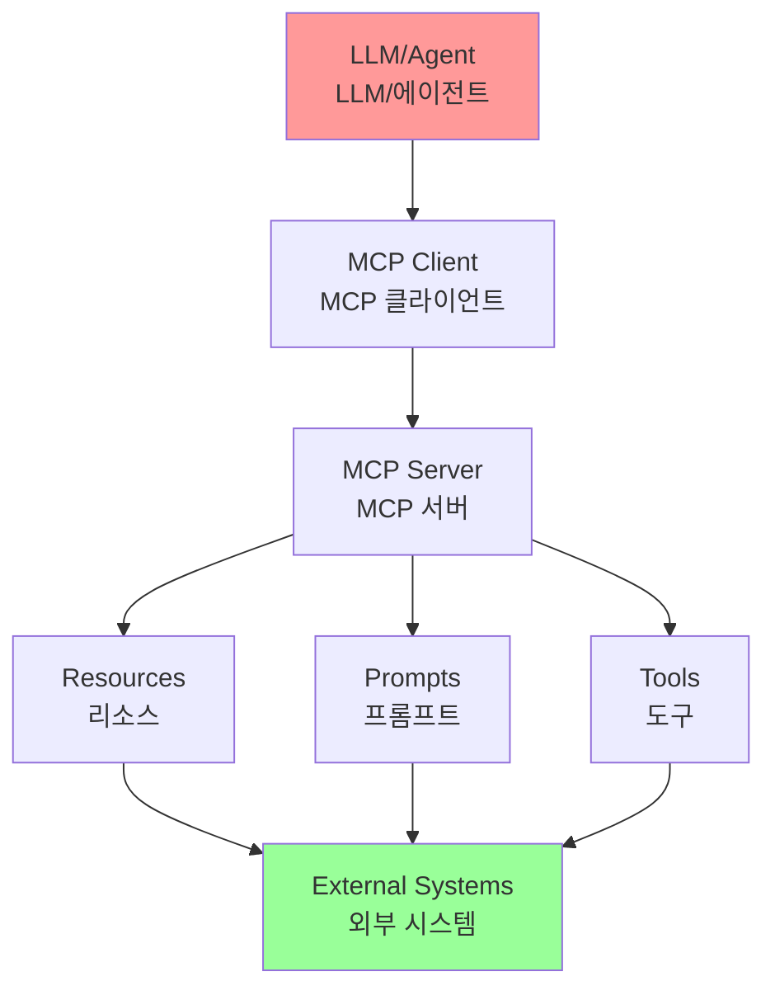
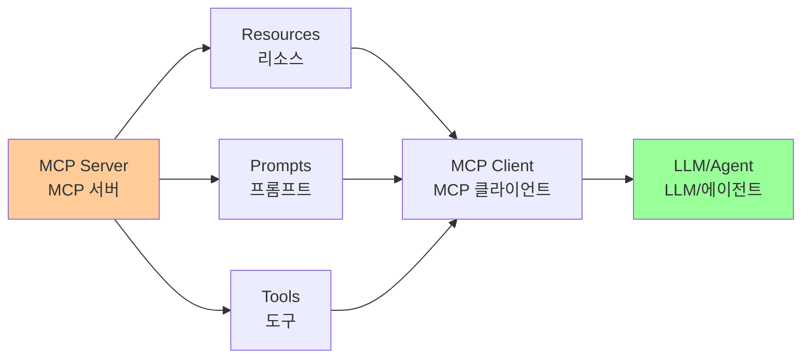
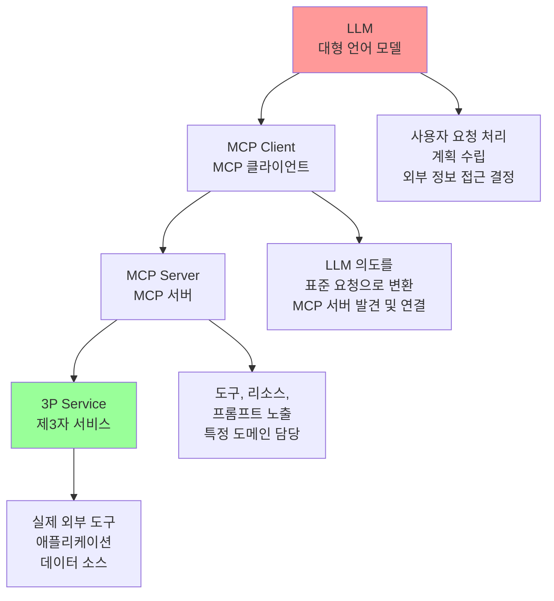
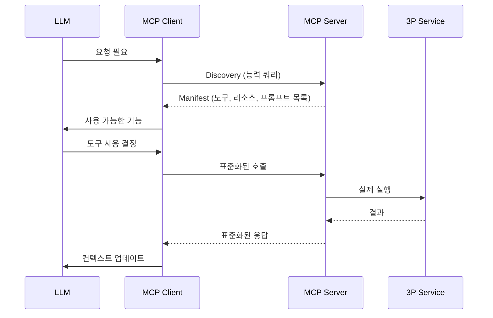
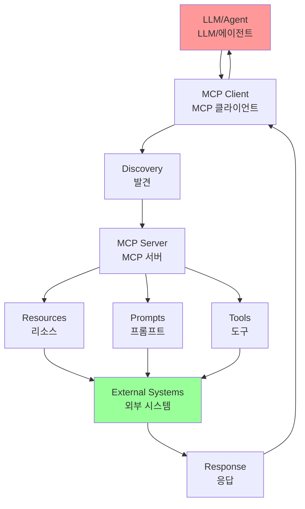
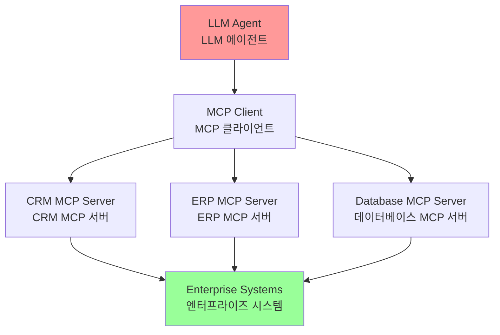

# Chapter 10: Model Context Protocol (MCP)

## 개요

For LLMs to function effectively as agents, they need capabilities beyond multimodal generation. They require interaction with external environments, which includes accessing current data, leveraging external software, and executing specific operational tasks. The Model Context Protocol (MCP) addresses this need by providing a standardized interface for LLMs to interface with external resources.

LLM이 에이전트로 효과적으로 작동하려면 멀티모달 생성 이상의 능력이 필요합니다. 외부 환경과의 상호작용이 필요하며, 여기에는 현재 데이터에 대한 접근, 외부 소프트웨어 활용, 특정 운영 작업 실행이 포함됩니다. Model Context Protocol (MCP)은 이러한 필요를 해결하기 위해 LLM이 외부 리소스와 인터페이스하기 위한 표준화된 인터페이스를 제공합니다.

## 패턴 개요 (Pattern Overview)

### 핵심 개념

Imagine a universal adapter that allows any LLM to plug into any external system, database, or tool without a custom integration for each one. That's essentially what the Model Context Protocol (MCP) is.

모든 LLM이 각각에 대한 사용자 정의 통합 없이 모든 외부 시스템, 데이터베이스 또는 도구에 연결할 수 있게 하는 범용 어댑터를 상상해보세요. 그것이 본질적으로 Model Context Protocol (MCP)입니다.



### MCP의 역할

It's an open standard designed to standardize how LLMs like Gemini, OpenAI's GPT models, Mixtral, and Claude communicate with external applications, data sources, and tools. Think of it as a universal connection mechanism that simplifies how LLMs obtain context, execute actions, and interact with various systems.

Gemini, OpenAI의 GPT 모델, Mixtral, Claude와 같은 LLM이 외부 애플리케이션, 데이터 소스 및 도구와 통신하는 방식을 표준화하도록 설계된 개방형 표준입니다. LLM이 컨텍스트를 얻고, 행동을 실행하고, 다양한 시스템과 상호작용하는 방식을 단순화하는 범용 연결 메커니즘으로 생각해보세요.

MCP는 LLM이 Gemini, OpenAI의 GPT 모델, Mixtral, Claude와 같은 외부 애플리케이션, 데이터 소스 및 도구와 통신하는 방식을 표준화하도록 설계된 개방형 표준입니다.

**핵심 기능**:
- LLM이 컨텍스트를 얻고, 행동을 실행하고, 다양한 시스템과 상호작용하는 방식을 단순화하는 범용 연결 메커니즘
- 에이전트 인터페이스를 위한 계약 역할

### 클라이언트-서버 아키텍처

MCP operates on a client-server architecture. It defines how different elements—data (referred to as resources), interactive templates (which are essentially prompts), and actionable functions (known as tools)—are exposed by an MCP server. These are then consumed by an MCP client, which could be an LLM host application or an AI agent itself. This standardized approach dramatically reduces the complexity of integrating LLMs into diverse operational environments.

MCP는 클라이언트-서버 아키텍처에서 작동합니다. 데이터(리소스라고 함), 대화형 템플릿(본질적으로 프롬프트), 실행 가능한 함수(도구로 알려짐)와 같은 다양한 요소가 MCP 서버에 의해 노출되는 방식을 정의합니다. 이것들은 그 다음 LLM 호스트 애플리케이션이나 AI 에이전트 자체일 수 있는 MCP 클라이언트에 의해 소비됩니다. 이 표준화된 접근 방식은 다양한 운영 환경에 LLM을 통합하는 복잡성을 크게 줄입니다.

MCP는 클라이언트-서버 아키텍처에서 작동합니다:



**구성 요소**:
- **데이터 (Resources)**: 정적 데이터
- **대화형 템플릿 (Prompts)**: 본질적으로 프롬프트
- **실행 가능한 함수 (Tools)**: 도구로 알려진 것

**프로세스**:
1. MCP 서버가 이러한 요소들을 노출
2. MCP 클라이언트(LLM 호스트 애플리케이션이나 AI 에이전트 자체)가 이를 소비
3. 이 표준화된 접근 방식이 다양한 운영 환경에 LLM을 통합하는 복잡성을 크게 줄임

### 중요 고려사항

However, MCP is a contract for an "agentic interface," and its effectiveness depends heavily on the design of the underlying APIs it exposes. There is a risk that developers simply wrap pre-existing, legacy APIs without modification, which can be suboptimal for an agent.

그러나 MCP는 "에이전트 인터페이스"를 위한 계약이며, 그 효과는 노출하는 기본 API의 설계에 크게 의존합니다. 개발자가 단순히 기존 레거시 API를 수정 없이 래핑하는 위험이 있으며, 이는 에이전트에게 차선책이 될 수 있습니다.

#### 1. 기본 API 설계의 중요성

MCP는 "에이전트 인터페이스"를 위한 계약이며, 그 효과는 노출하는 기본 API의 설계에 크게 의존합니다.

**위험**: 개발자가 단순히 기존 레거시 API를 수정 없이 래핑하는 경우, 에이전트에게 차선책이 될 수 있습니다.

For example, if a ticketing system's API only allows retrieving full ticket details one by one, an agent asked to summarize high-priority tickets will be slow and inaccurate at high volumes. To be truly effective, the underlying API should be improved with deterministic features like filtering and sorting to help the non-deterministic agent work efficiently. This highlights that agents do not magically replace deterministic workflows; they often require stronger deterministic support to succeed.

예를 들어, 티켓 시스템의 API가 한 번에 하나씩만 전체 티켓 세부 정보를 검색할 수 있는 경우, 높은 우선순위 티켓을 요약하도록 요청받은 에이전트는 높은 볼륨에서 느리고 부정확할 것입니다. 진정으로 효과적이려면, 기본 API는 필터링 및 정렬과 같은 결정론적 기능으로 개선되어 비결정론적 에이전트가 효율적으로 작동할 수 있도록 해야 합니다. 이것은 에이전트가 마법처럼 결정론적 워크플로우를 대체하지 않으며, 종종 성공하기 위해 더 강한 결정론적 지원이 필요하다는 것을 강조합니다.

**예시**: 티켓 시스템의 API가 한 번에 하나씩만 전체 티켓 세부 정보를 검색할 수 있는 경우, 높은 우선순위 티켓을 요약하도록 요청받은 에이전트는 높은 볼륨에서 느리고 부정확할 것입니다.

**해결책**: 기본 API는 필터링 및 정렬과 같은 결정론적 기능으로 개선되어 비결정론적 에이전트가 효율적으로 작동할 수 있도록 해야 합니다.

#### 2. 에이전트 친화적 데이터 형식

Furthermore, MCP can wrap an API whose input or output is still not inherently understandable by the agent. An API is only useful if its data format is agent-friendly, a guarantee that MCP itself does not enforce. For instance, creating an MCP server for a document store that returns files as PDFs is mostly useless if the consuming agent cannot parse PDF content. The better approach would be to first create an API that returns a textual version of the document, such as Markdown, which the agent can process.

또한, MCP는 입력이나 출력이 여전히 에이전트에 의해 본질적으로 이해할 수 없는 API를 래핑할 수 있습니다. API는 데이터 형식이 에이전트 친화적일 때만 유용하며, MCP 자체는 이를 보장하지 않습니다. 예를 들어, PDF로 파일을 반환하는 문서 저장소에 대한 MCP 서버를 만드는 것은 소비 에이전트가 PDF 콘텐츠를 구문 분석할 수 없는 경우 대부분 쓸모가 없습니다. 더 나은 접근 방식은 에이전트가 처리할 수 있는 Markdown과 같은 문서의 텍스트 버전을 반환하는 API를 먼저 만드는 것입니다.

MCP가 입력이나 출력이 여전히 에이전트에 의해 본질적으로 이해할 수 없는 API를 래핑할 수 있습니다. API는 데이터 형식이 에이전트 친화적일 때만 유용하며, MCP 자체는 이를 보장하지 않습니다.

**예시**: PDF로 파일을 반환하는 문서 저장소에 대한 MCP 서버를 만드는 것은 소비 에이전트가 PDF 콘텐츠를 파싱할 수 없는 경우 대부분 무용지물입니다.

**해결책**: 에이전트가 실제로 읽고 처리할 수 있는 텍스트 버전의 문서(예: Markdown)를 반환하는 API를 먼저 만드는 것이 더 나은 접근 방식입니다.

### MCP vs Tool Function Calling

Model Context Protocol (MCP)과 도구 함수 호출은 LLM이 외부 기능(도구 포함)과 상호작용하고 행동을 실행할 수 있게 하는 별개의 메커니즘입니다.

#### Tool Function Calling

도구 함수 호출은 LLM이 특정 사전 정의된 도구나 함수에 대한 직접 요청으로 생각할 수 있습니다.

**특징**:
- 일대일 통신 모델
- LLM이 사용자 의도를 이해하는 데 기반하여 요청을 포맷
- 애플리케이션 코드가 이 요청을 실행하고 결과를 LLM에 반환
- 이 프로세스는 종종 독점적이며 LLM 제공자 간에 다름

#### Model Context Protocol (MCP)

MCP는 LLM이 외부 기능을 발견, 통신 및 활용하기 위한 표준화된 인터페이스로 작동합니다.

**특징**:
- 외부 도구 및 시스템과의 광범위한 상호작용을 용이하게 하는 개방형 프로토콜
- 모든 호환 도구가 모든 호환 LLM에 의해 접근 가능한 생태계를 구축하는 것을 목표
- 상호 운용성, 구성 가능성 및 재사용성을 촉진
- 연합 모델을 채택하여 상호 운용성을 크게 개선하고 기존 자산의 가치를 잠금 해제

#### 비교표

| 특징 | Tool Function Calling | Model Context Protocol (MCP) |
|------|----------------------|------------------------------|
| **표준화** | 독점적이고 벤더별. 형식과 구현이 LLM 제공자 간에 다름 | 개방형 표준화 프로토콜, 다른 LLM과 도구 간의 상호 운용성 촉진 |
| **범위** | LLM이 특정 사전 정의된 함수 실행을 요청하는 직접 메커니즘 | LLM과 외부 도구가 서로를 발견하고 통신하는 방법에 대한 더 넓은 프레임워크 |
| **아키텍처** | LLM과 애플리케이션의 도구 처리 로직 간의 일대일 상호작용 | LLM 기반 애플리케이션(클라이언트)이 다양한 MCP 서버(도구)에 연결하고 활용할 수 있는 클라이언트-서버 아키텍처 |
| **발견** | LLM은 특정 대화의 컨텍스트 내에서 사용 가능한 도구를 명시적으로 알려받음 | 사용 가능한 도구의 동적 발견 가능. MCP 클라이언트가 서버에 쿼리하여 제공하는 기능을 볼 수 있음 |
| **재사용성** | 도구 통합은 종종 특정 애플리케이션 및 사용 중인 LLM과 밀접하게 결합됨 | 재사용 가능한 독립형 "MCP 서버" 개발을 촉진하며, 모든 호환 애플리케이션에 의해 접근 가능 |

**비유**:
- **Tool Function Calling**: AI에게 특정 맞춤 제작 도구 세트를 주는 것 (특정 렌치와 드라이버)
- **MCP**: 범용 표준화 전원 콘센트 시스템을 만드는 것. 도구 자체를 제공하는 것이 아니라 모든 제조업체의 모든 호환 도구가 플러그인하여 작동할 수 있게 함

### MCP의 추가 고려사항

#### 1. Tool vs Resource vs Prompt

이러한 구성 요소의 특정 역할을 이해하는 것이 중요합니다:

- **Resource**: 정적 데이터 (예: PDF 파일, 데이터베이스 레코드)
- **Tool**: 행동을 수행하는 실행 가능한 함수 (예: 이메일 보내기, API 쿼리)
- **Prompt**: 리소스나 도구와 상호작용하는 방법을 LLM에 안내하는 템플릿

#### 2. 발견 가능성 (Discoverability)

MCP의 주요 이점은 MCP 클라이언트가 서버에 동적으로 쿼리하여 제공하는 도구와 리소스를 학습할 수 있다는 것입니다. 이 "적시" 발견 메커니즘은 재배포 없이 새 기능에 적응해야 하는 에이전트에게 강력합니다.

#### 3. 보안 (Security)

도구와 데이터를 어떤 프로토콜을 통해 노출하든 견고한 보안 조치가 필요합니다. MCP 구현은 인증 및 권한 부여를 포함하여 어떤 클라이언트가 어떤 서버에 접근할 수 있고 어떤 특정 행동을 수행할 수 있는지 제어해야 합니다.

#### 4. 구현 (Implementation)

MCP는 개방형 표준이지만 구현이 복잡할 수 있습니다. 그러나 제공자들이 이 프로세스를 단순화하기 시작하고 있습니다. 예를 들어, Anthropic이나 FastMCP와 같은 일부 모델 제공자는 상당한 보일러플레이트 코드를 추상화하는 SDK를 제공하여 개발자가 MCP 클라이언트와 서버를 더 쉽게 생성하고 연결할 수 있게 합니다.

#### 5. 오류 처리 (Error Handling)

포괄적인 오류 처리 전략이 중요합니다. 프로토콜은 오류(예: 도구 실행 실패, 사용 불가능한 서버, 잘못된 요청)가 LLM에 다시 전달되는 방식을 정의해야 하며, LLM이 실패를 이해하고 잠재적으로 대안적 접근을 시도할 수 있게 해야 합니다.

#### 6. 로컬 vs 원격 서버

MCP 서버는 에이전트와 같은 머신에 로컬로 배포되거나 다른 서버에 원격으로 배포될 수 있습니다. 로컬 서버는 민감한 데이터에 대한 속도와 보안을 위해 선택될 수 있으며, 원격 서버 아키텍처는 조직 전체에서 공통 도구에 대한 공유, 확장 가능한 접근을 허용합니다.

#### 7. 온디맨드 vs 배치

MCP는 온디맨드 대화형 세션과 대규모 배치 처리를 모두 지원할 수 있습니다. 선택은 애플리케이션에 따라 다르며, 즉각적인 도구 접근이 필요한 실시간 대화형 에이전트부터 레코드를 배치로 처리하는 데이터 분석 파이프라인까지 다양합니다.

#### 8. 전송 메커니즘 (Transportation Mechanism)

프로토콜은 통신을 위한 기본 전송 계층도 정의합니다:
- **로컬 상호작용**: 효율적인 프로세스 간 통신을 위해 STDIO(표준 입력/출력)를 통한 JSON-RPC 사용
- **원격 연결**: 웹 친화적 프로토콜인 Streamable HTTP 및 Server-Sent Events (SSE)를 활용하여 지속적이고 효율적인 클라이언트-서버 통신 활성화

### MCP 구성 요소 상호작용

Model Context Protocol은 정보 흐름을 표준화하기 위해 클라이언트-서버 모델을 사용합니다. 구성 요소 상호작용을 이해하는 것이 MCP의 고급 에이전트 동작에 핵심입니다:



#### 구성 요소 설명

1. **Large Language Model (LLM)**: 핵심 지능. 사용자 요청을 처리하고, 계획을 수립하며, 외부 정보에 접근하거나 행동을 수행해야 할 때를 결정합니다.

2. **MCP Client**: 이것은 LLM 주변의 애플리케이션이나 래퍼입니다. 중개자 역할을 하며 LLM의 의도를 MCP 표준을 준수하는 공식 요청으로 변환합니다. MCP 서버를 발견, 연결 및 통신하는 책임이 있습니다.

3. **MCP Server**: 이것은 외부 세계로의 게이트웨이입니다. 인가된 MCP 클라이언트에게 도구, 리소스 및 프롬프트 세트를 노출합니다. 각 서버는 일반적으로 특정 도메인을 담당하며, 회사의 내부 데이터베이스 연결, 이메일 서비스 또는 공용 API와 같은 것입니다.

4. **선택적 제3자 (3P) 서비스**: 이것은 MCP 서버가 관리하고 노출하는 실제 외부 도구, 애플리케이션 또는 데이터 소스를 나타냅니다. 요청된 행동을 수행하는 궁극적인 엔드포인트로, 독점 데이터베이스 쿼리, SaaS 플랫폼과의 상호작용 또는 공용 날씨 API 호출과 같은 것입니다.

#### 상호작용 흐름



**단계별 설명**:

1. **발견 (Discovery)**: MCP 클라이언트가 LLM을 대신하여 MCP 서버에 쿼리하여 제공하는 기능을 묻습니다. 서버는 사용 가능한 도구(예: send_email), 리소스(예: customer_database), 프롬프트를 나열하는 매니페스트로 응답합니다.

2. **요청 공식화 (Request Formulation)**: LLM이 발견된 도구 중 하나를 사용해야 한다고 결정합니다. 예를 들어 이메일을 보내기로 결정하고, 사용할 도구(send_email)와 필요한 매개변수(수신자, 제목, 본문)를 지정하여 요청을 공식화합니다.

3. **클라이언트 통신 (Client Communication)**: MCP 클라이언트가 LLM의 공식화된 요청을 가져와 적절한 MCP 서버에 표준화된 호출로 전송합니다.

4. **서버 실행 (Server Execution)**: MCP 서버가 요청을 받습니다. 클라이언트를 인증하고, 요청을 검증한 다음, 기본 소프트웨어와 인터페이스하여 지정된 행동을 실행합니다(예: 이메일 API의 send() 함수 호출).

5. **응답 및 컨텍스트 업데이트 (Response and Context Update)**: 실행 후, MCP 서버가 표준화된 응답을 MCP 클라이언트에 보냅니다. 이 응답은 행동이 성공했는지 여부를 나타내고 관련 출력(예: 전송된 이메일에 대한 확인 ID)을 포함합니다. 클라이언트는 이 결과를 LLM에 다시 전달하여 컨텍스트를 업데이트하고 작업의 다음 단계를 진행할 수 있게 합니다.

## 실용적 응용 및 사용 사례 (Practical Applications & Use Cases)

MCP는 AI/LLM 기능을 크게 확장하여 더 다양하고 강력하게 만듭니다. 다음은 9가지 주요 사용 사례입니다:

### 1. 데이터베이스 통합

MCP는 LLM과 에이전트가 데이터베이스의 구조화된 데이터에 원활하게 접근하고 상호작용할 수 있게 합니다.

**예시**: MCP Toolbox for Databases를 사용하여 에이전트가 Google BigQuery 데이터셋을 쿼리하여 실시간 정보를 검색하거나, 보고서를 생성하거나, 자연어 명령으로 레코드를 업데이트할 수 있습니다.

### 2. 생성 미디어 조정

MCP는 에이전트가 고급 생성 미디어 서비스와 통합할 수 있게 합니다.

**예시**: MCP Tools for Genmedia Services를 통해 에이전트가 이미지 생성을 위한 Google의 Imagen, 비디오 생성을 위한 Google의 Veo, 현실적인 음성을 위한 Google의 Chirp 3 HD, 음악 작곡을 위한 Google의 Lyria를 포함하는 워크플로우를 조정할 수 있습니다.

### 3. 외부 API 상호작용

MCP는 LLM이 모든 외부 API를 호출하고 응답을 받는 표준화된 방법을 제공합니다.

**예시**: 에이전트가 실시간 날씨 데이터를 가져오거나, 주가를 가져오거나, 이메일을 보내거나, CRM 시스템과 상호작용할 수 있어 핵심 언어 모델을 훨씬 넘어서는 기능을 확장합니다.

### 4. 추론 기반 정보 추출

LLM의 강력한 추론 기술을 활용하여 MCP는 기존 검색 및 검색 시스템을 초과하는 효과적이고 쿼리 종속적인 정보 추출을 용이하게 합니다.

**예시**: 전통적인 검색 도구가 전체 문서를 반환하는 대신, 에이전트가 텍스트를 분석하고 사용자의 복잡한 질문에 직접 답하는 정확한 조항, 그림 또는 진술을 추출할 수 있습니다.

### 5. 커스텀 도구 개발

개발자는 커스텀 도구를 구축하고 MCP 서버를 통해 노출할 수 있습니다(예: FastMCP 사용).

**예시**: 특수 내부 함수나 독점 시스템을 표준화되고 쉽게 소비 가능한 형식으로 LLM 및 기타 에이전트에 사용 가능하게 만들 수 있으며, LLM을 직접 수정할 필요가 없습니다.

### 6. 표준화된 LLM-애플리케이션 통신

MCP는 LLM과 상호작용하는 애플리케이션 간의 일관된 통신 계층을 보장합니다.

**이점**: 통합 오버헤드를 줄이고, 다른 LLM 제공자와 호스트 애플리케이션 간의 상호 운용성을 촉진하며, 복잡한 에이전트 시스템의 개발을 단순화합니다.

### 7. 복잡한 워크플로우 조정

다양한 MCP 노출 도구와 데이터 소스를 결합하여 에이전트는 고도로 복잡한 다단계 워크플로우를 조정할 수 있습니다.

**예시**: 에이전트가 데이터베이스에서 고객 데이터를 검색하고, 개인화된 마케팅 이미지를 생성하고, 맞춤형 이메일을 작성한 다음, 다른 MCP 서비스와 상호작용하여 전송할 수 있습니다.

### 8. IoT 장치 제어

MCP는 LLM이 사물 인터넷(IoT) 장치와 상호작용할 수 있게 할 수 있습니다.

**예시**: 에이전트가 MCP를 사용하여 스마트 홈 가전, 산업 센서 또는 로봇에 명령을 보내 자연어 제어 및 물리적 시스템의 자동화를 가능하게 할 수 있습니다.

### 9. 금융 서비스 자동화

금융 서비스에서 MCP는 LLM이 다양한 금융 데이터 소스, 거래 플랫폼 또는 규정 준수 시스템과 상호작용할 수 있게 할 수 있습니다.

**예시**: 에이전트가 시장 데이터를 분석하고, 거래를 실행하고, 개인화된 금융 조언을 생성하거나, 안전하고 표준화된 통신을 유지하면서 규제 보고를 자동화할 수 있습니다.

## 실습 코드 예제 (Hands-On Code Example)

### ADK와 함께하는 MCP 예제

이 섹션은 파일 시스템 작업을 제공하는 로컬 MCP 서버에 연결하는 방법을 설명하여 ADK 에이전트가 로컬 파일 시스템과 상호작용할 수 있게 합니다.

#### 에이전트 설정

```python
import os
from google.adk.agents import LlmAgent
from google.adk.tools.mcp_tool.mcp_toolset import MCPToolset, StdioServerParameters

# 이 에이전트 스크립트와 같은 디렉토리 내에 'mcp_managed_files'라는 이름의 폴더에 대한
# 신뢰할 수 있는 절대 경로 생성
# 이것은 데모를 위해 에이전트가 즉시 작동하도록 보장합니다.
# 프로덕션의 경우, 이를 더 지속적이고 안전한 위치로 가리켜야 합니다.
TARGET_FOLDER_PATH = os.path.join(
    os.path.dirname(os.path.abspath(__file__)),
    "mcp_managed_files"
)

# 에이전트가 필요하기 전에 대상 디렉토리가 존재하는지 확인
os.makedirs(TARGET_FOLDER_PATH, exist_ok=True)

root_agent = LlmAgent(
    model='gemini-2.0-flash',
    name='filesystem_assistant_agent',
    instruction=(
        'Help the user manage their files. You can list files, read files, and write files. '
        f'You are operating in the following directory: {TARGET_FOLDER_PATH}'
    ),
    tools=[
        MCPToolset(
            connection_params=StdioServerParameters(
                command='npx',
                args=[
                    "-y",  # npx가 자동으로 설치를 확인하도록 하는 인수
                    "@modelcontextprotocol/server-filesystem",
                    # 이것은 폴더에 대한 절대 경로여야 합니다.
                    TARGET_FOLDER_PATH,
                ],
            ),
            # 선택사항: MCP 서버에서 노출되는 도구를 필터링할 수 있습니다.
            # 예를 들어, 읽기만 허용하려면:
            # tool_filter=['list_directory', 'read_file']
        )
    ],
)
```

#### __init__.py 파일

```python
# ./adk_agent_samples/mcp_agent/__init__.py
from . import agent
```

#### 다른 연결 방법

**Python3 연결**:
```python
connection_params = StdioConnectionParams(
    server_params={
        "command": "python3",
        "args": ["./agent/mcp_server.py"],
        "env": {
            "SERVICE_ACCOUNT_PATH": SERVICE_ACCOUNT_PATH,
            "DRIVE_FOLDER_ID": DRIVE_FOLDER_ID
        }
    }
)
```

**UVX 연결**:
```python
connection_params = StdioConnectionParams(
    server_params={
        "command": "uvx",
        "args": ["mcp-google-sheets@latest"],
        "env": {
            "SERVICE_ACCOUNT_PATH": SERVICE_ACCOUNT_PATH,
            "DRIVE_FOLDER_ID": DRIVE_FOLDER_ID
        }
    }
)
```

### FastMCP를 사용한 MCP 서버 생성

FastMCP는 MCP 서버 개발을 간소화하도록 설계된 고수준 Python 프레임워크입니다.

#### FastMCP 서버 예제

```python
# fastmcp_server.py
# 이 스크립트는 FastMCP를 사용하여 간단한 MCP 서버를 만드는 방법을 보여줍니다.
# 인사말을 생성하는 단일 도구를 노출합니다.

# 1. FastMCP가 설치되어 있는지 확인:
# pip install fastmcp

from fastmcp import FastMCP

# FastMCP 서버 초기화
mcp_server = FastMCP()

# 간단한 도구 함수 정의
# `@mcp_server.tool` 데코레이터는 이 Python 함수를 MCP 도구로 등록합니다.
# 독스트링은 LLM을 위한 도구 설명이 됩니다.
@mcp_server.tool
def greet(name: str) -> str:
    """
    Generates a personalized greeting.
    Args:
        name: The name of the person to greet.
    Returns:
        A greeting string.
    """
    return f"Hello, {name}! Nice to meet you."

# 스크립트에서 실행하려면:
if __name__ == "__main__":
    mcp_server.run(
        transport="http",
        host="127.0.0.1",
        port=8000
    )
```

#### FastMCP 서버를 사용하는 ADK 에이전트

```python
# ./adk_agent_samples/fastmcp_client_agent/agent.py
import os
from google.adk.agents import LlmAgent
from google.adk.tools.mcp_tool.mcp_toolset import MCPToolset, HttpServerParameters

# FastMCP 서버의 주소 정의
# 이전에 정의한 fastmcp_server.py가 이 포트에서 실행 중인지 확인
FASTMCP_SERVER_URL = "http://localhost:8000"

root_agent = LlmAgent(
    model='gemini-2.0-flash',  # 또는 선호하는 모델
    name='fastmcp_greeter_agent',
    instruction='You are a friendly assistant that can greet people by their name. Use the "greet" tool.',
    tools=[
        MCPToolset(
            connection_params=HttpServerParameters(
                url=FASTMCP_SERVER_URL,
            ),
            # 선택사항: MCP 서버에서 노출되는 도구를 필터링
            # 이 예제의 경우, 'greet'만 예상합니다
            tool_filter=['greet']
        )
    ],
)
```

## 한눈에 보기 (At a Glance)

### 무엇 (What)

효과적인 에이전트로 작동하려면 LLM은 단순한 텍스트 생성 이상이 필요합니다. 외부 환경과 상호작용하여 현재 데이터에 접근하고 외부 소프트웨어를 활용할 수 있어야 합니다. 표준화된 통신 방법 없이는 LLM과 외부 도구나 데이터 소스 간의 각 통합이 사용자 정의, 복잡하고 재사용 불가능한 노력이 됩니다.

### 왜 (Why)

Model Context Protocol (MCP)은 LLM과 외부 시스템 간의 범용 인터페이스 역할을 하여 표준화된 솔루션을 제공합니다. 클라이언트-서버 모델에서 작동하는 MCP는 서버가 모든 호환 클라이언트에게 도구, 데이터 리소스 및 대화형 프롬프트를 노출할 수 있게 합니다.

### 경험 법칙 (Rule of Thumb)

다양하고 진화하는 외부 도구, 데이터 소스 및 API 세트와 상호작용해야 하는 복잡하고 확장 가능하거나 엔터프라이즈급 에이전트 시스템을 구축할 때 Model Context Protocol (MCP)을 사용하세요. 서로 다른 LLM과 도구 간의 상호 운용성이 우선순위이고, 에이전트가 재배포 없이 새 기능을 동적으로 발견할 수 있는 능력이 필요한 경우 이상적입니다.

### 시각적 요약



## 핵심 요약 (Key Takeaways)

1. **Model Context Protocol (MCP)은 LLM과 외부 애플리케이션, 데이터 소스 및 도구 간의 표준화된 통신을 용이하게 하는 개방형 표준입니다**

2. **클라이언트-서버 아키텍처를 사용하여 리소스, 프롬프트 및 도구를 노출하고 소비하는 방법을 정의합니다**

3. **Agent Development Kit (ADK)는 기존 MCP 서버를 활용하고 MCP 서버를 통해 ADK 도구를 노출하는 것을 모두 지원합니다**

4. **FastMCP는 특히 Python으로 구현된 도구를 노출하기 위한 MCP 서버의 개발 및 관리를 단순화합니다**

5. **MCP Tools for Genmedia Services는 에이전트가 Google Cloud의 생성 미디어 기능(Imagen, Veo, Chirp 3 HD, Lyria)과 통합할 수 있게 합니다**

6. **MCP는 LLM과 에이전트가 실제 세계 시스템과 상호작용하고, 동적 정보에 접근하며, 텍스트 생성 이상의 행동을 수행할 수 있게 합니다**

7. **MCP의 효과는 노출하는 기본 API의 설계에 크게 의존하며, 에이전트 친화적인 데이터 형식이 중요합니다**

## 결론

Model Context Protocol (MCP)은 대형 언어 모델(LLMs)과 외부 시스템 간의 통신을 용이하게 하는 개방형 표준입니다. 클라이언트-서버 아키텍처를 사용하여 LLM이 표준화된 도구를 통해 리소스에 접근하고, 프롬프트를 활용하며, 행동을 실행할 수 있게 합니다.

MCP는 LLM이 데이터베이스와 상호작용하고, 생성 미디어 워크플로우를 관리하고, IoT 장치를 제어하며, 금융 서비스를 자동화할 수 있게 합니다. 파일 시스템 서버와 FastMCP로 구축된 서버를 포함하여 MCP 서버와 통신하도록 에이전트를 설정하는 실용적인 예제는 Agent Development Kit (ADK)와의 통합을 보여줍니다.

MCP는 기본 언어 기능을 넘어서는 대화형 AI 에이전트를 개발하는 핵심 구성 요소입니다. 표준화된 통신 계층을 제공함으로써, MCP는 복잡한 에이전트 시스템의 개발을 단순화하고 다양한 LLM과 도구 간의 상호 운용성을 촉진합니다.

## 이론적 배경 및 학술적 근거 (Theoretical Background and Academic Foundation)

### 프로토콜 설계 원칙

MCP는 네트워크 프로토콜 설계의 원칙을 따릅니다. OSI 모델과 TCP/IP 모델은 계층화된 프로토콜 설계를 제시합니다.

**프로토콜 설계 원칙**:
- **계층화**: 기능을 계층으로 분리
- **표준화**: 상호 운용성을 위한 표준 정의
- **확장성**: 새로운 기능 추가 가능
- **독립성**: 구현 세부사항과 분리

**MCP에서의 적용**:
- 클라이언트-서버 계층 분리
- 표준화된 메시지 형식
- 플러그인 아키텍처로 확장성
- 구현 독립적 인터페이스

### 분산 시스템 아키텍처

MCP는 분산 시스템의 원칙을 구현합니다.

**분산 시스템 특성**:
- **투명성**: 분산이 사용자에게 투명
- **확장성**: 시스템 확장 용이
- **견고성**: 부분 실패에 대한 내성
- **일관성**: 분산 환경에서 일관성 유지

**MCP 아키텍처**:
- 서버와 클라이언트의 분리
- 독립적 배포 및 확장
- 서버 실패 시 클라이언트 격리
- 표준화된 통신으로 일관성

### API 설계 원칙

RESTful API와 GraphQL의 설계 원칙이 MCP에 적용됩니다.

**API 설계 원칙**:
- **리소스 중심**: 리소스를 중심으로 설계
- **상태 비저장 (Stateless)**: 각 요청이 독립적
- **표준 HTTP 메서드**: GET, POST, PUT, DELETE
- **표준 상태 코드**: 명확한 응답 코드

**MCP의 리소스 모델**:
- **Resources**: 정적 데이터
- **Prompts**: 대화형 템플릿
- **Tools**: 실행 가능한 함수

### 어댑터 패턴 (Adapter Pattern)

MCP는 어댑터 패턴의 구현입니다.

**어댑터 패턴**:
- 호환되지 않는 인터페이스를 연결
- 기존 시스템을 새로운 인터페이스에 적응
- 클라이언트 코드 변경 최소화

**MCP의 역할**:
- 다양한 외부 시스템을 표준 인터페이스로 통합
- LLM이 다양한 도구를 일관된 방식으로 사용
- 새로운 도구 추가 시 기존 코드 변경 불필요

## 성능 최적화 기법 (Performance Optimization Techniques)

### 1. 연결 풀링

MCP 서버 연결 재사용:

```python
class MCPConnectionPool:
    def __init__(self, max_connections=10):
        self.pool = Queue(maxsize=max_connections)
        self.active_connections = {}
    
    def get_connection(self, server_url: str):
        """연결 풀에서 연결 가져오기"""
        if server_url in self.active_connections:
            return self.active_connections[server_url]
        
        # 새 연결 생성
        connection = self.create_connection(server_url)
        self.active_connections[server_url] = connection
        return connection
    
    def release_connection(self, server_url: str, connection):
        """연결을 풀에 반환"""
        # 연결 재사용을 위해 유지
        pass
```

### 2. 배치 요청

여러 요청을 배치로 처리:

```python
async def batch_mcp_requests(requests: List[MCPRequest]) -> List[MCPResponse]:
    """MCP 요청 배치 처리"""
    # 독립적인 요청은 병렬 처리
    independent_requests = [r for r in requests if r.is_independent]
    responses = await asyncio.gather(*[
        mcp_client.send(request) for request in independent_requests
    ])
    
    return responses
```

### 3. 캐싱 전략

자주 사용되는 리소스 캐싱:

```python
from functools import lru_cache

class CachedMCPClient:
    def __init__(self, mcp_client):
        self.client = mcp_client
        self.cache = {}
    
    @lru_cache(maxsize=100)
    async def get_resource(self, resource_uri: str):
        """캐시된 리소스 가져오기"""
        if resource_uri in self.cache:
            return self.cache[resource_uri]
        
        resource = await self.client.get_resource(resource_uri)
        self.cache[resource_uri] = resource
        return resource
```

### 4. 연결 재시도

일시적 오류에 대한 재시도:

```python
from tenacity import retry, stop_after_attempt, wait_exponential

@retry(
    stop=stop_after_attempt(3),
    wait=wait_exponential(multiplier=1, min=4, max=10)
)
async def robust_mcp_call(mcp_client, request: MCPRequest):
    """재시도가 있는 견고한 MCP 호출"""
    try:
        return await mcp_client.send(request)
    except TransientError as e:
        logger.warning(f"Transient error: {e}, retrying...")
        raise
```

## 트레이드오프 및 한계점 (Trade-offs and Limitations)

### MCP의 장점

1. **표준화**: 일관된 인터페이스 제공
2. **상호 운용성**: 다양한 시스템과 통합
3. **확장성**: 새로운 도구 쉽게 추가
4. **모듈성**: 독립적 서버 개발 및 배포

### MCP의 한계

1. **오버헤드**: 프로토콜 계층으로 인한 오버헤드
2. **복잡도**: 분산 시스템의 복잡성
3. **지연 시간**: 네트워크 통신 지연
4. **에이전트 친화성**: 기본 API 설계에 의존

### 완화 전략

1. **효율적 프로토콜**: 최소한의 오버헤드 설계
2. **로컬 서버**: 가능한 경우 로컬 서버 사용
3. **비동기 통신**: 비동기 I/O로 지연 시간 최소화
4. **API 설계 가이드**: 에이전트 친화적 API 설계 가이드 제공

## 관련 패턴과의 비교 (Comparison with Related Patterns)

### MCP vs. Direct API Integration

| 특성 | Direct API | MCP |
|------|-----------|-----|
| 표준화 | 없음 | 있음 |
| 상호 운용성 | 낮음 | 높음 |
| 개발 복잡도 | 낮음 | 중간 |
| 유지보수 | 어려움 | 쉬움 |

### MCP vs. A2A Protocol

MCP와 A2A는 서로 다른 목적:

- **MCP**: LLM과 외부 시스템 간 통신
- **A2A**: 에이전트 간 통신
- **보완적**: 두 프로토콜을 함께 사용 가능

## 실무 적용 사례 확장 (Extended Practical Applications)

### 1. 엔터프라이즈 시스템 통합

다양한 엔터프라이즈 시스템을 MCP로 통합:



### 2. IoT 디바이스 제어

스마트 홈 디바이스를 MCP로 제어:

```python
class IoTMCPBridge:
    def __init__(self):
        self.devices = {}
    
    @mcp_server.tool
    def control_device(self, device_id: str, action: str, params: dict) -> dict:
        """IoT 디바이스 제어"""
        device = self.devices.get(device_id)
        if not device:
            return {"error": "Device not found"}
        
        result = device.execute(action, params)
        return {"status": "success", "result": result}
    
    @mcp_server.resource
    def get_device_status(self, device_id: str) -> dict:
        """디바이스 상태 조회"""
        device = self.devices.get(device_id)
        return device.get_status() if device else {"error": "Device not found"}
```

### 3. 금융 서비스 통합

다양한 금융 API를 MCP로 통합:

- **거래소 API**: 실시간 시세 조회
- **결제 게이트웨이**: 결제 처리
- **계좌 관리**: 계좌 정보 조회
- **보고서 생성**: 거래 보고서 생성

## 참고 자료 (References)

### 학술 논문

1. Fielding, R. T. (2000). "Architectural Styles and the Design of Network-based Software Architectures." *Doctoral Dissertation*, UC Irvine.

2. Tanenbaum, A. S., & Wetherall, D. (2011). *Computer Networks* (5th ed.). Prentice Hall.

3. Gamma, E., et al. (1994). *Design Patterns: Elements of Reusable Object-Oriented Software*. Addison-Wesley.

4. Birrell, A. D., & Nelson, B. J. (1984). "Implementing remote procedure calls." *ACM Transactions on Computer Systems*, 2(1), 39-59.

5. Richardson, L., & Ruby, S. (2007). *RESTful Web Services*. O'Reilly Media.

### 프레임워크 및 도구 문서

1. Model Context Protocol (MCP) Documentation:
   https://google.github.io/adk-docs/mcp/

2. FastMCP Documentation:
   https://github.com/jlowin/fastmcp

3. MCP Tools for Genmedia Services:
   https://google.github.io/adk-docs/mcp/#mcp-servers-for-google-cloud-genmedia

4. MCP Toolbox for Databases Documentation:
   https://google.github.io/adk-docs/mcp/databases/

### 추가 학습 자료

5. "Designing Web APIs" by Brenda Jin et al.

6. "Building Microservices" by Sam Newman

7. "RESTful Web Services" by Leonard Richardson & Sam Ruby

---

**이전 챕터**: [Chapter 9: Learning and Adaptation](chapter_09_Learning_and_Adaptation.md)  
**다음 챕터**: [Chapter 11: Goal Setting and Monitoring](chapter_11_Goal_Setting_and_Monitoring.md)

