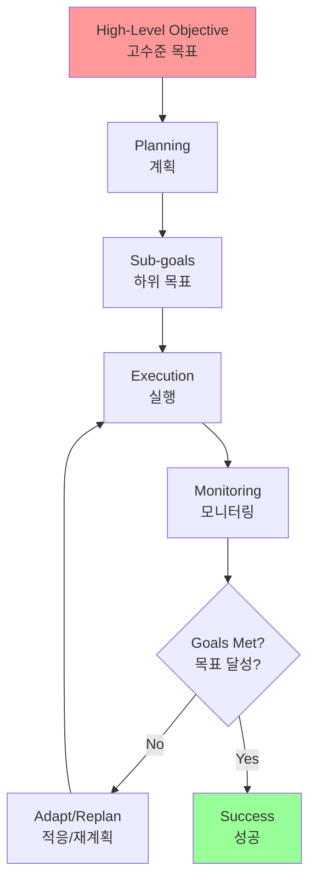
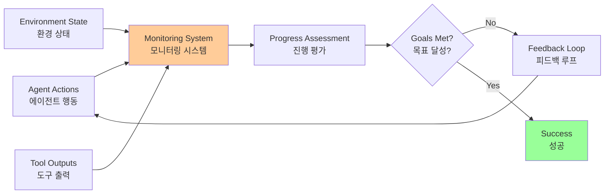
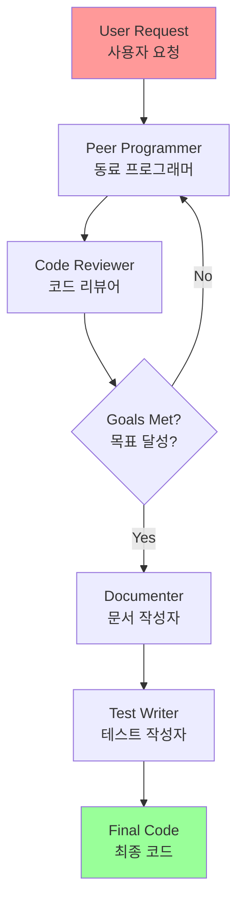
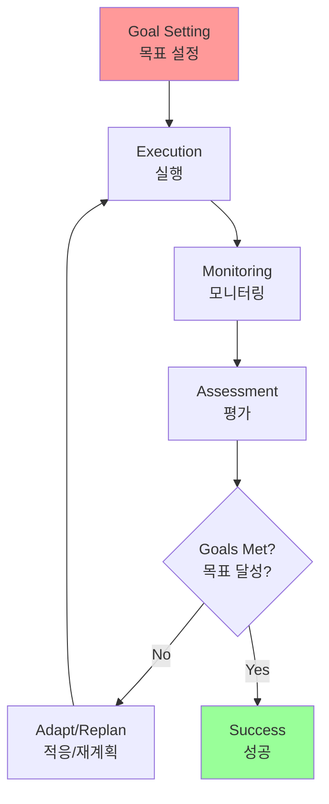
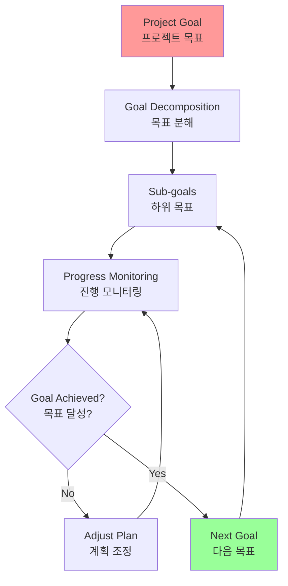

# Chapter 11: Goal Setting and Monitoring

## 개요

For AI agents to function truly effectively and purposefully, they need more than just the ability to process information or use tools. They require a clear sense of direction and a way to know if they're actually succeeding. This is where the Goal Setting and Monitoring pattern comes into play. It's about providing agents with specific goals to work towards, tracking their progress, and having the means to determine whether those goals have been achieved.

AI 에이전트가 진정으로 효과적이고 목적 있게 작동하려면 정보를 처리하거나 도구를 사용하는 능력 이상이 필요합니다. 명확한 방향 감각과 실제로 성공하고 있는지 알 수 있는 방법이 필요합니다. 이것이 Goal Setting and Monitoring 패턴이 작동하는 곳입니다. 에이전트가 향해 갈 구체적인 목표를 제공하고, 진행 상황을 추적하고 해당 목표가 달성되었는지 판단할 수 있는 수단을 갖추는 것에 관한 것입니다.

## 패턴 개요 (Pattern Overview)

### 핵심 개념

Think about planning a trip. You don't just appear at your destination. You decide where you want to go (goal state), figure out where you're starting from (initial state), consider your options (transportation, routes, budget), and then plan a series of steps: book tickets, pack bags, travel to airport/station, board transportation, arrive, find accommodation, etc.

여행을 계획하는 것을 생각해보세요. 목적지에 갑자기 나타나지 않습니다. 어디로 가고 싶은지 결정하고(목표 상태), 어디서 시작하는지 파악하고(초기 상태), 사용 가능한 옵션을 고려한 다음(교통수단, 경로, 예산), 일련의 단계를 계획합니다: 티켓 예약, 가방 포장, 공항/역으로 이동, 교통수단 탑승, 도착, 숙소 찾기 등.

In agent systems, planning typically involves an agent taking a high-level objective and autonomously, or semi-autonomously, generating a series of intermediate steps or sub-goals.

에이전트 시스템에서 계획은 일반적으로 에이전트가 고수준 목표를 취하고 자율적으로 또는 반자율적으로 일련의 중간 단계 또는 하위 목표를 생성하는 것을 포함합니다.



### 계획의 중요성

A good planning capability allows agents to tackle problems that aren't simple, single-step queries. It enables them to handle multi-faceted requests, adapt to changing circumstances by replanning, and orchestrate complex workflows. It's a foundational pattern that underpins many advanced agentic behaviors, turning a simple reactive system into one that can proactively work towards a defined objective.

좋은 계획 능력은 에이전트가 단순하고 단일 단계 쿼리가 아닌 문제를 해결할 수 있게 합니다. 다면적 요청을 처리하고, 재계획을 통해 변화하는 상황에 적응하며, 복잡한 워크플로우를 조정할 수 있게 합니다. 이것은 많은 고급 에이전트 행동을 뒷받침하는 기본 패턴으로, 단순한 반응형 시스템을 정의된 목표를 향해 능동적으로 작동할 수 있는 시스템으로 전환합니다.

### 목표 설정 (Goal Setting)

Goal Setting is the process of defining clear and measurable objectives that an agent needs to achieve.

목표 설정은 에이전트가 달성해야 하는 명확하고 측정 가능한 목표를 정의하는 프로세스입니다.

**SMART 목표 원칙**:
- **Specific (구체적)**: 목표가 명확하고 구체적이어야 함
- **Measurable (측정 가능)**: 목표 달성을 측정할 수 있어야 함
- **Achievable (달성 가능)**: 목표가 현실적이고 달성 가능해야 함
- **Relevant (관련성)**: 목표가 에이전트의 전체 목적과 관련이 있어야 함
- **Time-bound (시간 제한)**: 목표에 시간 제한이 있어야 함

### 모니터링 (Monitoring)

Monitoring is the process of continuously tracking an agent's progress and the state of the environment.

모니터링은 에이전트의 진행 상황과 환경 상태를 지속적으로 추적하는 프로세스입니다.

**모니터링 구성 요소**:
- 에이전트 행동 관찰
- 환경 상태 추적
- 도구 출력 모니터링
- 목표 달성 여부 평가



### 피드백 루프 (Feedback Loop)

Feedback loops from monitoring enable agents to adapt, modify plans, or escalate issues.

모니터링에서 나오는 피드백 루프는 에이전트가 적응하고, 계획을 수정하거나 문제를 에스컬레이션할 수 있게 합니다.

**피드백 루프의 역할**:
- 에이전트가 성능을 평가할 수 있게 함
- 코스를 수정하고 필요시 계획을 조정
- 성공 경로에서 벗어나면 적응

## 실용적 응용 및 사용 사례 (Practical Applications & Use Cases)

The Goal Setting and Monitoring pattern is essential for building agents that can operate autonomously and reliably in complex, real-world scenarios.

Goal Setting and Monitoring 패턴은 복잡하고 실제 세계 시나리오에서 자율적이고 신뢰할 수 있게 작동할 수 있는 에이전트를 구축하는 데 필수적입니다.

### 1. 고객 서비스 에이전트

고객 서비스 에이전트는 명확한 목표(예: 고객 만족도 향상, 응답 시간 단축)와 모니터링 메커니즘을 통해 효과적으로 작동할 수 있습니다.

**목표 예시**:
- 고객 문의에 2분 이내 응답
- 고객 만족도 점수 4.5/5 이상 유지
- 해결률 90% 이상 달성

**모니터링**:
- 응답 시간 추적
- 고객 만족도 조사
- 해결된 케이스 수 추적

### 2. 자율 로봇

자율 로봇은 복잡한 환경에서 목표를 달성하기 위해 명확한 목표와 모니터링이 필요합니다.

**목표 예시**:
- 특정 위치로 이동
- 객체를 특정 위치로 운반
- 충돌 없이 내비게이션

**모니터링**:
- 현재 위치 추적
- 센서 데이터 모니터링
- 목표 달성 여부 평가

### 3. 데이터 처리 파이프라인

데이터 처리 에이전트는 처리 목표를 설정하고 진행 상황을 모니터링할 수 있습니다.

**목표 예시**:
- 1000개 파일 처리
- 처리 시간 1시간 이내
- 오류율 1% 미만

**모니터링**:
- 처리된 파일 수 추적
- 처리 시간 측정
- 오류 발생 추적

### 4. 코드 생성 에이전트

코드 생성 에이전트는 품질 목표를 설정하고 생성된 코드를 모니터링할 수 있습니다.

**목표 예시**:
- 기능적으로 정확한 코드
- 포괄적인 엣지 케이스 처리
- 간단하고 이해하기 쉬운 코드

**모니터링**:
- 코드 품질 평가
- 테스트 통과 여부 확인
- 목표 달성 여부 판단

## 실습 코드 예제 (Hands-On Code Example)

### 목표 설정 및 모니터링을 포함한 코드 생성 에이전트

이 예제는 목표 설정과 모니터링 패턴을 구현하는 AI 코드 생성 에이전트를 보여줍니다.

```python
import os
from dotenv import load_dotenv
from langchain_google_genai import ChatGoogleGenerativeAI
from langchain_core.prompts import ChatPromptTemplate
from langchain_core.messages import HumanMessage

# 환경 변수 로드
load_dotenv()
api_key = os.getenv("GOOGLE_API_KEY")

# LLM 초기화
llm = ChatGoogleGenerativeAI(
    model="gemini-2.0-flash",
    google_api_key=api_key,
    temperature=0.1
)

def generate_prompt(use_case: str, goals: str, previous_code: str = "", feedback: str = "") -> str:
    """코드 생성 또는 개선을 위한 프롬프트 생성"""
    if previous_code and feedback:
        # 개선 모드: 피드백을 기반으로 코드 수정
        return f"""
You are an expert programmer. Your task is to improve the following code based on the feedback provided.

Use Case: {use_case}
Goals: {goals}

Previous Code:
```python
{previous_code}
```

Feedback:
{feedback}

Please revise the code to address the feedback while maintaining all the goals.
"""
    else:
        # 초기 생성 모드
        return f"""
You are an expert programmer. Write Python code for the following use case.

Use Case: {use_case}
Goals: {goals}

Please write clean, correct, and simple code that meets all the specified goals.
"""

def get_code_feedback(code: str, goals: str) -> str:
    """생성된 코드에 대한 피드백을 얻기 위한 별도의 LLM 호출"""
    feedback_prompt = f"""
Act as an expert code reviewer with a deep commitment to producing clean, correct, and simple code. Your core mission is to eliminate code "hallucinations" by ensuring every suggestion is grounded in reality and best practices.

When I provide you with a code snippet, I want you to:
-- Identify and Correct Errors: Point out any logical flaws, bugs, or potential runtime errors.
-- Simplify and Refactor: Suggest changes that make the code more readable, efficient, and maintainable without sacrificing correctness.
-- Provide Clear Explanations: For every suggested change, explain why it is an improvement, referencing principles of clean code, performance, or security.
-- Offer Corrected Code: Show the "before" and "after" of your suggested changes so the improvement is clear.

Your feedback should be direct, constructive, and always aimed at improving the quality of the code.

Code to Review:
```python
{code}
```

Goals to Check Against:
{goals}

Please provide a comprehensive review. At the end, explicitly state whether ALL goals are met with a clear "YES" or "NO" answer.
"""
    return llm.invoke(feedback_prompt)

def goals_met(feedback_text: str, goals: str) -> bool:
    """피드백 텍스트에서 목표 달성 여부 확인"""
    feedback_lower = feedback_text.lower()
    # 간단한 휴리스틱: "yes", "all goals met", "goals are satisfied" 등의 키워드 확인
    positive_indicators = ["yes", "all goals met", "goals are satisfied", "meets all goals"]
    negative_indicators = ["no", "goals not met", "does not meet", "fails to"]
    
    for indicator in positive_indicators:
        if indicator in feedback_lower:
            return True
    
    for indicator in negative_indicators:
        if indicator in feedback_lower:
            return False
    
    # 기본값: 목표가 달성되지 않은 것으로 간주
    return False

def clean_code_block(text: str) -> str:
    """마크다운 코드 블록에서 실제 코드 추출"""
    if "```python" in text:
        start = text.find("```python") + len("```python")
        end = text.find("```", start)
        return text[start:end].strip()
    elif "```" in text:
        start = text.find("```") + 3
        end = text.find("```", start)
        return text[start:end].strip()
    return text.strip()

def add_comment_header(code: str, use_case: str) -> str:
    """코드에 헤더 주석 추가"""
    header = f'''"""
Generated code for: {use_case}
"""
'''
    return header + code

def save_code_to_file(code: str, use_case: str) -> str:
    """코드를 파일로 저장"""
    # 간단한 파일명 생성 (실제로는 더 정교한 파일명 생성 로직 사용)
    filename = f"generated_code_{hash(use_case) % 10000}.py"
    with open(filename, 'w', encoding='utf-8') as f:
        f.write(code)
    print(f"\nCode saved to: {filename}")
    return filename

def run_code_agent(use_case: str, goals: str, max_iterations: int = 5):
    """
    목표 설정 및 모니터링을 포함한 코드 생성 에이전트 실행
    
    Args:
        use_case: 생성할 코드의 사용 사례 설명
        goals: 코드가 달성해야 하는 목표 (쉼표로 구분)
        max_iterations: 최대 반복 횟수
    """
    print(f"\n{'='*60}")
    print("AI Code Generation Agent with Goal Setting and Monitoring")
    print(f"{'='*60}")
    print(f"\nUse Case: {use_case}")
    print(f"Goals: {goals}")
    print(f"Max Iterations: {max_iterations}")
    print(f"\n{'='*60}\n")
    
    previous_code = ""
    feedback = ""
    
    for i in range(max_iterations):
        print(f"\n=== Iteration {i + 1} of {max_iterations} ===")
        
        # 프롬프트 생성
        prompt = generate_prompt(
            use_case, 
            goals, 
            previous_code,
            feedback if isinstance(feedback, str) else feedback.content
        )
        
        print(" Generating code...")
        code_response = llm.invoke(prompt)
        raw_code = code_response.content.strip()
        code = clean_code_block(raw_code)
        
        print("\n Generated Code:\n" + "-" * 50 + f"\n{code}\n" + "-" * 50)
        
        print("\n Submitting code for feedback review...")
        feedback = get_code_feedback(code, goals)
        feedback_text = feedback.content.strip()
        
        print("\n Feedback Received:\n" + "-" * 50 + f"\n{feedback_text}\n" + "-" * 50)
        
        # 목표 달성 여부 확인
        if goals_met(feedback_text, goals):
            print("\n✓ LLM confirms goals are met. Stopping iteration.")
            break
        
        print("\n✗ Goals not fully met. Preparing for next iteration...")
        previous_code = code
    
    # 최종 코드 저장
    final_code = add_comment_header(code, use_case)
    return save_code_to_file(final_code, use_case)

# CLI 테스트 실행
if __name__ == "__main__":
    print("\n Welcome to the AI Code Generation Agent")
    
    # 예제 1
    use_case_input = "Write code to find BinaryGap of a given positive integer"
    goals_input = (
        "Code simple to understand, "
        "Functionally correct, "
        "Handles comprehensive edge cases, "
        "Takes positive integer input only, "
        "prints the results with few examples"
    )
    run_code_agent(use_case_input, goals_input)
    
    # 예제 2 (주석 처리)
    # use_case_input = "Write code to count the number of files in current directory and all its nested sub directories, and print the total count"
    # goals_input = (
    #     "Code simple to understand, "
    #     "Functionally correct, "
    #     "Handles comprehensive edge cases, "
    #     "Ignore recommendations for performance, "
    #     "Ignore recommendations for test suite use like unittest or pytest"
    # )
    # run_code_agent(use_case_input, goals_input)
```

### 코드 설명

이 예제는 Goal Setting and Monitoring 패턴의 핵심 개념을 보여줍니다:

**1. 목표 설정**:
- `goals` 매개변수를 통해 명확하고 측정 가능한 목표 정의
- 목표는 "Code simple to understand", "Functionally correct" 등으로 구체화

**2. 모니터링**:
- `get_code_feedback()` 함수를 통해 생성된 코드를 검토
- 별도의 LLM 호출을 사용하여 객관적인 평가 수행

**3. 피드백 루프**:
- `goals_met()` 함수로 목표 달성 여부 확인
- 목표가 달성되지 않으면 피드백을 기반으로 코드 개선

**4. 반복적 개선**:
- 최대 반복 횟수 내에서 목표 달성까지 반복
- 각 반복에서 이전 코드와 피드백을 활용하여 개선

### 주의사항 및 고려사항

이 예제는 설명 목적이며 프로덕션 준비 코드가 아닙니다. 실제 애플리케이션에서는 다음을 고려해야 합니다:

1. **LLM의 한계**: LLM이 목표의 의도된 의미를 완전히 이해하지 못할 수 있으며, 성능을 잘못 평가할 수 있습니다.

2. **환각(Hallucination)**: 목표가 잘 이해되더라도 모델이 환각을 일으킬 수 있습니다.

3. **자기 평가의 한계**: 같은 LLM이 코드를 작성하고 품질을 판단하는 경우, 잘못된 방향으로 가는 것을 발견하기 어려울 수 있습니다.

4. **실제 테스트 필요**: LLM이 완벽한 코드를 마법처럼 생성하지 않습니다. 생성된 코드를 실행하고 테스트해야 합니다.

5. **무한 루프 위험**: 이 간단한 예제의 "모니터링"은 기본적이며 프로세스가 영원히 실행될 위험이 있습니다.

### 더 견고한 접근 방식: 다중 에이전트 시스템

더 견고한 접근 방식은 이러한 관심사를 분리하여 에이전트 크루에 특정 역할을 부여하는 것을 포함합니다:



**에이전트 역할**:
- **Peer Programmer**: 코드 작성 및 브레인스토밍 지원
- **Code Reviewer**: 오류 포착 및 개선 제안
- **Documenter**: 명확하고 간결한 문서 생성
- **Test Writer**: 포괄적인 단위 테스트 생성
- **Prompt Refiner**: AI와의 상호작용 최적화

이 다중 에이전트 시스템에서 Code Reviewer는 프로그래머 에이전트와 별개의 엔티티로 작동하여 객관적인 평가를 크게 개선합니다.

## 한눈에 보기 (At a Glance)

### 무엇 (What)

AI 에이전트는 종종 명확한 방향이 부족하여 단순하고 반응적인 작업을 넘어서는 목적 있게 행동할 수 없습니다. 정의된 목표 없이는 복잡하고 다단계 문제를 독립적으로 해결하거나 정교한 워크플로우를 조정할 수 없습니다. 또한 행동이 성공적인 결과로 이어지는지 판단할 수 있는 고유한 메커니즘이 없습니다.

### 왜 (Why)

Goal Setting and Monitoring 패턴은 에이전트 시스템에 목적과 자기 평가 감각을 내장하여 표준화된 솔루션을 제공합니다. 에이전트가 달성해야 하는 명확하고 측정 가능한 목표를 명시적으로 정의하는 것을 포함합니다. 동시에 에이전트의 진행 상황과 환경 상태를 이러한 목표에 대해 지속적으로 추적하는 모니터링 메커니즘을 설정합니다.

### 경험 법칙 (Rule of Thumb)

AI 에이전트가 다단계 작업을 자율적으로 실행하고, 동적 조건에 적응하며, 지속적인 인간 개입 없이 특정 고수준 목표를 신뢰할 수 있게 달성해야 할 때 이 패턴을 사용하세요.

### 시각적 요약



## 핵심 요약 (Key Takeaways)

1. **Goal Setting and Monitoring은 에이전트에 목적과 진행 상황을 추적하는 메커니즘을 제공합니다**

2. **목표는 구체적이고, 측정 가능하고, 달성 가능하고, 관련성이 있고, 시간 제한이 있어야 합니다 (SMART)**

3. **명확한 메트릭과 성공 기준을 정의하는 것이 효과적인 모니터링에 필수적입니다**

4. **모니터링은 에이전트 행동, 환경 상태 및 도구 출력을 관찰하는 것을 포함합니다**

5. **모니터링에서 나오는 피드백 루프는 에이전트가 적응하고, 계획을 수정하거나 문제를 에스컬레이션할 수 있게 합니다**

6. **Google의 ADK에서 목표는 종종 에이전트 지시사항을 통해 전달되며, 모니터링은 상태 관리 및 도구 상호작용을 통해 수행됩니다**

7. **다중 에이전트 시스템에서 별도의 Code Reviewer 에이전트를 사용하면 객관적인 평가가 크게 개선됩니다**

8. **실제 애플리케이션에서는 생성된 코드를 실행하고 테스트해야 하며, LLM의 자기 평가만으로는 충분하지 않습니다**

## 결론

이 챕터는 Goal Setting and Monitoring의 중요한 패러다임에 초점을 맞췄습니다. 이 개념이 AI 에이전트를 단순히 반응형 시스템에서 능동적이고 목표 지향적인 엔티티로 전환하는 방법을 강조했습니다.

명확하고 측정 가능한 목표를 정의하고 진행 상황을 추적하기 위한 엄격한 모니터링 절차를 설정하는 것의 중요성을 강조했습니다. 실용적인 애플리케이션은 이 패러다임이 고객 서비스 및 로봇 공학을 포함한 다양한 도메인에서 신뢰할 수 있는 자율 작동을 지원하는 방법을 보여줍니다.

구조화된 프레임워크 내에서 이러한 원칙을 구현하는 개념적 코딩 예제는 에이전트 지시사항과 상태 관리를 사용하여 에이전트가 지정된 목표를 달성하는 것을 안내하고 평가하는 방법을 보여줍니다.

궁극적으로 에이전트에 목표를 공식화하고 감독할 수 있는 능력을 제공하는 것은 진정으로 지능적이고 책임 있는 AI 시스템을 구축하기 위한 기본 단계입니다.

## 이론적 배경 및 학술적 근거 (Theoretical Background and Academic Foundation)

### 목표 설정 이론 (Goal Setting Theory)

Locke & Latham(1990)의 목표 설정 이론은 목표가 성과에 미치는 영향을 설명합니다.

**목표 설정의 핵심 원칙**:
- **명확성**: 명확한 목표가 모호한 목표보다 우수한 성과
- **난이도**: 어려운 목표가 쉬운 목표보다 더 나은 성과
- **구체성**: 구체적인 목표가 일반적인 목표보다 효과적
- **피드백**: 목표 진행에 대한 피드백이 중요

**SMART 목표 원칙**:
- **Specific (구체적)**: 명확하고 구체적
- **Measurable (측정 가능)**: 정량적 측정 가능
- **Achievable (달성 가능)**: 현실적이고 달성 가능
- **Relevant (관련성)**: 전체 목적과 관련
- **Time-bound (시간 제한)**: 명확한 기한

### 제어 이론 (Control Theory)

제어 이론은 시스템이 목표 상태를 달성하기 위한 피드백 메커니즘을 설명합니다.

**피드백 루프**:
- **측정 (Measurement)**: 현재 상태 측정
- **비교 (Comparison)**: 목표와 현재 상태 비교
- **조정 (Adjustment)**: 차이를 줄이기 위한 조정
- **재측정 (Re-measurement)**: 조정 후 상태 재측정

**에이전트 시스템에서의 적용**:
- 목표 상태 정의
- 현재 상태 모니터링
- 목표와의 차이 계산
- 조정 행동 실행

### 사이버네틱스 (Cybernetics)

Wiener(1948)의 사이버네틱스는 제어와 통신의 과학입니다.

**사이버네틱스 원칙**:
- **피드백**: 시스템 출력이 입력에 영향을 미침
- **자기 조절**: 시스템이 스스로 조절
- **목표 지향**: 목표를 향한 행동

**에이전트 시스템에서의 구현**:
- 에이전트가 자신의 성능을 모니터링
- 목표 달성을 위한 자동 조정
- 피드백 루프를 통한 지속적 개선

### KPI (Key Performance Indicators) 이론

KPI는 목표 달성을 측정하는 핵심 지표입니다.

**KPI 설계 원칙**:
- **관련성**: 목표와 직접 관련
- **측정 가능성**: 정량적 측정 가능
- **행동 유도**: 개선 행동을 유도
- **시의성**: 적시에 측정 가능

**에이전트 모니터링에서의 적용**:
- 성능 메트릭 정의
- 실시간 모니터링
- 임계값 기반 알림
- 트렌드 분석

## 성능 최적화 기법 (Performance Optimization Techniques)

### 1. 적응형 목표 조정

환경 변화에 따라 목표 동적 조정:

```python
class AdaptiveGoalManager:
    def __init__(self, initial_goal: Goal):
        self.current_goal = initial_goal
        self.performance_history = []
    
    def adjust_goal(self, current_performance: float, environment_state: dict):
        """성능과 환경에 따라 목표 조정"""
        self.performance_history.append(current_performance)
        
        # 성능이 지속적으로 낮으면 목표 완화
        if len(self.performance_history) > 5:
            recent_avg = np.mean(self.performance_history[-5:])
            if recent_avg < self.current_goal.threshold * 0.7:
                # 목표 완화
                self.current_goal.threshold *= 0.9
        
        # 환경 변화에 따른 목표 조정
        if environment_state.get('complexity') > 0.8:
            # 복잡한 환경에서는 목표 완화
            self.current_goal.adjust_for_complexity()
        
        return self.current_goal
```

### 2. 다중 목표 최적화

여러 목표 간 균형:

```python
def multi_objective_optimization(goals: List[Goal], weights: List[float]) -> float:
    """다중 목표 최적화"""
    scores = []
    for goal, weight in zip(goals, weights):
        score = goal.evaluate()
        scores.append(score * weight)
    
    # 가중 합계
    total_score = sum(scores)
    
    # 목표 간 트레이드오프 분석
    tradeoffs = analyze_tradeoffs(goals, scores)
    
    return total_score, tradeoffs
```

### 3. 예측적 모니터링

미래 성능 예측:

```python
class PredictiveMonitor:
    def __init__(self):
        self.performance_model = None
    
    def train_model(self, historical_data: List[PerformanceData]):
        """성능 예측 모델 훈련"""
        # 시계열 데이터로 모델 훈련
        self.performance_model = train_time_series_model(historical_data)
    
    def predict_performance(self, current_state: dict) -> float:
        """미래 성능 예측"""
        if self.performance_model:
            prediction = self.performance_model.predict(current_state)
            return prediction
        return None
    
    def early_warning(self, predicted_performance: float, goal: Goal) -> bool:
        """조기 경고"""
        if predicted_performance < goal.threshold * 0.9:
            return True
        return False
```

### 4. 목표 우선순위 관리

동적 우선순위 조정:

```python
class GoalPriorityManager:
    def __init__(self):
        self.goals = []
        self.priority_weights = {}
    
    def update_priorities(self, context: dict):
        """컨텍스트에 따라 우선순위 업데이트"""
        for goal in self.goals:
            # 긴급도 계산
            urgency = self.calculate_urgency(goal, context)
            # 중요도 계산
            importance = goal.importance
            # 우선순위 점수
            priority_score = urgency * 0.6 + importance * 0.4
            self.priority_weights[goal.id] = priority_score
    
    def get_next_goal(self) -> Goal:
        """다음 처리할 목표 선택"""
        sorted_goals = sorted(
            self.goals,
            key=lambda g: self.priority_weights.get(g.id, 0),
            reverse=True
        )
        return sorted_goals[0]
```

## 트레이드오프 및 한계점 (Trade-offs and Limitations)

### Goal Setting and Monitoring의 장점

1. **명확성**: 목표가 명확하여 방향성 제공
2. **측정 가능성**: 진행 상황 정량적 측정
3. **책임성**: 목표 달성 책임 명확
4. **동기 부여**: 목표 달성을 위한 동기 제공

### Goal Setting and Monitoring의 한계

1. **목표 고정**: 환경 변화에 대한 적응 어려움
2. **단기 집중**: 장기 목표 간과 가능
3. **측정 오류**: 잘못된 메트릭 선택
4. **과도한 모니터링**: 모니터링 오버헤드

### 완화 전략

1. **적응적 목표**: 환경 변화에 따라 목표 조정
2. **균형 잡힌 목표**: 단기와 장기 목표 균형
3. **다양한 메트릭**: 여러 관점에서 측정
4. **효율적 모니터링**: 필요한 정보만 모니터링

## 관련 패턴과의 비교 (Comparison with Related Patterns)

### Goal Setting vs. Reactive Systems

| 특성 | Reactive Systems | Goal-Oriented Systems |
|------|-----------------|---------------------|
| 방향성 | 없음 | 있음 |
| 계획 | 없음 | 있음 |
| 측정 | 어려움 | 용이 |
| 적응성 | 높음 | 중간 |

### Goal Setting vs. Planning

목표 설정과 계획은 밀접한 관련:

- **Goal Setting**: 무엇을 달성할지 정의
- **Planning**: 어떻게 달성할지 계획
- **통합**: 목표 설정 후 계획 수립

## 실무 적용 사례 확장 (Extended Practical Applications)

### 1. 지능형 프로젝트 관리

목표 기반 프로젝트 관리:



### 2. 자율 로봇 내비게이션

목표 지향 내비게이션:

- **목표 설정**: 목적지 좌표
- **경로 계획**: 최적 경로 계산
- **진행 모니터링**: 현재 위치 추적
- **목표 달성 확인**: 목적지 도착 확인

### 3. 적응형 학습 시스템

학습 목표 기반 교육:

```python
class AdaptiveLearningSystem:
    def __init__(self):
        self.learning_goals = []
        self.progress_tracker = {}
    
    def set_learning_goal(self, student_id: str, goal: LearningGoal):
        """학습 목표 설정"""
        self.learning_goals.append((student_id, goal))
        self.progress_tracker[student_id] = {
            'goal': goal,
            'progress': 0.0,
            'milestones': []
        }
    
    def monitor_progress(self, student_id: str, performance: float):
        """학습 진행 모니터링"""
        tracker = self.progress_tracker[student_id]
        tracker['progress'] = performance
        
        # 목표 달성 확인
        if performance >= tracker['goal'].target:
            self.on_goal_achieved(student_id, tracker['goal'])
        
        # 진행 상황에 따라 학습 경로 조정
        self.adjust_learning_path(student_id, performance)
```

## 참고 자료 (References)

### 학술 논문

1. Locke, E. A., & Latham, G. P. (1990). *A Theory of Goal Setting & Task Performance*. Prentice Hall.

2. Locke, E. A., & Latham, G. P. (2002). "Building a practically useful theory of goal setting and task motivation." *American Psychologist*, 57(9), 705-717.

3. Wiener, N. (1948). *Cybernetics: Or Control and Communication in the Animal and the Machine*. MIT Press.

4. Doran, G. T. (1981). "There's a S.M.A.R.T. way to write management's goals and objectives." *Management Review*, 70(11), 35-36.

5. Kaplan, R. S., & Norton, D. P. (1996). *The Balanced Scorecard: Translating Strategy into Action*. Harvard Business School Press.

6. Deming, W. E. (1986). *Out of the Crisis*. MIT Press.

### 프레임워크 및 도구 문서

1. SMART Goals Framework:
   https://en.wikipedia.org/wiki/SMART_criteria

2. OKR (Objectives and Key Results):
   https://www.whatmatters.com/resources/okr-meaning-examples

3. Google ADK Agent Instructions:
   https://google.github.io/adk-docs/agents/instructions/

### 추가 학습 자료

4. "Goal Setting: A Motivational Technique That Works!" by Edwin A. Locke & Gary P. Latham

5. "The Balanced Scorecard" by Robert S. Kaplan & David P. Norton

6. "Measure What Matters" by John Doerr

---

**이전 챕터**: [Chapter 10: Model Context Protocol (MCP)](chapter_10_Model_Context_Protocol.md)  
**다음 챕터**: [Chapter 12: Exception Handling and Recovery](chapter_12_Exception_Handling_and_Recovery.md)

