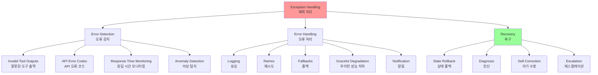
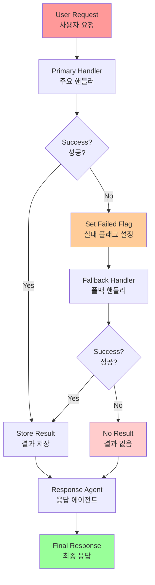
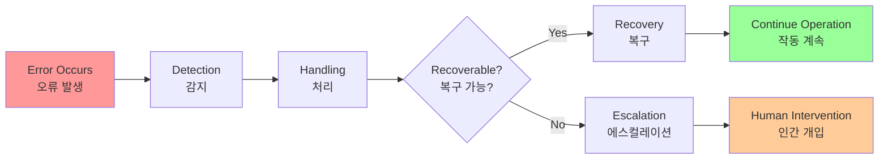
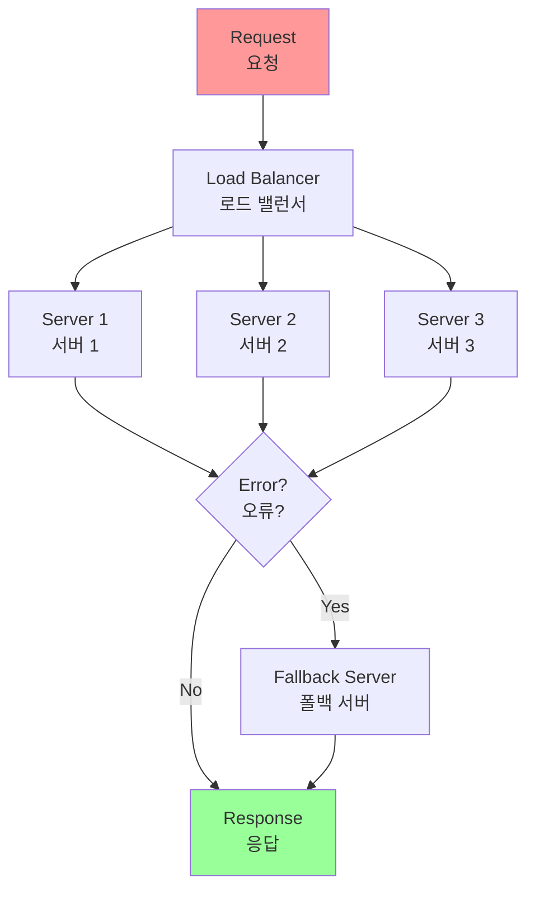

# Chapter 12: Exception Handling and Recovery

## 개요

For AI agents to operate reliably across diverse real-world environments, they must be capable of managing unexpected situations, errors, and malfunctions. Just as humans adapt to unforeseen obstacles, intelligent agents require robust systems that can detect problems, initiate recovery procedures, or at minimum, ensure controlled failure. These essential requirements form the foundation of the Exception Handling and Recovery pattern.

This pattern focuses on developing highly durable and resilient agents capable of maintaining uninterrupted functionality and operational integrity despite various difficulties and anomalies. It emphasizes the importance of both proactive preparation and reactive strategies to ensure continuous operation even when facing challenges.

AI 에이전트가 다양한 실제 세계 환경에서 신뢰할 수 있게 작동하려면 예상치 못한 상황, 오류 및 오작동을 관리할 수 있어야 합니다. 인간이 예상치 못한 장애물에 적응하는 것처럼, 지능형 에이전트는 문제를 감지하고, 복구 절차를 시작하거나, 최소한 제어된 실패를 보장하는 견고한 시스템이 필요합니다. 이러한 필수 요구사항이 Exception Handling and Recovery 패턴의 기초를 형성합니다.

이 패턴은 다양한 어려움과 이상에도 불구하고 중단 없는 기능과 운영 무결성을 유지할 수 있는 매우 내구성 있고 복원력 있는 에이전트를 개발하는 데 초점을 맞춥니다. 도전에 직면하더라도 지속적인 작동을 보장하기 위해 사전 예방적 준비와 반응적 전략의 중요성을 강조합니다.

## 패턴 개요 (Pattern Overview)

The Exception Handling and Recovery pattern addresses the need for AI agents to manage operational failures. This pattern involves anticipating potential issues, such as tool errors or service unavailability, and developing strategies to mitigate them.

Exception Handling and Recovery 패턴은 AI 에이전트가 운영 실패를 관리할 필요성을 다룹니다. 이 패턴은 도구 오류나 서비스 사용 불가와 같은 잠재적 문제를 예상하고 이를 완화하기 위한 전략을 개발하는 것을 포함합니다.



### 주요 구성 요소

#### 1. 오류 감지 (Error Detection)

Error Detection involves carefully identifying operational issues as they occur.

오류 감지는 운영 문제가 발생할 때 신중하게 식별하는 것을 포함합니다.

**감지 가능한 오류 유형**:
- **잘못되거나 잘못 형식화된 도구 출력**: 도구가 예상 형식과 다른 데이터를 반환
- **특정 API 오류**: 404 (Not Found), 500 (Internal Server Error) 등의 HTTP 오류 코드
- **비정상적으로 긴 응답 시간**: 서비스나 API의 응답 시간이 임계값을 초과
- **일관성 없는 응답**: 예상 형식에서 벗어나는 일관성 없고 의미 없는 응답
- **프로액티브 이상 탐지**: 다른 에이전트나 전문 모니터링 시스템을 통한 모니터링으로 문제가 확대되기 전에 잠재적 문제를 포착

#### 2. 오류 처리 (Error Handling)

When errors are detected, a carefully thought-out response plan is essential.

오류가 감지되면 신중하게 생각한 대응 계획이 필수적입니다.

**처리 전략**:
- **로깅 (Logging)**: 나중에 디버깅 및 분석을 위해 오류 세부사항을 로그에 기록
- **재시도 (Retries)**: 일시적 오류에 특히 유용한 전략으로, 행동이나 요청을 재시도 (때로는 약간 조정된 매개변수로)
- **폴백 (Fallbacks)**: 대체 전략이나 방법을 활용하여 일부 기능이 유지되도록 보장
- **우아한 성능 저하 (Graceful Degradation)**: 완전한 복구가 즉시 불가능한 경우, 에이전트가 부분 기능을 유지하여 최소한의 가치를 제공
- **알림 (Notification)**: 인간 개입이나 협업이 필요한 상황에서 인간 운영자나 다른 에이전트에게 알림

#### 3. 복구 (Recovery)

This stage is about restoring the agent or system to a stable and operational state after an error.

이 단계는 오류 후 에이전트나 시스템을 안정적이고 운영 가능한 상태로 복원하는 것에 관한 것입니다.

**복구 메커니즘**:
- **상태 롤백 (State Rollback)**: 최근 변경사항이나 트랜잭션을 되돌려 오류의 영향을 취소
- **진단 (Diagnosis)**: 오류의 원인에 대한 철저한 조사로 재발 방지에 중요
- **자기 수정 (Self-Correction)**: 자기 수정 메커니즘이나 재계획 프로세스를 통해 에이전트의 계획, 로직 또는 매개변수를 조정하여 동일한 오류를 미래에 피함
- **에스컬레이션 (Escalation)**: 복잡하거나 심각한 경우, 인간 운영자나 상위 수준 시스템에 문제를 위임하는 것이 최선의 조치일 수 있음

### Reflection과의 통합

This pattern can sometimes be used in conjunction with Reflection. For example, if an initial attempt fails and an exception occurs, a reflection process can analyze the failure and retry the task with a refined approach, such as an improved prompt, to resolve the error.

이 패턴은 때때로 Reflection과 함께 사용될 수 있습니다. 예를 들어, 초기 시도가 실패하고 예외가 발생하면, 반성 프로세스가 실패를 분석하고 개선된 프롬프트와 같은 정제된 접근 방식으로 작업을 재시도하여 오류를 해결할 수 있습니다.

## 실용적 응용 및 사용 사례 (Practical Applications & Use Cases)

Exception Handling and Recovery is critical for any agent deployed in real-world scenarios where perfect conditions cannot be guaranteed.

Exception Handling and Recovery는 완벽한 조건을 보장할 수 없는 실제 세계 시나리오에 배포된 모든 에이전트에게 중요합니다.

### 1. 고객 서비스 챗봇

챗봇이 고객 데이터베이스에 접근하려고 시도하는데 데이터베이스가 일시적으로 다운된 경우, 충돌하지 않아야 합니다.

**처리 방법**:
- API 오류를 감지
- 사용자에게 일시적인 문제에 대해 알림
- 나중에 다시 시도하도록 제안하거나
- 쿼리를 인간 에이전트에게 에스컬레이션

### 2. 자동화된 금융 거래

거래 봇이 거래를 실행하려고 시도할 때 "자금 부족" 오류나 "시장 마감" 오류를 만날 수 있습니다.

**처리 방법**:
- 오류를 로깅
- 동일한 잘못된 거래를 반복적으로 시도하지 않음
- 사용자에게 알리거나 전략을 조정

### 3. 스마트 홈 자동화

스마트 조명을 제어하는 에이전트가 네트워크 문제나 장치 오작동으로 인해 조명을 켜지 못할 수 있습니다.

**처리 방법**:
- 실패를 감지
- 재시도 시도
- 여전히 성공하지 못하면 사용자에게 조명을 켤 수 없었다고 알리고 수동 개입을 제안

### 4. 데이터 처리 에이전트

문서 배치를 처리하는 작업을 맡은 에이전트가 손상된 파일을 만날 수 있습니다.

**처리 방법**:
- 손상된 파일을 건너뜀
- 오류를 로깅
- 다른 파일 처리를 계속
- 프로세스 끝에 건너뛴 파일을 보고

### 5. 웹 스크래핑 에이전트

웹 스크래핑 에이전트가 CAPTCHA, 변경된 웹사이트 구조, 또는 서버 오류(예: 404 Not Found, 503 Service Unavailable)를 만날 때 우아하게 처리해야 합니다.

**처리 방법**:
- 일시 중지
- 프록시 사용
- 실패한 특정 URL 보고

### 6. 로봇 공학 및 제조

조립 작업을 수행하는 로봇 팔이 정렬 불량으로 인해 구성 요소를 집지 못할 수 있습니다.

**처리 방법**:
- 센서 피드백을 통해 실패를 감지
- 재조정 시도
- 집기 작업 재시도
- 지속적인 경우 인간 운영자에게 알리거나 다른 구성 요소로 전환

## 실습 코드 예제 (Hands-On Code Example)

### ADK를 사용한 견고한 위치 검색 시스템

이 예제는 ADK의 SequentialAgent를 사용하여 예외 처리 및 복구를 구현하는 견고한 위치 검색 시스템을 보여줍니다.

```python
from google.adk.agents import Agent, SequentialAgent

# 도구 정의 (예시)
def get_precise_location_info(address: str) -> dict:
    """
    정확한 위치 정보를 가져오는 도구.
    실패 시 예외를 발생시킬 수 있음.
    """
    # 실제 구현에서는 API 호출 등이 포함됨
    # 실패 시 예외 발생 가능
    pass

def get_general_area_info(city: str) -> dict:
    """
    일반 지역 정보를 가져오는 폴백 도구.
    정확한 주소가 실패할 때 사용됨.
    """
    # 실제 구현에서는 API 호출 등이 포함됨
    pass

# Agent 1: 주요 도구를 시도합니다. 초점이 좁고 명확합니다.
primary_handler = Agent(
    name="primary_handler",
    model="gemini-2.0-flash-exp",
    instruction="""
    Your job is to get precise location information.
    Use the get_precise_location_info tool with the user's provided address.
    If the tool call fails, set state["primary_location_failed"] = True.
    If successful, store the result in state["location_result"].
    """,
    tools=[get_precise_location_info]
)

# Agent 2: 폴백 핸들러 역할을 하며, 상태를 확인하여 작업을 결정합니다.
fallback_handler = Agent(
    name="fallback_handler",
    model="gemini-2.0-flash-exp",
    instruction="""
    Check if the primary location lookup failed by looking at state["primary_location_failed"].
    - If it is True, extract the city from the user's original query and use the get_general_area_info tool.
    - If it is False, do nothing.
    Store the result in state["location_result"] if you successfully retrieve information.
    """,
    tools=[get_general_area_info]
)

# Agent 3: 상태에서 최종 결과를 제시합니다.
response_agent = Agent(
    name="response_agent",
    model="gemini-2.0-flash-exp",
    instruction="""
    Review the location information stored in state["location_result"].
    Present this information clearly and concisely to the user.
    If state["location_result"] does not exist or is empty, apologize that you could not retrieve the location.
    """,
    tools=[]  # 이 에이전트는 최종 상태에 대해서만 추론합니다.
)

# SequentialAgent는 핸들러가 보장된 순서로 실행되도록 합니다.
robust_location_agent = SequentialAgent(
    name="robust_location_agent",
    sub_agents=[primary_handler, fallback_handler, response_agent]
)
```

### 코드 설명

이 코드는 ADK의 SequentialAgent를 사용하여 세 개의 하위 에이전트가 있는 견고한 위치 검색 시스템을 정의합니다:

**1. primary_handler (주요 핸들러)**:
- 첫 번째 에이전트로, `get_precise_location_info` 도구를 사용하여 정확한 위치 정보를 얻으려고 시도
- 실패 시 상태에 `primary_location_failed = True`를 설정

**2. fallback_handler (폴백 핸들러)**:
- 백업 역할을 하는 에이전트
- 상태 변수를 검사하여 주요 조회가 실패했는지 확인
- 주요 조회가 실패한 경우, 사용자 쿼리에서 도시를 추출하고 `get_general_area_info` 도구를 사용
- 성공적으로 정보를 검색한 경우 결과를 상태에 저장

**3. response_agent (응답 에이전트)**:
- 시퀀스의 최종 에이전트
- 상태에 저장된 위치 정보를 검토
- 최종 결과를 사용자에게 제시하도록 설계
- 위치 정보가 없는 경우 사과

**SequentialAgent의 역할**:
- 이 세 에이전트가 사전 정의된 순서로 실행되도록 보장
- 계층적 접근 방식을 통한 위치 정보 검색을 허용

### 예외 처리 흐름



## 한눈에 보기 (At a Glance)

### 무엇 (What)

실제 세계 환경에서 작동하는 AI 에이전트는 예상치 못한 상황, 오류 및 시스템 오작동을 불가피하게 만납니다. 이러한 중단은 도구 실패, 네트워크 문제, 잘못된 데이터에 이르기까지 다양하며, 에이전트가 작업을 완료하는 능력을 위협합니다. 이러한 문제를 관리하는 구조화된 방법 없이는 에이전트가 취약하고, 신뢰할 수 없으며, 예상치 못한 장애물에 직면할 때 완전한 실패에 취약할 수 있습니다.

### 왜 (Why)

Exception Handling and Recovery 패턴은 견고하고 복원력 있는 AI 에이전트를 구축하기 위한 표준화된 솔루션을 제공합니다. 도구 출력 및 API 응답을 모니터링하는 것과 같은 사전 예방적 오류 감지와, 진단을 위한 로깅, 일시적 실패 재시도, 또는 폴백 메커니즘 사용과 같은 반응적 처리 전략을 포함합니다. 더 심각한 문제의 경우, 안정적인 상태로 되돌리기, 계획을 조정하여 자기 수정, 또는 인간 운영자에게 문제를 에스컬레이션하는 것을 포함하는 복구 프로토콜을 정의합니다.

### 경험 법칙 (Rule of Thumb)

시스템 실패, 도구 오류, 네트워크 문제, 또는 예측할 수 없는 입력이 가능하고 운영 신뢰성이 주요 요구사항인 동적이고 실제 세계 환경에 배포된 모든 AI 에이전트에 대해 이 패턴을 사용하세요.

### 시각적 요약



## 핵심 요약 (Key Takeaways)

1. **Exception Handling and Recovery는 견고하고 신뢰할 수 있는 에이전트를 구축하는 데 필수적입니다**

2. **이 패턴은 오류를 감지하고, 우아하게 처리하며, 복구 전략을 구현하는 것을 포함합니다**

3. **오류 감지는 도구 출력 검증, API 오류 코드 확인, 타임아웃 사용을 포함할 수 있습니다**

4. **처리 전략에는 로깅, 재시도, 폴백, 우아한 성능 저하, 알림이 포함됩니다**

5. **복구는 진단, 자기 수정, 또는 에스컬레이션을 통해 안정적인 작동을 복원하는 데 초점을 맞춥니다**

6. **이 패턴은 에이전트가 예측할 수 없는 실제 세계 환경에서도 효과적으로 작동할 수 있도록 보장합니다**

7. **SequentialAgent와 같은 구조를 사용하여 계층적 오류 처리 및 복구를 구현할 수 있습니다**

8. **이 패턴은 Reflection과 결합하여 실패를 분석하고 개선된 접근 방식으로 재시도할 수 있습니다**

## 결론

이 챕터는 견고하고 신뢰할 수 있는 AI 에이전트를 개발하는 데 필수적인 Exception Handling and Recovery 패턴을 탐구했습니다. 이 패턴은 AI 에이전트가 예상치 못한 문제를 식별하고 관리하며, 적절한 응답을 구현하고, 안정적인 운영 상태로 복구하는 방법을 다룹니다.

이 챕터는 오류 감지, 로깅, 재시도, 폴백과 같은 메커니즘을 통한 오류 처리, 그리고 에이전트나 시스템을 적절한 기능으로 복원하는 데 사용되는 전략을 포함하여 이 패턴의 다양한 측면을 논의했습니다.

Exception Handling and Recovery 패턴의 실용적인 애플리케이션은 여러 도메인에서 설명되어 실제 세계의 복잡성과 잠재적 실패를 처리하는 데 관련성을 보여줍니다. 이러한 애플리케이션은 AI 에이전트에 예외 처리 기능을 갖추는 것이 동적 환경에서 신뢰성과 적응성에 기여하는 방법을 보여줍니다.

## 이론적 배경 및 학술적 근거 (Theoretical Background and Academic Foundation)

### 장애 허용 시스템 (Fault-Tolerant Systems)

장애 허용 시스템은 구성 요소의 실패에도 불구하고 정상 작동을 유지합니다.

**장애 허용 기법**:
- **중복 (Redundancy)**: 여러 백업 시스템
- **검사점 (Checkpointing)**: 상태 저장 및 복구
- **재시도 (Retry)**: 일시적 오류 처리
- **폴백 (Fallback)**: 대체 경로 제공

**에이전트 시스템에서의 적용**:
- 여러 도구 중 하나 실패 시 다른 도구 사용
- 상태 저장 및 롤백
- 일시적 오류에 대한 재시도
- 기본 동작으로 폴백

### 신뢰성 이론 (Reliability Theory)

신뢰성 이론은 시스템이 지정된 시간 동안 정상 작동할 확률을 연구합니다.

**신뢰성 메트릭**:
- **MTBF (Mean Time Between Failures)**: 평균 고장 간격
- **MTTR (Mean Time To Repair)**: 평균 수리 시간
- **가용성 (Availability)**: 시스템 사용 가능 시간 비율

**에이전트 시스템 신뢰성**:
- 구성 요소별 신뢰도 계산
- 시스템 전체 신뢰도 평가
- 신뢰도 향상을 위한 설계

### 오류 분류 이론

오류를 체계적으로 분류하여 적절한 처리 전략 수립:

**오류 유형**:
1. **일시적 오류 (Transient Errors)**: 재시도로 해결 가능
2. **영구적 오류 (Permanent Errors)**: 대체 방법 필요
3. **간헐적 오류 (Intermittent Errors)**: 패턴 분석 필요
4. **시스템 오류 (System Errors)**: 시스템 수준 처리 필요

**처리 전략**:
- 일시적 오류: 재시도
- 영구적 오류: 폴백
- 간헐적 오류: 패턴 분석 및 예방
- 시스템 오류: 에스컬레이션

### 방어적 프로그래밍 (Defensive Programming)

방어적 프로그래밍은 예상치 못한 입력이나 상황에 대비합니다.

**방어적 프로그래밍 원칙**:
- **입력 검증**: 모든 입력 검증
- **가정 검증**: 가정이 항상 참인지 확인
- **오류 처리**: 모든 오류 처리
- **로깅**: 상세한 로깅

**에이전트 시스템에서의 적용**:
- 사용자 입력 검증
- 도구 출력 검증
- 예외 상황 처리
- 포괄적 로깅

## 성능 최적화 기법 (Performance Optimization Techniques)

### 1. 지능형 재시도 전략

오류 유형에 따라 다른 재시도 전략:

```python
class IntelligentRetryStrategy:
    def __init__(self):
        self.retry_strategies = {
            'transient': ExponentialBackoff(max_retries=5),
            'rate_limit': LinearBackoff(max_retries=3),
            'timeout': FixedDelayBackoff(max_retries=2),
            'permanent': NoRetry()
        }
    
    def retry(self, error_type: str, operation: Callable):
        """오류 유형에 따른 재시도"""
        strategy = self.retry_strategies.get(error_type, NoRetry())
        return strategy.execute(operation)
```

### 2. 오류 예측 및 예방

오류 발생 전 예측 및 예방:

```python
class ErrorPredictor:
    def __init__(self):
        self.error_patterns = {}
    
    def analyze_error_history(self, history: List[Error]):
        """오류 패턴 분석"""
        # 오류 발생 패턴 식별
        patterns = self.identify_patterns(history)
        self.error_patterns = patterns
    
    def predict_error(self, current_state: dict) -> float:
        """오류 발생 확률 예측"""
        risk_score = 0.0
        for pattern, probability in self.error_patterns.items():
            if pattern.matches(current_state):
                risk_score += probability
        
        return min(1.0, risk_score)
    
    def prevent_error(self, predicted_risk: float):
        """예측된 오류 예방"""
        if predicted_risk > 0.7:
            # 예방 조치 실행
            self.take_preventive_measures()
```

### 3. 회로 차단기 패턴 (Circuit Breaker Pattern)

연속 실패 시 요청 차단:

```python
class CircuitBreaker:
    def __init__(self, failure_threshold=5, timeout=60):
        self.failure_count = 0
        self.failure_threshold = failure_threshold
        self.timeout = timeout
        self.state = 'closed'  # closed, open, half-open
        self.last_failure_time = None
    
    def call(self, operation: Callable):
        """회로 차단기를 통한 작업 실행"""
        if self.state == 'open':
            if time.time() - self.last_failure_time > self.timeout:
                self.state = 'half-open'
            else:
                raise CircuitBreakerOpenError()
        
        try:
            result = operation()
            if self.state == 'half-open':
                self.state = 'closed'
                self.failure_count = 0
            return result
        except Exception as e:
            self.failure_count += 1
            self.last_failure_time = time.time()
            
            if self.failure_count >= self.failure_threshold:
                self.state = 'open'
            
            raise
```

### 4. 격리 및 견고성 (Isolation and Resilience)

오류 전파 방지:

```python
class IsolatedComponent:
    def __init__(self, component: Component):
        self.component = component
        self.isolation_enabled = True
    
    def execute(self, *args, **kwargs):
        """격리된 환경에서 실행"""
        try:
            return self.component.execute(*args, **kwargs)
        except Exception as e:
            if self.isolation_enabled:
                # 오류를 격리하여 다른 컴포넌트에 영향 없음
                self.log_error(e)
                return self.fallback_response()
            else:
                raise
```

## 트레이드오프 및 한계점 (Trade-offs and Limitations)

### Exception Handling의 장점

1. **견고성**: 오류 상황에서도 시스템 작동
2. **신뢰성**: 사용자 경험 향상
3. **디버깅**: 상세한 오류 정보 제공
4. **복구**: 자동 복구 메커니즘

### Exception Handling의 한계

1. **복잡도 증가**: 오류 처리 로직 추가
2. **성능 오버헤드**: 오류 검사 및 처리 비용
3. **오류 숨김**: 중요한 오류가 숨겨질 수 있음
4. **테스트 어려움**: 오류 시나리오 테스트 복잡

### 완화 전략

1. **구조화된 오류 처리**: 일관된 오류 처리 패턴
2. **선택적 오류 처리**: 중요한 오류만 처리
3. **오류 로깅**: 모든 오류 상세 기록
4. **오류 테스트**: 체계적인 오류 시나리오 테스트

## 관련 패턴과의 비교 (Comparison with Related Patterns)

### Exception Handling vs. Fail-Safe Design

| 특성 | Fail-Safe Design | Exception Handling |
|------|-----------------|-------------------|
| 접근 | 사전 예방 | 사후 처리 |
| 복잡도 | 낮음 | 높음 |
| 유연성 | 낮음 | 높음 |
| 적합한 시나리오 | 예측 가능한 오류 | 예측 불가능한 오류 |

### Exception Handling vs. Graceful Degradation

- **Exception Handling**: 오류 발생 시 처리
- **Graceful Degradation**: 기능 축소로 서비스 유지
- **결합**: 오류 처리 후 우아한 성능 저하

## 실무 적용 사례 확장 (Extended Practical Applications)

### 1. 고가용성 웹 서비스

다중 계층 오류 처리:



### 2. 분산 데이터 처리 시스템

데이터 처리 파이프라인의 오류 처리:

```python
class ResilientDataPipeline:
    def __init__(self):
        self.stages = []
        self.checkpoints = {}
    
    def add_stage(self, stage: ProcessingStage):
        """처리 단계 추가"""
        self.stages.append(stage)
    
    def execute_with_recovery(self, data: Data):
        """복구 가능한 실행"""
        for i, stage in enumerate(self.stages):
            try:
                # 체크포인트 저장
                self.checkpoints[i] = data.snapshot()
                
                # 단계 실행
                data = stage.process(data)
            except Exception as e:
                # 오류 발생 시 이전 체크포인트로 복구
                if i > 0:
                    data = self.checkpoints[i-1].restore()
                    # 대체 처리 방법 시도
                    data = stage.fallback_process(data)
                else:
                    raise
        
        return data
```

### 3. 자율 주행 시스템

안전을 위한 다중 오류 처리:

- **센서 오류**: 여러 센서로 검증
- **계산 오류**: 다중 계산 및 비교
- **통신 오류**: 백업 통신 채널
- **시스템 오류**: 안전 모드로 전환

## 참고 자료 (References)

### 학술 논문

1. Avizienis, A., et al. (2004). "Basic concepts and taxonomy of dependable and secure computing." *IEEE Transactions on Dependable and Secure Computing*, 1(1), 11-33.

2. Gray, J., & Reuter, A. (1993). *Transaction Processing: Concepts and Techniques*. Morgan Kaufmann.

3. Shi, Y., Pei, H., Feng, L., Zhang, Y., & Yao, D. (2024). "Towards Fault Tolerance in Multi-Agent Reinforcement Learning." *arXiv preprint arXiv:2412.00534*.

4. O'Neill, V. (2022). "Improving Fault Tolerance and Reliability of Heterogeneous Multi-Agent IoT Systems Using Intelligence Transfer." *Electronics*, 11(17), 2724.

5. Hystrix: Latency and Fault Tolerance for Distributed Systems:
   https://github.com/Netflix/Hystrix

### 프레임워크 및 도구 문서

1. Google ADK SequentialAgent Documentation:
   https://google.github.io/adk-docs/agents/multi-agents/

2. Python Exception Handling:
   https://docs.python.org/3/tutorial/errors.html

### 추가 학습 자료

3. McConnell, S. (2004). *Code Complete* (2nd ed.). Microsoft Press.

4. "Release It!" by Michael Nygard - Production-Ready Software

5. "Designing Data-Intensive Applications" by Martin Kleppmann

6. "Building Microservices" by Sam Newman - Resilience Patterns

---

**이전 챕터**: [Chapter 11: Goal Setting and Monitoring](chapter_11_Goal_Setting_and_Monitoring.md)  
**다음 챕터**: [Chapter 13: Human-in-the-Loop](chapter_13_Human-in-the-Loop.md)

