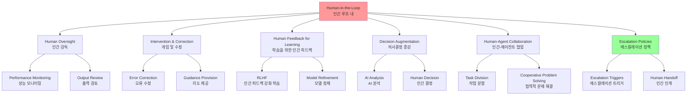
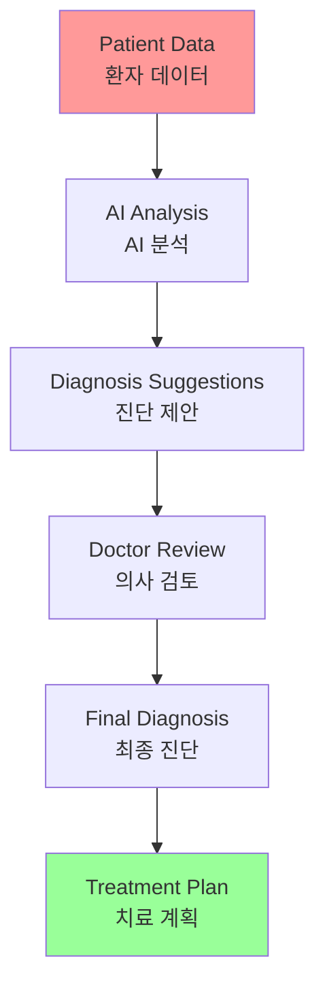

# Chapter 13: Human-in-the-Loop

## 개요

The Human-in-the-Loop (HITL) pattern represents a critical strategy in agent development and deployment. It deliberately combines the unique strengths of human cognition—such as judgment, creativity, and nuanced understanding—with AI's computational power and efficiency. This strategic integration is not merely an option but often essential, especially as AI systems become increasingly embedded in critical decision-making processes.

The core principle of HITL is ensuring that AI operates within ethical boundaries, adheres to safety protocols, and achieves its objectives with optimal effectiveness. These concerns are particularly acute in domains characterized by complexity, ambiguity, or significant risk, where the implications of AI errors or misinterpretations can be substantial.

Human-in-the-Loop (HITL) 패턴은 에이전트의 개발 및 배포에서 중요한 전략을 나타냅니다. 판단, 창의성, 미묘한 이해와 같은 인간 인지의 고유한 강점을 AI의 계산 능력과 효율성과 의도적으로 결합합니다. 이러한 전략적 통합은 단순한 선택이 아니라 종종 필수적이며, 특히 AI 시스템이 중요한 의사결정 프로세스에 점점 더 내장됨에 따라 더욱 그렇습니다.

HITL의 핵심 원칙은 AI가 윤리적 경계 내에서 작동하고, 안전 프로토콜을 준수하며, 최적의 효과로 목표를 달성하도록 보장하는 것입니다. 이러한 우려는 복잡성, 모호성 또는 상당한 위험이 특징인 도메인에서 특히 심각하며, AI 오류나 오해석의 의미가 상당할 수 있습니다.

## 패턴 개요 (Pattern Overview)

The Human-in-the-Loop (HITL) pattern integrates artificial intelligence and human input to enhance agent capabilities. This approach acknowledges that optimal AI performance often requires a combination of automated processing and human insight, particularly in scenarios with high complexity or ethical considerations.

Human-in-the-Loop (HITL) 패턴은 인공지능과 인간 입력을 통합하여 에이전트 기능을 향상시킵니다. 이 접근 방식은 최적의 AI 성능이 종종 자동화된 처리와 인간의 통찰력의 조합을 필요로 하며, 특히 높은 복잡성이나 윤리적 고려사항이 있는 시나리오에서 그렇다는 것을 인정합니다.



### 주요 측면

#### 1. 인간 감독 (Human Oversight)

Human Oversight involves monitoring AI agent performance and outputs.

인간 감독은 AI 에이전트 성능 및 출력을 모니터링하는 것을 포함합니다.

**방법**:
- 로그 검토를 통한 모니터링
- 실시간 대시보드를 통한 모니터링
- 가이드라인 준수 보장
- 바람직하지 않은 결과 방지

#### 2. 개입 및 수정 (Intervention and Correction)

Intervention and Correction allows AI agents to request human intervention when encountering errors or ambiguous scenarios.

개입 및 수정은 AI 에이전트가 오류나 모호한 시나리오를 만날 때 인간 개입을 요청할 수 있게 합니다.

**역할**:
- 인간 운영자가 오류를 수정
- 누락된 데이터 제공
- 에이전트를 안내
- 미래 에이전트 개선에 정보 제공

#### 3. 학습을 위한 인간 피드백 (Human Feedback for Learning)

Human Feedback for Learning is collected and used to refine AI models, prominently featured in Reinforcement Learning with Human Feedback (RLHF) methodologies, where human preferences directly influence the agent's learning trajectory.

학습을 위한 인간 피드백은 수집되고 AI 모델을 정제하는 데 사용되며, 인간 선호도가 에이전트의 학습 궤적에 직접 영향을 미치는 강화 학습과 인간 피드백(RLHF) 방법론에서 두드러집니다.

#### 4. 의사결정 증강 (Decision Augmentation)

Decision Augmentation is where AI agents provide analysis and recommendations to humans, and humans make the final decisions.

의사결정 증강은 AI 에이전트가 분석 및 권장사항을 인간에게 제공하고, 인간이 최종 결정을 내리는 곳입니다.

**특징**:
- AI 생성 통찰을 통해 인간 의사결정 향상
- 완전한 자율성보다는 증강

#### 5. 인간-에이전트 협업 (Human-Agent Collaboration)

Human-Agent Collaboration is a cooperative interaction where humans and AI agents contribute their respective strengths.

인간-에이전트 협업은 인간과 AI 에이전트가 각각의 강점을 기여하는 협력적 상호작용입니다.

**작업 분할**:
- 에이전트: 일상적인 데이터 처리
- 인간: 창의적 문제 해결 또는 복잡한 협상

#### 6. 에스컬레이션 정책 (Escalation Policies)

에이전트가 인간 운영자에게 작업을 에스컬레이션해야 하는 시기와 방법을 규정하는 확립된 프로토콜입니다.

**목적**: 에이전트의 능력을 넘어서는 상황에서 오류를 방지

### 주의사항 (Caveats)

HITL 패턴은 이점이 있지만 중요한 주의사항이 있습니다:

#### 1. 확장성 부족

인간 감독은 높은 정확도를 제공하지만, 운영자는 수백만 개의 작업을 관리할 수 없어 근본적인 트레이드오프를 만듭니다.

**해결책**: 규모를 위한 자동화와 정확도를 위한 HITL을 결합한 하이브리드 접근 방식이 종종 필요합니다.

#### 2. 전문성 의존성

이 패턴의 효과는 인간 운영자의 전문성에 크게 의존합니다.

**예시**: AI가 소프트웨어 코드를 생성할 수 있지만, 숙련된 개발자만이 미묘한 오류를 정확히 식별하고 수정을 위한 올바른 지도를 제공할 수 있습니다.

#### 3. 프라이버시 우려

HITL 구현은 중요한 프라이버시 우려를 제기합니다.

**요구사항**: 민감한 정보는 인간 운영자에게 노출되기 전에 종종 엄격하게 익명화되어야 하며, 프로세스 복잡성의 또 다른 계층을 추가합니다.

## 실용적 응용 및 사용 사례 (Practical Applications & Use Cases)

Human-in-the-Loop 패턴은 정확성, 안전성, 윤리 또는 미묘한 이해가 가장 중요한 광범위한 산업 및 애플리케이션에서 필수적입니다.

### 1. 콘텐츠 조정

AI 에이전트는 위반 사항(예: 혐오 발언, 스팸)에 대해 대량의 온라인 콘텐츠를 빠르게 필터링할 수 있습니다.

**HITL 역할**: 모호한 사례나 경계선 콘텐츠는 인간 조정자에게 에스컬레이션되어 검토 및 최종 결정을 보장합니다.

### 2. 자율 주행

자율 주행 차량은 대부분의 운전 작업을 자율적으로 처리하지만, AI가 자신 있게 탐색할 수 없는 복잡하고 예측할 수 없거나 위험한 상황에서 인간 운전자에게 제어권을 넘기도록 설계되었습니다.

**예시**: 극단적인 날씨, 비정상적인 도로 조건

### 3. 금융 사기 탐지

AI 시스템은 패턴을 기반으로 의심스러운 거래를 플래그 지정할 수 있습니다.

**HITL 역할**: 높은 위험 또는 모호한 경고는 종종 인간 분석가에게 전송되어 추가 조사, 고객 연락, 거래가 사기인지 여부에 대한 최종 결정을 내립니다.

### 4. 법률 문서 검토

AI는 수천 개의 법률 문서를 빠르게 스캔하고 분류하여 관련 조항이나 증거를 식별할 수 있습니다.

**HITL 역할**: 인간 법률 전문가가 AI의 발견을 정확성, 맥락 및 법적 의미에 대해 검토하며, 특히 중요한 사건의 경우 그렇습니다.

### 5. 고객 지원 (복잡한 쿼리)

챗봇은 일상적인 고객 문의를 처리할 수 있습니다.

**HITL 역할**: 사용자의 문제가 너무 복잡하거나, 감정적으로 충전되었거나, AI가 제공할 수 없는 공감이 필요한 경우, 대화가 원활하게 인간 지원 에이전트에게 넘겨집니다.

### 6. 데이터 라벨링 및 주석

AI 모델은 종종 훈련을 위해 라벨된 데이터의 대규모 데이터셋이 필요합니다.

**HITL 역할**: 인간이 이미지, 텍스트 또는 오디오를 정확하게 라벨하여 AI가 학습하는 근거를 제공합니다. 이는 모델이 진화함에 따라 지속적인 프로세스입니다.

### 7. 생성 AI 정제

LLM이 창의적 콘텐츠(예: 마케팅 카피, 디자인 아이디어)를 생성할 때, 인간 편집자나 디자이너가 출력을 검토하고 정제합니다.

**목적**: 브랜드 가이드라인을 충족하고, 대상 청중과 공명하며, 품질을 유지하도록 보장

### 8. 자율 네트워크

AI 시스템은 주요 성능 지표(KPI)와 식별된 패턴을 활용하여 경고를 분석하고 네트워크 문제 및 트래픽 이상을 예측할 수 있습니다.

**HITL 역할**: 중요한 결정(예: 높은 위험 경고 처리)은 종종 인간 분석가에게 에스컬레이션되어 추가 조사를 수행하고 네트워크 변경 승인에 대한 최종 결정을 내립니다.

### Human-on-the-Loop 변형

"Human-on-the-loop"는 이 패턴의 변형으로, 인간 전문가가 전체 정책을 정의하고 AI가 즉각적인 행동을 처리하여 준수를 보장합니다.

#### 예시 1: 자동화된 금융 거래 시스템

**인간의 역할**: 인간 금융 전문가가 전체 투자 전략과 규칙을 설정합니다.

**정책 예시**:
- "포트폴리오를 70% 기술 주식과 30% 채권으로 유지"
- "단일 회사에 5% 이상 투자하지 않음"
- "구매 가격보다 10% 하락한 모든 주식을 자동 판매"

**AI의 역할**: AI는 실시간으로 주식 시장을 모니터링하고 이러한 사전 정의된 조건이 충족될 때 즉시 거래를 실행합니다.

#### 예시 2: 현대 콜 센터

**인간의 역할**: 인간 관리자가 고객 상호작용에 대한 고수준 정책을 설정합니다.

**정책 예시**:
- "'서비스 중단'을 언급하는 모든 통화는 즉시 기술 지원 전문가에게 라우팅"
- "고객의 음성 톤이 높은 좌절을 나타내는 경우, 시스템은 직접 인간 에이전트에게 연결을 제공해야 함"

**AI의 역할**: AI 시스템은 초기 고객 상호작용을 처리하고, 실시간으로 그들의 요구를 듣고 해석하며, 각 개별 사례에 대해 인간 개입 없이 관리자의 정책을 자율적으로 실행합니다.

## 실습 코드 예제 (Hands-On Code Example)

### ADK를 사용한 기술 지원 에이전트

이 예제는 ADK 에이전트가 인간 검토가 필요한 시나리오를 식별하고 에스컬레이션 프로세스를 시작할 수 있는 방법을 보여줍니다.

```python
from google.adk.agents import Agent
from google.adk.tools.tool_context import ToolContext
from google.adk.callbacks import CallbackContext
from google.adk.models.llm import LlmRequest
from google.genai import types
from typing import Optional

# 도구 정의 (실제 구현으로 대체 필요)
def troubleshoot_issue(issue: str) -> dict:
    """기술 문제를 해결하는 도구"""
    return {
        "status": "success",
        "report": f"Troubleshooting steps for {issue}."
    }

def create_ticket(issue_type: str, details: str) -> dict:
    """지원 티켓을 생성하는 도구"""
    return {
        "status": "success",
        "ticket_id": "TICKET123"
    }

def escalate_to_human(issue_type: str) -> dict:
    """인간 전문가에게 에스컬레이션하는 도구"""
    # 실제 시스템에서는 이것이 일반적으로 인간 큐로 전송됨
    return {
        "status": "success",
        "message": f"Escalated {issue_type} to a human specialist."
    }

# 기술 지원 에이전트 정의
technical_support_agent = Agent(
    name="technical_support_specialist",
    model="gemini-2.0-flash-exp",
    instruction="""
    You are a technical support specialist for our electronics company.
    
    FIRST, check if the user has a support history in state["customer_info"]["support_history"]. 
    If they do, reference this history in your responses.
    
    For technical issues:
    1. Use the troubleshoot_issue tool to analyze the problem.
    2. Guide the user through basic troubleshooting steps.
    3. If the issue persists, use create_ticket to log the issue.
    
    For complex issues beyond basic troubleshooting:
    1. Use escalate_to_human to transfer to a human specialist.
    
    Maintain a professional but empathetic tone. Acknowledge the frustration technical 
    issues can cause, while providing clear steps toward resolution.
    """,
    tools=[troubleshoot_issue, create_ticket, escalate_to_human]
)

# 개인화 콜백 함수
def personalization_callback(
    callback_context: CallbackContext,
    llm_request: LlmRequest
) -> Optional[LlmRequest]:
    """LLM 요청에 개인화 정보를 추가합니다."""
    # 상태에서 고객 정보 가져오기
    customer_info = callback_context.state.get("customer_info")
    
    if customer_info:
        customer_name = customer_info.get("name", "valued customer")
        customer_tier = customer_info.get("tier", "standard")
        recent_purchases = customer_info.get("recent_purchases", [])
        
        personalization_note = (
            f"\nIMPORTANT PERSONALIZATION:\n"
            f"Customer Name: {customer_name}\n"
            f"Customer Tier: {customer_tier}\n"
        )
        
        if recent_purchases:
            personalization_note += f"Recent Purchases: {', '.join(recent_purchases)}\n"
        
        if llm_request.contents:
            # 첫 번째 콘텐츠 전에 시스템 메시지로 추가
            system_content = types.Content(
                role="system",
                parts=[types.Part(text=personalization_note)]
            )
            llm_request.contents.insert(0, system_content)
    
    return None  # 수정된 요청으로 계속 진행
```

### 코드 설명

이 코드는 Google의 ADK를 사용하여 HITL 프레임워크를 중심으로 설계된 기술 지원 에이전트를 만드는 청사진을 제공합니다.

**에이전트 구조**:
- **지능형 첫 번째 지원 라인**: 특정 지시사항으로 구성되고 `troubleshoot_issue`, `create_ticket`, `escalate_to_human`과 같은 도구로 완전한 지원 워크플로우를 관리
- **에스컬레이션 도구**: HITL 설계의 핵심 부분으로, 복잡하거나 민감한 사례가 인간 전문가에게 전달되도록 보장

**개인화 기능**:
- **전용 콜백 함수**: LLM에 연락하기 전에 에이전트의 상태에서 고객별 데이터(이름, 등급, 구매 기록)를 동적으로 검색
- **컨텍스트 주입**: 이 컨텍스트가 시스템 메시지로 프롬프트에 주입되어 에이전트가 사용자 기록을 참조하는 고도로 맞춤화되고 정보에 입각한 응답을 제공할 수 있게 함

**결과**: 구조화된 워크플로우, 필수 인간 감독, 동적 개인화를 결합하여 이 코드는 ADK가 정교하고 견고한 AI 지원 솔루션 개발을 용이하게 하는 방법의 실용적인 예제로 작용합니다.

## 한눈에 보기 (At a Glance)

### 무엇 (What)

고급 LLM을 포함한 AI 시스템은 미묘한 판단, 윤리적 추론, 또는 복잡하고 모호한 맥락에 대한 깊은 이해가 필요한 작업에서 종종 어려움을 겪습니다. 높은 위험 환경에서 완전 자율 AI를 배포하는 것은 오류가 심각한 안전, 재정적 또는 윤리적 결과로 이어질 수 있기 때문에 상당한 위험을 수반합니다.

### 왜 (Why)

Human-in-the-Loop (HITL) 패턴은 AI 워크플로우에 인간 감독을 전략적으로 통합하여 표준화된 솔루션을 제공합니다. 이 에이전트 접근 방식은 AI가 계산적 무거운 작업과 데이터 처리를 처리하고, 인간이 중요한 검증, 피드백 및 개입을 제공하는 공생적 파트너십을 만듭니다.

### 경험 법칙 (Rule of Thumb)

의료, 금융 또는 자율 시스템과 같이 오류가 중요한 안전, 윤리적 또는 재정적 결과를 가진 도메인에서 AI를 배포할 때 이 패턴을 사용하세요. LLM이 신뢰할 수 있게 처리할 수 없는 모호성과 미묘함을 포함하는 작업(예: 콘텐츠 조정 또는 복잡한 고객 지원 에스컬레이션)에 필수적입니다.

## 핵심 요약 (Key Takeaways)

1. **Human-in-the-Loop (HITL)는 AI 워크플로우에 인간 지능과 판단을 통합합니다**

2. **복잡하거나 높은 위험 시나리오에서 안전, 윤리 및 효과에 중요합니다**

3. **주요 측면에는 인간 감독, 개입, 학습을 위한 피드백, 의사결정 증강이 포함됩니다**

4. **에스컬레이션 정책은 에이전트가 인간에게 인계해야 하는 시기를 아는 데 필수적입니다**

5. **HITL은 책임 있는 AI 배포와 지속적인 개선을 허용합니다**

6. **Human-in-the-Loop의 주요 단점은 고유한 확장성 부족으로, 정확도와 볼륨 사이의 트레이드오프를 만들고, 효과적인 개입을 위해 고도로 숙련된 도메인 전문가에 대한 의존성입니다**

7. **구현은 데이터 생성을 위해 인간 운영자를 훈련할 필요성과 민감한 정보를 익명화하여 프라이버시 우려를 해결하는 것을 포함하는 운영적 도전을 제시합니다**

## 결론

이 챕터는 견고하고 안전하며 윤리적인 AI 시스템을 만드는 데 중요한 역할을 하는 중요한 Human-in-the-Loop (HITL) 패턴을 탐구했습니다. 에이전트 워크플로우에 인간 감독, 개입 및 피드백을 통합하는 것이 특히 복잡하고 민감한 도메인에서 성능과 신뢰성을 크게 향상시킬 수 있는 방법을 논의했습니다.

실용적인 애플리케이션은 콘텐츠 조정 및 의료 진단부터 자율 주행 및 고객 지원에 이르기까지 HITL의 광범위한 유용성을 보여줍니다. 개념적 코드 예제는 ADK가 에스컬레이션 메커니즘을 통해 이러한 인간-에이전트 상호작용을 용이하게 하는 방법을 엿볼 수 있게 했습니다.

AI 기능이 계속 발전함에 따라 HITL은 책임 있는 AI 개발의 초석으로 남아 있으며, 인간 가치와 전문성이 지능형 시스템 설계의 중심에 남아 있도록 보장합니다.

## 이론적 배경 및 학술적 근거 (Theoretical Background and Academic Foundation)

### 인간-컴퓨터 상호작용 (Human-Computer Interaction, HCI)

HITL은 HCI의 핵심 원칙을 구현합니다. Norman(2013)의 사용자 중심 설계는 시스템이 사용자의 능력과 제한을 고려해야 한다고 강조합니다.

**HCI 원칙**:
- **사용성 (Usability)**: 시스템 사용의 용이성
- **접근성 (Accessibility)**: 다양한 사용자 접근
- **피드백**: 사용자 행동에 대한 즉각적 피드백
- **오류 방지**: 사용자 오류 방지 및 복구

**에이전트 시스템에서의 적용**:
- 직관적인 인터페이스 제공
- 명확한 피드백 메커니즘
- 오류 복구 지원
- 사용자 제어권 보장

### 협업 AI (Collaborative AI)

협업 AI는 인간과 AI가 각자의 강점을 활용하여 협력합니다.

**협업 모델**:
- **인간 주도**: 인간이 결정, AI가 지원
- **AI 주도**: AI가 결정, 인간이 감독
- **상호 협력**: 인간과 AI가 동등하게 협력

**에이전트 시스템에서의 구현**:
- 에이전트가 제안, 인간이 최종 결정
- 복잡한 작업은 인간에게 에스컬레이션
- 인간 피드백으로 에이전트 개선

### 윤리적 AI (Ethical AI)

HITL은 윤리적 AI의 핵심 구성 요소입니다.

**윤리적 원칙**:
- **투명성**: 의사결정 과정 공개
- **책임성**: 의사결정 책임 명확
- **공정성**: 편향 없는 의사결정
- **인간 존중**: 인간의 자율성 존중

**에이전트 시스템에서의 구현**:
- 의사결정 근거 제공
- 인간 감독 및 개입 메커니즘
- 편향 검사 및 완화
- 사용자 제어권 보장

### 인지 부하 이론 (Cognitive Load Theory)

Sweller(1988)의 인지 부하 이론은 작업의 복잡도가 인간의 인지 능력에 미치는 영향을 설명합니다.

**인지 부하 유형**:
- **내재적 부하**: 작업 자체의 복잡도
- **외재적 부하**: 표현 방식으로 인한 부하
- **관련 부하**: 학습에 기여하는 부하

**에이전트 시스템 설계**:
- 복잡한 작업을 AI에 위임하여 인간 부하 감소
- 명확한 정보 표현으로 외재적 부하 감소
- 학습 기회 제공으로 관련 부하 증가

## 성능 최적화 기법 (Performance Optimization Techniques)

### 1. 적응형 에스컬레이션

신뢰도에 따라 자동 에스컬레이션:

```python
class AdaptiveEscalation:
    def __init__(self, confidence_threshold=0.8):
        self.confidence_threshold = confidence_threshold
    
    def should_escalate(self, agent_response: Response) -> bool:
        """에스컬레이션 필요 여부 판단"""
        # 신뢰도가 낮으면 에스컬레이션
        if agent_response.confidence < self.confidence_threshold:
            return True
        
        # 위험도가 높으면 에스컬레이션
        if agent_response.risk_level > 0.7:
            return True
        
        return False
    
    def escalate(self, context: dict) -> HumanResponse:
        """인간에게 에스컬레이션"""
        # 컨텍스트와 함께 인간에게 전달
        human_response = await human_reviewer.review(context)
        return human_response
```

### 2. 인간 피드백 학습

인간 피드백을 통한 지속적 개선:

```python
class HumanFeedbackLearning:
    def __init__(self):
        self.feedback_history = []
        self.improvement_model = None
    
    def collect_feedback(self, agent_output: Output, human_feedback: Feedback):
        """인간 피드백 수집"""
        self.feedback_history.append({
            'output': agent_output,
            'feedback': human_feedback,
            'timestamp': datetime.now()
        })
    
    def learn_from_feedback(self):
        """피드백으로부터 학습"""
        # 피드백 패턴 분석
        patterns = self.analyze_feedback_patterns()
        
        # 에이전트 개선
        self.improve_agent(patterns)
    
    def improve_agent(self, patterns: List[Pattern]):
        """에이전트 개선"""
        for pattern in patterns:
            # 패턴에 따라 에이전트 동작 수정
            self.agent.adjust_behavior(pattern)
```

### 3. 협업 인터페이스 최적화

효율적인 인간-AI 협업을 위한 인터페이스:

```python
class CollaborativeInterface:
    def __init__(self):
        self.interaction_history = []
    
    def present_suggestion(self, ai_suggestion: Suggestion):
        """AI 제안을 인간에게 제시"""
        # 제안의 근거 제공
        explanation = ai_suggestion.explain()
        
        # 인간이 쉽게 이해할 수 있는 형식
        formatted = self.format_for_human(explanation)
        
        # 인간의 결정 대기
        human_decision = self.wait_for_human_decision(formatted)
        
        return human_decision
    
    def format_for_human(self, explanation: Explanation) -> str:
        """인간이 이해하기 쉬운 형식으로 변환"""
        # 기술적 용어를 일반 용어로 변환
        # 시각적 표현 추가
        # 핵심 정보 강조
        return simplified_explanation
```

### 4. 인간 전문성 활용

도메인 전문가의 지식 활용:

```python
class ExpertKnowledgeIntegration:
    def __init__(self):
        self.expert_profiles = {}
    
    def route_to_expert(self, task: Task) -> Expert:
        """작업을 적절한 전문가에게 라우팅"""
        # 작업 유형 분석
        task_type = self.analyze_task_type(task)
        
        # 전문가 매칭
        expert = self.find_expert(task_type)
        
        return expert
    
    def integrate_expert_feedback(self, expert_feedback: Feedback):
        """전문가 피드백 통합"""
        # 피드백을 지식 기반에 추가
        self.knowledge_base.add_expert_knowledge(expert_feedback)
        
        # 에이전트 업데이트
        self.agent.update_with_expert_knowledge(expert_feedback)
```

## 트레이드오프 및 한계점 (Trade-offs and Limitations)

### HITL의 장점

1. **정확도 향상**: 인간 판단으로 정확도 향상
2. **신뢰성**: 인간 감독으로 신뢰성 향상
3. **윤리적 안전**: 윤리적 의사결정 보장
4. **적응성**: 인간 피드백으로 지속적 개선

### HITL의 한계

1. **확장성**: 인간 개입으로 인한 확장성 제한
2. **비용**: 인간 운영자 비용
3. **지연 시간**: 인간 응답 대기 시간
4. **일관성**: 인간 판단의 변동성

### 완화 전략

1. **선택적 HITL**: 중요한 경우만 인간 개입
2. **자동화**: 반복 작업 자동화
3. **비동기 처리**: 비동기로 인간 검토
4. **가이드라인**: 일관된 판단을 위한 가이드라인

## 관련 패턴과의 비교 (Comparison with Related Patterns)

### HITL vs. Fully Autonomous Systems

| 특성 | Fully Autonomous | HITL |
|------|-----------------|------|
| 속도 | 빠름 | 느림 |
| 정확도 | 변동적 | 높음 |
| 확장성 | 높음 | 제한적 |
| 신뢰성 | 중간 | 높음 |

### HITL vs. Human-on-the-Loop

- **HITL**: 인간이 루프 내에서 적극적 참여
- **Human-on-the-Loop**: 인간이 루프 밖에서 감독
- **선택**: 작업 특성에 따라 선택

## 실무 적용 사례 확장 (Extended Practical Applications)

### 1. 의료 진단 지원 시스템

의사와 AI의 협업:



### 2. 콘텐츠 조정 시스템

인간과 AI가 협력하여 콘텐츠 조정:

- **AI 1차 필터링**: 명확한 위반 사례 자동 차단
- **인간 검토**: 모호한 사례 인간 검토
- **피드백 학습**: 인간 판단으로 AI 개선

### 3. 금융 거래 승인 시스템

고액 거래의 인간 승인:

```python
class FinancialTransactionAgent:
    def __init__(self, approval_threshold=10000):
        self.approval_threshold = approval_threshold
    
    def process_transaction(self, transaction: Transaction):
        """거래 처리"""
        # 거래 분석
        risk_score = self.analyze_risk(transaction)
        
        # 금액 또는 리스크가 높으면 인간 승인 필요
        if (transaction.amount > self.approval_threshold or 
            risk_score > 0.7):
            # 인간 승인 요청
            approval = self.request_human_approval(transaction)
            if not approval.approved:
                return TransactionResult(rejected=True)
        
        # 거래 실행
        return self.execute_transaction(transaction)
```

## 참고 자료 (References)

### 학술 논문

1. Wu, X., et al. (2021). "A Survey of Human-in-the-loop for Machine Learning." *arXiv preprint arXiv:2108.00941*.

2. Amershi, S., et al. (2014). "Power to the People: The Role of Humans in Interactive Machine Learning." *AI Magazine*, 35(4), 105-120.

3. Norman, D. (2013). *The Design of Everyday Things* (Revised ed.). Basic Books.

4. Sweller, J. (1988). "Cognitive load during problem solving: Effects on learning." *Cognitive Science*, 12(2), 257-285.

5. Bansal, G., et al. (2021). "Beyond Accuracy: The Role of Mental Models in Human-AI Team Performance." *Proceedings of CHI*.

6. Holstein, K., et al. (2019). "Improving Human-AI Partnerships in Child Welfare: Understanding Worker Practices, Challenges, and Desires for Algorithmic Decision Support." *Proceedings of CHI*.

### 프레임워크 및 도구 문서

1. Google ADK Callbacks Documentation:
   https://google.github.io/adk-docs/callbacks/

2. Human-AI Interaction Guidelines:
   https://www.microsoft.com/en-us/research/project/guidelines-for-human-ai-interaction/

### 추가 학습 자료

3. "Human-Computer Interaction" by Jenny Preece et al.

4. "The Design of Everyday Things" by Don Norman

5. "Human-AI Collaboration" - Research Papers and Best Practices

---

**이전 챕터**: [Chapter 12: Exception Handling and Recovery](chapter_12_Exception_Handling_and_Recovery.md)  
**다음 챕터**: [Chapter 14: Knowledge Retrieval (RAG)](chapter_14_Knowledge_Retrieval.md)

