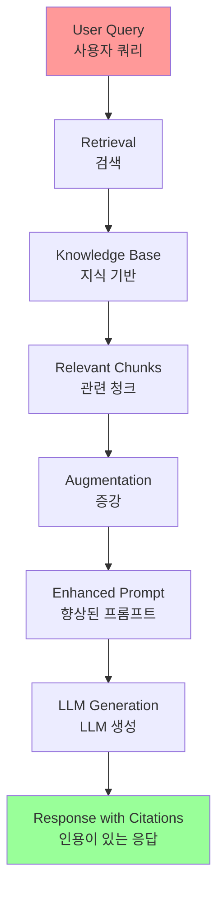
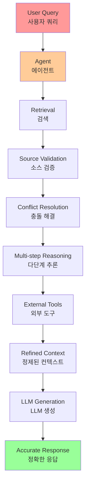
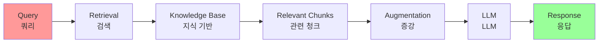
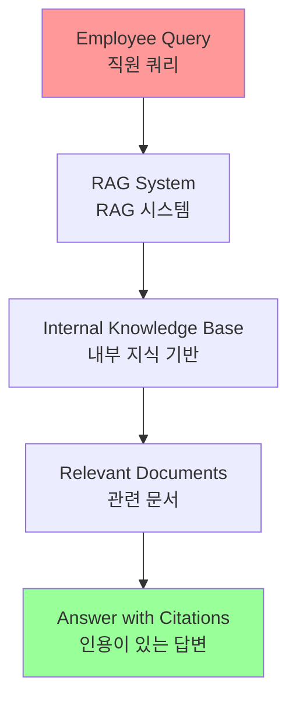

# Chapter 14: Knowledge Retrieval (RAG)

## 개요

LLMs demonstrate remarkable capabilities in generating human-like text. However, their knowledge base is typically limited to their training data, restricting access to real-time information, specific company data, or highly specialized details. Knowledge Retrieval (RAG, or Retrieval Augmented Generation) addresses these limitations. RAG enables LLMs to access and integrate external, current, and context-specific information, enhancing the accuracy, relevance, and factual grounding of their outputs.

For AI agents, this is crucial as it allows them to ground their actions and responses in real-time, verifiable data beyond static training. This capability enables them to accurately perform complex tasks such as accessing the latest company policies to answer specific questions or checking current inventory before placing orders.

LLM은 인간과 같은 텍스트를 생성하는 상당한 능력을 보여줍니다. 그러나 그들의 지식 기반은 일반적으로 훈련된 데이터로 제한되어 실시간 정보, 특정 회사 데이터 또는 고도로 전문적인 세부사항에 대한 접근을 제한합니다. Knowledge Retrieval (RAG, 또는 Retrieval Augmented Generation)은 이러한 제한을 해결합니다. RAG는 LLM이 외부, 현재 및 컨텍스트별 정보에 접근하고 통합할 수 있게 하여 출력의 정확성, 관련성 및 사실적 기반을 향상시킵니다.

AI 에이전트의 경우, 이것은 정적 훈련을 넘어서는 실시간, 검증 가능한 데이터에 기반하여 행동과 응답을 근거 있게 만들 수 있게 하므로 중요합니다. 이 능력은 최신 회사 정책에 접근하여 특정 질문에 답하거나 주문을 하기 전에 현재 재고를 확인하는 것과 같은 복잡한 작업을 정확하게 수행할 수 있게 합니다.

## 패턴 개요 (Pattern Overview)

The Knowledge Retrieval (RAG) pattern significantly enhances LLM capabilities by enabling access to external knowledge bases before generating responses. Instead of relying solely on internal, pre-trained knowledge, RAG allows LLMs to "look up" information, much like humans reference books or search the internet.

Knowledge Retrieval (RAG) 패턴은 응답을 생성하기 전에 외부 지식 기반에 접근할 수 있게 하여 LLM의 기능을 크게 향상시킵니다. 내부, 사전 훈련된 지식에만 의존하는 대신, RAG는 LLM이 인간이 책을 참조하거나 인터넷을 검색하는 것처럼 정보를 "조회"할 수 있게 합니다.



### RAG 프로세스

When a user provides a question or prompt to an AI system using RAG, the query is not sent directly to the LLM. Instead, the system first searches a vast external knowledge base (a highly organized library of documents, databases, or web pages) to find relevant information.

사용자가 RAG를 사용하는 AI 시스템에 질문이나 프롬프트를 제공할 때, 쿼리는 LLM에 직접 전송되지 않습니다. 대신 시스템은 먼저 광범위한 외부 지식 기반(문서, 데이터베이스 또는 웹 페이지의 고도로 조직화된 라이브러리)을 검색하여 관련 정보를 찾습니다.

**프로세스 단계**:
1. **의미적 검색**: 사용자의 의도와 단어 뒤의 의미를 이해하는 "의미적 검색"
2. **청크 추출**: 가장 관련성 있는 정보 스니펫이나 "청크"를 추출
3. **증강**: 추출된 조각을 원래 프롬프트에 "증강"하거나 추가하여 더 풍부하고 정보에 입각한 쿼리 생성
4. **LLM 생성**: 이 향상된 프롬프트가 LLM에 전송되어 검색된 데이터에 사실적으로 근거를 둔 유창하고 자연스러운 응답 생성

### 핵심 개념

#### 1. 임베딩 (Embeddings)

LLM의 맥락에서 임베딩은 텍스트(단어, 구, 또는 전체 문서)의 수치 표현입니다.

**특징**:
- 벡터 형태의 표현 (숫자 목록)
- 의미적 의미와 서로 다른 텍스트 조각 간의 관계를 수학적 공간에서 캡처
- 유사한 의미를 가진 단어나 구는 벡터 공간에서 서로 더 가까운 임베딩을 가짐

**예시**: 간단한 2D 그래프에서 "cat"은 좌표 (2, 3)으로 표현될 수 있고, "kitten"은 (2.1, 3.1)에 매우 가까울 것입니다. 반면 "car"는 (8, 1)과 같은 먼 좌표를 가질 것입니다.

**실제**: 이러한 임베딩은 수백 또는 수천 차원의 훨씬 더 높은 차원 공간에 있어 언어에 대한 매우 미묘한 이해를 허용합니다.

#### 2. 텍스트 유사성 (Text Similarity)

텍스트 유사성은 두 텍스트 조각이 얼마나 유사한지를 측정하는 것을 말합니다.

**수준**:
- **표면 수준**: 단어의 겹침을 보는 어휘적 유사성
- **의미 기반 수준**: 더 깊은 의미 기반 수준

**RAG에서의 중요성**: 사용자의 쿼리에 해당하는 지식 기반에서 가장 관련성 있는 정보를 찾는 데 중요합니다.

**예시**: "What is the capital of France?"와 "Which city is the capital of France?"는 단어가 다르지만 같은 질문을 하고 있습니다. 좋은 텍스트 유사성 모델은 이를 인식하고 몇 개의 단어만 공유하더라도 이 두 문장에 높은 유사성 점수를 할당합니다.

#### 3. 의미적 유사성 및 거리 (Semantic Similarity and Distance)

의미적 유사성은 사용된 단어가 아닌 텍스트의 의미와 맥락에만 초점을 맞춘 텍스트 유사성의 더 고급 형태입니다.

**목표**: 두 텍스트 조각이 같은 개념이나 아이디어를 전달하는지 이해

**의미적 거리**: 의미적 유사성의 역수. 높은 의미적 유사성은 낮은 의미적 거리를 의미하고 그 반대도 마찬가지입니다.

**예시**: "a furry feline companion"과 "a domestic cat"은 "a" 외에는 공통 단어가 없지만, 의미적 유사성을 이해하는 모델은 그것들이 같은 것을 가리킨다는 것을 인식하고 매우 유사한 것으로 간주할 것입니다.

#### 4. 문서 청킹 (Chunking of Documents)

청킹은 큰 문서를 더 작고 관리 가능한 조각 또는 "청크"로 나누는 프로세스입니다.

**필요성**: RAG 시스템이 효율적으로 작동하려면 전체 큰 문서를 LLM에 공급할 수 없습니다. 대신 이러한 더 작은 청크를 처리합니다.

**전략**: 문서를 청킹하는 방식은 정보의 컨텍스트와 의미를 보존하는 데 중요합니다.

**예시**: 50페이지 사용자 매뉴얼을 단일 텍스트 블록으로 처리하는 대신, 청킹 전략은 섹션, 단락 또는 심지어 문장으로 나눌 수 있습니다. "Troubleshooting" 섹션은 "Installation Guide"와 별도의 청크가 됩니다.

**장점**: 사용자가 특정 문제에 대해 질문할 때, RAG 시스템은 전체 매뉴얼이 아닌 가장 관련성 있는 문제 해결 청크를 검색할 수 있습니다.

#### 5. 검색 기술 (Retrieval Techniques)

문서가 청킹된 후, RAG 시스템은 주어진 쿼리에 대해 가장 관련성 있는 조각을 찾기 위해 검색 기술을 사용해야 합니다.

**주요 방법**:
- **벡터 검색**: 임베딩과 의미적 거리를 사용하여 사용자의 질문과 개념적으로 유사한 청크를 찾는 주요 방법
- **BM25**: 키워드 기반 알고리즘으로, 의미적 의미를 이해하지 않고 용어 빈도를 기반으로 청크를 순위화하는 오래되었지만 여전히 가치 있는 기술
- **하이브리드 검색**: BM25의 키워드 정밀도와 의미적 검색의 컨텍스트 이해를 결합하여 더 견고하고 정확한 검색을 허용

#### 6. 벡터 데이터베이스 (Vector Databases)

벡터 데이터베이스는 임베딩을 효율적으로 저장하고 쿼리하도록 설계된 특수한 유형의 데이터베이스입니다.

**특징**:
- 문서가 청킹되고 임베딩으로 변환된 후, 이러한 고차원 벡터가 벡터 데이터베이스에 저장됨
- 의미적 검색을 위해 특별히 구축됨
- 텍스트를 수치 벡터로 저장함으로써 개념적 의미를 기반으로 결과를 찾을 수 있음

**검색 알고리즘**: 사용자의 쿼리도 벡터로 변환되면, 데이터베이스는 HNSW(Hierarchical Navigable Small World)와 같은 고도로 최적화된 알고리즘을 사용하여 수백만 개의 벡터를 빠르게 검색하고 의미상 "가장 가까운" 벡터를 찾습니다.

**구현**: Pinecone, Weaviate와 같은 관리형 데이터베이스부터 Chroma DB, Milvus, Qdrant와 같은 오픈소스 솔루션까지 다양한 형태로 구현됩니다. Redis, Elasticsearch, Postgres(pgvector 확장 사용)와 같은 기존 데이터베이스도 벡터 검색 기능으로 증강될 수 있습니다.

**핵심 라이브러리**: Meta AI의 FAISS 또는 Google Research의 ScaNN과 같은 라이브러리가 이러한 시스템의 효율성에 기본적입니다.

### RAG의 도전 과제

RAG 패턴은 강력하지만 도전 과제가 없지는 않습니다:

#### 1. 분산된 정보

쿼리에 답하는 데 필요한 정보가 단일 청크에 국한되지 않고 문서의 여러 부분 또는 여러 문서에 걸쳐 분산될 수 있습니다.

**문제**: 검색기가 모든 필요한 컨텍스트를 수집하지 못하여 불완전하거나 부정확한 답변으로 이어질 수 있습니다.

#### 2. 품질 의존성

시스템의 효과는 청킹 및 검색 프로세스의 품질에 크게 의존합니다.

**문제**: 관련 없는 청크가 검색되면 노이즈를 도입하고 LLM을 혼란스럽게 할 수 있습니다.

#### 3. 모순된 소스

잠재적으로 모순된 소스에서 정보를 효과적으로 합성하는 것은 이러한 시스템에 대한 중요한 장애물로 남아 있습니다.

#### 4. 사전 처리 요구사항

RAG는 전체 지식 기반을 사전 처리하고 벡터 또는 그래프 데이터베이스와 같은 특수 데이터베이스에 저장해야 하며, 이는 상당한 작업입니다.

**지속적인 관리**: 이 지식은 최신 상태를 유지하기 위해 주기적인 조정이 필요하며, 회사 위키와 같은 진화하는 소스를 다룰 때 중요한 작업입니다.

#### 5. 성능 영향

이 전체 프로세스는 성능에 눈에 띄는 영향을 줄 수 있으며, 지연 시간, 운영 비용 및 최종 프롬프트에서 사용되는 토큰 수를 증가시킵니다.

### Graph RAG

GraphRAG는 정보 검색을 위해 단순한 벡터 데이터베이스 대신 지식 그래프를 활용하는 Retrieval-Augmented Generation의 고급 형태입니다.

**특징**:
- 이 구조화된 지식 기반 내에서 데이터 엔티티(노드) 간의 명시적 관계(엣지)를 탐색하여 복잡한 쿼리에 답함
- 여러 문서에 걸쳐 분산된 정보에서 답변을 합성하는 능력으로, 전통적인 RAG의 일반적인 실패를 해결

**장점**: 이러한 연결을 이해함으로써 GraphRAG는 더 컨텍스트적으로 정확하고 미묘한 응답을 제공합니다.

**사용 사례**:
- 복잡한 금융 분석
- 회사를 시장 이벤트에 연결
- 유전자와 질병 간의 관계를 발견하는 과학 연구

**단점**:
- 고품질 지식 그래프를 구축하고 유지하는 데 필요한 상당한 복잡성, 비용 및 전문성
- 설정이 덜 유연하고 더 단순한 벡터 검색 시스템에 비해 더 높은 지연 시간을 도입할 수 있음
- 시스템의 효과는 기본 그래프 구조의 품질과 완전성에 전적으로 의존

**결론**: GraphRAG는 깊고 상호 연결된 통찰이 표준 RAG의 속도와 단순성보다 더 중요한 경우에 탁월합니다.

### Agentic RAG

이 패턴의 진화인 Agentic RAG는 추론 및 의사결정 계층을 도입하여 정보 추출의 신뢰성을 크게 향상시킵니다.



**핵심 차이점**: 단순히 검색하고 증강하는 대신, "에이전트"라는 전문 AI 구성 요소가 지식의 중요한 게이트키퍼 및 정제자 역할을 합니다.

**에이전트의 능력**:

1. **반성 및 소스 검증**: 에이전트는 초기에 검색된 데이터를 수동적으로 수용하는 대신, 품질, 관련성 및 완전성을 능동적으로 조사합니다.

2. **지식 충돌 조정**: 두 문서가 모순되는 경우, 에이전트는 이 모순을 식별하고 더 신뢰할 수 있는 소스를 우선시하여 LLM에 검증된 수치를 제공합니다.

3. **다단계 추론**: 복잡한 질문을 별도의 하위 쿼리로 분해하고, 각각에 대해 별도의 검색을 시작한 다음, 개별 정보 조각을 수집한 후 LLM에 공급하기 전에 구조화된 비교 컨텍스트로 합성합니다.

4. **지식 격차 식별 및 외부 도구 사용**: 내부 지식 기반에서 관련 정보를 찾지 못하면, 에이전트는 라이브 웹 검색 API와 같은 도구를 활성화하여 최신 정보를 찾고 최신 답변을 제공할 수 있습니다.

**도전 과제**:
- 복잡성과 비용의 상당한 증가
- 에이전트의 반성, 도구 사용 및 다단계 추론 사이클이 표준, 직접 검색 프로세스보다 더 많은 시간이 걸리므로 지연 시간 증가
- 에이전트 자체가 새로운 오류 소스가 될 수 있음: 결함이 있는 추론 프로세스로 인해 무용한 루프에 갇히거나, 작업을 오해하거나, 관련 정보를 부적절하게 버려 최종 응답의 품질을 저하시킬 수 있음

## 실용적 응용 및 사용 사례 (Practical Applications & Use Cases)

The RAG pattern enables real-time information access and accurate response generation across various domains:

RAG 패턴은 다양한 도메인에서 실시간 정보 접근과 정확한 응답 생성을 가능하게 합니다:

Knowledge Retrieval (RAG)는 다양한 산업에서 대형 언어 모델(LLM)이 활용되는 방식을 변화시키고 있으며, 더 정확하고 컨텍스트적으로 관련성 있는 응답을 제공하는 능력을 향상시킵니다.

### 1. 엔터프라이즈 검색 및 Q&A

조직은 HR 정책, 기술 매뉴얼 및 제품 사양과 같은 내부 문서를 사용하여 직원 문의에 응답하는 내부 챗봇을 개발할 수 있습니다.

**RAG 역할**: RAG 시스템은 이러한 문서에서 관련 섹션을 추출하여 LLM의 응답을 알립니다.

### 2. 고객 지원 및 헬프데스크

RAG 기반 시스템은 제품 매뉴얼, 자주 묻는 질문(FAQ) 및 지원 티켓에서 정보에 접근하여 고객 쿼리에 정확하고 일관된 응답을 제공할 수 있습니다.

**효과**: 일상적인 문제에 대한 직접적인 인간 개입의 필요성을 줄일 수 있습니다.

### 3. 개인화된 콘텐츠 추천

기본 키워드 매칭 대신, RAG는 사용자의 선호도나 이전 상호작용과 의미적으로 관련된 콘텐츠(기사, 제품)를 식별하고 검색할 수 있습니다.

**결과**: 더 관련성 있는 추천으로 이어집니다.

### 4. 뉴스 및 현재 이벤트 요약

LLM은 실시간 뉴스 피드와 통합될 수 있습니다.

**프로세스**: 현재 이벤트에 대해 프롬프트를 받으면, RAG 시스템은 최근 기사를 검색하여 LLM이 최신 요약을 생성할 수 있게 합니다.

### 5. 법률 연구

법률 문서, 판례 및 법률 데이터베이스에서 정보를 검색하여 법률 연구를 지원할 수 있습니다.

### 6. 의료 진단 지원

의료 문헌, 임상 가이드라인 및 환자 기록에서 정보를 검색하여 의료 전문가를 지원할 수 있습니다.

## 실습 코드 예제 (Hands-On Code Example)

### 예제 1: Google Search를 사용한 RAG (ADK)

Google Search를 사용하여 RAG를 수행하고 LLM을 검색 결과에 근거 있게 만드는 방법을 보여줍니다.

```python
from google.adk.tools import google_search
from google.adk.agents import Agent

search_agent = Agent(
    name="research_assistant",
    model="gemini-2.0-flash-exp",
    instruction="You help users research topics. When asked, use the Google Search tool to find current information and provide accurate, cited responses.",
    tools=[google_search]
)
```

### 예제 2: Vertex AI RAG 기능 사용 (ADK)

이 섹션은 Google ADK 내에서 Vertex AI RAG 기능을 활용하는 방법을 설명합니다.

```python
# google.adk.memory 모듈에서 필요한 VertexAiRagMemoryService 클래스를 가져옵니다.
from google.adk.memory import VertexAiRagMemoryService

RAG_CORPUS_RESOURCE_NAME = (
    "projects/your-gcp-project-id/locations/us-central1/"
    "ragCorpora/your-corpus-id"
)

# 검색할 상위 유사 결과 수에 대한 선택적 매개변수 정의
# 이것은 RAG 서비스가 반환할 관련 문서 청크 수를 제어합니다.
SIMILARITY_TOP_K = 5

# 벡터 거리 임계값에 대한 선택적 매개변수 정의
# 이 임계값은 검색된 결과에 허용되는 최대 의미적 거리를 결정합니다.
# 이 값보다 큰 거리를 가진 결과는 필터링될 수 있습니다.
VECTOR_DISTANCE_THRESHOLD = 0.7

# VertexAiRagMemoryService 인스턴스 초기화
# 이것은 Vertex AI RAG Corpus에 대한 연결을 설정합니다.
# - rag_corpus: RAG Corpus의 고유 식별자를 지정합니다.
# - similarity_top_k: 가져올 유사 결과의 최대 수를 설정합니다.
# - vector_distance_threshold: 결과 필터링을 위한 유사성 임계값을 정의합니다.
memory_service = VertexAiRagMemoryService(
    rag_corpus=RAG_CORPUS_RESOURCE_NAME,
    similarity_top_k=SIMILARITY_TOP_K,
    vector_distance_threshold=VECTOR_DISTANCE_THRESHOLD
)
```

### 예제 3: LangChain을 사용한 완전한 RAG 파이프라인

LangChain을 사용한 완전한 예제를 살펴보겠습니다.

```python
import os
import requests
from typing import List, Dict, Any, TypedDict
from langchain_community.document_loaders import TextLoader
from langchain_core.documents import Document
from langchain_core.prompts import ChatPromptTemplate
from langchain_core.output_parsers import StrOutputParser
from langchain_community.embeddings import OpenAIEmbeddings
from langchain_community.vectorstores import Weaviate
from langchain_openai import ChatOpenAI
from langchain.text_splitter import CharacterTextSplitter
from langchain.schema.runnable import RunnablePassthrough
from langgraph.graph import StateGraph, END
import weaviate
from weaviate.embedded import EmbeddedOptions
import dotenv

# 환경 변수 로드 (예: OPENAI_API_KEY)
dotenv.load_dotenv()

# --- 1. 데이터 준비 (전처리) ---
# 데이터 로드
url = "https://github.com/langchain-ai/langchain/blob/master/docs/docs/how_to/state_of_the_union.txt"
res = requests.get(url)
with open("state_of_the_union.txt", "w") as f:
    f.write(res.text)

loader = TextLoader('./state_of_the_union.txt')
documents = loader.load()

# 문서 청킹
text_splitter = CharacterTextSplitter(chunk_size=500, chunk_overlap=50)
chunks = text_splitter.split_documents(documents)

# Weaviate에 청크 임베딩 및 저장
client = weaviate.Client(embedded_options=EmbeddedOptions())
vectorstore = Weaviate.from_documents(
    client=client,
    documents=chunks,
    embedding=OpenAIEmbeddings(),
    by_text=False
)

# 검색기 정의
retriever = vectorstore.as_retriever()

# LLM 초기화
llm = ChatOpenAI(model_name="gpt-3.5-turbo", temperature=0)

# --- 2. LangGraph를 위한 상태 정의 ---
class RAGGraphState(TypedDict):
    question: str
    documents: List[Document]
    generation: str

# --- 3. 노드(함수) 정의 ---
def retrieve_documents_node(state: RAGGraphState) -> RAGGraphState:
    """사용자의 질문을 기반으로 문서를 검색합니다."""
    question = state["question"]
    documents = retriever.invoke(question)
    return {
        "documents": documents,
        "question": question,
        "generation": ""
    }

def generate_response_node(state: RAGGraphState) -> RAGGraphState:
    """검색된 문서를 기반으로 LLM을 사용하여 응답을 생성합니다."""
    question = state["question"]
    documents = state["documents"]
    
    # 프롬프트 템플릿
    template = """You are an assistant for question-answering tasks.
Use the following pieces of retrieved context to answer the question.
If you don't know the answer, just say that you don't know.
Use three sentences maximum and keep the answer concise.

Question: {question}
Context: {context}
Answer:
"""
    prompt = ChatPromptTemplate.from_template(template)
    
    # 문서에서 컨텍스트 포맷
    context = "\n\n".join([doc.page_content for doc in documents])
    
    # RAG 체인 생성
    rag_chain = prompt | llm | StrOutputParser()
    
    # 체인 호출
    generation = rag_chain.invoke({
        "context": context,
        "question": question
    })
    
    return {
        "question": question,
        "documents": documents,
        "generation": generation
    }

# --- 4. LangGraph 그래프 구축 ---
workflow = StateGraph(RAGGraphState)

# 노드 추가
workflow.add_node("retrieve", retrieve_documents_node)
workflow.add_node("generate", generate_response_node)

# 진입점 설정
workflow.set_entry_point("retrieve")

# 엣지(전환) 추가
workflow.add_edge("retrieve", "generate")
workflow.add_edge("generate", END)

# 그래프 컴파일
app = workflow.compile()

# --- 5. RAG 애플리케이션 실행 ---
if __name__ == "__main__":
    print("\n--- Running RAG Query ---")
    query = "What did the president say about Justice Breyer"
    inputs = {"question": query}
    for s in app.stream(inputs):
        print(s)
    
    print("\n--- Running another RAG Query ---")
    query_2 = "What did the president say about the economy?"
    inputs_2 = {"question": query_2}
    for s in app.stream(inputs_2):
        print(s)
```

### 코드 설명

이 Python 코드는 LangChain과 LangGraph로 구현된 Retrieval-Augmented Generation (RAG) 파이프라인을 보여줍니다.

**프로세스**:
1. 텍스트 문서에서 파생된 지식 기반 생성
2. 문서를 청크로 분할하고 임베딩으로 변환
3. Weaviate 벡터 저장소에 임베딩 저장
4. LangGraph의 StateGraph를 사용하여 두 핵심 함수 간의 워크플로우 관리
5. `retrieve_documents_node`: 벡터 저장소를 쿼리하여 사용자 입력을 기반으로 관련 문서 청크 식별
6. `generate_response_node`: 검색된 정보와 사전 정의된 프롬프트 템플릿을 사용하여 OpenAI 대형 언어 모델(LLM)을 사용하여 응답 생성

**결과**: `app.stream` 메서드를 통해 RAG 파이프라인을 통해 쿼리를 실행할 수 있으며, 시스템이 컨텍스트적으로 관련성 있는 출력을 생성하는 능력을 보여줍니다.

## 한눈에 보기 (At a Glance)

### 무엇 (What)

LLM은 인상적인 텍스트 생성 능력을 가지고 있지만 근본적으로 훈련 데이터에 의해 제한됩니다. 이 지식은 정적이며, 실시간 정보나 비공개, 도메인별 데이터를 포함하지 않습니다. 결과적으로 그들의 응답은 오래되었거나 부정확하거나 전문 작업에 필요한 특정 컨텍스트가 부족할 수 있습니다.

### 왜 (Why)

Retrieval-Augmented Generation (RAG) 패턴은 LLM을 외부 지식 소스에 연결하여 표준화된 솔루션을 제공합니다. 쿼리를 받으면 시스템은 먼저 지정된 지식 기반에서 관련 정보 스니펫을 검색합니다. 이러한 스니펫은 그 다음 원래 프롬프트에 추가되어 시기 적절하고 특정한 컨텍스트로 풍부하게 만듭니다.

### 경험 법칙 (Rule of Thumb)

LLM이 원래 훈련 데이터의 일부가 아닌 특정, 최신 또는 독점 정보를 기반으로 질문에 답하거나 콘텐츠를 생성해야 할 때 이 패턴을 사용하세요. 내부 문서에 대한 Q&A 시스템 구축, 고객 지원 봇, 인용이 있는 검증 가능한 사실 기반 응답이 필요한 애플리케이션에 이상적입니다.

### 시각적 요약



## 핵심 요약 (Key Takeaways)

1. **Knowledge Retrieval (RAG)는 LLM이 외부, 최신 및 특정 정보에 접근할 수 있게 하여 향상시킵니다**

2. **프로세스는 검색(지식 기반에서 관련 스니펫 검색)과 증강(이러한 스니펫을 LLM의 프롬프트에 추가)을 포함합니다**

3. **RAG는 오래된 훈련 데이터와 같은 제한을 극복하고, "환각"을 줄이며, 도메인별 지식 통합을 가능하게 합니다**

4. **RAG는 검색된 소스에 근거를 둔 LLM의 응답으로 인해 귀속 가능한 답변을 허용합니다**

5. **GraphRAG는 서로 다른 정보 조각 간의 관계를 이해하기 위해 지식 그래프를 활용하여 여러 소스에서 데이터를 합성해야 하는 복잡한 질문에 답할 수 있게 합니다**

6. **Agentic RAG는 단순한 정보 검색을 넘어 지능형 에이전트를 사용하여 외부 지식을 능동적으로 추론, 검증 및 정제하여 더 정확하고 신뢰할 수 있는 답변을 보장합니다**

7. **실용적인 애플리케이션은 엔터프라이즈 검색, 고객 지원, 법률 연구 및 개인화된 추천에 걸쳐 있습니다**

8. **RAG는 LLM을 닫힌 책 대화자에서 강력한 열린 책 추론 도구로 변환합니다**

## 결론

결론적으로, Retrieval-Augmented Generation (RAG)는 대형 언어 모델의 정적 지식의 핵심 제한을 외부, 최신 데이터 소스에 연결하여 해결합니다. 프로세스는 먼저 관련 정보 스니펫을 검색한 다음 사용자의 프롬프트를 증강하여 LLM이 더 정확하고 컨텍스트적으로 인식하는 응답을 생성할 수 있게 합니다.

임베딩, 의미적 검색 및 벡터 데이터베이스와 같은 기본 기술로 가능해지며, 이는 키워드뿐만 아니라 의미를 기반으로 정보를 찾습니다. 검증 가능한 데이터에 출력을 근거를 두어 RAG는 사실적 오류를 크게 줄이고 인용을 통해 독점 정보 사용을 허용하여 신뢰를 향상시킵니다.

고급 진화인 Agentic RAG는 검색된 지식을 능동적으로 검증, 조정 및 합성하는 추론 계층을 도입하여 더 큰 신뢰성을 제공합니다. 마찬가지로 GraphRAG와 같은 전문 접근 방식은 명시적 데이터 관계를 탐색하기 위해 지식 그래프를 활용하여 고도로 복잡하고 상호 연결된 쿼리에 대한 답변을 합성할 수 있게 합니다.

이러한 고급 방법은 복잡성과 지연 시간을 추가하지만, 최종 응답의 깊이와 신뢰성을 극적으로 개선합니다. 이러한 패턴의 실용적인 애플리케이션은 이미 엔터프라이즈 검색 및 고객 지원부터 개인화된 콘텐츠 제공에 이르기까지 산업을 변화시키고 있습니다.

## 이론적 배경 및 학술적 근거 (Theoretical Background and Academic Foundation)

### 정보 검색 이론 (Information Retrieval Theory)

RAG는 정보 검색의 핵심 원칙에 기반합니다. Salton & McGill(1986)의 벡터 공간 모델은 문서를 벡터로 표현하여 유사도를 계산합니다.

**정보 검색 모델**:
- **벡터 공간 모델**: 문서와 쿼리를 벡터로 표현
- **확률적 모델**: 확률 기반 관련성 계산
- **언어 모델**: 언어 모델 기반 관련성 평가

**RAG에서의 적용**:
- 문서를 임베딩 벡터로 변환
- 쿼리와 문서 간 코사인 유사도 계산
- 상위 유사 문서 검색

### 분산 표현 이론 (Distributed Representation Theory)

Mikolov et al.(2013)의 Word2Vec은 단어를 벡터로 표현하는 방법을 제시했습니다.

**임베딩의 발전**:
- **Word2Vec**: 단어 수준 임베딩
- **BERT**: 문맥을 고려한 임베딩
- **Sentence Transformers**: 문장 수준 임베딩

**의미적 유사성**:
- 의미적으로 유사한 텍스트는 벡터 공간에서 가까움
- 코사인 유사도로 의미적 유사성 측정
- 키워드 매칭을 넘어 의미 이해

### 청킹 이론 (Chunking Theory)

효과적인 RAG를 위해서는 적절한 청킹 전략이 중요합니다.

**청킹 전략**:
- **고정 크기**: 일정한 크기로 분할
- **의미 기반**: 의미 단위로 분할
- **계층적**: 다중 수준 청킹

**청킹 최적화**:
- 오버랩을 통한 컨텍스트 보존
- 청크 크기와 검색 정확도 균형
- 도메인 특화 청킹 전략

### 하이브리드 검색 이론

키워드 검색과 의미 검색을 결합한 하이브리드 접근법:

**BM25 + 벡터 검색**:
- **BM25**: 키워드 정확도 측정
- **벡터 검색**: 의미적 유사성 측정
- **결합**: 두 방법의 가중 평균

**장점**:
- 키워드 정확도와 의미 이해 결합
- 다양한 쿼리 유형에 효과적
- 검색 정확도 향상

## 성능 최적화 기법 (Performance Optimization Techniques)

### 1. 하이브리드 검색 최적화

BM25와 벡터 검색 결합:

```python
def hybrid_search(query: str, top_k: int = 10) -> List[Document]:
    """하이브리드 검색"""
    # BM25 검색
    bm25_results = bm25_search(query, top_k=top_k * 2)
    
    # 벡터 검색
    query_embedding = embed(query)
    vector_results = vector_search(query_embedding, top_k=top_k * 2)
    
    # 결과 통합 (RRF - Reciprocal Rank Fusion)
    combined = reciprocal_rank_fusion(bm25_results, vector_results)
    
    return combined[:top_k]
```

### 2. 적응형 청킹

문서 특성에 따라 청킹 전략 조정:

```python
class AdaptiveChunker:
    def __init__(self):
        self.chunking_strategies = {
            'code': CodeChunker(),
            'prose': ProseChunker(),
            'table': TableChunker(),
            'mixed': MixedChunker()
        }
    
    def chunk(self, document: Document) -> List[Chunk]:
        """문서 유형에 따른 적응형 청킹"""
        doc_type = self.detect_document_type(document)
        chunker = self.chunking_strategies.get(doc_type, ProseChunker())
        return chunker.chunk(document)
```

### 3. 재랭킹 (Re-ranking)

초기 검색 결과를 더 정교한 모델로 재랭킹:

```python
def rerank_results(query: str, initial_results: List[Document]) -> List[Document]:
    """검색 결과 재랭킹"""
    # 더 정교한 모델로 재랭킹
    reranker = CrossEncoder('cross-encoder/ms-marco-MiniLM-L-6-v2')
    
    scores = []
    for doc in initial_results:
        score = reranker.predict([(query, doc.content)])
        scores.append((doc, score))
    
    # 점수 순으로 정렬
    reranked = sorted(scores, key=lambda x: x[1], reverse=True)
    return [doc for doc, _ in reranked]
```

### 4. 캐싱 및 인덱싱 최적화

빠른 검색을 위한 인덱스 최적화:

```python
class OptimizedRAGIndex:
    def __init__(self):
        self.vector_index = AnnoyIndex(embedding_dim, 'angular')
        self.bm25_index = BM25Okapi()
        self.metadata_cache = {}
    
    def build_index(self, documents: List[Document]):
        """최적화된 인덱스 구축"""
        # 벡터 인덱스
        for i, doc in enumerate(documents):
            embedding = embed(doc.content)
            self.vector_index.add_item(i, embedding)
            self.metadata_cache[i] = doc.metadata
        
        # BM25 인덱스
        tokenized_docs = [doc.content.split() for doc in documents]
        self.bm25_index = BM25Okapi(tokenized_docs)
        
        # 인덱스 최적화
        self.vector_index.build(10)
    
    def search(self, query: str, top_k: int = 10):
        """최적화된 검색"""
        # 병렬 검색
        bm25_scores, vector_scores = await asyncio.gather(
            self.bm25_search(query),
            self.vector_search(query)
        )
        
        # 결과 통합
        return self.combine_results(bm25_scores, vector_scores, top_k)
```

## 트레이드오프 및 한계점 (Trade-offs and Limitations)

### RAG의 장점

1. **정확성**: 검증 가능한 정보 기반 응답
2. **최신성**: 최신 정보 접근 가능
3. **투명성**: 인용을 통한 출처 명시
4. **도메인 특화**: 특정 도메인 지식 통합

### RAG의 한계

1. **검색 품질**: 검색 결과 품질에 의존
2. **컨텍스트 제한**: 검색된 문서만 사용
3. **지연 시간**: 검색 및 생성 시간
4. **비용**: 임베딩 및 검색 비용

### 완화 전략

1. **검색 품질 향상**: 하이브리드 검색, 재랭킹
2. **컨텍스트 확장**: 더 많은 문서 검색
3. **비동기 처리**: 검색과 생성을 병렬 처리
4. **비용 최적화**: 캐싱, 배치 처리

## 관련 패턴과의 비교 (Comparison with Related Patterns)

### RAG vs. Fine-tuning

| 특성 | Fine-tuning | RAG |
|------|------------|-----|
| 지식 업데이트 | 재훈련 필요 | 즉시 가능 |
| 도메인 특화 | 제한적 | 용이 |
| 비용 | 높음 | 중간 |
| 정확성 | 변동적 | 높음 (인용) |

### RAG vs. Tool Use

RAG와 Tool Use는 서로 보완적:

- **RAG**: 정적 지식 기반 검색
- **Tool Use**: 동적 정보 및 행동
- **결합**: RAG로 배경 지식, Tool Use로 실시간 정보

## 실무 적용 사례 확장 (Extended Practical Applications)

### 1. 엔터프라이즈 지식 관리

회사 내부 지식 기반 구축:



### 2. 법률 문서 분석

법률 문서의 자동 분석 및 질의응답:

- **문서 인덱싱**: 법률 문서를 벡터 데이터베이스에 저장
- **의미적 검색**: 법률 개념 기반 검색
- **인용 제공**: 관련 법조문 인용
- **GraphRAG**: 법률 간 관계 분석

### 3. 의료 지식 기반

의료 문헌 기반 진단 지원:

```python
class MedicalRAGSystem:
    def __init__(self):
        self.knowledge_base = MedicalKnowledgeBase()
        self.retriever = HybridRetriever()
        self.generator = MedicalLLM()
    
    def answer_medical_query(self, query: str, patient_context: dict) -> Answer:
        """의료 질의에 답변"""
        # 환자 컨텍스트와 쿼리 결합
        enhanced_query = self.enhance_query(query, patient_context)
        
        # 관련 의료 문헌 검색
        relevant_papers = self.retriever.search(enhanced_query, top_k=5)
        
        # 증거 기반 답변 생성
        answer = self.generator.generate(
            query=query,
            context=patient_context,
            retrieved_docs=relevant_papers
        )
        
        # 인용 및 출처 제공
        return Answer(
            text=answer,
            citations=[paper.citation for paper in relevant_papers],
            confidence=self.calculate_confidence(answer, relevant_papers)
        )
```

## 참고 자료 (References)

### 학술 논문

1. Lewis, P., et al. (2020). "Retrieval-Augmented Generation for Knowledge-Intensive NLP Tasks." *Advances in Neural Information Processing Systems*, 33.

2. Karpukhin, V., et al. (2020). "Dense Passage Retrieval for Open-Domain Question Answering." *Proceedings of EMNLP*.

3. Salton, G., & McGill, M. J. (1986). *Introduction to Modern Information Retrieval*. McGraw-Hill.

4. Mikolov, T., et al. (2013). "Efficient estimation of word representations in vector space." *arXiv preprint arXiv:1301.3781*.

5. Devlin, J., et al. (2018). "BERT: Pre-training of Deep Bidirectional Transformers for Language Understanding." *arXiv preprint arXiv:1810.04805*.

6. Reimers, N., & Gurevych, I. (2019). "Sentence-BERT: Sentence Embeddings using Siamese BERT-Networks." *Proceedings of EMNLP*.

7. Liu, N. F., et al. (2024). "Lost in the Middle: How Language Models Use Long Contexts." *arXiv preprint arXiv:2307.03172*.

### 프레임워크 및 도구 문서

1. LangChain RAG Documentation:
   https://python.langchain.com/docs/use_cases/question_answering/

2. Vertex AI RAG Documentation:
   https://cloud.google.com/vertex-ai/docs/generative-ai/rag

3. Weaviate Vector Database:
   https://weaviate.io/

4. Pinecone Vector Database:
   https://www.pinecone.io/

### 추가 학습 자료

5. "Neural Information Retrieval" by Bhaskar Mitra & Nick Craswell

6. "Introduction to Information Retrieval" by Christopher D. Manning et al.

7. "Dense Retrieval for Open-Domain Question Answering" - Research Papers

---

**이전 챕터**: [Chapter 13: Human-in-the-Loop](chapter_13_Human-in-the-Loop.md)  
**다음 챕터**: [Chapter 15: Inter-Agent Communication (A2A)](chapter_15_Inter-Agent_Communication.md)

