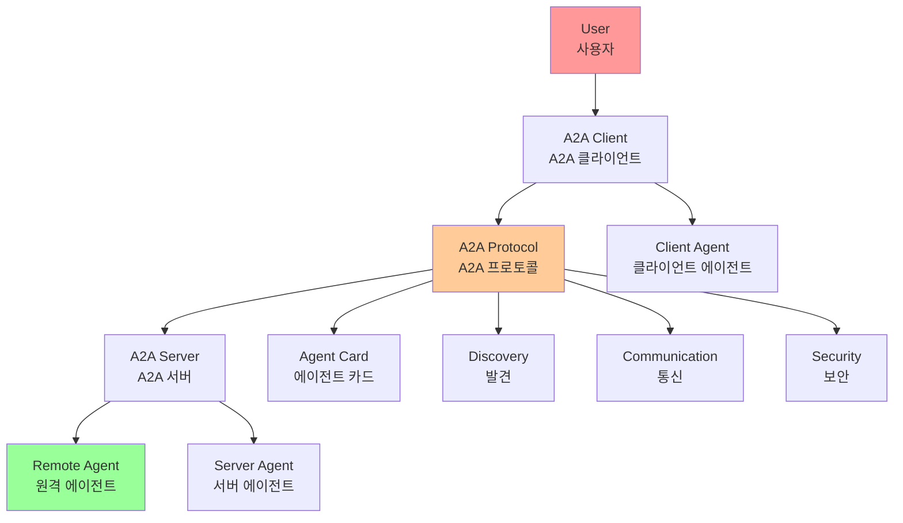
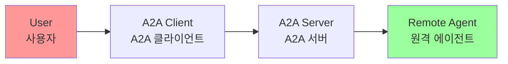
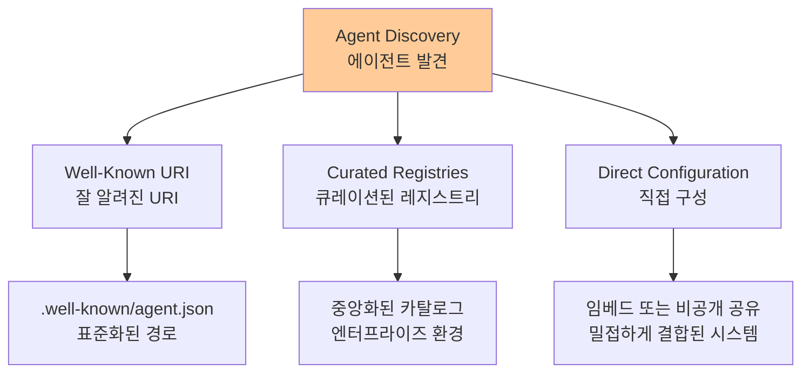
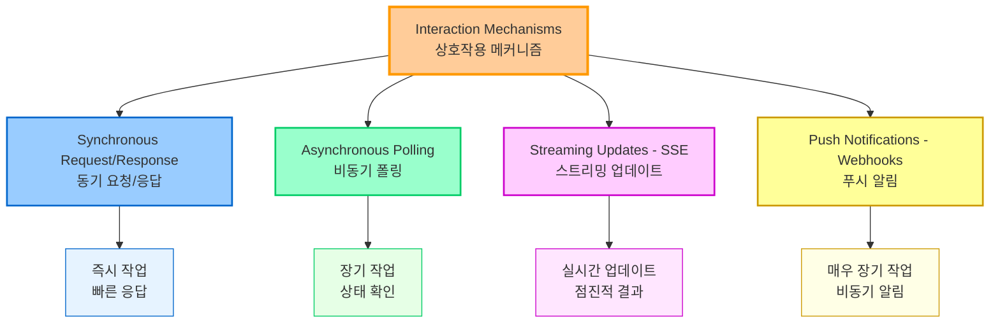
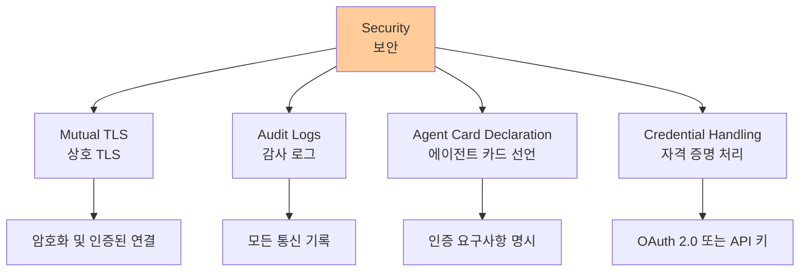
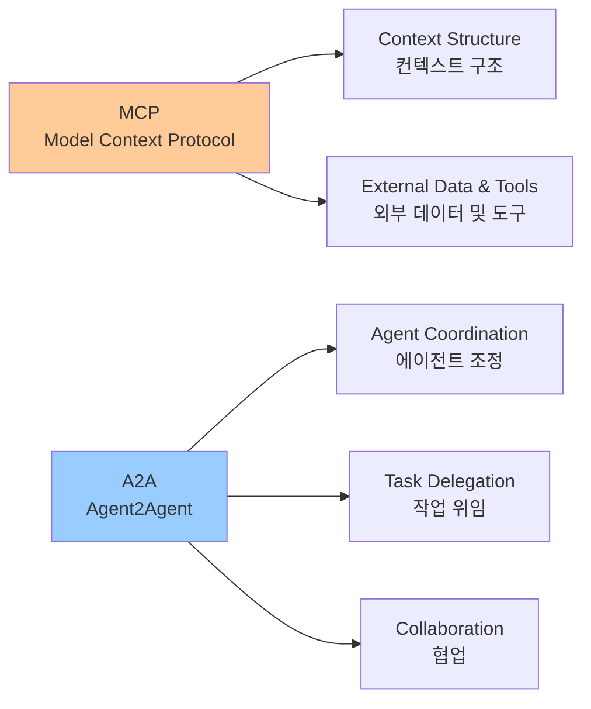
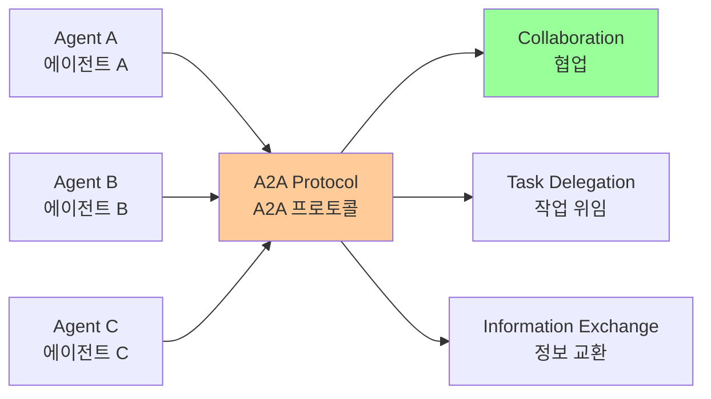
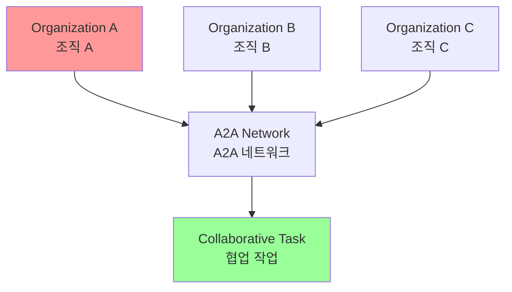

# Chapter 15: Inter-Agent Communication (A2A)

## 개요

Individual AI agents, despite their advanced capabilities, often face limitations when tackling complex and multifaceted problems. To overcome this, Inter-Agent Communication (A2A) enables diverse AI agents to effectively collaborate, even when built with potentially different frameworks. This collaboration includes seamless coordination, task delegation, and information exchange.

Google's A2A protocol is an open standard designed to facilitate this universal communication. This chapter explores A2A, its practical applications, and its implementation within Google ADK.

개별 AI 에이전트는 고급 기능을 가지고 있어도 복잡하고 다면적인 문제를 해결할 때 종종 제한에 직면합니다. 이를 극복하기 위해 Inter-Agent Communication (A2A)는 다양한 AI 에이전트가 잠재적으로 다른 프레임워크로 구축되어도 효과적으로 협업할 수 있게 합니다. 이 협업은 원활한 조정, 작업 위임 및 정보 교환을 포함합니다.

Google의 A2A 프로토콜은 이러한 범용 통신을 용이하게 하도록 설계된 개방형 표준입니다. 이 챕터는 A2A, 그 실용적인 응용 및 Google ADK 내에서의 구현을 탐구합니다.

## 패턴 개요 (Pattern Overview)

The Agent2Agent (A2A) protocol is an open standard designed to enable communication and collaboration between different AI agent frameworks. It ensures interoperability, allowing AI agents developed with technologies like LangGraph, CrewAI, or Google ADK to work together regardless of their origin or framework differences.

Agent2Agent (A2A) 프로토콜은 서로 다른 AI 에이전트 프레임워크 간의 통신 및 협업을 가능하게 하도록 설계된 개방형 표준입니다. 상호 운용성을 보장하여 LangGraph, CrewAI 또는 Google ADK와 같은 기술로 개발된 AI 에이전트가 출처나 프레임워크 차이와 관계없이 함께 작동할 수 있게 합니다.



### A2A 지원

A2A는 Atlassian, Box, LangChain, MongoDB, Salesforce, SAP, ServiceNow를 포함한 다양한 기술 회사 및 서비스 제공업체에 의해 지원됩니다. Microsoft는 Azure AI Foundry 및 Copilot Studio에 A2A를 통합할 계획이며, 개방형 프로토콜에 대한 약속을 보여줍니다. 또한 Auth0와 SAP은 플랫폼 및 에이전트에 A2A 지원을 통합하고 있습니다.

오픈소스 프로토콜로서 A2A는 진화와 광범위한 채택을 용이하게 하기 위한 커뮤니티 기여를 환영합니다.

## 핵심 개념 (Core Concepts)

A2A 프로토콜은 여러 핵심 개념을 기반으로 에이전트 상호작용을 위한 구조화된 접근 방식을 제공합니다. 이러한 개념에 대한 철저한 이해는 A2A 호환 시스템을 개발하거나 통합하는 모든 사람에게 중요합니다.

### 1. 핵심 행위자 (Core Actors)

A2A는 세 가지 주요 엔티티를 포함합니다:



- **User (사용자)**: 에이전트 지원을 위한 요청을 시작합니다.
- **A2A Client (클라이언트 에이전트)**: 사용자를 대신하여 행동하거나 정보를 요청하는 애플리케이션 또는 AI 에이전트입니다.
- **A2A Server (원격 에이전트)**: 클라이언트 요청을 처리하고 결과를 반환하는 HTTP 엔드포인트를 제공하는 AI 에이전트 또는 시스템입니다. 원격 에이전트는 "불투명한" 시스템으로 작동하며, 클라이언트가 내부 운영 세부사항을 이해할 필요가 없습니다.

### 2. 에이전트 카드 (Agent Card)

에이전트의 디지털 신원은 일반적으로 JSON 파일인 Agent Card에 의해 정의됩니다.

**포함 정보**:
- 에이전트의 신원, 엔드포인트 URL, 버전
- 스트리밍 또는 푸시 알림과 같은 지원되는 기능
- 특정 스킬
- 기본 입력/출력 모드
- 인증 요구사항

**예제: WeatherBot Agent Card**

```json
{
  "name": "WeatherBot",
  "description": "Provides accurate weather forecasts and historical data.",
  "url": "http://weather-service.example.com/a2a",
  "version": "1.0.0",
  "capabilities": {
    "streaming": true,
    "pushNotifications": false,
    "stateTransitionHistory": true
  },
  "authentication": {
    "schemes": ["apiKey"]
  },
  "defaultInputModes": ["text"],
  "defaultOutputModes": ["text"],
  "skills": [
    {
      "id": "get_current_weather",
      "name": "Get Current Weather",
      "description": "Retrieve real-time weather for any location.",
      "inputModes": ["text"],
      "outputModes": ["text"],
      "examples": [
        "What's the weather in Paris?",
        "Current conditions in Tokyo"
      ],
      "tags": ["weather", "current", "real-time"]
    },
    {
      "id": "get_forecast",
      "name": "Get Forecast",
      "description": "Get 5-day weather predictions.",
      "inputModes": ["text"],
      "outputModes": ["text"],
      "examples": [
        "5-day forecast for New York",
        "Will it rain in London this weekend?"
      ],
      "tags": ["weather", "forecast", "prediction"]
    }
  ]
}
```

### 3. 에이전트 발견 (Agent Discovery)

클라이언트가 사용 가능한 A2A 서버의 기능을 설명하는 Agent Card를 찾을 수 있게 합니다.

**발견 전략**:



- **Well-Known URI**: 에이전트가 표준화된 경로(예: `/.well-known/agent.json`)에서 Agent Card를 호스팅합니다. 이 접근 방식은 공개 또는 도메인별 사용을 위한 광범위하고 종종 자동화된 접근성을 제공합니다.
- **Curated Registries**: Agent Card가 게시되고 특정 기준에 따라 쿼리될 수 있는 중앙화된 카탈로그를 제공합니다. 중앙화된 관리 및 액세스 제어가 필요한 엔터프라이즈 환경에 적합합니다.
- **Direct Configuration**: Agent Card 정보가 임베드되거나 비공개로 공유됩니다. 동적 발견이 중요하지 않은 밀접하게 결합되거나 비공개 시스템에 적합합니다.

**보안 고려사항**: 선택한 방법과 관계없이 Agent Card 엔드포인트를 보호하는 것이 중요합니다. 액세스 제어, 상호 TLS (mTLS), 또는 네트워크 제한을 통해 이를 달성할 수 있으며, 특히 카드에 민감한(비밀은 아니지만) 정보가 포함된 경우 그렇습니다.

### 4. 통신 및 작업 (Communications and Tasks)

A2A 프레임워크에서 통신은 장기 실행 프로세스를 위한 작업의 기본 단위를 나타내는 비동기 작업을 중심으로 구조화됩니다.

**작업 구조**:
- 각 작업은 고유 식별자가 할당됩니다.
- 작업은 제출됨(submitted), 작업 중(working), 완료됨(completed)과 같은 일련의 상태를 거칩니다.
- 이 설계는 복잡한 작업에서 병렬 처리를 지원합니다.

**메시지 (Message)**:
에이전트 간의 통신은 Message를 통해 발생합니다.

**메시지 구성 요소**:
- **Attributes (속성)**: 메시지를 설명하는 키-값 메타데이터(우선순위 또는 생성 시간과 같은)
- **Parts (부분)**: 실제로 전달되는 콘텐츠(일반 텍스트, 파일 또는 구조화된 JSON 데이터)

**아티팩트 (Artifacts)**:
에이전트가 작업 중에 생성하는 유형의 출력을 아티팩트라고 합니다. 메시지와 마찬가지로 아티팩트는 하나 이상의 부분으로 구성되며 결과가 사용 가능해짐에 따라 점진적으로 스트리밍될 수 있습니다.

**프로토콜**:
A2A 프레임워크 내의 모든 통신은 페이로드에 JSON-RPC 2.0 프로토콜을 사용하여 HTTP(S)를 통해 수행됩니다.

**컨텍스트 ID (Context ID)**:
여러 상호작용에 걸쳐 연속성을 유지하기 위해 서버 생성 contextId가 관련 작업을 그룹화하고 컨텍스트를 보존하는 데 사용됩니다.

### 5. 상호작용 메커니즘 (Interaction Mechanisms)

A2A는 다양한 AI 애플리케이션 요구사항에 맞는 여러 상호작용 방법을 제공합니다:



- **동기 요청/응답 (Synchronous Request/Response)**: 빠르고 즉시 작업을 위한 것입니다. 이 모델에서 클라이언트는 요청을 보내고 서버가 처리하고 단일 동기 교환에서 완전한 응답을 반환할 때까지 적극적으로 기다립니다.

- **비동기 폴링 (Asynchronous Polling)**: 처리하는 데 더 오래 걸리는 작업에 적합합니다. 클라이언트가 요청을 보내면 서버가 즉시 "작업 중" 상태와 작업 ID로 확인합니다. 클라이언트는 다른 작업을 수행할 수 있으며 작업이 "완료됨" 또는 "실패"로 표시될 때까지 서버를 주기적으로 폴링하여 상태를 확인할 수 있습니다.

- **스트리밍 업데이트 (Server-Sent Events - SSE)**: 실시간, 점진적 결과를 받기에 이상적입니다. 이 방법은 서버에서 클라이언트로의 지속적인 단방향 연결을 설정합니다. 원격 에이전트가 상태 변경이나 부분 결과와 같은 업데이트를 지속적으로 푸시할 수 있게 하며, 클라이언트가 여러 요청을 할 필요가 없습니다.

- **푸시 알림 (Webhooks)**: 매우 장기 실행되거나 리소스 집약적인 작업을 위해 설계되었으며, 지속적인 연결이나 빈번한 폴링을 유지하는 것이 비효율적입니다. 클라이언트는 웹훅 URL을 등록할 수 있으며, 서버는 작업 상태가 크게 변경될 때(예: 완료 시) 해당 URL로 비동기 알림("푸시")을 보냅니다.

**모달리티 독립성**: A2A는 모달리티 독립적이며, 텍스트뿐만 아니라 오디오 및 비디오와 같은 다른 데이터 유형에 대해서도 이러한 상호작용 패턴을 용이하게 할 수 있어 풍부한 멀티모달 AI 애플리케이션을 가능하게 합니다.

**예제: 동기 요청**

```json
{
  "jsonrpc": "2.0",
  "id": "1",
  "method": "sendTask",
  "params": {
    "id": "task-001",
    "sessionId": "session-001",
    "message": {
      "role": "user",
      "parts": [
        {
          "type": "text",
          "text": "What is the exchange rate from USD to EUR?"
        }
      ]
    },
    "acceptedOutputModes": ["text/plain"],
    "historyLength": 5
  }
}
```

**예제: 스트리밍 요청**

```json
{
  "jsonrpc": "2.0",
  "id": "2",
  "method": "sendTaskSubscribe",
  "params": {
    "id": "task-002",
    "sessionId": "session-001",
    "message": {
      "role": "user",
      "parts": [
        {
          "type": "text",
          "text": "What's the exchange rate for JPY to GBP today?"
        }
      ]
    },
    "acceptedOutputModes": ["text/plain"],
    "historyLength": 5
  }
}
```

동기 요청은 `sendTask` 메서드를 사용하며, 클라이언트가 단일 완전한 답변을 요청하고 기대합니다. 반면 스트리밍 요청은 `sendTaskSubscribe` 메서드를 사용하여 지속적인 연결을 설정하고, 에이전트가 시간에 걸쳐 여러 점진적 업데이트나 부분 결과를 보낼 수 있게 합니다.

### 6. 보안 (Security)

Inter-Agent Communication (A2A)는 시스템 아키텍처의 중요한 구성 요소이며, 여러 내장 메커니즘을 통해 견고성과 무결성을 보장합니다.

**보안 메커니즘**:



- **Mutual Transport Layer Security (TLS)**: 암호화 및 인증된 연결이 설정되어 무단 액세스 및 데이터 가로채기를 방지하고 안전한 통신을 보장합니다.

- **Comprehensive Audit Logs**: 모든 에이전트 간 통신이 세심하게 기록되며, 정보 흐름, 관련 에이전트 및 작업에 대한 세부사항을 포함합니다. 이 감사 추적은 책임, 문제 해결 및 보안 분석에 중요합니다.

- **Agent Card Declaration**: 인증 요구사항이 Agent Card에 명시적으로 선언되며, 에이전트의 신원, 기능 및 보안 정책을 설명하는 구성 아티팩트입니다. 이것은 인증 관리를 중앙화하고 단순화합니다.

- **Credential Handling**: 에이전트는 일반적으로 OAuth 2.0 토큰 또는 API 키와 같은 안전한 자격 증명을 사용하여 인증하며, HTTP 헤더를 통해 전달됩니다. 이 방법은 URL이나 메시지 본문에서 자격 증명 노출을 방지하여 전체 보안을 향상시킵니다.

## A2A vs. MCP

A2A는 Anthropic의 Model Context Protocol (MCP)을 보완하는 프로토콜입니다(그림 1 참조).



**차이점**:
- **MCP**: 에이전트와 외부 데이터 및 도구와의 상호작용을 위한 컨텍스트 구조화에 초점
- **A2A**: 에이전트 간의 조정 및 통신을 용이하게 하여 작업 위임 및 협업을 가능하게 함

**목표**: A2A의 목표는 효율성을 향상시키고, 통합 비용을 줄이며, 복잡한 다중 에이전트 AI 시스템 개발에서 혁신과 상호 운용성을 촉진하는 것입니다.

## 실용적 응용 및 사용 사례 (Practical Applications & Use Cases)

The A2A protocol enables inter-agent collaboration across various scenarios:

A2A 프로토콜은 다양한 시나리오에서 에이전트 간 협업을 가능하게 합니다:

Inter-Agent Communication은 다양한 도메인에서 정교한 AI 솔루션을 구축하는 데 필수적이며, 모듈성, 확장성 및 향상된 지능을 가능하게 합니다.

### 1. 다중 프레임워크 협업

A2A의 주요 사용 사례는 기본 프레임워크(예: ADK, LangChain, CrewAI)와 관계없이 독립적인 AI 에이전트가 통신하고 협업할 수 있게 하는 것입니다. 이것은 다른 에이전트가 문제의 다른 측면에 특화된 복잡한 다중 에이전트 시스템을 구축하는 데 기본적입니다.

### 2. 자동화된 워크플로우 조정

엔터프라이즈 설정에서 A2A는 에이전트가 작업을 위임하고 조정할 수 있게 하여 복잡한 워크플로우를 용이하게 할 수 있습니다.

**예시**: 에이전트가 초기 데이터 수집을 처리한 다음, 분석을 위해 다른 에이전트에게 위임하고, 마지막으로 보고서 생성을 위해 세 번째 에이전트에게 위임할 수 있으며, 모두 A2A 프로토콜을 통해 통신합니다.

### 3. 동적 정보 검색

에이전트는 실시간 정보를 검색하고 교환하기 위해 통신할 수 있습니다.

**예시**: 주요 에이전트가 전문 "데이터 가져오기 에이전트"에서 라이브 시장 데이터를 요청할 수 있으며, 이는 외부 API를 사용하여 정보를 수집하고 다시 보냅니다.

## 실습 코드 예제 (Hands-On Code Example)

### ADK 기반 A2A 서버 설정

이 예제는 Google 인증 도구를 사용하여 ADK 기반 에이전트로 A2A 서버를 설정하는 방법을 보여줍니다.

```python
import datetime
import os
import asyncio
from google.adk.agents import LlmAgent
from google.adk.tools.google_api_tool import CalendarToolset
from google.a2a.server import Runner, AgentCard, AgentSkill, AgentCapabilities
from google.adk.runners import Runner as ADKRunner
from google.adk.sessions import InMemorySessionService
from google.adk.memory import InMemoryMemoryService
from google.adk.artifacts import InMemoryArtifactService

async def create_agent(client_id, client_secret) -> LlmAgent:
    """ADK 에이전트를 구성합니다."""
    toolset = CalendarToolset(client_id=client_id, client_secret=client_secret)
    return LlmAgent(
        model='gemini-2.0-flash-001',
        name='calendar_agent',
        description="An agent that can help manage a user's calendar",
        instruction=f"""
        You are an agent that can help manage a user's calendar.
        Users will request information about the state of their calendar
        or to make changes to their calendar. Use the provided tools for
        interacting with the calendar API.
        If not specified, assume the calendar the user wants is the 'primary'
        calendar.
        When using the Calendar API tools, use well-formed RFC3339
        timestamps.
        Today is {datetime.datetime.now()}.
        """,
        tools=await toolset.get_tools(),
    )

def main(host: str, port: int):
    # API 키가 설정되었는지 확인
    # Vertex AI API를 사용하는 경우 필요하지 않음
    if os.getenv('GOOGLE_GENAI_USE_VERTEXAI') != 'TRUE' and not os.getenv('GOOGLE_API_KEY'):
        raise ValueError(
            'GOOGLE_API_KEY environment variable not set and '
            'GOOGLE_GENAI_USE_VERTEXAI is not TRUE.'
        )
    
    # 에이전트 스킬 정의
    skill = AgentSkill(
        id='check_availability',
        name='Check Availability',
        description="Checks a user's availability for a time using their Google Calendar",
        tags=['calendar'],
        examples=['Am I free from 10am to 11am tomorrow?'],
    )
    
    # 에이전트 카드 생성
    agent_card = AgentCard(
        name='Calendar Agent',
        description="An agent that can manage a user's calendar",
        url=f'http://{host}:{port}/',
        version='1.0.0',
        defaultInputModes=['text'],
        defaultOutputModes=['text'],
        capabilities=AgentCapabilities(streaming=True),
        skills=[skill],
    )
    
    # ADK 에이전트 생성
    adk_agent = asyncio.run(create_agent(
        client_id=os.getenv('GOOGLE_CLIENT_ID'),
        client_secret=os.getenv('GOOGLE_CLIENT_SECRET'),
    ))
    
    # ADK Runner 설정
    runner = ADKRunner(
        app_name=agent_card.name,
        agent=adk_agent,
        artifact_service=InMemoryArtifactService(),
        session_service=InMemorySessionService(),
        memory_service=InMemoryMemoryService(),
    )
    
    # A2A 서버 시작
    a2a_runner = Runner(
        agent_card=agent_card,
        adk_runner=runner,
    )
    
    a2a_runner.run(host=host, port=port)

if __name__ == "__main__":
    main(host="localhost", port=8080)
```

### 코드 설명

이 Python 코드는 비동기 함수 `create_agent`를 정의하여 ADK LlmAgent를 구성합니다. 제공된 클라이언트 자격 증명을 사용하여 Google Calendar API에 액세스하기 위해 `CalendarToolset`을 초기화하는 것으로 시작합니다.

이후 지정된 Gemini 모델, 설명적 이름 및 사용자의 캘린더를 관리하기 위한 지시사항으로 `LlmAgent` 인스턴스가 생성됩니다. 에이전트는 `CalendarToolset`의 캘린더 도구로 제공되어 Calendar API와 상호작용하고 캘린더 상태 또는 수정에 대한 사용자 쿼리에 응답할 수 있습니다.

에이전트의 지시사항은 시간적 컨텍스트를 위해 현재 날짜를 동적으로 통합합니다.

## 한눈에 보기 (At a Glance)

### 무엇 (What)

개별 AI 에이전트는 고급 기능을 가지고 있어도 복잡하고 다면적인 문제를 해결할 때 종종 제한에 직면합니다. 서로 다른 프레임워크로 구축된 에이전트 간의 통신과 협업을 위한 표준화된 방법 없이는 복잡한 다중 에이전트 시스템을 구축하는 것이 어렵고 비효율적입니다.

### 왜 (Why)

Inter-Agent Communication (A2A) 패턴은 서로 다른 AI 에이전트 프레임워크 간의 통신 및 협업을 가능하게 하는 개방형 표준 프로토콜을 제공하여 표준화된 솔루션을 제공합니다. 이는 상호 운용성을 보장하여 LangGraph, CrewAI 또는 Google ADK와 같은 기술로 개발된 에이전트가 출처나 프레임워크 차이와 관계없이 함께 작동할 수 있게 합니다.

### 경험 법칙 (Rule of Thumb)

서로 다른 프레임워크로 구축된 여러 AI 에이전트가 통신하고 협업해야 하는 복잡한 다중 에이전트 시스템을 구축할 때 이 패턴을 사용하세요. 엔터프라이즈 워크플로우 조정, 동적 정보 검색, 또는 모듈성과 확장성이 중요한 시스템에 이상적입니다.

### 시각적 요약



## 핵심 요약 (Key Takeaways)

1. **Inter-Agent Communication (A2A)는 서로 다른 AI 에이전트 프레임워크 간의 통신 및 협업을 가능하게 하는 개방형 표준 프로토콜입니다**

2. **A2A는 세 가지 핵심 행위자를 포함합니다: User, A2A Client, A2A Server**

3. **Agent Card는 에이전트의 디지털 신원을 정의하며, 기능, 스킬 및 인증 요구사항을 포함합니다**

4. **에이전트 발견은 Well-Known URI, Curated Registries, 또는 Direct Configuration을 통해 수행될 수 있습니다**

5. **A2A는 동기 요청/응답, 비동기 폴링, 스트리밍 업데이트(SSE), 푸시 알림(Webhooks)을 포함한 여러 상호작용 메커니즘을 지원합니다**

6. **보안은 Mutual TLS, 감사 로그, Agent Card 선언, 안전한 자격 증명 처리를 통해 보장됩니다**

7. **A2A는 MCP를 보완하며, 에이전트 간의 조정 및 통신에 초점을 맞추는 반면 MCP는 컨텍스트 구조화에 초점을 맞춥니다**

8. **실용적인 애플리케이션은 다중 프레임워크 협업, 자동화된 워크플로우 조정, 동적 정보 검색을 포함합니다**

## 결론

Inter-Agent Communication (A2A)는 복잡하고 다면적인 문제를 해결하기 위해 서로 다른 프레임워크로 구축된 AI 에이전트 간의 효과적인 협업을 가능하게 하는 중요한 패턴입니다. 개방형 표준 프로토콜로서 A2A는 상호 운용성을 보장하고, 통신 및 작업 위임을 용이하게 하며, 복잡한 다중 에이전트 시스템의 개발을 단순화합니다.

A2A의 핵심 개념(핵심 행위자, Agent Card, 에이전트 발견, 통신 및 작업, 상호작용 메커니즘, 보안)을 이해하는 것은 효과적인 다중 에이전트 시스템을 설계, 구현 및 적용하는 데 필수적입니다.

실용적인 애플리케이션은 다중 프레임워크 협업, 자동화된 워크플로우 조정, 동적 정보 검색을 포함하여 A2A가 다양한 도메인에서 정교한 AI 솔루션을 구축하는 데 어떻게 기여하는지 보여줍니다.

## 이론적 배경 및 학술적 근거 (Theoretical Background and Academic Foundation)

### 분산 시스템 통신 이론

A2A는 분산 시스템의 통신 원칙을 구현합니다. Lamport(1978)의 분산 시스템 이론은 시간과 순서의 개념을 다룹니다.

**분산 시스템 특성**:
- **비동기 통신**: 메시지 전달 시간 불확실
- **부분 실패**: 일부 구성 요소만 실패
- **시간 동기화**: 분산 환경에서 시간 동기화 어려움

**A2A에서의 적용**:
- 비동기 메시지 전달
- 에이전트 간 독립적 실패
- 이벤트 순서 보장 메커니즘

### 에이전트 통신 언어 (Agent Communication Language, ACL)

FIPA (Foundation for Intelligent Physical Agents)는 에이전트 통신을 위한 표준을 제시합니다.

**ACL 구성 요소**:
- **메시지 형식**: 구조화된 메시지 형식
- **의사소통 행위 (Speech Acts)**: 요청, 정보, 약속 등
- **온톨로지**: 공유된 개념 체계

**A2A와의 관계**:
- A2A는 ACL의 현대적 구현
- JSON-RPC 2.0 기반 메시지 형식
- Agent Card를 통한 온톨로지 정의

### 메시지 전달 패턴 (Message Passing Patterns)

분산 시스템의 메시지 전달 패턴:

**통신 패턴**:
- **요청-응답**: 동기적 통신
- **비동기 메시징**: 비동기 통신
- **이벤트 스트리밍**: 실시간 이벤트 전달
- **Pub/Sub**: 발행-구독 패턴

**A2A에서의 구현**:
- JSON-RPC 2.0 요청-응답
- 비동기 폴링 및 스트리밍
- 이벤트 기반 통신
- 푸시 알림 지원

### 보안 및 신뢰 이론

분산 시스템에서의 보안:

**보안 메커니즘**:
- **mTLS**: 상호 TLS 인증
- **OAuth 2.0**: 인증 및 권한 부여
- **감사 로그**: 모든 상호작용 기록
- **자격 증명 관리**: 안전한 자격 증명 저장

**A2A 보안**:
- mTLS를 통한 안전한 통신
- OAuth 2.0 기반 인증
- 포괄적인 감사 로깅
- 안전한 자격 증명 처리

## 성능 최적화 기법 (Performance Optimization Techniques)

### 1. 연결 풀링 및 재사용

A2A 서버 연결 재사용:

```python
class A2AConnectionPool:
    def __init__(self, max_connections=10):
        self.pool = {}
        self.max_connections = max_connections
    
    def get_connection(self, agent_url: str) -> A2AConnection:
        """연결 풀에서 연결 가져오기"""
        if agent_url not in self.pool:
            if len(self.pool) >= self.max_connections:
                # 가장 오래된 연결 제거
                oldest = min(self.pool.items(), key=lambda x: x[1].last_used)
                del self.pool[oldest[0]]
            
            self.pool[agent_url] = A2AConnection(agent_url)
        
        connection = self.pool[agent_url]
        connection.last_used = time.time()
        return connection
```

### 2. 배치 요청 처리

여러 요청을 배치로 처리:

```python
async def batch_a2a_requests(requests: List[A2ARequest]) -> List[A2AResponse]:
    """A2A 요청 배치 처리"""
    # 독립적인 요청은 병렬 처리
    independent_requests = [r for r in requests if r.is_independent]
    responses = await asyncio.gather(*[
        a2a_client.send(request) for request in independent_requests
    ])
    
    return responses
```

### 3. 스트리밍 최적화

대용량 응답의 스트리밍 처리:

```python
async def stream_a2a_response(request: A2ARequest):
    """A2A 응답 스트리밍"""
    async for chunk in a2a_client.stream(request):
        # 청크 단위로 처리하여 메모리 효율성 향상
        yield process_chunk(chunk)
```

### 4. 캐싱 전략

자주 사용되는 에이전트 정보 캐싱:

```python
from functools import lru_cache

class CachedA2AClient:
    def __init__(self, a2a_client):
        self.client = a2a_client
        self.agent_card_cache = {}
    
    @lru_cache(maxsize=100)
    async def get_agent_card(self, agent_url: str) -> AgentCard:
        """캐시된 에이전트 카드 가져오기"""
        if agent_url in self.agent_card_cache:
            return self.agent_card_cache[agent_url]
        
        card = await self.client.discover_agent(agent_url)
        self.agent_card_cache[agent_url] = card
        return card
```

## 트레이드오프 및 한계점 (Trade-offs and Limitations)

### A2A의 장점

1. **상호 운용성**: 다양한 에이전트 간 통신
2. **표준화**: 일관된 통신 프로토콜
3. **확장성**: 새로운 에이전트 쉽게 추가
4. **보안**: 강력한 보안 메커니즘

### A2A의 한계

1. **프로토콜 오버헤드**: 표준화로 인한 오버헤드
2. **네트워크 지연**: 분산 통신 지연
3. **복잡도**: 분산 시스템의 복잡성
4. **의존성**: 네트워크 및 인프라 의존

### 완화 전략

1. **효율적 프로토콜**: 최소한의 오버헤드 설계
2. **로컬 최적화**: 가능한 경우 로컬 통신
3. **비동기 처리**: 비동기로 지연 시간 최소화
4. **견고한 인프라**: 안정적인 네트워크 인프라

## 관련 패턴과의 비교 (Comparison with Related Patterns)

### A2A vs. MCP

| 특성 | MCP | A2A |
|------|-----|-----|
| 목적 | LLM-시스템 통신 | 에이전트-에이전트 통신 |
| 아키텍처 | 클라이언트-서버 | 피어-투-피어 |
| 발견 | 수동 구성 | 자동 발견 |
| 보안 | 기본 | 고급 (mTLS) |

### A2A vs. Direct API Calls

- **A2A**: 표준화된 프로토콜
- **Direct API**: 직접 API 호출
- **선택**: 상호 운용성이 필요하면 A2A

## 실무 적용 사례 확장 (Extended Practical Applications)

### 1. 분산 에이전트 네트워크

여러 조직의 에이전트가 협력:



### 2. 마이크로서비스 통신

마이크로서비스를 A2A 에이전트로 노출:

```python
class MicroserviceA2ABridge:
    def __init__(self, microservice: Microservice):
        self.service = microservice
        self.agent_card = self.create_agent_card()
    
    def create_agent_card(self) -> AgentCard:
        """마이크로서비스를 A2A 에이전트로 노출"""
        return AgentCard(
            name=self.service.name,
            description=self.service.description,
            url=self.service.endpoint,
            skills=self.service.capabilities,
            authentication={'schemes': ['apiKey']}
        )
    
    async def handle_a2a_request(self, request: A2ARequest) -> A2AResponse:
        """A2A 요청을 마이크로서비스 호출로 변환"""
        # A2A 요청을 서비스 호출로 변환
        service_request = self.convert_to_service_request(request)
        service_response = await self.service.handle(service_request)
        
        # 서비스 응답을 A2A 응답으로 변환
        return self.convert_to_a2a_response(service_response)
```

### 3. 에코시스템 통합

다양한 에이전트 에코시스템 통합:

- **에이전트 발견**: Well-Known URI를 통한 자동 발견
- **레지스트리 통합**: 중앙 레지스트리와 통합
- **크로스 플랫폼**: 다양한 플랫폼 간 통신

## 참고 자료 (References)

### 학술 논문

1. Lamport, L. (1978). "Time, clocks, and the ordering of events in a distributed system." *Communications of the ACM*, 21(7), 558-565.

2. FIPA (Foundation for Intelligent Physical Agents). "FIPA Agent Communication Language Specification." http://www.fipa.org/

3. Birrell, A. D., & Nelson, B. J. (1984). "Implementing remote procedure calls." *ACM Transactions on Computer Systems*, 2(1), 39-59.

4. Fielding, R. T. (2000). "Architectural Styles and the Design of Network-based Software Architectures." *Doctoral Dissertation*, UC Irvine.

5. Tanenbaum, A. S., & Van Steen, M. (2017). *Distributed Systems: Principles and Paradigms* (3rd ed.). Pearson.

### 프레임워크 및 도구 문서

1. A2A Protocol Specification:
   https://github.com/google-a2a/a2a-spec

2. A2A Samples Repository:
   https://github.com/google-a2a/a2a-samples

3. Google ADK A2A Documentation:
   https://google.github.io/adk-docs/a2a/

### 추가 학습 자료

4. "Distributed Systems: Concepts and Design" by George Coulouris et al.

5. "Building Microservices" by Sam Newman

6. "Designing Distributed Systems" by Brendan Burns

---

**이전 챕터**: [Chapter 14: Knowledge Retrieval (RAG)](chapter_14_Knowledge_Retrieval.md)  
**다음 챕터**: [Chapter 16: Resource-Aware Optimization](chapter_16_Resource-Aware.md)

