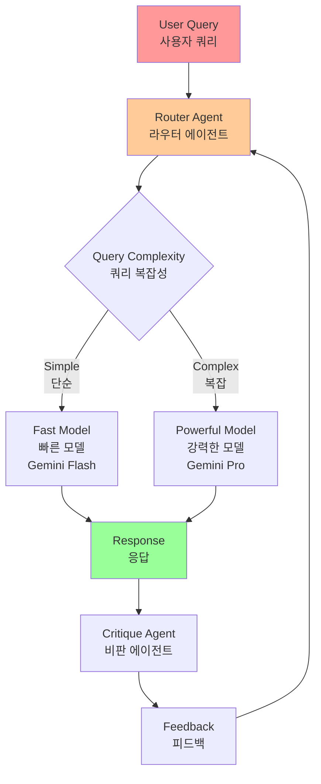
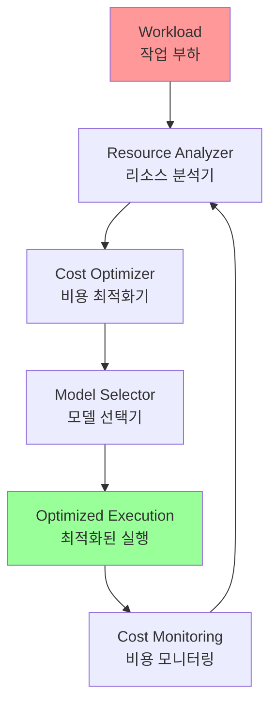

# Chapter 16: Resource-Aware Optimization

## 개요

Resource-Aware Optimization enables intelligent agents to dynamically monitor and manage computational, temporal, and financial resources during operation. This differs from simple planning, which primarily focuses on action sequencing. Resource-Aware Optimization requires agents to make decisions about action execution to achieve goals within specified resource budgets or to optimize efficiency.

This involves choosing between more accurate but costly models versus faster and cheaper ones, or deciding whether to allocate additional computation for more refined responses versus returning faster but less detailed answers.

For example, consider an agent tasked with analyzing a large dataset for a financial analyst. If the analyst needs a preliminary report immediately, the agent might use a faster, cheaper model to quickly summarize key trends. However, if the analyst requires highly accurate predictions for critical investment decisions and has a larger budget and more time, the agent will allocate more resources to leverage a powerful, slower, but more accurate predictive model. A key strategy in this category is fallback mechanisms, which act as safety nets when preferred models are overloaded or limited and unavailable. To ensure graceful degradation, the system automatically switches to default or cheaper models, maintaining service continuity rather than failing completely.

Resource-Aware Optimization는 지능형 에이전트가 작동 중에 계산, 시간 및 재정적 리소스를 동적으로 모니터링하고 관리할 수 있게 합니다. 이것은 주로 행동 순서에 초점을 맞추는 단순한 계획과 다릅니다. Resource-Aware Optimization는 에이전트가 지정된 리소스 예산 내에서 목표를 달성하거나 효율성을 최적화하기 위해 행동 실행에 대한 결정을 내리도록 요구합니다.

이것은 더 정확하지만 비용이 많이 드는 모델과 더 빠르고 저렴한 모델 사이에서 선택하거나, 더 정제된 응답을 위해 추가 계산을 할당할지, 아니면 더 빠르지만 덜 상세한 답변을 반환할지 결정하는 것을 포함합니다.

예를 들어, 금융 분석가를 위해 대규모 데이터셋을 분석하는 작업을 맡은 에이전트를 고려해보세요. 분석가가 즉시 예비 보고서가 필요한 경우, 에이전트는 주요 트렌드를 빠르게 요약하기 위해 더 빠르고 저렴한 모델을 사용할 수 있습니다. 그러나 분석가가 중요한 투자 결정을 위해 매우 정확한 예측이 필요하고 더 큰 예산과 더 많은 시간이 있는 경우, 에이전트는 강력하고 느리지만 더 정확한 예측 모델을 활용하기 위해 더 많은 리소스를 할당할 것입니다. 이 범주에서 핵심 전략은 폴백 메커니즘으로, 선호하는 모델이 과부하되거나 제한되어 사용할 수 없을 때 안전장치 역할을 합니다. 우아한 성능 저하를 보장하기 위해 시스템은 자동으로 기본 또는 더 저렴한 모델로 전환하여 완전히 실패하는 대신 서비스 연속성을 유지합니다.

## 패턴 개요 (Pattern Overview)

Resource-aware optimization is paramount in developing intelligent agent systems that operate efficiently and effectively within real-world constraints.

리소스 인식 최적화는 실제 세계 제약 내에서 효율적이고 효과적으로 작동하는 지능형 에이전트 시스템을 개발하는 데 매우 중요합니다.

Resource-Aware Optimization는 에이전트가 작업의 복잡성, 사용 가능한 리소스, 예산 제약에 따라 동적으로 모델과 도구를 선택할 수 있게 합니다.



### 핵심 전략

1. **동적 모델 전환**: 작업의 복잡성과 사용 가능한 리소스에 따라 LLM을 전략적으로 선택
2. **폴백 메커니즘**: 선호 모델이 사용 불가능할 때 자동으로 대체 모델로 전환
3. **비용 최적화**: 예산 제약 내에서 적절한 모델 선택
4. **지연 시간 최적화**: 실시간 시스템에서 빠른 응답을 위한 모델 선택

## 실용적 응용 및 사용 사례

Resource-Aware Optimization enables intelligent agents to dynamically monitor and manage computational, temporal, and financial resources during operation. This involves choosing between more accurate but costly models versus faster and cheaper ones, or deciding whether to allocate additional computation for more refined responses versus returning faster but less detailed answers.

리소스 인식 최적화는 지능형 에이전트가 작동 중에 계산, 시간 및 재정적 리소스를 동적으로 모니터링하고 관리할 수 있게 합니다. 이것은 더 정확하지만 비용이 많이 드는 모델과 더 빠르고 저렴한 모델 사이에서 선택하거나, 더 정제된 응답을 위해 추가 계산을 할당할지, 아니면 더 빠르지만 덜 상세한 답변을 반환할지 결정하는 것을 포함합니다.

- **비용 최적화된 LLM 사용**: 예산 제약에 따라 복잡한 작업에는 큰 비용이 드는 LLM, 간단한 쿼리에는 작고 저렴한 LLM 사용
- **지연 시간 민감 작업**: 실시간 시스템에서 적시 응답을 보장하기 위해 더 빠르지만 덜 포괄적인 추론 경로 선택
- **에너지 효율성**: 엣지 장치나 제한된 전력 환경에서 배터리 수명을 보존하기 위한 처리 최적화
- **서비스 안정성을 위한 폴백**: 기본 선택이 사용 불가능할 때 자동으로 백업 모델로 전환
- **데이터 사용 관리**: 대역폭이나 저장 공간을 절약하기 위해 전체 데이터셋 다운로드 대신 요약된 데이터 검색 선택
- **적응형 작업 할당**: 다중 에이전트 시스템에서 에이전트가 현재 계산 부하나 사용 가능한 시간을 기반으로 작업을 자체 할당

## 실습 코드 예제

사용자 질문에 답변하는 지능형 시스템은 각 질문의 난이도를 평가할 수 있습니다. 간단한 쿼리의 경우 Gemini Flash와 같은 비용 효율적인 언어 모델을 활용합니다. 복잡한 문의의 경우 더 강력하지만 비용이 많이 드는 언어 모델(예: Gemini Pro)을 고려합니다. 더 강력한 모델을 사용할지에 대한 결정은 리소스 가용성, 특히 예산 및 시간 제약에 따라 달라집니다. 이 시스템은 적절한 모델을 동적으로 선택합니다.

예를 들어, 계층적 에이전트로 구축된 여행 계획자를 고려해보세요. 사용자의 복잡한 요청을 이해하고, 이를 다단계 여정으로 분해하며, 논리적 결정을 내리는 고수준 계획은 Gemini Pro와 같은 정교하고 더 강력한 LLM에 의해 관리됩니다. 이것은 컨텍스트에 대한 깊은 이해와 추론 능력이 필요한 "계획자" 에이전트입니다.

그러나 계획이 수립되면, 그 계획 내의 개별 작업(예: 항공편 가격 조회, 호텔 가용성 확인, 레스토랑 리뷰 찾기)은 본질적으로 간단하고 반복적인 웹 쿼리입니다. 이러한 "도구 함수 호출"은 Gemini Flash와 같은 더 빠르고 저렴한 모델에 의해 실행될 수 있습니다. 저렴한 모델이 이러한 간단한 웹 검색에 사용될 수 있는 이유를 시각화하는 것이 더 쉽지만, 복잡한 계획 단계는 일관되고 논리적인 여행 계획을 보장하기 위해 더 고급 모델의 더 큰 지능을 필요로 합니다.

Google의 ADK는 모듈식 및 확장 가능한 애플리케이션을 가능하게 하는 다중 에이전트 아키텍처를 통해 이 접근 방식을 지원합니다. 다양한 에이전트가 특수 작업을 처리할 수 있습니다. 모델 유연성은 Gemini Pro와 Gemini Flash를 모두 포함하여 다양한 Gemini 모델을 직접 사용하거나 LiteLLM을 통해 다른 모델을 통합할 수 있게 합니다. ADK의 오케스트레이션 기능은 적응형 행동을 위한 동적 LLM 기반 라우팅을 지원합니다. 내장된 평가 기능은 에이전트 성능을 체계적으로 평가할 수 있게 하며, 이는 시스템 정제에 사용될 수 있습니다(평가 및 모니터링 챕터 참조).

### ADK 에이전트 예제

다음은 동일한 설정이지만 다른 모델과 비용을 사용하는 두 에이전트를 정의합니다.

```python
# 개념적 Python 구조, 실행 가능한 코드가 아님
from google.adk.agents import Agent

# 더 비싼 Gemini Pro 2.5를 사용하는 에이전트
gemini_pro_agent = Agent(
    name="GeminiProAgent",
    model="gemini-2.5-pro",  # 실제 모델 이름이 다른 경우를 위한 플레이스홀더
    description="A highly capable agent for complex queries.",
    instruction="You are an expert assistant for complex problem-solving."
)

# 덜 비싼 Gemini Flash 2.5를 사용하는 에이전트
gemini_flash_agent = Agent(
    name="GeminiFlashAgent",
    model="gemini-2.5-flash",  # 실제 모델 이름이 다른 경우를 위한 플레이스홀더
    description="A fast and efficient agent for simple queries.",
    instruction="You are a quick assistant for straightforward questions."
)
```

라우터 에이전트는 쿼리 길이와 같은 간단한 메트릭을 기반으로 쿼리를 지시할 수 있으며, 짧은 쿼리는 덜 비싼 모델로, 긴 쿼리는 더 강력한 모델로 보냅니다. 그러나 더 정교한 라우터 에이전트는 LLM 또는 ML 모델을 활용하여 쿼리의 뉘앙스와 복잡성을 분석할 수 있습니다. 이 LLM 라우터는 어떤 다운스트림 언어 모델이 가장 적합한지 결정할 수 있습니다. 예를 들어, 사실 회상을 요청하는 쿼리는 Flash 모델로 라우팅되고, 깊은 분석이 필요한 복잡한 쿼리는 Pro 모델로 라우팅됩니다.

최적화 기술은 LLM 라우터의 효과를 더욱 향상시킬 수 있습니다. 프롬프트 튜닝은 더 나은 라우팅 결정을 위해 라우터 LLM을 안내하는 프롬프트를 만드는 것을 포함합니다. 쿼리와 최적 모델 선택의 데이터셋에서 LLM 라우터를 파인튜닝하면 정확성과 효율성이 향상됩니다. 이 동적 라우팅 기능은 응답 품질과 비용 효율성의 균형을 맞춥니다.

```python
# 개념적 Python 구조, 실행 가능한 코드가 아님
from google.adk.agents import Agent, BaseAgent
from google.adk.events import Event
from google.adk.agents.invocation_context import InvocationContext
import asyncio

class QueryRouterAgent(BaseAgent):
    name: str = "QueryRouter"
    description: str = "Routes user queries to the appropriate LLM agent based on complexity."
    
    async def _run_async_impl(self, context: InvocationContext) -> AsyncGenerator[Event, None]:
        user_query = context.current_message.text  # 텍스트 입력 가정
        query_length = len(user_query.split())  # 간단한 메트릭: 단어 수
        
        if query_length < 20:  # 단순성 vs 복잡성에 대한 예제 임계값
            print(f"Routing to Gemini Flash Agent for short query (length: {query_length})")
            # 실제 ADK 설정에서는 'transfer_to_agent'를 사용하거나 직접 호출
            # 데모를 위해 호출을 시뮬레이션하고 응답을 생성
            response = await gemini_flash_agent.run_async(context.current_message)
            yield Event(author=self.name, content=f"Flash Agent processed: {response}")
        else:
            print(f"Routing to Gemini Pro Agent for long query (length: {query_length})")
            response = await gemini_pro_agent.run_async(context.current_message)
            yield Event(author=self.name, content=f"Pro Agent processed: {response}")
```

### Critique Agent (비판 에이전트)

Critique Agent는 언어 모델의 응답을 평가하여 여러 기능을 제공하는 피드백을 제공합니다. 자기 수정을 위해 오류나 불일치를 식별하여 응답 에이전트가 개선된 품질을 위해 출력을 정제하도록 유도합니다. 또한 성능 모니터링을 위해 응답을 체계적으로 평가하며, 최적화에 사용되는 정확성 및 관련성과 같은 메트릭을 추적합니다. 또한 피드백은 강화 학습이나 파인튜닝을 신호할 수 있습니다. 예를 들어, 부적절한 Flash 모델 응답을 일관되게 식별하면 라우터 에이전트의 로직을 정제할 수 있습니다. 비판 에이전트는 예산을 직접 관리하지는 않지만, 간단한 쿼리를 Pro 모델로 보내거나 복잡한 쿼리를 Flash 모델로 보내는 것과 같은 차선의 라우팅 선택을 식별함으로써 간접적인 예산 관리에 기여합니다. 이는 리소스 할당과 비용 절감을 개선하는 조정을 알립니다.

Critique Agent는 응답 에이전트에서 생성된 텍스트만 검토하도록 구성하거나 원래 쿼리와 생성된 텍스트를 모두 검토하도록 구성할 수 있어 초기 질문에 대한 응답의 정렬을 포괄적으로 평가할 수 있습니다.

```python
CRITIC_SYSTEM_PROMPT = """
You are the **Critic Agent**, serving as the quality assurance arm of
our collaborative research assistant system. Your primary function is
to **meticulously review and challenge** information from the
Researcher Agent, guaranteeing **accuracy, completeness, and unbiased
presentation**.

Your duties encompass:
* **Assessing research findings** for factual correctness,
thoroughness, and potential leanings.
* **Identifying any missing data** or inconsistencies in reasoning.
* **Raising critical questions** that could refine or expand the
current understanding.
* **Offering constructive suggestions** for enhancement or exploring
different angles.
* **Validating that the final output is comprehensive** and balanced.

All criticism must be constructive. Your goal is to fortify the
research, not invalidate it. Structure your feedback clearly, drawing
attention to specific points for revision. Your overarching aim is to
ensure the final research product meets the highest possible quality
standards.
"""
```

Critic Agent는 역할, 책임 및 피드백 접근 방식을 설명하는 사전 정의된 시스템 프롬프를 기반으로 작동합니다. 이 에이전트를 위한 잘 설계된 프롬프는 평가자로서의 기능을 명확히 설정해야 합니다. 비판적 초점을 위한 영역을 지정하고 단순한 거부가 아닌 건설적인 피드백을 제공하는 것을 강조해야 합니다. 프롬프는 또한 강점과 약점 모두를 식별하도록 장려하고, 에이전트가 피드백을 구조화하고 제시하는 방법을 안내해야 합니다.

### OpenAI를 사용한 실습 코드

이 시스템은 사용자 쿼리를 효율적으로 처리하기 위해 리소스 인식 최적화 전략을 사용합니다. 먼저 각 쿼리를 세 가지 범주 중 하나로 분류하여 가장 적절하고 비용 효율적인 처리 경로를 결정합니다. 이 접근 방식은 간단한 요청에 계산 리소스를 낭비하는 것을 피하면서 복잡한 쿼리가 필요한 관심을 받도록 보장합니다. 세 가지 범주는 다음과 같습니다:

- **simple**: 복잡한 추론이나 외부 데이터 없이 직접 답변할 수 있는 간단한 질문
- **reasoning**: 논리적 추론이나 다단계 사고 과정이 필요한 쿼리로, 더 강력한 모델로 라우팅됨
- **internet_search**: 최신 정보가 필요한 질문으로, 최신 답변을 제공하기 위해 자동으로 Google 검색을 트리거함

코드는 MIT 라이선스 하에 있으며 GitHub에서 사용 가능합니다:
https://github.com/mahtabsyed/21-Agentic-Patterns/blob/main/16_Resource_Aware_Opt_LLM_Reflection_v2.ipynb

```python
# MIT License
# Copyright (c) 2025 Mahtab Syed
# https://www.linkedin.com/in/mahtabsyed/
import os
import requests
import json
from dotenv import load_dotenv
from openai import OpenAI

# 환경 변수 로드
load_dotenv()

OPENAI_API_KEY = os.getenv("OPENAI_API_KEY")
GOOGLE_CUSTOM_SEARCH_API_KEY = os.getenv("GOOGLE_CUSTOM_SEARCH_API_KEY")
GOOGLE_CSE_ID = os.getenv("GOOGLE_CSE_ID")

if not OPENAI_API_KEY or not GOOGLE_CUSTOM_SEARCH_API_KEY or not GOOGLE_CSE_ID:
    raise ValueError(
        "Please set OPENAI_API_KEY, GOOGLE_CUSTOM_SEARCH_API_KEY, and "
        "GOOGLE_CSE_ID in your .env file."
    )

client = OpenAI(api_key=OPENAI_API_KEY)

# --- 1단계: 프롬프트 분류 ---
def classify_prompt(prompt: str) -> dict:
    system_message = {
        "role": "system",
        "content": (
            "You are a classifier that analyzes user prompts and "
            "returns one of three categories ONLY:\n\n"
            "- simple\n"
            "- reasoning\n"
            "- internet_search\n\n"
            "Rules:\n"
            "- Use 'simple' for direct factual questions that need no "
            "reasoning or current events.\n"
            "- Use 'reasoning' for logic, math, or multi-step "
            "inference questions.\n"
            "- Use 'internet_search' if the prompt refers to current "
            "events, recent data, or things not in your training data.\n\n"
            "Respond ONLY with JSON like:\n"
            '{ "classification": "simple" }'
        ),
    }
    user_message = {"role": "user", "content": prompt}
    response = client.chat.completions.create(
        model="gpt-4o", messages=[system_message, user_message], temperature=1
    )
    reply = response.choices[0].message.content
    return json.loads(reply)

# --- 2단계: Google 검색 ---
def google_search(query: str, num_results=1) -> list:
    url = "https://www.googleapis.com/customsearch/v1"
    params = {
        "key": GOOGLE_CUSTOM_SEARCH_API_KEY,
        "cx": GOOGLE_CSE_ID,
        "q": query,
        "num": num_results,
    }
    try:
        response = requests.get(url, params=params)
        response.raise_for_status()
        results = response.json()
        if "items" in results and results["items"]:
            return [
                {
                    "title": item.get("title"),
                    "snippet": item.get("snippet"),
                    "link": item.get("link"),
                }
                for item in results["items"]
            ]
        else:
            return []
    except requests.exceptions.RequestException as e:
        return {"error": str(e)}

# --- 3단계: 응답 생성 ---
def generate_response(prompt: str, classification: str, search_results=None) -> str:
    if classification == "simple":
        model = "gpt-4o-mini"
        full_prompt = prompt
    elif classification == "reasoning":
        model = "o4-mini"
        full_prompt = prompt
    elif classification == "internet_search":
        model = "gpt-4o"
        # 각 검색 결과 dict를 읽기 가능한 문자열로 변환
        if search_results:
            search_context = "\n".join(
                [
                    f"Title: {item.get('title')}\nSnippet: {item.get('snippet')}\nLink: {item.get('link')}"
                    for item in search_results
                ]
            )
        else:
            search_context = "No search results found."
        full_prompt = f"""Use the following web results to answer the user query:
{search_context}

Query: {prompt}"""
    
    response = client.chat.completions.create(
        model=model,
        messages=[{"role": "user", "content": full_prompt}],
        temperature=1,
    )
    return response.choices[0].message.content, model

# --- 4단계: 통합 라우터 ---
def handle_prompt(prompt: str) -> dict:
    classification_result = classify_prompt(prompt)
    classification = classification_result["classification"]
    search_results = None
    if classification == "internet_search":
        search_results = google_search(prompt)
    answer, model = generate_response(prompt, classification, search_results)
    return {"classification": classification, "response": answer, "model": model}

# 테스트
test_prompt = "What is the capital of Australia?"
# test_prompt = "Explain the impact of quantum computing on cryptography."
# test_prompt = "When does the Australian Open 2026 start, give me full date?"
result = handle_prompt(test_prompt)
print(" Classification:", result["classification"])
print(" Model Used:", result["model"])
print(" Response:\n", result["response"])
```

이 Python 코드는 사용자 질문에 답변하기 위한 프롬프트 라우팅 시스템을 구현합니다. OpenAI와 Google Custom Search를 위한 .env 파일에서 필요한 API 키를 로드하는 것으로 시작합니다. 핵심 기능은 사용자의 프롬프트를 세 가지 범주로 분류하는 것입니다: simple, reasoning, 또는 internet search. 전용 함수가 이 분류 단계를 위해 OpenAI 모델을 활용합니다. 프롬프트가 최신 정보를 요구하는 경우 Google Custom Search API를 사용하여 Google 검색이 수행됩니다. 다른 함수는 분류를 기반으로 적절한 OpenAI 모델을 선택하여 최종 응답을 생성합니다. 인터넷 검색 쿼리의 경우 검색 결과가 모델에 컨텍스트로 제공됩니다. 주요 handle_prompt 함수는 이 워크플로를 조정하며, 응답을 생성하기 전에 분류 및 검색(필요한 경우) 함수를 호출합니다. 분류, 사용된 모델 및 생성된 답변을 반환합니다. 이 시스템은 더 나은 응답을 위해 다양한 유형의 쿼리를 최적화된 방법으로 효율적으로 지시합니다.

### OpenRouter를 사용한 실습 코드 예제

OpenRouter는 단일 API 엔드포인트를 통해 수백 개의 AI 모델에 대한 통합 인터페이스를 제공합니다. 자동화된 장애 조치 및 비용 최적화를 제공하며, 선호하는 SDK나 프레임워크를 통해 쉽게 통합할 수 있습니다.

```python
import requests
import json

response = requests.post(
    url="https://openrouter.ai/api/v1/chat/completions",
    headers={
        "Authorization": "Bearer <OPENROUTER_API_KEY>",
        "HTTP-Referer": "<YOUR_SITE_URL>",  # 선택사항. openrouter.ai의 순위를 위한 사이트 URL
        "X-Title": "<YOUR_SITE_NAME>",  # 선택사항. openrouter.ai의 순위를 위한 사이트 제목
    },
    data=json.dumps({
        "model": "openai/gpt-4o",  # 선택사항
        "messages": [
            {
                "role": "user",
                "content": "What is the meaning of life?"
            }
        ]
    })
)
```

이 코드 스니펫은 requests 라이브러리를 사용하여 OpenRouter API와 상호작용합니다. 사용자 메시지와 함께 채팅 완성 엔드포인트에 POST 요청을 보냅니다. 요청에는 API 키가 있는 인증 헤더와 선택적 사이트 정보가 포함됩니다. 목표는 지정된 언어 모델(이 경우 "openai/gpt-4o")로부터 응답을 받는 것입니다.

OpenRouter는 요청을 처리하는 데 사용되는 계산 모델을 라우팅하고 결정하기 위한 두 가지 고유한 방법론을 제공합니다:

- **자동 모델 선택**: 이 기능은 사용자 프롬프트의 특정 내용에 따라 사용 가능한 모델의 큐레이션된 세트에서 선택된 최적화된 모델로 요청을 라우팅합니다. 최종적으로 요청을 처리하는 모델의 식별자가 응답의 메타데이터에 반환됩니다.

```json
{
  "model": "openrouter/auto",
  ... // 기타 매개변수
}
```

- **순차적 모델 폴백**: 이 메커니즘은 사용자가 모델의 계층적 목록을 지정할 수 있게 하여 운영 중복성을 제공합니다. 시스템은 먼저 시퀀스에 지정된 기본 모델로 요청을 처리하려고 시도합니다. 서비스 사용 불가, 속도 제한 또는 콘텐츠 필터링과 같은 여러 오류 조건으로 인해 이 기본 모델이 응답하지 못하면 시스템은 자동으로 시퀀스의 다음 지정된 모델로 요청을 재라우팅합니다. 이 프로세스는 목록의 모델이 요청을 성공적으로 실행하거나 목록이 소진될 때까지 계속됩니다. 작업의 최종 비용과 응답에 반환된 모델 식별자는 계산을 성공적으로 완료한 모델에 해당합니다.

```json
{
  "models": ["anthropic/claude-3.5-sonnet", "gryphe/mythomax-l2-13b"],
  ... // 기타 매개변수
}
```

OpenRouter는 사용 가능한 AI 모델을 누적 토큰 생산량에 따라 순위를 매기는 상세한 리더보드(https://openrouter.ai/rankings)를 제공합니다. 또한 다양한 제공업체(ChatGPT, Gemini, Claude)의 최신 모델도 제공합니다.

## 동적 모델 전환을 넘어서: 에이전트 리소스 최적화의 스펙트럼

리소스 인식 최적화는 실제 제약 조건 내에서 효율적이고 효과적으로 작동하는 지능형 에이전트 시스템을 개발하는 데 매우 중요합니다. 추가 기술들을 살펴보겠습니다:

### 1. 동적 모델 전환 (Dynamic Model Switching)

작업의 복잡성과 사용 가능한 계산 리소스를 기반으로 대규모 언어 모델을 전략적으로 선택하는 중요한 기술입니다. 간단한 쿼리에 직면하면 경량의 비용 효율적인 LLM을 배포할 수 있는 반면, 복잡하고 다면적인 문제는 더 정교하고 리소스 집약적인 모델의 활용을 필요로 합니다.

### 2. 적응형 도구 사용 및 선택 (Adaptive Tool Use & Selection)

에이전트가 도구 모음에서 지능적으로 선택할 수 있도록 보장하며, 각 특정 하위 작업에 가장 적절하고 효율적인 도구를 선택합니다. API 사용 비용, 지연 시간 및 실행 시간과 같은 요소를 신중하게 고려합니다. 이 동적 도구 선택은 외부 API 및 서비스의 사용을 최적화하여 전체 시스템 효율성을 향상시킵니다.

### 3. 컨텍스트 정제 및 요약 (Contextual Pruning & Summarization)

에이전트가 처리하는 정보의 양을 관리하는 데 중요한 역할을 하며, 프롬프트 토큰 수를 전략적으로 최소화하고 상호작용 기록에서 가장 관련성 높은 정보만 지능적으로 요약하고 선택적으로 유지함으로써 추론 비용을 줄입니다. 이는 불필요한 계산 오버헤드를 방지합니다.

### 4. 사전 예방적 리소스 예측 (Proactive Resource Prediction)

미래 워크로드 및 시스템 요구사항을 예측하여 리소스 수요를 예상하는 것을 포함하며, 이는 사전 예방적 할당 및 리소스 관리를 가능하게 하여 시스템 응답성을 보장하고 병목 현상을 방지합니다.

### 5. 다중 에이전트 시스템의 비용 인식 탐색 (Cost-Sensitive Exploration)

최적화 고려사항을 전통적인 계산 비용과 함께 통신 비용을 포함하도록 확장하여 에이전트가 협업하고 정보를 공유하는 데 사용하는 전략에 영향을 미치며, 전체 리소스 지출을 최소화하는 것을 목표로 합니다.

### 6. 에너지 효율적 배포 (Energy-Efficient Deployment)

엄격한 리소스 제약이 있는 환경에 특별히 맞춰져 있으며, 지능형 에이전트 시스템의 에너지 발자국을 최소화하여 운영 시간을 연장하고 전체 운영 비용을 줄이는 것을 목표로 합니다.

### 7. 병렬화 및 분산 컴퓨팅 인식 (Parallelization & Distributed Computing Awareness)

분산 리소스를 활용하여 에이전트의 처리 능력 및 처리량을 향상시키며, 계산 워크로드를 여러 머신이나 프로세서에 분산시켜 더 큰 효율성과 더 빠른 작업 완료를 달성합니다.

### 8. 학습된 리소스 할당 정책 (Learned Resource Allocation Policies)

학습 메커니즘을 도입하여 에이전트가 피드백 및 성능 메트릭을 기반으로 시간이 지남에 따라 리소스 할당 전략을 적응하고 최적화할 수 있게 하며, 지속적인 정제를 통해 효율성을 개선합니다.

### 9. 우아한 성능 저하 및 폴백 메커니즘 (Graceful Degradation and Fallback Mechanisms)

지능형 에이전트 시스템이 리소스 제약이 심각할 때도 감소된 용량일 수 있지만 계속 작동할 수 있도록 보장하며, 성능을 우아하게 저하시키고 대체 전략으로 폴백하여 운영을 유지하고 필수 기능을 제공합니다.

## 한눈에 보기 (At a Glance)

### 무엇 (What)

Resource-Aware Optimization는 지능형 시스템에서 계산, 시간 및 재정적 리소스의 소비를 관리하는 도전을 해결합니다. LLM 기반 애플리케이션은 비용이 많이 들고 느릴 수 있으며, 모든 작업에 대해 최상의 모델이나 도구를 선택하는 것은 종종 비효율적입니다. 이것은 시스템 출력의 품질과 이를 생성하는 데 필요한 리소스 간의 근본적인 트레이드오프를 만듭니다. 동적 관리 전략 없이는 시스템이 다양한 작업 복잡성에 적응하거나 예산 및 성능 제약 내에서 작동할 수 없습니다.

### 왜 (Why)

표준화된 솔루션은 작업에 따라 지능적으로 리소스를 모니터링하고 할당하는 에이전트 시스템을 구축하는 것입니다. 이 패턴은 일반적으로 들어오는 요청의 복잡성을 먼저 분류하기 위해 "Router Agent"를 사용합니다. 그런 다음 요청이 가장 적합한 LLM 또는 도구로 전달됩니다—간단한 쿼리에는 빠르고 저렴한 모델, 복잡한 추론에는 더 강력한 모델. "Critique Agent"는 응답의 품질을 평가하여 라우팅 로직을 시간이 지남에 따라 개선하기 위한 피드백을 제공함으로써 프로세스를 더욱 정제할 수 있습니다. 이 동적 다중 에이전트 접근 방식은 시스템이 효율적으로 작동하며 응답 품질과 비용 효율성의 균형을 맞추도록 보장합니다.

### 경험 법칙 (Rule of Thumb)

API 호출이나 계산 능력에 대한 엄격한 재정 예산 하에서 운영할 때, 빠른 응답 시간이 중요한 지연 시간 민감 애플리케이션을 구축할 때, 제한된 배터리 수명을 가진 엣지 장치와 같은 리소스 제약 하드웨어에 에이전트를 배포할 때, 응답 품질과 운영 비용 간의 트레이드오프를 프로그래밍 방식으로 균형을 맞출 때, 그리고 다양한 작업이 다양한 리소스 요구사항을 가진 복잡한 다단계 워크플로를 관리할 때 이 패턴을 사용하세요.

## 핵심 요약 (Key Takeaways)

1. **Resource-Aware Optimization는 필수적입니다**: 지능형 에이전트는 계산, 시간 및 재정적 리소스를 동적으로 관리할 수 있습니다. 모델 사용 및 실행 경로에 대한 결정은 실시간 제약 및 목표를 기반으로 이루어집니다.

2. **확장성을 위한 다중 에이전트 아키텍처**: Google의 ADK는 모듈식 설계를 가능하게 하는 다중 에이전트 프레임워크를 제공합니다. 다양한 에이전트(응답, 라우팅, 비판)가 특정 작업을 처리합니다.

3. **동적 LLM 기반 라우팅**: 라우터 에이전트는 쿼리 복잡성과 예산에 따라 언어 모델(간단한 경우 Gemini Flash, 복잡한 경우 Gemini Pro)로 쿼리를 지시합니다. 이것은 비용과 성능을 최적화합니다.

4. **Critique Agent 기능**: 전용 Critique Agent는 자기 수정, 성능 모니터링 및 라우팅 로직 정제를 위한 피드백을 제공하여 시스템 효과를 향상시킵니다.

5. **피드백 및 유연성을 통한 최적화**: 비판을 위한 평가 기능과 모델 통합 유연성은 적응형 및 자기 개선 시스템 행동에 기여합니다.

6. **추가 리소스 인식 최적화**: 다른 방법에는 적응형 도구 사용 및 선택, 컨텍스트 정제 및 요약, 사전 예방적 리소스 예측, 다중 에이전트 시스템의 비용 인식 탐색, 에너지 효율적 배포, 병렬화 및 분산 컴퓨팅 인식, 학습된 리소스 할당 정책, 우아한 성능 저하 및 폴백 메커니즘, 그리고 중요한 작업의 우선순위 지정이 포함됩니다.

## 결론

리소스 인식 최적화는 지능형 에이전트 개발에 필수적이며, 실제 제약 조건 내에서 효율적인 작동을 가능하게 합니다. 계산, 시간 및 재정적 리소스를 관리함으로써 에이전트는 최적의 성능과 비용 효율성을 달성할 수 있습니다. 동적 모델 전환, 적응형 도구 사용, 컨텍스트 정제와 같은 기술은 이러한 효율성을 달성하는 데 중요합니다. 학습된 리소스 할당 정책 및 우아한 성능 저하를 포함한 고급 전략은 다양한 조건에서 에이전트의 적응성과 복원력을 향상시킵니다. 에이전트 설계에 이러한 최적화 원칙을 통합하는 것은 확장 가능하고 견고하며 지속 가능한 AI 시스템을 구축하는 데 기본적입니다.

## 참고 자료 (References)

1. Google's Agent Development Kit (ADK): https://google.github.io/adk-docs/
2. Gemini Flash 2.5 & Gemini 2.5 Pro: https://aistudio.google.com/
## 이론적 배경 및 학술적 근거 (Theoretical Background and Academic Foundation)

### 최적화 이론 (Optimization Theory)

Resource-Aware Optimization은 최적화 이론의 원칙을 적용합니다.

**최적화 문제**:
- **목적 함수**: 최소화 또는 최대화할 대상 (비용, 시간 등)
- **제약 조건**: 만족해야 하는 조건 (예산, 시간 제한 등)
- **변수**: 조정 가능한 파라미터 (모델 선택, 리소스 할당 등)

**에이전트 시스템에서의 적용**:
- 비용 최소화: 예산 제약 내에서 최적 모델 선택
- 시간 최소화: 지연 시간 제약 내에서 최적 경로 선택
- 품질 최대화: 리소스 제약 내에서 최대 품질 달성

### 비용-효과 분석 (Cost-Benefit Analysis)

비용-효과 분석은 리소스 투입과 결과를 비교합니다.

**비용-효과 원칙**:
- **비용**: 리소스 사용량 (계산, 시간, 금전)
- **효과**: 달성된 결과 (정확도, 품질, 사용자 만족도)
- **비율**: 효과/비용 비율 최대화

**에이전트 시스템에서의 적용**:
- 모델별 비용-효과 분석
- 작업 복잡도에 따른 모델 선택
- 동적 모델 전환

### 적응적 리소스 관리 (Adaptive Resource Management)

시스템이 동적으로 리소스를 조정합니다.

**적응 메커니즘**:
- **모니터링**: 현재 리소스 사용량 추적
- **예측**: 미래 리소스 요구 예측
- **조정**: 리소스 할당 조정
- **평가**: 조정 효과 평가

**에이전트 시스템에서의 구현**:
- 실시간 리소스 모니터링
- 작업 부하 예측
- 동적 모델 선택
- 성능 평가 및 피드백

### 게임 이론: 리소스 경쟁

여러 에이전트가 리소스를 경쟁할 때 게임 이론이 적용됩니다.

**리소스 할당 게임**:
- **플레이어**: 여러 에이전트
- **전략**: 리소스 요청 전략
- **보상**: 할당된 리소스로 달성한 성과
- **균형**: 내시 균형에서 최적 할당

**에이전트 시스템에서의 적용**:
- 다중 에이전트 환경에서 리소스 공유
- 공정한 리소스 할당
- 우선순위 기반 할당

## 성능 최적화 기법 (Performance Optimization Techniques)

### 1. 동적 모델 선택 최적화

작업 특성에 따른 최적 모델 선택:

```python
class DynamicModelSelector:
    def __init__(self):
        self.models = {
            'simple': {'model': 'gpt-4o-mini', 'cost': 0.1, 'latency': 0.5},
            'medium': {'model': 'gpt-4o', 'cost': 1.0, 'latency': 2.0},
            'complex': {'model': 'gpt-4-turbo', 'cost': 10.0, 'latency': 5.0}
        }
        self.budget = 100.0
        self.time_limit = 10.0
    
    def select_model(self, task_complexity: float, 
                    available_budget: float, 
                    time_constraint: float) -> str:
        """작업 특성에 따른 모델 선택"""
        # 비용-효과 분석
        candidates = []
        for level, specs in self.models.items():
            if (specs['cost'] <= available_budget and 
                specs['latency'] <= time_constraint):
                # 예상 품질 점수
                quality_score = self.estimate_quality(level, task_complexity)
                # 비용-효과 비율
                efficiency = quality_score / specs['cost']
                candidates.append((level, efficiency, specs))
        
        # 최고 효율 모델 선택
        if candidates:
            best = max(candidates, key=lambda x: x[1])
            return best[0]
        
        # 제약 조건 내 최선의 모델
        return self.fallback_selection(available_budget, time_constraint)
```

### 2. 리소스 예산 관리

리소스 사용량을 예산 내로 제한:

```python
class ResourceBudgetManager:
    def __init__(self, daily_budget: float):
        self.daily_budget = daily_budget
        self.used_budget = 0.0
        self.usage_history = []
    
    def check_budget(self, estimated_cost: float) -> bool:
        """예산 확인"""
        if self.used_budget + estimated_cost > self.daily_budget:
            return False
        return True
    
    def allocate_resource(self, cost: float):
        """리소스 할당 및 예산 차감"""
        if self.check_budget(cost):
            self.used_budget += cost
            self.usage_history.append({
                'cost': cost,
                'timestamp': datetime.now()
            })
            return True
        else:
            # 예산 초과 시 저비용 대안 사용
            return self.use_fallback()
    
    def reset_daily_budget(self):
        """일일 예산 초기화"""
        self.used_budget = 0.0
        self.usage_history = []
```

### 3. 지연 시간 최적화

응답 시간을 최소화하는 전략:

```python
class LatencyOptimizer:
    def __init__(self):
        self.model_latencies = {}
        self.cache = {}
    
    def optimize_for_latency(self, query: str, max_latency: float) -> str:
        """지연 시간 제약 내 최적 모델 선택"""
        # 캐시 확인
        if query in self.cache:
            return self.cache[query]
        
        # 빠른 모델부터 시도
        for model_name, latency in sorted(
            self.model_latencies.items(), 
            key=lambda x: x[1]
        ):
            if latency <= max_latency:
                # 모델이 제약을 만족하면 사용
                result = self.use_model(model_name, query)
                self.cache[query] = result
                return result
        
        # 제약을 만족하는 모델이 없으면 가장 빠른 모델 사용
        fastest_model = min(
            self.model_latencies.items(), 
            key=lambda x: x[1]
        )[0]
        return self.use_model(fastest_model, query)
```

### 4. 에너지 효율 최적화

에너지 소비를 최소화:

```python
class EnergyOptimizer:
    def __init__(self):
        self.energy_profiles = {
            'cpu_intensive': 10.0,
            'gpu_intensive': 50.0,
            'memory_intensive': 5.0,
            'network_intensive': 2.0
        }
    
    def optimize_energy(self, task: Task, available_energy: float):
        """에너지 제약 내 최적 작업 할당"""
        # 작업 유형 분석
        task_type = self.analyze_task_type(task)
        energy_cost = self.energy_profiles.get(task_type, 10.0)
        
        if energy_cost > available_energy:
            # 에너지 부족 시 저에너지 대안 사용
            return self.use_low_energy_alternative(task)
        
        return self.execute_task(task, task_type)
```

## 트레이드오프 및 한계점 (Trade-offs and Limitations)

### Resource-Aware Optimization의 장점

1. **비용 효율성**: 예산 내에서 최적 성능
2. **응답 속도**: 지연 시간 최소화
3. **확장성**: 리소스 제약 내 확장
4. **지속 가능성**: 에너지 효율 향상

### Resource-Aware Optimization의 한계

1. **복잡도**: 리소스 관리의 복잡성
2. **예측 어려움**: 리소스 요구 예측 어려움
3. **최적화 오버헤드**: 최적화 자체의 비용
4. **균형점 찾기**: 비용, 속도, 품질 간 균형

### 완화 전략

1. **휴리스틱**: 간단한 규칙 기반 선택
2. **학습 기반**: 과거 데이터로 예측 모델 학습
3. **점진적 최적화**: 단계적 최적화로 오버헤드 감소
4. **다목적 최적화**: 여러 목표를 동시에 고려

## 관련 패턴과의 비교 (Comparison with Related Patterns)

### Resource-Aware vs. Performance-Optimized

| 특성 | Performance-Optimized | Resource-Aware |
|------|---------------------|----------------|
| 목표 | 최대 성능 | 리소스 제약 내 최적 |
| 비용 | 높음 | 제어됨 |
| 복잡도 | 낮음 | 높음 |
| 적합한 시나리오 | 리소스 풍부 | 리소스 제한 |

### Resource-Aware vs. Static Allocation

- **Resource-Aware**: 동적 리소스 조정
- **Static Allocation**: 고정 리소스 할당
- **선택**: 환경 변화 정도에 따라 선택

## 실무 적용 사례 확장 (Extended Practical Applications)

### 1. 클라우드 비용 최적화

클라우드 리소스 사용 최적화:



### 2. 엣지 컴퓨팅 최적화

제한된 리소스를 가진 엣지 디바이스:

```python
class EdgeDeviceOptimizer:
    def __init__(self):
        self.available_resources = {
            'cpu': 2.0,  # GHz
            'memory': 4.0,  # GB
            'battery': 80.0  # %
        }
        self.model_profiles = {
            'tiny': {'cpu': 0.5, 'memory': 0.5, 'battery': 5},
            'small': {'cpu': 1.0, 'memory': 1.0, 'battery': 10},
            'medium': {'cpu': 2.0, 'memory': 2.0, 'battery': 20}
        }
    
    def select_model_for_edge(self, task: Task) -> str:
        """엣지 디바이스에 적합한 모델 선택"""
        # 사용 가능한 리소스 확인
        available = self.check_available_resources()
        
        # 작업 복잡도 분석
        complexity = self.analyze_complexity(task)
        
        # 리소스 제약 내 최적 모델 선택
        for model_size in ['tiny', 'small', 'medium']:
            profile = self.model_profiles[model_size]
            if (profile['cpu'] <= available['cpu'] and
                profile['memory'] <= available['memory'] and
                profile['battery'] <= available['battery']):
                # 복잡도에 맞는 최소 모델 선택
                if self.can_handle_complexity(model_size, complexity):
                    return model_size
        
        # 리소스 부족 시 클라우드로 오프로드
        return self.offload_to_cloud(task)
```

### 3. 실시간 시스템 최적화

지연 시간이 중요한 실시간 시스템:

- **우선순위 기반 처리**: 긴급 작업 우선 처리
- **예측적 로딩**: 자주 사용되는 모델 사전 로딩
- **캐싱**: 자주 사용되는 결과 캐싱
- **병렬 처리**: 독립 작업 병렬 처리

## 참고 자료 (References)

### 학술 논문

1. Boyd, S., & Vandenberghe, L. (2004). *Convex Optimization*. Cambridge University Press.

2. Bertsekas, D. P. (2012). *Dynamic Programming and Optimal Control* (4th ed.). Athena Scientific.

3. Nash, J. F. (1950). "Equilibrium Points in N-Person Games." *Proceedings of the National Academy of Sciences*, 36(1), 48-49.

4. Chen, T., et al. (2023). "Efficiently Scaling Language Models with Mixture-of-Experts." *arXiv preprint arXiv:2301.03988*.

5. Fedus, W., et al. (2022). "Switch Transformers: Scaling to Trillion Parameter Models with Simple and Efficient Sparsity." *Journal of Machine Learning Research*, 23(120), 1-39.

### 프레임워크 및 도구 문서

1. Google ADK Agent Documentation:
   https://google.github.io/adk-docs/agents/

2. OpenAI Model Pricing:
   https://openai.com/api/pricing/

3. OpenRouter: 
   https://openrouter.ai/docs/quickstart

### 추가 학습 자료

4. "Introduction to Linear Optimization" by Dimitris Bertsimas & John N. Tsitsiklis

5. "Reinforcement Learning: An Introduction" by Sutton & Barto

6. "Cost Optimization in Cloud Computing" - Best Practices

---

**이전 챕터**: [Chapter 15: Inter-Agent Communication (A2A)](chapter_15_Inter-Agent_Communication.md)  
**다음 챕터**: [Chapter 17: Reasoning Techniques](chapter_17_Reasoning_Techniques.md)

