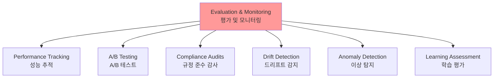
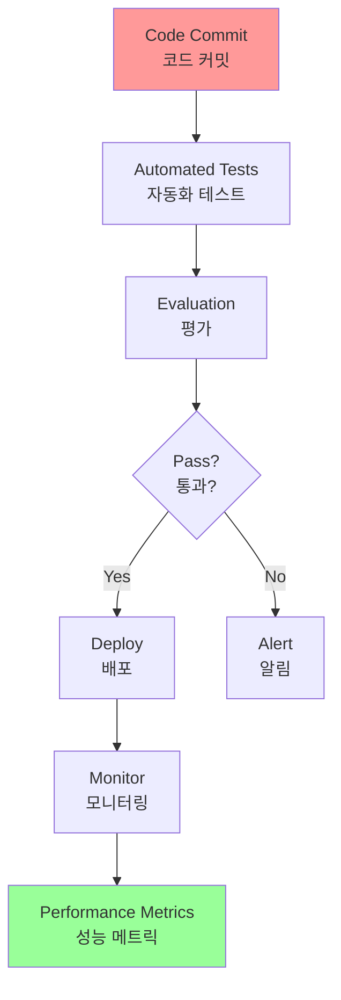

# Chapter 19: Evaluation and Monitoring

## 개요

This chapter reviews methodologies that enable intelligent agents to systematically evaluate their performance, monitor their progress toward goal achievement, and detect operational anomalies. While Chapter 11 addresses goal setting and monitoring, and Chapter 17 covers reasoning mechanisms, this chapter focuses on the continuous, often external measurement of an agent's effectiveness, efficiency, and compliance with requirements.

이 챕터는 지능형 에이전트가 체계적으로 성능을 평가하고, 목표 달성 진행 상황을 모니터링하며, 운영 이상을 감지할 수 있는 방법론을 검토합니다. Chapter 11은 목표 설정과 모니터링을 다루고, Chapter 17은 추론 메커니즘을 다루지만, 이 챕터는 에이전트의 효과성, 효율성 및 요구사항 준수를 지속적이고 종종 외부적으로 측정하는 것에 초점을 맞춥니다.

## 패턴 개요 (Pattern Overview)

This chapter examines methodologies that allow intelligent agents to systematically assess their performance, monitor progress toward goals, and detect operational anomalies. While Chapter 11 outlines goal setting and monitoring, and Chapter 17 addresses Reasoning mechanisms, this chapter focuses on the continuous, often external, measurement of an agent's effectiveness, efficiency, and compliance with requirements.

이 챕터는 지능형 에이전트가 체계적으로 성능을 평가하고, 목표 달성 진행 상황을 모니터링하며, 운영 이상을 감지할 수 있는 방법론을 검토합니다. Chapter 11은 목표 설정과 모니터링을 다루고, Chapter 17은 추론 메커니즘을 다루지만, 이 챕터는 에이전트의 효과성, 효율성 및 요구사항 준수를 지속적이고 종종 외부적으로 측정하는 것에 초점을 맞춥니다.

This includes defining metrics, establishing feedback loops, and implementing reporting systems to ensure agent performance aligns with expectations in operational environments.

이것은 메트릭 정의, 피드백 루프 설정, 운영 환경에서 에이전트 성능이 기대치와 일치하도록 보장하는 보고 시스템 구현을 포함합니다.

Evaluation and Monitoring는 다음을 포함합니다:



### 주요 구성 요소

1. **메트릭 정의**: 정확성, 지연 시간, 리소스 소비 등
2. **피드백 루프**: 지속적인 개선을 위한 피드백 메커니즘
3. **보고 시스템**: 운영 환경에서 에이전트 성능이 기대치와 일치하는지 보장

## 실용적 응용 및 사용 사례

가장 일반적인 응용 및 사용 사례:

- **라이브 시스템의 성능 추적**: 프로덕션 환경에 배포된 에이전트의 정확성, 지연 시간, 리소스 소비를 지속적으로 모니터링합니다(예: 고객 서비스 챗봇의 해결률, 응답 시간).

- **에이전트 개선을 위한 A/B 테스트**: 최적 접근 방식을 식별하기 위해 다른 에이전트 버전 또는 전략을 병렬로 체계적으로 비교합니다(예: 물류 에이전트에 대해 두 가지 다른 계획 알고리즘 시도).

- **규정 준수 및 안전 감사**: 윤리적 가이드라인, 규제 요구사항, 안전 프로토콜에 대한 에이전트의 규정 준수를 시간에 걸쳐 추적하는 자동화된 감사 보고서를 생성합니다. 이러한 보고서는 human-in-the-loop 또는 다른 에이전트에 의해 검증될 수 있으며, 문제를 식별할 때 KPI를 생성하거나 경고를 트리거할 수 있습니다.

- **엔터프라이즈 시스템**: 기업 시스템에서 Agentic AI를 관리하기 위해 새로운 제어 도구인 AI "Contract"가 필요합니다. 이 동적 계약은 AI 위임 작업에 대한 목표, 규칙 및 제어를 명문화합니다.

- **드리프트 감지**: 입력 데이터 분포 변경(개념 드리프트) 또는 환경 변화로 인한 성능 저하를 감지하여 시간에 걸쳐 에이전트 출력의 관련성 또는 정확성을 모니터링합니다.

- **에이전트 행동의 이상 탐지**: 오류, 악의적 공격 또는 원하지 않는 긴급 행동을 나타낼 수 있는 에이전트가 취한 비정상적이거나 예상치 못한 행동을 식별합니다.

- **학습 진행 평가**: 학습을 위해 설계된 에이전트의 학습 곡선, 특정 기술 개선, 또는 다른 작업이나 데이터 세트에 걸친 일반화 능력을 추적합니다.

## 실습 코드 예제

AI 에이전트를 위한 포괄적인 평가 프레임워크를 개발하는 것은 학문적 분야나 상당한 출판물의 복잡성에 비유할 수 있는 도전적인 작업입니다. 이 어려움은 모델 성능, 사용자 상호작용, 윤리적 함의, 더 넓은 사회적 영향과 같은 고려해야 할 많은 요인에서 비롯됩니다. 그럼에도 불구하고 실용적인 구현을 위해 AI 에이전트의 효율적이고 효과적인 작동에 필수적인 중요한 사용 사례에 초점을 맞출 수 있습니다.

### 에이전트 응답 평가

이 핵심 프로세스는 에이전트 출력의 품질과 정확성을 평가하는 데 필수적입니다. 이것은 에이전트가 주어진 입력에 대해 관련성 있고, 정확하며, 논리적이고, 편향되지 않으며, 정확한 정보를 제공하는지 결정하는 것을 포함합니다. 평가 메트릭은 사실적 정확성, 유창성, 문법적 정밀도, 사용자의 의도한 목적 준수를 포함할 수 있습니다.

```python
def evaluate_response_accuracy(agent_output: str, expected_output: str) -> float:
    """Calculates a simple accuracy score for agent responses."""
    # This is a very basic exact match; real-world would use more sophisticated metrics
    return 1.0 if agent_output.strip().lower() == expected_output.strip().lower() else 0.0

# Example usage
agent_response = "The capital of France is Paris."
ground_truth = "Paris is the capital of France."
score = evaluate_response_accuracy(agent_response, ground_truth)
print(f"Response accuracy: {score}")
```

Python 함수 `evaluate_response_accuracy`는 선행 또는 후행 공백을 제거한 후 에이전트의 출력과 예상 출력 간의 정확한 대소문자 무시 비교를 수행하여 AI 에이전트 응답에 대한 기본 정확성 점수를 계산합니다. 이것은 정확한 일치에 대해 1.0의 점수를 반환하고 그렇지 않으면 0.0을 반환하여 이진 정확 또는 부정확 평가를 나타냅니다. 이 방법은 간단한 검사에는 간단하지만, 패러프레이징이나 의미적 동등성과 같은 변형을 고려하지 않습니다.

문제는 비교 방법에 있습니다. 함수는 두 문자열의 엄격한 문자 대 문자 비교를 수행합니다. 제공된 예제에서:
- agent_response: "The capital of France is Paris."
- ground_truth: "Paris is the capital of France."

공백을 제거하고 소문자로 변환한 후에도 이 두 문자열은 동일하지 않습니다. 결과적으로 함수는 두 문장이 동일한 의미를 전달하더라도 부정확하게 정확성 점수 0.0을 반환합니다.

간단한 비교는 의미적 유사성을 평가하는 데 부족하며, 에이전트의 응답이 예상 출력과 정확히 일치하는 경우에만 성공합니다. 더 효과적인 평가는 문장 간의 의미를 구별하기 위한 고급 자연어 처리(NLP) 기술을 필요로 합니다. 실제 시나리오에서 철저한 AI 에이전트 평가를 위해 더 정교한 메트릭이 종종 필수적입니다. 이러한 메트릭은 Levenshtein 거리 및 Jaccard 유사성과 같은 문자열 유사성 측정, 특정 키워드의 존재 또는 부재에 대한 키워드 분석, 임베딩 모델을 사용한 코사인 유사성을 사용한 의미적 유사성, LLM-as-a-Judge 평가(미묘한 정확성 및 도움을 평가하기 위해 나중에 논의됨), 그리고 신뢰성 및 관련성과 같은 RAG 특정 메트릭을 포함할 수 있습니다.

### 지연 시간 모니터링

에이전트 행동에 대한 지연 시간 모니터링은 AI 에이전트의 응답 또는 행동 속도가 중요한 요소인 애플리케이션에서 중요합니다. 이 프로세스는 에이전트가 요청을 처리하고 출력을 생성하는 데 필요한 기간을 측정합니다. 높은 지연 시간은 사용자 경험과 에이전트의 전반적 효과성에 부정적인 영향을 미칠 수 있으며, 특히 실시간 또는 대화형 환경에서 그렇습니다. 실용적인 애플리케이션에서 단순히 지연 시간 데이터를 콘솔에 인쇄하는 것은 불충분합니다. 이 정보를 영구 저장 시스템에 로깅하는 것이 권장됩니다. 옵션에는 구조화된 로그 파일(예: JSON), 시계열 데이터베이스(예: InfluxDB, Prometheus), 데이터 웨어하우스(예: Snowflake, BigQuery, PostgreSQL), 또는 관찰 가능성 플랫폼(예: Datadog, Splunk, Grafana Cloud)이 포함됩니다.

### LLM 상호작용에 대한 토큰 사용 추적

LLM 기반 에이전트의 경우, 토큰 사용 추적은 비용 관리 및 리소스 할당 최적화에 중요합니다. LLM 상호작용에 대한 청구는 종종 처리된 토큰 수(입력 및 출력)에 따라 달라집니다. 따라서 효율적인 토큰 사용은 운영 비용을 직접적으로 줄입니다. 또한 토큰 수를 모니터링하면 프롬프트 엔지니어링 또는 응답 생성 프로세스에서 개선이 필요한 잠재적 영역을 식별하는 데 도움이 됩니다.

```python
# This is conceptual as actual token counting depends on the LLM API
class LLMInteractionMonitor:
    def __init__(self):
        self.total_input_tokens = 0
        self.total_output_tokens = 0

    def record_interaction(self, prompt: str, response: str):
        # In a real scenario, use LLM API's token counter or a tokenizer
        input_tokens = len(prompt.split())  # Placeholder
        output_tokens = len(response.split())  # Placeholder
        self.total_input_tokens += input_tokens
        self.total_output_tokens += output_tokens
        print(f"Recorded interaction: Input tokens={input_tokens}, Output tokens={output_tokens}")

    def get_total_tokens(self):
        return self.total_input_tokens, self.total_output_tokens

# Example usage
monitor = LLMInteractionMonitor()
monitor.record_interaction("What is the capital of France?", "The capital of France is Paris.")
monitor.record_interaction("Tell me a joke.", "Why don't scientists trust atoms? Because they make up everything!")
input_t, output_t = monitor.get_total_tokens()
print(f"Total input tokens: {input_t}, Total output tokens: {output_t}")
```

이 섹션은 대규모 언어 모델 상호작용에서 토큰 사용을 추적하기 위해 개발된 개념적 Python 클래스인 `LLMInteractionMonitor`를 소개합니다. 클래스는 입력 및 출력 토큰 모두에 대한 카운터를 통합합니다. `record_interaction` 메서드는 프롬프트 및 응답 문자열을 분할하여 토큰 계산을 시뮬레이션합니다. 실용적인 구현에서는 정확한 토큰 수를 위해 특정 LLM API 토크나이저가 사용됩니다. 상호작용이 발생함에 따라 모니터는 총 입력 및 출력 토큰 수를 누적합니다. `get_total_tokens` 메서드는 이러한 누적 합계에 대한 액세스를 제공하며, 이는 비용 관리 및 LLM 사용 최적화에 필수적입니다.

### "도움"에 대한 사용자 정의 메트릭: LLM-as-a-Judge 사용

AI 에이전트의 "도움"과 같은 주관적 품질을 평가하는 것은 표준 객관적 메트릭을 넘어서는 도전을 제시합니다. 잠재적 프레임워크는 LLM을 평가자로 사용하는 것을 포함합니다. 이 LLM-as-a-Judge 접근 방식은 "도움"에 대한 사전 정의된 기준에 따라 다른 AI 에이전트의 출력을 평가합니다. LLM의 고급 언어 능력을 활용하여 이 방법은 간단한 키워드 일치 또는 규칙 기반 평가를 능가하는 미묘하고 인간과 같은 주관적 품질 평가를 제공합니다. 개발 중이지만 이 기술은 정성적 평가를 자동화하고 확장하는 데 유망합니다.

```python
import google.generativeai as genai
import os
import json
import logging
from typing import Optional

# --- Configuration ---
logging.basicConfig(level=logging.INFO, format='%(asctime)s - %(levelname)s - %(message)s')

# Set your API key as an environment variable to run this script
# For example, in your terminal: export GOOGLE_API_KEY='your_key_here'
try:
    genai.configure(api_key=os.environ["GOOGLE_API_KEY"])
except KeyError:
    logging.error("Error: GOOGLE_API_KEY environment variable not set.")
    exit(1)

# --- LLM-as-a-Judge Rubric for Legal Survey Quality ---
LEGAL_SURVEY_RUBRIC = """
You are an expert legal survey methodologist and a critical legal
reviewer. Your task is to evaluate the quality of a given legal
survey question.

Provide a score from 1 to 5 for overall quality, along with a
detailed rationale and specific feedback.

Focus on the following criteria:
1. **Clarity & Precision (Score 1-5):**
* 1: Extremely vague, highly ambiguous, or confusing.
* 3: Moderately clear, but could be more precise.
* 5: Perfectly clear, unambiguous, and precise in its legal
terminology (if applicable) and intent.

2. **Neutrality & Bias (Score 1-5):**
* 1: Highly leading or biased, clearly influencing the respondent
towards a specific answer.
* 3: Slightly suggestive or could be interpreted as leading.
* 5: Completely neutral, objective, and free from any leading
language or loaded terms.

3. **Relevance & Focus (Score 1-5):**
* 1: Irrelevant to the stated survey topic or out of scope.
* 3: Loosely related but could be more focused.
* 5: Directly relevant to the survey's objectives and well-focused
on a single concept.

4. **Completeness (Score 1-5):**
* 1: Omits critical information needed to answer accurately or
provides insufficient context.
* 3: Mostly complete, but minor details are missing.
* 5: Provides all necessary context and information for the
respondent to answer thoroughly.

5. **Appropriateness for Audience (Score 1-5):**
* 1: Uses jargon inaccessible to the target audience or is overly
simplistic for experts.
* 3: Generally appropriate, but some terms might be challenging or
oversimplified.
* 5: Perfectly tailored to the assumed legal knowledge and
background of the target survey audience.

**Output Format:**
Your response MUST be a JSON object with the following keys:
* `overall_score`: An integer from 1 to 5 (average of criterion
scores, or your holistic judgment).
* `rationale`: A concise summary of why this score was given,
highlighting major strengths and weaknesses.
* `detailed_feedback`: A bullet-point list detailing feedback for
each criterion (Clarity, Neutrality, Relevance, Completeness,
Audience Appropriateness). Suggest specific improvements.
* `concerns`: A list of any specific legal, ethical, or
methodological concerns.
* `recommended_action`: A brief recommendation (e.g., "Revise for
neutrality", "Approve as is", "Clarify scope").
"""

class LLMJudgeForLegalSurvey:
    """A class to evaluate legal survey questions using a generative AI model."""
    def __init__(self, model_name: str = 'gemini-1.5-flash-latest', temperature: float = 0.2):
        """
        Initializes the LLM Judge.
        Args:
            model_name (str): The name of the Gemini model to use.
                'gemini-1.5-flash-latest' is recommended for speed and cost.
                'gemini-1.5-pro-latest' offers the highest quality.
            temperature (float): The generation temperature. Lower is better for deterministic evaluation.
        """
        self.model = genai.GenerativeModel(model_name)
        self.temperature = temperature

    def _generate_prompt(self, survey_question: str) -> str:
        """Constructs the full prompt for the LLM judge."""
        return f"{LEGAL_SURVEY_RUBRIC}\n\n---\n**LEGAL SURVEY QUESTION TO EVALUATE:**\n{survey_question}\n---"

    def judge_survey_question(self, survey_question: str) -> Optional[dict]:
        """
        Judges the quality of a single legal survey question using the LLM.
        Args:
            survey_question (str): The legal survey question to be evaluated.
        Returns:
            Optional[dict]: A dictionary containing the LLM's judgment, or None if an error occurs.
        """
        full_prompt = self._generate_prompt(survey_question)
        try:
            logging.info(f"Sending request to '{self.model.model_name}' for judgment...")
            response = self.model.generate_content(
                full_prompt,
                generation_config=genai.types.GenerationConfig(
                    temperature=self.temperature,
                    response_mime_type="application/json"
                )
            )
            # Check for content moderation or other reasons for an empty response.
            if not response.parts:
                safety_ratings = response.prompt_feedback.safety_ratings
                logging.error(f"LLM response was empty or blocked. Safety Ratings: {safety_ratings}")
                return None
            return json.loads(response.text)
        except json.JSONDecodeError:
            logging.error(f"Failed to decode LLM response as JSON. Raw response: {response.text}")
            return None
        except Exception as e:
            logging.error(f"An unexpected error occurred during LLM judgment: {e}")
            return None

# --- Example Usage ---
if __name__ == "__main__":
    judge = LLMJudgeForLegalSurvey()
    
    # --- Good Example ---
    good_legal_survey_question = """
    To what extent do you agree or disagree that current intellectual
    property laws in Switzerland adequately protect emerging AI-generated
    content, assuming the content meets the originality criteria
    established by the Federal Supreme Court?
    (Select one: Strongly Disagree, Disagree, Neutral, Agree, Strongly Agree)
    """
    print("\n--- Evaluating Good Legal Survey Question ---")
    judgment_good = judge.judge_survey_question(good_legal_survey_question)
    if judgment_good:
        print(json.dumps(judgment_good, indent=2))
    
    # --- Biased/Poor Example ---
    biased_legal_survey_question = """
    Don't you agree that overly restrictive data privacy laws like the
    FADP are hindering essential technological innovation and economic
    growth in Switzerland?
    (Select one: Yes, No)
    """
    print("\n--- Evaluating Biased Legal Survey Question ---")
    judgment_biased = judge.judge_survey_question(biased_legal_survey_question)
    if judgment_biased:
        print(json.dumps(judgment_biased, indent=2))
    
    # --- Ambiguous/Vague Example ---
    vague_legal_survey_question = """
    What are your thoughts on legal tech?
    """
    print("\n--- Evaluating Vague Legal Survey Question ---")
    judgment_vague = judge.judge_survey_question(vague_legal_survey_question)
    if judgment_vague:
        print(json.dumps(judgment_vague, indent=2))
```

Python 코드는 생성 AI 모델을 사용하여 법률 설문 질문의 품질을 평가하도록 설계된 클래스 LLMJudgeForLegalSurvey를 정의합니다. 이것은 Gemini 모델과 상호작용하기 위해 google.generativeai 라이브러리를 활용합니다.

핵심 기능은 평가를 위한 상세한 루브릭과 함께 설문 질문을 모델에 보내는 것을 포함합니다. 루브릭은 설문 질문을 판단하기 위한 다섯 가지 기준을 지정합니다: 명확성 및 정밀도, 중립성 및 편향, 관련성 및 초점, 완전성, 그리고 청중 적절성. 각 기준에 대해 1에서 5까지의 점수가 할당되며, 출력에 상세한 근거 및 피드백이 필요합니다. 코드는 루브릭과 평가할 설문 질문을 포함하는 프롬프트를 구성합니다.

judge_survey_question 메서드는 이 프롬프트를 구성된 Gemini 모델에 보내고, 정의된 구조에 따라 JSON 응답을 요청합니다. 예상 출력 JSON은 전체 점수, 요약 근거, 각 기준에 대한 상세 피드백, 우려 사항 목록 및 권장 조치를 포함합니다. 클래스는 JSON 디코딩 문제나 빈 응답과 같은 AI 모델 상호작용 중 잠재적 오류를 처리합니다. 스크립트는 법률 설문 질문의 예제를 평가하여 작동을 시연하며, 사전 정의된 기준에 따라 AI가 품질을 평가하는 방법을 보여줍니다.

### 평가 방법 비교

결론을 내리기 전에 강점과 약점을 고려하여 다양한 평가 방법을 검토하겠습니다.

| 평가 방법 | 강점 | 약점 |
|---------|------|------|
| 인간 평가 | 미묘한 행동 포착 | 확장하기 어렵고, 비용이 많이 들며, 시간이 많이 걸리며, 주관적 인간 요인을 고려합니다. |
| LLM-as-a-Judge | 일관되고 효율적이며 확장 가능합니다. | 중간 단계가 간과될 수 있습니다. LLM 기능에 의해 제한됩니다. |
| 자동화된 메트릭 | 확장 가능하고 효율적이며 객관적입니다. | 완전한 능력을 포착하는 데 잠재적 제한이 있습니다. |

## 에이전트 궤적 평가

에이전트의 궤적을 평가하는 것은 필수적입니다. 왜냐하면 전통적인 소프트웨어 테스트가 불충분하기 때문입니다. 표준 코드는 예측 가능한 통과/실패 결과를 산출하지만, 에이전트는 확률적으로 작동하므로 최종 출력과 솔루션에 도달하기 위해 취한 단계의 시퀀스인 에이전트의 궤적에 대한 정성적 평가가 필요합니다.

다중 에이전트 시스템을 평가하는 것은 도전적입니다. 왜냐하면 그것들이 지속적으로 변화하기 때문입니다. 이것은 개별 성능을 넘어서 의사 소통 및 팀워크의 효과성을 측정하는 정교한 메트릭 개발을 요구합니다. 더욱이 환경 자체가 정적이지 않으므로 테스트 케이스를 포함한 평가 방법이 시간에 걸쳐 적응해야 합니다.

이것은 결정의 품질, 추론 프로세스 및 전반적 결과를 검토하는 것을 포함합니다. 자동화된 평가를 구현하는 것은 특히 프로토타입 단계를 넘어 개발에 가치가 있습니다. 궤적 및 도구 사용 분석은 에이전트가 목표를 달성하기 위해 사용하는 단계를 평가하는 것을 포함하며, 도구 선택, 전략 및 작업 효율성과 같은 것을 포함합니다. 예를 들어, 고객의 제품 쿼리를 다루는 에이전트는 이상적으로 의도 결정, 데이터베이스 검색 도구 사용, 결과 검토 및 보고서 생성을 포함하는 궤적을 따를 수 있습니다. 에이전트의 실제 행동은 오류 및 비효율성을 식별하기 위해 이 예상되거나 ground truth 궤적과 비교됩니다. 비교 방법에는 정확한 일치(이상적인 시퀀스와의 완벽한 일치 요구), 순서 내 일치(순서대로 올바른 행동, 추가 단계 허용), 임의 순서 일치(임의 순서로 올바른 행동, 추가 단계 허용), 정밀도(예측된 행동의 관련성 측정), 재현율(얼마나 많은 필수 행동이 포착되는지 측정), 단일 도구 사용(특정 행동 확인)이 포함됩니다. 메트릭 선택은 특정 에이전트 요구사항에 따라 달라지며, 높은 위험 시나리오는 잠재적으로 정확한 일치를 요구하는 반면, 더 유연한 상황은 순서 내 또는 임의 순서 일치를 사용할 수 있습니다.

### Test Files와 Evalset Files

AI 에이전트 평가는 test files 사용과 evalset files 사용이라는 두 가지 주요 접근 방식을 포함합니다. Test files는 JSON 형식으로 단일, 간단한 에이전트-모델 상호작용 또는 세션을 나타내며, 활성 개발 중 단위 테스트에 이상적이며, 빠른 실행 및 간단한 세션 복잡성에 초점을 맞춥니다. 각 test file은 여러 턴을 가진 단일 세션을 포함하며, 여기서 턴은 사용자의 쿼리, 예상 도구 사용 궤적, 중간 에이전트 응답 및 최종 응답을 포함하는 사용자-에이전트 상호작용입니다. 예를 들어, test file은 "침실에서 device_2를 끄기"라는 사용자 요청을 자세히 설명하고, location: Bedroom, device_id: device_2, status: OFF와 같은 매개변수를 가진 set_device_info 도구의 에이전트 사용을 지정하고, "device_2 상태를 끄기로 설정했습니다."라는 예상 최종 응답을 지정할 수 있습니다. Test files는 폴더로 구성될 수 있으며 평가 기준을 정의하는 test_config.json 파일을 포함할 수 있습니다.

Evalset files는 "evalset"이라는 데이터셋을 사용하여 상호작용을 평가하며, 복잡한 다중 턴 대화 및 통합 테스트를 시뮬레이션하는 데 적합한 여러 잠재적으로 긴 세션을 포함합니다. Evalset file은 여러 "eval"로 구성되며, 각각은 사용자 쿼리, 예상 도구 사용, 중간 응답 및 참조 최종 응답을 포함하는 하나 이상의 "턴"을 가진 고유한 세션을 나타냅니다. Evalset의 예는 사용자가 먼저 "무엇을 할 수 있나요?"라고 묻고 그 다음 "10면 주사위를 두 번 굴린 다음 9가 소수인지 확인하세요"라고 말하는 세션을 포함할 수 있으며, 예상 roll_die 도구 호출 및 check_prime 도구 호출을 정의하고 주사위 굴림 및 소수 확인을 요약하는 최종 응답을 포함합니다.

### 다중 에이전트 평가

여러 에이전트를 가진 복잡한 AI 시스템을 평가하는 것은 팀 프로젝트를 평가하는 것과 매우 유사합니다. 많은 단계와 인계가 있기 때문에 그 복잡성은 각 단계에서 작업의 품질을 확인할 수 있게 하는 이점입니다. 각 개별 "에이전트"가 특정 작업을 얼마나 잘 수행하는지 검토할 수 있지만, 전체 시스템이 전체적으로 어떻게 수행되는지도 평가해야 합니다.

이를 수행하기 위해 구체적인 예제로 뒷받침되는 팀의 역학에 대한 핵심 질문을 합니다:

- **에이전트가 효과적으로 협력하고 있나요?** 예를 들어, '항공편 예약 에이전트'가 항공편을 확보한 후, 올바른 날짜와 목적지를 '호텔 예약 에이전트'에 성공적으로 전달하나요? 협력 실패는 잘못된 주에 호텔이 예약되는 결과를 초래할 수 있습니다.

- **좋은 계획을 만들고 그것을 고수했나요?** 계획이 먼저 항공편을 예약한 다음 호텔을 예약하는 것이라고 상상해보세요. '호텔 에이전트'가 항공편이 확인되기 전에 방을 예약하려고 시도하면 계획에서 벗어난 것입니다. 또한 에이전트가 예를 들어 "완벽한" 렌터카를 끝없이 검색하고 다음 단계로 절대 이동하지 않는 것과 같이 막히는지 확인합니다.

- **올바른 작업에 대해 올바른 에이전트가 선택되고 있나요?** 사용자가 여행에 대한 날씨에 대해 묻는 경우, 시스템은 실시간 데이터를 제공하는 전문 '날씨 에이전트'를 사용해야 합니다. 대신 "여름에는 보통 따뜻합니다"와 같은 일반적인 답변을 제공하는 '일반 지식 에이전트'를 사용하면 작업에 대해 잘못된 도구를 선택한 것입니다.

- **마지막으로, 더 많은 에이전트를 추가하면 성능이 향상되나요?** 팀에 새로운 '레스토랑 예약 에이전트'를 추가하면 전체 여행 계획이 더 좋고 효율적으로 만들어지나요? 아니면 충돌을 만들고 시스템을 느리게 만들어 확장성 문제를 나타내나요?

## 에이전트에서 고급 계약자로

최근에 간단한 AI 에이전트에서 고급 "계약자"로의 진화가 제안되었습니다(Agent Companion, gulli et al.). 이것은 확률적이고 종종 신뢰할 수 없는 시스템에서 복잡하고 높은 위험 환경을 위해 설계된 더 결정론적이고 책임 있는 것으로 이동합니다.

오늘날의 일반적인 AI 에이전트는 간단하고 불충분하게 지정된 지시에서 작동하며, 이것은 간단한 시연에는 적합하지만 모호성이 실패로 이어지는 프로덕션에서는 취약합니다. "계약자" 모델은 명확하게 정의되고 상호 합의된 조건의 기반 위에 구축된 사용자와 AI 간의 엄격하고 공식화된 관계를 설정함으로써 이를 해결합니다. 이것은 인간 세계의 법률 서비스 계약과 매우 유사합니다. 이 변환은 이전에 자율 시스템의 범위를 넘어선 작업의 명확성, 신뢰성 및 견고한 실행을 집합적으로 보장하는 네 가지 핵심 기둥에 의해 지원됩니다.

첫 번째는 공식화된 계약의 기둥으로, 작업에 대한 단일 진실 소스 역할을 하는 상세한 사양입니다. 이것은 간단한 프롬프트를 훨씬 넘어섭니다. 예를 들어, 재무 분석 작업에 대한 계약은 단순히 "지난 분기 매출 분석"이라고 말하는 것이 아니라 "2025년 1분기 유럽 시장 매출을 분석하는 20페이지 PDF 보고서, 5개의 특정 데이터 시각화, 2024년 1분기와의 비교 분석, 포함된 공급망 중단 데이터셋을 기반으로 한 위험 평가를 요구할 것입니다." 이 계약은 필요한 결과물, 정확한 사양, 허용 가능한 데이터 소스, 작업 범위, 심지어 예상 계산 비용 및 완료 시간을 명시적으로 정의하여 결과를 객관적으로 검증 가능하게 만듭니다.

두 번째는 협상 및 피드백의 동적 생명주기 기둥입니다. 계약은 정적 명령이 아니라 대화의 시작입니다. 계약자 에이전트는 초기 조건을 분석하고 협상할 수 있습니다. 예를 들어, 계약이 에이전트가 액세스할 수 없는 특정 독점 데이터 소스 사용을 요구하는 경우, "지정된 XYZ 데이터베이스에 액세스할 수 없습니다. 자격 증명을 제공하거나 데이터의 세분성을 약간 변경할 수 있는 대체 공개 데이터베이스 사용을 승인해주세요"라고 피드백을 반환할 수 있습니다. 에이전트가 모호성이나 잠재적 위험을 플래그할 수 있도록 하는 이 협상 단계는 실행이 시작되기 전에 오해를 해결하여 비용이 많이 드는 실패를 방지하고 최종 출력이 사용자의 실제 의도와 완벽하게 일치하도록 보장합니다.

세 번째 기둥은 품질 중심 반복 실행입니다. 낮은 지연 시간 응답을 위해 설계된 에이전트와 달리, 계약자는 정확성과 품질을 우선시합니다. 이것은 자체 검증 및 수정 원칙에서 작동합니다. 코드 생성 계약의 경우, 예를 들어, 에이전트는 단순히 코드를 작성하는 것이 아니라 여러 알고리즘 접근 방식을 생성하고, 계약 내에서 정의된 단위 테스트 모음에 대해 컴파일하고 실행하고, 성능, 보안 및 가독성과 같은 메트릭에서 각 솔루션을 점수화하고, 모든 검증 기준을 통과하는 버전만 제출할 것입니다. 계약의 사양이 충족될 때까지 자체 작업을 생성, 검토 및 개선하는 이 내부 루프는 출력에 대한 신뢰를 구축하는 데 중요합니다.

마지막으로 네 번째 기둥은 하위 계약을 통한 계층적 분해입니다. 상당한 복잡성의 작업의 경우, 주요 계약자 에이전트는 프로젝트 관리자 역할을 하며 주요 목표를 더 작고 관리 가능한 하위 작업으로 나눌 수 있습니다. 이것은 새로운 공식 "하위 계약"을 생성함으로써 달성됩니다. 예를 들어, "전자상거래 모바일 애플리케이션 구축"이라는 마스터 계약은 주요 에이전트에 의해 "UI/UX 설계", "사용자 인증 모듈 개발", "제품 데이터베이스 스키마 생성", "결제 게이트웨이 통합"에 대한 하위 계약으로 분해될 수 있습니다. 이러한 하위 계약 각각은 자체 결과물 및 사양을 가진 완전하고 독립적인 계약이며, 다른 전문 에이전트에 할당될 수 있습니다. 이 구조화된 분해는 시스템이 매우 조직적이고 확장 가능한 방식으로 거대하고 다면적인 프로젝트를 처리할 수 있게 하며, AI가 간단한 도구에서 진정으로 자율적이고 신뢰할 수 있는 문제 해결 엔진으로의 전환을 표시합니다.

궁극적으로 이 계약자 프레임워크는 공식 사양, 협상 및 검증 가능한 실행의 원칙을 에이전트의 핵심 로직에 직접 내장함으로써 AI 상호작용을 재구상합니다. 이 체계적 접근 방식은 인공 지능을 유망하지만 종종 예측할 수 없는 어시스턴트에서 감사 가능한 정밀도로 복잡한 프로젝트를 자율적으로 관리할 수 있는 신뢰할 수 있는 시스템으로 향상시킵니다. 모호성과 신뢰성의 중요한 도전을 해결함으로써 이 모델은 신뢰와 책임이 가장 중요한 미션 크리티컬 도메인에서 AI를 배포하는 데 필요한 길을 닦습니다.

## Google의 ADK

결론을 내리기 전에 평가를 지원하는 프레임워크의 구체적인 예를 살펴보겠습니다. Google의 ADK를 사용한 에이전트 평가는 세 가지 방법으로 수행될 수 있습니다: 대화형 평가 및 데이터셋 생성을 위한 웹 기반 UI(adk web), 테스트 파이프라인에 통합하기 위해 pytest를 사용한 프로그래밍 통합, 정기적인 빌드 생성 및 검증 프로세스에 적합한 자동화된 평가를 위한 직접 명령줄 인터페이스(adk eval).

웹 기반 UI는 대화형 세션 생성 및 기존 또는 새로운 eval 세트로 저장을 가능하게 하며 평가 상태를 표시합니다. Pytest 통합은 에이전트 모듈 및 테스트 파일 경로를 지정하여 AgentEvaluator.evaluate를 호출하여 통합 테스트의 일부로 테스트 파일을 실행할 수 있게 합니다.

명령줄 인터페이스는 에이전트 모듈 경로 및 eval 세트 파일을 제공하여 자동화된 평가를 용이하게 하며, 구성 파일을 지정하거나 상세한 결과를 인쇄하는 옵션을 제공합니다. 더 큰 eval 세트 내의 특정 eval은 eval 세트 파일명 뒤에 쉼표로 구분하여 나열하여 실행을 위해 선택할 수 있습니다.

## 한눈에 보기 (At a Glance)

### 무엇 (What)

에이전트 시스템 및 LLM은 성능이 시간에 걸쳐 저하될 수 있는 복잡하고 동적인 환경에서 작동합니다. 그들의 확률적이고 비결정론적 특성은 신뢰성을 보장하기 위해 전통적인 소프트웨어 테스트가 불충분함을 의미합니다. 동적 다중 에이전트 시스템을 평가하는 것은 지속적으로 변화하는 특성과 환경의 특성 때문에 중요한 도전이며, 개별 성능을 넘어서 협업 성공을 측정할 수 있는 적응형 테스트 방법 및 정교한 메트릭 개발을 요구합니다. 데이터 드리프트, 예상치 못한 상호작용, 도구 호출 및 의도한 목표에서의 편차와 같은 문제는 배포 후에 발생할 수 있습니다. 따라서 에이전트의 효과성, 효율성 및 운영 및 안전 요구사항 준수를 측정하기 위한 지속적인 평가가 필요합니다.

### 왜 (Why)

표준화된 평가 및 모니터링 프레임워크는 지능형 에이전트의 지속적인 성능을 평가하고 보장하기 위한 체계적인 방법을 제공합니다. 이것은 정확성, 지연 시간 및 LLM의 경우 토큰 사용과 같은 리소스 소비에 대한 명확한 메트릭을 정의하는 것을 포함합니다. 또한 추론 프로세스를 이해하기 위해 에이전트 궤적을 분석하고 미묘하고 정성적 평가를 위해 LLM-as-a-Judge를 사용하는 것과 같은 고급 기술을 포함합니다. 피드백 루프 및 보고 시스템을 설정함으로써 이 프레임워크는 지속적인 개선, A/B 테스트 및 이상 또는 성능 드리프트 감지를 가능하게 하여 에이전트가 목표와 정렬된 상태를 유지하도록 보장합니다.

### 경험 법칙 (Rule of Thumb)

실시간 성능 및 신뢰성이 중요한 라이브, 프로덕션 환경에서 에이전트를 배포할 때 이 패턴을 사용하세요. 또한 개선을 추진하기 위해 에이전트 또는 기본 모델의 다른 버전을 체계적으로 비교해야 할 때, 그리고 규정 준수, 안전 및 윤리적 감사가 필요한 규제되거나 높은 위험 도메인에서 운영할 때 사용하세요. 이 패턴은 데이터 또는 환경(드리프트)의 변화로 인해 에이전트의 성능이 시간에 걸쳐 저하될 수 있을 때, 또는 행동 시퀀스(궤적) 및 도움과 같은 주관적 출력의 품질을 포함하여 복잡한 에이전트 행동을 평가할 때도 적합합니다.

## 핵심 요약 (Key Takeaways)

1. **지능형 에이전트 평가는 전통적인 테스트를 넘어서 실제 환경에서 효과성, 효율성 및 요구사항 준수를 지속적으로 측정합니다.**

2. **에이전트 평가의 실용적 응용에는 라이브 시스템의 성능 추적, 개선을 위한 A/B 테스트, 규정 준수 감사, 행동의 드리프트 또는 이상 감지가 포함됩니다.**

3. **기본 에이전트 평가는 응답 정확성 평가를 포함하는 반면, 실제 시나리오는 LLM 기반 에이전트에 대한 지연 시간 모니터링 및 토큰 사용 추적과 같은 더 정교한 메트릭을 요구합니다.**

4. **에이전트 궤적, 에이전트가 취하는 단계의 시퀀스는 평가에 중요하며, 오류 및 비효율성을 식별하기 위해 실제 행동을 이상적이고 ground-truth 경로와 비교합니다.**

5. **ADK는 단위 테스트를 위한 개별 테스트 파일과 통합 테스트를 위한 포괄적인 evalset 파일을 통해 구조화된 평가 방법을 제공하며, 둘 다 예상 에이전트 행동을 정의합니다.**

6. **에이전트 평가는 대화형 테스트를 위한 웹 기반 UI, CI/CD 통합을 위한 pytest를 사용한 프로그래밍 방식, 또는 자동화된 워크플로를 위한 명령줄 인터페이스를 통해 실행될 수 있습니다.**

7. **복잡하고 높은 위험 작업에 대해 AI를 신뢰할 수 있게 만들기 위해 간단한 프롬프트에서 검증 가능한 결과물과 범위를 정확히 정의하는 공식 "계약"으로 이동해야 합니다. 이 구조화된 계약은 에이전트가 협상하고, 모호성을 명확히 하며, 자체 작업을 반복적으로 검증할 수 있게 하여 예측할 수 없는 도구에서 책임 있고 신뢰할 수 있는 시스템으로 변환합니다.**

## 결론 (Conclusions)

결론적으로, AI 에이전트를 효과적으로 평가하는 것은 간단한 정확성 검사를 넘어서 동적 환경에서 성능에 대한 지속적이고 다면적인 평가로 이동하는 것을 요구합니다. 이것은 지연 시간 및 리소스 소비와 같은 메트릭의 실용적 모니터링뿐만 아니라 궤적을 통한 에이전트의 의사 결정 프로세스에 대한 정교한 분석을 포함합니다. 도움과 같은 미묘한 품질의 경우, LLM-as-a-Judge와 같은 혁신적인 방법이 필수가 되고 있으며, Google의 ADK와 같은 프레임워크는 단위 및 통합 테스트를 위한 구조화된 도구를 제공합니다. 도전은 다중 에이전트 시스템에서 강화되며, 여기서 초점은 협업 성공 및 효과적인 협력 평가로 이동합니다.

미션 크리티컬 애플리케이션에서 신뢰성을 보장하기 위해 패러다임은 간단한 프롬프트 기반 에이전트에서 공식 계약에 의해 구속되는 고급 "계약자"로 이동하고 있습니다. 이러한 계약자 에이전트는 명시적이고 검증 가능한 조건에서 작동하여 협상하고, 작업을 분해하며, 엄격한 품질 표준을 충족하기 위해 자체 작업을 검증할 수 있습니다. 이 구조화된 접근 방식은 예측할 수 없는 도구에서 복잡하고 높은 위험 작업을 처리할 수 있는 책임 있는 시스템으로 에이전트를 변환합니다. 궁극적으로 이 진화는 미션 크리티컬 도메인에서 정교한 에이전트 AI를 배포하는 데 필요한 신뢰를 구축하는 데 중요합니다.

## 이론적 배경 및 학술적 근거 (Theoretical Background and Academic Foundation)

### 평가 이론 (Evaluation Theory)

평가는 시스템의 가치를 판단하는 체계적 과정입니다.

**평가 유형**:
- **형성 평가 (Formative Evaluation)**: 개발 중 지속적 평가
- **총괄 평가 (Summative Evaluation)**: 최종 결과 평가
- **진단 평가 (Diagnostic Evaluation)**: 문제 진단을 위한 평가

**에이전트 평가에서의 적용**:
- 개발 단계별 평가
- 최종 성능 평가
- 문제 영역 식별

### 메트릭 이론

메트릭은 성능을 정량화하는 도구입니다.

**메트릭 설계 원칙**:
- **유효성 (Validity)**: 측정하려는 것을 정확히 측정
- **신뢰성 (Reliability)**: 일관된 측정 결과
- **민감도 (Sensitivity)**: 변화를 감지할 수 있는 능력
- **특이도 (Specificity)**: 관련 없는 변화 무시

**에이전트 메트릭**:
- 정확도, 정밀도, 재현율
- 지연 시간, 처리량
- 비용, 리소스 사용량
- 사용자 만족도

### 관찰 가능성 (Observability) 이론

관찰 가능성은 시스템의 내부 상태를 외부에서 추론할 수 있는 능력입니다.

**관찰 가능성의 세 가지 기둥**:
- **메트릭 (Metrics)**: 수치적 측정값
- **로그 (Logs)**: 이벤트 기록
- **트레이스 (Traces)**: 요청 경로 추적

**에이전트 시스템에서의 구현**:
- 성능 메트릭 수집
- 상세한 로깅
- 에이전트 궤적 추적

### 통계적 가설 검정

평가 결과의 통계적 유의성을 검정합니다.

**가설 검정**:
- **귀무 가설**: 차이가 없다는 가설
- **대립 가설**: 차이가 있다는 가설
- **유의 수준**: 오류 허용 확률
- **검정력**: 실제 차이를 감지할 확률

**A/B 테스트에서의 적용**:
- 두 버전의 성능 비교
- 통계적 유의성 검정
- 효과 크기 측정

## 성능 최적화 기법 (Performance Optimization Techniques)

### 1. 자동화된 평가 파이프라인

지속적 평가 자동화:

```python
class AutomatedEvaluationPipeline:
    def __init__(self):
        self.evaluators = {
            'accuracy': AccuracyEvaluator(),
            'latency': LatencyEvaluator(),
            'cost': CostEvaluator(),
            'safety': SafetyEvaluator()
        }
        self.test_suite = TestSuite()
    
    def run_evaluation(self, agent: Agent, test_cases: List[TestCase]) -> EvaluationReport:
        """자동화된 평가 실행"""
        results = {}
        
        for evaluator_name, evaluator in self.evaluators.items():
            scores = []
            for test_case in test_cases:
                score = evaluator.evaluate(agent, test_case)
                scores.append(score)
            
            results[evaluator_name] = {
                'mean': np.mean(scores),
                'std': np.std(scores),
                'min': np.min(scores),
                'max': np.max(scores)
            }
        
        return EvaluationReport(results)
    
    def continuous_evaluation(self, agent: Agent):
        """지속적 평가"""
        while True:
            # 새 테스트 케이스 생성
            new_cases = self.test_suite.generate_cases()
            
            # 평가 실행
            report = self.run_evaluation(agent, new_cases)
            
            # 결과 분석
            self.analyze_results(report)
            
            # 임계값 초과 시 알림
            if self.check_thresholds(report):
                self.send_alert(report)
            
            time.sleep(3600)  # 1시간마다 평가
```

### 2. 다차원 메트릭 대시보드

종합적인 성능 모니터링:

```python
class MultiDimensionalMetricsDashboard:
    def __init__(self):
        self.metrics_collector = MetricsCollector()
        self.visualizer = MetricsVisualizer()
    
    def collect_metrics(self, agent: Agent, time_window: timedelta):
        """다차원 메트릭 수집"""
        metrics = {
            'performance': {
                'accuracy': self.metrics_collector.accuracy(agent, time_window),
                'latency': self.metrics_collector.latency(agent, time_window),
                'throughput': self.metrics_collector.throughput(agent, time_window)
            },
            'resource': {
                'cpu_usage': self.metrics_collector.cpu_usage(agent, time_window),
                'memory_usage': self.metrics_collector.memory_usage(agent, time_window),
                'cost': self.metrics_collector.cost(agent, time_window)
            },
            'quality': {
                'user_satisfaction': self.metrics_collector.user_satisfaction(agent, time_window),
                'error_rate': self.metrics_collector.error_rate(agent, time_window),
                'safety_score': self.metrics_collector.safety_score(agent, time_window)
            }
        }
        
        return metrics
    
    def visualize(self, metrics: dict):
        """메트릭 시각화"""
        self.visualizer.plot_performance(metrics['performance'])
        self.visualizer.plot_resources(metrics['resource'])
        self.visualizer.plot_quality(metrics['quality'])
        self.visualizer.plot_correlations(metrics)
```

### 3. 적응형 테스트 케이스 생성

에이전트 약점에 집중한 테스트:

```python
class AdaptiveTestCaseGenerator:
    def __init__(self):
        self.failure_patterns = []
        self.test_generator = TestCaseGenerator()
    
    def learn_from_failures(self, failures: List[Failure]):
        """실패로부터 학습"""
        for failure in failures:
            pattern = self.extract_pattern(failure)
            self.failure_patterns.append(pattern)
    
    def generate_targeted_tests(self, agent: Agent) -> List[TestCase]:
        """타겟 테스트 케이스 생성"""
        targeted_tests = []
        
        # 실패 패턴 기반 테스트 생성
        for pattern in self.failure_patterns:
            test = self.test_generator.generate_from_pattern(pattern)
            targeted_tests.append(test)
        
        # 약점 영역 집중 테스트
        weak_areas = self.identify_weak_areas(agent)
        for area in weak_areas:
            test = self.test_generator.generate_for_area(area)
            targeted_tests.append(test)
        
        return targeted_tests
```

### 4. 실시간 성능 모니터링

실시간 성능 추적 및 알림:

```python
class RealTimePerformanceMonitor:
    def __init__(self, alert_thresholds: dict):
        self.thresholds = alert_thresholds
        self.metrics_buffer = deque(maxlen=1000)
        self.alert_system = AlertSystem()
    
    def monitor(self, agent: Agent):
        """실시간 모니터링"""
        while True:
            # 현재 메트릭 수집
            current_metrics = self.collect_current_metrics(agent)
            self.metrics_buffer.append(current_metrics)
            
            # 이상 탐지
            anomalies = self.detect_anomalies(current_metrics)
            if anomalies:
                self.handle_anomalies(anomalies)
            
            # 임계값 확인
            for metric_name, value in current_metrics.items():
                threshold = self.thresholds.get(metric_name)
                if threshold and value > threshold:
                    self.alert_system.send_alert(
                        metric=metric_name,
                        value=value,
                        threshold=threshold
                    )
            
            time.sleep(1)  # 1초마다 모니터링
    
    def detect_anomalies(self, metrics: dict) -> List[Anomaly]:
        """이상 탐지"""
        anomalies = []
        
        # 통계적 이상 탐지
        for metric_name, value in metrics.items():
            historical = [m[metric_name] for m in self.metrics_buffer]
            if len(historical) > 10:
                mean = np.mean(historical)
                std = np.std(historical)
                if abs(value - mean) > 3 * std:
                    anomalies.append(Anomaly(metric_name, value))
        
        return anomalies
```

## 트레이드오프 및 한계점 (Trade-offs and Limitations)

### Evaluation and Monitoring의 장점

1. **품질 보장**: 지속적 평가로 품질 유지
2. **문제 조기 발견**: 문제를 조기에 발견 및 해결
3. **데이터 기반 개선**: 평가 데이터로 개선 방향 결정
4. **신뢰성**: 사용자에게 신뢰성 제공

### Evaluation and Monitoring의 한계

1. **평가 비용**: 평가에 소요되는 리소스
2. **메트릭 한계**: 모든 측면을 측정하기 어려움
3. **평가 편향**: 평가 방법의 편향 가능성
4. **과도한 모니터링**: 모니터링 오버헤드

### 완화 전략

1. **효율적 평가**: 샘플링 및 자동화로 비용 절감
2. **다양한 메트릭**: 여러 관점에서 평가
3. **편향 인식**: 평가 편향 인식 및 보정
4. **선택적 모니터링**: 중요한 메트릭만 모니터링

## 관련 패턴과의 비교 (Comparison with Related Patterns)

### Evaluation vs. Testing

| 특성 | Testing | Evaluation |
|------|---------|-----------|
| 목적 | 버그 발견 | 성능 측정 |
| 시점 | 개발 중 | 지속적 |
| 범위 | 제한적 | 포괄적 |
| 메트릭 | 통과/실패 | 정량적 점수 |

### Evaluation vs. Monitoring

- **Evaluation**: 정기적 성능 평가
- **Monitoring**: 실시간 상태 추적
- **결합**: 평가와 모니터링을 함께 사용

## 실무 적용 사례 확장 (Extended Practical Applications)

### 1. 지속적 통합 및 배포 (CI/CD)

에이전트의 자동화된 평가 및 배포:



### 2. A/B 테스트 플랫폼

에이전트 버전 비교:

```python
class ABTestingPlatform:
    def __init__(self):
        self.variants = {}
        self.assignment_strategy = RandomAssignment()
    
    def create_experiment(self, variant_a: Agent, variant_b: Agent) -> Experiment:
        """A/B 테스트 실험 생성"""
        experiment = Experiment(
            variant_a=variant_a,
            variant_b=variant_b,
            assignment_strategy=self.assignment_strategy
        )
        return experiment
    
    def run_experiment(self, experiment: Experiment, duration: timedelta):
        """실험 실행"""
        start_time = datetime.now()
        
        while datetime.now() - start_time < duration:
            # 사용자 할당
            user = self.get_next_user()
            variant = experiment.assign_variant(user)
            
            # 에이전트 실행
            result = variant.process(user.request)
            
            # 결과 기록
            experiment.record_result(user, variant, result)
        
        # 통계적 분석
        analysis = self.statistical_analysis(experiment)
        return analysis
    
    def statistical_analysis(self, experiment: Experiment) -> Analysis:
        """통계적 분석"""
        # 성공률 비교
        success_rate_a = experiment.get_success_rate('variant_a')
        success_rate_b = experiment.get_success_rate('variant_b')
        
        # 통계적 유의성 검정
        p_value = self.t_test(success_rate_a, success_rate_b)
        
        # 효과 크기
        effect_size = self.calculate_effect_size(success_rate_a, success_rate_b)
        
        return Analysis(
            p_value=p_value,
            effect_size=effect_size,
            recommendation=self.recommend_variant(experiment)
        )
```

### 3. 다중 에이전트 시스템 평가

협업 성능 평가:

- **개별 에이전트 평가**: 각 에이전트의 성능
- **협업 평가**: 에이전트 간 협업 효과
- **시스템 전체 평가**: 전체 시스템 성능
- **상호작용 분석**: 에이전트 간 상호작용 패턴

## 참고 자료 (References)

### 학술 논문

1. Zheng, L., et al. (2024). "Judging LLM-as-a-Judge with MT-Bench and Chatbot Arena." *Advances in Neural Information Processing Systems*.

2. Wang, A., et al. (2023). "Survey on Evaluation of LLM-based Agents." *arXiv preprint arXiv:2503.16416*.

3. Li, C., et al. (2024). "Agent-as-a-Judge: Evaluate Agents with Agents." *arXiv preprint arXiv:2410.10934*.

4. Zhou, J., et al. (2023). "AgentBench: Evaluating LLMs as Agents." *arXiv preprint arXiv:2308.03688*.

5. Liu, X., et al. (2023). "AgentSims: An Open-Source Sandbox for Large Language Model Evaluation." *arXiv preprint arXiv:2308.04026*.

6. Park, J. S., et al. (2023). "How Far Can Camels Go? Exploring the State of Instruction Tuning on Open Resources." *arXiv preprint arXiv:2306.04751*.

### 프레임워크 및 도구 문서

1. ADK Web: 
   https://github.com/google/adk-web

2. ADK Evaluate: 
   https://google.github.io/adk-docs/evaluate/

3. Survey on Evaluation of LLM-based Agents: 
   https://arxiv.org/abs/2503.16416

4. Agent-as-a-Judge: Evaluate Agents with Agents: 
   https://arxiv.org/abs/2410.10934

5. Agent Companion, gulli et al.: 
   https://www.kaggle.com/whitepaper-agent-companion

### 추가 학습 자료

6. "Evaluating Machine Learning Models" by Alice Zheng

7. "A/B Testing: The Most Powerful Way to Turn Clicks Into Customers" by Dan Siroker & Pete Koomen

8. "Observability Engineering" by Charity Majors et al.

---

**이전 챕터**: [Chapter 18: Guardrails/Safety Patterns](chapter_18_Guardrails.md)  
**다음 챕터**: [Chapter 20: Prioritization](chapter_20_Prioritization.md)

