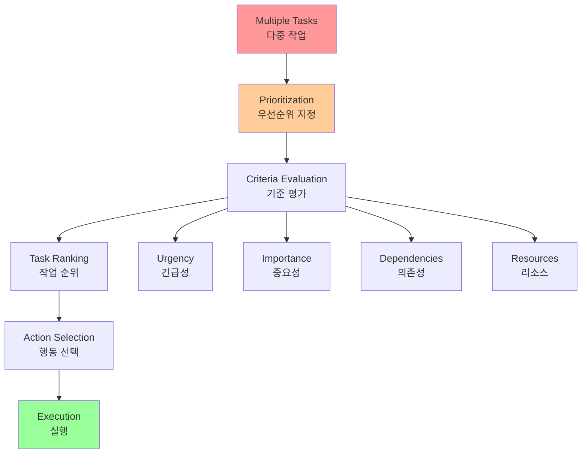
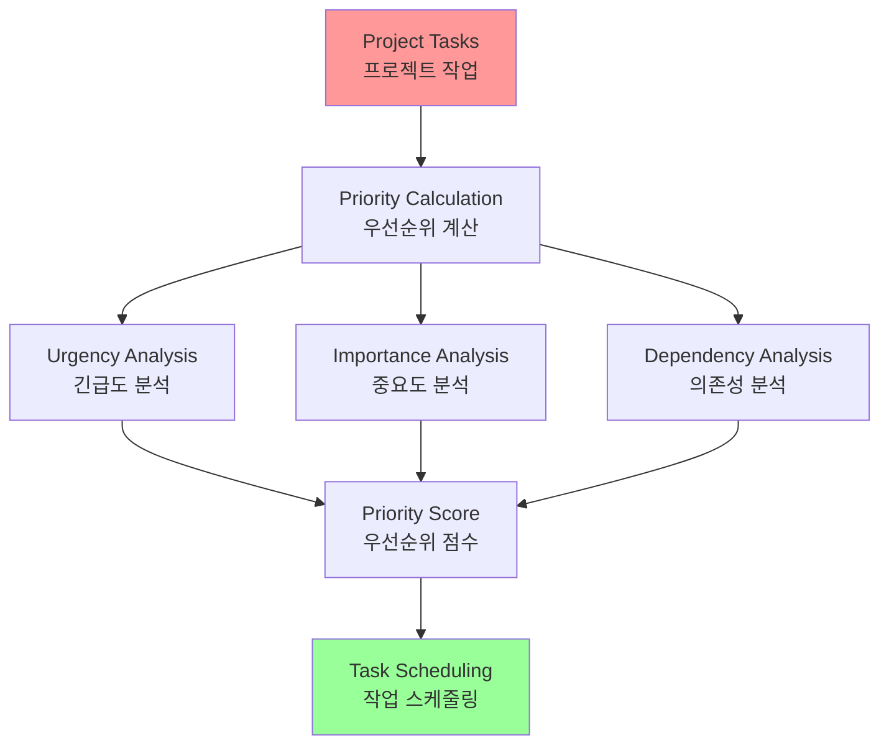

# Chapter 20: Prioritization

## 개요

In complex and dynamic environments, agents often encounter numerous potential actions, conflicting goals, and limited resources. Without a defined process for determining the next action, agents can experience reduced efficiency, operational delays, or failure to achieve key objectives. The Prioritization pattern addresses this by enabling agents to assess and rank tasks, objectives, or actions based on significance, urgency, dependencies, and established criteria.

복잡하고 동적인 환경에서 에이전트는 종종 수많은 잠재적 행동, 충돌하는 목표, 제한된 리소스를 만납니다. 다음 행동을 결정하는 정의된 프로세스 없이는 에이전트가 효율성 저하, 운영 지연 또는 주요 목표 달성 실패를 경험할 수 있습니다. Prioritization 패턴은 에이전트가 중요성, 긴급성, 의존성 및 확립된 기준에 따라 작업, 목표 또는 행동을 평가하고 순위를 매길 수 있게 하여 이 문제를 해결합니다.

## 패턴 개요 (Pattern Overview)

Agents employ prioritization to effectively manage tasks, goals, and sub-goals, guiding subsequent actions. This process facilitates informed decision-making when addressing multiple demands, prioritizing vital or urgent activities over less critical ones. It is particularly relevant in real-world scenarios where resources are constrained, time is limited, and objectives may conflict.

에이전트는 작업, 목표 및 하위 목표를 효과적으로 관리하고 후속 행동을 안내하기 위해 우선순위 지정을 사용합니다. 이 프로세스는 여러 요구사항을 다룰 때 정보에 입각한 의사 결정을 용이하게 하며, 덜 중요한 것보다 중요하거나 긴급한 활동을 우선시합니다. 리소스가 제한되고 시간이 제한되며 목표가 충돌할 수 있는 실제 시나리오에서 특히 관련이 있습니다.



### 우선순위 지정 패턴 개요

The fundamental aspects of agent prioritization typically involve several elements. First, criteria definition establishes the rules or metrics for task evaluation. These may include urgency (time sensitivity of the task), importance (impact on the primary objective), dependencies (whether the task is a prerequisite for others), resource availability (readiness of necessary tools or information), cost/benefit analysis (effort versus expected outcome), and user preferences for personalized agents. Second, task evaluation involves assessing each potential task against these defined criteria, utilizing methods ranging from simple rules to complex scoring or reasoning by LLMs. Third, scheduling or selection logic refers to the algorithm that, based on the evaluations, selects the optimal next action or task sequence, potentially utilizing a queue or an advanced planning component. Finally, dynamic re-prioritization allows the agent to modify priorities as circumstances change, such as the emergence of a new critical event or an approaching deadline, ensuring agent adaptability and responsiveness.

에이전트 우선순위 지정의 기본 측면은 일반적으로 여러 요소를 포함합니다. 첫째, 기준 정의는 작업 평가를 위한 규칙 또는 메트릭을 설정합니다. 이것들은 긴급성(작업의 시간 민감성), 중요성(주요 목표에 대한 영향), 의존성(작업이 다른 작업의 전제 조건인지 여부), 리소스 가용성(필요한 도구 또는 정보의 준비 상태), 비용/이익 분석(노력 대 예상 결과), 개인화된 에이전트를 위한 사용자 선호도를 포함할 수 있습니다. 둘째, 작업 평가는 정의된 기준에 대해 각 잠재적 작업을 평가하는 것을 포함하며, 간단한 규칙에서 LLM에 의한 복잡한 점수화 또는 추론에 이르는 방법을 활용합니다. 셋째, 스케줄링 또는 선택 로직은 평가를 기반으로 최적의 다음 행동 또는 작업 시퀀스를 선택하는 알고리즘을 나타내며, 잠재적으로 큐 또는 고급 계획 구성 요소를 활용합니다. 마지막으로, 동적 재우선순위 지정은 새로운 중요한 이벤트의 출현이나 다가오는 마감일과 같은 상황이 변경됨에 따라 에이전트가 우선순위를 수정할 수 있게 하여 에이전트 적응성 및 반응성을 보장합니다.

Prioritization can occur at various levels: selecting an overarching objective (high-level goal prioritization), ordering steps within a plan (sub-task prioritization), or choosing the next immediate action from available options (action selection). Effective prioritization enables agents to exhibit more intelligent, efficient, and robust behavior, especially in complex, multi-objective environments. This mirrors human team organization, where managers prioritize tasks by considering input from all members.

우선순위 지정은 다양한 수준에서 발생할 수 있습니다: 전체 목표 선택(고수준 목표 우선순위 지정), 계획 내 단계 순서 지정(하위 작업 우선순위 지정), 또는 사용 가능한 옵션에서 다음 즉각적인 행동 선택(행동 선택). 효과적인 우선순위 지정은 에이전트가 더 지능적이고 효율적이며 견고한 행동을 보여주도록 하며, 특히 복잡하고 다중 목표 환경에서 그렇습니다. 이것은 관리자가 모든 구성원의 입력을 고려하여 작업을 우선순위 지정하는 인간 팀 조직을 반영합니다.

## 실용적 응용 및 사용 사례

- **자동화된 고객 지원**: 긴급 요청(시스템 중단 보고)을 일상적인 문제(비밀번호 재설정)보다 우선시
- **클라우드 컴퓨팅**: 중요한 애플리케이션에 리소스 할당을 우선시하고 덜 긴급한 배치 작업을 비피크 시간으로 연기
- **자율 주행 시스템**: 안전과 효율성을 보장하기 위해 지속적으로 행동을 우선순위 지정
- **금융 거래**: 시장 조건, 위험 허용 범위, 이익 마진, 실시간 뉴스를 분석하여 거래 우선순위 지정
- **프로젝트 관리**: 마감일, 의존성, 팀 가용성, 전략적 중요성을 기반으로 작업 우선순위 지정
- **사이버 보안**: 위협 심각도, 잠재적 영향, 자산 중요성을 평가하여 경고 우선순위 지정
- **개인 어시스턴트 AI**: 사용자 정의 중요도, 다가오는 마감일, 현재 컨텍스트에 따라 일정, 알림, 알림을 구성

## 실습 코드 예제

다음은 LangChain을 사용한 프로젝트 관리자 AI 에이전트 개발을 보여줍니다. 이 에이전트는 작업 생성, 우선순위 지정 및 팀 구성원에게 할당을 용이하게 하며, 자동화된 프로젝트 관리를 위한 맞춤형 도구를 가진 대규모 언어 모델의 응용을 보여줍니다.

```python
import os
import asyncio
from typing import List, Optional, Dict, Type
from dotenv import load_dotenv
from pydantic import BaseModel, Field
from langchain_core.prompts import ChatPromptTemplate
from langchain_core.tools import Tool
from langchain_openai import ChatOpenAI
from langchain.agents import AgentExecutor, create_react_agent
from langchain.memory import ConversationBufferMemory

# --- 0. Configuration and Setup ---
# Loads the OPENAI_API_KEY from the .env file.
load_dotenv()
# The ChatOpenAI client automatically picks up the API key from the environment.
llm = ChatOpenAI(temperature=0.5, model="gpt-4o-mini")

# --- 1. Task Management System ---
class Task(BaseModel):
    """Represents a single task in the system."""
    id: str
    description: str
    priority: Optional[str] = None  # P0, P1, P2
    assigned_to: Optional[str] = None  # Name of the worker

class SuperSimpleTaskManager:
    """An efficient and robust in-memory task manager."""
    def __init__(self):
        # Use a dictionary for O(1) lookups, updates, and deletions.
        self.tasks: Dict[str, Task] = {}
        self.next_task_id = 1

    def create_task(self, description: str) -> Task:
        """Creates and stores a new task."""
        task_id = f"TASK-{self.next_task_id:03d}"
        new_task = Task(id=task_id, description=description)
        self.tasks[task_id] = new_task
        self.next_task_id += 1
        print(f"DEBUG: Task created - {task_id}: {description}")
        return new_task

    def update_task(self, task_id: str, **kwargs) -> Optional[Task]:
        """Safely updates a task using Pydantic's model_copy."""
        task = self.tasks.get(task_id)
        if task:
            # Use model_copy for type-safe updates.
            update_data = {k: v for k, v in kwargs.items() if v is not None}
            updated_task = task.model_copy(update=update_data)
            self.tasks[task_id] = updated_task
            print(f"DEBUG: Task {task_id} updated with {update_data}")
            return updated_task
        print(f"DEBUG: Task {task_id} not found for update.")
        return None

    def list_all_tasks(self) -> str:
        """Lists all tasks currently in the system."""
        if not self.tasks:
            return "No tasks in the system."
        task_strings = []
        for task in self.tasks.values():
            task_strings.append(
                f"ID: {task.id}, Desc: '{task.description}', "
                f"Priority: {task.priority or 'N/A'}, "
                f"Assigned To: {task.assigned_to or 'N/A'}"
            )
        return "Current Tasks:\n" + "\n".join(task_strings)

task_manager = SuperSimpleTaskManager()

# --- 2. Tools for the Project Manager Agent ---
# Use Pydantic models for tool arguments for better validation and clarity.
class CreateTaskArgs(BaseModel):
    description: str = Field(description="A detailed description of the task.")

class PriorityArgs(BaseModel):
    task_id: str = Field(description="The ID of the task to update, e.g., 'TASK-001'.")
    priority: str = Field(description="The priority to set. Must be one of: 'P0', 'P1', 'P2'.")

class AssignWorkerArgs(BaseModel):
    task_id: str = Field(description="The ID of the task to update, e.g., 'TASK-001'.")
    worker_name: str = Field(description="The name of the worker to assign the task to.")

def create_new_task_tool(description: str) -> str:
    """Creates a new project task with the given description."""
    task = task_manager.create_task(description)
    return f"Created task {task.id}: '{task.description}'."

def assign_priority_to_task_tool(task_id: str, priority: str) -> str:
    """Assigns a priority (P0, P1, P2) to a given task ID."""
    if priority not in ["P0", "P1", "P2"]:
        return "Invalid priority. Must be P0, P1, or P2."
    task = task_manager.update_task(task_id, priority=priority)
    return f"Assigned priority {priority} to task {task.id}." if task else f"Task {task_id} not found."

def assign_task_to_worker_tool(task_id: str, worker_name: str) -> str:
    """Assigns a task to a specific worker."""
    task = task_manager.update_task(task_id, assigned_to=worker_name)
    return f"Assigned task {task.id} to {worker_name}." if task else f"Task {task_id} not found."

# All tools the PM agent can use
pm_tools = [
    Tool(
        name="create_new_task",
        func=create_new_task_tool,
        description="Use this first to create a new task and get its ID.",
        args_schema=CreateTaskArgs
    ),
    Tool(
        name="assign_priority_to_task",
        func=assign_priority_to_task_tool,
        description="Use this to assign a priority to a task after it has been created.",
        args_schema=PriorityArgs
    ),
    Tool(
        name="assign_task_to_worker",
        func=assign_task_to_worker_tool,
        description="Use this to assign a task to a specific worker after it has been created.",
        args_schema=AssignWorkerArgs
    ),
    Tool(
        name="list_all_tasks",
        func=task_manager.list_all_tasks,
        description="Use this to list all current tasks and their status."
    ),
]

# --- 3. Project Manager Agent Definition ---
pm_prompt_template = ChatPromptTemplate.from_messages([
    ("system", """You are a focused Project Manager LLM agent. Your goal is to manage project tasks efficiently.
When you receive a new task request, follow these steps:
1. First, create the task with the given description using the `create_new_task` tool. You must do this first to get a `task_id`.
2. Next, analyze the user's request to see if a priority or an assignee is mentioned.
- If a priority is mentioned (e.g., "urgent", "ASAP", "critical"), map it to P0. Use `assign_priority_to_task`.
- If a worker is mentioned, use `assign_task_to_worker`.
3. If any information (priority, assignee) is missing, you must make a reasonable default assignment (e.g., assign P1 priority and assign to 'Worker A').
4. Once the task is fully processed, use `list_all_tasks` to show the final state.
Available workers: 'Worker A', 'Worker B', 'Review Team'
Priority levels: P0 (highest), P1 (medium), P2 (lowest)
"""),
    ("placeholder", "{chat_history}"),
    ("human", "{input}"),
    ("placeholder", "{agent_scratchpad}")
])

# Create the agent executor
pm_agent = create_react_agent(llm, pm_tools, pm_prompt_template)
pm_agent_executor = AgentExecutor(
    agent=pm_agent,
    tools=pm_tools,
    verbose=True,
    handle_parsing_errors=True,
    memory=ConversationBufferMemory(memory_key="chat_history", return_messages=True)
)

# --- 4. Simple Interaction Flow ---
async def run_simulation():
    print("--- Project Manager Simulation ---")
    # Scenario 1: Handle a new, urgent feature request
    print("\n[User Request] I need a new login system implemented ASAP. It should be assigned to Worker B.")
    await pm_agent_executor.ainvoke({"input": "Create a task to implement a new login system. It's urgent and should be assigned to Worker B."})
    print("\n" + "-"*60 + "\n")
    # Scenario 2: Handle a less urgent content update with fewer details
    print("[User Request] We need to review the marketing website content.")
    await pm_agent_executor.ainvoke({"input": "Manage a new task: Review marketing website content."})
    print("\n--- Simulation Complete ---")

# Run the simulation
if __name__ == "__main__":
    asyncio.run(run_simulation())
```

이 코드는 Python과 LangChain을 사용하여 대규모 언어 모델로 구동되는 프로젝트 관리자 에이전트를 시뮬레이션하도록 설계된 간단한 작업 관리 시스템을 구현합니다.

시스템은 빠른 데이터 검색을 위해 딕셔너리 구조를 활용하여 메모리 내에서 작업을 효율적으로 관리하는 SuperSimpleTaskManager 클래스를 사용합니다. 각 작업은 고유 식별자, 설명 텍스트, 선택적 우선순위 수준(P0, P1, P2), 선택적 담당자 지정과 같은 속성을 포함하는 Task Pydantic 모델로 표현됩니다. 메모리 사용량은 작업 유형, 작업자 수 및 기타 기여 요인에 따라 달라집니다. 작업 관리자는 작업 생성, 작업 수정 및 모든 작업 검색을 위한 메서드를 제공합니다.

에이전트는 정의된 도구 세트를 통해 작업 관리자와 상호작용합니다. 이러한 도구는 새 작업 생성, 작업에 우선순위 할당, 인력에게 작업 할당, 모든 작업 나열을 용이하게 합니다. 각 도구는 SuperSimpleTaskManager 인스턴스와 상호작용할 수 있도록 캡슐화됩니다. Pydantic 모델은 도구에 필요한 인수를 설명하기 위해 활용되며, 이를 통해 데이터 검증이 보장됩니다.

AgentExecutor는 언어 모델, 도구 세트 및 컨텍스트 연속성을 유지하는 대화 메모리 구성 요소로 구성됩니다. 특정 ChatPromptTemplate이 프로젝트 관리 역할에서 에이전트의 행동을 지시하도록 정의됩니다. 프롬프트는 에이전트가 작업을 생성하는 것으로 시작하고, 그 다음 지정된 대로 우선순위 및 인력을 할당하고, 포괄적인 작업 목록으로 끝나도록 지시합니다. 정보가 없는 경우 P1 우선순위 및 'Worker A'와 같은 기본 할당이 프롬프트 내에 명시됩니다.

코드는 에이전트의 운영 능력을 시연하기 위해 비동기 특성의 시뮬레이션 함수(run_simulation)를 통합합니다. 시뮬레이션은 지정된 인력이 있는 긴급 작업 관리와 최소 입력이 있는 덜 긴급한 작업 관리라는 두 가지 고유한 시나리오를 실행합니다. AgentExecutor 내에서 verbose=True가 활성화되어 에이전트의 행동과 논리적 프로세스가 콘솔에 출력됩니다.

## 한눈에 보기 (At a Glance)

### 무엇 (What)

복잡한 환경에서 작동하는 AI 에이전트는 수많은 잠재적 행동, 충돌하는 목표 및 유한한 리소스에 직면합니다. 다음 행동을 결정하는 명확한 방법 없이는 이러한 에이전트가 비효율적이고 비효과적이 될 위험이 있습니다. 이것은 중요한 운영 지연 또는 주요 목표 달성의 완전한 실패로 이어질 수 있습니다. 핵심 도전은 에이전트가 목적 있고 논리적으로 행동하도록 보장하기 위해 이 압도적인 선택의 수를 관리하는 것입니다.

### 왜 (Why)

우선순위 지정 패턴은 에이전트가 작업과 목표를 순위 매김을 가능하게 함으로써 이 문제에 대한 표준화된 솔루션을 제공합니다. 이것은 긴급성, 중요성, 의존성 및 리소스 비용과 같은 명확한 기준을 설정함으로써 달성됩니다. 그런 다음 에이전트는 이러한 기준에 대해 각 잠재적 행동을 평가하여 가장 중요하고 시기 적절한 행동 과정을 결정합니다. 이 에이전트적 능력은 시스템이 변화하는 상황에 동적으로 적응하고 제한된 리소스를 효과적으로 관리할 수 있게 합니다. 가장 높은 우선순위 항목에 집중함으로써 에이전트의 행동이 더 지능적이고 견고하며 전략적 목표와 정렬됩니다.

### 경험 법칙 (Rule of Thumb)

에이전트 시스템이 리소스 제약 하에서 여러 종종 충돌하는 작업이나 목표를 자율적으로 관리하여 동적 환경에서 효과적으로 작동해야 할 때 우선순위 지정 패턴을 사용하세요.

## 핵심 요약 (Key Takeaways)

1. **우선순위 지정은 AI 에이전트가 복잡하고 다면적인 환경에서 효과적으로 작동할 수 있게 합니다.**

2. **에이전트는 긴급성, 중요성 및 의존성과 같은 확립된 기준을 활용하여 작업을 평가하고 순위를 매깁니다.**

3. **동적 재우선순위 지정은 에이전트가 실시간 변경에 응답하여 운영 초점을 조정할 수 있게 합니다.**

4. **우선순위 지정은 전체 전략 목표와 즉각적인 전술 결정을 포함하는 다양한 수준에서 발생합니다.**

5. **효과적인 우선순위 지정은 AI 에이전트의 효율성 증가 및 운영 견고성 개선으로 이어집니다.**

## 결론 (Conclusions)

결론적으로, 우선순위 지정 패턴은 효과적인 에이전트 AI의 초석으로, 시스템이 목적과 지능을 가지고 동적 환경의 복잡성을 탐색할 수 있게 합니다. 이것은 에이전트가 충돌하는 여러 작업과 목표를 자율적으로 평가하고, 제한된 리소스를 어디에 집중할지에 대해 합리적인 결정을 내릴 수 있게 합니다. 이 에이전트적 능력은 간단한 작업 실행을 넘어서 시스템이 사전 예방적이고 전략적인 의사 결정자로 행동할 수 있게 합니다. 긴급성, 중요성 및 의존성과 같은 기준을 평가함으로써 에이전트는 정교하고 인간과 같은 추론 프로세스를 보여줍니다.

이 에이전트적 행동의 핵심 기능은 동적 재우선순위 지정으로, 에이전트가 조건이 변경됨에 따라 실시간으로 초점을 적응시킬 수 있는 자율성을 부여합니다. 코드 예제에서 입증된 바와 같이, 에이전트는 모호한 요청을 해석하고, 적절한 도구를 자율적으로 선택하고 사용하며, 목표를 달성하기 위해 논리적으로 행동을 순서화합니다. 워크플로를 자체 관리하는 이 능력은 진정한 에이전트 시스템을 간단한 자동화 스크립트와 구분하는 것입니다. 궁극적으로 우선순위 지정을 마스터하는 것은 복잡하고 실제 시나리오에서 효과적이고 신뢰할 수 있게 작동할 수 있는 견고하고 지능적인 에이전트를 만드는 데 기본적입니다.

## 이론적 배경 및 학술적 근거 (Theoretical Background and Academic Foundation)

### 의사결정 이론 (Decision Theory)

우선순위 지정은 의사결정 이론의 핵심입니다. Simon(1957)의 제한적 합리성(Bounded Rationality)은 제한된 정보와 계산 능력 하에서 최적 결정을 내리는 것을 다룹니다.

**의사결정 모델**:
- **합리적 모델**: 완전한 정보 하에서 최적 결정
- **제한적 합리성**: 제한된 정보 하에서 만족스러운 결정
- **직관적 모델**: 경험과 휴리스틱 기반 결정

**에이전트 우선순위 지정**:
- 제한된 리소스 하에서 최적 할당
- 다중 기준 의사결정
- 동적 환경에서 적응적 결정

### 작업 스케줄링 이론

작업 스케줄링은 제한된 리소스로 여러 작업을 효율적으로 처리하는 문제입니다.

**스케줄링 알고리즘**:
- **FIFO (First In First Out)**: 선입선출
- **우선순위 기반**: 우선순위가 높은 작업 우선
- **최단 작업 우선 (SJF)**: 짧은 작업 우선
- **라운드 로빈**: 시간 할당량 기반

**에이전트 시스템에서의 적용**:
- 작업 우선순위 계산
- 리소스 할당 최적화
- 의존성 고려한 스케줄링

### 다중 기준 의사결정 (Multi-Criteria Decision Making, MCDM)

여러 기준을 동시에 고려한 의사결정:

**MCDM 방법**:
- **가중 합계 모델**: 기준별 가중치 합산
- **TOPSIS**: 이상적 해와의 거리 기반
- **AHP (Analytic Hierarchy Process)**: 계층적 분석

**우선순위 지정에서의 적용**:
- 긴급성, 중요성, 의존성 등 다중 기준
- 기준별 가중치 설정
- 종합 우선순위 점수 계산

### 게임 이론: 리소스 경쟁

여러 작업이 리소스를 경쟁할 때 게임 이론이 적용됩니다.

**경쟁 모델**:
- **내시 균형**: 모든 작업이 최적 전략 선택
- **협력 게임**: 작업 간 협력으로 전체 효율 향상
- **경쟁 게임**: 개별 이익 추구

**에이전트 시스템에서의 구현**:
- 작업 간 리소스 경쟁 모델링
- 공정한 리소스 할당
- 협력적 작업 우선순위 지정

## 성능 최적화 기법 (Performance Optimization Techniques)

### 1. 동적 우선순위 재계산

실시간으로 우선순위 업데이트:

```python
class DynamicPriorityManager:
    def __init__(self):
        self.tasks = []
        self.priority_factors = {
            'urgency': 0.4,
            'importance': 0.3,
            'dependencies': 0.2,
            'resource_availability': 0.1
        }
    
    def recalculate_priorities(self):
        """동적 우선순위 재계산"""
        for task in self.tasks:
            # 각 요소 점수 계산
            urgency_score = self.calculate_urgency(task)
            importance_score = self.calculate_importance(task)
            dependency_score = self.calculate_dependency(task)
            resource_score = self.calculate_resource_availability(task)
            
            # 가중 합계
            priority_score = (
                self.priority_factors['urgency'] * urgency_score +
                self.priority_factors['importance'] * importance_score +
                self.priority_factors['dependencies'] * dependency_score +
                self.priority_factors['resource_availability'] * resource_score
            )
            
            task.priority_score = priority_score
        
        # 우선순위 순으로 정렬
        self.tasks.sort(key=lambda t: t.priority_score, reverse=True)
    
    def update_priority_on_event(self, event: Event):
        """이벤트 발생 시 우선순위 업데이트"""
        affected_tasks = self.get_affected_tasks(event)
        for task in affected_tasks:
            # 이벤트에 따라 우선순위 조정
            task.priority_score = self.adjust_priority(task, event)
        
        self.recalculate_priorities()
```

### 2. 의존성 기반 우선순위

작업 의존성을 고려한 우선순위:

```python
class DependencyAwarePrioritizer:
    def __init__(self):
        self.task_graph = TaskGraph()
    
    def prioritize_with_dependencies(self, tasks: List[Task]) -> List[Task]:
        """의존성을 고려한 우선순위 지정"""
        # 위상 정렬로 의존성 순서 결정
        topological_order = self.topological_sort(tasks)
        
        # 의존성 깊이에 따라 우선순위 조정
        prioritized = []
        for task in topological_order:
            # 의존성 깊이 계산
            depth = self.calculate_dependency_depth(task)
            
            # 깊이가 깊을수록 높은 우선순위 (먼저 처리)
            task.priority = 1.0 / (depth + 1)
            prioritized.append(task)
        
        # 추가 우선순위 요소 적용
        for task in prioritized:
            task.priority *= self.calculate_additional_factors(task)
        
        return sorted(prioritized, key=lambda t: t.priority, reverse=True)
    
    def calculate_dependency_depth(self, task: Task) -> int:
        """의존성 깊이 계산"""
        if not task.dependencies:
            return 0
        
        max_depth = 0
        for dep in task.dependencies:
            depth = self.calculate_dependency_depth(dep) + 1
            max_depth = max(max_depth, depth)
        
        return max_depth
```

### 3. 리소스 제약 우선순위

리소스 가용성을 고려한 우선순위:

```python
class ResourceConstrainedPrioritizer:
    def __init__(self, available_resources: dict):
        self.available_resources = available_resources
        self.resource_utilization = {}
    
    def prioritize_with_resources(self, tasks: List[Task]) -> List[Task]:
        """리소스 제약을 고려한 우선순위"""
        prioritized = []
        remaining_resources = self.available_resources.copy()
        
        # 리소스 요구사항이 적은 작업 우선
        for task in sorted(tasks, key=lambda t: self.get_resource_requirement(t)):
            if self.can_allocate_resources(task, remaining_resources):
                # 리소스 할당
                self.allocate_resources(task, remaining_resources)
                prioritized.append(task)
        
        return prioritized
    
    def get_resource_requirement(self, task: Task) -> float:
        """작업의 리소스 요구사항 계산"""
        total = 0
        for resource_type, amount in task.resource_requirements.items():
            # 리소스 가용성에 대한 비율
            available = self.available_resources.get(resource_type, 0)
            if available > 0:
                total += amount / available
        return total
```

### 4. 학습 기반 우선순위

과거 데이터로부터 학습한 우선순위:

```python
class LearningBasedPrioritizer:
    def __init__(self):
        self.priority_model = PriorityPredictionModel()
        self.historical_data = []
    
    def train_model(self, historical_tasks: List[HistoricalTask]):
        """우선순위 예측 모델 훈련"""
        features = []
        labels = []
        
        for task in historical_tasks:
            feature = self.extract_features(task)
            label = task.actual_priority  # 실제 우선순위
            features.append(feature)
            labels.append(label)
        
        self.priority_model.train(features, labels)
    
    def predict_priority(self, task: Task) -> float:
        """작업 우선순위 예측"""
        features = self.extract_features(task)
        predicted_priority = self.priority_model.predict(features)
        return predicted_priority
    
    def extract_features(self, task: Task) -> List[float]:
        """작업 특징 추출"""
        return [
            task.urgency,
            task.importance,
            len(task.dependencies),
            task.estimated_duration,
            task.resource_requirement,
            task.deadline_proximity()
        ]
```

## 트레이드오프 및 한계점 (Trade-offs and Limitations)

### Prioritization의 장점

1. **효율성**: 중요한 작업에 리소스 집중
2. **응답성**: 긴급한 작업 빠른 처리
3. **자원 최적화**: 제한된 리소스 효율적 사용
4. **목표 달성**: 전략적 목표 달성 가능

### Prioritization의 한계

1. **주관성**: 우선순위 기준의 주관성
2. **복잡도**: 다중 기준 고려의 복잡성
3. **변동성**: 우선순위의 빈번한 변경
4. **공정성**: 일부 작업의 지연 가능성

### 완화 전략

1. **명확한 기준**: 객관적이고 명확한 우선순위 기준
2. **자동화**: 자동 우선순위 계산으로 일관성 유지
3. **안정화**: 빈번한 변경 방지를 위한 임계값 설정
4. **공정성 보장**: 모든 작업에 최소한의 처리 보장

## 관련 패턴과의 비교 (Comparison with Related Patterns)

### Prioritization vs. FIFO

| 특성 | FIFO | Prioritization |
|------|------|----------------|
| 복잡도 | 낮음 | 높음 |
| 효율성 | 낮음 | 높음 |
| 공정성 | 높음 | 중간 |
| 적응성 | 없음 | 있음 |

### Prioritization vs. Planning

- **Prioritization**: 작업 순서 결정
- **Planning**: 작업 계획 수립
- **결합**: 계획 수립 후 우선순위 지정

## 실무 적용 사례 확장 (Extended Practical Applications)

### 1. 프로젝트 관리 시스템

복잡한 프로젝트의 작업 우선순위:



### 2. 이벤트 처리 시스템

실시간 이벤트 우선순위:

- **긴급 이벤트**: 즉시 처리
- **중요 이벤트**: 높은 우선순위
- **일반 이벤트**: 기본 우선순위
- **배치 이벤트**: 낮은 우선순위

### 3. 고객 지원 시스템

고객 요청 우선순위:

```python
class CustomerSupportPrioritizer:
    def __init__(self):
        self.priority_rules = {
            'vip_customer': 2.0,  # VIP 고객 가중치
            'critical_issue': 3.0,  # 중요 이슈 가중치
            'waiting_time': 0.1,  # 대기 시간 가중치
            'ticket_age': 0.05  # 티켓 나이 가중치
        }
    
    def prioritize_ticket(self, ticket: SupportTicket) -> float:
        """고객 지원 티켓 우선순위 계산"""
        priority = 1.0
        
        # VIP 고객
        if ticket.customer.is_vip:
            priority *= self.priority_rules['vip_customer']
        
        # 중요 이슈
        if ticket.severity == 'critical':
            priority *= self.priority_rules['critical_issue']
        
        # 대기 시간
        waiting_hours = (datetime.now() - ticket.created_at).total_seconds() / 3600
        priority += waiting_hours * self.priority_rules['waiting_time']
        
        # 티켓 나이
        age_days = (datetime.now() - ticket.created_at).days
        priority += age_days * self.priority_rules['ticket_age']
        
        return priority
```

## 참고 자료 (References)

### 학술 논문

1. Simon, H. A. (1957). *Models of Man: Social and Rational*. John Wiley & Sons.

2. Saaty, T. L. (1980). *The Analytic Hierarchy Process*. McGraw-Hill.

3. Hwang, C. L., & Yoon, K. (1981). *Multiple Attribute Decision Making: Methods and Applications*. Springer.

4. Pinedo, M. (2016). *Scheduling: Theory, Algorithms, and Systems* (5th ed.). Springer.

5. Examining the Security of Artificial Intelligence in Project Management: A Case Study of AI-driven Project Scheduling and Resource Allocation in Information Systems Projects: 
   https://www.irejournals.com/paper-details/1706160

6. AI-Driven Decision Support Systems in Agile Software Project Management: Enhancing Risk Mitigation and Resource Allocation: 
   https://www.mdpi.com/2079-8954/13/3/208

### 프레임워크 및 도구 문서

1. LangChain Agent Documentation:
   https://python.langchain.com/docs/modules/agents/

2. Project Management Best Practices:
   https://www.pmi.org/learning/library

### 추가 학습 자료

3. "Decision Making Under Uncertainty" by Howard Raiffa

4. "The Art of Project Management" by Scott Berkun

5. "Agile Project Management" by Jim Highsmith

---

**이전 챕터**: [Chapter 19: Evaluation and Monitoring](chapter_19_Evaluation_and_Monitoring.md)  
**다음 챕터**: [Chapter 21: Exploration and Discovery](chapter_21_Exploration.md)

