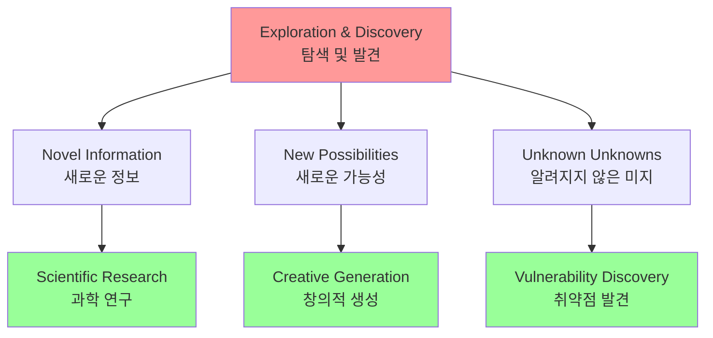
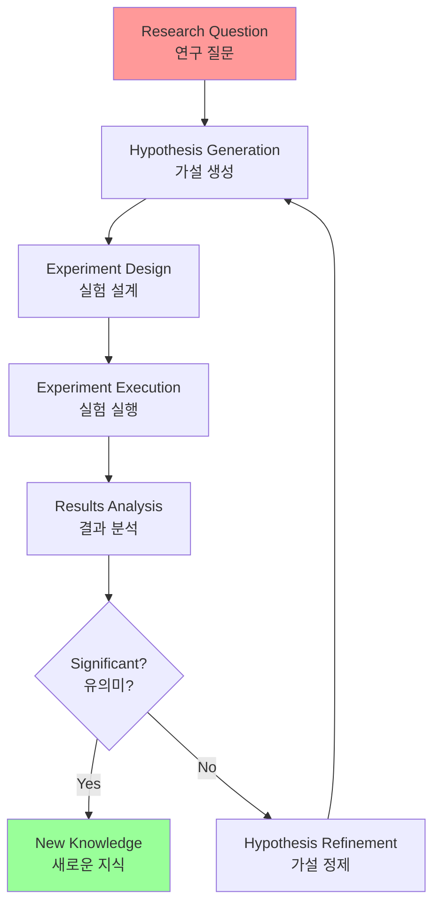

# Chapter 21: Exploration and Discovery

## 개요

This chapter explores patterns that enable intelligent agents to actively seek novel information, uncover new possibilities, and identify unknown unknowns within their operational environments. Exploration and Discovery differs from reactive behavior or optimization within predefined solution spaces. Instead, it focuses on agents actively venturing into unfamiliar territories, experimenting with new approaches, and generating new knowledge or understanding.

이 챕터는 지능형 에이전트가 새로운 정보를 적극적으로 찾고, 새로운 가능성을 발견하며, 운영 환경 내에서 알려지지 않은 미지의 영역을 식별할 수 있게 하는 패턴을 탐구합니다. Exploration and Discovery는 반응적 행동이나 사전 정의된 솔루션 공간 내의 최적화와 다릅니다. 대신, 에이전트가 능동적으로 익숙하지 않은 영역으로 모험하고, 새로운 접근 방식을 실험하며, 새로운 지식이나 이해를 생성하는 것에 초점을 맞춥니다.

## 패턴 개요 (Pattern Overview)

This pattern is crucial for agents operating in open-ended, complex, or rapidly evolving domains where static knowledge or pre-programmed solutions are insufficient. It emphasizes the agent's capacity to expand its understanding and capabilities.

이 패턴은 정적 지식이나 사전 프로그래밍된 솔루션이 불충분한 개방형, 복잡하거나 빠르게 진화하는 도메인에서 작동하는 에이전트에게 중요합니다. 에이전트의 이해와 능력을 확장하는 능력을 강조합니다.



### 핵심 특징

This pattern is crucial for agents operating in open-ended, complex, or rapidly evolving domains where static knowledge or pre-programmed solutions are insufficient. It emphasizes the agent's capacity to expand its understanding and capabilities.

이 패턴은 정적 지식이나 사전 프로그래밍된 솔루션이 불충분한 개방형, 복잡하거나 빠르게 진화하는 도메인에서 작동하는 에이전트에게 중요합니다. 에이전트의 이해와 능력을 확장하는 능력을 강조합니다.

**주요 특징**:
- **능동적 탐색**: 반응적 행동을 넘어서는 능동적 모험
- **실험**: 새로운 접근 방식 실험
- **지식 생성**: 새로운 지식이나 이해 생성
- **미지의 영역 탐색**: 익숙하지 않은 영역으로 모험

## 실용적 응용 및 사용 사례 (Practical Applications & Use Cases)

AI agents possess the ability to intelligently prioritize and explore, which leads to applications across various domains. By autonomously evaluating and ordering potential actions, these agents can navigate complex environments, uncover hidden insights, and drive innovation. This capacity for prioritized exploration enables them to optimize processes, discover new knowledge, and generate content.

AI 에이전트는 지능적으로 우선순위를 지정하고 탐색할 수 있는 능력을 가지고 있으며, 이는 다양한 도메인에 걸친 응용으로 이어집니다. 잠재적 행동을 자율적으로 평가하고 순서를 매김으로써 이러한 에이전트는 복잡한 환경을 탐색하고, 숨겨진 통찰을 발견하며, 혁신을 추진할 수 있습니다. 우선순위가 지정된 탐색에 대한 이 능력은 프로세스를 최적화하고, 새로운 지식을 발견하며, 콘텐츠를 생성할 수 있게 합니다.

**Examples**:

- **Scientific Research Automation**: An agent designs and runs experiments, analyzes results, and formulates new hypotheses to discover novel materials, drug candidates, or scientific principles.
- **과학 연구 자동화**: 실험을 설계하고 실행하며, 결과를 분석하고 새로운 가설을 공식화하여 새로운 재료, 약물 후보 또는 과학적 원리를 발견

- **Game Playing and Strategy Generation**: Agents explore game states, discovering emergent strategies or identifying vulnerabilities in game environments (e.g., AlphaGo).
- **게임 플레이 및 전략 생성**: 게임 상태를 탐색하여 긴급한 전략을 발견하거나 게임 환경의 취약점을 식별

- **Market Research and Trend Spotting**: Agents scan unstructured data (social media, news, reports) to identify trends, consumer behaviors, or market opportunities.
- **시장 연구 및 트렌드 발견**: 비구조화된 데이터(소셜 미디어, 뉴스, 보고서)를 스캔하여 트렌드, 소비자 행동 또는 시장 기회 식별

- **Security Vulnerability Discovery**: Agents probe systems or codebases to find security flaws or attack vectors.
- **보안 취약점 발견**: 시스템이나 코드베이스를 탐색하여 보안 결함이나 공격 벡터 발견

- **Creative Content Generation**: Agents explore combinations of styles, themes, or data to generate artistic pieces, musical compositions, or literary works.
- **창의적 콘텐츠 생성**: 스타일, 테마 또는 데이터의 조합을 탐색하여 예술 작품, 음악 작곡 또는 문학 작품 생성

- **Personalized Education and Training**: AI tutors prioritize learning paths and content delivery based on a student's progress, learning style, and areas needing improvement.
- **개인화된 교육 및 훈련**: 학생의 진행 상황, 학습 스타일 및 개선이 필요한 영역을 기반으로 학습 경로와 콘텐츠 제공을 우선순위 지정

## Google Co-Scientist

An AI co-scientist is an AI system developed by Google Research designed as a computational scientific collaborator. It assists human scientists in research aspects such as hypothesis generation, proposal refinement, and experimental design. This system operates on the Gemini LLM.

AI co-scientist는 Google Research에서 개발한 AI 시스템으로 계산 과학 협력자로 설계되었습니다. 이것은 가설 생성, 제안 정제 및 실험 설계와 같은 연구 측면에서 인간 과학자를 지원합니다. 이 시스템은 Gemini LLM에서 작동합니다.

The development of the AI co-scientist addresses challenges in scientific research. These include processing large volumes of information, generating testable hypotheses, and managing experimental planning. The AI co-scientist supports researchers by performing tasks that involve large-scale information processing and synthesis, potentially revealing relationships within data. Its purpose is to augment human cognitive processes by handling computationally demanding aspects of early-stage research.

AI co-scientist의 개발은 과학 연구의 도전을 해결합니다. 이것들은 대량의 정보 처리, 테스트 가능한 가설 생성 및 실험 계획 관리를 포함합니다. AI co-scientist는 대규모 정보 처리 및 합성을 포함하는 작업을 수행하여 연구자를 지원하며, 잠재적으로 데이터 내의 관계를 드러냅니다. 그 목적은 초기 단계 연구의 계산적으로 요구되는 측면을 처리함으로써 인간 인지 프로세스를 증강하는 것입니다.

The development of the AI co-scientist addresses challenges in scientific research. These include processing large volumes of information, generating testable hypotheses, and managing experimental planning. The AI co-scientist supports researchers by performing tasks that involve large-scale information processing and synthesis, potentially revealing relationships within data. Its purpose is to augment human cognitive processes by handling computationally demanding aspects of early-stage research.

AI co-scientist의 개발은 과학 연구의 도전을 해결합니다. 이것들은 대량의 정보 처리, 테스트 가능한 가설 생성 및 실험 계획 관리를 포함합니다. AI co-scientist는 대규모 정보 처리 및 합성을 포함하는 작업을 수행하여 연구자를 지원하며, 잠재적으로 데이터 내의 관계를 드러냅니다. 그 목적은 초기 단계 연구의 계산적으로 요구되는 측면을 처리함으로써 인간 인지 프로세스를 증강하는 것입니다.

### 시스템 아키텍처 및 방법론

AI co-scientist의 아키텍처는 다중 에이전트 프레임워크를 기반으로 하며, 협력적이고 반복적인 프로세스를 모방하도록 구조화되었습니다. 이 설계는 연구 목표에 기여하는 특정 역할을 가진 전문 AI 에이전트를 통합합니다. 감독 에이전트는 계산 리소스의 유연한 확장을 허용하는 비동기 작업 실행 프레임워크 내에서 이러한 개별 에이전트의 활동을 관리하고 조정합니다.

핵심 에이전트와 그 기능은 다음과 같습니다:

- **Generation agent**: 문헌 탐색 및 시뮬레이션된 과학적 논쟁을 통해 초기 가설을 생성하여 프로세스를 시작합니다.

- **Reflection agent**: 동료 검토자 역할을 하며 생성된 가설의 정확성, 참신성 및 품질을 비판적으로 평가합니다.

- **Ranking agent**: Elo 기반 토너먼트를 사용하여 시뮬레이션된 과학적 논쟁을 통해 가설을 비교, 순위 지정 및 우선순위 지정합니다.

- **Evolution agent**: 개념 단순화, 아이디어 합성, 비전통적 추론 탐색을 통해 상위 순위 가설을 지속적으로 정제합니다.

- **Proximity agent**: 유사한 아이디어를 클러스터링하고 가설 경관을 탐색하는 데 도움이 되는 근접 그래프를 계산합니다.

- **Meta-review agent**: 모든 검토 및 논쟁에서 통찰을 합성하여 공통 패턴을 식별하고 피드백을 제공하여 시스템이 지속적으로 개선되도록 합니다.

시스템의 운영 기반은 언어 이해, 추론 및 생성 능력을 제공하는 Gemini에 의존합니다. 시스템은 반복적으로 추론하고 출력을 향상시키기 위해 증가된 계산 리소스를 할당하는 메커니즘인 "test-time compute scaling"을 통합합니다. 시스템은 학술 문헌, 웹 기반 데이터 및 데이터베이스를 포함한 다양한 소스에서 정보를 처리하고 합성합니다.

시스템은 과학적 방법을 반영하는 반복적 "생성, 논쟁, 진화" 접근 방식을 따릅니다. 인간 과학자로부터 과학적 문제 입력을 받은 후, 시스템은 가설 생성, 평가 및 정제의 자기 개선 사이클에 참여합니다. 가설은 에이전트 간의 내부 평가 및 토너먼트 기반 순위 지정 메커니즘을 포함한 체계적 평가를 거칩니다.

### 검증 및 결과

AI co-scientist의 유용성은 특히 생의학에서 자동화된 벤치마크, 전문가 검토 및 엔드투엔드 웻랩 실험을 통해 성능을 평가하는 여러 검증 연구에서 입증되었습니다.

**자동화 및 전문가 평가**: 도전적인 GPQA 벤치마크에서 시스템의 내부 Elo 등급이 결과의 정확도와 일치하는 것으로 나타났으며, 어려운 "diamond set"에서 78.4%의 상위-1 정확도를 달성했습니다. 200개 이상의 연구 목표에 걸친 분석은 test-time compute scaling이 Elo 등급으로 측정된 가설의 품질을 지속적으로 향상시킨다는 것을 보여주었습니다. 15개의 선별된 도전적인 문제 세트에서 AI co-scientist는 다른 최첨단 AI 모델과 인간 전문가가 제공한 "최선의 추측" 솔루션을 능가했습니다. 소규모 평가에서 생의학 전문가들은 co-scientist의 출력을 다른 기준 모델과 비교하여 더 참신하고 영향력 있는 것으로 평가했습니다. NIH Specific Aims 페이지로 형식화된 약물 재목적화에 대한 시스템의 제안은 6명의 전문 종양학자 패널에 의해 고품질로 판단되었습니다.

**엔드투엔드 실험 검증**:
- **약물 재목적화**: 급성 골수성 백혈병(AML)의 경우, 시스템은 새로운 약물 후보를 제안했습니다. 이들 중 일부인 KIRA6와 같은 것은 AML에서 사용에 대한 사전 임상 증거가 전혀 없는 완전히 새로운 제안이었습니다. 후속 in vitro 실험은 KIRA6 및 기타 제안된 약물이 여러 AML 세포주에서 임상적으로 관련된 농도에서 종양 세포 생존력을 억제한다는 것을 확인했습니다.

- **새로운 표적 발견**: 시스템은 간 섬유증에 대한 새로운 후성유전학적 표적을 식별했습니다. 인간 간 유기체를 사용한 실험실 실험은 이러한 발견을 검증했으며, 제안된 후성유전학적 수정자를 표적으로 하는 약물이 상당한 항섬유화 활성을 보였다는 것을 보여주었습니다. 식별된 약물 중 하나는 이미 다른 상태에 대해 FDA 승인을 받았으며, 재목적화 기회를 열었습니다.

- **항균 저항성**: AI co-scientist는 독립적으로 게시되지 않은 실험적 발견을 재현했습니다. 특정 모바일 유전 요소(cf-PICIs)가 많은 박테리아 종에서 발견되는 이유를 설명하라는 임무를 받았습니다. 이틀 만에 시스템의 상위 순위 가설은 cf-PICIs가 다양한 파지 꼬리와 상호작용하여 숙주 범위를 확장한다는 것이었습니다. 이것은 독립 연구 그룹이 10년 이상의 연구 후에 도달한 새로운 실험적으로 검증된 발견을 반영했습니다.

**증강 및 제한사항**: AI co-scientist 뒤의 설계 철학은 인간 연구의 완전한 자동화보다는 증강을 강조합니다. 연구자는 자연어를 통해 시스템과 상호작용하고 안내하며, 피드백을 제공하고, 자신의 아이디어를 기여하며, "scientist-in-the-loop" 협력 패러다임에서 AI의 탐색 프로세스를 지시합니다. 그러나 시스템에는 일부 제한사항이 있습니다. 그 지식은 오픈 액세스 문헌에 대한 의존성에 의해 제한되며, 잠재적으로 페이월 뒤에 있는 중요한 이전 작업을 놓칠 수 있습니다. 또한 게시되는 경우가 거의 없지만 경험 많은 과학자에게 중요한 부정적 실험 결과에 대한 제한된 액세스를 가지고 있습니다. 더욱이 시스템은 사실적 부정확성이나 "환각"의 잠재력을 포함하여 기본 LLM의 제한사항을 상속받습니다.

**안전**: 안전은 중요한 고려사항이며, 시스템은 여러 안전장치를 통합합니다. 모든 연구 목표는 입력 시 안전에 대해 검토되며, 생성된 가설도 시스템이 안전하지 않거나 비윤리적인 연구에 사용되는 것을 방지하기 위해 확인됩니다. 1,200개의 적대적 연구 목표를 사용한 예비 안전 평가는 시스템이 위험한 입력을 견고하게 거부할 수 있다는 것을 발견했습니다. 책임 있는 개발을 보장하기 위해 시스템은 실제 피드백을 수집하기 위해 Trusted Tester Program을 통해 더 많은 과학자에게 제공되고 있습니다.

## 실습 코드 예제: Agent Laboratory

탐색 및 발견을 위한 에이전트 AI의 구체적인 예를 살펴보겠습니다: Agent Laboratory, MIT License 하에 Samuel Schmidgall이 개발한 프로젝트.

"Agent Laboratory"는 인간 과학적 노력을 대체하기보다는 증강하도록 설계된 자율 연구 워크플로우 프레임워크입니다. 이 시스템은 과학 연구 프로세스의 다양한 단계를 자동화하기 위해 전문 LLM을 활용하여 인간 연구자가 개념화 및 비판적 분석에 더 많은 인지 리소스를 전념할 수 있게 합니다.

프레임워크는 자율 연구 에이전트를 위한 분산 저장소인 "AgentRxiv"를 통합합니다. AgentRxiv는 연구 출력의 저장, 검색 및 개발을 용이하게 합니다.

Agent Laboratory는 고유한 단계를 통해 연구 프로세스를 안내합니다:

1. **문헌 검토**: 이 초기 단계에서 전문 LLM 기반 에이전트는 관련 학술 문헌의 자율적 수집 및 비판적 분석을 담당합니다. 이것은 arXiv와 같은 외부 데이터베이스를 활용하여 관련 연구를 식별, 합성 및 분류하는 것을 포함하며, 후속 단계를 위한 포괄적인 지식 기반을 효과적으로 구축합니다.

2. **실험**: 이 단계는 실험 설계의 협력적 공식화, 데이터 준비, 실험 실행 및 결과 분석을 포함합니다. 에이전트는 자동화된 실험을 수행하기 위해 코드 생성 및 실행을 위한 Python, 모델 액세스를 위한 Hugging Face와 같은 통합 도구를 활용합니다. 시스템은 반복적 정제를 위해 설계되며, 에이전트가 실시간 결과를 기반으로 실험 절차를 적응하고 최적화할 수 있습니다.

3. **보고서 작성**: 최종 단계에서 시스템은 포괄적인 연구 보고서 생성을 자동화합니다. 이것은 실험 단계의 발견을 문헌 검토의 통찰과 합성하고, 학술 관례에 따라 문서를 구조화하며, 전문적인 형식 지정 및 그림 생성을 위해 LaTeX와 같은 외부 도구를 통합하는 것을 포함합니다.

4. **지식 공유**: AgentRxiv는 자율 연구 에이전트가 과학적 발견을 공유, 액세스 및 협력적으로 발전시킬 수 있게 하는 플랫폼입니다. 이것은 에이전트가 이전 발견을 기반으로 구축할 수 있게 하여 누적 연구 진행을 촉진합니다.

Agent Laboratory의 모듈식 아키텍처는 계산 유연성을 보장합니다. 목표는 인간 연구자를 유지하면서 작업을 자동화하여 연구 생산성을 향상시키는 것입니다.

### 코드 분석

포괄적인 코드 분석은 이 책의 범위를 넘어서지만, 주요 통찰을 제공하고 독자가 코드를 직접 탐구하도록 권장하고 싶습니다.

**판단**: 인간 평가 프로세스를 모방하기 위해 시스템은 출력을 평가하기 위한 삼분 에이전트 판단 메커니즘을 사용합니다. 이것은 각각 특정 관점에서 생산을 평가하도록 구성된 세 가지 고유한 자율 에이전트의 배치를 포함하여, 집단적으로 인간 판단의 미묘하고 다면적인 특성을 모방합니다. 이 접근 방식은 단일 메트릭을 넘어서 더 풍부한 정성적 평가를 포착하는 더 견고하고 포괄적인 평가를 가능하게 합니다.

```python
class ReviewersAgent:
    def __init__(self, model="gpt-4o-mini", notes=None, openai_api_key=None):
        if notes is None:
            self.notes = []
        else:
            self.notes = notes
        self.model = model
        self.openai_api_key = openai_api_key

    def inference(self, plan, report):
        reviewer_1 = "You are a harsh but fair reviewer and expect good experiments that lead to insights for the research topic."
        review_1 = get_score(
            outlined_plan=plan,
            latex=report,
            reward_model_llm=self.model,
            reviewer_type=reviewer_1,
            openai_api_key=self.openai_api_key
        )
        
        reviewer_2 = "You are a harsh and critical but fair reviewer who is looking for an idea that would be impactful in the field."
        review_2 = get_score(
            outlined_plan=plan,
            latex=report,
            reward_model_llm=self.model,
            reviewer_type=reviewer_2,
            openai_api_key=self.openai_api_key
        )
        
        reviewer_3 = "You are a harsh but fair open-minded reviewer that is looking for novel ideas that have not been proposed before."
        review_3 = get_score(
            outlined_plan=plan,
            latex=report,
            reward_model_llm=self.model,
            reviewer_type=reviewer_3,
            openai_api_key=self.openai_api_key
        )
        
        return f"Reviewer #1:\n{review_1}, \nReviewer #2:\n{review_2}, \nReviewer #3:\n{review_3}"
```

판단 에이전트는 인간 검토자가 일반적으로 사용하는 인지 프레임워크 및 평가 기준을 밀접하게 모방하는 특정 프롬프트로 설계됩니다. 이 프롬프트는 에이전트가 인간 전문가가 하는 것과 유사한 렌즈를 통해 출력을 분석하도록 안내하며, 관련성, 일관성, 사실적 정확성 및 전반적 품질과 같은 요인을 고려합니다. 이러한 프롬프트를 인간 검토 프로토콜을 반영하도록 제작함으로써 시스템은 인간과 유사한 판단에 접근하는 평가 정교함 수준을 달성하는 것을 목표로 합니다.

```python
def get_score(outlined_plan, latex, reward_model_llm, reviewer_type=None, attempts=3, openai_api_key=None):
    e = str()
    for _attempt in range(attempts):
        try:
            template_instructions = """
            Respond in the following format:
            THOUGHT:
            <THOUGHT>
            REVIEW JSON:
            ```json
            <JSON>
            ```
            In <THOUGHT>, first briefly discuss your intuitions and reasoning for the evaluation.
            Detail your high-level arguments, necessary choices and desired outcomes of the review.
            Do not make generic comments here, but be specific to your current paper.
            Treat this as the note-taking phase of your review.
            In <JSON>, provide the review in JSON format with the following fields in the order:
            - "Summary": A summary of the paper content and its contributions.
            - "Strengths": A list of strengths of the paper.
            - "Weaknesses": A list of weaknesses of the paper.
            - "Originality": A rating from 1 to 4 (low, medium, high, very high).
            - "Quality": A rating from 1 to 4 (low, medium, high, very high).
            - "Clarity": A rating from 1 to 4 (low, medium, high, very high).
            - "Significance": A rating from 1 to 4 (low, medium, high, very high).
            - "Questions": A set of clarifying questions to be answered by the paper authors.
            - "Limitations": A set of limitations and potential negative societal impacts of the work.
            - "Ethical Concerns": A boolean value indicating whether there are ethical concerns.
            - "Soundness": A rating from 1 to 4 (poor, fair, good, excellent).
            - "Presentation": A rating from 1 to 4 (poor, fair, good, excellent).
            - "Contribution": A rating from 1 to 4 (poor, fair, good, excellent).
            - "Overall": A rating from 1 to 10 (very strong reject to award quality).
            - "Confidence": A rating from 1 to 5 (low, medium, high, very high, absolute).
            - "Decision": A decision that has to be one of the following: Accept, Reject.
            For the "Decision" field, don't use Weak Accept, Borderline Accept, Borderline Reject, or Strong Reject.
            Instead, only use Accept or Reject.
            This JSON will be automatically parsed, so ensure the format is precise.
            """
            # ... (rest of the get_score implementation) ...
            pass
        except Exception as ex:
            e = str(ex)
    return f"Failed after multiple attempts: {e}"
```

이 다중 에이전트 시스템에서 연구 프로세스는 일반적인 학술 계층을 반영하여 워크플로우를 간소화하고 출력을 최적화하기 위해 전문 역할을 중심으로 구조화됩니다.

**Professor Agent**: Professor Agent는 주요 연구 감독자 역할을 하며, 연구 의제를 설정하고, 연구 질문을 정의하며, 다른 에이전트에게 작업을 위임하는 책임이 있습니다. 이 에이전트는 전략적 방향을 설정하고 프로젝트 목표와의 정렬을 보장합니다.

**PostDoc Agent**: PostDoc Agent의 역할은 연구를 실행하는 것입니다. 이것은 문헌 검토 수행, 실험 설계 및 구현, 논문과 같은 연구 출력 생성을 포함합니다. 중요한 것은 PostDoc Agent가 코드를 작성하고 실행할 수 있는 능력을 가지고 있어 실험 프로토콜 및 데이터 분석의 실용적 구현을 가능하게 합니다. 이 에이전트는 연구 아티팩트의 주요 생산자입니다.

**Reviewer Agents**: Reviewer 에이전트는 PostDoc Agent의 연구 출력에 대한 비판적 평가를 수행하며, 논문 및 실험 결과의 품질, 유효성 및 과학적 엄격성을 평가합니다. 이 평가 단계는 최종화 전에 연구 출력의 높은 표준을 보장하기 위해 학술 환경에서 동료 검토 프로세스를 모방합니다.

**ML Engineering Agents**: Machine Learning Engineering Agents는 기계 학습 엔지니어 역할을 하며, PhD 학생과 대화형 협력을 통해 코드를 개발합니다. 그들의 핵심 기능은 데이터 전처리를 위한 간단한 코드를 생성하는 것으로, 제공된 문헌 검토 및 실험 프로토콜에서 파생된 통찰을 통합합니다. 이것은 데이터가 지정된 실험에 대해 적절하게 형식화되고 준비되도록 보장합니다.

**SW Engineer Agents**: Software Engineering Agents는 Machine Learning Engineer Agents를 안내합니다. 그들의 주요 목적은 특정 실험을 위한 간단한 데이터 준비 코드를 생성하는 데 Machine Learning Engineer Agent를 지원하는 것입니다. Software Engineer Agent는 제공된 문헌 검토 및 실험 계획을 통합하여 생성된 코드가 단순하고 연구 목표와 직접적으로 관련되도록 보장합니다.

요약하면, "Agent Laboratory"는 자율 과학 연구를 위한 정교한 프레임워크를 나타냅니다. 이것은 주요 연구 단계를 자동화하고 협력적 AI 기반 지식 생성을 용이하게 함으로써 인간 연구 능력을 증강하도록 설계되었습니다. 시스템은 일상적인 작업을 관리하면서 인간 감독을 유지하여 연구 효율성을 높이는 것을 목표로 합니다.

## 한눈에 보기 (At a Glance)

### 무엇 (What)

AI 에이전트는 종종 사전 정의된 지식 내에서 작동하여 새로운 상황이나 개방형 문제를 다루는 능력을 제한합니다. 복잡하고 동적인 환경에서 이 정적이고 사전 프로그래밍된 정보는 진정한 혁신이나 발견에 불충분합니다. 근본적인 도전은 에이전트가 간단한 최적화를 넘어서 새로운 정보를 적극적으로 찾고 "알려지지 않은 미지"를 식별할 수 있게 하는 것입니다. 이것은 순수 반응적 행동에서 시스템 자체의 이해와 능력을 확장하는 사전 예방적이고 에이전트적인 탐색으로의 패러다임 전환을 필요로 합니다.

### 왜 (Why)

표준화된 솔루션은 자율 탐색 및 발견을 위해 특별히 설계된 에이전트 AI 시스템을 구축하는 것입니다. 이러한 시스템은 종종 전문 LLM이 과학적 방법과 같은 프로세스를 모방하기 위해 협력하는 다중 에이전트 프레임워크를 활용합니다. 예를 들어, 고유한 에이전트는 가설 생성, 비판적 검토 및 가장 유망한 개념 진화를 담당할 수 있습니다. 이 구조화되고 협력적인 방법론은 시스템이 광대한 정보 경관을 지능적으로 탐색하고, 실험을 설계하고 실행하며, 진정으로 새로운 지식을 생성할 수 있게 합니다. 탐색의 노동 집약적 측면을 자동화함으로써 이러한 시스템은 인간 지성을 증강하고 발견의 속도를 크게 가속화합니다.

### 경험 법칙 (Rule of Thumb)

솔루션 공간이 완전히 정의되지 않은 개방형, 복잡하거나 빠르게 진화하는 도메인에서 작동할 때 탐색 및 발견 패턴을 사용하세요. 과학 연구, 시장 분석 및 창의적 콘텐츠 생성과 같이 새로운 가설, 전략 또는 통찰 생성이 필요한 작업에 이상적입니다. 이 패턴은 알려진 프로세스를 단순히 최적화하는 것이 아니라 "알려지지 않은 미지"를 발견하는 것이 목표일 때 필수적입니다.

## 핵심 요약 (Key Takeaways)

1. **탐색 및 발견은 AI에서 에이전트가 새로운 정보와 가능성을 적극적으로 추구할 수 있게 하며, 복잡하고 진화하는 환경을 탐색하는 데 필수적입니다.**

2. **Google Co-Scientist와 같은 시스템은 에이전트가 자율적으로 가설을 생성하고 실험을 설계하여 인간 과학 연구를 보완할 수 있는 방법을 보여줍니다.**

3. **Agent Laboratory의 전문 역할로 예시되는 다중 에이전트 프레임워크는 문헌 검토, 실험 및 보고서 작성의 자동화를 통해 연구를 개선합니다.**

4. **궁극적으로 이러한 에이전트는 계산 집약적 작업을 관리하여 인간 창의성과 문제 해결을 향상시키는 것을 목표로 하며, 따라서 혁신과 발견을 가속화합니다.**

## 결론 (Conclusions)

결론적으로, 탐색 및 발견 패턴은 진정한 에이전트 시스템의 본질이며, 수동적 지시 따르기를 넘어서 환경을 사전 예방적으로 탐색하는 능력을 정의합니다. 이 고유한 에이전트적 동력은 AI가 복잡한 도메인에서 자율적으로 작동할 수 있게 하는 것으로, 단순히 작업을 실행하는 것이 아니라 새로운 정보를 발견하기 위해 독립적으로 하위 목표를 설정합니다. 이 고급 에이전트적 행동은 각 에이전트가 더 큰 협력 프로세스에서 특정하고 사전 예방적인 역할을 구현하는 다중 에이전트 프레임워크를 통해 가장 강력하게 실현됩니다. 예를 들어, Google의 Co-scientist의 고도로 에이전트적인 시스템은 자율적으로 과학적 가설을 생성, 논쟁 및 진화시키는 에이전트를 특징으로 합니다.

Agent Laboratory와 같은 프레임워크는 인간 연구 팀을 모방하는 에이전트적 계층을 만들어 이를 더욱 구조화하여 시스템이 최소한의 인간 개입으로 전체 발견 생명주기를 자체 관리할 수 있게 합니다. 이 패턴의 핵심은 긴급한 에이전트적 행동을 조율하는 것으로, 시스템이 장기적이고 개방형 목표를 추구할 수 있게 합니다. 이것은 인간-AI 파트너십을 향상시켜 AI를 탐색 작업의 자율적 실행을 처리하는 진정한 에이전트적 협력자로 위치시킵니다. 이 사전 예방적 발견 작업을 에이전트 시스템에 위임함으로써 인간 지성은 크게 증강되어 혁신을 가속화합니다. 이러한 강력한 에이전트적 능력의 개발은 또한 안전 및 윤리적 감독에 대한 강한 약속을 필요로 합니다. 궁극적으로 이 패턴은 진정한 에이전트 AI를 만드는 청사진을 제공하여 지식 추구에서 독립적이고 목표 추구 파트너로 계산 도구를 변환합니다.

## 이론적 배경 및 학술적 근거 (Theoretical Background and Academic Foundation)

### 탐색-활용 딜레마 (Exploration-Exploitation Dilemma)

강화 학습의 핵심 문제인 탐색-활용 딜레마는 알려진 최선의 행동을 활용할지, 새로운 가능성을 탐색할지의 선택입니다.

**딜레마의 본질**:
- **활용 (Exploitation)**: 알려진 최선의 행동으로 즉각적 보상
- **탐색 (Exploration)**: 새로운 행동 시도로 장기적 보상
- **균형**: 두 전략 간 최적 균형 찾기

**에이전트 시스템에서의 적용**:
- 알려진 방법 활용 vs. 새로운 방법 탐색
- 단기 성과 vs. 장기 발견
- 안전한 선택 vs. 혁신적 시도

### 과학 방법론 (Scientific Method)

탐색 및 발견은 과학 방법론의 원칙을 따릅니다.

**과학 방법 단계**:
1. **관찰**: 현상 관찰
2. **가설**: 설명 가설 수립
3. **실험**: 가설 검증 실험
4. **분석**: 결과 분석
5. **결론**: 결론 도출 및 일반화

**Co-Scientist에서의 구현**:
- 자동 가설 생성
- 실험 설계 및 실행
- 결과 분석 및 해석
- 가설 개선 및 진화

### 발견 학습 (Discovery Learning)

Bruner(1961)의 발견 학습 이론은 학습자가 직접 발견하는 것이 효과적이라고 주장합니다.

**발견 학습 원칙**:
- **능동적 탐색**: 학습자의 능동적 탐색
- **문제 해결**: 문제 해결 과정에서 학습
- **통찰**: 통찰을 통한 이해
- **전이**: 발견한 지식의 다른 상황 적용

**에이전트 시스템에서의 적용**:
- 에이전트의 자율적 탐색
- 문제 해결 과정에서 학습
- 새로운 패턴 발견
- 발견한 지식의 활용

### 혁신 이론 (Innovation Theory)

Schumpeter(1942)의 혁신 이론은 새로운 조합을 통한 혁신을 설명합니다.

**혁신의 유형**:
- **점진적 혁신**: 기존의 개선
- **근본적 혁신**: 완전히 새로운 접근
- **조합 혁신**: 기존 요소의 새로운 조합

**에이전트 발견에서의 적용**:
- 기존 지식의 새로운 조합
- 예상치 못한 연결 발견
- 혁신적 해결책 생성

## 성능 최적화 기법 (Performance Optimization Techniques)

### 1. 적응적 탐색-활용 균형

컨텍스트에 따라 탐색-활용 비율 조정:

```python
class AdaptiveExplorationExploitation:
    def __init__(self):
        self.exploration_rate = 0.3  # 초기 탐색 비율
        self.learning_rate = 0.1
    
    def adjust_balance(self, performance_history: List[float]):
        """성능에 따라 탐색-활용 균형 조정"""
        # 최근 성능 추세 분석
        recent_trend = self.analyze_trend(performance_history[-10:])
        
        if recent_trend > 0:
            # 성능이 개선 중이면 탐색 증가
            self.exploration_rate = min(0.5, self.exploration_rate + self.learning_rate)
        else:
            # 성능이 저하 중이면 활용 증가
            self.exploration_rate = max(0.1, self.exploration_rate - self.learning_rate)
    
    def decide_action(self, known_best: Action, unknown_options: List[Action]) -> Action:
        """탐색 또는 활용 결정"""
        if random.random() < self.exploration_rate:
            # 탐색: 알려지지 않은 옵션 시도
            return self.select_exploration_action(unknown_options)
        else:
            # 활용: 알려진 최선의 행동
            return known_best
```

### 2. 다중 목표 탐색

여러 목표를 동시에 추구:

```python
class MultiObjectiveExploration:
    def __init__(self, objectives: List[Objective]):
        self.objectives = objectives
        self.pareto_front = []
    
    def explore_multi_objective(self, search_space: SearchSpace) -> List[Solution]:
        """다중 목표 탐색"""
        solutions = []
        
        for candidate in search_space.generate_candidates():
            # 각 목표에 대한 점수 계산
            scores = {}
            for objective in self.objectives:
                scores[objective.name] = objective.evaluate(candidate)
            
            # 파레토 최적해 확인
            if self.is_pareto_optimal(candidate, scores, self.pareto_front):
                solutions.append(candidate)
                self.update_pareto_front(candidate, scores)
        
        return solutions
    
    def is_pareto_optimal(self, candidate: Solution, scores: dict, 
                         pareto_front: List[Solution]) -> bool:
        """파레토 최적해 여부 확인"""
        for existing in pareto_front:
            # 기존 해가 모든 목표에서 더 나은지 확인
            if all(existing.scores[obj] >= scores[obj] for obj in scores):
                return False
        return True
```

### 3. 메타 학습 탐색

탐색 방법 자체를 학습:

```python
class MetaLearningExplorer:
    def __init__(self):
        self.exploration_strategies = [
            RandomExploration(),
            GreedyExploration(),
            UCBExploration(),
            ThompsonSampling()
        ]
        self.strategy_performance = {}
    
    def learn_best_strategy(self, problem_type: str, 
                           historical_results: List[Result]):
        """문제 유형에 따른 최적 탐색 전략 학습"""
        for strategy in self.exploration_strategies:
            # 각 전략의 성능 평가
            performance = self.evaluate_strategy(
                strategy, 
                problem_type, 
                historical_results
            )
            self.strategy_performance[strategy.name] = performance
        
        # 최적 전략 선택
        best_strategy = max(
            self.strategy_performance.items(),
            key=lambda x: x[1]
        )[0]
        
        return best_strategy
    
    def adapt_exploration(self, current_problem: Problem) -> ExplorationStrategy:
        """현재 문제에 적합한 탐색 전략 선택"""
        problem_type = self.classify_problem(current_problem)
        best_strategy_name = self.learn_best_strategy(
            problem_type,
            self.get_historical_results(problem_type)
        )
        
        return self.get_strategy(best_strategy_name)
```

### 4. 협업적 탐색

여러 에이전트가 협력하여 탐색:

```python
class CollaborativeExploration:
    def __init__(self, agents: List[ExplorerAgent]):
        self.agents = agents
        self.shared_knowledge = SharedKnowledgeBase()
    
    def collaborative_search(self, search_space: SearchSpace) -> Solution:
        """협업적 탐색"""
        # 각 에이전트가 다른 영역 탐색
        assigned_regions = self.partition_search_space(
            search_space, 
            len(self.agents)
        )
        
        # 병렬 탐색
        results = []
        for agent, region in zip(self.agents, assigned_regions):
            result = agent.explore(region)
            results.append(result)
            # 지식 공유
            self.shared_knowledge.add(result)
        
        # 결과 통합
        best_solution = self.synthesize_results(results)
        
        # 통합된 지식으로 재탐색
        refined_solution = self.refine_with_shared_knowledge(best_solution)
        
        return refined_solution
```

## 트레이드오프 및 한계점 (Trade-offs and Limitations)

### Exploration and Discovery의 장점

1. **혁신**: 새로운 가능성 발견
2. **적응성**: 변화하는 환경에 적응
3. **학습**: 탐색 과정에서 학습
4. **창의성**: 창의적 해결책 발견

### Exploration and Discovery의 한계

1. **비용**: 탐색에 소요되는 리소스
2. **불확실성**: 탐색 결과의 불확실성
3. **시간**: 발견까지의 시간 소요
4. **위험**: 실패 가능성

### 완화 전략

1. **지능적 탐색**: 휴리스틱 기반 탐색으로 비용 절감
2. **점진적 탐색**: 작은 단계로 점진적 탐색
3. **병렬 탐색**: 여러 경로 동시 탐색
4. **위험 관리**: 위험 평가 및 관리

## 관련 패턴과의 비교 (Comparison with Related Patterns)

### Exploration vs. Exploitation

| 특성 | Exploitation | Exploration |
|------|-------------|-------------|
| 목표 | 즉각적 보상 | 장기적 발견 |
| 위험 | 낮음 | 높음 |
| 확실성 | 높음 | 낮음 |
| 혁신성 | 낮음 | 높음 |

### Exploration vs. Planning

- **Exploration**: 미지의 영역 탐색
- **Planning**: 알려진 목표 달성 계획
- **결합**: 탐색으로 새로운 가능성 발견 후 계획 수립

## 실무 적용 사례 확장 (Extended Practical Applications)

### 1. 과학 연구 자동화

자율적 과학 연구 시스템:



### 2. 신제품 개발

시장 탐색 및 제품 발견:

- **시장 조사**: 새로운 시장 기회 탐색
- **고객 니즈 발견**: 숨겨진 고객 니즈 발견
- **제품 아이디어**: 혁신적 제품 아이디어 생성
- **프로토타입 테스트**: 다양한 프로토타입 탐색

### 3. 보안 취약점 발견

자동화된 보안 테스트:

```python
class SecurityVulnerabilityExplorer:
    def __init__(self):
        self.exploration_strategies = [
            FuzzingStrategy(),
            StaticAnalysisStrategy(),
            DynamicAnalysisStrategy(),
            PenetrationTestingStrategy()
        ]
        self.known_vulnerabilities = []
    
    def explore_vulnerabilities(self, target_system: System) -> List[Vulnerability]:
        """보안 취약점 탐색"""
        vulnerabilities = []
        
        for strategy in self.exploration_strategies:
            # 각 전략으로 탐색
            found = strategy.explore(target_system)
            
            # 새로운 취약점 확인
            for vuln in found:
                if not self.is_known(vuln):
                    vulnerabilities.append(vuln)
                    self.known_vulnerabilities.append(vuln)
        
        # 취약점 심각도 평가
        prioritized = self.prioritize_vulnerabilities(vulnerabilities)
        
        return prioritized
    
    def is_known(self, vulnerability: Vulnerability) -> bool:
        """알려진 취약점인지 확인"""
        for known in self.known_vulnerabilities:
            if vulnerability.matches(known):
                return True
        return False
```

## 참고 자료 (References)

### 학술 논문

1. Sutton, R. S., & Barto, A. G. (2018). *Reinforcement Learning: An Introduction* (2nd ed.). MIT Press. (Chapter 2: Multi-armed Bandits)

2. Bruner, J. S. (1961). "The Act of Discovery." *Harvard Educational Review*, 31(1), 21-32.

3. Schumpeter, J. A. (1942). *Capitalism, Socialism and Democracy*. Harper & Brothers.

4. Thrun, S. (1998). "Exploration in Active Learning." *Handbook of Brain Theory and Neural Networks*, 381-384.

5. Auer, P., Cesa-Bianchi, N., & Fischer, P. (2002). "Finite-time Analysis of the Multiarmed Bandit Problem." *Machine Learning*, 47(2-3), 235-256.

6. Kocsis, L., & Szepesvári, C. (2006). "Bandit based Monte-Carlo Planning." *European Conference on Machine Learning*.

### 프레임워크 및 도구 문서

1. Exploration-Exploitation Dilemma: A fundamental problem in reinforcement learning and decision-making under uncertainty: 
   https://en.wikipedia.org/wiki/Exploration%E2%80%93exploitation_dilemma

2. Google Co-Scientist: 
   https://research.google/blog/accelerating-scientific-breakthroughs-with-an-ai-co-scientist/

3. Agent Laboratory: Using LLM Agents as Research Assistants: 
   https://github.com/SamuelSchmidgall/AgentLaboratory

4. AgentRxiv: Towards Collaborative Autonomous Research: 
   https://agentrxiv.github.io/

### 추가 학습 자료

5. "Reinforcement Learning: An Introduction" by Sutton & Barto

6. "The Act of Discovery" by Jerome Bruner

7. "Innovation and Entrepreneurship" by Peter Drucker

---

**이전 챕터**: [Chapter 20: Prioritization](chapter_20_Prioritization.md)  
**완료**: 모든 챕터 작성 완료

