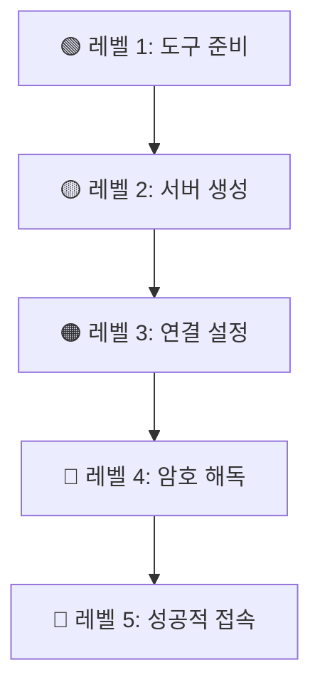

# 🌟 AWS 무료 윈도우 서버 설치 - 민수의 모험기

> *"복잡한 기술도 좋은 이야기로 만들면 누구나 이해할 수 있다"*

---

## 📖 Table of Contents

- [🎭 프롤로그: 민수의 고민](#prologue)
- [🎯 우리의 미션](#mission)
- [🎒 모험을 위한 준비물](#preparation)
- [🗺️ 모험의 여정 (5단계)](#journey)
  - [1️⃣ 마법의 도구 준비하기](#step-1)
  - [2️⃣ 클라우드 성에서 서버 만들기](#step-2)
  - [3️⃣ 비밀 열쇠와 지도 받기](#step-3)
  - [4️⃣ 마법의 암호 해독하기](#step-4)
  - [5️⃣ 서버 왕국으로 입성하기](#step-5)
- [🚨 위기 탈출 가이드](#troubleshooting)
- [💡 실전 활용 스토리](#real-stories)
- [📚 용어사전 (어려운 말 쉽게!)](#dictionary)

---

## 🎭 프롤로그: 민수의 고민 {#prologue}

### 📅 어느 월요일 아침...

```
☕ 회사 카페테리아

민수: "아... 큰일났다..."
동료: "왜? 무슨 일이야?"
민수: "이번 프로젝트에서 테스트해야 할 프로그램이 
      윈도우에서만 돌아간대. 근데 난 맥북만 있어..."
```

### 🤔 민수의 선택지들

| 방법 | 비용 | 시간 | 난이도 | 민수의 반응 |
|------|------|------|--------|-------------|
| 💻 윈도우 노트북 구매 | 100만원+ | 당일 | ⭐ | "돈이 없어..." |
| 🔄 맥에 윈도우 설치 | 15만원 | 반나절 | ⭐⭐⭐ | "복잡해..." |
| ☁️ AWS 클라우드 이용 | 무료! | 1시간 | ⭐⭐ | "이거다!" |

### 💡 민수의 깨달음

> *"아! 클라우드를 사용하면 되겠구나! 
> 마치 넷플릭스로 영화를 보듯이, 
> 컴퓨터도 빌려서 쓸 수 있다는 말이야!"*

---

## 🎯 우리의 미션 {#mission}

### 🏆 최종 목표
**"맥북에서 윈도우 프로그램을 자유자재로 사용하기!"**

### 📈 단계별 성취 목표



**예상 소요 시간**: 총 60분 (커피 한 잔 마시는 시간!)

---

## 🎒 모험을 위한 준비물 {#preparation}

### ✅ 필수 아이템 체크리스트

```
📋 모험가 체크리스트
┌─────────────────────────────────────┐
│ □ AWS 계정 (무료 회원가입)          │
│ □ 신용카드 또는 체크카드 (인증용)   │
│ □ 맥북 (macOS 10.12 이상)          │
│ □ 안정적인 와이파이 연결            │
│ □ 1시간의 여유 시간                 │
│ □ 호기심과 용기 💪                  │
└─────────────────────────────────────┘
```

### 💰 비용 걱정은 NO!

```
🎁 AWS 프리티어 혜택 (신규 가입 후 12개월)
├── 💻 서버 사용: 월 750시간 무료 (하루 24시간 가능!)
├── 💾 저장공간: 30GB 무료
├── 🌐 데이터 전송: 15GB 무료
└── 💡 TIP: 한 달에 24시간씩 31일 써도 무료!
```

---

## 🗺️ 모험의 여정 {#journey}

---

## 1️⃣ 마법의 도구 준비하기 {#step-1}

### 📚 스토리: 도구상 할아버지를 찾아서

> *민수는 원격으로 다른 컴퓨터에 접속할 수 있는 마법의 도구가 필요했습니다. 
> 마을의 현명한 도구상 할아버지(App Store)를 찾아갔죠...*

```
민수: "할아버지, 멀리 있는 윈도우 컴퓨터를 
      제 맥북에서 조작할 수 있는 도구가 있나요?"

할아버지: "호호, 그렇다면 'Microsoft Remote Desktop'이라는 
          마법의 거울이 필요하구나. 
          이 거울로 멀리 있는 컴퓨터를 들여다볼 수 있단다."
```

### 🛠️ 도구 설치 방법

#### 방법 A: App Store 이용 (추천! 초보자용)

**1단계: App Store 열기**
```
🔍 Spotlight 검색 (Cmd + Space)
→ "App Store" 입력
→ Enter 키 누르기
```

**2단계: 앱 검색하기**
```
App Store 상단 검색창에 입력:
"Microsoft Remote Desktop"
```

**3단계: 설치하기**
```
📱 앱 아이콘 확인:
- 이름: Microsoft Remote Desktop
- 개발자: Microsoft Corporation  
- 가격: 무료
- 평점: ⭐⭐⭐⭐ (4점 이상)

⬇️ "받기" 버튼 클릭!
```

#### 방법 B: 개발자 방법 (터미널 사용)

```bash
# Homebrew가 설치되어 있다면
brew install --cask microsoft-remote-desktop

# 설치 확인
ls /Applications/ | grep "Microsoft Remote Desktop"
```

### ✅ 설치 성공 확인

**앱을 실행해보세요!**

```
성공하면 이런 화면이 나타납니다:

┌─────────────────────────────────────┐
│ 🖥️ Microsoft Remote Desktop        │
├─────────────────────────────────────┤
│                                     │
│     📁 Add PC                       │
│     🏢 Add Workspace                │
│                                     │
│   "아직 연결된 PC가 없습니다"       │
│                                     │
└─────────────────────────────────────┘

👆 이 화면이 보이면 1단계 성공! 🎉
```

---

## 2️⃣ 클라우드 성에서 서버 만들기 {#step-2}

### 📚 스토리: AWS 클라우드 왕국으로의 여행

> *민수는 Amazon이 운영하는 거대한 클라우드 왕국에 도착했습니다. 
> 이 왕국에는 수백만 개의 가상 컴퓨터가 있고, 
> 그 중 하나를 빌려서 사용할 수 있답니다...*

```
🏰 AWS 클라우드 성 입구

경비병: "어서 오세요! 어떤 컴퓨터를 원하시나요?"
민수: "윈도우가 설치된 컴퓨터 하나 빌리고 싶어요."
경비병: "EC2 서비스로 안내해드리겠습니다!"
```

### 🌐 AWS 콘솔 접속하기

**1단계: 웹사이트 접속**
```
🔗 브라우저에서 접속:
https://console.aws.amazon.com

또는 구글에서 "AWS 콘솔" 검색
```

**2단계: 로그인**
```
📧 이메일 주소 입력
🔒 비밀번호 입력
🔐 "로그인" 클릭

💡 TIP: 계정이 없다면 "새 AWS 계정 생성" 클릭
```

**3단계: 지역 선택하기**
```
🌏 우측 상단에서 지역 확인
현재: "버지니아 북부" (기본값)
변경: "아시아 태평양(서울)" 선택

💡 왜 서울을 선택해야 할까요?
   가까운 곳일수록 인터넷 속도가 빨라요!
```

### 🖥️ EC2 서비스 찾기

**스토리 상황**: *민수가 성 안에서 컴퓨터 대여소를 찾고 있어요...*

```
🔍 상단 검색창 활용:
1. "서비스 검색" 클릭
2. "EC2" 타이핑
3. "EC2" 클릭 (Virtual Servers in the Cloud)

또는

📋 서비스 메뉴에서:
컴퓨팅 → EC2
```

### 🚀 인스턴스 생성 시작!

#### Scene 1: 생성 버튼 찾기

```
EC2 대시보드에서:
┌─────────────────────────────────────┐
│ 🎯 인스턴스 시작 (주황색 버튼)      │
└─────────────────────────────────────┘
👆 이 버튼을 클릭하세요!
```

#### Scene 2: 서버 이름 정하기

```
💭 민수의 고민:
"서버 이름을 뭐라고 지을까? 
내가 알아볼 수 있도록 간단하게..."

📝 추천 이름들:
- my-windows-test
- windows-dev-server  
- test-pc-2024

입력 예시: "my-first-windows"
```

#### Scene 3: 운영체제 선택 (가장 중요!)

```
🖼️ AMI(컴퓨터 템플릿) 선택 화면

📱 선택지들:
┌─────────────────────────────────────┐
│ 🐧 Amazon Linux 2023               │ ← 리눅스 (우리가 원하는 게 아님)
├─────────────────────────────────────┤
│ 🪟 Microsoft Windows Server 2022   │ ← 바로 이거! ✅
│    Base (프리 티어 사용 가능)       │
├─────────────────────────────────────┤
│ 🪟 Windows Server 2019 Base        │ ← 구버전
└─────────────────────────────────────┘

🎯 선택: "Microsoft Windows Server 2022 Base"
💡 "프리 티어 사용 가능" 표시 확인!
```

#### Scene 4: 컴퓨터 사양 선택

```
💻 인스턴스 타입 선택

민수의 고민:
"컴퓨터 성능을 어떻게 선택하지? 
게임용? 사무용? 서버용?"

📊 옵션들:
┌─────────────────────────────────────┐
│ t2.micro ✅                         │
│ - CPU: 1개                          │
│ - 메모리: 1GB                       │
│ - 용도: 가벼운 테스트               │
│ - 비용: 무료 (프리티어)             │
├─────────────────────────────────────┤
│ t2.small                            │  
│ - CPU: 1개                          │
│ - 메모리: 2GB                       │
│ - 비용: 유료 💰                     │
└─────────────────────────────────────┘

🎯 선택: t2.micro (무료니까!)
```

**성능이 부족하다면?**
```
💡 나중에 업그레이드 가능!
인스턴스 중지 → 타입 변경 → 재시작
마치 PC방에서 다른 자리로 옮기는 것처럼!
```

#### Scene 5: 보안 열쇠 만들기

```
🔐 키 페어 생성 스토리

민수: "서버에 어떻게 안전하게 접속하지?"
AWS: "특별한 열쇠를 만들어드릴게요!"

🏠 비유로 이해하기:
- 🔑 개인키(.pem): 내가 가진 열쇠
- 🔒 공개키: 서버에 설치된 자물쇠
- 🏠 서버: 내가 들어갈 집
```

**키 페어 설정하기:**

```
1️⃣ 키 페어 생성 클릭
2️⃣ 설정값 입력:
   - 이름: "my-windows-key" 
   - 타입: RSA (기본값)
   - 형식: .pem (기본값)
3️⃣ "키 페어 생성" 클릭

⬇️ 자동으로 파일 다운로드됨:
"my-windows-key.pem"

⚠️ 중요: 이 파일을 절대 잃어버리면 안 됩니다!
```

**파일 안전하게 보관하기:**
```bash
# 다운로드 폴더에서 안전한 곳으로 이동
mkdir ~/aws-keys
mv ~/Downloads/my-windows-key.pem ~/aws-keys/
chmod 400 ~/aws-keys/my-windows-key.pem
```

#### Scene 6: 방화벽 설정하기

```
🛡️ 보안 그룹 스토리

AWS: "서버 방문객을 어떻게 관리할까요?"
민수: "친구들만 들어올 수 있게 해주세요!"

🏰 성벽(방화벽) 설정:
- 어떤 문(포트)을 열 것인가?
- 누구에게 열어줄 것인가?
```

**설정 방법:**

```
1️⃣ "보안 그룹 생성" 선택
2️⃣ 기본 설정:
   - 그룹 이름: "windows-rdp-sg"
   - 설명: "Windows RDP access"

3️⃣ 인바운드 규칙 추가:
┌─────────────────────────────────────┐
│ 타입: RDP                           │
│ 포트: 3389 (자동 입력됨)            │
│ 소스: 내 IP (추천) 또는 0.0.0.0/0   │
└─────────────────────────────────────┘

💡 "내 IP"와 "0.0.0.0/0"의 차이:
   - 내 IP: 내 집에서만 접속 가능 (더 안전)
   - 0.0.0.0/0: 어디서든 접속 가능 (편리함)
```

#### Scene 7: 저장공간 설정

```
💾 하드디스크 선택 스토리

민수: "서버에 얼마나 큰 하드디스크가 필요할까?"
AWS: "용도에 따라 선택하세요!"

📦 옵션들:
┌─────────────────────────────────────┐
│ 범용 SSD (gp3) - 최신형 ✅          │
│ - 크기: 30GB (무료 한도)            │
│ - 속도: 빠름                        │
│ - 비용: 무료 (프리티어 범위 내)     │
└─────────────────────────────────────┘

🎯 선택: 30GB gp3 (기본 설정 그대로)
```

#### Scene 8: 최종 검토 및 발사!

```
🚀 발사 준비 완료!

┌─────────────────────────────────────┐
│ 📋 최종 확인 체크리스트             │
├─────────────────────────────────────┤
│ ✅ 이름: my-first-windows           │
│ ✅ OS: Windows Server 2022          │  
│ ✅ 타입: t2.micro (무료)            │
│ ✅ 키: my-windows-key.pem           │
│ ✅ 방화벽: RDP 허용                 │
│ ✅ 저장공간: 30GB                   │
└─────────────────────────────────────┘

🎯 "인스턴스 시작" 클릭!
```

### ⏳ 서버 생성 대기

```
🎬 서버 탄생 과정 (실시간)

⏰ 0분: "시작 중..." (pending)  
⏰ 1분: "부팅 중..." (running)
⏰ 2분: "시스템 검사 중..." (initializing)
⏰ 3분: "완료!" (2/2 checks passed) ✅

📱 상태 확인 방법:
EC2 대시보드 → 인스턴스 → 상태 확인
```

**성공 화면:**
```
┌─────────────────────────────────────┐
│ 🟢 my-first-windows                 │
│ 상태: running                       │
│ 상태 검사: 2/2 통과                 │
│ 퍼블릭 IP: 3.34.123.45             │
└─────────────────────────────────────┘

🎉 축하합니다! 서버 생성 완료!
```

---

## 3️⃣ 비밀 열쇠와 지도 받기 {#step-3}

### 📚 스토리: 보물 지도와 열쇠를 찾아서

> *민수의 서버가 완성되었습니다! 하지만 아직 들어갈 수 없어요. 
> 마치 집은 지었지만 열쇠와 주소를 받지 못한 상황과 같답니다. 
> 이제 서버 접속을 위한 마법의 지도(RDP 파일)를 받아야 해요...*

```
🏰 AWS 성의 열쇠 관리소

관리인: "서버가 준비되었습니다! 
        접속을 위한 지도와 열쇠를 드리겠어요."
민수: "어떻게 받나요?"
관리인: "연결 버튼을 누르시면 모든 것을 드려요!"
```

### 🗺️ 접속 지도 받기 (RDP 파일)

#### 1단계: 서버 선택하기

```
EC2 대시보드에서:
1️⃣ 왼쪽 메뉴: "인스턴스" 클릭
2️⃣ 목록에서: "my-first-windows" 체크박스 선택
3️⃣ 상태 확인: "running" (초록불) ✅
```

#### 2단계: 연결 마법사 실행

```
🔌 "연결" 버튼 클릭 (상단 오른쪽)

그러면 이런 창이 나타납니다:
┌─────────────────────────────────────┐
│ 📱 연결 방법 선택                   │
├─────────────────────────────────────┤
│ 🐧 SSH 클라이언트 (리눅스용)        │
│ 🪟 RDP 클라이언트 (윈도우용) ✅     │
│ 🌐 EC2 Instance Connect             │
│ 📱 Session Manager                  │
└─────────────────────────────────────┘

🎯 "RDP 클라이언트" 탭 클릭!
```

#### 3단계: 지도 다운로드

```
RDP 클라이언트 화면:
┌─────────────────────────────────────┐
│ 📋 연결 정보                        │
├─────────────────────────────────────┤
│ 🌐 퍼블릭 DNS:                      │
│ ec2-3-34-123-45.ap-northeast-2...   │
│                                     │
│ 👤 사용자 이름: Administrator       │
│                                     │
│ 📁 원격 데스크톱 파일 다운로드      │
│ [    다운로드 버튼    ] ⬇️         │
└─────────────────────────────────────┘

🎯 "원격 데스크톱 파일 다운로드" 클릭!
```

### 📁 다운로드된 파일 확인

```
다운로드 폴더에 생성된 파일:
📄 my-first-windows.rdp

💡 이 파일에는 다음 정보가 들어있어요:
- 서버 주소 (어디로 갈지)
- 접속 방법 (어떻게 갈지)  
- 화면 설정 (얼마나 크게 볼지)
```

**파일 내용 살짝 엿보기:**
```
full address:s:ec2-3-34-123-45.ap-northeast-2.compute.amazonaws.com:3389
username:s:Administrator
screen mode id:i:2
desktopwidth:i:1024
desktopheight:i:768
```

---

## 4️⃣ 마법의 암호 해독하기 {#step-4}

### 📚 스토리: 봉인된 비밀번호의 수수께끼

> *민수는 서버 접속 지도를 받았지만, 마지막 퍼즐이 남았습니다. 
> 서버의 관리자 비밀번호가 암호화되어 있었거든요! 
> 이 암호는 오직 개인키(.pem 파일)로만 해독할 수 있답니다...*

```
🔮 암호 해독 연구소

연구원: "비밀번호가 마법으로 봉인되어 있습니다!"
민수: "어떻게 풀죠?"
연구원: "당신이 가진 .pem 파일이 해독 열쇠예요!"
```

### 🔐 비밀번호 해독 과정

#### 1단계: 해독 마법사 실행

```
RDP 클라이언트 화면에서 (이전 단계와 동일):
┌─────────────────────────────────────┐
│ 🔑 비밀번호 가져오기                │
│ [   비밀번호 해독 버튼   ] 🔓      │
└─────────────────────────────────────┘

🎯 "비밀번호 가져오기" 클릭!
```

#### 2단계: 해독 열쇠 업로드

```
🔑 키 파일 업로드 화면:
┌─────────────────────────────────────┐
│ 📁 프라이빗 키 파일 업로드          │
├─────────────────────────────────────┤
│ [  파일 선택  ] 📎                  │
│                                     │
│ 지원 형식: .pem                     │
│ 파일명: my-windows-key.pem          │
└─────────────────────────────────────┘

📂 "파일 선택" 클릭 → .pem 파일 선택
```

**파일 찾기 팁:**
```
🔍 .pem 파일 위치:
- 기본: ~/Downloads/my-windows-key.pem
- 이동했다면: ~/aws-keys/my-windows-key.pem

💡 찾을 수 없다면?
Finder에서 "my-windows-key" 검색
```

#### 3단계: 마법의 해독 주문

```
.pem 파일 선택 후:
┌─────────────────────────────────────┐
│ 🔮 해독 중...                       │
│ [    비밀번호 해독    ] ✨          │
└─────────────────────────────────────┘

🎯 "비밀번호 해독" 클릭!
```

### 🎉 해독 성공!

```
✨ 마법이 풀렸습니다!

┌─────────────────────────────────────┐
│ 🎊 비밀번호 해독 완료               │
├─────────────────────────────────────┤
│ 👤 사용자 이름: Administrator       │
│ 🔒 비밀번호: K7n8M9pQ2rS5tU6v!      │
│                                     │
│ ⚠️  이 비밀번호를 안전한 곳에 복사   │
│     해두세요!                       │
└─────────────────────────────────────┘

📋 복사 버튼 클릭하여 클립보드에 저장
```

### 💾 비밀번호 안전하게 보관하기

**방법 1: 메모장에 저장**
```
📝 메모 앱에 기록:
===================
AWS 윈도우 서버 정보
===================
서버명: my-first-windows
주소: ec2-3-34-123-45.ap-northeast-2.compute.amazonaws.com
사용자: Administrator
비밀번호: K7n8M9pQ2rS5tU6v!
생성일: 2024-01-15
```

**방법 2: 키체인에 저장 (더 안전)**
```
🔐 키체인 접근에 저장:
1️⃣ 키체인 접근 앱 실행
2️⃣ 파일 → 새로운 비밀번호 항목
3️⃣ 정보 입력:
   - 키체인 항목 이름: AWS Windows Server
   - 계정: Administrator  
   - 비밀번호: [복사한 비밀번호]
```

---

## 5️⃣ 서버 왕국으로 입성하기 {#step-5}

### 📚 스토리: 드디어 성문이 열리다!

> *모든 준비가 끝났습니다! 민수는 이제 마법의 거울(Remote Desktop)을 통해 
> 저 멀리 클라우드 왕국에 있는 자신만의 윈도우 서버로 들어갈 수 있어요. 
> 과연 어떤 모험이 기다리고 있을까요?*

```
🏰 클라우드 성 정문 앞

민수: "드디어 내 서버에 들어갈 시간이야!"
경비병: "통행증과 비밀번호를 확인하겠습니다."
민수: "여기 있어요!" (.rdp 파일과 비밀번호)
```

### 🚪 첫 번째 연결 시도

#### 1단계: RDP 파일 실행

```
📁 다운로드 폴더에서:
my-first-windows.rdp 파일을 더블클릭! 🖱️

그러면...
```

**예상 화면 1: 보안 경고**
```
⚠️ 보안 경고창:
┌─────────────────────────────────────┐
│ ⚠️  보안 경고                      │
├─────────────────────────────────────┤
│ 원격 연결의 게시자를 확인할 수      │
│ 없습니다. 연결하시겠습니까?         │
│                                     │
│ 게시자: 알 수 없음                  │
│ 인증서: 자체 서명됨                 │
│                                     │
│ [취소]  [연결] ✅                   │
└─────────────────────────────────────┘

🎯 "연결" 클릭! (우리가 만든 서버니까 안전해요)
```

#### 2단계: 로그인 창 등장

```
🔐 Windows 보안 로그인창:
┌─────────────────────────────────────┐
│ 🪟 Windows 보안                     │
├─────────────────────────────────────┤
│ 👤 사용자 이름:                     │
│ [Administrator                    ] │
│                                     │
│ 🔒 비밀번호:                        │
│ [************************        ] │
│                                     │
│ □ 계정 정보 저장 (체크 추천)        │
│                                     │
│ [취소]           [확인] ✅          │
└─────────────────────────────────────┘

📝 입력 정보:
- 사용자 이름: Administrator (이미 입력됨)
- 비밀번호: [4단계에서 복사한 비밀번호 붙여넣기]
```

**붙여넣기 팁:**
```
🖱️ 비밀번호 입력 방법:
1. 비밀번호 칸 클릭
2. Cmd + V (붙여넣기)
3. 또는 우클릭 → 붙여넣기

💡 보안상 비밀번호는 *** 로 표시됩니다
```

#### 3단계: 연결 진행 과정

```
🔄 연결 중...

⏰ 연결 단계별 메시지:
1️⃣ "원격 컴퓨터에 연결하는 중..."
2️⃣ "보안 설정을 구성하는 중..."  
3️⃣ "원격 연결을 설정하는 중..."
4️⃣ "화면을 준비하는 중..."

💭 민수: "드디어 들어갈 수 있을까?"
```

### 🎊 성공! 윈도우 서버 바탕화면 등장

```
🌟 연결 성공 화면:

┌─────────────────────────────────────┐
│ 🪟 Windows Server 2022              │
├─────────────────────────────────────┤
│                                     │
│  🗂️  바탕화면 (파란색 배경)         │
│                                     │
│  📊 Server Manager (자동 실행)      │
│  🔧 관리 도구들                     │
│  🌐 Internet Explorer              │
│                                     │
│  하단: [시작] [작업표시줄] [시간]   │
└─────────────────────────────────────┘

🎉 축하합니다! 당신만의 윈도우 서버에 접속했어요!
```

### 🎮 첫 번째 서버 탐험

#### 탐험 1: 바탕화면 둘러보기

```
🖱️ 할 수 있는 것들:
- 📁 파일 탐색기 열기
- 🌐 인터넷 익스플로러 실행  
- ⚙️ 제어판 접속
- 💾 파일 업로드/다운로드
- 📋 복사/붙여넣기 (로컬 ↔ 서버)
```

#### 탐험 2: 성능 확인해보기

```
💻 작업 관리자 실행 (Ctrl + Shift + Esc):

📊 시스템 정보:
- CPU: Intel Xeon 1 vCPU
- 메모리: 1.0GB (약 700MB 사용 가능)  
- 저장공간: 30GB
- 네트워크: 고속 인터넷 연결 ✅
```

#### 탐험 3: 인터넷 연결 테스트

```
🌐 Internet Explorer 실행:
1️⃣ 작업표시줄에서 IE 아이콘 클릭
2️⃣ google.com 접속 테스트
3️⃣ 한국 사이트 접속 테스트 (네이버, 다음 등)

✅ 모든 사이트가 잘 열리면 성공!
```

### 🔧 개인화 설정

#### 설정 1: 시간대 변경

```
🕐 한국 시간으로 맞추기:
1️⃣ 우측 하단 시간 클릭
2️⃣ "날짜 및 시간 설정 변경" 클릭  
3️⃣ 시간대: "UTC+09:00 서울" 선택
4️⃣ "확인" 클릭
```

#### 설정 2: 화면 해상도 조정

```
🖥️ 해상도 최적화:
1️⃣ 바탕화면 우클릭
2️⃣ "디스플레이 설정" 선택
3️⃣ 해상도: 1920x1080 (권장)
4️⃣ "변경 내용 유지" 클릭
```

---

## 🚨 위기 탈출 가이드 {#troubleshooting}

### 😱 상황 1: "연결할 수 없습니다"

#### 🔍 탐정 민수의 수사 과정

```
🕵️ 문제 해결 체크리스트:

1️⃣ 인스턴스 상태 확인
   └── EC2 대시보드 → 상태: "running"인가? ✅

2️⃣ 보안 그룹 점검  
   └── RDP 포트(3389) 열려있나? ✅

3️⃣ 인터넷 연결 확인
   └── 다른 사이트는 잘 되나? ✅

4️⃣ 방화벽 점검
   └── 맥 방화벽이 차단하고 있나? 🤔
```

#### 💡 해결 방법들

**방법 1: 인스턴스 재시작**
```
🔄 EC2에서 서버 재부팅:
1️⃣ 인스턴스 선택
2️⃣ 작업 → 인스턴스 상태 → 재부팅
3️⃣ 2-3분 대기 후 재연결 시도
```

**방법 2: 보안 그룹 재설정**
```
🛡️ 방화벽 다시 열기:
1️⃣ EC2 → 보안 그룹 
2️⃣ 인바운드 규칙 편집
3️⃣ RDP 규칙 삭제 후 다시 추가
4️⃣ 소스: 0.0.0.0/0 (임시로)
```

**방법 3: 맥 방화벽 확인**
```
🔥 맥 방화벽 설정:
1️⃣ 시스템 환경설정
2️⃣ 보안 및 개인 정보 보호
3️⃣ 방화벽 → 방화벽 옵션
4️⃣ Microsoft Remote Desktop 허용
```

### 😅 상황 2: "비밀번호가 틀렸습니다"

#### 🔐 비밀번호 미스터리 해결

```
🕵️‍♀️ 가능한 원인들:

❌ 복사할 때 공백이 포함됨
❌ 대소문자를 잘못 입력함  
❌ 특수문자가 다르게 인식됨
❌ 한글/영문 입력 모드 문제
```

#### 💡 단계별 해결법

**1단계: 비밀번호 다시 받기**
```
🔄 AWS에서 새로 해독:
1️⃣ EC2 → 연결 → RDP 클라이언트
2️⃣ 비밀번호 가져오기 → .pem 파일 업로드
3️⃣ 새 비밀번호 복사
```

**2단계: 안전한 입력 방법**
```
📝 메모장 활용법:
1️⃣ 텍스트 편집기에 비밀번호 붙여넣기
2️⃣ 앞뒤 공백 제거
3️⃣ 문자 하나씩 확인
4️⃣ 다시 복사해서 입력
```

**3단계: 수동 입력 시도**
```
⌨️ 직접 타이핑:
- 복사/붙여넣기 대신 직접 입력
- 대소문자 주의깊게 확인
- 특수문자 정확히 입력
```

### 😰 상황 3: "연결은 되는데 화면이 이상해요"

#### 🖥️ 화면 문제 해결사

```
🎨 화면 관련 문제들:

문제: 화면이 너무 작아요
해결: RDP 파일 설정 수정

문제: 색깔이 이상해요  
해결: 색상 품질 조정

문제: 글씨가 흐려요
해결: 해상도 최적화
```

#### 💡 RDP 파일 커스터마이징

```
📝 .rdp 파일 편집하기:

1️⃣ my-first-windows.rdp 파일을 텍스트 에디터로 열기

2️⃣ 다음 설정 수정:
# 화면 크기
desktopwidth:i:1920
desktopheight:i:1080

# 전체화면 모드  
screen mode id:i:2

# 색상 품질 (32비트)
session bpp:i:32

# 오디오
audiocapturemode:i:1

3️⃣ 파일 저장 후 다시 연결
```

---

## 💡 실전 활용 스토리 {#real-stories}

### 🎯 스토리 1: 웹 개발자 지민이의 모험

#### 배경
```
👩‍💻 지민이의 상황:
- 직업: 프론트엔드 개발자 (맥북 사용)
- 문제: IE 11에서만 발생하는 버그 수정 필요
- 해결: AWS 윈도우 서버로 IE 테스트 환경 구축
```

#### 해결 과정
```
1️⃣ 서버 접속 후 IE 11 실행
2️⃣ 개발 도구 (F12) 열기
3️⃣ 로컬 코드를 서버로 업로드
4️⃣ 버그 재현 및 수정
5️⃣ 크로스 브라우저 테스트 완료
```

#### 지민이의 팁
```
💡 "원격 데스크톱에서도 개발자 도구가 완벽하게 작동해요! 
    맥에서 IE 테스트를 위해 윈도우 컴퓨터를 살 필요가 없어졌어요."
```

### 🎯 스토리 2: 디자이너 현우의 활용법

#### 배경
```
🎨 현우의 상황:  
- 직업: UI/UX 디자이너
- 문제: 윈도우용 프로토타이핑 도구 사용 필요
- 해결: 클라우드에서 윈도우 디자인 환경 구축
```

#### 활용 방법
```
1️⃣ Adobe XD Windows 버전 설치
2️⃣ 윈도우 전용 UI 키트 다운로드  
3️⃣ 프로토타입 제작 및 테스트
4️⃣ 완성된 파일을 클라우드 드라이브로 동기화
```

### 🎯 스토리 3: 게임 개발자 수진이의 케이스

#### 배경
```
🎮 수진이의 상황:
- 직업: 인디 게임 개발자
- 문제: Unity Windows 빌드 테스트 필요
- 해결: 고성능 AWS 인스턴스로 게임 테스트 환경 구축
```

#### 고급 설정
```
⚡ 고성능 인스턴스 사용:
1️⃣ t2.micro → c5.large 업그레이드
2️⃣ GPU 가속 활성화
3️⃣ DirectX 성능 테스트
4️⃣ 프레임레이트 최적화
```

#### 비용 절약 팁
```
💰 수진이의 절약법:
"테스트할 때만 서버를 켜고, 
 끝나면 바로 중지시켜요. 
 월 50달러 → 15달러로 절약 성공!"
```

---

## 📚 용어사전 (어려운 말 쉽게!) {#dictionary}

### ☁️ 클라우드 기본 용어

#### AWS (Amazon Web Services)
```
🏪 쉬운 설명: 아마존이 운영하는 거대한 컴퓨터 대여점
🏠 집에서 비유: 렌탈샵 (필요할 때만 빌려서 사용)
💡 왜 사용하나요: 컴퓨터를 사지 않고도 필요할 때만 사용 가능
```

#### EC2 (Elastic Compute Cloud)
```  
🖥️ 쉬운 설명: 가상의 컴퓨터를 빌려주는 서비스
🎮 게임으로 비유: 마인크래프트 서버 같은 것
💡 특징: 언제든지 성능을 높이거나 낮출 수 있음
```

#### 인스턴스 (Instance)
```
💻 쉬운 설명: 실제로 빌린 가상 컴퓨터 한 대
🏠 PC방으로 비유: 내가 앉은 PC방 자리 번호
💡 상태: running(사용중), stopped(꺼짐), terminated(삭제됨)
```

#### AMI (Amazon Machine Image)
```
💾 쉬운 설명: 운영체제와 프로그램이 미리 설치된 컴퓨터 템플릿
🍕 요리로 비유: 피자 도우 (토핑을 올리기 전 기본 상태)
💡 종류: Windows, Linux, Ubuntu 등
```

#### 프리티어 (Free Tier)
```
🎁 쉬운 설명: 신규 가입자를 위한 12개월 무료 체험 혜택
🎪 놀이공원으로 비유: 신규 회원 무료 이용권
💡 한도: 월 750시간 (하루 24시간씩 사용 가능)
```

### 🔒 보안 관련 용어

#### 키 페어 (Key Pair)
```
🔑 쉬운 설명: 서버 접속용 디지털 열쇠 세트
🏠 집으로 비유: 현관문 열쇠 (원본 + 복사본)
💡 구성: 개인키(.pem) + 공개키(서버에 설치)
```

#### PEM 파일
```
📄 쉬운 설명: 개인키가 저장된 암호화 파일
💍 보석으로 비유: 금고 열쇠 (절대 잃어버리면 안 됨!)
💡 확장자: .pem (Privacy Enhanced Mail)
```

#### 보안 그룹 (Security Group)
```
🛡️ 쉬운 설명: 서버를 보호하는 가상 방화벽
🏰 성으로 비유: 성벽과 성문 (누가 들어올지 결정)
💡 역할: 특정 포트를 열거나 닫아서 접근 제어
```

#### 포트 (Port)
```
🚪 쉬운 설명: 서버로 들어가는 각각의 문
🏢 건물로 비유: 1층은 웹서버, 2층은 이메일서버...
💡 RDP 포트: 3389번 (윈도우 원격 데스크톱용)
```

### 🖥️ 원격 접속 용어

#### RDP (Remote Desktop Protocol)
```
📱 쉬운 설명: 윈도우 컴퓨터를 원격으로 조작하는 기술
📞 화상통화로 비유: 컴퓨터 화면을 보면서 조작하는 화상통화
💡 포트: 3389번 사용
```

#### RDP 파일
```
📋 쉬운 설명: 원격 접속 정보가 저장된 설정 파일
📞 연락처로 비유: 전화번호와 이름이 저장된 주소록
💡 포함 정보: 서버 주소, 사용자명, 화면 설정 등
```

#### Administrator
```
👑 쉬운 설명: 윈도우의 최고 관리자 계정
🏰 왕국으로 비유: 모든 권한을 가진 왕
💡 권한: 프로그램 설치, 시스템 설정 변경 등 모든 것 가능
```

### 🔧 기술 용어

#### vCPU (Virtual CPU)
```
🧠 쉬운 설명: 가상 컴퓨터의 두뇌 (처리 능력)
👨‍🍳 요리로 비유: 주방의 요리사 수 (많을수록 빨리 요리)
💡 t2.micro: 1 vCPU (요리사 1명)
```

#### 메모리 (Memory/RAM)
```
🧠 쉬운 설명: 컴퓨터가 작업할 때 쓰는 임시 작업 공간
🍳 요리로 비유: 요리할 때 사용하는 도마 (클수록 여러 요리 동시에)
💡 t2.micro: 1GB (작은 도마 하나)
```

#### 스토리지 (Storage)
```
📦 쉬운 설명: 파일을 저장하는 하드디스크
❄️ 냉장고로 비유: 음식을 보관하는 냉장고
💡 종류: gp3(빠른 SSD), gp2(일반 SSD)
```

#### 대역폭 (Bandwidth)
```
🛣️ 쉬운 설명: 인터넷 데이터가 오가는 도로의 넓이
🚗 교통으로 비유: 도로 차선 수 (많을수록 빠른 인터넷)
💡 단위: Mbps (초당 메가비트)
```

### 💰 비용 관련 용어

#### 온디맨드 (On-Demand)
```
🏪 쉬운 설명: 사용한 만큼만 비용을 지불하는 방식
🚕 택시로 비유: 타는 시간만큼만 요금 지불
💡 특징: 언제든 시작/중지 가능, 시간당 과금
```

#### 스팟 인스턴스 (Spot Instance)
```
✈️ 쉬운 설명: 할인된 가격에 여분의 컴퓨터를 사용하는 방식
🎫 항공료로 비유: 빈 좌석을 저렴하게 파는 특가 항공료
💡 주의: 수요가 많아지면 갑자기 중단될 수 있음
```

#### 예약 인스턴스 (Reserved Instance)
```
🏠 쉬운 설명: 1-3년 계약으로 할인받는 방식  
📱 휴대폰으로 비유: 2년 약정으로 휴대폰 할인받기
💡 할인율: 최대 72% 할인 가능
```

---

## 🎓 졸업식: 당신은 이제 클라우드 마스터!

### 🏆 수료증

```
🎉 축하합니다! 🎉

┌─────────────────────────────────────┐
│        AWS 윈도우 서버 마스터       │
│         수료증                      │
├─────────────────────────────────────┤
│                                     │
│  이 수료증은 다음을 증명합니다:     │
│                                     │
│  ✅ AWS 계정 생성 및 관리          │
│  ✅ EC2 윈도우 서버 생성           │
│  ✅ 보안 설정 및 키 관리           │
│  ✅ 원격 데스크톱 연결             │
│  ✅ 문제 해결 능력                 │
│                                     │
│  발급일: 2024년 1월                │
│  서명: AI 튜터 💻                  │
└─────────────────────────────────────┘
```

### 🚀 다음 모험을 위한 추천 과정

#### 🟢 초급 과정 (완료했어요!)
- [x] AWS 윈도우 서버 생성
- [x] 기본 연결 및 사용법
- [x] 문제 해결

#### 🟡 중급 과정 (도전해보세요!)
```
📚 추천 학습 목록:
1️⃣ 서버 성능 최적화
   - 인스턴스 타입 업그레이드
   - 스토리지 성능 향상
   
2️⃣ 보안 강화
   - VPC 네트워크 설정
   - IAM 사용자 관리
   
3️⃣ 자동화 구축  
   - CloudWatch 모니터링
   - 자동 백업 설정
```

#### 🔴 고급 과정 (전문가의 길!)
```  
🎯 마스터 레벨:
1️⃣ 로드 밸런서 구축
2️⃣ Auto Scaling 설정
3️⃣ Docker 컨테이너 활용
4️⃣ CI/CD 파이프라인 구축
```

### 💬 마지막 메시지

```
🌟 민수의 성공 이야기

"처음에는 무서웠지만, 차근차근 따라하니 
 정말 쉬웠어요! 이제 맥북에서도 윈도우 
 프로그램을 자유자재로 사용할 수 있게 되었어요.

 여러분도 할 수 있습니다! 
 클라우드의 무한한 가능성을 탐험해보세요!"

                    - 개발자 민수 👨‍💻
```

### 🤝 도움이 필요할 때

```
🆘 추가 도움말:
├── 📖 AWS 공식 문서: docs.aws.amazon.com
├── 💬 AWS 한국 커뮤니티: 페이스북 그룹 검색
├── 📺 YouTube: "AWS 한글 튜토리얼"
└── 📚 온라인 강의: 생활코딩, 인프런 등
```

---

**🎊 다시 한번 축하드립니다! 이제 당신도 클라우드 네이티브 개발자입니다! 🎊**

---

*"가장 복잡한 여행도 첫 번째 발걸음부터 시작됩니다." - 노자*

**📝 작성 완료일**: 2024년 1월  
**✍️ 스토리텔러**: AI 튜터  
**🏷️ 태그**: #AWS #WindowsServer #초보자가이드 #스토리텔링 #파인만기법

## 🧠 Connected Insights

> 📅 Last analyzed: 2025. 12. 20. 오후 11:40:33
> 💰 Analysis cost: $0.0220

### 🔗 Related Notes

- 🔗 [[R - Resources/AI 및 개발/개발 도구 가이드/기타 개발 도구/무료_홈페이지_제작_AWS_배포_완벽_가이드.md]]
  - related: 둘 다 AWS 무료 티어(프리티어)를 활용한 초보자 가이드로, 서버/배포 설정을 다룸. 이 노트는 EC2 Windows 서버 설치, 다른 노트는 S3 정적 홈페이지 배포로 AWS 인프라 활용을 상호 보완적으로 확장.
  - Confidence: ████░ (85%)

- 🔗 [[P - Projects/Teacher_Observation_Record/(VSCode)교사 관찰 기록 생성기 설치 및 실행 가이드.md]]
  - related: 둘 다 스토리텔링(캐릭터 이야기)과 단계별 설치 가이드를 사용한 초보자 친화적 형식. VSCode 확장 설치가 로컬 개발 도구라면, 이 노트는 클라우드 서버 설치로 개발 환경 확장을 지원.
  - Confidence: ███░░ (65%)

- 🔗 [[R - Resources/AI 및 개발/개발 도구 가이드/MCP 시스템/Google_Search_Console_MCP_Server_초보자_가이드_Part2.md]]
  - related: 클라우드 플랫폼(GCP vs AWS) 설정 가이드로 유사한 초보자 스토리텔링과 단계별 진행(프로젝트 생성, 인증). AWS EC2 설정을 GCP 경험으로 확장 가능.
  - Confidence: ████░ (70%)

- ✅ [[R - Resources/AI 및 개발/개발 도구 가이드/초보_개발자를_위한_AI_시대_코딩_학습_완벽_가이드.md]]
  - supports: 초보 개발자 학습 가이드로, 이 노트의 AWS 서버 설치가 실전 프로젝트 환경 구축을 지원. 비유(커피숍 등)와 로드맵이 학습 흐름을 보강.
  - Confidence: ███░░ (60%)

- 🔗 [[R - Resources/AI 및 개발/개발 도구 가이드/SuperClaude Framework/SuperClaude_Framework_설치_가이드_입문자용.md]]
  - related: 프레임워크 설치 가이드로 공통된 초보자 대상 단계별 설치/트러블슈팅 패턴. AWS 서버를 SuperClaude 같은 도구 테스트 환경으로 활용 가능.
  - Confidence: ███░░ (55%)

### 📚 Knowledge Gaps

- 🔴 **AWS EC2 인스턴스 종료 및 비용 관리**
  - 무료 티어 초과 시 비용 발생 위험이 크며, 서버 중지/삭제 방법과 Billing Dashboard 모니터링이 언급되지 않아 초보자가 과금 트랩에 빠질 수 있음.
  - Suggested resources: AWS Free Tier Usage Alerts 공식 문서, AWS Cost Explorer 튜토리얼 (YouTube: 'AWS Billing Alarm Setup')

- 🔴 **Windows 서버 보안 그룹 및 RDP 포트 보안 설정**
  - RDP 연결 시 포트 3389 개방이 기본적이지만, IP 제한이나 키 페어(SSH 대안) 보안이 부족해 취약점 노출 위험이 있음. 실전 활용에서 필수.
  - Suggested resources: AWS EC2 Security Groups Best Practices, Microsoft RDP Security Guidelines

- 🟡 **서버 접속 후 Windows 업데이트 및 소프트웨어 설치 가이드**
  - 접속 성공 후 실제 프로그램 테스트/업데이트 과정이 생략되어, '윈도우 프로그램 테스트' 미션 완성도가 떨어짐.
  - Suggested resources: AWS Windows AMI Management Guide, Chocolatey 패키지 매니저 설치 튜토리얼

- 🟡 **Linux EC2 인스턴스 대안 및 비교**
  - Windows 전용 가이드지만, 무료 티어에서 Linux가 더 유연하고 비용 효율적일 수 있음. Mac 사용자에게 크로스플랫폼 옵션 제시 필요.
  - Suggested resources: AWS EC2 t2.micro Linux vs Windows 비교, Ubuntu on AWS Quickstart

### 💡 AI Insights

이 노트는 스토리텔링(민수 모험기), 테이블, Mermaid 다이어그램, 체크리스트를 활용한 초보자 최적화 가이드로 AWS EC2 Windows 서버 접근성을 높임. 관련 노트들과 결합 시 AWS 생태계(EC2+S3)와 클라우드 개발 워크플로우를 포괄하는 지식 네트워크 형성 가능하나, 보안/비용 관리 갭 보완 시 완벽한 실전 매뉴얼이 됨.
