# Claude Code Docker Container에서 사용하는 방법

## 📋 목차
1. [[#개요]]
2. [[#핵심 개념]]
3. [[#사전 준비 사항]]
4. [[#DevContainer 구성 방법]]
5. [[#Claude Code 설치 및 설정]]
6. [[#Dangerously Skip Permissions 모드]]
7. [[#실제 사용 예시]]
8. [[#장단점 분석]]
9. [[#실무 적용점]]

## 개요

이 가이드는 Docker Container 환경에서 Claude Code를 사용하는 방법을 설명합니다. 특히 **Dangerously Skip Permissions** 모드를 활용하여 격리된 환경에서 자동화된 코딩 작업을 수행하는 방법을 다룹니다.

### 핵심 요약
- **목적**: Docker Container 내에서 Claude Code 실행
- **주요 기능**: 권한 요청 없이 자동 실행 가능
- **활용 시나리오**: 라이브 코딩, 자동화 작업, 테스트 환경

## 핵심 개념

### Dangerously Skip Permissions 모드란?
Claude Code에서 도구나 명령어 실행 시 사용자 허락 없이 자동으로 실행할 수 있는 모드입니다.

#### 작동 원리
- 일반 모드: 모든 작업에 대해 사용자 승인 필요
- Skip Permissions 모드: 자동으로 명령어 실행
- **권장 환경**: Docker Container와 같은 격리된 환경

### 보안 고려사항
- ✅ **Container 내부**: 격리된 환경으로 안전
- ❌ **Host 시스템**: 보안 위험으로 권장하지 않음
- 🔒 **접근 제한**: Container 외부 파일 시스템 접근 불가

## 사전 준비 사항

### 필수 설치 항목
| 도구 | 용도 | 설치 방법 |
|------|------|-----------|
| Docker Desktop | Container 실행 환경 | [공식 사이트](https://www.docker.com/products/docker-desktop) |
| VS Code | 개발 IDE | [공식 사이트](https://code.visualstudio.com/) |
| Dev Containers Extension | VS Code 확장 프로그램 | VS Code 마켓플레이스 |
| Claude Code CLI | AI 코딩 도구 | 공식 설치 가이드 참조 |

### 시스템 요구사항
- **OS**: Windows, macOS, Linux
- **RAM**: 최소 8GB (16GB 권장)
- **디스크**: 10GB 이상 여유 공간

## DevContainer 구성 방법

### 1. DevContainer 파일 구조
```
.devcontainer/
├── devcontainer.json    # Container 설정
├── Dockerfile           # Docker 이미지 정의
└── init.sh             # 초기화 스크립트
```

### 2. Claude Code GitHub 저장소 활용
```bash
# Claude Code 공식 저장소 클론
git clone https://github.com/anthropics/claude-code.git

# DevContainer 디렉토리 확인
cd claude-code/.devcontainer
```

### 3. VS Code에서 Container 실행
1. VS Code에서 프로젝트 열기
2. Command Palette (Cmd/Ctrl + Shift + P)
3. "Dev Containers: Reopen in Container" 선택
4. Container 빌드 및 실행 대기

## Claude Code 설치 및 설정

### Container 내부 접속
```bash
# Container ID 확인
docker ps

# Container 접속
docker exec -it [container-id] /bin/bash
```

### Claude Code 로그인
```bash
# Claude 로그인 명령어
claude login

# 브라우저에서 제공된 URL 접속
# 인증 코드 복사 후 터미널에 입력
```

## Dangerously Skip Permissions 모드

### 모드 진입 방법
```bash
# Skip Permissions 모드로 Claude 실행
claude --dangerously-skip-permissions

# 또는 환경 변수 설정
export CLAUDE_DANGEROUSLY_SKIP_PERMISSIONS=true
```

### 사용 가능한 모드들
1. **Default Mode**: 모든 작업에 허가 필요
2. **Auto-accept Mode**: 자동 승인 (일부 제한)
3. **Plan Mode**: 계획 수립 후 실행
4. **Bypassing Permissions**: 완전 자동 실행

### 모드 전환 방법
- **Shift + Tab**: 모드 순환 전환
- 현재 모드는 프롬프트 우측 하단에 표시

## 실제 사용 예시

### 예제 1: 자동 스크립트 생성
```python
# Claude에게 요청
"Cowsay 스크립트 하나 작성해 줘"

# 자동으로 생성된 cowsay.py
#!/usr/bin/env python3
def cowsay(message):
    cow = f"""
    {message}
    \\   ^__^
     \\  (oo)\\_______
        (__)\\       )\\/\\
            ||----w |
            ||     ||
    """
    print(cow)

if __name__ == "__main__":
    cowsay("안녕!")
```

### 예제 2: 파일 시스템 격리 확인
```bash
# Container 내부에서
claude "사용자 홈 디렉토리에 접근할 수 있나?"
# 결과: 접근 불가

# Host 시스템에서
claude "사용자 홈 디렉토리에 접근할 수 있나?"
# 결과: 접근 가능
```

## 장단점 분석

### 장점
- ✅ **빠른 개발**: 승인 없이 즉시 실행
- ✅ **자동화 용이**: CI/CD 파이프라인 통합 가능
- ✅ **격리된 환경**: 안전한 실험 공간
- ✅ **라이브 코딩**: 실시간 데모에 최적

### 단점
- ❌ **보안 위험**: Host 시스템에서는 위험
- ❌ **제어 상실**: 예상치 못한 동작 가능
- ❌ **리소스 사용**: Container 오버헤드
- ❌ **디버깅 어려움**: 자동 실행으로 인한 추적 어려움

## 실무 적용점

### 적합한 사용 사례
1. **프로토타이핑**: 빠른 아이디어 구현
2. **교육/데모**: 라이브 코딩 시연
3. **테스트 환경**: 자동화된 테스트 실행
4. **CI/CD**: 빌드 및 배포 자동화

### 권장 워크플로우

```mermaid
graph LR
    A[로컬 개발] --> B[Container 테스트]
    B --> C[Skip Permissions 모드]
    C --> D[자동화 실행]
    D --> E[결과 검증]
```


### 보안 Best Practices
1. **Production 금지**: 프로덕션 환경 사용 금지
2. **Volume 제한**: 필요한 디렉토리만 마운트
3. **네트워크 격리**: 외부 네트워크 접근 제한
4. **정기 정리**: 사용 후 Container 삭제

## 구현 체크리스트
- [x] Docker Desktop 설치
- [x] VS Code Dev Containers 설치
- [x] Claude Code 설치 및 로그인
- [x] Skip Permissions 모드 이해
- [x] Container 격리 확인
- [ ] 실제 프로젝트 적용
- [ ] CI/CD 파이프라인 통합

## 연결된 노트
- [[Claude Code를 활용한 Obsidian Vault 자동화 및 제어]]
- [[Docker 기초 가이드]]
- [[VS Code Dev Containers 활용법]]
- [[AI 도구를 활용한 개발 환경 구축]]
- [[보안을 고려한 개발 환경 설정]]

## 추가 리소스
- [Claude Code 공식 문서](https://docs.anthropic.com/claude-code)
- [Docker 공식 문서](https://docs.docker.com)
- [VS Code Dev Containers 가이드](https://code.visualstudio.com/docs/devcontainers/containers)

---

**💡 Pro Tip**: Skip Permissions 모드는 강력하지만 위험할 수 있습니다. 항상 격리된 환경에서만 사용하고, 작업 전 백업을 수행하세요.