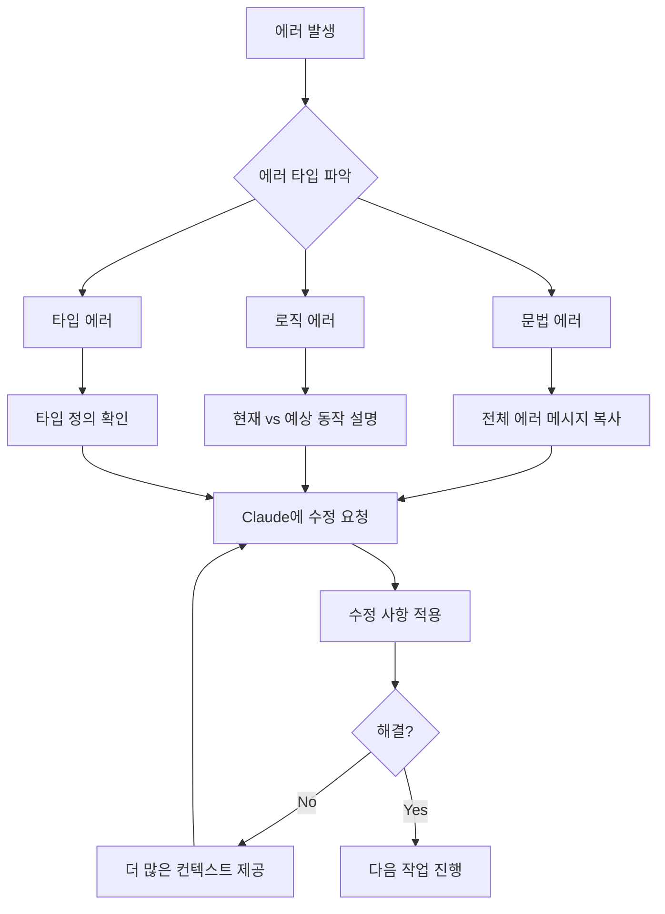

# Claude Code로 90분만에 MVP 앱 구축하기 - 실전 가이드

## 📋 목차
1. [[#개요]]
2. [[#핵심 통찰]]
3. [[#Claude Code의 한계와 강점]]
4. [[#90분 MVP 개발 과정]]
5. [[#9가지 핵심 규칙]]
6. [[#실전 프롬프트 전략]]
7. [[#디버깅 및 문제 해결]]
8. [[#학습 포인트]]
9. [[#실무 적용 가이드]]

## 개요

**저자의 여정**:
- Cursor로 앱 개발 시도 → 실패
- Claude Code로 3주간 시도 → 진전 없음
- 방법론 개선 후 → 90분 만에 MVP 완성

**핵심 메시지**: "Claude isn't that smart" - Claude는 생각보다 똑똑하지 않지만, 올바른 방법을 사용하면 강력한 도구가 될 수 있다.

## 핵심 통찰

### 🎯 주요 깨달음
1. **복잡성 과소평가의 위험**: 앱의 복잡도를 정확히 파악해야 함
2. **AI 능력 과대평가 금지**: Claude의 실제 능력을 현실적으로 이해
3. **체계적 접근의 중요성**: 명확한 규칙과 프로세스 필요

### 📱 개발한 앱: 외국어 학습 도구
- **목적**: 실제 상황에서 언어가 어떻게 사용되는지 학습
- **기능**: 실제 대화와 문맥에서 언어 구조 분석
- **개발 시간**: 90분 (검증된 시간)

## Claude Code의 한계와 강점

### ❌ 한계점
- 복잡한 앱 아키텍처 이해 부족
- 다른 앱의 작동 방식 파악 어려움
- 일반적인 SaaS 앱 수준을 넘어서는 복잡도 처리 한계

### ✅ 강점
- 명확한 지시사항 따르기
- 반복적인 코드 생성
- 구조화된 접근 시 높은 생산성

## 90분 MVP 개발 과정

### 🚀 개발 타임라인
```
00:00 - 00:15: 프로젝트 설정 및 초기 구조
00:15 - 00:30: 핵심 기능 구현
00:30 - 00:45: UI/UX 개발
00:45 - 01:00: 기능 통합 및 연결
01:00 - 01:15: 디버깅 및 수정
01:15 - 01:30: 최종 테스트 및 완성
```

### 🎓 학습자를 위한 상세 단계별 가이드

#### 1단계: 프로젝트 초기 설정 (0-15분)
**목표**: 프로젝트 구조와 기본 설정 완료

**실습 프롬프트**:
```
Create a new React app with TypeScript for a language learning flashcard application.
Set up the following structure:
- src/components/ for UI components
- src/services/ for API calls
- src/types/ for TypeScript interfaces
- src/utils/ for helper functions

Use Vite for fast development and include Tailwind CSS for styling.
Create a basic App.tsx with a simple header saying "Language Learning App".
```

**체크포인트**:
- [ ] 프로젝트가 성공적으로 생성되었는가?
- [ ] `npm run dev`로 앱이 실행되는가?
- [ ] Tailwind CSS가 작동하는가? (헤더 스타일 확인)

#### 2단계: 핵심 기능 구현 (15-30분)
**목표**: 플래시카드의 기본 데이터 구조와 표시 기능

**실습 프롬프트**:
```
Create a Flashcard component with the following features:
1. TypeScript interface for Flashcard:
   - id: string
   - foreignWord: string
   - translation: string
   - context: string (example sentence)
   - difficulty: 'easy' | 'medium' | 'hard'

2. Display the foreign word on the front
3. Show translation on click/tap
4. Add flip animation using CSS transforms

Create a mock data file with 5 sample flashcards in Korean/English.
```

**초보자 팁**:
- TypeScript 에러가 나면 `any` 타입을 임시로 사용한 후 점진적으로 개선
- CSS 애니메이션이 어려우면 먼저 기능 구현 후 스타일 추가

#### 3단계: UI/UX 개발 (30-45분)
**목표**: 사용자 친화적인 인터페이스 구축

**실습 프롬프트**:
```
Enhance the UI with these features:
1. Card deck layout showing current card and progress (e.g., 3/10)
2. Swipe gestures or buttons for:
   - "Know it" (green) - moves to next card
   - "Learning" (yellow) - marks for review
   - "Don't know" (red) - adds to difficult pile
3. Progress bar showing session completion
4. Responsive design for mobile and desktop

Use Tailwind classes for consistent styling.
Add smooth transitions between cards.
```

**흔한 실수와 해결법**:
- **실수**: 상태 관리 없이 UI만 구현
- **해결**: useState로 현재 카드 인덱스와 점수 추적

#### 4단계: 기능 통합 (45-60분)
**목표**: 모든 컴포넌트를 연결하여 작동하는 앱 완성

**실습 프롬프트**:
```
Integrate all features:
1. Create a CardDeck component that manages:
   - Current card index
   - User responses (correct/incorrect)
   - Score tracking
   
2. Add local storage to save:
   - Learning progress
   - Difficult words list
   - Last study session date

3. Create a simple stats dashboard showing:
   - Words learned today
   - Accuracy percentage
   - Streak days
```

#### 5단계: 디버깅 및 최적화 (60-75분)
**목표**: 버그 수정 및 성능 개선

**일반적인 버그와 해결책**:

1. **상태 업데이트 문제**
   ```typescript
   // ❌ 잘못된 방법
   setCards(cards.push(newCard)); // 배열 직접 수정
   
   // ✅ 올바른 방법
   setCards([...cards, newCard]); // 새 배열 생성
   ```

2. **비동기 처리 오류**
   ```typescript
   // ❌ 잘못된 방법
   const data = fetchData();
   setData(data); // Promise 객체 저장됨
   
   // ✅ 올바른 방법
   useEffect(() => {
     const loadData = async () => {
       const data = await fetchData();
       setData(data);
     };
     loadData();
   }, []);
   ```

3. **타입 에러**
   ```typescript
   // Claude에게 타입 에러 해결 요청하는 프롬프트
   "I'm getting a TypeScript error: [에러 메시지 복사]
   Here's my code: [코드 복사]
   Please fix the type definitions."
   ```

#### 6단계: 최종 테스트 및 배포 준비 (75-90분)
**목표**: 앱 완성도 검증 및 배포 준비

**테스트 체크리스트**:
- [ ] 모든 기능이 정상 작동하는가?
- [ ] 모바일에서도 잘 보이는가?
- [ ] 데이터가 로컬 스토리지에 저장되는가?
- [ ] 에러 상황을 잘 처리하는가?
- [ ] 로딩 상태가 표시되는가?

## 9가지 핵심 규칙

### Rule 1: 명확한 목표 설정 (13:30)
- 구체적이고 측정 가능한 목표 정의
- MVP의 범위를 명확히 한정

### Rule 2: 단계별 접근 (14:17)
- 큰 작업을 작은 단위로 분해
- 각 단계별 명확한 완료 기준 설정

### Rule 3: 프롬프트 분석 (14:33)
- 효과적인 프롬프트와 비효과적인 프롬프트 구분
- 프롬프트 패턴 학습 및 적용

### Rule 4: 컨텍스트 관리 (15:46)
- Claude의 컨텍스트 윈도우 한계 인식
- 필요한 정보만 선별적으로 제공

### Rule 5: 반복적 개선 (17:45)
- 한 번에 완벽을 추구하지 않음
- 점진적 개선 접근법 채택

### Rule 6: 에러 처리 전략 (18:48)
- 예상 가능한 에러 사전 정의
- 에러 발생 시 명확한 해결 방향 제시

### Rule 7: 테스트 우선 접근 (21:40)
- 각 기능별 테스트 케이스 작성
- 통합 전 개별 기능 검증

### Rule 8: 문서화 병행 (21:50)
- 코드 작성과 동시에 문서화
- 향후 유지보수를 위한 준비

### Rule 9: 현실적 기대치 설정 (22:06)
- AI의 한계 인정
- 인간의 개입이 필요한 부분 식별

## 실전 프롬프트 전략

### 🎯 효과적인 프롬프트 구조
```
1. 컨텍스트 설정
2. 구체적인 요구사항
3. 제약사항 명시
4. 예상 결과물 설명
5. 단계별 지시사항
```

### 💡 프롬프트 예시

#### 기본 프롬프트 구조
```
"Create a React component for a language learning flashcard.
Requirements:
- Display foreign word and translation
- Flip animation on click
- Track correct/incorrect answers
- Use Tailwind CSS for styling
- Include TypeScript types"
```

#### 🎯 상황별 효과적인 프롬프트 템플릿

**1. 컴포넌트 생성 프롬프트**
```
Create a [컴포넌트명] component with these specifications:

Functionality:
- [주요 기능 1]
- [주요 기능 2]

Props:
- [prop명]: [타입] - [설명]

State:
- [상태명]: [타입] - [용도]

Styling:
- Use Tailwind CSS
- Mobile responsive
- [특별한 스타일 요구사항]

Include TypeScript types and proper error handling.
```

**2. 버그 수정 프롬프트**
```
I'm experiencing this issue: [문제 설명]

Current behavior: [현재 동작]
Expected behavior: [예상 동작]

Here's the relevant code:
[코드 붙여넣기]

Error message (if any): [에러 메시지]

Please identify the issue and provide a fix.
```

**3. 기능 추가 프롬프트**
```
Add [기능명] to the existing [컴포넌트명] component.

Current functionality:
[현재 기능 요약]

New feature requirements:
- [요구사항 1]
- [요구사항 2]

Constraints:
- Don't break existing functionality
- Maintain current prop interface
- Follow existing code style

Here's the current code:
[코드 붙여넣기]
```

**4. 리팩토링 프롬프트**
```
Refactor this code to improve [performance/readability/maintainability]:

[코드 붙여넣기]

Specific improvements needed:
- [개선점 1]
- [개선점 2]

Maintain the same functionality but make it [더 구체적인 목표].
```

#### 💰 프롬프트 작성 시 실수 방지 팁

1. **너무 추상적인 요청 피하기**
   - ❌ "Make it better"
   - ✅ "Improve performance by implementing memo and useCallback"

2. **컨텍스트 제공하기**
   - ❌ "Fix this error"
   - ✅ "Fix this TypeScript error in a React component that handles user authentication"

3. **단계적 접근**
   - ❌ "Build a complete e-commerce site"
   - ✅ "Create a product card component with image, title, price, and add to cart button"

4. **제약사항 명시**
   - ❌ "Create a form"
   - ✅ "Create a form using React Hook Form, Zod validation, and Tailwind CSS"

## 디버깅 및 문제 해결

### 🐛 주요 이슈와 해결 과정 (25:38 - 34:16)
1. **상태 관리 문제**
   - 해결: Redux 대신 간단한 Context API 사용
   
2. **API 연결 이슈**
   - 해결: 명확한 엔드포인트 명세 제공

3. **UI 렌더링 버그**
   - 해결: 컴포넌트 생명주기 명확히 정의

### 🎉 최종 테스트 (34:16)
- 모든 기능 정상 작동 확인
- 사용자 피드백 반영
- 성능 최적화 완료

## 학습 포인트

### 📚 핵심 교훈
1. **AI는 도구일 뿐**: 개발자의 명확한 지시와 가이드가 필수
2. **반복과 개선**: 첫 시도에서 완벽을 기대하지 말 것
3. **현실적 접근**: AI의 능력을 과대평가하지 말고 현실적으로 활용

### 🎓 초보자가 꼭 알아야 할 Claude Code 활용 팁

#### 1. 작업 세분화의 중요성
**왜 중요한가?**
- Claude는 작은 단위의 명확한 작업을 더 잘 수행
- 복잡한 작업은 에러 발생 확률 증가

**실전 예시**:
```
// ❌ 너무 큰 요청
"Build a complete language learning app with user authentication, 
progress tracking, spaced repetition algorithm, and social features"

// ✅ 세분화된 요청
"Step 1: Create a basic flashcard component that flips on click"
"Step 2: Add swipe gestures for next/previous card"
"Step 3: Implement progress tracking with local storage"
```

#### 2. 컨텍스트 관리 전략
**문제**: Claude의 컨텍스트 윈도우 제한
**해결책**: 
- 불필요한 코드는 제거하고 핵심만 제공
- 파일 구조와 import 관계 명확히 설명
- 이전 대화 내용 중 핵심만 요약해서 제공

#### 3. 에러 처리 워크플로우


#### 4. 학습 곡선 단축 전략

**Week 1-2: 기초 다지기**
- 간단한 컴포넌트 생성 연습
- 기본 CRUD 기능 구현
- Tailwind CSS 클래스 활용

**Week 3-4: 중급 기능**
- 상태 관리 (Context API)
- API 연동
- 폼 검증

**Week 5-6: 고급 활용**
- 성능 최적화
- 테스트 코드 작성
- 배포 준비

### 🔍 자주 발생하는 문제와 해결책

#### 1. "Claude가 이해하지 못해요"
**원인**: 불명확한 요구사항
**해결**: 
```
// 구조화된 요청 템플릿 사용
Context: [현재 상황 설명]
Goal: [달성하려는 목표]
Constraints: [제약사항]
Current Code: [관련 코드]
Specific Ask: [구체적인 요청]
```

#### 2. "생성된 코드가 작동하지 않아요"
**원인**: 프로젝트 환경과 불일치
**해결**:
- package.json 내용 공유
- 사용 중인 버전 명시
- 프로젝트 구조 설명

#### 3. "매번 다른 방식으로 코드를 생성해요"
**원인**: 일관성 없는 지시
**해결**:
- 코딩 컨벤션 문서 작성
- 선호하는 패턴 예시 제공
- 프로젝트 스타일 가이드 참조

### 🔄 지속적 개선 사항
- 프롬프트 템플릿 라이브러리 구축
- 일반적인 패턴과 안티패턴 문서화
- 팀 내 베스트 프랙티스 공유

## 실무 적용 가이드

### 🏗️ MVP 개발 체크리스트
- [ ] 프로젝트 범위 명확히 정의
- [ ] 기술 스택 사전 결정
- [ ] UI/UX 와이어프레임 준비
- [ ] API 명세 문서화
- [ ] 단계별 마일스톤 설정
- [ ] Claude Code 세션 준비
- [ ] 디버깅 시간 할당
- [ ] 최종 검증 계획 수립

### 📝 실전 프로젝트: 언어 학습 앱 완성하기

#### 사전 준비물
1. **개발 환경**
   - Node.js 18+ 설치
   - VS Code 또는 선호하는 에디터
   - Claude Code 계정

2. **프로젝트 구조 스케치**
   ```
   language-learning-app/
   ├── src/
   │   ├── components/
   │   │   ├── Flashcard.tsx
   │   │   ├── CardDeck.tsx
   │   │   ├── ProgressBar.tsx
   │   │   └── StatsDisplay.tsx
   │   ├── hooks/
   │   │   ├── useLocalStorage.ts
   │   │   └── useFlashcards.ts
   │   ├── types/
   │   │   └── index.ts
   │   └── data/
   │       └── sampleCards.ts
   ```

#### 시작하기 전 체크리스트
- [ ] 학습하고 싶은 언어 선택
- [ ] 10-20개의 기본 단어/문장 준비
- [ ] 와이어프레임 또는 참고 디자인
- [ ] 90분 집중할 수 있는 환경

### 🚀 Claude Code 세션 최적화 팁

1. **세션 시작 전 준비**
   ```
   프로젝트 개요를 한 문단으로 작성:
   "I want to build a language learning flashcard app that helps users 
   memorize Korean vocabulary through spaced repetition. The MVP should 
   include flashcards with flip animation, progress tracking, and basic stats."
   ```

2. **효율적인 대화 관리**
   - 각 기능 완성 후 "This works great!" 같은 확인 메시지
   - 문제 발생 시 즉시 피드백
   - 불필요한 설명 요청 자제

3. **시간 배분 전략**
   - 0-30분: 핵심 기능 구현
   - 30-60분: UI/UX 개선
   - 60-75분: 버그 수정
   - 75-90분: 마무리 및 테스트

### 💼 비즈니스 가치
- **개발 시간 단축**: 기존 대비 70-80% 시간 절감
- **빠른 프로토타이핑**: 아이디어 검증 속도 향상
- **비용 효율성**: 개발 리소스 최적화

### 🚀 다음 단계
1. 더 복잡한 프로젝트에 점진적 적용
2. 팀 차원의 Claude Code 활용 가이드라인 수립
3. 자동화 가능한 부분 식별 및 최적화

## 구현 체크리스트
- [x] YouTube 비디오 내용 분석
- [x] 핵심 인사이트 추출
- [x] 실전 가이드 구조화
- [x] 학습 포인트 정리
- [x] 실무 적용 방안 제시

## 연결된 노트
- [[Claude Code 사용 경험 및 분석]]
- [[AI 코딩 도구 비교 분석]]
- [[프롬프트 엔지니어링 고급 가이드]]
- [[MVP 개발 방법론]]
- [[AI 도구를 활용한 개발 생산성 향상]]

## 추가 리소스
- 채널: [James NoCode Patreon](https://www.patreon.com/jamesnocode)
- 관련 교육: [Mastering FlutterFlow](https://masteringflutterflow.com)
- 관련 교육: [Mastering Supabase](https://masteringsupabase.com)
- 관련 교육: [Mastering BuildShip](https://masteringbuildship.com)