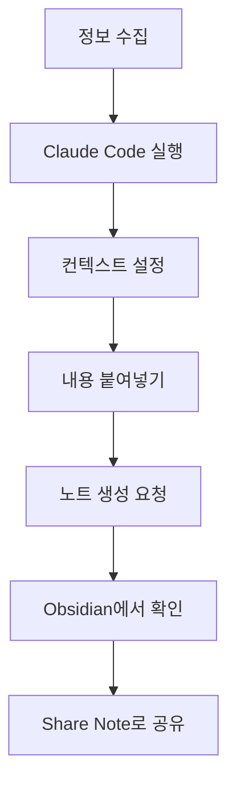

# Obsidian과 Claude Code 협업 설정 가이드

## 📋 목차 (내부 링크 활용)
1. [[#개요]]
2. [[#Obsidian 기본 설정]]
3. [[#커뮤니티 플러그인 설치]]
4. [[#Share Note 플러그인 설정]]
5. [[#README.md 파일 관리]]
6. [[#Claude Code 연동 설정]]
7. [[#일상 워크플로우]]
8. [[#문제 해결 가이드]]

## 개요
- **핵심 주제**: Obsidian 볼트와 Claude Code CLI의 효율적 연동을 위한 환경 설정
- **목적**: 노트 생성, 공유, 관리 과정을 자동화하여 생산성 극대화
- **범위**: 초기 설정부터 일상 사용까지의 완전한 워크플로우 구축

## Obsidian 기본 설정

### 1단계: Obsidian 업데이트
```
⚙️ Settings → General → Check for updates
```
- 톱니바퀴 아이콘 클릭
- General 탭 선택
- "Check for updates" 버튼 클릭
- 최신 버전으로 업데이트 진행
- **중요**: 항상 최신 버전 사용으로 호환성 및 기능 개선 효과

### 2단계: 테마 설정
```
⚙️ Settings → Appearance → Themes → Things
```
- Appearance 탭 이동
- Themes 섹션에서 "Things" 테마 선택
- **추천 이유**: 
  - 깔끔하고 읽기 편한 디자인
  - Claude Code와의 호환성 우수
  - 마크다운 렌더링 최적화

### 3단계: 핫키 설정
```
⚙️ Settings → Hotkeys → "Share Note Link" 검색
```
- Hotkeys 탭 이동
- 검색창에 "Share Note Link" 입력
- 원하는 단축키 조합 설정 (예: `Cmd + Shift + S`)
- **효과**: 빠른 공유 링크 생성으로 협업 효율성 향상

## 커뮤니티 플러그인 설치

### 필수 플러그인 목록
```
⚙️ Settings → Community plugins → Browse
```

#### 1. Share Note 플러그인
- **기능**: 노트를 외부에 쉽게 공유
- **용도**: Claude Code와 노트 내용 공유
- **설치 방법**: "Share Note" 검색 → Install → Enable

#### 2. Templater 플러그인  
- **기능**: 동적 템플릿 생성 및 자동화
- **용도**: 표준화된 노트 구조 자동 생성
- **설치 방법**: "Templater" 검색 → Install → Enable

### 플러그인 설치 절차
1. Settings (⚙️) 클릭
2. Community plugins 탭 선택
3. "Turn on community plugins" 활성화 (처음 설치 시)
4. Browse 버튼 클릭
5. 플러그인 이름 검색
6. Install 버튼 클릭
7. Enable 버튼으로 활성화

## Share Note 플러그인 설정

### API 키 설정 과정
```
⚙️ Settings → Share Note → Connect plugin
```

#### 상세 설정 단계
1. **플러그인 설정 접근**
   - Settings → Share Note 섹션 이동
   - API Key 입력 필드 확인

2. **API 키 획득**
   - "Connect plugin" 버튼 클릭
   - 새 브라우저 탭에서 웹페이지 열림
   - 웹페이지의 안내에 따라 확인 작업 완료
   - 생성된 API Key 복사

3. **API 키 적용**
   - 복사한 API Key를 Obsidian 설정에 붙여넣기
   - Save 또는 Apply 버튼 클릭
   - 연결 상태 확인

### 공유 링크 테스트
- 임의의 노트에서 Share Note 기능 실행
- 생성된 공유 링크 작동 여부 확인
- Claude Code에서 링크 접근 가능 여부 테스트

## README.md 파일 관리

### 지속적 업데이트 전략
README.md 파일은 Obsidian 볼트의 핵심 가이드라인이므로 지속적인 고도화가 필요합니다.

#### 업데이트 주기 및 내용
| 주기 | 업데이트 내용 | 담당자 |
|------|---------------|--------|
| **주간** | 새로운 노트 패턴 및 태그 추가 | 사용자 |
| **월간** | 템플릿 구조 개선 및 워크플로우 최적화 | 사용자 |
| **분기** | 전체 구조 재검토 및 대규모 개선 | 사용자 + Claude |

#### 문서 고도화 체크리스트
- [ ] 새로운 노트 유형에 대한 가이드라인 추가
- [ ] 태그 체계 정리 및 일관성 검토
- [ ] 템플릿 개선 및 신규 템플릿 추가
- [ ] 연결된 노트 패턴 최적화
- [ ] 검색 및 탐색 효율성 개선
- [ ] Claude Code 연동 가이드라인 업데이트

### 버전 관리
```markdown
## 변경 이력
- 2025-06-12: 초기 설정 완료
- 2025-06-XX: [구체적 변경사항]
```

## Claude Code 연동 설정

### 초기 설정 (한 번만 실행)

#### 1단계: 볼트 경로 확인
```bash
# 터미널에서 실행
pwd  # 현재 디렉토리 확인
ls -la "Documents/Obsidian Vault"  # 볼트 존재 확인
```

#### 2단계: README.md 파일 위치 확인
```bash
# README.md 파일 확인
cat "/Users/jmacpro/Documents/Obsidian Vault/README.md" | head -10
```

#### 3단계: Claude Code 컨텍스트 설정
Claude Code 실행 시 다음 템플릿을 사용:
```
the vault '/Users/jmacpro/Documents/Obsidian Vault'.
Please refer to the file '/Users/jmacpro/Documents/Obsidian Vault/README.md' for information on creating notes.
```

### 경로 정보 관리
**중요**: 위의 컨텍스트 설정은 **한 번만** 수행하면 됩니다.
- 볼트 경로: `/Users/jmacpro/Documents/Obsidian Vault`
- README 경로: `/Users/jmacpro/Documents/Obsidian Vault/README.md`

## 일상 워크플로우

### 빠른 노트 접근 방법
#### Mac 기준 단축키
```
Command + O → 최근 문서 확인 → Enter
```
1. `Cmd + O` 키 조합 실행
2. Quick Switcher에서 최근 문서 목록 확인
3. 원하는 문서에서 Enter 키
4. **효과**: 마우스 없이 빠른 문서 전환 가능

### 노트 생성 워크플로우


#### 단계별 실행 방법
1. **정보 수집**: 기록할 내용 준비
2. **Claude Code 실행**: 터미널에서 `claude` 명령어
3. **컨텍스트 설정**: 볼트 경로 정보 제공 (최초 1회만)
4. **내용 요청**: "다음 내용으로 옵시디언 노트를 생성해 주세요"
5. **노트 확인**: Obsidian에서 생성된 노트 검토
6. **공유 준비**: 필요 시 Share Note 기능 활용

### 효율성 팁
- **템플릿 활용**: Templater를 통한 일관된 노트 구조
- **태그 일관성**: README.md의 태그 가이드라인 준수
- **연결 강화**: 관련 노트 간 링크 적극 활용
- **정기 정리**: 주간 볼트 정리 및 구조 최적화

## 문제 해결 가이드

### 자주 발생하는 문제와 해결책

#### 1. Share Note 플러그인 오류
**증상**: API 키 오류 또는 공유 링크 생성 실패
**해결책**:
- API 키 재생성 및 재설정
- 플러그인 비활성화 후 재활성화
- Obsidian 재시작

#### 2. Claude Code 연동 문제
**증상**: 볼트 경로 인식 실패 또는 README.md 접근 불가
**해결책**:
- 경로 정보 재확인 및 수정
- 파일 권한 설정 확인
- Claude Code 재시작

#### 3. 템플릿 적용 오류
**증상**: Templater 플러그인 작동 안 함
**해결책**:
- 템플릿 폴더 경로 재설정
- 템플릿 파일 문법 검토
- 플러그인 설정 초기화

#### 4. 노트 동기화 문제
**증상**: 생성된 노트가 Obsidian에서 보이지 않음
**해결책**:
- Vault 새로고침 (Ctrl+R 또는 Cmd+R)
- 파일 시스템 권한 확인
- 볼트 위치 재확인

### 고급 문제 해결

#### 로그 파일 확인
```bash
# Obsidian 로그 위치 (Mac)
~/Library/Application Support/obsidian/
```

#### 설정 백업
```bash
# .obsidian 폴더 백업
cp -r "/Users/jmacpro/Documents/Obsidian Vault/.obsidian" ~/Desktop/obsidian-backup
```

## 구현 체크리스트

### 초기 설정 완료 확인
- [ ] Obsidian 최신 버전 업데이트 완료
- [ ] Things 테마 적용 완료
- [ ] Share Note Link 핫키 설정 완료
- [ ] Share Note 플러그인 설치 및 설정 완료
- [ ] Templater 플러그인 설치 완료
- [ ] API 키 연동 테스트 완료
- [ ] Claude Code 컨텍스트 설정 완료
- [ ] 노트 생성 테스트 완료

### 일상 사용 체크포인트
- [ ] 빠른 노트 접근 (Cmd+O) 숙지
- [ ] Share Note 기능 활용 가능
- [ ] README.md 가이드라인 준수
- [ ] 태그 시스템 일관성 유지
- [ ] 정기적 볼트 정리 실행

## 연결된 노트
- **상위 개념**: [[Obsidian 설정 가이드]], [[Claude Code 활용법]], [[개인 지식 관리]]
- **하위 세부사항**: [[Share Note 플러그인 상세]], [[Templater 고급 활용]], [[볼트 최적화 팁]]
- **병렬 주제**: [[마크다운 작성법]], [[노트 연결 전략]], [[지식 네트워크 구축]]
- **실전 활용**: [[일일 노트 워크플로우]], [[프로젝트 관리 시스템]], [[학습 노트 체계]]

## 참고 자료
- Obsidian 공식 문서: https://help.obsidian.md
- Share Note 플러그인 가이드
- Templater 플러그인 문서
- Claude Code 공식 가이드
- 마크다운 문법 레퍼런스

---

## 변경 이력
- 2025-06-12: 초안 작성 - Obsidian과 Claude Code 협업 설정 가이드