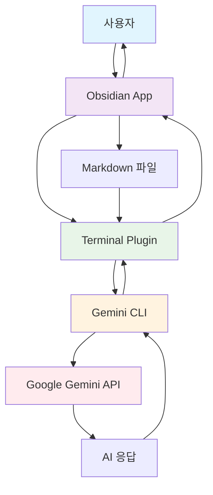
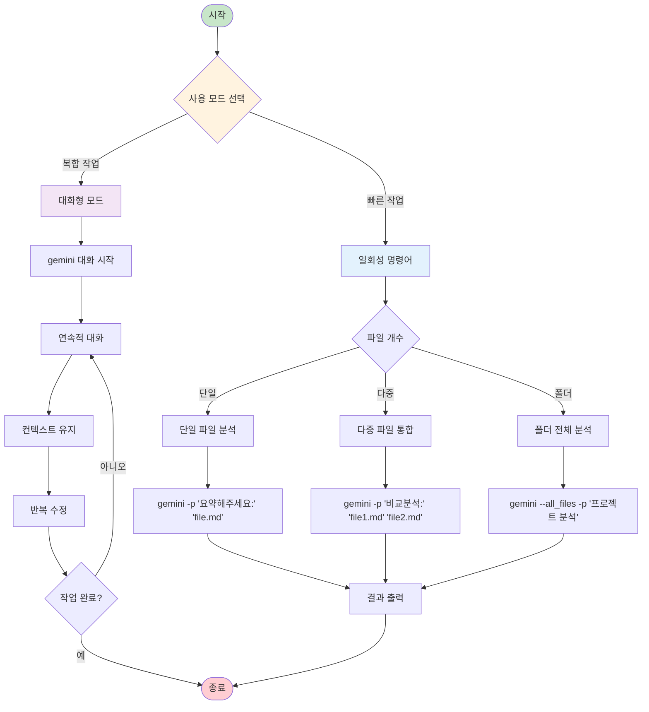
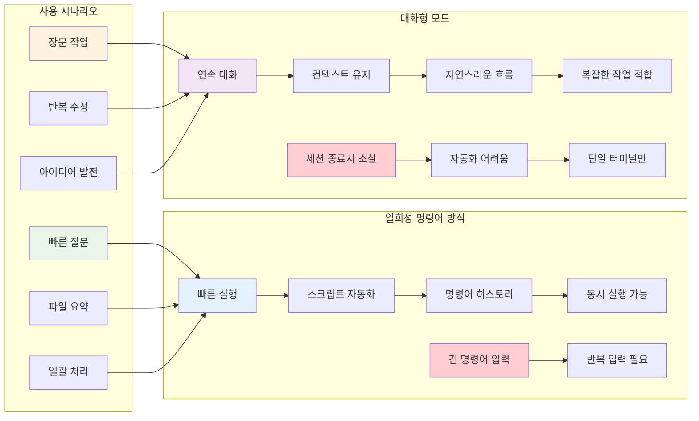
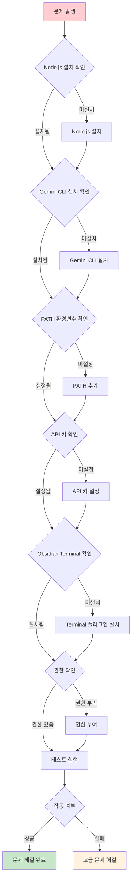
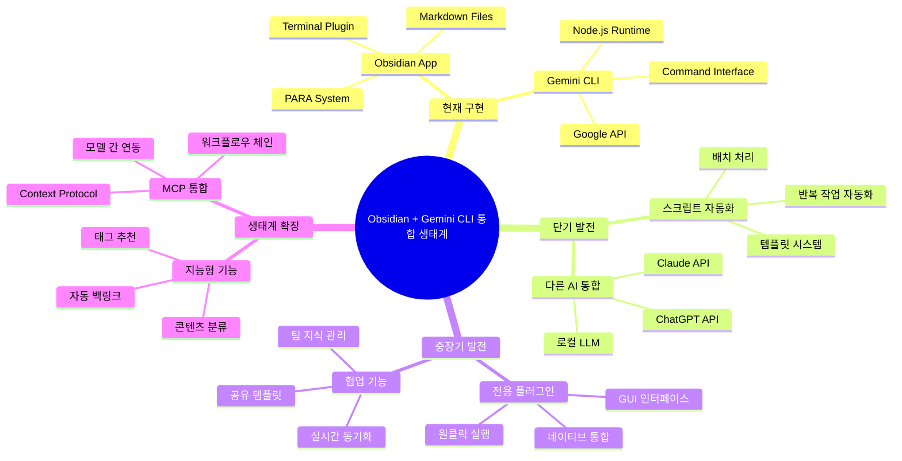

# Obsidian + Gemini CLI 통합 실전 가이드

## 개요
- **핵심 주제**: Obsidian 노트 앱에서 Gemini CLI를 활용한 AI 지원 글쓰기 환경 구축
- **목적**: 노트 작성과 지식 관리에 AI를 통합하여 생산성 극대화
- **범위**: macOS 기준 설치부터 고급 활용까지 완전 가이드
- **대상 플랫폼**: macOS (macOS 12.0 이상 권장)

> ⚠️ **중요**: 이 가이드는 **macOS 사용자**를 기준으로 작성되었습니다. Windows나 Linux 사용자는 일부 명령어와 경로가 다를 수 있습니다.

## 📋 목차 (내부 링크 활용)
1. [[#배경 및 맥락]]
2. [[#핵심 개념 기능]]
3. [[#구현 방법 활용법]]
4. [[#초급 활용법]]
5. [[#중급 활용법]]
6. [[#고급 활용법]]
7. [[#사례 및 예시]]
8. [[#장단점 분석]]
9. [[#문제 해결 가이드]]
10. [[#향후 전망 발전 방향]]
11. [[#실무 적용점]]

## 배경 및 맥락

### AI 통합 글쓰기 환경의 필요성
- 단순 노트 작성을 넘어 AI와 협업하는 지식 관리 시스템 구축
- Obsidian의 강력한 노트 관리 기능과 Gemini의 AI 능력 결합
- 로컬 환경에서 직접 AI를 활용한 콘텐츠 생성 및 분석

### 기술 스택 선택 이유
- **Obsidian**: 마크다운 기반, 로컬 파일 시스템, 확장성
- **Gemini CLI**: Google의 대규모 언어 모델 접근, 터미널 통합
- **Terminal Plugin**: Obsidian 내부에서 직접 명령어 실행

## 핵심 개념 기능

### 1. 시스템 아키텍처


### 2. 주요 구성 요소
- **Node.js**: JavaScript 런타임 환경
- **npm**: Node 패키지 매니저
- **Gemini CLI**: Google AI CLI 도구
- **Obsidian Terminal**: 터미널 통합 플러그인

### 3. 핵심 기능
- 파일 내용 분석 및 요약
- 자동 콘텐츠 생성
- 주제별 분류 및 정리
- 다중 파일 통합 분석

### 4. 워크플로우 다이어그램


## 구현 방법 활용법

### 1. 환경 구축 단계

#### Node.js 설치
```bash
# Homebrew로 Node.js 설치
brew install node

# 설치 확인
node --version
npm --version
```

#### Gemini CLI 설치
```bash
# 전역 설치
npm install -g @google/generative-ai-cli

# API 키 설정
gemini config set api-key YOUR_API_KEY_HERE
```

#### Obsidian Terminal 설정
1. **플러그인 설치**: Community Plugins에서 "Terminal" 검색 및 설치
2. **터미널 실행**: 사이드바에 생긴 📟 터미널 아이콘 클릭 → "Open Terminal" 선택
3. **프로필 선택**: 드롭다운 메뉴에서 `darwinIntegratedDefault` 선택
4. **작동 확인**: `pwd` 명령어로 현재 경로 확인 (Obsidian Vault 경로가 표시되어야 함)

### 2. 기본 동작 확인

#### API 연결 테스트
```bash
# 기본 기능 테스트
gemini -p "안녕하세요. 테스트입니다."

# 모델 목록 확인
gemini models list
```

## 초급 활용법

### 1. 기본 사용법 익히기

#### 기본 테스트
```bash
# 기본 기능 테스트
gemini -p "안녕하세요. 테스트입니다."

# 파일 없이 프롬프트만 사용
gemini -p "한국의 수도는 어디인가요?"
```

#### 두 가지 사용 방법

**1. 일회성 명령어 방식 (초보자 권장)**
```bash
# 단일 명령어로 즉시 실행
gemini -p "질문 내용" "파일경로"

# 예시
gemini -p "이 파일을 요약해주세요:" "99_템플릿/AI협업_템플릿.md"
```

**2. 대화형 모드 (Interactive Mode)**
```bash
# gemini 명령어만 입력하여 대화 모드 진입
gemini

# 프롬프트가 나타나면 자유롭게 대화
> 안녕하세요. 오늘 날씨는 어때요?
[Gemini 응답]

> 파일을 분석해주세요: /Users/jmacpro/Documents/Obsidian Cli/99_템플릿/AI협업_템플릿.md
[Gemini 응답]

> 종료하려면 Ctrl+C 또는 exit 입력
```

### 2. 단일 파일 작업

```bash
# 파일 요약
cd "/Users/jmacpro/Documents/Obsidian Cli"
gemini -p "이 파일의 핵심 내용을 3줄로 요약해주세요:" "99_템플릿/AI협업_템플릿.md"

# 제목 추천
gemini -p "적절한 제목 5개를 제안해주세요:" "99_템플릿/AI협업_템플릿.md"

# 키워드 추출
gemini -p "이 파일에서 핵심 키워드 10개를 추출해주세요:" "99_템플릿/AI협업_템플릿.md"
```

## 중급 활용법

### 1. 다중 파일 작업

```bash
# 여러 파일 비교 분석
cd "/Users/jmacpro/Documents/Obsidian Cli"
gemini -p "이 템플릿들을 비교 분석해주세요:" "99_템플릿/AI협업_템플릿.md" "99_템플릿/다른템플릿.md"

# 파일 통합 요약
gemini -p "이 파일들의 공통점과 차이점을 분석해주세요:" "file1.md" "file2.md" "file3.md"
```

### 2. 폴더 단위 작업

```bash
# 폴더 내 파일 분류
gemini -p "이 폴더의 모든 .md 파일을 주제별로 분류해주세요:" "99_템플릿/"

# 종합 보고서 생성
gemini -p "이 폴더의 내용으로 종합 보고서를 작성해주세요:" "_스크립트/"

# 현재 디렉토리 모든 파일 분석
gemini --all_files -p "이 프로젝트의 전체 구조를 분석해주세요"
```

### 3. 대화형 모드 활용

```bash
# 연속적인 작업 흐름
gemini

> 파일을 분석해주세요: 99_템플릿/AI협업_템플릿.md
> 이 템플릿을 바탕으로 프로젝트 관리용 템플릿을 만들어주세요
> 방금 만든 템플릿에 타임라인 섹션을 추가해주세요
> exit
```

## 고급 활용법

### 1. 고급 플래그 활용

```bash
# 샌드박스 모드 실행
gemini -s -p "코드를 실행해주세요:" "script.py"

# 디버그 모드
gemini -d -p "오류를 분석해주세요:" "error.log"

# 특정 모델 사용
gemini -m "gemini-2.5-pro" -p "복잡한 분석을 해주세요:" "data.md"
```

### 2. 자동화 스크립트 활용

```bash
# 배치 처리 스크립트
#!/bin/bash
for file in *.md; do
    gemini -p "이 파일을 요약해주세요:" "$file" > "summary_$file"
done
```

### 3. 복합 워크플로우

```bash
# 1단계: 분석
gemini -p "이 프로젝트의 문제점을 찾아주세요:" "프로젝트/" --all_files

# 2단계: 해결책 제안
gemini -p "앞서 분석한 문제점들의 해결책을 제안해주세요:" "프로젝트/analysis.md"

# 3단계: 실행 계획
gemini -p "해결책을 단계별 실행 계획으로 만들어주세요:" "프로젝트/solutions.md"
```

## 사례 및 예시

### 1. 연구 노트 자동화
```bash
# 연구 주제 확장 (복사 붙여넣기 가능)
cd "/Users/jmacpro/Documents/Obsidian Cli"
gemini -p "이 연구 주제에 대해 추가로 조사해야 할 항목 10개를 제안해주세요:" "연구노트/research.md"

# 참고문헌 생성
gemini -p "이 내용을 바탕으로 관련 키워드와 검색어를 추출해주세요:" "/Users/jmacpro/Documents/Obsidian Cli/연구노트/paper.md"

# 논문 초안 작성
gemini -p "이 자료들을 바탕으로 논문 초안을 작성해주세요:" "연구노트/research.md" "연구노트/references.md"
```

### 2. 회의록 정리
```bash
# 회의록 요약 (실제 사용 가능한 경로)
cd "/Users/jmacpro/Documents/Obsidian Cli"
gemini -p "이 회의록에서 액션 아이템만 추출해주세요:" "회의록/meeting_notes.md"

# 후속 조치 생성
gemini -p "이 회의록을 바탕으로 팀별 할 일을 정리해주세요:" "/Users/jmacpro/Documents/Obsidian Cli/회의록/meeting_notes.md"

# 회의 요약 및 다음 회의 안건 생성
gemini -p "이 회의록을 요약하고 다음 회의 안건을 제안해주세요:" "회의록/meeting_notes.md"
```

### 3. 콘텐츠 생성
```bash
# 블로그 포스트 작성 (템플릿 활용)
cd "/Users/jmacpro/Documents/Obsidian Cli"
gemini -p "이 개요를 바탕으로 블로그 포스트를 작성해주세요:" "콘텐츠/outline.md"

# SEO 최적화
gemini -p "이 글의 SEO를 위한 메타 설명과 키워드를 생성해주세요:" "/Users/jmacpro/Documents/Obsidian Cli/콘텐츠/article.md"

# 소셜 미디어 요약본 생성
gemini -p "이 글을 SNS 게시용으로 요약해주세요 (트위터, 인스타그램, 링크드인 버전):" "콘텐츠/article.md"
```

### 4. 템플릿 활용 예시
```bash
# AI 협업 템플릿 분석 (바로 사용 가능)
cd "/Users/jmacpro/Documents/Obsidian Cli"
gemini -p "이 템플릿을 분석하고 개선점을 제안해주세요:" "99_템플릿/AI협업_템플릿.md"

# 여러 템플릿 비교
gemini -p "이 템플릿들을 비교하여 장단점을 분석해주세요:" "99_템플릿/" --all_files

# 새로운 템플릿 생성
gemini -p "프로젝트 관리용 템플릿을 만들어주세요. 기존 템플릿을 참고하세요:" "99_템플릿/AI협업_템플릿.md"
```

### 5. 대화형 모드 활용 시나리오

#### 장문 작업 시나리오 (대화형 모드 권장)
```bash
# 대화형 모드 시작
cd "/Users/jmacpro/Documents/Obsidian Cli"
gemini

# 연속적인 작업 흐름
> 파일을 분석해주세요: 99_템플릿/AI협업_템플릿.md
[Gemini가 템플릿 분석 결과 제공]

> 이 템플릿을 바탕으로 프로젝트 관리용 템플릿을 만들어주세요
[Gemini가 새로운 템플릿 생성]

> 방금 만든 템플릿에 타임라인 섹션을 추가해주세요
[Gemini가 타임라인 섹션 추가]

> 이 템플릿을 마크다운 파일로 저장할 수 있는 형태로 정리해주세요
[Gemini가 최종 정리된 템플릿 제공]

> exit (또는 Ctrl+C로 종료)
```

#### 빠른 질문 시나리오 (일회성 명령어 권장)
```bash
# 빠른 단일 질문
gemini -p "이 파일의 제목을 5개 제안해주세요:" "99_템플릿/AI협업_템플릿.md"

# 즉시 요약 필요
gemini -p "이 회의록을 3줄로 요약해주세요:" "회의록/team-meeting.md"
```

## 장단점 분석

### 장점
1. **통합 환경**: Obsidian 내에서 모든 작업 완료
2. **자동화**: 반복 작업 대폭 감소
3. **확장성**: 다양한 워크플로우 구축 가능
4. **로컬 실행**: 데이터 프라이버시 보장
5. **무료 사용**: API 할당량 내 무료
6. **두 가지 모드**: 일회성 명령어와 대화형 모드 선택 가능

### 단점
1. **초기 설정**: 기술적 진입 장벽 존재
2. **API 제한**: 일일 사용량 제한
3. **플랫폼 의존**: macOS 중심 가이드
4. **네트워크 필요**: 오프라인 사용 불가

### 사용 방법별 장단점 비교



#### 일회성 명령어 방식
**장점:**
- 빠른 실행 속도
- 스크립트 자동화 가능
- 명령어 히스토리 관리 용이
- 여러 터미널에서 동시 실행 가능

**단점:**
- 긴 명령어 입력 필요
- 연속적인 작업 시 반복 입력

#### 대화형 모드
**장점:**
- 연속적인 대화와 수정 가능
- 컨텍스트 유지 (이전 대화 기억)
- 자연스러운 대화 흐름
- 복잡한 작업에 적합

**단점:**
- 세션 종료 시 컨텍스트 소실
- 자동화 스크립트화 어려움
- 하나의 터미널에서만 실행 가능

### 주의사항
- API 키 보안 관리 필수
- 대용량 파일 처리 시 토큰 제한 고려
- 정기적인 CLI 업데이트 필요

## 문제 해결 가이드

### 🔧 자가 진단 체크리스트



#### 1단계: 기본 환경 점검
```bash
# Node.js 설치 확인
node --version  # v18.0.0 이상 권장

# npm 설치 확인
npm --version   # v8.0.0 이상 권장

# Gemini CLI 설치 확인
gemini --version

# PATH 환경변수 확인
echo $PATH | grep -E "(node|npm)"
```

#### 2단계: 권한 및 경로 검증
```bash
# npm 전역 설치 경로 확인
npm config get prefix

# 실행 권한 확인
ls -la $(which gemini)

# 현재 쉘 확인
echo $SHELL
```

### 🚨 자주 발생하는 문제와 해결책

#### 1. "gemini: command not found" 오류

**원인 분석 단계:**
1. 설치 여부 확인
   ```bash
   npm list -g @google/generative-ai-cli
   ```

2. PATH 포함 여부 확인
   ```bash
   echo $PATH
   which gemini
   ```

**해결 방법:**
```bash
# 방법 1: npm 재설치
npm uninstall -g @google/generative-ai-cli
npm install -g @google/generative-ai-cli

# 방법 2: PATH 수동 추가
echo 'export PATH="$(npm config get prefix)/bin:$PATH"' >> ~/.zshrc
source ~/.zshrc

# 방법 3: 직접 실행
$(npm config get prefix)/bin/gemini
```

#### 0. 환경 변수 설정 문제 (macOS)

**증상:**
- 터미널에서 `gemini` 명령어가 인식되지 않음
- `command not found` 오류 지속 발생

**해결 방법:**
```bash
# 1. Node 설치 경로 확인
which node
# 일반적 결과: /opt/homebrew/bin/node

# 2. .zshrc 파일 편집
nano ~/.zshrc

# 3. PATH 추가 (파일 최상단에 추가)
export PATH="/opt/homebrew/bin:$PATH"

# 4. 변경사항 적용
source ~/.zshrc

# 5. Obsidian 완전 종료 후 재실행
# Command+Q로 완전 종료 → 다시 실행
```

**영구적 해결책:**
```bash
# .zshrc에 npm 글로벌 경로 추가
echo 'export PATH="$(npm config get prefix)/bin:$PATH"' >> ~/.zshrc

# 변경사항 즉시 적용
source ~/.zshrc

# 확인
which gemini
```

#### 2. API 키 인증 실패

**진단 스크립트:**
```bash
# API 키 설정 확인
gemini config get api-key

# API 키 유효성 테스트
gemini "test" 2>&1 | grep -E "(401|403|Invalid)"
```

**해결 방법:**
```bash
# 새 API 키 발급 후 재설정
gemini config set api-key "YOUR_NEW_API_KEY"

# 따옴표 문제 해결
gemini config set api-key YOUR_API_KEY_WITHOUT_QUOTES

# 설정 파일 직접 수정
nano ~/.gemini-cli/config.json
```

#### 3. Obsidian Terminal 플러그인 문제

**진단 체크:**
- 플러그인 활성화 여부
- 사이드바 터미널 아이콘 표시 여부
- 프로필 선택 가능 여부

**해결 단계:**
1. **플러그인 재설치**
   - Settings → Community Plugins → Terminal 비활성화
   - 앱 재시작 → 다시 활성화
   - 사이드바에 📟 아이콘 확인

2. **올바른 사용 방법**
   ```
   1. 사이드바 📟 터미널 아이콘 클릭
   2. "Open Terminal" 선택
   3. 프로필 드롭다운에서 "darwinIntegratedDefault" 선택
   4. pwd 명령어로 경로 확인
   ```

3. **프로필 설정 문제 해결**
   - Settings → Plugins → Terminal → Options → Profiles
   - 기본 프로필이 없는 경우 새로 생성
   - 프로필 이름: `darwinIntegratedDefault`
   - 실행 경로: 기본값 사용

4. **권한 문제 해결**
   ```bash
   # macOS 터미널 앱 권한 부여
   System Preferences → Security & Privacy → Privacy → Full Disk Access
   → Obsidian 앱 추가 또는 체크
   ```

#### 4. 한글 인코딩 문제

**증상:**
- 한글 출력 깨짐
- 파일 읽기 시 오류

**해결 방법:**
```bash
# 터미널 인코딩 설정
export LANG=ko_KR.UTF-8
export LC_ALL=ko_KR.UTF-8

# .zshrc에 영구 적용
echo 'export LANG=ko_KR.UTF-8' >> ~/.zshrc
echo 'export LC_ALL=ko_KR.UTF-8' >> ~/.zshrc
```

#### 5. 파일 경로 인식 오류

**일반적인 실수:**
- 공백 포함 경로 미처리
- 상대 경로 vs 절대 경로
- 특수문자 이스케이프

**올바른 사용법:**
```bash
# 잘못된 예
gemini "분석해줘: ~/Obsidian Vault/note.md"

# 올바른 예
gemini "분석해줘: '/Users/username/Obsidian Vault/note.md'"
gemini "분석해줘: ~/Obsidian\ Vault/note.md"
```

#### 6. Node.js 명령어 구문 오류

**증상:**
- `Error: Cannot find module '/path/to/...'`
- `MODULE_NOT_FOUND` 오류 발생
- 파일명에 `...` 포함된 오류 메시지

**원인:**
- 문서의 `...` 플레이스홀더를 실제 명령어로 사용
- 실제 파일명 대신 점 3개 입력

**해결 방법:**
```bash
# 잘못된 예
node --trace-deprecation ...

# 올바른 예
node --trace-deprecation your-script.js
node --trace-deprecation index.js
node --trace-deprecation _스크립트/hello.js

# 파일 찾기
find . -name "*.js" -type f
ls -la | grep ".js"
```

**디버깅 단계:**
1. 실행하려는 파일 확인
2. 파일 존재 여부 검증
3. 상대/절대 경로 정확성 확인

#### 7. Obsidian URI 스키마 처리 오류

**증상:**
- `Unknown argument: 적절한 제목...` 오류 발생
- `obsidian://` URI가 명령어로 인식되지 않음
- 옵션 도움말이 출력됨

**원인:**
- Gemini CLI는 `obsidian://` URI 스키마를 파일 경로로 인식하지 못함
- 로컬 파일 시스템 경로만 처리 가능
- 잘못된 플래그 사용법

**해결 방법:**
```bash
# 잘못된 예 (obsidian:// URI 사용)
gemini "적절한 제목 5개를 제안해주세요: obsidian://open?vault=Obsidian%20Cli&file=99_%ED%85%9C%ED%94%8C%EB%A6%BF%2FAI%ED%98%91%EC%97%85_%ED%85%9C%ED%94%8C%EB%A6%BF"

# 올바른 예 (실제 파일 경로 사용)
gemini -p "적절한 제목 5개를 제안해주세요:" "/Users/jmacpro/Documents/Obsidian Cli/99_템플릿/AI협업_템플릿.md"

# 또는 상대 경로 사용 (Obsidian Vault 내에서)
cd "/Users/jmacpro/Documents/Obsidian Cli"
gemini -p "적절한 제목 5개를 제안해주세요:" "99_템플릿/AI협업_템플릿.md"
```

**URI에서 파일 경로 변환하기:**
1. `obsidian://open?vault=Obsidian%20Cli&file=99_%ED%85%9C%ED%94%8C%EB%A6%BF%2FAI%ED%98%91%EC%97%85_%ED%85%9C%ED%94%8C%EB%A6%BF` 
2. URL 디코딩: `99_템플릿/AI협업_템플릿`
3. 실제 경로: `/Users/jmacpro/Documents/Obsidian Cli/99_템플릿/AI협업_템플릿.md`

**자동 변환 스크립트:**
```bash
#!/bin/bash
# obsidian_to_path.sh
obsidian_uri="$1"
vault_path="/Users/jmacpro/Documents/Obsidian Cli"

# URI에서 파일 경로 추출
file_path=$(echo "$obsidian_uri" | sed -E 's/.*file=([^&]+).*/\1/' | python3 -c "import sys, urllib.parse; print(urllib.parse.unquote(sys.stdin.read().strip()))")

# 실제 파일 경로 생성
full_path="$vault_path/$file_path.md"
echo "$full_path"
```

### 🛠️ 고급 문제 해결

#### 명령어 구문 실수 예방 가이드

**자주 발생하는 구문 오류:**
1. **플레이스홀더 오인**
   ```bash
   # 문서에서 본 예시 (잘못된 사용)
   command --option ...
   
   # 올바른 사용
   command --option actual-file.js
   command --option arg1 arg2 arg3
   ```

2. **따옴표 처리 실수**
   ```bash
   # 잘못된 예
   gemini 이 파일을 분석해줘: file.md
   
   # 올바른 예
   gemini "이 파일을 분석해줘: file.md"
   ```

3. **경로 구분자 혼동**
   ```bash
   # Windows 스타일 (잘못된 예)
   node script\file.js
   
   # Unix/macOS 스타일 (올바른 예)
   node script/file.js
   ```

4. **Gemini CLI 플래그 사용법**
   ```bash
   # 잘못된 예 (플래그 없이 사용)
   gemini "프롬프트 텍스트 파일경로"
   
   # 올바른 예 (적절한 플래그 사용)
   gemini -p "프롬프트 텍스트" "파일경로"
   gemini --prompt "프롬프트 텍스트" "파일경로"
   
   # 파일 내용만 분석 (프롬프트 없이)
   gemini "파일경로"
   ```

5. **Obsidian 내에서 파일 경로 얻기**
   ```bash
   # Obsidian에서 파일 우클릭 → "Copy path" 사용
   # 결과: /Users/username/Documents/Obsidian Vault/note.md
   
   # 또는 pwd 명령어로 현재 경로 확인 후 상대 경로 사용
   pwd
   # 결과: /Users/jmacpro/Documents/Obsidian Cli
   gemini -p "분석해주세요:" "99_템플릿/AI협업_템플릿.md"
   ```

#### 디버그 모드 활용
```bash
# 상세 로그 출력
export GEMINI_DEBUG=true
gemini --verbose "test prompt"

# 네트워크 문제 진단
curl -I https://generativelanguage.googleapis.com/v1beta/models
```

#### 프로세스 모니터링
```bash
# CPU/메모리 사용량 확인
top | grep -E "(node|gemini)"

# 열린 파일 확인
lsof | grep gemini
```

#### 로그 파일 분석
```bash
# npm 로그 확인
cat ~/.npm/_logs/*.log | grep error

# 시스템 로그 확인
tail -f /var/log/system.log | grep -i "obsidian\|terminal"
```

### 💡 예방적 유지보수

#### 정기 점검 스크립트
```bash
#!/bin/bash
# health_check.sh

echo "=== Gemini CLI Health Check ==="
echo "Node version: $(node --version)"
echo "NPM version: $(npm --version)"
echo "Gemini CLI: $(gemini --version 2>/dev/null || echo 'Not installed')"
echo "API Key: $(gemini config get api-key | sed 's/\(.\{10\}\).*/\1.../')"
echo "PATH includes npm: $(echo $PATH | grep -q npm && echo 'Yes' || echo 'No')"
```

#### 자동 업데이트 설정
```bash
# 주간 업데이트 cron 작업
crontab -e
# 추가: 0 9 * * 1 npm update -g @google/generative-ai-cli
```

### 📞 추가 지원 리소스

1. **공식 문서**
   - [Gemini CLI GitHub](https://github.com/google/generative-ai-cli)
   - [Google AI Discord](https://discord.gg/googleai)

2. **커뮤니티 지원**
   - Obsidian Forum: Terminal 플러그인 스레드
   - Reddit: r/ObsidianMD

3. **로그 수집 도구**
   ```bash
   # 문제 보고용 로그 수집
   gemini diagnose > gemini_diagnosis.txt
   ```

## 향후 전망 발전 방향

### 단기 발전 방향
1. **스크립트 자동화**: 자주 사용하는 명령어 스크립트화
2. **템플릿 시스템**: 용도별 프롬프트 템플릿 구축
3. **다른 AI 통합**: Claude, ChatGPT API 추가 연동

### 중장기 발전 방향
1. **플러그인 개발**: Obsidian 전용 Gemini 플러그인
2. **로컬 LLM**: Ollama 등 로컬 모델 통합
3. **협업 기능**: 팀 단위 지식 관리 시스템

### 생태계 확장
- MCP(Model Context Protocol) 통합
- 자동 백링크 생성
- 지능형 태그 추천 시스템



## 실무 적용점

### 1. 개인 생산성

#### 일회성 명령어 방식
```bash
# 일일 저널 자동 요약 (복사 붙여넣기 가능)
cd "/Users/jmacpro/Documents/Obsidian Cli"
gemini -p "오늘의 일일 저널을 3줄로 요약해주세요:" "저널/2025-07-09.md"

# 주간 리뷰 템플릿 생성
gemini -p "이 주간 노트들을 바탕으로 주간 리뷰를 작성해주세요:" "저널/week-28.md"

# 아이디어 확장 및 브레인스토밍
gemini -p "이 아이디어를 10가지 방향으로 확장해주세요:" "아이디어/startup-idea.md"
```

#### 대화형 모드 활용 (심화 작업)
```bash
# 대화형 모드로 아이디어 발전시키기
cd "/Users/jmacpro/Documents/Obsidian Cli"
gemini

> 파일을 분석해주세요: 아이디어/startup-idea.md
> 이 아이디어의 시장성을 평가해주세요
> 경쟁사 분석을 위한 체크리스트를 만들어주세요
> 사업 계획서 초안을 작성해주세요
> MVP 개발 로드맵을 제안해주세요
> exit
```

### 2. 팀 협업

#### 일회성 명령어 방식
```bash
# 프로젝트 문서 표준화
cd "/Users/jmacpro/Documents/Obsidian Cli"
gemini -p "이 프로젝트 문서를 표준 형식으로 재구성해주세요:" "프로젝트/project-alpha.md"

# 회의록 자동 정리 및 배포
gemini -p "이 회의록을 팀원들에게 배포할 수 있는 형식으로 정리해주세요:" "회의록/team-meeting-0709.md"

# 지식 베이스 일관성 유지
gemini --all_files -p "이 폴더의 모든 문서에서 일관성을 확인하고 개선점을 제안해주세요:"
```

#### 대화형 모드 활용 (프로젝트 기획)
```bash
# 프로젝트 기획 세션
cd "/Users/jmacpro/Documents/Obsidian Cli"
gemini

> 파일을 분석해주세요: 프로젝트/project-alpha.md
> 이 프로젝트의 위험 요소를 식별해주세요
> 마일스톤을 5단계로 나누어 주세요
> 각 마일스톤별 필요한 리소스를 계산해주세요
> 팀 커뮤니케이션 계획을 세워주세요
> exit
```

### 3. 콘텐츠 제작
```bash
# 블로그 포스트 초안 작성
cd "/Users/jmacpro/Documents/Obsidian Cli"
gemini -p "이 개요를 바탕으로 2000자 블로그 포스트를 작성해주세요:" "콘텐츠/blog-outline.md"

# 교육 자료 구조화
gemini -p "이 내용을 초보자를 위한 교육 자료로 구조화해주세요:" "교육/ai-basics.md"

# 기술 문서 자동 생성
gemini -p "이 코드 분석을 바탕으로 기술 문서를 작성해주세요:" "_스크립트/classify_note.js"
```

### 4. 연구 및 분석
```bash
# 문헌 리뷰 자동화
cd "/Users/jmacpro/Documents/Obsidian Cli"
gemini -p "이 연구 자료들을 종합하여 문헌 리뷰를 작성해주세요:" "연구/literature/" --all_files

# 데이터 패턴 분석
gemini -p "이 데이터에서 패턴을 찾아 분석해주세요:" "데이터/survey-results.md"

# 인사이트 도출 지원
gemini -p "이 분석 결과에서 3가지 핵심 인사이트를 도출해주세요:" "분석/market-analysis.md"
```

## 구현 체크리스트
- [x] Node.js 및 npm 설치
- [x] Gemini CLI 전역 설치
- [x] Google API 키 발급 및 설정
- [x] Obsidian Terminal 플러그인 설치
- [x] 환경 변수 PATH 설정
- [x] 기본 명령어 테스트
- [ ] 개인 워크플로우 구축
- [ ] 자동화 스크립트 작성
- [ ] 팀 공유 템플릿 제작

## 연결된 노트
- **상위 개념**: [[Obsidian_Claude_Code_협업_설정_가이드]]
- **하위 세부사항**: [[Gemini_CLI_무료_사용법_및_Cursor_대안_분석]]
- **병렬 주제**: [[Claude_Code_CLI_활용_가이드]]
- **실전 활용**: [[Obsidian_Gemini_CLI_최강_집필환경_구축_가이드]]

## 참고 자료
- [Google AI Studio](https://makersuite.google.com/)
- [Obsidian Terminal Plugin](https://github.com/polyipseity/obsidian-terminal)
- [Node.js 공식 문서](https://nodejs.org/)
- [Gemini API 문서](https://ai.google.dev/)

---

## 변경 이력
- 2025-07-09: 초안 작성 - 기존 가이드 분석 및 재구성
- 2025-07-09: 문제 해결 가이드 섹션 추가 - 자가 진단 및 해결 방법 상세화
- 2025-07-09: 모든 명령어 예시를 올바른 플래그 형식으로 수정 - 복사 붙여넣기 가능한 실용적 예시로 변경
- 2025-07-09: Gemini 대화형 모드 사용법 추가 - 일회성 명령어와 대화형 모드 비교 및 활용 시나리오 제공
- 2025-07-09: 목차 구조 개선 및 사용자 편의성 강화 - macOS 기준 명시, 초급/중급/고급 활용법 세분화, 환경 변수 설정을 문제 해결 가이드로 이동