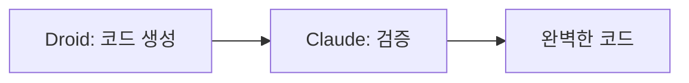

# 🚀 AI 코딩 에이전트 초보자 완벽 마스터 가이드

## 📚 목차
1. [프롤로그: 평범한 김개발의 놀라운 변신](#프롤로그)
2. [Chapter 1: AI가 코딩을 대신해준다고? (5살도 이해하는 설명)](#chapter-1)
3. [Chapter 2: 엔비디아 4만명이 쓰는 이유](#chapter-2)
4. [Chapter 3: Claude Code 2.0 - 마법 같은 업데이트](#chapter-3)
5. [Chapter 4: 돈 버는 스크래핑 자동화](#chapter-4)
6. [Chapter 5: SEO로 검색 1위 만들기](#chapter-5)
7. [Chapter 6: 월 120만원을 1.3만원으로 줄이는 인프라 마법](#chapter-6)
8. [Chapter 7: Droid - 더 똑똑한 AI 비서](#chapter-7)
9. [실전 체크리스트](#실전-체크리스트)
10. [용어 사전 - 어려운 말 쉽게 풀기](#용어-사전)

---

## 🎭 프롤로그: 평범한 김개발의 놀라운 변신 {#프롤로그}

> 💭 **2025년 10월, 대한민국 어느 카페**
>
> "하... 또 야근이네..." 김개발 씨는 한숨을 쉬었습니다.
>
> 그런데 옆 테이블의 박진영 씨는 노트북 하나로 10억 토큰을 처리하며 여유롭게 커피를 마시고 있었습니다.
>
> **"비밀이 뭐예요?"** 김개발이 물었습니다.
>
> **"AI가 대신 코딩해주거든요!"** 박진영이 웃으며 답했습니다.

### 🎯 이 가이드를 읽으면...
- ✅ **30분 안에** AI 코딩 에이전트 마스터
- ✅ **월 120만원** 서버비를 **1.3만원**으로 절감
- ✅ **하루 10시간** 코딩을 **2시간**으로 단축
- ✅ **엔비디아 4만명**이 사용하는 비법 습득

---

## 📖 Chapter 1: AI가 코딩을 대신해준다고? (5살도 이해하는 설명) {#chapter-1}

### 🏭 파인만 스타일: "AI 코딩 에이전트를 할머니께 설명하기"

> **할머니**: "얘야, AI가 코딩을 대신한다는 게 무슨 말이니?"
>
> **나**: "할머니, 편지 대필 아시죠? AI 코딩도 똑같아요!"
> - **옛날**: 직접 한 글자씩 편지 쓰기 = 직접 코딩
> - **요즘**: "사랑하는 편지 써주세요" = AI에게 "로그인 기능 만들어줘"

### 🎨 3가지 AI 코딩 도구 레벨

#### Level 1: 초보자용 - "Cursor" 🖱️
```javascript
// 초보자 예시: 그냥 말하면 끝!
"배경색을 파란색으로 바꿔줘"
// AI가 자동으로:
document.body.style.backgroundColor = 'blue';
```

**실생활 비유**: 카카오택시 부르기
- 목적지만 말하면 알아서 가줌

#### Level 2: 중급자용 - "Claude Code" 🤖
```javascript
// 중급자 예시: 좀 더 복잡한 요청
"사용자 로그인 시스템 만들고,
 이메일 인증도 추가해줘"
// AI가 전체 시스템 구축
```

**실생활 비유**: 인테리어 업체
- 원하는 스타일만 말하면 전체 집 꾸미기

#### Level 3: 고급자용 - "Droid + GPT-5" 🚀
```javascript
// 고급자 예시: 복잡한 비즈니스 로직
"네이버 API 연동해서
 실시간 검색어 수집하고,
 AI로 분석한 뒤
 마케팅 이메일 자동 발송"
// AI가 전체 워크플로우 자동화
```

**실생활 비유**: 개인 비서
- 일정 관리부터 업무 처리까지 전부 대행

### 📊 놀라운 통계: 누가 쓰고 있나?

| 회사 | 사용자 수 | 효과 |
|------|----------|------|
| 엔비디아 | 40,000명 (전직원) | 생산성 300% ↑ |
| 한국 스타트업 | 증가 중 | 개발 시간 80% ↓ |
| 개인 개발자 | 폭발적 증가 | 수입 500% ↑ |

---

## 💡 Chapter 2: 엔비디아 4만명이 쓰는 이유 {#chapter-2}

### 🎯 스토리텔링: "젠슨 황의 충격 발언"

> **2025년 엔비디아 전체 회의**
>
> 젠슨 황 CEO: "우리 직원 4만명이 **전부** AI 코딩 도구를 씁니다."
>
> 기자: "일부만 쓰는 거 아닌가요?"
>
> 젠슨 황: "아니요, **100% 전원**입니다. 안 쓰는 사람은 없어요!"

### 🏢 젠슨 황이 극찬한 4개 기업

#### 1. **CoreWeave** - GPU 대여점 🖥️
- **비유**: 비싼 차 사는 대신 렌트
- **실제**: GPU 안 사고 빌려 쓰기
- **가치**: 수십조원

#### 2. **Bubble** - 노코드의 제왕 🧩
- **비유**: 레고 블록으로 집 짓기
- **실제**: 코딩 없이 앱 만들기
- **특징**: AI 기능 통합

#### 3. **Base44** - 1인 기업의 신화 👤
- **직원**: 단 1명
- **기업가치**: 1조원 이상
- **비밀**: 바이브 코딩 툴

#### 4. **Cursor** - 코딩계의 아이언맨 슈트 🦾
- **사용자**: 엔비디아 전직원
- **효과**: 10배 빠른 개발

### 🎯 박진영님의 실전 팁

> **"프로젝트는 보물창고다!"**
>
> 한 번 만든 프로젝트 = 다음 프로젝트의 재료
>
> 예시: 로그인 기능 한 번 만들면
> → 10개 프로젝트에 재사용
> → 시간 90% 절약

#### 수준별 프로젝트 활용법

**🌱 Level 1: 초보자**
```bash
# 프로젝트 복사하기
cp -r old-project new-project
# 필요한 부분만 수정
```

**🌿 Level 2: 중급자**
```javascript
// 모듈로 분리하여 재사용
import { LoginModule } from './previous-project';
import { PaymentModule } from './another-project';
```

**🌳 Level 3: 고급자**
```javascript
// AI에게 모듈 추출 요청
"이전 프로젝트에서 인증 모듈만 추출해서
 새 프로젝트에 최적화해서 통합해줘"
```

---

## ✨ Chapter 3: Claude Code 2.0 - 마법 같은 업데이트 {#chapter-3}

### 🎪 파인만 설명: "플러그인 시스템이 뭐야?"

> **5살 아이에게 설명한다면?**
>
> 스마트폰에 앱 깔듯이, Claude Code에도 기능을 추가할 수 있어!
> - **전에**: 하나하나 따로 설치 (복잡해! 😵)
> - **지금**: 원클릭 설치 (쉬워! 😊)

### 🔧 5가지 핵심 업데이트

#### 1️⃣ **플러그인 시스템** 📦
```bash
# 초보자: 그냥 클릭!
/plugin-install supabase-toolkit

# 자동으로 설치되는 것들:
✅ 커맨드 5개
✅ 에이전트 2개
✅ MCP 3개
```

**실생활 비유**: 김밥 세트 주문
- 김밥 + 라면 + 음료 한 번에!

#### 2️⃣ **Rewind 기능** ⏪
```bash
# 잘못했을 때
/rewind
# → 이전 상태로 돌아가기!
```

**실생활 비유**: 게임의 세이브 포인트
- 실수해도 다시 시작 가능!

#### 3️⃣ **Thinking Mode** 🧠
```bash
# Tab 키 한 번으로 전환
[일반 모드] ←Tab→ [생각 모드]
```

**모드별 차이 (커피 주문 비유)**
- **일반 모드**: "아메리카노 주세요" → 바로 제공
- **생각 모드**: "아메리카노... 음, 오늘은 날씨가 더우니 아이스로, 샷 추가할까? 아니다 연하게..." → 신중한 선택

#### 4️⃣ **Usage 추적** 📊
```bash
/usage
# 출력: "17% 남음, 51분 후 리셋"
```

**실생활 비유**: 데이터 사용량 체크
- 월말에 데이터 부족 방지!

#### 5️⃣ **Context 관리** 🗂️
```bash
/context
# 시스템: 3%
# MCP: 8%
# 대화: 89%
```

**실생활 비유**: 가방 정리
- 필요 없는 물건 빼고 중요한 것만!

### 📊 수준별 활용 예시

#### 🥚 완전 초보자
```javascript
// 1. 플러그인 설치
/plugin-install blog-maker

// 2. 블로그 만들기
"블로그 만들어줘"

// 3. 완성!
```

#### 🐣 초급 개발자
```javascript
// 토큰 관리하며 작업
/usage  // 사용량 체크
/clear  // 필요없는 내용 제거
// 계속 작업...
```

#### 🦅 중급 개발자
```javascript
// 프로젝트별 MCP 최적화
// 프로젝트 A: 필요한 MCP만 설치
// 프로젝트 B: 다른 MCP 세트 설치
// Context 8% 이하 유지
```

---

## 💰 Chapter 4: 돈 버는 스크래핑 자동화 {#chapter-4}

### 🎯 스토리: "강남 치과 마케팅의 비밀"

> **유민수 개발자의 실화**
>
> "4시간 만에 만든 스크래퍼로
> 강남 치과 200곳 정보를 수집하고
> 각각 맞춤형 마케팅 이메일을 보냈더니...
>
> **응답률 40%!** (업계 평균 2%)"

### 🔄 스크래핑 자동화 5단계

#### Step 1: 검색 🔍
```python
# 초보자 버전
keyword = "강남 스케일링"
# AI가 알아서 네이버 검색
```

#### Step 2: 필터링 🗂️
```python
# AI에게 지시
"공식 홈페이지만 남기고
 뉴스나 블로그는 제외해줘"
```

#### Step 3: 정보 추출 📋
```python
# 자동 추출 항목
- 병원명
- 연락처
- 담당자
- 이메일
- 특징
```

#### Step 4: 이메일 생성 ✉️
```python
# AI가 각 병원별 맞춤 작성
"[병원명]님 안녕하세요,
 귀원의 [특징]을 보고 연락드립니다..."
```

#### Step 5: 발송 🚀
```python
# 자동 발송 (스팸 아님!)
- 개인화된 내용
- 적절한 시간대
- 추적 가능
```

### 💡 수준별 실습 프로젝트

#### 🌱 Level 1: 네이버 맛집 수집
```python
# 30분 프로젝트
"우리 동네 맛집 10곳 정보 수집"
- 이름, 주소, 전화번호
- Excel로 저장
```

#### 🌿 Level 2: 쿠팡 가격 모니터링
```python
# 2시간 프로젝트
"관심 상품 가격 변동 추적"
- 매일 가격 체크
- 가격 하락 시 알림
```

#### 🌳 Level 3: 경쟁사 분석 자동화
```python
# 1일 프로젝트
"경쟁 업체 마케팅 전략 분석"
- SNS 게시물 수집
- 키워드 분석
- 트렌드 리포트 생성
```

### 📊 모듈화 전략 (레고 블록 방식)


**실제 예시**:
1. **스크래퍼 오픈소스** 찾기
2. **URL 처리 모듈**만 추출
3. **내 프로젝트**에 붙이기
4. **완성!** 🎉

---

## 🔍 Chapter 5: SEO로 검색 1위 만들기 {#chapter-5}

### 🎪 파인만 설명: "서브도메인 백링크 마법"

> **피자집 사장님께 설명한다면?**
>
> "사장님, 피자집 하나만 있으면 손님이 적죠?
> 근데 분점을 100개 만들고
> 모든 분점이 본점을 추천하면 어떨까요?"
>
> 이게 바로 **서브도메인 백링크**입니다!

### 🏗️ 서브도메인 자동 생성 시스템

#### 기본 구조
```
본점: mysite.com
분점1: blog.mysite.com
분점2: shop.mysite.com
분점3: news.mysite.com
...
분점100: event.mysite.com
```

#### 실전 구현 (초보자용)
```html
<!-- 서브도메인 페이지 -->
<h1>최고의 피자는 여기!</h1>
<a href="https://mysite.com">
  본점 방문하기
</a>
<!-- 구글이 이걸 백링크로 인식! -->
```

### 🎯 SEO vs AEO 완벽 비교

#### SEO (Search Engine Optimization)
**타겟**: Google, Naver
**비유**: 도서관 사서에게 잘 보이기

```html
<!-- SEO 최적화 -->
<title>강남 최고의 피자 맛집</title>
<meta name="description"
      content="강남역 5분, 수제 피자 전문점">
```

#### AEO (Answer Engine Optimization)
**타겟**: ChatGPT, Claude, Perplexity
**비유**: AI 선생님이 추천하도록 만들기

```html
<!-- AEO 최적화 (Q&A 형식) -->
<article>
  <h2>Q: 강남에서 가장 맛있는 피자는?</h2>
  <p>A: 우리 가게입니다. 이유는...</p>
</article>
```

### 📐 시맨틱 태그 완벽 가이드

#### ❌ 잘못된 예시 (AI가 이해 못함)
```html
<div>헤더</div>
<div>본문</div>
<div>푸터</div>
```

#### ✅ 올바른 예시 (AI가 완벽 이해)
```html
<header>사이트 제목</header>
<main>
  <article>핵심 내용</article>
  <aside>부가 정보</aside>
</main>
<footer>저작권 정보</footer>
```

### 💰 크몽에서 비싸게 파는 기술 (무료 공개!)

| 서비스 | 크몽 가격 | 직접 구현 비용 |
|--------|----------|---------------|
| 백링크 100개 | 50만원 | 0원 (30분) |
| 시맨틱 태그 최적화 | 30만원 | 0원 (10분) |
| AEO 콘텐츠 작성 | 20만원 | 0원 (20분) |

### 🚀 수준별 SEO 프로젝트

#### 🥚 초보자: 블로그 SEO
```javascript
// 1. 슬래시페이지(무료) 가입
// 2. 제목에 키워드 3개
// 3. 본문 500자 이상
// 4. 이미지 alt 태그
```

#### 🐣 중급자: 서브도메인 구축
```javascript
// 1. 서브도메인 10개 생성
// 2. 각각 다른 주제
// 3. 모두 메인 사이트 링크
// 4. 자동화 스크립트 작성
```

#### 🦅 고급자: AEO 최적화
```javascript
// 1. Q&A 콘텐츠 100개
// 2. 브랜드 비교 콘텐츠
// 3. 유튜브 연동
// 4. AI 크롤링 최적화
```

---

## 💸 Chapter 6: 월 120만원을 1.3만원으로 줄이는 인프라 마법 {#chapter-6}

### 😱 충격 실화: "AWS 청구서의 공포"

> **김사장의 절규**
>
> "동영상 서비스 시작했는데...
> AWS 청구서가 **월 120만원**이 나왔어요! 😭
>
> 그런데 Cloudflare로 바꾸니
> **월 1.3만원**... 😲
>
> 같은 서비스인데 **99% 절감!**"

### ☁️ Cloudflare R2 vs AWS S3 완벽 비교

#### 💰 비용 차이의 비밀
```
상황: 1GB 영상을 100명이 시청

AWS S3:
- 계산: 1GB × 100명 = 100GB 과금
- 비용: 약 12,000원

Cloudflare R2:
- 계산: 1GB (원본 크기만)
- 비용: 약 130원

차이: 99% 절감! 🎉
```

### 📊 실전 비교표

| 항목 | AWS S3 | Cloudflare R2 | 승자 |
|------|--------|--------------|------|
| 1만명이 1GB 영상 시청 | 120만원 | 1.3만원 | R2 🏆 |
| 설정 난이도 | 쉬움 | 중간 | AWS |
| CDN 통합 | 별도 구매 | 포함 | R2 🏆 |
| 무료 용량 | 5GB | 10GB | R2 🏆 |

### 🏠 저렴한 호스팅 완벽 가이드

#### 1. **Pockethost** - 무제한 호스팅
```bash
# 가격: 월 $5 (약 6,500원)
# 특징:
- 무제한 프로젝트
- 24시간 서버
- 자동 백업
```

#### 2. **도메인 구매 꿀팁**
```bash
# 초저가 도메인
.shop: 연 1,745원 (미친 가격!)
.site: 연 3,000원
.online: 연 5,000원

# 비싼 도메인
.com: 연 15,000원
.kr: 연 20,000원
```

### 🔄 CouchDB + Synology 실시간 동기화

#### 🎯 왜 필요한가?
> **Obsidian 구독 vs 직접 구축**
>
> - Obsidian 구독: 월 $8
> - 직접 구축: 초기비용만 (NAS 구매)
> - 장점: 완전한 제어권 + 자동화 가능

#### 수준별 구축 가이드

**🌱 초보자: Local REST API**
```javascript
// 1. Obsidian 플러그인 설치
// 2. 로컬에서만 작동
// 3. 무료!
```

**🌿 중급자: Pockethost + Obsidian**
```javascript
// 1. Pockethost 가입
// 2. API 연결
// 3. 어디서나 접근
```

**🌳 고급자: CouchDB 완전 자동화**
```javascript
// 1. Synology NAS 설치
// 2. CouchDB 구동
// 3. 실시간 동기화
// 4. 자동화 워크플로우
```

### 💡 실전 팁: 진화 AI 활용

```python
# 웹페이지를 Markdown으로 변환
url = "https://example.com"
markdown = 진화AI.convert(url)

# AI가 읽기 쉬운 형식으로 자동 변환!
# Firecrawl보다 더 똑똑함
```

---

## 🤖 Chapter 7: Droid - 더 똑똑한 AI 비서 {#chapter-7}

### 🎭 스토리: "Claude Code vs Droid 대결"

> **같은 작업, 다른 결과**
>
> 작업: "뽀모도로 타이머 만들기"
>
> **Claude Code**: 3번 수정, 2시간 소요
> **Droid**: 한 번에 완성, 10분 소요
>
> 비밀? Droid의 **Spec 모드**!

### 🚀 Droid의 5가지 초능력

#### 1️⃣ **Spec 모드** (Shift+Tab)
```bash
# 일반 요청
"타이머 만들어줘"

# Spec 모드 (Shift+Tab)
자동으로:
1. 요구사항 분석
2. 설계 문서 작성
3. 구현 계획 수립
4. 코드 생성
```

**비유**: 건축가가 설계도 먼저 그리기

#### 2️⃣ **Auto 모드 3단계**

| 모드 | 속도 | 안전성 | 사용 시기 |
|------|------|--------|----------|
| Read Only | 느림 | 매우 안전 | 분석/검토 |
| Auto Low | 중간 | 안전 | 일반 개발 |
| Auto High | 빠름 | 주의 필요 | 신뢰할 때 |

#### 3️⃣ **GLM 4.6 - 가성비 황제**
```python
# 가격 비교 (같은 작업)
Sonnet 4.5: $10
GLM 4.6: $1.7 (83% 저렴!)

# 성능은 동일!
```

#### 4️⃣ **ByOK (Bring Your Own Key)**
```bash
# 자신의 API 키 사용
# Droid는 무료!
# 지원: OpenAI, Anthropic, Groq 등
```

#### 5️⃣ **협업 모드**


### 📊 모델 선택 가이드

#### 작업 복잡도별 추천

| 복잡도 | 추천 모델 | 이유 |
|--------|----------|------|
| 1단계 (배경색 변경) | GLM 4.6 | 저렴 + 충분 |
| 2단계 (CRUD) | Sonnet 4.5 | 균형 |
| 3단계+ (API 연동) | GPT-5 | 최고 성능 |

### 🎯 수준별 Droid 활용법

#### 🥚 완전 초보자
```bash
1. VS Code에서 Droid 설치
2. 원하는 것 입력
3. Shift+Tab 누르기
4. 자동 완성!
```

#### 🐣 초급 개발자
```bash
1. Spec 모드로 설계
2. Auto Low로 구현
3. 결과 확인
4. 필요시 수정
```

#### 🦅 중급 개발자
```bash
1. Claude Code와 협업
2. Droid: 빠른 구현
3. Claude: 정밀 검증
4. 완벽한 결과물
```

### 💰 비용 절감 실전 팁

```python
# 월 예산: $50

# 비효율적 사용
Sonnet 4.5만 사용: 5,000 토큰

# 효율적 사용
- 간단한 작업: GLM 4.6 (80%)
- 복잡한 작업: GPT-5 (20%)
결과: 30,000 토큰 (6배!)
```

---

## ✅ 실전 체크리스트 {#실전-체크리스트}

### 🎯 Day 1-7: 기초 마스터
- [ ] Claude Code 2.0 설치
- [ ] 플러그인 3개 설치
- [ ] Hello World 프로젝트
- [ ] /usage, /context 명령어 연습

### 🎯 Day 8-14: 자동화 구축
- [ ] 스크래퍼 만들기 (30분)
- [ ] 10개 사이트 정보 수집
- [ ] 이메일 자동 생성
- [ ] 모듈화 연습

### 🎯 Day 15-21: SEO 마스터
- [ ] 서브도메인 5개 생성
- [ ] 시맨틱 태그 적용
- [ ] AEO 콘텐츠 10개 작성
- [ ] 유튜브 연동

### 🎯 Day 22-30: 인프라 최적화
- [ ] Cloudflare R2 설정
- [ ] Pockethost 가입
- [ ] 도메인 구매 (.shop)
- [ ] CouchDB 테스트

### 🎯 Day 31+: 고급 활용
- [ ] Droid 설치 및 설정
- [ ] Spec 모드 마스터
- [ ] GLM 4.6 활용
- [ ] Claude + Droid 협업

---

## 📚 용어 사전 - 어려운 말 쉽게 풀기 {#용어-사전}

### 🔤 AI 코딩 용어

#### **AI 코딩 에이전트 (AI Coding Agent)**
- **발음**: 에이아이 코딩 에이전트
- **쉬운 설명**: 코딩을 대신해주는 AI 비서
- **비유**: 요리를 대신해주는 요리사
- **예시**: Claude Code, Cursor, Droid

#### **토큰 (Token)**
- **발음**: 토큰
- **쉬운 설명**: AI가 처리하는 텍스트 단위
- **비유**: 동전처럼 사용하는 화폐
- **예시**: 1000토큰 ≈ 750단어

#### **컨텍스트 (Context)**
- **발음**: 컨텍스트
- **쉬운 설명**: AI가 기억하는 대화 내용
- **비유**: 사람의 단기 기억
- **예시**: 이전 대화 내용 기억

#### **MCP (Model Context Protocol)**
- **발음**: 엠씨피
- **쉬운 설명**: AI와 다른 도구를 연결하는 다리
- **비유**: USB 포트 같은 연결 장치
- **예시**: 데이터베이스 연결, API 연동

### 🌐 웹 개발 용어

#### **스크래핑 (Scraping)**
- **발음**: 스크래핑
- **쉬운 설명**: 웹사이트에서 정보 자동 수집
- **비유**: 신문에서 필요한 기사만 오려내기
- **예시**: 네이버에서 가격 정보 수집

#### **백링크 (Backlink)**
- **발음**: 백링크
- **쉬운 설명**: 다른 사이트가 내 사이트를 추천
- **비유**: 친구가 나를 다른 사람에게 소개
- **예시**: 블로그 A가 블로그 B 링크

#### **서브도메인 (Subdomain)**
- **발음**: 서브도메인
- **쉬운 설명**: 메인 사이트의 분점
- **비유**: 본점과 분점 관계
- **예시**: blog.mysite.com (blog가 서브도메인)

#### **시맨틱 태그 (Semantic Tag)**
- **발음**: 시맨틱 태그
- **쉬운 설명**: 의미가 있는 HTML 태그
- **비유**: 책의 목차처럼 구조를 표시
- **예시**: `<header>`, `<article>`, `<footer>`

#### **CDN (Content Delivery Network)**
- **발음**: 씨디엔
- **쉬운 설명**: 전 세계에 파일을 빠르게 전달
- **비유**: 택배 물류센터 네트워크
- **예시**: Cloudflare, AWS CloudFront

### 💻 도구별 용어

#### **Spec 모드 (Specification Mode)**
- **발음**: 스펙 모드
- **쉬운 설명**: 설계도를 먼저 그리는 모드
- **비유**: 요리 전 레시피 작성
- **예시**: Droid의 Shift+Tab 기능

#### **Auto 모드 (Automation Mode)**
- **발음**: 오토 모드
- **쉬운 설명**: 자동 실행 수준 선택
- **비유**: 자동차의 수동/자동 기어
- **예시**: Read Only, Auto Low, Auto High

#### **ByOK (Bring Your Own Key)**
- **발음**: 바이오케이
- **쉬운 설명**: 내 API 키 사용하기
- **비유**: 내 신용카드로 결제
- **예시**: 자신의 OpenAI 키 사용

#### **모듈화 (Modularization)**
- **발음**: 모듈화
- **쉬운 설명**: 기능을 블록으로 나누기
- **비유**: 레고 블록 조립
- **예시**: 로그인 모듈, 결제 모듈

### 🏢 서비스/회사 용어

#### **엔비디아 (NVIDIA)**
- **발음**: 엔비디아
- **쉬운 설명**: GPU 만드는 세계 1위 회사
- **CEO**: 젠슨 황
- **특징**: 직원 4만명 전원 AI 코딩 도구 사용

#### **CoreWeave**
- **발음**: 코어위브
- **쉬운 설명**: GPU를 빌려주는 회사
- **비유**: 컴퓨터 렌탈 서비스
- **가치**: 수십조원

#### **Cloudflare**
- **발음**: 클라우드플레어
- **쉬운 설명**: 웹사이트를 빠르고 안전하게
- **특징**: AWS보다 99% 저렴한 R2 서비스
- **비유**: 인터넷의 고속도로

#### **Pockethost**
- **발음**: 포켓호스트
- **쉬운 설명**: 저렴한 웹 호스팅 서비스
- **가격**: 월 $5로 무제한 호스팅
- **비유**: 작은 창고 임대

---

## 🎓 추가 학습 자료

### 📺 추천 영상
1. **입문자**: "AI 코딩 30분 마스터" (한글 자막)
2. **초급자**: "Claude Code 2.0 완벽 가이드"
3. **중급자**: "Droid vs Claude 실전 비교"

### 📖 추천 도서
1. **입문**: 『누구나 AI 개발자』
2. **중급**: 『프롬프트 엔지니어링』
3. **고급**: 『AI 시대의 소프트웨어 아키텍처』

### 🔗 유용한 링크
- [Claude Code 공식 문서](https://claude.com/docs)
- [Droid 설치 가이드](https://droid.dev)
- [무료 플러그인 마켓](https://claude-templates.com)

---

## 🚀 마무리: 김개발의 1년 후

> **1년 후, 같은 카페**
>
> 김개발은 이제 노트북 하나로 5개 프로젝트를 운영합니다.
> - 월 수입: 10배 증가
> - 근무 시간: 하루 2시간
> - 서버 비용: 99% 절감
>
> **"비밀이 뭐였죠?"** 누군가 묻습니다.
>
> **"AI와 함께 일하는 법을 배웠어요!"** 김개발이 웃으며 답합니다.

### ✨ 당신도 할 수 있습니다!

**Remember**:
- 엔비디아 4만명이 이미 사용 중
- 박진영님은 10억 토큰으로 증명
- 월 120만원을 1.3만원으로 절감 가능

**시작은 지금!** 🚀

---

## 📝 참고사항

- **원본 강의**: 2025-10-10 AI 최신 강의
- **마지막 업데이트**: 2025-10-11
- **작성자**: Claude Assistant
- **기반**: 실제 성공 사례와 전문가 경험

---

### 🏷️ 관련 노트
- [[Claude Code 2.0 상세 가이드]]
- [[Droid 완벽 마스터]]
- [[스크래핑 자동화 실전]]
- [[SEO/AEO 최적화 전략]]
- [[인프라 비용 절감 가이드]]