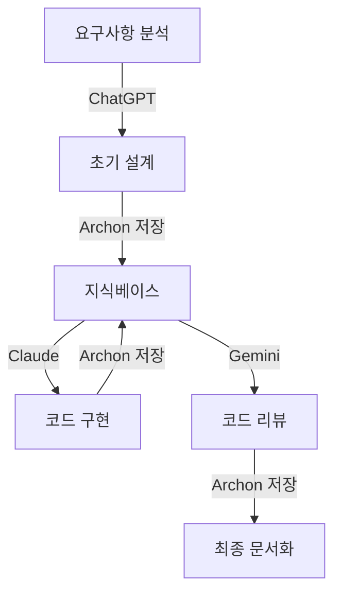

# Archon - AI 협업 플랫폼 초보 개발자 가이드

## 📋 목차 (내부 링크 활용)
1. [[#스토리로 시작하기 - Archon이 왜 필요할까?]]
2. [[#Archon이란 무엇인가? (파인만 기법)]]
3. [[#핵심 개념 쉽게 이해하기]]
4. [[#실전 단계별 예제]]
5. [[#활용 사례와 워크플로우]]
6. [[#장단점 분석]]
7. [[#다음 단계 학습 가이드]]

---

## 스토리로 시작하기 - Archon이 왜 필요할까?

### 📖 개발자 민수의 하루

민수는 신입 개발자입니다. 오늘도 새로운 프로젝트를 시작했는데요, 문제가 생겼습니다.

**🤔 민수의 고민:**
- ChatGPT에게 물어본 내용을 다시 찾을 수가 없어요
- Claude에게 설명한 프로젝트 배경을 또 설명해야 해요
- 어제 배운 내용을 오늘 다시 AI에게 물어봐야 해요
- 여러 AI 도구를 사용하는데 정보가 다 흩어져 있어요

**😊 Archon을 만난 후:**
민수는 이제 한 곳에서 모든 AI 도구와 대화하고, 프로젝트 지식을 저장하며, 작업을 관리합니다. 마치 **똑똑한 개인 비서**가 생긴 것처럼요!

> **💡 일상 비유:** Archon은 마치 "도서관 사서"와 같습니다. 당신이 읽은 모든 책(정보)을 기억하고, 필요할 때 정확히 찾아주며, 심지어 관련된 다른 책까지 추천해주는 똑똑한 사서 말이죠.

---

## Archon이란 무엇인가? (파인만 기법)

### 5살 아이에게 설명한다면...

"Archon은 네가 좋아하는 장난감들을 정리하는 마법 상자야. 레고, 자동차, 인형을 다 한 곳에 모아두면, '빨간 자동차 어디 있어?'라고 물으면 바로 찾아주는 거지!"

### 조금 더 자세히 설명하면...

**Archon = AI 코딩 도우미를 위한 중앙 지식 관리 플랫폼**

일반 용어로 풀어쓰면:
- **AI 코딩 도우미**: ChatGPT, Claude 같은 AI 비서들
- **중앙**: 모든 정보가 한 곳에 모이는
- **지식 관리**: 당신이 배운 것, 작업한 것을 저장하고 정리하는
- **플랫폼**: 웹사이트처럼 사용할 수 있는 프로그램

---

## 핵심 개념 쉽게 이해하기

### 1. 🧠 지식 베이스 (Knowledge Base)
**개념:** 당신의 프로젝트 정보를 저장하는 "디지털 노트"

**실생활 비유:**
- 수학 공책에 공식을 적어두듯이
- Archon에 프로젝트 정보를 저장해요
- 나중에 필요할 때 바로 꺼내볼 수 있어요

**왜 중요한가?**
AI는 대화를 기억하지 못합니다. 하지만 Archon은 모든 것을 기억해줍니다!

### 2. 🔍 시맨틱 검색 (Semantic Search)
**개념:** "의미를 이해하는 검색"

**전통 검색 vs 시맨틱 검색:**
- **전통 검색:** "로그인 버튼" 검색 → "로그인 버튼" 단어만 찾음
- **시맨틱 검색:** "로그인 버튼" 검색 → "회원 인증 UI", "사용자 접근 화면"도 찾음

**일상 비유:**
친구에게 "배고파"라고 하면, 친구는 "식당", "간식", "배달" 등을 생각하죠. 단순히 "배고파"라는 단어만 찾는 게 아니라 **의미를 이해하는 것**입니다.

### 3. 🤖 MCP (Model Context Protocol)
**개념:** AI와 도구들이 대화하는 "공통 언어"

**5살 아이 설명:**
한국 친구와 미국 친구가 함께 놀고 싶은데 언어가 달라요. 그래서 "번역기"를 사용하는 거예요. MCP는 AI들을 위한 번역기입니다!

**실무 설명:**
- ChatGPT, Claude, Gemini는 각자 다른 방식으로 작동해요
- MCP는 이들이 모두 Archon과 대화할 수 있게 "표준 규칙"을 제공합니다
- 마치 USB처럼 어떤 AI든 꽂으면 작동하는 거죠!

### 4. 🌐 웹 크롤링 (Web Crawling)
**개념:** 웹사이트에서 자동으로 정보 수집하기

**일상 비유:**
도서관에서 필요한 책을 일일이 읽는 대신, 로봇이 대신 읽고 요약본을 만들어주는 것!

**Archon에서의 활용:**
```
당신: "이 블로그 글 저장해줘"
Archon: "알겠습니다! 내용을 읽고 핵심만 정리해서 저장할게요"
```

### 5. 💾 벡터 임베딩 (Vector Embeddings)
**개념:** 단어를 숫자로 바꿔서 컴퓨터가 "의미"를 이해하게 하는 기술

**5살 아이 설명:**
"사과"를 빨간색 공으로, "바나나"를 노란색 막대로 표현하는 거예요. 그럼 컴퓨터도 "사과와 바나나는 과일이라 비슷하구나!" 하고 이해할 수 있어요.

**기술적 설명:**
```
"고양이" → [0.2, 0.8, 0.1, 0.9]  (숫자 리스트)
"강아지" → [0.3, 0.7, 0.2, 0.8]  (비슷한 숫자)
"자동차" → [0.9, 0.1, 0.8, 0.2]  (다른 숫자)
```
컴퓨터는 숫자 리스트가 가까우면 "의미가 비슷하다"고 판단합니다!

---

## 실전 단계별 예제

### 🌱 예제 1: 기초 - 첫 지식 저장하기 (초보자용)

**시나리오:** 처음 배운 Python 코드를 저장하고 싶어요!

**단계별 실습:**

```python
# 1단계: Archon에 로그인하고 새 프로젝트 생성
# 프로젝트 이름: "나의 Python 학습"

# 2단계: 배운 코드를 문서로 저장
# 제목: "변수와 출력 기초"
# 내용:
"""
변수는 값을 저장하는 상자입니다.
name = "민수"  # 이름을 저장하는 상자
age = 25       # 나이를 저장하는 상자

print()는 화면에 글자를 보여주는 명령입니다.
print(name)    # 화면에 "민수" 출력
print(age)     # 화면에 25 출력
"""

# 3단계: 태그 추가로 나중에 쉽게 찾기
# 태그: #Python기초 #변수 #출력
```

**🤔 생각해보기:**
- 이 문서를 한 달 후 어떻게 검색할까요?
- "출력 명령어"로 검색하면 이 문서가 나올까요?

**✅ 기대 결과:**
나중에 "화면에 글자 보여주기"라고 검색해도 이 문서를 찾을 수 있어요! (시맨틱 검색 덕분)

---

### 🌿 예제 2: 중급 - AI와 프로젝트 협업 (실무 적용)

**시나리오:** ChatGPT와 할 일 관리 앱을 만들고 있어요

**1단계: 프로젝트 컨텍스트 생성**
```markdown
# 프로젝트: 할 일 관리 앱
## 목표
- 사용자가 할 일을 추가/삭제/완료 표시할 수 있는 웹 앱

## 기술 스택
- 프론트엔드: React
- 백엔드: Node.js
- 데이터베이스: SQLite

## 주요 기능
1. 할 일 추가
2. 할 일 목록 보기
3. 할 일 완료 체크
4. 할 일 삭제
```

**2단계: AI에게 작업 요청하고 결과 저장**
```
당신 → ChatGPT: "할 일 추가 버튼 React 컴포넌트 만들어줘"
ChatGPT → 코드 생성
당신 → Archon: 이 코드를 "AddTodoButton 컴포넌트"로 저장
```

**3단계: 다음 날 작업 이어하기**
```
당신 → Claude (새로운 AI): "어제 만든 프로젝트 이어서 할게"
Archon → 자동으로 프로젝트 전체 컨텍스트를 Claude에게 전달
Claude: "할 일 관리 앱이군요! 어제 AddTodoButton까지 만드셨네요.
       다음은 할 일 목록 표시 기능을 만들까요?"
```

**💡 핵심 포인트:**
- 매번 프로젝트를 설명할 필요 없음
- AI가 바뀌어도 작업 컨텍스트 유지
- 코드와 대화 내용 모두 검색 가능

**🤔 생각해보기:**
- 기존 방식(AI 채팅만)과 비교해서 무엇이 편리한가요?
- 팀 프로젝트에서 이 방식을 어떻게 활용할 수 있을까요?

---

### 🌳 예제 3: 고급 - 멀티 AI 워크플로우 (심화 학습)

**시나리오:** 복잡한 기능을 여러 AI의 장점을 활용해서 구현하기

**워크플로우 설계:**



**실전 구현 예시:**

**Phase 1: ChatGPT로 설계**
```
입력: "사용자 인증 시스템 설계해줘 (JWT 기반)"
출력: 상세한 설계 문서
→ Archon에 "인증 시스템 설계 v1" 저장
```

**Phase 2: Claude로 구현**
```
Claude 실행 → Archon이 자동으로 설계 문서 제공
입력: "이 설계대로 Node.js 코드 구현해줘"
출력: auth.js, middleware.js 등
→ Archon에 코드 파일들 저장
```

**Phase 3: Gemini로 리뷰**
```
Gemini 실행 → Archon이 코드 제공
입력: "보안 취약점 검사해줘"
출력: 보안 개선 사항
→ Archon에 "보안 리뷰 리포트" 저장
```

**Phase 4: 통합 문서 자동 생성**
```python
# Archon API 활용 예제
from archon import KnowledgeBase

kb = KnowledgeBase("인증 시스템 프로젝트")

# 모든 단계 정보 수집
design = kb.search("설계")
code = kb.search("코드")
review = kb.search("보안 리뷰")

# 자동 문서화
final_doc = kb.generate_document(
    sections=[design, code, review],
    format="markdown"
)

kb.save(final_doc, "인증시스템_완전가이드.md")
```

**🎯 고급 최적화 기법:**

1. **컨텍스트 체이닝**
```
작업1 결과 → 자동 저장 → 작업2의 입력으로 사용
```

2. **버전 관리**
```
설계 v1 → 구현 v1 → 리뷰 → 설계 v2 → 구현 v2
모든 버전 Archon에 기록
```

3. **AI 특성 활용**
```
ChatGPT: 창의적 아이디어
Claude: 긴 코드 작성
Gemini: 다국어 문서화
→ 각 강점에 맞는 작업 분배
```

**⚠️ 주의사항:**
- API 호출 비용 고려 (각 AI 서비스 유료)
- 너무 복잡한 워크플로우는 오히려 비효율적
- 프로젝트 크기에 맞는 적절한 AI 조합 선택

**🤔 생각해보기:**
- 당신의 프로젝트에서 어떤 AI를 어떤 단계에 활용하면 좋을까요?
- 각 AI의 장단점을 어떻게 파악할 수 있을까요?

---

## 활용 사례와 워크플로우

### 사례 1: 오픈소스 기여자 지민

**Before Archon:**
- 여러 오픈소스 프로젝트의 코드베이스를 매번 설명해야 함
- 기여 가이드를 계속 다시 찾아봄
- 이전 기여 내용을 까먹음

**After Archon:**
```markdown
프로젝트별 지식베이스:
├── React 프로젝트
│   ├── 기여 가이드
│   ├── 내가 고친 버그들
│   └── 코드 스타일 규칙
├── Vue 프로젝트
│   ├── 컴포넌트 구조
│   └── 테스트 작성법
```

**결과:** 작업 시작 시간 70% 단축

---

### 사례 2: 스타트업 개발자 수진

**워크플로우:**
```
아침 9시: Archon에서 어제 작업 내용 확인
         ↓
9시 30분: AI에게 오늘 할 작업 계획 요청
         (Archon이 자동으로 프로젝트 컨텍스트 제공)
         ↓
10시-6시: 개발하면서 중요한 결정사항 Archon에 기록
         ↓
6시: 일일 회고 AI와 작성 (Archon이 오늘 작업 요약)
```

**핵심 효과:**
- 프로젝트 진행 상황 투명하게 기록
- 팀원과 지식 공유 쉬움
- 나중에 "왜 이렇게 했지?" 고민 제로

---

### 사례 3: 학습자 태희

**Archon 학습 시스템:**

```markdown
# 태희의 풀스택 개발 학습 로드맵

## Week 1: HTML/CSS
- 학습 자료: [링크]
- 만든 프로젝트: 포트폴리오 페이지
- 어려웠던 점: Flexbox 레이아웃
- AI 도움받은 내용: Grid vs Flexbox 차이

## Week 2: JavaScript
- 학습 자료: [링크]
- 만든 프로젝트: 계산기 앱
- 어려웠던 점: 비동기 처리
- AI 도움받은 내용: Promise와 async/await
```

**AI 활용법:**
```
태희: "지난주 배운 Flexbox 내용 다시 보여줘"
Archon: [Week 1 자료 제공 + 관련 예제 코드]

태희: "이제 JavaScript로 Flexbox 동적으로 조작하고 싶어"
Archon: [Week 1 + Week 2 지식 결합한 예제 제시]
```

**학습 효과:**
- 배운 내용 절대 잊어버리지 않음
- 지식이 연결되어 쌓임
- 복습할 때 AI가 맞춤형 문제 출제

---

## 장단점 분석

### ✅ 장점

#### 1. 지속성 (Persistence)
**설명:** AI 대화가 사라지지 않아요
```
일반 ChatGPT: 대화 종료 → 내용 사라짐
Archon + AI: 대화 종료 → Archon에 영구 저장
```

#### 2. 컨텍스트 공유
**설명:** 어떤 AI든 같은 정보를 볼 수 있어요
```
내가 말한 내용 → Archon 저장
→ ChatGPT도 보고, Claude도 보고, Gemini도 봄
```

#### 3. 검색 가능성
**설명:** 6개월 전 작업도 의미로 찾을 수 있어요
```
검색: "로그인 오류 해결"
결과: 작년에 비슷한 문제 해결한 내용까지 모두 찾음
```

#### 4. 협업 효율성
**설명:** 팀원들도 같은 지식 활용
```
팀원 A가 저장한 내용 → 팀원 B도 검색 가능
"누가 이거 알아?" 질문 사라짐
```

---

### ❌ 단점

#### 1. 초기 설정 복잡도
**문제:** Docker, Supabase 등 여러 도구 설치 필요

**해결책:**
- 공식 문서 단계별로 천천히 따라하기
- 커뮤니티 도움 요청하기
- 클라우드 호스팅 서비스 이용 (설정 간소화)

**초보자 팁:**
```bash
# 가장 쉬운 시작 방법
git clone https://github.com/coleam00/Archon
cd Archon
docker compose up  # 이 명령어 하나로 대부분 해결!
```

#### 2. 비용
**문제:**
- Supabase 데이터베이스 (무료 플랜 제한적)
- OpenAI API 사용료
- 서버 호스팅 비용

**현실적인 비용 예상:**
```
소규모 개인 사용: 월 $10-20
팀 사용 (5명): 월 $50-100
대규모 기업: 월 $500+
```

**절약 팁:**
- 무료 LLM (Ollama 로컬 실행) 활용
- Supabase 무료 플랜으로 시작
- 중요한 작업만 유료 API 사용

#### 3. 학습 곡선
**문제:** MCP, 벡터 데이터베이스 등 새로운 개념 많음

**단계별 학습 추천:**
```
1주차: Archon 기본 사용 (문서 저장/검색)
2주차: 단일 AI 연동 (ChatGPT만)
3주차: MCP 개념 이해
4주차: 멀티 AI 활용
```

**⚠️ 피해야 할 실수:**
- 처음부터 모든 기능 사용하려고 하기
- 문서 읽지 않고 무작정 시도하기
- 혼자 해결하려고 하기 (커뮤니티 활용!)

---

### 🔄 대안 도구 비교

| 기능 | Archon | Notion AI | Obsidian + AI | Cursor IDE |
|------|--------|-----------|---------------|------------|
| 멀티 AI 지원 | ✅ | ❌ | △ (플러그인) | ❌ |
| 시맨틱 검색 | ✅ | △ | ❌ | ❌ |
| 코드 프로젝트 관리 | ✅ | △ | ❌ | ✅ |
| 오픈소스 | ✅ | ❌ | ✅ | ❌ |
| 초보자 친화성 | △ | ✅ | △ | ✅ |
| 비용 | 중간 | 낮음 | 낮음 | 중간 |

**언제 Archon을 선택할까?**
- ✅ 여러 AI 도구를 사용하는 경우
- ✅ 지식을 장기간 체계적으로 관리하고 싶을 때
- ✅ 팀과 협업할 때
- ✅ 커스터마이징이 필요할 때

**Archon이 과할 수 있는 경우:**
- ❌ 간단한 개인 메모만 필요할 때 → Notion 추천
- ❌ IDE 내에서만 AI 사용할 때 → Cursor 추천
- ❌ 기술적 설정이 부담스러울 때 → 클라우드 서비스 추천

---

## 다음 단계 학습 가이드

### 📚 학습 로드맵 (4주 완성)

#### Week 1: 기초 다지기
**목표:** Archon 설치하고 첫 문서 저장하기

**학습 내용:**
- [ ] Docker 기본 개념 이해 (YouTube: "Docker 5분 개념")
- [ ] Archon 설치 따라하기
- [ ] 첫 프로젝트 생성
- [ ] 간단한 코드 스니펫 10개 저장

**실습 과제:**
```
나만의 "코드 레시피북" 만들기
- Python 기초 문법 10개
- 자주 쓰는 Git 명령어
- CSS 트릭 모음
```

**체크포인트:**
- Archon 웹 인터페이스 접속 성공
- 검색 기능으로 저장한 내용 찾기 성공

---

#### Week 2: 실전 활용
**목표:** AI와 연동해서 작은 프로젝트 완성

**학습 내용:**
- [ ] MCP 기본 개념 이해
- [ ] ChatGPT 또는 Claude 연동
- [ ] To-Do 앱 만들기 (AI 도움 받으며)

**실습 과제:**
```markdown
# 프로젝트: 간단한 할 일 관리 앱
1. AI에게 HTML 구조 요청
2. 결과를 Archon에 저장
3. AI에게 CSS 스타일 요청 (이전 HTML 참고)
4. 모든 단계 Archon에 기록
```

**체크포인트:**
- AI 응답을 Archon에 저장 성공
- 이전 대화 내용을 새로운 AI에게 전달 성공

---

#### Week 3: 고급 기능
**목표:** 여러 AI 조합해서 복잡한 작업 수행

**학습 내용:**
- [ ] 벡터 검색 원리 이해
- [ ] 웹 크롤링 기능 사용
- [ ] 태스크 관리 기능 활용

**실습 과제:**
```
블로그 글 분석 프로젝트
1. 웹 크롤링으로 기술 블로그 5개 수집
2. ChatGPT로 요약
3. Claude로 핵심 기술 추출
4. Gemini로 한글 번역
5. Archon에서 통합 리포트 생성
```

**체크포인트:**
- 웹 크롤링 성공
- 3개 이상 AI 조합 워크플로우 완성

---

#### Week 4: 마스터 프로젝트
**목표:** 처음부터 끝까지 완전한 앱 개발

**실습 과제:**
```
나만의 포트폴리오 사이트 만들기
- 요구사항 정의 (AI와 브레인스토밍)
- 디자인 (AI 도움)
- 프론트엔드 구현
- 백엔드 API 구현
- 배포
→ 모든 단계 Archon에 체계적으로 기록
```

**최종 목표:**
- 완성된 프로젝트 GitHub에 공개
- Archon 지식베이스를 README로 변환
- 다른 초보자에게 가이드 작성

---

### 🎓 추천 학습 자료

#### 공식 문서
- [Archon GitHub](https://github.com/coleam00/Archon)
- [MCP 공식 문서](https://modelcontextprotocol.io)
- [Supabase 튜토리얼](https://supabase.com/docs)

#### 영상 강의 (무료)
```
YouTube 검색어:
- "Docker for beginners"
- "Vector database explained"
- "AI coding assistant tutorial"
```

#### 커뮤니티
- Archon Discord 서버
- Reddit r/LocalLLaMA
- GitHub Issues

---

### 🚀 실전 프로젝트 아이디어

#### 초급 프로젝트
1. **개인 학습 일지**
   - 매일 배운 내용 기록
   - AI에게 복습 문제 요청
   - 주간 리뷰 자동 생성

2. **코드 스니펫 라이브러리**
   - 자주 쓰는 코드 저장
   - 시맨틱 검색으로 빠르게 찾기
   - AI로 코드 설명 자동 생성

#### 중급 프로젝트
3. **팀 기술 위키**
   - 팀의 모범 사례 수집
   - AI로 온보딩 가이드 자동 생성
   - 신입 개발자 질문 답변 시스템

4. **오픈소스 기여 도우미**
   - 관심 프로젝트 코드베이스 분석
   - 이슈 해결 과정 기록
   - AI와 페어 프로그래밍

#### 고급 프로젝트
5. **AI 앙상블 개발 플랫폼**
   - 각 AI의 강점 분석
   - 작업 유형별 최적 AI 자동 선택
   - 개발 생산성 통계 대시보드

---

### 💡 문제 해결 가이드

#### 자주 묻는 질문 (FAQ)

**Q1: Docker 설치가 안 돼요**
```bash
# Mac 사용자
brew install docker

# Windows 사용자
# Docker Desktop 공식 사이트에서 다운로드
# https://www.docker.com/products/docker-desktop
```

**Q2: Supabase 연결 오류**
```bash
# .env 파일 확인
SUPABASE_URL=your-project-url  # 여기 정확히 입력했나요?
SUPABASE_KEY=your-anon-key     # 키가 맞나요?

# 브라우저에서 Supabase 대시보드 접속 확인
```

**Q3: AI 응답이 저장 안 돼요**
```
체크리스트:
□ MCP 서버가 실행 중인가요?
□ API 키가 올바른가요?
□ 네트워크 연결이 되어 있나요?
□ 브라우저 콘솔에 에러 메시지가 있나요?
```

**Q4: 검색이 이상해요**
```
시맨틱 검색 팁:
❌ "버튼" 검색 (너무 일반적)
✅ "로그인 버튼 클릭 이벤트 처리" (구체적)

❌ 단일 단어 검색
✅ 자연스러운 문장으로 검색
```

---

### 🎯 다음에 배울 것들

**관련 기술 스택:**
1. **Vector Databases**
   - Pinecone
   - Weaviate
   - Qdrant

2. **AI Orchestration**
   - LangChain
   - LlamaIndex
   - AutoGPT

3. **Knowledge Graphs**
   - Neo4j
   - 온톨로지 기초
   - 시맨틱 웹

**심화 학습 경로:**
```
Archon 마스터
    ↓
RAG 시스템 이해
    ↓
커스텀 AI 에이전트 개발
    ↓
엔터프라이즈 AI 플랫폼 구축
```

---

## 마무리하며

### 🎓 핵심 요약

**Archon을 한 문장으로:**
"여러 AI 도우미와 대화한 내용을 한 곳에 모아서, 나중에 의미로 검색할 수 있게 해주는 똑똑한 지식 관리 플랫폼"

**꼭 기억할 3가지:**
1. **지속성:** AI 대화가 사라지지 않음
2. **연결성:** 모든 정보가 의미로 연결됨
3. **협업:** 팀 전체가 같은 지식 공유

---

### 🚀 지금 바로 시작하기

**첫 1시간 체크리스트:**
- [ ] Docker 설치
- [ ] Archon 레포지토리 클론
- [ ] `docker compose up` 실행
- [ ] localhost:3737 접속
- [ ] 첫 프로젝트 생성
- [ ] "Hello World" 코드 저장
- [ ] 검색해서 찾아보기

**첫 주말 목표:**
- [ ] 개인 학습 프로젝트 10개 문서 저장
- [ ] AI 하나 연동해서 대화해보기
- [ ] 시맨틱 검색 경험해보기

---

### 💬 도움 받기

**막혔을 때:**
1. 이 가이드의 "문제 해결 가이드" 섹션 확인
2. GitHub Issues 검색
3. Discord/커뮤니티 질문
4. AI에게 Archon 문서 보여주고 질문

**학습 팁:**
- 완벽하게 이해하려고 하지 마세요
- 일단 써보면서 배우세요
- 작은 성공을 축하하세요
- 커뮤니티와 함께 성장하세요

---

## 연결된 노트
- [[MCP 시스템 심화 가이드]]
- [[Vector Database 기초]]
- [[AI 협업 도구 비교 분석]]
- [[Docker 입문 가이드]]
- [[Supabase 활용법]]

---

**마지막 조언:**
> "가장 좋은 학습 방법은 실제로 사용하는 것입니다. 이 가이드를 읽는 것보다, 지금 바로 Archon을 설치하고 당신의 첫 노트를 저장해보세요. 실수해도 괜찮습니다. 그것도 Archon에 기록해두면 나중에 다시 안 하게 되니까요!"

**Happy Coding! 🎉**