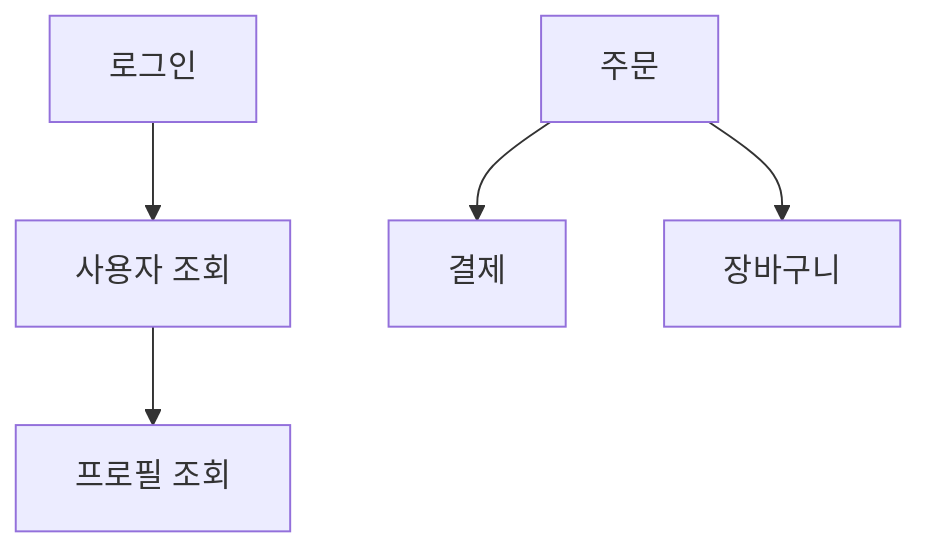

# MoAI-ADK 완벽 가이드 Part 2: 실전 활용

> **🎯 이 노트의 목적**: Part 1에서 배운 기초를 바탕으로 실제 프로젝트에서 MoAI-ADK를 효과적으로 활용하는 방법을 배웁니다.

---

## 📋 목차

1. [[#3단계 워크플로우 완전 정복]]
2. [[#TRUST 5원칙 실전 적용]]
3. [[#TAG 시스템 고급 활용]]
4. [[#언어별 실전 예제]]
5. [[#문제 해결과 디버깅]]
6. [[#팀 협업 전략]]
7. [[#고급 팁과 트릭]]
8. [[#용어 설명]]

---

## 3단계 워크플로우 완전 정복

### 워크플로우 전체 흐름 이해하기 🔄

**MoAI-ADK의 핵심은 3단계 파이프라인입니다:**

```
1️⃣ SPEC      →     2️⃣ BUILD     →     3️⃣ SYNC
(무엇을?)         (어떻게?)           (문서화)

명세 작성    →   TDD 구현     →   문서 동기화
```

**식당에 비유하면:**
1. **SPEC**: 손님이 주문 (무엇을 만들지 결정)
2. **BUILD**: 요리사가 조리 (실제로 만들기)
3. **SYNC**: 서빙 및 설명 (완성된 것 전달)

### 1단계: SPEC 작성 - 명확한 설계도 그리기 🏗️

#### 명령어
```text
/alfred:1-spec "기능 설명"
```

#### 좋은 SPEC vs 나쁜 SPEC

**❌ 나쁜 SPEC 예시:**
```text
/alfred:1-spec "로그인 만들어줘"
```

**문제점:**
- 너무 모호함
- 어떤 인증 방식인지 불명확
- 예외 상황 처리 없음

**✅ 좋은 SPEC 예시:**
```text
/alfred:1-spec "JWT 기반 이메일/비밀번호 로그인. 3회 실패 시 5분 잠금. 성공 시 액세스/리프레시 토큰 반환"
```

**왜 좋은가:**
- 인증 방식 명시 (JWT)
- 보안 요구사항 포함 (3회 실패 잠금)
- 예상 결과 명확 (토큰 2개)

#### SPEC 작성 템플릿

**기본 구조:**
```markdown
# SPEC-{DOMAIN}-{NUMBER}: {기능명}

## 📝 요구사항 (무엇을 하는가)
명확하고 구체적으로 작성

## ⚙️ 조건 (어떤 규칙이 있는가)
- 조건 1
- 조건 2
- 조건 3

## ✅ 예상 결과 (성공하면 어떻게 되는가)
입력: {예시}
출력: {예시}

## ❌ 예외 처리 (실패하면 어떻게 되는가)
- 예외 상황 1: 처리 방법
- 예외 상황 2: 처리 방법
```

#### 실전 예시: 쇼핑몰 장바구니

**시나리오**: 사용자가 상품을 장바구니에 추가하는 기능

**Step 1: SPEC 작성 명령**
```text
/alfred:1-spec "사용자가 상품을 장바구니에 추가할 수 있다. 재고 확인 필수. 수량 1-99 제한. 이미 있으면 수량 증가"
```

**Step 2: Alfred가 생성한 SPEC**
```markdown
# SPEC-CART-001: 장바구니 상품 추가

## 📝 요구사항
로그인한 사용자가 상품을 장바구니에 추가할 수 있어야 합니다.

## ⚙️ 조건
- 재고가 있는 상품만 추가 가능
- 추가 수량은 1-99개 사이
- 재고보다 많이 추가 불가
- 동일 상품이 이미 있으면 수량만 증가
- 비로그인 사용자는 에러

## ✅ 예상 결과
```typescript
// 입력
addToCart(userId: 1, productId: 100, quantity: 2)

// 출력
{
  cartItemId: 1,
  userId: 1,
  productId: 100,
  quantity: 2,
  addedAt: "2025-10-12T10:30:00Z"
}
```

## ❌ 예외 처리
- 재고 없음 → "재고가 부족합니다"
- 수량 초과 → "수량은 1-99개 사이로 입력하세요"
- 재고 부족 → "재고가 {N}개만 남았습니다"
- 비로그인 → "로그인이 필요합니다"
```

**Step 3: 확인할 것들**
- [ ] 도메인 코드가 명확한가? (CART = 장바구니)
- [ ] 모든 엣지 케이스를 다뤘는가?
- [ ] 입출력 예시가 구체적인가?
- [ ] 에러 메시지가 사용자 친화적인가?

### 2단계: BUILD - TDD로 구현하기 💎

#### 명령어
```text
/alfred:2-build {SPEC-ID}
```

#### TDD 3색 신호등 🚦

**🔴 RED Phase: 실패하는 테스트 작성**

**목표**: "이렇게 동작해야 한다"를 코드로 표현

**장바구니 예시:**
```typescript
// tests/cart/add.test.ts
// @TEST:CART-001

describe('장바구니 상품 추가', () => {
  // 테스트 1: 정상 케이스
  test('재고가 충분한 상품을 장바구니에 추가할 수 있다', async () => {
    // Given: 준비
    const userId = 1;
    const productId = 100;
    const quantity = 2;
    mockProductStock(productId, 50); // 재고 50개

    // When: 실행
    const result = await addToCart(userId, productId, quantity);

    // Then: 검증
    expect(result.cartItemId).toBeDefined();
    expect(result.quantity).toBe(2);
    expect(result.productId).toBe(100);
  });

  // 테스트 2: 재고 부족
  test('재고보다 많은 수량을 추가하면 에러가 발생한다', async () => {
    mockProductStock(100, 5); // 재고 5개만

    await expect(
      addToCart(1, 100, 10) // 10개 주문
    ).rejects.toThrow('재고가 5개만 남았습니다');
  });

  // 테스트 3: 수량 제한
  test('100개 이상은 추가할 수 없다', async () => {
    mockProductStock(100, 200);

    await expect(
      addToCart(1, 100, 100)
    ).rejects.toThrow('수량은 1-99개 사이');
  });

  // 테스트 4: 중복 추가
  test('이미 있는 상품은 수량만 증가한다', async () => {
    mockProductStock(100, 50);
    await addToCart(1, 100, 2); // 2개 추가

    const result = await addToCart(1, 100, 3); // 3개 더 추가

    expect(result.quantity).toBe(5); // 총 5개
  });

  // 테스트 5: 비로그인
  test('비로그인 사용자는 추가할 수 없다', async () => {
    await expect(
      addToCart(null, 100, 1)
    ).rejects.toThrow('로그인이 필요합니다');
  });
});
```

**테스트 실행:**
```bash
npm test

# 결과
❌ FAIL tests/cart/add.test.ts
  ✗ 재고가 충분한 상품을 장바구니에 추가할 수 있다
    ReferenceError: addToCart is not defined
```

**🟢 GREEN Phase: 최소 구현으로 테스트 통과**

**목표**: 테스트를 통과할 최소한의 코드 작성

```typescript
// src/cart/service.ts
// @CODE:CART-001

interface CartItem {
  cartItemId: number;
  userId: number;
  productId: number;
  quantity: number;
  addedAt: string;
}

// 임시 저장소 (실제로는 DB)
const cartStorage: Map<string, CartItem> = new Map();
let cartIdCounter = 0;

export async function addToCart(
  userId: number | null,
  productId: number,
  quantity: number
): Promise<CartItem> {
  // 1. 로그인 확인
  if (!userId) {
    throw new Error('로그인이 필요합니다');
  }

  // 2. 수량 검증
  if (quantity < 1 || quantity > 99) {
    throw new Error('수량은 1-99개 사이로 입력하세요');
  }

  // 3. 재고 확인
  const stock = await getProductStock(productId);
  if (stock === 0) {
    throw new Error('재고가 부족합니다');
  }
  if (quantity > stock) {
    throw new Error(`재고가 ${stock}개만 남았습니다`);
  }

  // 4. 기존 장바구니 아이템 확인
  const key = `${userId}-${productId}`;
  const existingItem = cartStorage.get(key);

  if (existingItem) {
    // 기존 수량 증가
    const newQuantity = existingItem.quantity + quantity;

    // 증가된 수량도 재고 체크
    if (newQuantity > stock) {
      throw new Error(`재고가 ${stock}개만 남았습니다`);
    }

    existingItem.quantity = newQuantity;
    cartStorage.set(key, existingItem);
    return existingItem;
  }

  // 5. 새 아이템 추가
  const newItem: CartItem = {
    cartItemId: ++cartIdCounter,
    userId,
    productId,
    quantity,
    addedAt: new Date().toISOString()
  };

  cartStorage.set(key, newItem);
  return newItem;
}

// 헬퍼 함수 (실제로는 DB 조회)
async function getProductStock(productId: number): Promise<number> {
  // 모킹된 재고 정보 반환
  return mockStocks.get(productId) || 0;
}
```

**테스트 실행:**
```bash
npm test

# 결과
✅ PASS tests/cart/add.test.ts
  ✓ 재고가 충분한 상품을 장바구니에 추가할 수 있다
  ✓ 재고보다 많은 수량을 추가하면 에러가 발생한다
  ✓ 100개 이상은 추가할 수 없다
  ✓ 이미 있는 상품은 수량만 증가한다
  ✓ 비로그인 사용자는 추가할 수 없다

Tests: 5 passed, 5 total
Coverage: 100%
```

**🔵 REFACTOR Phase: 코드 품질 개선**

Alfred가 자동으로 수행:

1. **타입 안전성 추가**
```typescript
// Enum으로 에러 메시지 관리
enum CartErrorMessages {
  LOGIN_REQUIRED = '로그인이 필요합니다',
  INVALID_QUANTITY = '수량은 1-99개 사이로 입력하세요',
  OUT_OF_STOCK = '재고가 부족합니다',
  INSUFFICIENT_STOCK = '재고가 {stock}개만 남았습니다'
}
```

2. **함수 분리**
```typescript
// 검증 로직 분리
function validateQuantity(quantity: number): void {
  if (quantity < 1 || quantity > 99) {
    throw new Error(CartErrorMessages.INVALID_QUANTITY);
  }
}

function validateStock(requested: number, available: number): void {
  if (available === 0) {
    throw new Error(CartErrorMessages.OUT_OF_STOCK);
  }
  if (requested > available) {
    throw new Error(
      CartErrorMessages.INSUFFICIENT_STOCK.replace('{stock}', String(available))
    );
  }
}
```

3. **주석 추가**
```typescript
/**
 * @CODE:CART-001: 장바구니 상품 추가
 *
 * 사용자의 장바구니에 상품을 추가합니다.
 * 이미 존재하는 상품의 경우 수량만 증가시킵니다.
 *
 * @param userId - 사용자 ID (로그인 필수)
 * @param productId - 상품 ID
 * @param quantity - 추가할 수량 (1-99)
 * @returns 장바구니 아이템 정보
 * @throws {Error} 로그인 안 됨, 수량 초과, 재고 부족 등
 *
 * @example
 * const item = await addToCart(1, 100, 2);
 * console.log(item.quantity); // 2
 */
```

### 3단계: SYNC - 문서 동기화하기 📖

#### 명령어
```text
/alfred:3-sync
```

#### Alfred가 자동으로 하는 일

**1. TAG 체인 검증**
```
🔍 TAG 체인 스캔 중...
✅ @SPEC:CART-001 → spec.md 연결됨
✅ @TEST:CART-001 → add.test.ts 연결됨
✅ @CODE:CART-001 → service.ts 연결됨
⚠️ @DOC:CART-001 누락 → 자동 생성합니다
```

**2. API 문서 자동 생성**
```markdown
# 장바구니 API 문서

## addToCart

### 시그니처
```typescript
async function addToCart(
  userId: number | null,
  productId: number,
  quantity: number
): Promise<CartItem>
```

### 설명
로그인한 사용자의 장바구니에 상품을 추가합니다.

### 매개변수
- `userId` (number | null): 사용자 ID. 로그인 필수.
- `productId` (number): 추가할 상품 ID
- `quantity` (number): 추가할 수량 (1-99)

### 반환값
```typescript
{
  cartItemId: number;
  userId: number;
  productId: number;
  quantity: number;
  addedAt: string; // ISO 8601 형식
}
```

### 예외
| 상황 | 에러 메시지 |
|------|------------|
| 비로그인 | "로그인이 필요합니다" |
| 수량 범위 초과 | "수량은 1-99개 사이로 입력하세요" |
| 재고 없음 | "재고가 부족합니다" |
| 재고 부족 | "재고가 {N}개만 남았습니다" |

### 사용 예시
```typescript
// 정상 케이스
const item = await addToCart(1, 100, 2);
console.log(item);
// { cartItemId: 1, userId: 1, productId: 100, quantity: 2, ... }

// 에러 케이스
try {
  await addToCart(null, 100, 2);
} catch (error) {
  console.error(error.message); // "로그인이 필요합니다"
}
```

### 관련 문서
- SPEC: [SPEC-CART-001](../.moai/specs/SPEC-CART-001/spec.md)
- 테스트: [tests/cart/add.test.ts](../../tests/cart/add.test.ts)
- 구현: [src/cart/service.ts](../../src/cart/service.ts)
```

**3. 고아 TAG 검사**
```bash
# 고아 TAG = 연결이 끊어진 TAG

# 예시 1: SPEC 없이 CODE만 있음
⚠️ @CODE:USER-005 발견
   → 연결된 @SPEC:USER-005를 찾을 수 없습니다
   → 액션: SPEC 문서를 작성하거나 TAG 제거

# 예시 2: 삭제된 코드의 TEST가 남아있음
⚠️ @TEST:PAYMENT-003 발견
   → 연결된 @CODE:PAYMENT-003를 찾을 수 없습니다
   → 액션: 테스트 파일 삭제 또는 코드 복구
```

**4. Git 상태 업데이트**
```bash
✅ Git 브랜치: feature/SPEC-CART-001-add-to-cart
✅ 커밋 메시지 자동 생성:
   "feat(cart): 장바구니 상품 추가 기능 구현

   - SPEC-CART-001 구현 완료
   - 테스트 커버리지 100%
   - 재고 확인 및 수량 제한 추가

   @SPEC:CART-001 → @TEST:CART-001 → @CODE:CART-001 → @DOC:CART-001"

✅ PR 상태: Draft → Ready for Review
```

---

## TRUST 5원칙 실전 적용

### T - Test First (테스트 우선) 🧪

#### 테스트 커버리지 85% 이상 유지

**왜 85%인가?**
- 100%는 비현실적 (보일러플레이트, getter/setter)
- 85%면 핵심 로직은 모두 커버

**커버리지 확인:**
```bash
npm test -- --coverage

# 결과
File           | % Stmts | % Branch | % Funcs | % Lines |
---------------|---------|----------|---------|---------|
cart/service.ts|   100   |   100    |   100   |   100   |
user/auth.ts   |   92.5  |   90.0   |   100   |   92.3  |
payment/pay.ts |   78.3  |   75.0   |   83.3  |   77.8  | ❌
```

**커버리지 부족한 경우:**
```typescript
// payment/pay.ts - 커버리지 78% (85% 미만)

// 문제: 이 분기를 테스트하지 않았음
if (amount > 1000000) {
  return validateLargePayment(amount); // ❌ 테스트 없음
}

// 해결: 테스트 추가
test('100만원 초과 결제는 추가 검증을 거친다', () => {
  const result = processPayment(1500000);
  expect(result.requiresVerification).toBe(true);
});
```

#### 엣지 케이스 체크리스트

**모든 함수에서 확인해야 할 것들:**

```typescript
// 1. null/undefined 입력
test('null 입력 시 에러', () => {
  expect(() => processData(null)).toThrow();
});

// 2. 빈 값 (빈 문자열, 빈 배열, 빈 객체)
test('빈 배열 입력 시 빈 배열 반환', () => {
  expect(filterItems([])).toEqual([]);
});

// 3. 경계값 (0, -1, 최소값, 최대값)
test('0개 주문 시 에러', () => {
  expect(() => order(0)).toThrow('수량은 1개 이상');
});

test('99개 주문은 성공', () => {
  expect(() => order(99)).not.toThrow();
});

test('100개 주문 시 에러', () => {
  expect(() => order(100)).toThrow('수량은 99개 이하');
});

// 4. 타입 불일치
test('문자열 대신 숫자 입력 시 에러', () => {
  expect(() => validateEmail(12345)).toThrow();
});

// 5. 동시성 문제 (비동기)
test('동시에 같은 상품 추가 시 수량 정확히 증가', async () => {
  await Promise.all([
    addToCart(1, 100, 2),
    addToCart(1, 100, 3)
  ]);

  const cart = await getCart(1);
  expect(cart.find(i => i.productId === 100).quantity).toBe(5);
});
```

### R - Readable (가독성) 📖

#### 코드 제약 규칙

**1. 파일당 300줄 이하**
```typescript
// ❌ 나쁜 예: 1개 파일에 1000줄
// user-service.ts (1000줄)
class UserService {
  login() { /* 100줄 */ }
  register() { /* 150줄 */ }
  updateProfile() { /* 200줄 */ }
  // ... 더 많은 메서드
}

// ✅ 좋은 예: 기능별로 파일 분리
// auth/login.ts (100줄)
export function login() { /* ... */ }

// auth/register.ts (150줄)
export function register() { /* ... */ }

// user/profile.ts (200줄)
export function updateProfile() { /* ... */ }
```

**2. 함수당 50줄 이하**
```typescript
// ❌ 나쁜 예: 150줄 함수
function processOrder(order) {
  // 입력 검증 (20줄)
  // 재고 확인 (30줄)
  // 결제 처리 (40줄)
  // 배송 정보 생성 (30줄)
  // 이메일 발송 (30줄)
  // 총 150줄...
}

// ✅ 좋은 예: 작은 함수로 분리
function processOrder(order) {
  validateOrder(order);           // 20줄 함수
  checkInventory(order);          // 30줄 함수
  const payment = processPayment(order);  // 40줄 함수
  const shipping = createShipping(order); // 30줄 함수
  sendConfirmationEmail(order, payment);  // 30줄 함수
  return { payment, shipping };
}
```

**3. 매개변수 5개 이하**
```typescript
// ❌ 나쁜 예: 매개변수 8개
function createUser(
  name, email, password, phone,
  address, city, country, zipCode
) { /* ... */ }

// ✅ 좋은 예: 객체로 묶기
interface UserData {
  name: string;
  email: string;
  password: string;
  phone: string;
  address: Address; // 주소 정보도 객체로
}

interface Address {
  street: string;
  city: string;
  country: string;
  zipCode: string;
}

function createUser(userData: UserData) { /* ... */ }
```

**4. 순환 복잡도 10 이하**

**순환 복잡도란?**
코드의 복잡도를 숫자로 나타낸 것. if, for, while 등이 많을수록 높아짐.

```typescript
// ❌ 나쁜 예: 복잡도 15
function calculateDiscount(user, product, date) {
  if (user.isPremium) {
    if (product.category === 'electronics') {
      if (date.isHoliday) {
        if (product.price > 100000) {
          return 0.25;
        } else if (product.price > 50000) {
          return 0.20;
        } else {
          return 0.15;
        }
      } else {
        return 0.10;
      }
    } else if (product.category === 'fashion') {
      // ... 더 많은 중첩 if
    }
  } else {
    // ... 일반 사용자 로직
  }
}

// ✅ 좋은 예: 전략 패턴으로 단순화
const discountStrategies = {
  premiumElectronicsHoliday: (price) =>
    price > 100000 ? 0.25 : price > 50000 ? 0.20 : 0.15,
  premiumElectronics: () => 0.10,
  premiumFashion: () => 0.15,
  // ...
};

function calculateDiscount(user, product, date) {
  const key = buildStrategyKey(user, product, date);
  const strategy = discountStrategies[key];
  return strategy ? strategy(product.price) : 0;
}
```

#### 네이밍 컨벤션

**일관된 이름 규칙:**

```typescript
// 함수: 동사 + 명사
getUserById()        // ✅
getUser()           // ✅
user()              // ❌ 동사 없음

// Boolean: is/has/can + 형용사
isActive            // ✅
hasPermission       // ✅
canEdit             // ✅
active              // ❌ 의미 불명확

// 상수: 대문자_스네이크_케이스
MAX_RETRY_COUNT     // ✅
API_BASE_URL        // ✅
maxRetryCount       // ❌ 상수인지 변수인지 불명확

// 클래스: 파스칼케이스 (명사)
UserService         // ✅
OrderProcessor      // ✅
handleOrder         // ❌ 함수같은 이름

// 인터페이스: 파스칼케이스 + I 접두사 (선택)
IUser 또는 User     // ✅ (프로젝트 규칙 따름)

// 파일명: 케밥-케이스
user-service.ts     // ✅
order-processor.ts  // ✅
UserService.ts      // ❌ (일부 프레임워크 제외)
```

### U - Unified (통합성) 🧩

#### 아키텍처 일관성

**같은 패턴을 프로젝트 전체에 적용:**

```typescript
// 모든 서비스가 같은 구조
// auth-service.ts
export class AuthService {
  constructor(private db: Database) {}

  async login(credentials: LoginDto): Promise<AuthResult> {
    // 구현
  }
}

// cart-service.ts
export class CartService {
  constructor(private db: Database) {}

  async addItem(data: AddCartItemDto): Promise<CartItem> {
    // 구현
  }
}

// order-service.ts
export class OrderService {
  constructor(private db: Database) {}

  async createOrder(data: CreateOrderDto): Promise<Order> {
    // 구현
  }
}
```

#### 에러 처리 통일

```typescript
// 프로젝트 전체에서 같은 에러 구조 사용

// errors.ts
export class AppError extends Error {
  constructor(
    public code: string,
    message: string,
    public statusCode: number = 500
  ) {
    super(message);
  }
}

export class ValidationError extends AppError {
  constructor(message: string) {
    super('VALIDATION_ERROR', message, 400);
  }
}

export class NotFoundError extends AppError {
  constructor(resource: string) {
    super('NOT_FOUND', `${resource}을 찾을 수 없습니다`, 404);
  }
}

// 사용
if (!user) {
  throw new NotFoundError('사용자');
}

if (quantity < 1) {
  throw new ValidationError('수량은 1개 이상이어야 합니다');
}
```

### S - Secured (보안성) 🔒

#### 입력 검증

**모든 외부 입력은 검증:**

```typescript
import { z } from 'zod'; // 타입 검증 라이브러리

// 스키마 정의
const LoginSchema = z.object({
  email: z.string().email('올바른 이메일 형식이 아닙니다'),
  password: z.string()
    .min(8, '비밀번호는 최소 8자')
    .regex(/[A-Z]/, '대문자 포함 필수')
    .regex(/[0-9]/, '숫자 포함 필수')
    .regex(/[^A-Za-z0-9]/, '특수문자 포함 필수')
});

// 사용
function login(input: unknown) {
  // 검증 실패 시 자동으로 에러 발생
  const { email, password } = LoginSchema.parse(input);

  // 이제 타입 안전하게 사용 가능
  // email: string, password: string
}
```

#### SQL Injection 방지

```typescript
// ❌ 위험: 직접 문자열 결합
const query = `SELECT * FROM users WHERE email = '${email}'`;
// 공격: email = "' OR '1'='1" → 모든 사용자 정보 유출

// ✅ 안전: Prepared Statement
const query = `SELECT * FROM users WHERE email = ?`;
db.execute(query, [email]); // 자동 이스케이핑

// ✅ 안전: ORM 사용
const user = await User.findOne({ where: { email } });
```

#### XSS (크로스 사이트 스크립팅) 방지

```typescript
// ❌ 위험: HTML 직접 삽입
element.innerHTML = userInput;
// 공격: userInput = "<script>alert('해킹')</script>"

// ✅ 안전: 텍스트로만 삽입
element.textContent = userInput; // 자동 이스케이프

// ✅ 안전: 검증된 HTML만 허용
import DOMPurify from 'dompurify';
element.innerHTML = DOMPurify.sanitize(userInput);
```

#### 비밀번호 해싱

```typescript
import bcrypt from 'bcrypt';

// 회원가입 시
async function register(email: string, password: string) {
  // ❌ 절대 안 됨: 평문 저장
  // await db.insert({ email, password });

  // ✅ 해싱 (최소 10 라운드)
  const hashedPassword = await bcrypt.hash(password, 10);
  await db.insert({ email, password: hashedPassword });
}

// 로그인 시
async function login(email: string, password: string) {
  const user = await db.findByEmail(email);

  // ❌ 절대 안 됨: 평문 비교
  // if (user.password === password) { ... }

  // ✅ 해시 비교
  const isValid = await bcrypt.compare(password, user.password);
  if (!isValid) {
    throw new Error('비밀번호가 틀렸습니다');
  }

  return generateToken(user);
}
```

### T - Trackable (추적성) 🔍

#### TAG 체인 완성도 검사

```bash
# Alfred가 자동으로 체크
/alfred:3-sync

# 체크 항목
✅ @SPEC → @TEST 연결 확인
✅ @TEST → @CODE 연결 확인
✅ @CODE → @DOC 연결 확인
⚠️ 고아 TAG 검사
❌ 끊어진 링크 발견
```

#### 의미있는 커밋 메시지

```bash
# ❌ 나쁜 예
git commit -m "fix bug"
git commit -m "update"
git commit -m "."

# ✅ 좋은 예
git commit -m "feat(auth): JWT 토큰 갱신 기능 추가

- 리프레시 토큰으로 액세스 토큰 재발급
- 만료 7일 전 자동 갱신 로직 구현
- 테스트 커버리지 95%

@CODE:AUTH-003"
```

#### 변경 이력 문서화

```markdown
# SPEC-AUTH-001/HISTORY.md

## v0.3.0 (2025-10-12)
- 변경: 비밀번호 최소 길이 8자 → 10자
- 이유: 보안 정책 강화 (보안팀 요청)
- 영향: 기존 8-9자 비밀번호 사용자는 재설정 필요

## v0.2.0 (2025-10-05)
- 추가: 소셜 로그인 (Google, Naver) 지원
- 이유: 사용자 편의성 증대
- 영향: 소셜 로그인 사용자는 비밀번호 없음

## v0.1.0 (2025-10-01)
- 초기 구현: 이메일/비밀번호 로그인
```

---

## TAG 시스템 고급 활용

### TAG 구조 완전 이해

**4가지 TAG 타입:**

```
@SPEC:ID    → 무엇을 만들지 (명세)
@TEST:ID    → 어떻게 테스트할지
@CODE:ID    → 어떻게 구현했는지
@DOC:ID     → 어떻게 사용하는지
```

### TAG ID 명명 규칙

**형식**: `{DOMAIN}-{NUMBER}`

**도메인 선택 가이드:**

| 기능 영역 | 도메인 코드 | 예시 |
|----------|-----------|------|
| 인증/권한 | AUTH | AUTH-001 |
| 사용자 | USER | USER-001 |
| 장바구니 | CART | CART-001 |
| 주문 | ORDER | ORDER-001 |
| 결제 | PAYMENT | PAYMENT-001 |
| 상품 | PRODUCT | PRODUCT-001 |
| 배송 | SHIPPING | SHIPPING-001 |

**번호 부여 규칙:**
- 001부터 시작
- 순차 증가
- 중복 금지
- 결번 허용 (삭제된 기능)

### TAG 주석 작성법

#### SPEC 문서
```markdown
<!-- @SPEC:AUTH-001 -->
# JWT 기반 로그인

이 명세는 JWT 토큰을 사용한 인증 시스템을 정의합니다.
관련 테스트: @TEST:AUTH-001
관련 코드: @CODE:AUTH-001
```

#### 테스트 파일
```typescript
// @TEST:AUTH-001 | SPEC: .moai/specs/SPEC-AUTH-001/spec.md

/**
 * @TEST:AUTH-001: JWT 로그인 테스트 스위트
 *
 * 이 테스트는 SPEC-AUTH-001에 정의된 로그인 기능을 검증합니다.
 */
describe('JWT 로그인', () => {
  // 테스트 케이스들...
});
```

#### 구현 코드
```typescript
// @CODE:AUTH-001 | SPEC: .moai/specs/SPEC-AUTH-001/spec.md | TEST: tests/auth/login.test.ts

/**
 * @CODE:AUTH-001: JWT 인증 서비스
 *
 * SPEC-AUTH-001에 정의된 JWT 기반 로그인을 구현합니다.
 *
 * TDD 이력:
 * - RED: tests/auth/login.test.ts 작성 (10개 테스트)
 * - GREEN: 최소 구현 (bcrypt + jsonwebtoken)
 * - REFACTOR: 에러 처리, 타입 안전성 추가
 *
 * 관련 SPEC: .moai/specs/SPEC-AUTH-001/spec.md
 * 테스트: tests/auth/login.test.ts
 * 문서: docs/api/auth.md
 */
export class AuthService {
  // 구현...
}
```

#### API 문서
```markdown
<!-- @DOC:AUTH-001 -->
# 인증 API

이 문서는 @CODE:AUTH-001에서 구현된 JWT 인증 기능을 설명합니다.

## 관련 문서
- SPEC: [SPEC-AUTH-001](../.moai/specs/SPEC-AUTH-001/spec.md)
- 테스트: [tests/auth/login.test.ts](../../tests/auth/login.test.ts)
- 구현: [src/auth/service.ts](../../src/auth/service.ts)
```

### TAG 검색 및 추적

**기존 TAG 찾기:**
```bash
# 모든 AUTH 도메인 TAG 검색
rg "@(SPEC|TEST|CODE|DOC):AUTH" -n

# 특정 ID의 모든 TAG 찾기
rg "@(SPEC|TEST|CODE|DOC):AUTH-001" -n

# 고아 TAG 찾기 (연결 안 된 TAG)
moai doctor --check-tags
```

**TAG 체인 시각화:**
```
SPEC-AUTH-001
│
├─ @TEST:AUTH-001
│  ├─ tests/auth/login.test.ts:5
│  └─ tests/auth/token.test.ts:10
│
├─ @CODE:AUTH-001
│  ├─ src/auth/service.ts:15
│  ├─ src/auth/jwt.ts:8
│  └─ src/auth/validate.ts:20
│
└─ @DOC:AUTH-001
   └─ docs/api/auth.md:3
```

---

## 언어별 실전 예제

### Python 프로젝트

**프로젝트**: Flask REST API

#### SPEC 작성
```text
/alfred:1-spec "사용자 정보 조회 API. GET /users/{id}. 존재하지 않으면 404. JSON 반환"
```

#### TDD 구현
```python
# tests/test_user_api.py
# @TEST:USER-001

import pytest
from app import app

@pytest.fixture
def client():
    with app.test_client() as client:
        yield client

def test_get_user_success(client):
    """사용자 조회 성공"""
    response = client.get('/users/1')

    assert response.status_code == 200
    assert response.json['id'] == 1
    assert 'name' in response.json
    assert 'email' in response.json

def test_get_user_not_found(client):
    """존재하지 않는 사용자"""
    response = client.get('/users/9999')

    assert response.status_code == 404
    assert 'error' in response.json

def test_get_user_invalid_id(client):
    """잘못된 ID 형식"""
    response = client.get('/users/abc')

    assert response.status_code == 400
```

```python
# app/routes/user.py
# @CODE:USER-001

from flask import Blueprint, jsonify, abort
from app.models import User

user_bp = Blueprint('user', __name__)

@user_bp.route('/users/<int:user_id>', methods=['GET'])
def get_user(user_id: int):
    """
    @CODE:USER-001: 사용자 정보 조회 API

    사용자 ID로 정보를 조회합니다.

    Args:
        user_id: 사용자 ID (양수)

    Returns:
        JSON: 사용자 정보

    Raises:
        404: 사용자를 찾을 수 없음
    """
    user = User.query.get(user_id)

    if user is None:
        abort(404, description="사용자를 찾을 수 없습니다")

    return jsonify({
        'id': user.id,
        'name': user.name,
        'email': user.email,
        'created_at': user.created_at.isoformat()
    })
```

### Java 프로젝트

**프로젝트**: Spring Boot 서비스

#### SPEC 작성
```text
/alfred:1-spec "상품 재고 차감. 재고 부족 시 예외. 동시성 제어 필수"
```

#### TDD 구현
```java
// tests/ProductServiceTest.java
// @TEST:PRODUCT-001

import org.junit.jupiter.api.Test;
import static org.junit.jupiter.api.Assertions.*;

class ProductServiceTest {
    @Test
    void 재고가_충분하면_차감에_성공한다() {
        // Given
        Product product = new Product(1L, "노트북", 10);
        ProductService service = new ProductService();

        // When
        service.decreaseStock(product, 5);

        // Then
        assertEquals(5, product.getStock());
    }

    @Test
    void 재고가_부족하면_예외가_발생한다() {
        // Given
        Product product = new Product(1L, "노트북", 3);
        ProductService service = new ProductService();

        // When & Then
        assertThrows(
            OutOfStockException.class,
            () -> service.decreaseStock(product, 5)
        );
    }

    @Test
    void 동시에_재고를_차감해도_정확하다() throws InterruptedException {
        // Given
        Product product = new Product(1L, "노트북", 100);
        ProductService service = new ProductService();

        // When: 10개 스레드가 동시에 10개씩 차감
        CountDownLatch latch = new CountDownLatch(10);
        for (int i = 0; i < 10; i++) {
            new Thread(() -> {
                service.decreaseStock(product, 10);
                latch.countDown();
            }).start();
        }
        latch.await();

        // Then: 정확히 0이어야 함
        assertEquals(0, product.getStock());
    }
}
```

```java
// src/service/ProductService.java
// @CODE:PRODUCT-001

/**
 * @CODE:PRODUCT-001: 상품 재고 관리 서비스
 *
 * 상품의 재고를 안전하게 차감합니다.
 * 동시성 문제를 synchronized로 해결합니다.
 *
 * @author MoAI-ADK
 * @since 2025-10-12
 */
@Service
public class ProductService {

    /**
     * 상품 재고를 차감합니다.
     *
     * @param product 상품
     * @param quantity 차감할 수량
     * @throws OutOfStockException 재고 부족 시
     * @throws IllegalArgumentException 음수 수량 입력 시
     */
    public synchronized void decreaseStock(Product product, int quantity) {
        // 입력 검증
        if (quantity < 0) {
            throw new IllegalArgumentException("수량은 0 이상이어야 합니다");
        }

        // 재고 확인
        if (product.getStock() < quantity) {
            throw new OutOfStockException(
                String.format(
                    "재고가 부족합니다. 현재: %d, 요청: %d",
                    product.getStock(),
                    quantity
                )
            );
        }

        // 재고 차감
        product.setStock(product.getStock() - quantity);
    }
}
```

### Flutter/Dart 프로젝트

**프로젝트**: 모바일 앱 UI

#### SPEC 작성
```text
/alfred:1-spec "할 일 목록 위젯. 체크 시 취소선. 삭제 버튼. 상태 관리 Riverpod"
```

#### TDD 구현
```dart
// test/todo_list_test.dart
// @TEST:TODO-001

import 'package:flutter_test/flutter_test.dart';
import 'package:flutter_riverpod/flutter_riverpod.dart';

void main() {
  testWidgets('할 일이 화면에 표시된다', (tester) async {
    // Given
    final todos = [
      Todo(id: 1, title: '장보기', completed: false),
      Todo(id: 2, title: '운동하기', completed: true),
    ];

    // When
    await tester.pumpWidget(
      ProviderScope(
        overrides: [
          todosProvider.overrideWith((ref) => todos),
        ],
        child: MaterialApp(home: TodoListWidget()),
      ),
    );

    // Then
    expect(find.text('장보기'), findsOneWidget);
    expect(find.text('운동하기'), findsOneWidget);
  });

  testWidgets('완료된 할 일은 취소선이 그어진다', (tester) async {
    // Given
    final todo = Todo(id: 1, title: '운동하기', completed: true);

    // When
    await tester.pumpWidget(
      ProviderScope(
        child: MaterialApp(home: TodoItemWidget(todo: todo)),
      ),
    );

    // Then
    final text = tester.widget<Text>(find.text('운동하기'));
    expect(
      text.style?.decoration,
      equals(TextDecoration.lineThrough),
    );
  });
}
```

```dart
// lib/widgets/todo_list.dart
// @CODE:TODO-001

import 'package:flutter/material.dart';
import 'package:flutter_riverpod/flutter_riverpod.dart';

/// @CODE:TODO-001: 할 일 목록 위젯
///
/// SPEC-TODO-001에 정의된 할 일 목록 UI를 구현합니다.
/// Riverpod으로 상태를 관리합니다.
class TodoListWidget extends ConsumerWidget {
  const TodoListWidget({Key? key}) : super(key: key);

  @override
  Widget build(BuildContext context, WidgetRef ref) {
    final todos = ref.watch(todosProvider);

    return ListView.builder(
      itemCount: todos.length,
      itemBuilder: (context, index) {
        return TodoItemWidget(todo: todos[index]);
      },
    );
  }
}

class TodoItemWidget extends ConsumerWidget {
  final Todo todo;

  const TodoItemWidget({required this.todo, Key? key}) : super(key: key);

  @override
  Widget build(BuildContext context, WidgetRef ref) {
    return ListTile(
      leading: Checkbox(
        value: todo.completed,
        onChanged: (value) {
          ref.read(todosProvider.notifier).toggle(todo.id);
        },
      ),
      title: Text(
        todo.title,
        style: TextStyle(
          decoration: todo.completed
            ? TextDecoration.lineThrough
            : null,
        ),
      ),
      trailing: IconButton(
        icon: Icon(Icons.delete),
        onPressed: () {
          ref.read(todosProvider.notifier).delete(todo.id);
        },
      ),
    );
  }
}
```

---

## 문제 해결과 디버깅

### 자주 발생하는 문제 Top 10

#### 1. "SPEC not found" 에러

**증상:**
```
❌ Error: SPEC-AUTH-001 not found
```

**원인:** `/alfred:1-spec` 단계를 건너뛰었거나, SPEC 파일이 삭제됨

**해결:**
```bash
# SPEC 파일 확인
ls .moai/specs/

# SPEC이 없으면 생성
/alfred:1-spec "기능 설명"

# 또는 기존 SPEC ID 확인 후 재실행
/alfred:2-build CORRECT-ID
```

#### 2. 테스트 통과 안 됨

**증상:**
```
❌ FAIL tests/auth/login.test.ts
  ✗ 로그인 성공 시 토큰 반환
    Expected: { token: ... }
    Received: undefined
```

**디버깅 체크리스트:**
```typescript
// 1. 반환값 확인
console.log('result:', result); // undefined?

// 2. 함수 호출 확인
console.log('함수 실행됨');

// 3. 조건문 확인
if (user) {
  console.log('사용자 존재:', user);
} else {
  console.log('❌ 사용자 없음');
}

// 4. 비동기 처리 확인
await login(); // await 빼먹지 않았나?

// 5. 모킹 확인
mockUserDatabase.findByEmail.mockReturnValue(null); // 잘못된 모킹?
```

**해결:**
```bash
# debug-helper 에이전트 호출
@agent-debug-helper "테스트 실패 에러 전문"

# 또는 직접 수정 후 재실행
npm test tests/auth/login.test.ts
```

#### 3. TAG 체인 끊어짐

**증상:**
```
⚠️ 고아 TAG 발견
  @CODE:USER-005 in src/user/service.ts:10
  → 연결된 @SPEC:USER-005를 찾을 수 없습니다
```

**원인:**
- SPEC 없이 코드만 작성
- SPEC을 삭제했지만 코드는 남음
- TAG ID 오타

**해결:**
```bash
# 1. SPEC 문서 존재 확인
ls .moai/specs/ | grep USER-005

# 2. 없으면 SPEC 작성
/alfred:1-spec "USER-005 기능 설명"

# 3. TAG ID 확인
rg "@SPEC:USER-005" -n .moai/specs/
rg "@CODE:USER-005" -n src/

# 4. 재검증
/alfred:3-sync
```

#### 4. 의존성 설치 실패

**증상:**
```
npm ERR! code ERESOLVE
npm ERR! ERESOLVE unable to resolve dependency tree
```

**해결:**
```bash
# 1. 캐시 삭제
npm cache clean --force
rm -rf node_modules package-lock.json

# 2. 재설치
npm install

# 3. 여전히 실패하면 legacy 모드
npm install --legacy-peer-deps

# 4. Bun 사용 (더 나은 의존성 해결)
bun install
```

#### 5. Git 브랜치 충돌

**증상:**
```
fatal: A branch named 'feature/SPEC-AUTH-001' already exists.
```

**해결:**
```bash
# 1. 기존 브랜치 확인
git branch -a

# 2. 기존 브랜치로 전환 (계속 작업)
git checkout feature/SPEC-AUTH-001

# 3. 또는 삭제 후 새로 생성
git branch -D feature/SPEC-AUTH-001
/alfred:1-spec "기능 설명"
```

#### 6. 커버리지 85% 미만

**증상:**
```
❌ TRUST 검증 실패
  테스트 커버리지: 78% (목표: 85%)
```

**누락된 브랜치 찾기:**
```bash
# 커버리지 리포트 확인
npm test -- --coverage

# HTML 리포트 열기
open coverage/index.html
```

**빨간색 라인 = 테스트 안 된 코드**

**해결:**
```typescript
// 누락된 엣지 케이스 테스트 추가

// null 체크 추가
test('null 입력 시 에러', () => {
  expect(() => func(null)).toThrow();
});

// 빈 배열 체크 추가
test('빈 배열은 빈 배열 반환', () => {
  expect(func([])).toEqual([]);
});

// 경계값 추가
test('최대값 입력 시 성공', () => {
  expect(() => func(MAX_VALUE)).not.toThrow();
});
```

#### 7. 권한 에러

**증상:**
```
Error: EACCES: permission denied
```

**해결:**
```bash
# Mac/Linux
sudo npm install -g moai-adk

# 또는 권한 수정
chmod +x .claude/commands/*.md

# 또는 Alfred에게 자동 수정 요청
/alfred:9-update --fix-permissions
```

#### 8. Alfred 명령어 인식 안 됨

**증상:**
```
Unknown command: /alfred:1-spec
```

**해결:**
```bash
# 1. Claude Code 재시작
exit
claude

# 2. 명령어 파일 확인
ls .claude/commands/

# 3. 없으면 재설치
moai init . --force

# 4. Alfred 업데이트
/alfred:9-update
```

#### 9. 빌드 실패

**증상:**
```
TypeScript error: Cannot find module 'xxx'
```

**해결:**
```bash
# 1. 타입 정의 설치
npm install --save-dev @types/xxx

# 2. tsconfig.json 확인
cat tsconfig.json

# 3. 전체 재빌드
rm -rf dist/
npm run build
```

#### 10. 프로덕션 버그

**증상:** 개발 환경에서는 정상, 프로덕션에서만 에러

**디버깅 전략:**
```typescript
// 1. 환경변수 확인
console.log('NODE_ENV:', process.env.NODE_ENV);

// 2. 설정 차이 확인
console.log('Config:', config);

// 3. 로그 레벨 높이기
logger.level = 'debug';

// 4. TAG 추적
// @CODE:AUTH-001로 관련 SPEC, TEST 찾기
// → 원래 의도와 다르게 동작하는지 확인
```

---

## 팀 협업 전략

### Personal vs Team 모드

#### Personal 모드 (개인 개발)
```bash
moai init . --personal
```

**특징:**
- `.moai` 폴더를 Git에 추가하지 않음
- 개인 SPEC만 관리
- 빠른 프로토타이핑

#### Team 모드 (팀 협업)
```bash
moai init . --team
```

**특징:**
- `.moai` 폴더를 Git에 커밋
- SPEC 공유 및 버전 관리
- 코드 리뷰 필수

### 팀 워크플로우

**1. Feature 브랜치 전략**
```bash
# 개발자 A
/alfred:1-spec "사용자 프로필 수정"
# → 브랜치: feature/SPEC-USER-002-update-profile

# 개발자 B
/alfred:1-spec "결제 모듈 통합"
# → 브랜치: feature/SPEC-PAYMENT-001-integration
```

**2. 코드 리뷰**
```markdown
# Pull Request 템플릿

## SPEC 정보
- ID: SPEC-USER-002
- 제목: 사용자 프로필 수정
- SPEC 문서: [링크](.moai/specs/SPEC-USER-002/spec.md)

## TAG 체인
- [x] @SPEC:USER-002 존재
- [x] @TEST:USER-002 연결
- [x] @CODE:USER-002 구현
- [x] @DOC:USER-002 문서화

## TRUST 체크리스트
- [x] 테스트 커버리지 ≥ 85%
- [x] 함수당 ≤ 50줄
- [x] 매개변수 ≤ 5개
- [x] 보안 검증 통과
- [x] TAG 체인 완전

## 변경사항
- 프로필 이미지 업로드 추가
- 닉네임 중복 검사 개선
```

**3. SPEC 충돌 해결**

**상황:** 두 명이 동시에 같은 기능 개발

```bash
# 개발자 A
/alfred:1-spec "로그인 세션 관리"
# → SPEC-AUTH-003 생성

# 개발자 B (같은 시간에)
/alfred:1-spec "로그인 세션 타임아웃"
# → SPEC-AUTH-003 생성 (충돌!)
```

**해결:**
```bash
# Git에서 확인
git pull origin main

# SPEC ID 재부여
# 개발자 B의 SPEC을 AUTH-004로 변경
mv .moai/specs/SPEC-AUTH-003 .moai/specs/SPEC-AUTH-004

# TAG 일괄 수정
rg "@(SPEC|TEST|CODE|DOC):AUTH-003" -l | xargs sed -i 's/AUTH-003/AUTH-004/g'
```

### 온보딩 가이드

**신규 팀원을 위한 체크리스트:**

```markdown
# MoAI-ADK 온보딩 (신규 개발자용)

## Day 1: 환경 설정
- [ ] Node.js 18+ 설치
- [ ] Bun 설치 (권장)
- [ ] Claude Code 설치
- [ ] 저장소 클론
- [ ] `moai doctor` 실행 → 모두 ✅

## Day 2: 기본 개념 학습
- [ ] [[MoAI-ADK 가이드 Part 1]] 읽기
- [ ] SPEC → TDD → SYNC 흐름 이해
- [ ] TRUST 5원칙 숙지

## Day 3: 실습
- [ ] 샘플 SPEC 작성 (`/alfred:1-spec "테스트 기능"`)
- [ ] TDD로 구현 (`/alfred:2-build TEST-001`)
- [ ] 문서 동기화 (`/alfred:3-sync`)
- [ ] TAG 체인 확인

## Day 4: 첫 이슈 해결
- [ ] 라벨이 "good first issue"인 이슈 선택
- [ ] SPEC 작성
- [ ] TDD 구현
- [ ] PR 생성
- [ ] 코드 리뷰 받기

## Day 5: 복습 및 질문
- [ ] 막힌 부분 정리
- [ ] 팀원에게 질문
- [ ] 개선 아이디어 제안
```

---

## 고급 팁과 트릭

### 생산성 향상 팁

#### 1. 별칭(Alias) 설정

```bash
# ~/.bashrc 또는 ~/.zshrc에 추가

# Alfred 명령어 단축키
alias a1='echo "/alfred:1-spec"'
alias a2='echo "/alfred:2-build"'
alias a3='echo "/alfred:3-sync"'
alias a8='echo "/alfred:8-project"'

# 테스트 단축키
alias t='npm test'
alias tw='npm test -- --watch'
alias tc='npm test -- --coverage'

# Git 단축키
alias gs='git status'
alias ga='git add .'
alias gc='git commit -m'
alias gp='git push'
```

#### 2. VS Code 스니펫

```json
// .vscode/snippets.json
{
  "MoAI TAG Comment": {
    "prefix": "@tag",
    "body": [
      "// @${1|SPEC,TEST,CODE,DOC|}:${2:DOMAIN}-${3:001} | SPEC: .moai/specs/SPEC-${2}-${3}/spec.md",
      "/**",
      " * @${1}:${2}-${3}: ${4:설명}",
      " * ",
      " * ${5:상세 내용}",
      " */"
    ]
  }
}
```

#### 3. 자동 SPEC 생성 스크립트

```bash
#!/bin/bash
# quick-spec.sh

# 사용법: ./quick-spec.sh AUTH "JWT 로그인"

DOMAIN=$1
TITLE=$2

if [ -z "$DOMAIN" ] || [ -z "$TITLE" ]; then
  echo "Usage: ./quick-spec.sh DOMAIN \"TITLE\""
  exit 1
fi

# Claude Code에서 SPEC 생성
claude -c "/alfred:1-spec \"$TITLE\""

echo "✅ SPEC-$DOMAIN-XXX 생성 완료"
```

### 고급 TAG 활용

#### 계층적 TAG 구조

```typescript
// 대분류 TAG
// @CODE:AUTH-001

// 세부 기능별 TAG
// @CODE:AUTH-001:LOGIN: 로그인 로직
function login() { /* ... */ }

// @CODE:AUTH-001:VALIDATE: 입력 검증
function validateCredentials() { /* ... */ }

// @CODE:AUTH-001:TOKEN: 토큰 생성
function generateToken() { /* ... */ }
```

#### Cross-Reference TAG

```typescript
// 여러 SPEC에 걸친 코드
// @CODE:AUTH-001,USER-003: 로그인 시 사용자 정보 갱신
async function loginAndUpdateUser(email, password) {
  const token = await login(email, password);  // @CODE:AUTH-001
  await updateLastLogin(email);                // @CODE:USER-003
  return token;
}
```

### 대규모 프로젝트 팁

#### 도메인 분리 전략

```
.moai/specs/
├── AUTH/       # 인증/권한
│   ├── SPEC-AUTH-001/
│   ├── SPEC-AUTH-002/
│   └── SPEC-AUTH-003/
├── USER/       # 사용자
│   ├── SPEC-USER-001/
│   └── SPEC-USER-002/
└── PAYMENT/    # 결제
    ├── SPEC-PAYMENT-001/
    └── SPEC-PAYMENT-002/
```

#### 의존성 그래프 시각화

```bash
# Alfred에게 의존성 그래프 생성 요청
@agent-tag-agent "모든 SPEC의 의존 관계 시각화"

# 결과: Mermaid 다이어그램

```

---

## 용어 설명

### 개발 방법론

**🔹 TDD (Test Driven Development)**
- **파인만 설명**: 요리를 만들기 전에 "이 요리는 이런 맛이어야 해"라고 먼저 정하는 것
- **실제**: 코드를 쓰기 전에 테스트를 먼저 작성하는 개발 방식
- **3단계**: 🔴 RED → 🟢 GREEN → 🔵 REFACTOR

**🔹 CI/CD (Continuous Integration/Deployment)**
- **파인만 설명**: 자동으로 코드를 검사하고 배포하는 로봇 공장
- **실제**: 코드를 푸시하면 자동으로 테스트, 빌드, 배포하는 시스템

**🔹 Pair Programming (짝 프로그래밍)**
- **파인만 설명**: 두 명이 한 컴퓨터로 코딩. 한 명은 운전, 한 명은 내비게이션
- **실제**: 드라이버(타이핑)와 네비게이터(검토) 역할을 번갈아 하며 개발

### 보안 개념

**🔹 SQL Injection**
- **파인만 설명**: 나쁜 사람이 주문서에 "모든 물건 공짜로 줘"라고 적는 것
- **실제**: SQL 쿼리에 악의적인 코드를 삽입하는 공격
- **방어**: Prepared Statement, ORM 사용

**🔹 XSS (Cross-Site Scripting)**
- **파인만 설명**: 게시판에 "이걸 클릭하면 바이러스!"라는 함정 링크를 남기는 것
- **실제**: 웹페이지에 악성 스크립트를 삽입하는 공격
- **방어**: HTML 이스케이프, CSP 헤더

**🔹 CSRF (Cross-Site Request Forgery)**
- **파인만 설명**: 로그인된 상태에서 나도 모르게 송금하기 버튼이 눌리는 것
- **실제**: 사용자가 의도하지 않은 요청을 강제로 실행시키는 공격
- **방어**: CSRF 토큰, SameSite 쿠키

**🔹 해싱 (Hashing)**
- **파인만 설명**: 문서를 불에 태워서 재만 남기는 것. 재로는 원본을 복원 못 함
- **실제**: 원본 데이터를 복호화 불가능한 고정 길이 문자열로 변환
- **용도**: 비밀번호 저장 (bcrypt, argon2)

### 코드 품질 지표

**🔹 순환 복잡도 (Cyclomatic Complexity)**
- **파인만 설명**: 미로의 갈림길 개수. 갈림길이 많을수록 길을 잃기 쉬움
- **실제**: 코드의 독립적인 경로 수 (if, while, for마다 +1)
- **목표**: 10 이하

**🔹 코드 커버리지 (Code Coverage)**
- **파인만 설명**: 교과서의 몇 %를 공부했는지
- **실제**: 테스트가 실행한 코드의 비율
- **종류**:
  - Statement Coverage: 실행된 라인 %
  - Branch Coverage: 실행된 분기 %
  - Function Coverage: 실행된 함수 %

**🔹 기술 부채 (Technical Debt)**
- **파인만 설명**: "나중에 정리하자"고 방치한 방. 점점 더러워져서 청소하기 힘들어짐
- **실제**: 빠른 개발을 위해 품질을 희생한 결과 쌓이는 유지보수 부담
- **해결**: 리팩토링, 테스트 추가, 문서화

### 아키텍처 패턴

**🔹 MVC (Model-View-Controller)**
- **파인만 설명**:
  - Model: 주방 (데이터 저장/처리)
  - View: 손님이 보는 메뉴판 (UI)
  - Controller: 웨이터 (중간 조율)
- **실제**: 데이터, UI, 로직을 분리하는 디자인 패턴

**🔹 Repository 패턴**
- **파인만 설명**: 도서관 사서. 책이 어디 있는지 몰라도 사서에게만 물으면 됨
- **실제**: 데이터 접근 로직을 캡슐화하는 패턴
- **장점**: DB를 바꿔도 비즈니스 로직은 안 바뀜

**🔹 Dependency Injection (의존성 주입)**
- **파인만 설명**: 요리사가 재료를 직접 사오지 않고, 누군가 갖다주는 것
- **실제**: 객체가 필요한 의존성을 외부에서 주입받는 패턴
- **장점**: 테스트 쉬움, 결합도 낮음

### 버전 관리

**🔹 Semantic Versioning (MAJOR.MINOR.PATCH)**
- **파인만 설명**:
  - MAJOR: 자동차를 전기차로 바꿈 (기존 코드 깨짐)
  - MINOR: 선루프 추가 (새 기능)
  - PATCH: 타이어 교체 (버그 수정)
- **예시**: v2.3.5 → v3.0.0 (대규모 변경)

**🔹 Rebase vs Merge**
- **파인만 설명**:
  - Merge: 두 이야기를 합쳐서 "그리고"로 연결
  - Rebase: 내 이야기를 상대방 이야기 다음으로 옮김
- **실제**: Git에서 브랜치를 합치는 두 가지 방법

**🔹 Cherry-pick**
- **파인만 설명**: 과일 바구니에서 딱 먹고 싶은 것만 골라 담기
- **실제**: 특정 커밋만 선택해서 다른 브랜치에 적용

### 동시성 개념

**🔹 Race Condition (경쟁 상태)**
- **파인만 설명**: 두 명이 동시에 같은 버튼을 눌러서 중복 결제됨
- **실제**: 여러 프로세스가 동시에 같은 자원에 접근하여 예상 밖의 결과 발생
- **해결**: Lock, Mutex, Semaphore

**🔹 Deadlock (교착 상태)**
- **파인만 설명**: A는 B가 내놓길 기다리고, B는 A가 내놓길 기다려서 둘 다 못 움직임
- **실제**: 두 개 이상의 프로세스가 서로 자원을 기다려서 멈춘 상태

**🔹 Idempotent (멱등성)**
- **파인만 설명**: 전등 스위치를 10번 껐다 켜도 결과는 같음 (켜짐)
- **실제**: 같은 요청을 여러 번 해도 결과가 같음
- **중요한 이유**: 네트워크 오류로 재시도해도 안전

---

## 다음 단계

**Part 2에서 배운 것:**
- ✅ 3단계 워크플로우 완전 정복
- ✅ TRUST 5원칙 실전 적용
- ✅ TAG 시스템 고급 활용
- ✅ 언어별 실전 예제 (Python, Java, Flutter)
- ✅ 문제 해결 및 디버깅 전략
- ✅ 팀 협업 워크플로우
- ✅ 고급 팁과 트릭

**더 배우고 싶다면:**
- [[MoAI-ADK 공식 GitHub]](https://github.com/modu-ai/moai-adk)
- [[Claude Code 고급 활용법]]
- [[TDD 마스터 클래스]]
- [[보안 코딩 가이드]]
- [[대규모 시스템 아키텍처]]

**커뮤니티 참여:**
- GitHub Issues: 버그 리포트, 기능 제안
- GitHub Discussions: 질문, 경험 공유
- Discord: 실시간 도움

---

## 연결된 노트
- [[MoAI-ADK 완벽 가이드 Part 1 - 기초와 시작]]
- [[Claude Code 활용 가이드]]
- [[TDD 실전 패턴]]
- [[코드 리뷰 체크리스트]]
- [[팀 협업 베스트 프랙티스]]

---

**📝 노트 작성 정보**
- 작성 방법: 파인만 기법 + 실전 예제
- 대상 독자: 기초를 마친 개발자, 팀 리더
- 학습 소요 시간: 약 60-90분
- 실습 포함: ✅ (다양한 언어별 예제)
- 난이도: 중급~고급
