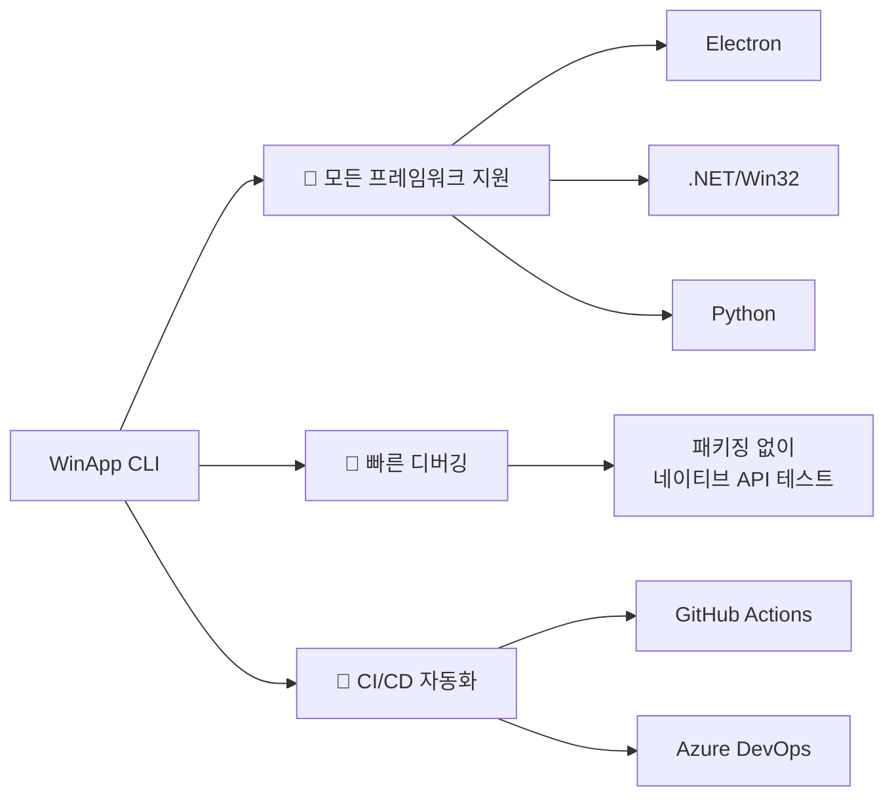
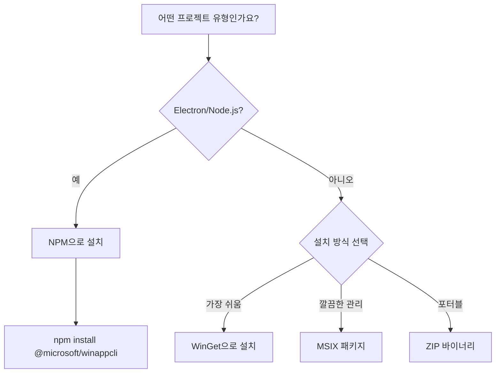
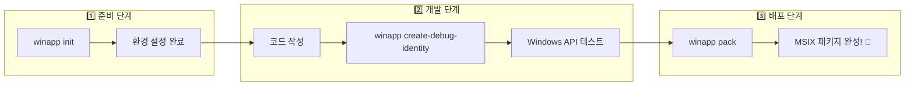
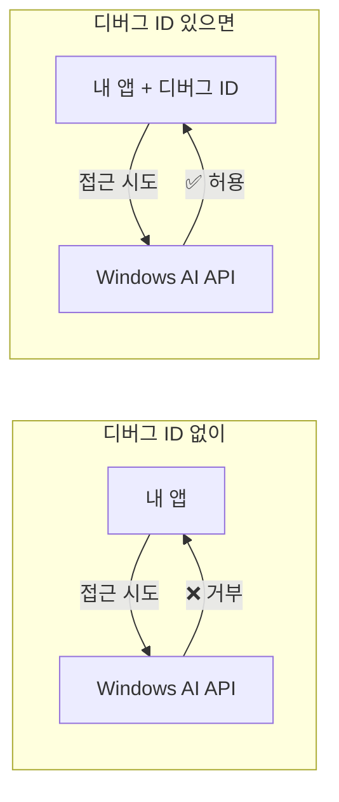
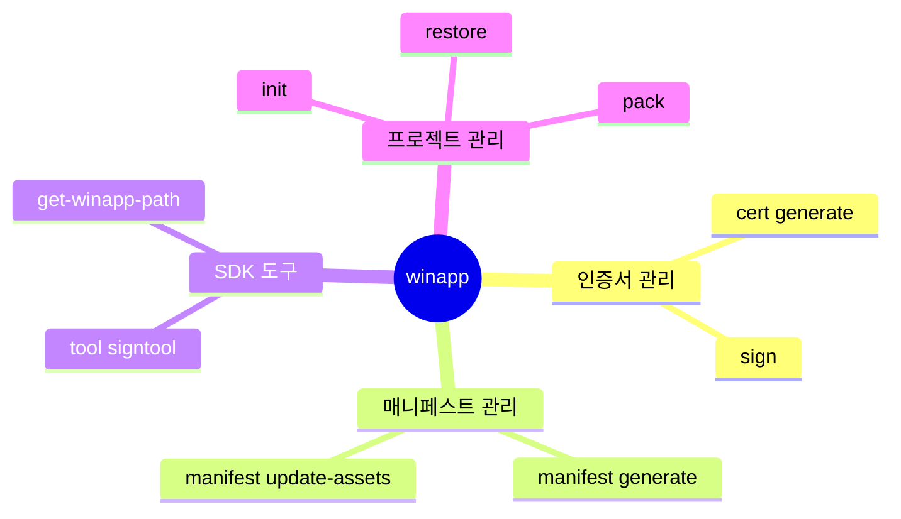
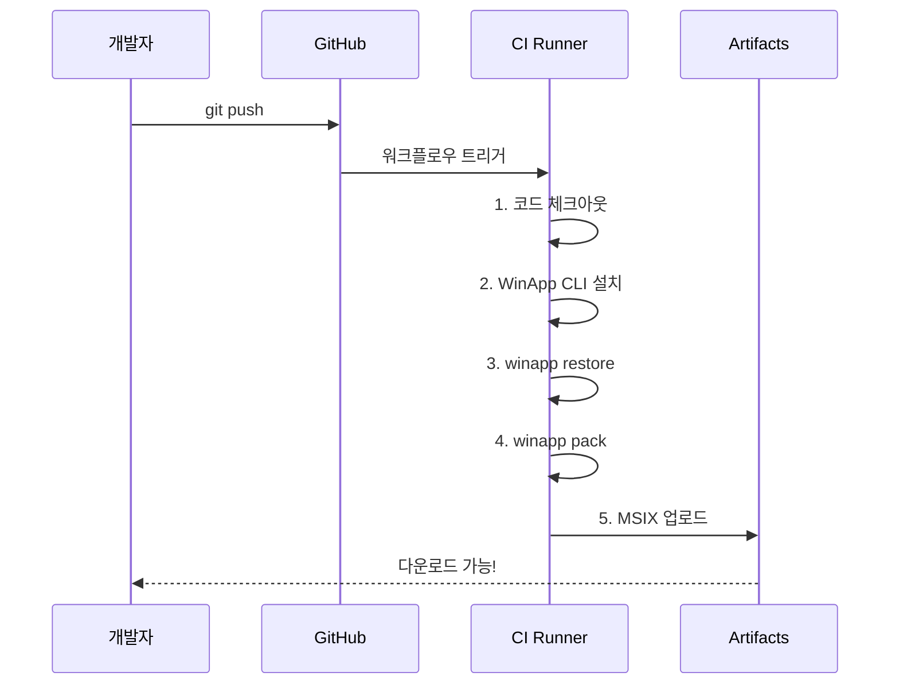
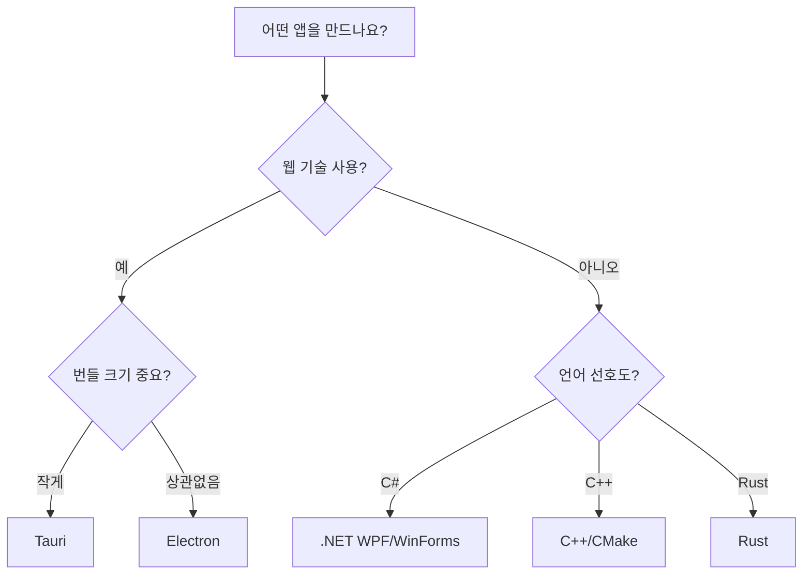

# WinApp CLI 완전 정복 🪟

> *"복잡한 Windows 개발 환경 설정을 단 하나의 명령어로!"*

---

## 🌟 프롤로그: 이 가이드 사용법

> [!tip] 📝 초보 개발자를 위한 가이드
> 이 문서는 **WinApp CLI**를 처음 사용하는 개발자를 위해 작성되었습니다.
> - 🎯 **목표**: Windows 앱 개발 환경 설정부터 배포까지 한 번에!
> - 📖 **구성**: 개념 설명 → 실습 명령어 → 문제 해결 순서로 진행
> - ⚠️ **주의**: 현재 **Public Preview** 단계로, 일부 기능이 변경될 수 있습니다.

---

## 📑 목차

> [!abstract]- 기초편 (1~4장)
> | 장 | 제목 | 내용 |
> |:---:|------|------|
> | 1 | WinApp CLI가 뭔가요? | 개념 소개 및 장점 |
> | 2 | 설치 준비 | 요구사항 확인 방법 |
> | 3 | WinApp CLI 설치하기 | WinGet, NPM, MSIX 설치 |
> | 4 | 개발 워크플로우 | 전체 흐름 이해 |

> [!abstract]- 실전편 (5~8장)
> | 장 | 제목 | 내용 |
> |:---:|------|------|
> | 5 | 프로젝트 초기화 | `winapp init` 사용법 |
> | 6 | 디버그 ID 추가 | ⭐ 핵심 기능! |
> | 7 | MSIX 패키징 및 서명 | 배포 준비 |
> | 8 | 유용한 추가 명령어 | 고급 옵션들 |

> [!abstract]- 운영편 (9~10장)
> | 장 | 제목 | 내용 |
> |:---:|------|------|
> | 9 | 문제 해결 가이드 | 오류 대응법 |
> | 10 | CI/CD 자동화 | GitHub Actions, Azure DevOps |

> [!abstract]- 심화편 (11~14장)
> | 장 | 제목 | 내용 |
> |:---:|------|------|
> | 11 | 주요 용어 사전 | 개념 정리 |
> | 12 | Windows AI 통합 | Phi Silica 연동 |
> | 13 | 프레임워크별 가이드 | .NET, Rust, Tauri 등 |
> | 14 | Visual Studio와의 비교 | 언제 무엇을 쓸까? |

> [!abstract]- 부록
> | 섹션 | 내용 |
> |------|------|
> | 마스터 치트시트 | 명령어 빠른 참조 |
> | 참고 자료 | 공식 문서 및 리소스 |

---

## 📖 1장: WinApp CLI가 뭔가요?

### 🎭 이야기: 요리사와 주방 도구

수진이는 레스토랑 요리사입니다. 요리할 때마다 이런 과정이 필요했죠:
1. 냉장고에서 재료 꺼내기
2. 칼, 도마, 냄비 준비하기
3. 가스레인지 예열하기
4. 각 도구 세척 상태 확인하기

매번 이걸 반복하니 피곤했어요. 그래서 **준비 버튼**을 만들었습니다!
버튼 하나로 모든 준비가 자동으로 완료되죠.

**WinApp CLI**가 바로 그 "준비 버튼"입니다! 🔘

### 💡 핵심 개념

> [!info] WinApp CLI란?
> **WinApp CLI**(winapp)는 Windows 앱 개발에 필요한 모든 설정을 **단일 명령어**로 해결하는 도구입니다.
>
> 이전에는 개발자가 수동으로 해야 했던 일들:
> - Windows SDK 다운로드 및 설치
> - 앱 ID 생성
> - 매니페스트 파일 작성
> - 인증서 생성 및 관리
> - MSIX 패키징
>
> **WinApp CLI**를 사용하면 이 모든 것이 **자동화**됩니다!

### 🎯 WinApp CLI의 3가지 핵심 장점



| 장점 | 설명 | 예시 |
|------|------|------|
| 🔌 **모든 프레임워크 지원** | Electron, .NET, Python 등 어떤 환경이든 OK | Electron 앱에 Windows 알림 추가 |
| 🐛 **빠른 디버깅** | 전체 패키징 없이 Windows API 테스트 가능 | Windows AI 기능 즉시 테스트 |
| 🤖 **CI/CD 친화적** | 스크립트 기반으로 자동화 파이프라인 연동 | GitHub Actions에서 자동 빌드 |

### ✅ 5살에게 설명하기

> [!quote] 👶 쉬운 설명
> "레고 세트 사면 설명서 보고 하나씩 조립해야 하잖아?
> WinApp CLI는 **'레고 자동 조립 기계'**야!
> 버튼 하나 누르면 레고가 완성되는 것처럼,
> 명령어 하나로 Windows 앱 만들 준비가 끝나!"

---

## 📖 2장: 설치 준비 - 시작 전 체크리스트

### 💻 필수 요구사항

> [!warning] 설치 전 확인하세요!
> 아래 조건을 충족해야 WinApp CLI를 사용할 수 있습니다.

| 항목 | 요구사항 | 확인 방법 |
|------|----------|----------|
| **운영체제** | Windows 10 Build 17763 (버전 1809) 이상 | `winver` 실행 |
| **아키텍처** | x64 또는 ARM64 | 설정 → 시스템 → 정보 |
| **패키지 관리자** | WinGet (권장) | `winget --version` |
| **Electron 사용 시** | Node.js & NPM | `node --version` |

### 🔍 요구사항 확인하는 방법

> [!example] Step 1: Windows 버전 확인
> **이렇게 하세요:**
> 1. `Win + R` 키를 눌러 실행 창을 엽니다
> 2. `winver`를 입력하고 Enter
> 3. "버전 1809" 이상인지 확인
>
> **확인 포인트:**
> ```
> Version 1809 (OS Build 17763.xxxx)  ✅ OK
> Version 1803 이하                    ❌ 업데이트 필요
> ```

> [!example] Step 2: WinGet 설치 확인
> **PowerShell에서 실행:**
> ```powershell
> winget --version
> ```
>
> **결과 예시:**
> ```
> v1.6.3133  ✅ OK - WinGet이 설치되어 있습니다
> ```
>
> **에러가 나면?**
> Microsoft Store에서 "앱 설치 관리자"를 검색하여 설치하세요.

---

## 📖 3장: WinApp CLI 설치하기

### 🛠️ 설치 방법 선택



### 📦 방법 1: WinGet으로 전역 설치 (추천)

> [!tip] 🌟 일반적인 Windows 앱 개발에 추천!
> 시스템 전체에서 `winapp` 명령어를 사용할 수 있습니다.

**설치 명령어:**
```powershell
winget install Microsoft.winappcli --source winget
```

**설치 확인:**
```powershell
winapp --help
```

**성공 시 출력:**
```
WinApp CLI v1.x.x
Usage: winapp <command> [options]

Commands:
  init          Initialize a new project
  pack          Package your app as MSIX
  restore       Restore project dependencies
  ...
```

### 📦 방법 2: NPM으로 프로젝트별 설치 (Electron용)

> [!tip] 🔌 Electron/Node.js 프로젝트에 추천!
> 프로젝트의 `node_modules`에 설치되어 버전 관리가 쉽습니다.

**설치 명령어:**
```bash
npm install @microsoft/winappcli --save-dev
```

**설치 확인:**
```bash
npx winapp --help
```

### 📦 방법 3: 기타 설치 방법

| 방법 | 설치 방식 | 추천 상황 |
|------|----------|----------|
| **MSIX 패키지** | [GitHub Releases](https://github.com/microsoft/WinAppCli/releases)에서 다운로드 후 더블클릭 | 깔끔한 앱 관리 선호 |
| **ZIP 바이너리** | 압축 해제 후 PATH에 수동 추가 | 포터블/이동식 설치 |
| **CI/CD 설정** | `uses: microsoft/setup-WinAppCli@v0.1` | GitHub Actions/Azure DevOps |

### ⚙️ 환경 변수 설정 (선택사항)

> [!info] 캐시 디렉토리 변경
> 기본적으로 WinApp CLI는 `%USERPROFILE%/.winapp`에 SDK와 캐시를 저장합니다.
> 다른 위치를 사용하려면 환경 변수를 설정하세요:
>
> ```powershell
> # PowerShell에서 환경 변수 설정
> $env:WINAPP_CLI_CACHE_DIRECTORY = "D:\WinAppCache"
>
> # 영구 설정 (시스템 환경 변수)
> [Environment]::SetEnvironmentVariable("WINAPP_CLI_CACHE_DIRECTORY", "D:\WinAppCache", "User")
> ```

### ✅ 설치 성공 체크리스트

- [ ] `winapp --help` 또는 `npx winapp --help` 실행 성공
- [ ] 버전 정보 출력 확인
- [ ] 에러 메시지 없음

---

## 📖 4장: 개발 워크플로우 - 전체 흐름 이해하기

### 🗺️ 워크플로우 지도



### 🎭 이야기: 카페 오픈 과정

새 카페를 오픈하는 것과 비교해볼까요?

| 카페 오픈 | WinApp CLI | 명령어 |
|----------|-----------|--------|
| 1️⃣ 인테리어, 기계 설치 | 프로젝트 초기화 | `winapp init` |
| 2️⃣ 임시 운영 허가로 테스트 | 디버그 ID로 테스트 | `winapp create-debug-identity` |
| 3️⃣ 정식 사업자 등록 & 오픈 | MSIX 패키징 & 배포 | `winapp pack` |

---

## 📖 5장: 1단계 - 프로젝트 초기화

### 💡 `winapp init`이란?

> [!info] 프로젝트 초기화
> `winapp init`은 Windows 앱 개발에 필요한 모든 것을 **한 번에 설정**합니다:
> - ✅ Windows SDK 다운로드
> - ✅ 매니페스트 파일 생성 (`AppxManifest.xml`)
> - ✅ 프로젝트 설정 파일 생성 (`winapp.yaml`)
> - ✅ 개발용 인증서 설정

### 🔧 실행 방법

> [!example] 프로젝트 초기화하기 (대화형)
> **📝 명령어:**
> ```bash
> # 프로젝트 폴더로 이동
> cd C:\MyProjects\MyAwesomeApp
>
> # 초기화 시작 (대화형)
> winapp init
> ```
>
> **👀 진행 과정:**
> ```
> ? What is your app name? MyAwesomeApp
> ? Select your app type: Electron
> ? Windows SDK version: 10.0.22621.0
>
> ✓ Creating winapp.yaml
> ✓ Downloading Windows SDK...
> ✓ Generating AppxManifest.xml
> ✓ Setting up certificates
>
> ✅ Project initialized successfully!
> ```

### 🎛️ 고급 초기화 옵션

> [!example] 비대화형 초기화 (CI/CD용)
> **📝 명령어:**
> ```bash
> # 기본값으로 자동 초기화 (질문 없이 진행)
> winapp init ./my-project --use-defaults
> ```
>
> **용도:** CI/CD 파이프라인에서 사용자 입력 없이 자동화

> [!example] 프리뷰 SDK 포함 설정
> **📝 명령어:**
> ```bash
> # 실험적 Windows API 포함 (Phi Silica 등)
> winapp init --setup-sdks experimental
>
> # 안정 버전만 사용 (프로덕션 권장)
> winapp init --setup-sdks stable
> ```
>
> **용도:**
> - `experimental`: 최신 Windows AI API(Phi Silica) 등 프리뷰 기능 테스트
> - `stable`: 프로덕션 배포용 안정 버전

> [!example] SDK 업데이트
> **📝 명령어:**
> ```bash
> # 최신 안정 SDK로 업데이트
> winapp update --setup-sdks stable
> ```
>
> **용도:** 기존 프로젝트의 SDK를 최신 버전으로 업그레이드

### 📁 생성되는 파일들

```
MyAwesomeApp/
├── winapp.yaml           ← 프로젝트 설정 (Git에 커밋!)
├── AppxManifest.xml      ← Windows 앱 매니페스트 (Git에 커밋!)
├── Assets/               ← 자동 생성된 아이콘들 (Git에 커밋!)
│   ├── Square44x44Logo.png
│   ├── Square150x150Logo.png
│   └── StoreLogo.png
└── .winapp/              ← 캐시 및 인증서 (Git에서 제외!)
    ├── sdk/
    └── certs/
```

> [!warning] Git 커밋 시 주의!
> - ✅ `winapp.yaml`, `AppxManifest.xml` → **커밋하세요**
> - ❌ `.winapp/` 폴더 → **.gitignore에 추가하세요**

### 👥 팀 협업 설정

> [!example] 팀원이 프로젝트를 받았을 때
> 다른 팀원은 `winapp restore`로 동일한 환경을 구축합니다:
>
> ```bash
> # 프로젝트 클론 후
> git clone https://github.com/team/MyAwesomeApp.git
> cd MyAwesomeApp
>
> # 환경 복원
> winapp restore
> ```
>
> **결과:**
> - SDK 자동 다운로드
> - 로컬 인증서 생성
> - 팀 전체가 **동일한 개발 환경** 유지!

---

## 📖 6장: 2단계 - 디버그 ID 추가 (핵심 기능!)

### 🎭 이야기: 임시 출입증

회사 건물에 들어가려면 **출입증**이 필요합니다.
정직원이 되기 전, 인턴은 **임시 출입증**을 받아 일할 수 있죠.

**디버그 ID**는 바로 이 **"임시 출입증"**입니다!

### 💡 왜 디버그 ID가 필요한가요?

> [!warning] Windows의 보안 규칙
> Windows의 일부 고급 API(알림, Windows AI 등)는 **Package Identity**가 있는 앱만 사용할 수 있습니다.
>
> **문제:** 개발 중에는 아직 MSIX로 패키징하지 않았는데...
> **해결:** 디버그 ID로 **임시 신분증**을 부여!



### 🔧 실행 방법

#### 일반 앱 (EXE)

> [!example] EXE 파일에 디버그 ID 추가
> **📝 명령어:**
> ```bash
> winapp create-debug-identity ./bin/MyApp.exe
> ```
>
> **👀 결과:**
> ```
> ✓ Creating sparse package manifest
> ✓ Registering debug identity
> ✓ Linking to MyApp.exe
>
> ✅ Debug identity applied!
>    Package ID: MyAwesomeApp_1.0.0.0_x64__debug
>    Valid until: (system restart)
> ```

#### Electron 앱

> [!example] Electron 앱에 디버그 ID 추가
> **📝 명령어:**
> ```bash
> npx winapp node add-electron-debug-identity
> ```
>
> **👀 결과:**
> ```
> ✓ Detecting Electron installation
> ✓ Creating sparse package
> ✓ Registering with Windows
>
> ✅ Electron app now has Package Identity!
> ```

### 🧠 작동 원리 (알아두면 좋은 지식)

> [!abstract] Sparse Package란?
> **Sparse Package**는 Windows의 특별한 기능입니다:
>
> - 📄 최소한의 **매니페스트만** 등록
> - 📂 실제 파일은 **원래 위치**에 그대로 유지
> - 🔄 코드 수정 → 즉시 실행 → **ID 유지!**
>
> 덕분에 개발 중에 **빌드 → 테스트**를 빠르게 반복할 수 있습니다.

### ✅ 5살에게 설명하기

> [!quote] 👶 쉬운 설명
> "놀이공원 가면 손목에 팔찌 채워주잖아?
> 디버그 ID는 **'개발자 팔찌'**야!
> 이게 있으면 Windows의 특별한 놀이기구도 탈 수 있어!"

---

## 📖 7장: 3단계 - MSIX 패키징 및 서명

### 🎭 이야기: 선물 포장

친구 생일 선물을 줄 때:
1. 선물(앱)을 예쁜 박스에 넣고 🎁
2. 내 이름으로 카드를 붙여서 (서명) ✍️
3. 전달!

**MSIX 패키징**이 바로 이 "선물 포장" 과정입니다!

### 💡 MSIX란?

> [!info] MSIX 패키지
> **MSIX**는 Windows 10/11의 **표준 앱 패키지 형식**입니다.
>
> | 특징 | 설명 |
> |------|------|
> | 📦 **단일 파일** | 앱의 모든 것이 하나의 `.msix` 파일에 |
> | 🔒 **서명 필수** | 신뢰할 수 있는 앱임을 증명 |
> | 🧹 **깔끔한 설치/제거** | 레지스트리 오염 없음 |
> | 🏪 **스토어 배포** | Microsoft Store에 등록 가능 |

### 🔧 실행 방법

> [!example] MSIX 패키지 생성하기
> **📝 명령어:**
> ```bash
> # dist 폴더를 MSIX로 패키징 (인증서 자동 생성)
> winapp pack ./dist --generate-cert
> ```
>
> **👀 결과:**
> ```
> ✓ Validating project structure
> ✓ Generating self-signed certificate
> ✓ Creating MSIX package...
> ✓ Signing package
>
> ✅ Package created: MyAwesomeApp_1.0.0.0_x64.msix
>    Size: 45.2 MB
>    Certificate: .winapp/certs/dev.pfx
> ```

### 📋 패키징 옵션 상세 설명

| 옵션 | 설명 | 사용 시점 |
|------|------|----------|
| `--generate-cert` | 개발용 인증서 자동 생성 | 🏠 로컬 개발/테스트 |
| `--self-contained` | Windows App SDK 런타임 포함 | 📦 런타임 미설치 PC에 배포 |
| `--output <파일명>` | 출력 파일 이름 지정 | 📝 특정 이름 필요 시 |

> [!example] 옵션 조합 예시
> **완전한 독립 패키지 생성:**
> ```bash
> winapp pack ./dist \
>   --generate-cert \
>   --self-contained \
>   --output MyApp_v1.0.0_Standalone.msix
> ```
>
> **결과:**
> - Windows App SDK 런타임 포함
> - 어떤 PC에서든 바로 실행 가능
> - 파일 크기는 더 커짐 (약 100MB+)

### ✅ 5살에게 설명하기

> [!quote] 👶 쉬운 설명
> "장난감 가게에서 파는 장난감은 예쁜 상자에 들어있잖아?
> MSIX는 **'장난감 상자'**야!
> 상자에 담아야 다른 사람한테 줄 수 있어!"

---

## 📖 8장: 유용한 추가 명령어

### 📋 명령어 한눈에 보기



### 🔐 인증서 관련 명령어

> [!example] 인증서 생성 (기본)
> **📝 명령어:**
> ```bash
> winapp cert generate
> ```
>
> **용도:** 개발용 자체 서명 인증서 수동 생성

> [!example] 인증서 생성 (상세 옵션)
> **📝 명령어:**
> ```bash
> # 게시자 이름과 출력 경로 지정
> winapp cert generate --publisher "CN=My Company" --output ./certs/dev.pfx
> ```
>
> **옵션:**
> | 옵션 | 설명 |
> |------|------|
> | `--publisher` | 인증서 게시자 이름 (예: "CN=Development Team") |
> | `--output` | 인증서 파일 출력 경로 |

> [!example] 인증서 설치 (관리자 권한 필요)
> **📝 명령어:**
> ```bash
> winapp cert install ./dev.pfx
> ```
>
> **용도:** 생성된 인증서를 시스템에 설치 (MSIX 설치 시 신뢰 경고 제거)

> [!example] MSIX에 서명하기
> **📝 명령어:**
> ```bash
> # 기본 서명
> winapp sign MyApp.msix
>
> # 특정 인증서로 서명 (비밀번호 포함)
> winapp sign MyApp.msix --cert ./cert.pfx --cert-password "mypassword"
> ```
>
> **용도:** 이미 만들어진 MSIX 패키지에 서명 추가

### 📄 매니페스트 관련 명령어

> [!example] 매니페스트 생성 (기본)
> **📝 명령어:**
> ```bash
> winapp manifest generate
> ```
>
> **용도:** `AppxManifest.xml` 파일 새로 생성

> [!example] 매니페스트 생성 (상세 옵션)
> **📝 명령어:**
> ```bash
> winapp manifest generate \
>   --package-name "MyCompany.MyApp" \
>   --publisher-name "CN=My Company" \
>   --entrypoint "./dist/myapp.exe"
> ```
>
> **옵션:**
> | 옵션 | 설명 | 예시 |
> |------|------|------|
> | `--package-name` | 패키지 식별자 | `"MyCompany.MyApp"` |
> | `--publisher-name` | 게시자 DN | `"CN=My Company"` |
> | `--entrypoint` | 실행 파일 경로 | `"./dist/myapp.exe"` |

> [!example] 아이콘 자동 생성
> **📝 명령어:**
> ```bash
> # 기본 (현재 Assets 폴더 기준)
> winapp manifest update-assets
>
> # 소스 이미지 지정 (권장: 512x512 이상)
> winapp manifest update-assets ./my-logo.png
> ```
>
> **용도:** 하나의 고해상도 이미지에서 필요한 모든 크기의 아이콘 자동 생성!
> - Square44x44Logo, Square150x150Logo, StoreLogo 등
> - Store 로고, 타일 이미지 등 모두 자동 생성

### 🔌 Electron 전용 명령어

> [!example] 네이티브 애드온 생성
> **📝 명령어:**
> ```bash
> npx winapp node create-addon --name windowsNative
> ```
>
> **용도:** Windows API를 사용하는 C++ 또는 C# 네이티브 애드온 스캐폴딩
>
> **생성되는 구조:**
> ```
> windowsNative/
> ├── binding.gyp
> ├── src/
> │   └── addon.cpp
> └── package.json
> ```

### 🔧 SDK 도구 접근

> [!example] SDK 경로 확인
> **📝 명령어:**
> ```bash
> winapp get-winapp-path
> ```
>
> **용도:** 설치된 SDK 구성 요소 경로 확인

> [!example] SDK 도구 직접 사용
> **📝 명령어:**
> ```bash
> winapp tool signtool verify MyApp.msix
> ```
>
> **용도:** Windows SDK의 signtool 등 도구에 직접 접근

---

## 📖 9장: 문제 해결 가이드

### 🐛 자주 발생하는 오류

> [!danger] Electron 앱 충돌/빈 화면
> **증상:**
> - 디버그 ID 적용 후 Electron 앱이 충돌
> - 앱이 실행되지만 빈 화면만 표시
>
> **원인:**
> Sparse Package 기능이 일부 구형 Windows 빌드에서 충돌 발생
>
> **해결법:**
> Electron 실행 시 `--no-sandbox` 플래그 추가:
> ```bash
> # package.json의 scripts 수정
> "dev": "electron . --no-sandbox"
> ```
>
> 또는 직접 실행:
> ```bash
> npx electron . --no-sandbox
> ```

> [!danger] SDK 경로 오류
> **증상:**
> ```
> Error: Windows SDK not found at expected path
> ```
>
> **원인:**
> - 환경 변수 설정 문제
> - SDK 설치 누락
>
> **해결법:**
> 1. SDK 경로 확인:
>    ```bash
>    winapp get-winapp-path
>    ```
>
> 2. 프로젝트 환경 재구축:
>    ```bash
>    winapp restore
>    ```

> [!warning] 인증서 만료/신뢰 문제
> **증상:**
> - MSIX 설치 시 "신뢰할 수 없는 게시자" 경고
>
> **해결법:**
> 1. 새 인증서 생성:
>    ```bash
>    winapp cert generate
>    ```
>
> 2. 인증서를 신뢰할 수 있는 루트에 추가:
>    - 생성된 `.cer` 파일 더블클릭
>    - "인증서 설치" → "로컬 컴퓨터" → "신뢰할 수 있는 루트 인증 기관"

### 🔍 디버깅 팁

> [!tip] 자세한 로그 보기
> 문제 진단을 위해 상세 로그를 확인하세요:
> ```bash
> winapp pack ./dist --verbose
> ```

---

## 📖 10장: CI/CD 자동화

### 🤖 GitHub Actions 설정

> [!example] 자동 빌드 워크플로우
> **📝 `.github/workflows/build.yml` 파일:**
> ```yaml
> name: Build Windows App
> on: [push]
>
> jobs:
>   build:
>     runs-on: windows-latest
>     steps:
>     # 1️⃣ 코드 체크아웃
>     - uses: actions/checkout@v4
>
>     # 2️⃣ WinApp CLI 설치
>     - uses: microsoft/setup-WinAppCli@v0.1
>
>     # 3️⃣ 환경 복원
>     - name: Restore environment
>       run: winapp restore
>
>     # 4️⃣ MSIX 패키징
>     - name: Package MSIX
>       run: winapp pack ./bin/Release --generate-cert --output MyApp.msix
>
>     # 5️⃣ 아티팩트 업로드
>     - uses: actions/upload-artifact@v4
>       with:
>         name: msix-package
>         path: MyApp.msix
> ```

### 📊 워크플로우 다이어그램



### 🔷 Azure DevOps 설정

> [!example] Azure DevOps 파이프라인
> **📝 `azure-pipelines.yml` 파일:**
> ```yaml
> trigger:
>   - main
>
> pool:
>   vmImage: 'windows-latest'
>
> steps:
> # 1️⃣ 코드 체크아웃
> - checkout: self
>
> # 2️⃣ WinApp CLI 설치
> - task: UseWinAppCLI@0
>   displayName: 'Install WinApp CLI'
>
> # 3️⃣ 환경 복원
> - script: winapp restore
>   displayName: 'Restore environment'
>
> # 4️⃣ 빌드 (프레임워크에 따라 조정)
> - script: dotnet build -c Release
>   displayName: 'Build application'
>
> # 5️⃣ MSIX 패키징
> - script: winapp pack ./bin/Release --generate-cert --output $(Build.ArtifactStagingDirectory)/MyApp.msix
>   displayName: 'Package MSIX'
>
> # 6️⃣ 아티팩트 게시
> - task: PublishBuildArtifacts@1
>   inputs:
>     pathToPublish: '$(Build.ArtifactStagingDirectory)'
>     artifactName: 'msix-package'
> ```

### 🔧 CI/CD 관련 리소스

| 리소스 | 설명 | 링크 |
|--------|------|------|
| **setup-WinAppCli** | GitHub Action 및 Azure DevOps 확장 | [GitHub](https://github.com/microsoft/setup-WinAppCli) |
| **샘플 워크플로우** | 다양한 프레임워크 예시 | [samples/](https://github.com/microsoft/WinAppCli/tree/main/samples) |

---

## 📖 11장: 주요 용어 사전

> [!abstract] 📚 용어 정리
> 이 섹션에서는 문서에 나온 전문 용어들을 쉽게 설명합니다.

### Package Identity (패키지 ID)

> [!note] 앱의 신분증
> Windows가 앱을 식별하는 **고유 ID**입니다.
>
> **왜 필요한가요?**
> - Windows의 고급 API (알림, Windows AI 등) 사용에 필수
> - 앱 간 구분을 위해
>
> **비유:** 주민등록번호처럼, 각 앱을 구별하는 번호

### Sparse Package (스파스 패키지)

> [!note] 가벼운 패키지
> 매니페스트만 등록하고, 실제 파일은 **원래 위치에 유지**하는 방식입니다.
>
> **장점:**
> - 빠른 개발 사이클 (빌드 → 테스트 반복)
> - 전체 패키징 오버헤드 제거
>
> **비유:** 집 주소만 등록하고, 실제 가구는 옮기지 않는 것

### MSIX

> [!note] Windows 앱 포장 상자
> Windows 10 이상의 **표준 앱 패키지 형식**입니다.
>
> **특징:**
> - 설치/제거가 깔끔 (레지스트리 오염 없음)
> - 자동 업데이트 지원
> - Microsoft Store 배포 가능
>
> **비유:** 앱을 담는 표준 택배 상자

### Windows App SDK

> [!note] Windows 기능 도구 상자
> WinUI 3, Windows AI 등 **최신 Windows 기능**을 제공하는 API 세트입니다.
>
> **특징:**
> - 모든 앱 프레임워크에서 사용 가능
> - 최신 Windows 기능 접근
>
> **비유:** Windows의 고급 기능들이 담긴 도구 상자

### winapp.yaml

> [!note] 프로젝트 설정 파일
> WinApp CLI 프로젝트의 **구성 정보**를 담은 파일입니다.
>
> **포함 내용:**
> - SDK 버전
> - 프로젝트 설정
> - 빌드 옵션
>
> **중요:** Git에 커밋하여 팀원 간 환경 일치 보장!

---

## 📖 12장: Windows AI 통합 (Phi Silica)

### 🤖 Windows AI란?

> [!info] Phi Silica - 로컬 AI 모델
> **Windows AI API**는 Microsoft의 로컬 언어 모델 **Phi Silica**를 활용하여
> **인터넷 연결 없이** 디바이스에서 직접 AI 기능을 실행할 수 있게 합니다.
>
> **요구 사항:**
> - Windows 11 **Copilot+ PC**
> - Phi Silica 모델이 사전 설치된 디바이스
> - Package Identity 필요 (WinApp CLI가 해결!)

### 🔧 Electron에서 Windows AI 사용하기

> [!example] Windows AI 애드온 설치
> **📝 설치 명령어:**
> ```bash
> # WinApp CLI와 Windows AI 패키지 함께 설치
> npm install @microsoft/winappcli @microsoft/winapp-windows-ai --save-dev
>
> # 프로젝트 초기화 (experimental SDK 포함)
> npx winapp init --setup-sdks experimental
>
> # 디버그 ID 추가 (AI API 접근에 필수!)
> npx winapp node add-electron-debug-identity
> ```
>
> **JavaScript에서 사용:**
> ```javascript
> const { WindowsAI } = require('@microsoft/winapp-windows-ai');
>
> async function generateText(prompt) {
>     const ai = new WindowsAI();
>     const response = await ai.complete(prompt);
>     return response.text;
> }
>
> // 사용 예시
> generateText("서울의 날씨를 알려줘").then(console.log);
> ```

### ⚠️ Windows AI 주의사항

> [!warning] 제한 사항
> - **Copilot+ PC 전용**: 일반 Windows PC에서는 작동하지 않음
> - **Package Identity 필수**: `create-debug-identity` 또는 MSIX 패키징 필요
> - **실험적 기능**: API가 변경될 수 있음

---

## 📖 13장: 프레임워크별 가이드

### 🔗 공식 프레임워크 문서

WinApp CLI는 다양한 프레임워크를 지원합니다. 각 프레임워크별 상세 가이드는 공식 저장소에서 확인하세요:

| 프레임워크 | 문서 링크 | 지원 상태 |
|-----------|----------|----------|
| **Electron** | [guides/electron.md](https://github.com/microsoft/WinAppCli/blob/main/docs/guides/electron.md) | ✅ 완전 지원 |
| **.NET/WPF/WinForms** | [guides/dotnet.md](https://github.com/microsoft/WinAppCli/blob/main/docs/guides/dotnet.md) | ✅ 완전 지원 |
| **C++/CMake** | [guides/cpp.md](https://github.com/microsoft/WinAppCli/blob/main/docs/guides/cpp.md) | ✅ 완전 지원 |
| **Rust** | [guides/rust.md](https://github.com/microsoft/WinAppCli/blob/main/docs/guides/rust.md) | ✅ 완전 지원 |
| **Tauri** | [guides/tauri.md](https://github.com/microsoft/WinAppCli/blob/main/docs/guides/tauri.md) | ✅ 완전 지원 |
| **Python** | (개발 중) | 🧪 실험적 |
| **Node.js** | (개발 중) | 🧪 실험적 |

### 🎯 프레임워크 선택 가이드



---

## 📖 14장: Visual Studio와의 비교

### 🆚 WinApp CLI vs Visual Studio

> [!question] "Visual Studio가 있는데 왜 WinApp CLI를 쓰나요?"

| 항목 | Visual Studio | WinApp CLI |
|------|--------------|------------|
| **타겟 사용자** | IDE 중심 .NET/C++ 개발자 | 터미널 중심, 크로스 플랫폼 개발자 |
| **설치 크기** | 수 GB (워크로드별) | 수십 MB |
| **설정 방식** | GUI 워크로드 설치 | CLI 명령어 (완전 스크립트화) |
| **디버그 ID** | 패키징 프로젝트 설정 필요 | `winapp create-debug-identity` 한 줄 |
| **CI/CD** | VS 설치 필요 (무거움) | 경량 CLI만 설치 |
| **지원 프레임워크** | .NET, C++ 중심 | Electron, Rust, Tauri 등 모두 |

### 🎯 언제 무엇을 사용할까?

> [!tip] Visual Studio 추천
> - 순수 .NET (WPF, WinForms, MAUI) 개발
> - 디버거, 프로파일러 등 고급 IDE 기능 필요
> - Microsoft 생태계 중심 개발

> [!tip] WinApp CLI 추천
> - Electron, Tauri, Rust 등 비-MS 프레임워크 사용
> - CI/CD 파이프라인 자동화 중시
> - VS 없이 가볍게 Windows 기능 추가
> - 터미널/CLI 워크플로우 선호

> [!note] 함께 사용 가능!
> WinApp CLI는 Visual Studio를 **대체**하는 것이 아니라 **보완**합니다.
> VS에서 개발하고, CI/CD에서는 WinApp CLI로 패키징하는 조합도 가능합니다.

---

## 🎓 에필로그: 마스터 치트시트

### 📋 명령어 빠른 참조

| 단계 | 명령어 | 설명 |
|------|--------|------|
| **설치** | `winget install Microsoft.winappcli` | CLI 설치 (전역) |
| **설치 (NPM)** | `npm install @microsoft/winappcli` | CLI 설치 (프로젝트) |
| **초기화** | `winapp init` | 프로젝트 환경 설정 |
| **환경 복원** | `winapp restore` | 팀원 환경 동기화 |
| **디버그 ID** | `winapp create-debug-identity ./app.exe` | 테스트용 ID 부여 |
| **Electron ID** | `npx winapp node add-electron-debug-identity` | Electron용 ID |
| **패키징** | `winapp pack ./dist --generate-cert` | MSIX 생성 |
| **서명** | `winapp sign MyApp.msix` | 패키지 서명 |
| **인증서** | `winapp cert generate` | 인증서 생성 |
| **아이콘** | `winapp manifest update-assets` | 아이콘 자동 생성 |

### 🚀 다음 단계

1. [[Electron Windows 알림 구현]] - Windows 알림 API 사용법
2. [[MSIX 자동 업데이트 설정]] - 앱 자동 업데이트 구성
3. [[Microsoft Store 배포 가이드]] - 스토어 등록 방법

---

> [!success] 🎉 축하합니다!
> 이제 WinApp CLI의 핵심을 모두 배웠습니다!
>
> **시작해보세요:**
> ```bash
> # 지금 바로 시작!
> mkdir MyFirstWindowsApp
> cd MyFirstWindowsApp
> winapp init
> ```
>
> 질문이 있으시면 [GitHub Issues](https://github.com/microsoft/winappCli/issues)에서 도움을 받으세요! 😊

---

## 📚 참고 자료

### 📖 공식 문서

| 리소스 | 설명 | 링크 |
|--------|------|------|
| **WinApp CLI GitHub** | 메인 저장소 및 소스 코드 | [github.com/microsoft/winappCli](https://github.com/microsoft/winappCli) |
| **사용 문서** | 상세 사용법 가이드 | [docs/usage.md](https://github.com/microsoft/winappCli/blob/main/docs/usage.md) |
| **샘플 프로젝트** | Electron, WinML 등 예시 | [samples/](https://github.com/microsoft/WinAppCli/tree/main/samples) |
| **MSIX 문서** | MSIX 패키징 공식 문서 | [learn.microsoft.com](https://learn.microsoft.com/en-us/windows/msix/) |
| **Windows App SDK** | WinUI 3, AI API 등 | [learn.microsoft.com](https://learn.microsoft.com/en-us/windows/apps/windows-app-sdk/) |

### 🔧 관련 도구

| 도구 | 설명 | 링크 |
|------|------|------|
| **Windows AI Addon** | Electron용 Windows AI API 패키지 | [github.com/microsoft/winapp-windows-ai](https://github.com/microsoft/winapp-windows-ai) |
| **CI/CD Setup Action** | GitHub Actions/Azure DevOps 설정 | [github.com/microsoft/setup-WinAppCli](https://github.com/microsoft/setup-WinAppCli) |
| **실험적 GUI 버전** | CLI의 GUI 래퍼 (실험적) | [Releases](https://github.com/microsoft/WinAppCli/releases/tag/v0.1.1-gui) |

### 💬 도움 받기

| 채널 | 용도 |
|------|------|
| **GitHub Issues** | 버그 리포트, 기능 요청 |
| **windowsdevelopertoolkit@microsoft.com** | 직접 피드백 |
| **SUPPORT.md** | [지원 가이드](https://github.com/microsoft/WinAppCli/blob/main/SUPPORT.md) |

### 📎 관련 문서 (볼트 내)

- [[Microsoft WinAppCli]] - 영문 심층 기술 문서
- [[Electron Windows 알림 구현]] - Windows 알림 API 사용법
- [[MSIX 자동 업데이트 설정]] - 앱 자동 업데이트 구성

---

*마지막 업데이트: 2026-01-25*
*출처: [Microsoft WinApp CLI 공식 문서](https://github.com/microsoft/winappCli) (2026-01-22 Public Preview)*
