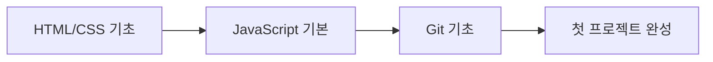
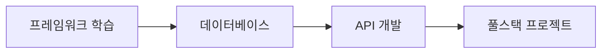
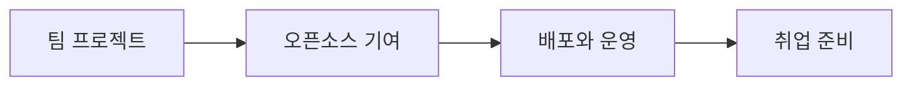

# 🚀 초보 개발자를 위한 AI 시대 코딩 학습 완벽 가이드

> 💡 **한 줄 요약**: 코딩을 시작하는 것은 새로운 언어를 배우는 것과 같아요. AI가 여러분의 개인 튜터가 되어 함께 성장해나갈 거예요!

## 📋 목차
1. [[#들어가며 - 코딩 커피숍 이야기]]
2. [[#AI 시대 개발자가 되는 방법]]
3. [[#필수 개발 도구와 AI 어시스턴트]]
4. [[#수준별 학습 로드맵]]
5. [[#실전 프로젝트 단계별 예제]]
6. [[#자주 하는 실수와 해결법]]
7. [[#용어 사전 - 개발 용어 쉽게 이해하기]]
8. [[#추천 학습 리소스]]

---

## 들어가며 - 코딩 커피숍 이야기

### 🏪 개발자의 일상을 커피숍에 비유해볼까요?

여러분이 **커피숍 매니저**가 되었다고 상상해보세요:
- **프로그래밍 언어** = 커피 레시피 (에스프레소, 라떼, 카푸치노...)
- **코드 작성** = 커피 제조 과정
- **디버깅** = 맛이 이상한 커피 원인 찾기
- **AI 도구** = 자동 커피 머신과 숙련된 바리스타 조언
- **버전 관리(Git)** = 레시피 변경 이력 관리
- **배포** = 완성된 커피를 손님에게 제공

이제 이 비유를 통해 개발 세계로 들어가봅시다!

---

## AI 시대 개발자가 되는 방법

### 🎯 WHY - 왜 지금 AI와 함께 코딩을 배워야 할까?

**전통적인 방법 (2020년 이전)**:
```
책 읽기 → 예제 따라하기 → 오류 발생 → 구글 검색 →
스택오버플로우 → 시행착오 → 해결(혹은 포기)
```

**AI 시대의 방법 (2025년 현재)**:
```
아이디어 → AI와 대화 → 즉시 코드 생성 →
실시간 설명 → 오류 즉시 해결 → 빠른 학습 →
프로젝트 완성 → 포트폴리오 구축
```

### 🎨 WHAT - AI 시대 개발자에게 필요한 것

1. **코딩 기초** (30%) - 논리적 사고와 문제 해결 능력
2. **AI 활용 능력** (40%) - 프롬프트 작성과 AI 도구 활용
3. **창의성** (30%) - 무엇을 만들지 아이디어 구상

---

## 필수 개발 도구와 AI 어시스턴트

### 🛠️ 초보자 필수 도구 세트

#### 🌱 레벨 1: 완전 초보자 (첫 1개월)

**기본 도구 설치 리스트**:
```markdown
1. **코드 에디터**: Visual Studio Code
   - 설치: https://code.visualstudio.com
   - 이유: 무료, 가볍고, AI 확장 프로그램 풍부

2. **AI 어시스턴트**: Claude Code (또는 GitHub Copilot)
   - 설치: https://claude.ai/code
   - 이유: 한국어 지원, 초보자 친화적 설명

3. **버전 관리**: Git + GitHub Desktop
   - 설치: https://desktop.github.com
   - 이유: GUI로 쉽게 시작 가능
```

**첫 프로젝트 - "Hello, AI World!" 웹페이지**:
```html
<!-- index.html - 여러분의 첫 웹페이지! -->
<!DOCTYPE html>
<html lang="ko">
<head>
    <meta charset="UTF-8">
    <title>나의 첫 AI 프로젝트</title>
    <style>
        /* CSS는 웹페이지를 예쁘게 꾸며주는 화장품 같아요 */
        body {
            font-family: Arial, sans-serif;
            background: linear-gradient(135deg, #667eea 0%, #764ba2 100%);
            color: white;
            text-align: center;
            padding: 50px;
        }

        .greeting {
            font-size: 2em;
            animation: fadeIn 2s;
        }

        @keyframes fadeIn {
            from { opacity: 0; }
            to { opacity: 1; }
        }
    </style>
</head>
<body>
    <h1 class="greeting">안녕하세요! AI와 함께 코딩을 시작했어요! 🎉</h1>
    <p>오늘 날짜: <span id="date"></span></p>

    <script>
        // JavaScript는 웹페이지에 생명을 불어넣는 마법 주문이에요
        // 오늘 날짜를 보여주는 간단한 코드
        document.getElementById('date').textContent = new Date().toLocaleDateString('ko-KR');

        // 사용자가 페이지를 방문했을 때 환영 메시지
        console.log('환영합니다! 개발자의 세계로! 🚀');
    </script>
</body>
</html>
```

#### 🌿 레벨 2: 기초 학습자 (2-3개월차)

**중급 도구 추가**:
```markdown
4. **패키지 매니저**: Node.js & npm
   - 설치: https://nodejs.org
   - 이유: JavaScript 라이브러리 관리

5. **AI 코드 리뷰어**: Coderabbit
   - 설치: GitHub 마켓플레이스
   - 이유: 코드 품질 자동 검토

6. **데이터베이스 도구**: TablePlus (또는 DBeaver)
   - 이유: 데이터베이스 시각적 관리
```

**중급 프로젝트 - 할 일 목록 앱**:
```javascript
// todo-app.js - 실용적인 할 일 관리 앱
class TodoApp {
    constructor() {
        // 할 일 목록을 저장할 배열 (마치 쇼핑 리스트처럼!)
        this.todos = JSON.parse(localStorage.getItem('todos')) || [];
        this.render();
    }

    // 새로운 할 일 추가하기
    addTodo(text) {
        // 각 할 일은 객체로 저장 (ID, 내용, 완료 여부)
        const todo = {
            id: Date.now(), // 현재 시간을 ID로 사용
            text: text,
            completed: false
        };

        this.todos.push(todo);
        this.save();
        this.render();

        // AI 어시스턴트에게 물어볼 수 있는 부분:
        // "이 코드에 우선순위 기능을 추가하려면 어떻게 해야 할까?"
    }

    // 할 일 완료 표시
    toggleTodo(id) {
        const todo = this.todos.find(t => t.id === id);
        if (todo) {
            todo.completed = !todo.completed;
            this.save();
            this.render();
        }
    }

    // 로컬 스토리지에 저장 (브라우저를 닫아도 데이터 유지!)
    save() {
        localStorage.setItem('todos', JSON.stringify(this.todos));
    }

    // 화면에 그리기
    render() {
        const app = document.getElementById('app');
        app.innerHTML = `
            <h2>오늘의 할 일 📝</h2>
            <div class="add-todo">
                <input type="text" id="todoInput" placeholder="할 일을 입력하세요">
                <button onclick="app.addTodoFromInput()">추가</button>
            </div>
            <ul class="todo-list">
                ${this.todos.map(todo => `
                    <li class="${todo.completed ? 'completed' : ''}">
                        <input type="checkbox"
                               ${todo.completed ? 'checked' : ''}
                               onchange="app.toggleTodo(${todo.id})">
                        <span>${todo.text}</span>
                    </li>
                `).join('')}
            </ul>
        `;
    }

    // 입력 필드에서 할 일 추가
    addTodoFromInput() {
        const input = document.getElementById('todoInput');
        if (input.value.trim()) {
            this.addTodo(input.value);
            input.value = '';
        }
    }
}

// 앱 시작!
const app = new TodoApp();
```

#### 🌳 레벨 3: 실전 개발자 (4-6개월차)

**고급 도구 세트**:
```markdown
7. **컨테이너**: Docker Desktop
   - 이유: 개발 환경 표준화

8. **API 테스트**: Postman
   - 이유: API 개발 및 테스트

9. **CI/CD**: GitHub Actions
   - 이유: 자동 배포 파이프라인

10. **모니터링**: Sentry
    - 이유: 에러 추적 및 성능 모니터링
```

**고급 프로젝트 - AI 채팅봇 서비스**:
```python
# ai_chatbot.py - Flask와 OpenAI API를 사용한 채팅봇
from flask import Flask, request, jsonify, render_template
import openai
import os
from datetime import datetime

app = Flask(__name__)

# OpenAI API 설정 (환경 변수로 API 키 관리)
openai.api_key = os.environ.get('OPENAI_API_KEY')

class ChatBot:
    """AI 채팅봇 클래스 - 사용자와 대화를 나누는 똑똑한 도우미"""

    def __init__(self):
        # 대화 기록을 저장할 리스트
        self.conversation_history = []

        # 시스템 프롬프트 설정 (챗봇의 성격과 역할 정의)
        self.system_prompt = """
        당신은 친절하고 유용한 AI 어시스턴트입니다.
        초보 개발자들을 돕는 것이 주 임무입니다.
        쉽고 명확한 설명을 제공하며, 항상 격려하는 태도를 유지합니다.
        """

    def get_response(self, user_message: str) -> str:
        """사용자 메시지에 대한 AI 응답 생성"""

        try:
            # 대화 기록에 사용자 메시지 추가
            self.conversation_history.append({
                "role": "user",
                "content": user_message,
                "timestamp": datetime.now().isoformat()
            })

            # OpenAI API 호출
            response = openai.ChatCompletion.create(
                model="gpt-3.5-turbo",
                messages=[
                    {"role": "system", "content": self.system_prompt},
                    *[{"role": msg["role"], "content": msg["content"]}
                      for msg in self.conversation_history[-10:]]  # 최근 10개 메시지만
                ],
                max_tokens=500,
                temperature=0.7  # 창의성 수준 (0~1, 높을수록 창의적)
            )

            # AI 응답 추출
            ai_message = response.choices[0].message.content

            # 대화 기록에 AI 응답 추가
            self.conversation_history.append({
                "role": "assistant",
                "content": ai_message,
                "timestamp": datetime.now().isoformat()
            })

            return ai_message

        except Exception as e:
            # 에러 처리 (사용자에게 친절한 메시지 표시)
            error_message = f"죄송해요, 오류가 발생했어요: {str(e)}"
            return error_message

    def clear_history(self):
        """대화 기록 초기화"""
        self.conversation_history = []
        return "대화 기록이 초기화되었습니다."

# 챗봇 인스턴스 생성
chatbot = ChatBot()

# 라우트 설정
@app.route('/')
def home():
    """홈페이지 렌더링"""
    return render_template('chat.html')

@app.route('/chat', methods=['POST'])
def chat():
    """채팅 API 엔드포인트"""
    data = request.json
    user_message = data.get('message', '')

    if not user_message:
        return jsonify({'error': '메시지가 비어있습니다.'}), 400

    # AI 응답 생성
    response = chatbot.get_response(user_message)

    return jsonify({
        'response': response,
        'timestamp': datetime.now().isoformat()
    })

@app.route('/clear', methods=['POST'])
def clear_chat():
    """대화 기록 초기화 엔드포인트"""
    message = chatbot.clear_history()
    return jsonify({'message': message})

# 에러 핸들러
@app.errorhandler(404)
def not_found(error):
    return jsonify({'error': '페이지를 찾을 수 없습니다.'}), 404

@app.errorhandler(500)
def server_error(error):
    return jsonify({'error': '서버 오류가 발생했습니다.'}), 500

if __name__ == '__main__':
    # 개발 서버 실행 (프로덕션에서는 Gunicorn 등 사용)
    app.run(debug=True, port=5000)
```

---

## 수준별 학습 로드맵

### 📈 6개월 마스터 플랜

#### 🗓️ 1-2개월차: 기초 다지기


**주간 학습 계획**:
- **월/수/금**: 코딩 기초 (2시간)
- **화/목**: AI 도구 활용법 (1시간)
- **주말**: 미니 프로젝트 (3-4시간)

**실전 과제**:
1. 개인 포트폴리오 웹사이트 만들기
2. 간단한 계산기 앱
3. 날씨 정보 표시 앱 (API 활용)

#### 🗓️ 3-4개월차: 실력 향상


**심화 학습 내용**:
- React 또는 Vue.js 프레임워크
- Node.js와 Express
- MongoDB 또는 PostgreSQL
- RESTful API 설계

#### 🗓️ 5-6개월차: 실전 경험


---

## 실전 프로젝트 단계별 예제

### 🎮 프로젝트: 실시간 채팅 애플리케이션

#### Phase 1: 기본 구조 (초급)
```javascript
// 클라이언트 측 - 간단한 채팅 인터페이스
const socket = io(); // Socket.io 연결

// 메시지 전송 함수
function sendMessage() {
    const input = document.getElementById('message');
    const message = input.value;

    // 서버로 메시지 전송
    socket.emit('chat message', {
        text: message,
        timestamp: new Date(),
        user: 'Anonymous'
    });

    input.value = '';
}

// 메시지 수신 처리
socket.on('chat message', (data) => {
    const messages = document.getElementById('messages');
    const messageElement = document.createElement('div');
    messageElement.innerHTML = `
        <strong>${data.user}:</strong> ${data.text}
        <small>${new Date(data.timestamp).toLocaleTimeString()}</small>
    `;
    messages.appendChild(messageElement);
});
```

#### Phase 2: 기능 확장 (중급)
```javascript
// 서버 측 - Node.js + Socket.io
const express = require('express');
const app = express();
const http = require('http').createServer(app);
const io = require('socket.io')(http);

// 연결된 사용자 관리
const users = new Map();

// 채팅방 관리
const rooms = new Map();

io.on('connection', (socket) => {
    console.log('새로운 사용자 연결:', socket.id);

    // 사용자 등록
    socket.on('register', (username) => {
        users.set(socket.id, {
            username: username,
            joinedAt: new Date(),
            currentRoom: 'general'
        });

        // 기본 채팅방 입장
        socket.join('general');

        // 입장 알림
        socket.broadcast.to('general').emit('user joined', {
            username: username,
            message: `${username}님이 입장하셨습니다.`
        });
    });

    // 메시지 처리
    socket.on('chat message', (data) => {
        const user = users.get(socket.id);

        // 메시지 유효성 검사
        if (!data.text || data.text.trim().length === 0) {
            return;
        }

        // 메시지 브로드캐스트
        io.to(user.currentRoom).emit('chat message', {
            username: user.username,
            text: data.text,
            timestamp: new Date(),
            room: user.currentRoom
        });

        // 메시지 저장 (데이터베이스 연동 시)
        saveMessage({
            userId: socket.id,
            username: user.username,
            message: data.text,
            room: user.currentRoom,
            timestamp: new Date()
        });
    });

    // 사용자 연결 해제
    socket.on('disconnect', () => {
        const user = users.get(socket.id);
        if (user) {
            io.to(user.currentRoom).emit('user left', {
                username: user.username,
                message: `${user.username}님이 퇴장하셨습니다.`
            });
            users.delete(socket.id);
        }
    });
});

// 메시지 저장 함수 (MongoDB 예시)
async function saveMessage(messageData) {
    // MongoDB 연동 코드
    // const Message = require('./models/Message');
    // await Message.create(messageData);
    console.log('메시지 저장:', messageData);
}

http.listen(3000, () => {
    console.log('서버가 3000번 포트에서 실행 중입니다.');
});
```

#### Phase 3: 고급 기능 (상급)
```typescript
// TypeScript + Redis + 인증 시스템
import express from 'express';
import { Server } from 'socket.io';
import Redis from 'ioredis';
import jwt from 'jsonwebtoken';
import rateLimit from 'express-rate-limit';

interface User {
    id: string;
    username: string;
    avatar?: string;
    status: 'online' | 'away' | 'offline';
}

interface Message {
    id: string;
    userId: string;
    content: string;
    timestamp: Date;
    edited?: boolean;
    reactions?: Map<string, string[]>;
}

class AdvancedChatServer {
    private io: Server;
    private redis: Redis;
    private messageHistory: Map<string, Message[]>;

    constructor() {
        this.redis = new Redis({
            host: 'localhost',
            port: 6379,
            retryStrategy: (times) => Math.min(times * 50, 2000)
        });

        this.messageHistory = new Map();
        this.setupSocketHandlers();
    }

    // JWT 토큰 검증 미들웨어
    private authenticateSocket(socket: any, next: any) {
        const token = socket.handshake.auth.token;

        try {
            const decoded = jwt.verify(token, process.env.JWT_SECRET!);
            socket.userId = decoded.userId;
            next();
        } catch (error) {
            next(new Error('Authentication failed'));
        }
    }

    // 메시지 필터링 (욕설, 스팸 방지)
    private filterMessage(content: string): string {
        // 금지어 필터링
        const bannedWords = ['spam', 'abuse']; // 실제로는 더 복잡한 로직
        let filtered = content;

        bannedWords.forEach(word => {
            const regex = new RegExp(word, 'gi');
            filtered = filtered.replace(regex, '***');
        });

        return filtered;
    }

    // 메시지 암호화 (선택적)
    private encryptMessage(message: string): string {
        // 실제 프로덕션에서는 적절한 암호화 라이브러리 사용
        return Buffer.from(message).toString('base64');
    }

    // 실시간 타이핑 인디케이터
    private handleTypingIndicator(socket: any) {
        let typingTimer: NodeJS.Timeout;

        socket.on('typing', (roomId: string) => {
            socket.to(roomId).emit('user typing', {
                userId: socket.userId,
                username: socket.username
            });

            // 3초 후 타이핑 중지
            clearTimeout(typingTimer);
            typingTimer = setTimeout(() => {
                socket.to(roomId).emit('stop typing', {
                    userId: socket.userId
                });
            }, 3000);
        });
    }

    // 파일 업로드 처리
    private handleFileUpload(socket: any) {
        socket.on('file upload', async (data: any) => {
            const { file, roomId } = data;

            // 파일 크기 제한 (10MB)
            if (file.size > 10 * 1024 * 1024) {
                socket.emit('upload error', '파일이 너무 큽니다.');
                return;
            }

            // S3 또는 로컬 스토리지에 저장
            const fileUrl = await this.saveFile(file);

            // 파일 메시지 브로드캐스트
            this.io.to(roomId).emit('file message', {
                userId: socket.userId,
                fileUrl: fileUrl,
                fileName: file.name,
                fileType: file.type,
                timestamp: new Date()
            });
        });
    }

    private async saveFile(file: any): Promise<string> {
        // AWS S3 업로드 로직
        // const s3 = new AWS.S3();
        // const result = await s3.upload({...}).promise();
        // return result.Location;

        return 'https://example.com/files/sample.pdf';
    }

    // 음성/비디오 통화 시그널링
    private handleWebRTC(socket: any) {
        socket.on('call request', (data: any) => {
            socket.to(data.targetUserId).emit('incoming call', {
                callerId: socket.userId,
                callerName: socket.username,
                callType: data.type // 'audio' or 'video'
            });
        });

        socket.on('webrtc signal', (data: any) => {
            socket.to(data.targetUserId).emit('webrtc signal', {
                signal: data.signal,
                senderId: socket.userId
            });
        });
    }
}

// 사용 예시
const chatServer = new AdvancedChatServer();
```

---

## 자주 하는 실수와 해결법

### ⚠️ 초보자가 자주 겪는 10가지 문제

#### 1. "코드가 작동하지 않아요!"
**문제**: 세미콜론 누락, 괄호 불일치
```javascript
// ❌ 잘못된 코드
function greet(name {  // 괄호 누락!
    console.log("Hello" + name)  // 세미콜론 권장
}

// ✅ 올바른 코드
function greet(name) {
    console.log("Hello " + name);
}
```

#### 2. "변수가 undefined라고 나와요!"
**문제**: 변수 스코프 이해 부족
```javascript
// ❌ 잘못된 코드
function calculate() {
    if (true) {
        let result = 10;
    }
    console.log(result); // Error: result is not defined
}

// ✅ 올바른 코드
function calculate() {
    let result;
    if (true) {
        result = 10;
    }
    console.log(result); // 10
}
```

#### 3. "비동기 처리가 이해가 안 돼요!"
```javascript
// 🌱 초급: 콜백 지옥
getData(function(a) {
    getMoreData(a, function(b) {
        getMoreData(b, function(c) {
            console.log(c);
        });
    });
});

// 🌿 중급: Promise 체이닝
getData()
    .then(a => getMoreData(a))
    .then(b => getMoreData(b))
    .then(c => console.log(c))
    .catch(error => console.error(error));

// 🌳 고급: Async/Await (가장 깔끔!)
async function fetchAllData() {
    try {
        const a = await getData();
        const b = await getMoreData(a);
        const c = await getMoreData(b);
        console.log(c);
    } catch (error) {
        console.error('에러 발생:', error);
    }
}
```

#### 4. "Git 충돌이 생겼어요!"
```bash
# 충돌 해결 단계별 가이드
# 1. 현재 상태 확인
git status

# 2. 충돌 파일 열어서 수정
# <<<<<<< HEAD (내 변경사항)
# 내 코드
# =======
# 다른 사람 코드
# >>>>>>> branch-name (다른 사람 변경사항)

# 3. 충돌 마커 제거하고 원하는 코드만 남기기

# 4. 수정 완료 후 추가
git add .

# 5. 커밋
git commit -m "충돌 해결: [설명]"
```

#### 5. "API 호출이 CORS 에러가 나요!"
```javascript
// 프론트엔드에서 CORS 해결 방법

// 방법 1: 프록시 서버 사용 (개발 환경)
// package.json에 추가
"proxy": "http://localhost:5000"

// 방법 2: 서버 측 CORS 설정 (Express 예시)
const cors = require('cors');
app.use(cors({
    origin: 'http://localhost:3000',
    credentials: true
}));

// 방법 3: 개발 중 임시 해결 (Chrome 확장 프로그램)
// "Allow CORS" 확장 프로그램 설치
```

---

## 용어 사전 - 개발 용어 쉽게 이해하기

### 📖 필수 개발 용어 50선

#### 기초 용어 (누구나 알아야 할 것들)

| 용어 | 쉬운 설명 | 실제 예시 |
|------|----------|----------|
| **변수 (Variable)** | 데이터를 담는 상자 | `let myName = "철수"` |
| **함수 (Function)** | 특정 작업을 수행하는 도구 | 믹서기 = 과일 넣으면 주스 나옴 |
| **배열 (Array)** | 여러 개를 순서대로 담는 리스트 | 쇼핑 리스트 `["우유", "빵", "계란"]` |
| **객체 (Object)** | 관련 정보를 모아놓은 것 | 사람 = {이름: "철수", 나이: 25} |
| **루프 (Loop)** | 반복 작업 | 양치질 10번 반복하기 |
| **조건문 (If/Else)** | 상황에 따라 다르게 행동 | 비 오면 우산, 안 오면 모자 |
| **API** | 서비스끼리 대화하는 방법 | 음식 배달 앱이 식당에 주문 전달 |
| **버그 (Bug)** | 코드의 오류 | 레시피 실수로 짠 음식 나옴 |
| **디버깅 (Debugging)** | 오류 찾아 고치기 | 짠맛 원인 찾아 조미료 조절 |
| **IDE** | 코드 작성 도구 모음 | 요리사의 주방 (모든 도구 구비) |

#### 중급 용어 (실무에서 자주 쓰는 것들)

| 용어 | 쉬운 설명 | 왜 중요한가? |
|------|----------|-------------|
| **프레임워크** | 앱 만들기 틀 | 집 짓는 설계도와 기본 구조 |
| **라이브러리** | 재사용 가능한 코드 모음 | 레고 블록처럼 조립해서 사용 |
| **Git** | 코드 버전 관리 도구 | 문서 작성 히스토리 저장 |
| **브랜치 (Branch)** | 독립적인 작업 공간 | 초안 따로, 최종본 따로 관리 |
| **머지 (Merge)** | 브랜치 합치기 | 여러 사람 작업 하나로 합치기 |
| **풀 리퀘스트 (PR)** | 코드 검토 요청 | "제 숙제 확인해주세요" |
| **CI/CD** | 자동 테스트/배포 | 공장 자동화 라인 |
| **도커 (Docker)** | 앱 실행 환경 패키징 | 이사할 때 컨테이너 |
| **클라우드** | 인터넷 상의 컴퓨터 | 구글 드라이브 같은 것 |
| **서버리스** | 서버 관리 없이 코드 실행 | 자동차 렌트 vs 소유 |

#### 고급 용어 (전문가가 되려면)

| 용어 | 쉬운 설명 | 실전 활용 |
|------|----------|----------|
| **마이크로서비스** | 작은 서비스들의 조합 | 레고처럼 조립하는 앱 |
| **쿠버네티스** | 컨테이너 관리 도구 | 여러 도커를 지휘하는 지휘자 |
| **GraphQL** | 유연한 API 쿼리 언어 | 뷔페에서 원하는 것만 골라담기 |
| **웹소켓** | 실시간 양방향 통신 | 전화 통화처럼 실시간 대화 |
| **레디스 (Redis)** | 빠른 임시 저장소 | 컴퓨터의 메모장 |
| **로드밸런서** | 트래픽 분산 도구 | 여러 계산대로 손님 분산 |
| **JWT** | 인증 토큰 | 놀이공원 자유이용권 |
| **OAuth** | 소셜 로그인 | "구글로 로그인하기" |
| **웹훅 (Webhook)** | 이벤트 알림 시스템 | 택배 도착 알림 |
| **CDN** | 콘텐츠 전송 네트워크 | 전국 편의점 체인 |

---

## 추천 학습 리소스

### 🎓 무료 학습 플랫폼

#### 한국어 리소스
1. **생활코딩** (https://opentutorials.org)
   - 완전 초보자 최적
   - 무료 + 한국어 설명

2. **인프런** (https://inflearn.com)
   - 무료 강의 다수
   - 실무자 강의

3. **프로그래머스** (https://programmers.co.kr)
   - 코딩 테스트 연습
   - 단계별 문제

#### 영어 리소스
1. **freeCodeCamp** (https://freecodecamp.org)
   - 무료 + 체계적 커리큘럼
   - 수료증 발급

2. **The Odin Project** (https://theodinproject.com)
   - 풀스택 개발자 과정
   - 프로젝트 중심

3. **MDN Web Docs** (https://developer.mozilla.org)
   - 웹 개발 바이블
   - 정확한 레퍼런스

### 🤖 AI 도구 활용법

#### AI 코딩 어시스턴트 비교

| 도구 | 장점 | 단점 | 추천 대상 |
|------|------|------|----------|
| **Claude Code** | 한국어 최강, 긴 코드 이해 | 최신 정보 부족 | 초보자, 한국 개발자 |
| **GitHub Copilot** | IDE 통합 최고, 자동 완성 | 유료 ($10/월) | 실무 개발자 |
| **ChatGPT** | 범용성, 다양한 기능 | 코드 특화 부족 | 학습자, 문제 해결 |
| **Cursor** | AI 기반 IDE | 새로운 도구 | 얼리 어답터 |
| **Tabnine** | 오프라인 가능 | 기능 제한적 | 보안 중시 기업 |

#### AI와 효과적으로 대화하는 법

**🌱 초급 프롬프트**:
```
"JavaScript로 버튼 클릭하면 알림창 띄우는 코드 만들어줘"
```

**🌿 중급 프롬프트**:
```
"React를 사용해서 할 일 목록 컴포넌트를 만들어줘.
요구사항:
- 추가/삭제/완료 기능
- 로컬 스토리지 저장
- 깔끔한 UI"
```

**🌳 고급 프롬프트**:
```
"Node.js + TypeScript + Prisma를 사용한 RESTful API를 설계해줘.
도메인: 이커머스
기능: 상품 CRUD, 장바구니, 주문 처리
고려사항:
- 확장 가능한 아키텍처
- 에러 핸들링
- 인증/인가
- 테스트 코드 포함"
```

### 📚 추천 도서

#### 입문자용
1. **"Do it! 첫 코딩"** - 정동균
2. **"코딩 자율학습"** 시리즈
3. **"모두의 파이썬"** - 이승찬

#### 중급자용
1. **"클린 코드"** - 로버트 마틴
2. **"리팩토링"** - 마틴 파울러
3. **"실용주의 프로그래머"**

#### 고급자용
1. **"디자인 패턴"** - GoF
2. **"도메인 주도 설계"** - 에릭 에반스
3. **"마이크로서비스 아키텍처"**

---

## 실전 팁과 조언

### 💡 성공하는 개발자의 7가지 습관

1. **매일 코딩하기** - 하루 30분이라도
2. **에러 메시지 읽기** - 답은 대부분 거기 있음
3. **구글링 잘하기** - 영어로 검색하면 10배 많은 정보
4. **코드 읽기** - 다른 사람 코드에서 배우기
5. **프로젝트 완성하기** - 작아도 끝까지
6. **커뮤니티 참여** - 질문하고 답하기
7. **문서화하기** - 미래의 나를 위해

### 🎯 포트폴리오 만들기

```markdown
## 좋은 포트폴리오 구성

1. **개인 웹사이트** (필수)
   - About Me 페이지
   - 프로젝트 쇼케이스
   - 블로그 (선택)
   - 연락처

2. **GitHub 프로필** (필수)
   - README.md 꾸미기
   - 일일 커밋 (잔디 심기)
   - 의미 있는 프로젝트 3-5개

3. **프로젝트 선정** (중요!)
   - 실제로 사용 가능한 것
   - 문제 해결 중심
   - 코드 품질 > 수량

4. **기술 블로그** (추천)
   - 학습 과정 기록
   - 문제 해결 경험
   - 프로젝트 회고
```

---

## 마무리와 다음 단계

### 🚀 지금 바로 시작할 수 있는 것들

1. **오늘**: VS Code 설치 + Claude Code 가입
2. **이번 주**: 첫 HTML 페이지 만들기
3. **이번 달**: 개인 포트폴리오 사이트 완성
4. **3개월 후**: 첫 풀스택 프로젝트 배포
5. **6개월 후**: 오픈소스 기여 또는 팀 프로젝트

### 🎉 격려의 말

> "모든 전문가도 한때는 초보자였습니다.
> 중요한 것은 시작하는 용기와 포기하지 않는 끈기입니다.
> AI와 함께라면 당신도 할 수 있습니다!"

**기억하세요**:
- 에러는 배움의 기회
- 구글링은 능력
- AI는 도구일 뿐, 창의성은 당신의 것
- 작은 성공을 축하하세요
- 커뮤니티는 당신의 편

---

## 연결된 노트
- [[Claude Code 사용법]]
- [[Git과 GitHub 완벽 가이드]]
- [[JavaScript 30일 마스터]]
- [[AI 프롬프트 엔지니어링]]
- [[웹 개발 로드맵 2025]]
- [[초보자를 위한 데이터베이스]]
- [[API 설계 베스트 프랙티스]]

## 태그
#초보개발자 #AI코딩 #학습가이드 #프로그래밍입문 #웹개발 #코딩교육 #파인만기법 #스토리텔링 #Claude-Code #2025년

---

**📝 노트 업데이트 이력**
- 2025-10-11: 초판 작성, 수준별 예제 추가
- 향후 계획: 실제 프로젝트 사례 추가, 영상 튜토리얼 링크

**💬 피드백 환영**: 이 노트가 도움이 되셨다면, 개선점이나 추가했으면 하는 내용을 알려주세요!